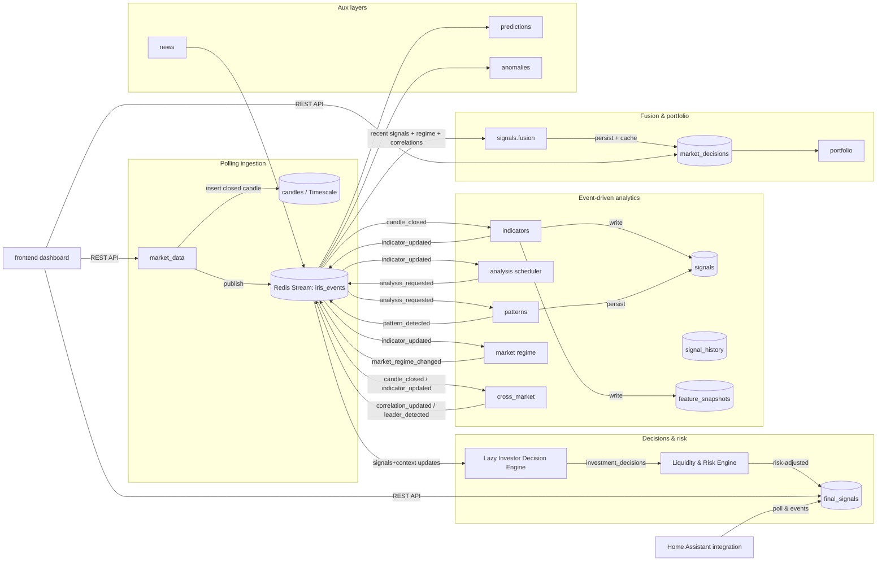

# IRIS (Mesteriis/iris): глубокий разбор репозитория, архитектуры и продуктовой ценности

## Резюме для руководства

Проект IRIS позиционируется как self-hosted сервис «market intelligence», который хранит **каноническое хранилище свечей** и «наращивает» поверх него слой аналитики: индикаторы, паттерны (в т.ч. кластеры/иерархии), режим рынка (regime), кросс-рыночные связи/предсказания, агрегацию сигналов в итоговую позицию рынка и «ленивые» инвестиционные решения с последующей оценкой ликвидности/риска и (опционально) действиями портфельного движка. Это отражено в README, включая детализированный event-driven конвейер на Redis Streams, перечень таблиц и API-эндпоинтов. citeturn29view0turn19view1turn79view0turn79view2turn80view0

Архитектурно IRIS выглядит как **монолитный сервис с выделенными воркерами**, где ingestion остаётся polling-driven (добавление свечей), а внутренние вычисления и оркестрация — event-driven через Redis Streams consumer groups с ACK/повторной доставкой и reclaim («XAUTOCLAIM»). Это даёт хороший базис для масштабирования вычислительных стадий независимо и для устойчивости к падениям воркеров. citeturn19view1turn79view0turn80view0

Сильная сторона репозитория — **детально прописанная «прикладная» логика** в README: формулы скоринга решений/риска, наличие Pattern Success Engine с температурой и rolling-statistics, понятная схема кэширования в Redis, и явно задекларированное покрытие интеграционными тестами конвейера (pytest + pytest-asyncio) вплоть до сценариев crash recovery, multi-worker distribution, ограничения риска портфеля и плагинной синхронизации бирж. citeturn79view0turn79view2turn80view0turn78view0

Ключевые риски для «производственной готовности» лежат не столько в идее конвейера, сколько в **продуктовой и OSS-упаковке**: (1) видимая несогласованность/устаревание части документации (например, docs/architecture.md описывает заметно более узкий scope без сигналов/паттернов; README местами ссылается на `backend/src`, тогда как структура репозитория показывает `backend/app`). citeturn54view0turn65view0turn29view0turn10view0 (2) отсутствует явный файл лицензии в корне репозитория (по видимой структуре), что блокирует юридически безопасное использование/контрибьютинг сторонними участниками. citeturn29view0turn60view3

С точки зрения рынка IRIS конкурирует одновременно с: (а) коммерческими «аналитическими панелями» и алармингом (напр. entity["company","TradingView","charting and alerts platform"]), (б) OSS-ботами/фреймворками для автотрейдинга (entity["organization","Freqtrade","open source crypto trading bot"], entity["organization","Hummingbot","open source trading bots framework"]), (в) OSS-платформами исследовательского доступа к данным (entity["organization","OpenBB Platform","open source investment research"]). Дифференциатор IRIS — **самостоятельно управляемый event-driven интеллект-слой** с «памятью» результатов сигналов и интеграцией с entity["organization","Home Assistant","open source home automation"] (как канал уведомлений/сенсоров). citeturn63search2turn61search1turn62search0turn62search4turn78view3

## Цели проекта и продуктовая идея

В README IRIS определяется как «market intelligence service», построенный поверх существующей схемы данных (`coins`, `candles`, `indicator_cache`, `coin_metrics`, `signals`), где есть единое хранилище свечей и поверх него — аналитические и «интеллектуальные» слои (паттерны, market structure). citeturn19view1turn29view0

Важно, что проект явно не копирует историю рынка «второй раз», а выстраивает архитектуру данных как цепочку производных сущностей: `candles -> continuous aggregates -> indicator_cache -> signals -> signal_history -> pattern_statistics/feature_snapshots -> decisions/backtests/ML`. Это задаёт стратегию оптимизации: фиксировать «итоги» (signal_history, statistics, feature_snapshots), чтобы не пересчитывать дорогие окна снова и снова. citeturn79view2turn80view0

Отдельный продуктовый мотив — ориентир на «lazy investor»: Decision Engine агрегирует сигналы/контекст и выдаёт дискретные решения (STRONG_BUY…STRONG_SELL), после чего Liquidity & Risk Engine проверяет, «можно ли этим торговать», и формирует `final_signals` с risk-adjusted score. citeturn79view1turn80view0turn78view3

Также заявлены две офлайн-«самообучающие» составляющие:
- Pattern Success Engine, который на rolling-окнах зрелых сигналов ведёт temperature/success_rate/avg_return/avg_drawdown и может подавлять/понижать/усиливать детекции до их сохранения. citeturn79view1turn80view0
- Self Evolving Strategy Engine, который «открывает» комбинации сигналов и контекста, оценивает их по win_rate/sharpe/max_drawdown и затем влияет на score решений через `strategy_alignment`. citeturn80view0turn79view1

Документация в `docs/architecture.md` описывает более ранний «MVP-профиль»: ограниченный scope (`coins`, `price_history`) и прямое указание, что «signals/trading logic/pattern detection» тогда не входили. Это противоречит текущему README и набору миграций, поэтому файл выглядит устаревшим и требует синхронизации с реальным состоянием проекта. citeturn54view0turn70view0turn19view1

## Структура репозитория и документации

Репозиторий размещён на entity["company","GitHub","code hosting platform"] и содержит (по корню): `backend/`, `frontend/`, `docs/`, `ha/`, `docker/`, а также `.env.example`, `README.md`, `CHANGELOG.md`, `docker-compose.yml`, папку `assets/`. citeturn29view0

По статистике языков в карточке репозитория доминирует Python (~94%), далее Vue/TypeScript/CSS, что соответствует заявленному стеку «backend + веб-дашборд». citeturn60view0

### Backend

В `backend/` присутствуют:
- `app/` — пакет приложения (основной код),
- `tests/` — тестовый набор,
- `alembic/` и `alembic.ini` — миграции,
- инфраструктурные файлы: `Dockerfile`, `.env.example`, `uv.lock`, `pyproject.toml`, системный unit `iris.service`. citeturn8view0turn9view0

`backend/app/` включает ось `core/`, доменную ось `apps/`, ось исполнения `runtime/`, и entrypoint `main.py`. citeturn9view0turn22view0

Показательно, что README описывает «domain-axis» подход (в стиле «django-like entrypoints») и наличие runtime-слоя (Redis Streams + оркестрация/раннеры/планировщик). Это подтверждается фактическими папками `backend/app/core`, `backend/app/apps`, `backend/app/runtime`. citeturn29view0turn65view0turn10view0turn64view0

Однако есть явная рассинхронизация путей: README неоднократно ссылается на `backend/src/...`, тогда как текущая структура в GitHub tree показывает `backend/app/...`. Это риск для онбординга и для ссылок «file/line» в документации. citeturn81view0turn9view0turn10view0

### Документация в docs/

`docs/` содержит как минимум `architecture.md`, а также файлы с намёком на продуктовую/интеграционную зрелость: `market-rate-limits.md`, `source-candidates.md` и подпапку `product/`. citeturn52view1

Содержимое `docs/architecture.md` сейчас не совпадает по scope с README (см. выше), что указывает на необходимость «doc refresh». citeturn54view0turn19view1

### Миграции как «история развития»

В `backend/alembic/versions` видно интенсивное развитие схемы за 2026‑03‑10…2026‑03‑12: миграции про unified history storage, pattern intelligence foundation, coin_metrics/regime details, investment decisions, liquidity/risk engine, self-evolving strategy engine, signal fusion engine, portfolio engine, cross-market prediction, anomaly detection subsystem, news plugins/pipeline, market_structure snapshots/sources/health/resilience. citeturn70view0

Это можно использовать как «скелет» для roadmap/области ответственности подсистем даже без чтения кода миграций.

## Домены, компоненты и зависимости

Ниже — карта «доменных» подсистем backend’а по фактическому дереву `backend/app/apps`:

- `market_data` — источники и клиентские адаптеры, доменная модель, events/tasks/views; судя по README — polling‑ingestion свечей и публикация событий `candle_inserted`/`candle_closed` в stream. citeturn38view1turn79view2turn80view0
- `signals` — хранение/селекторы/история/стратегии и ключевой `fusion.py`, который агрегирует «последние 1–3 группы сигналов» в `market_decisions`, кэширует в Redis и эмитит `decision_generated`. citeturn39view0turn78view0turn81view1
- `predictions` — `engine.py`, кэширование, селекторы и задачи, соответствует Market Prediction Memory Engine (persist+evaluate cross-market predictions; feedback в confidence relations). citeturn41view1turn79view2
- `news` — pipeline + plugins + consumers/tasks, что прямо коррелирует с миграциями «news_source_plugins» и «news_normalization_pipeline». citeturn41view0turn70view0
- `anomalies` — распадается на consumers/detectors/scoring/policies/selectors/services/tasks; совпадает по смыслу с миграцией anomaly_detection_subsystem. citeturn40view0turn70view0
- `system` — минимальный слой schemas/services/views (обычно health/status/config endpoints). citeturn41view2turn29view0
- `cross_market`, `indicators`, `patterns`, `portfolio`, `market_structure` — присутствуют как домены верхнего уровня. Для некоторых из них web-view не отдавал листинг, но README/миграции дают достаточно фактов для обязанностей:
  - cross_market: rolling lagged correlations + sector momentum + market leaders; кэш корреляций в Redis; события `market_leader_detected/sector_rotation_detected`. citeturn10view0turn79view2turn80view0
  - patterns: ядро Pattern Intelligence System (engine/registry/lifecycle/statistics/success/clusters/hierarchy/regime/context/narrative/cycle/discovery/decision/strategy). citeturn81view0turn79view1
  - portfolio: преобразование `market_decisions` в `portfolio_actions/positions/state`, sizing + ATR-stops, лимиты риска, multi-exchange plugin registry (Bybit/Binance scaffolds; открыто для Kraken/Coinbase/OKX). citeturn81view0turn79view2
  - market_structure: по миграциям — snapshots + sources + мониторинг здоровья/устойчивости источников. citeturn70view0turn79view1
  - indicators: indicator_cache + ATR и др. поля как базис волатильности и риска; триггер для downstream стадий. citeturn19view1turn79view0turn78view3

### Runtime-слой (исполнение конвейера)

`backend/app/runtime` распадается на:
- `streams/` (consumer/publisher/router/runner/workers/types/messages) — низкоуровневый транспорт Redis Streams. citeturn67view1
- `orchestration/` (broker/dispatcher/locks/runner) — диспетчеризация задач и координация воркеров. citeturn66view0
- `scheduler/runner.py` — минимальный планировщик (в README — activity bucket HOT/WARM/COLD/DEAD и emission `analysis_requested`). citeturn67view0turn79view0turn79view1

### Визуальная схема зависимостей (Mermaid)

Диаграмма соответствует описанию «polling ingestion + event-driven internal analytics», перечню воркер-групп и описанным стадиям (indicator → scheduler → pattern/regime/cross-market → decision/risk → fusion → portfolio), включая Redis-кэш ключей для decision/correlation/portfolio state. citeturn19view1turn79view0turn80view0turn67view1

## Техническая оценка

### Архитектура и стек

Backend заявлен как entity["organization","FastAPI","python web framework"] + entity["organization","SQLAlchemy","python orm"] + entity["organization","Alembic","database migrations tool"] и «process-based TaskIQ workers», с хранением свечей в entity["company","PostgreSQL","relational database"] / entity["company","TimescaleDB","timeseries database extension"] и внутренним event bus на entity["organization","Redis","in-memory data store"] Streams; фронтенд — entity["organization","Vue 3","frontend framework"] + Pinia/Tailwind/Vite/ECharts. citeturn78view2turn29view0

Ключевой архитектурный плюс: «воркеры — отдельные процессы внутри жизненного цикла backend-сервиса», без отдельного worker-контейнера; backend применяет миграции Alembic на старте; есть bootstrap’ы и периодические job’ы TaskIQ. citeturn78view2turn80view0

### Модель данных, производительность и масштабирование

README детально фиксирует подход к масштабированию вычислений:
- runtime-обработка «только последних 200 свечей» для детекций/корреляций (minimize window scanning),
- использование Timescale continuous aggregates для 1h/4h/1d вместо пересборки высоких таймфреймов из raw 15m,
- материализация outcome-слоя (`signal_history`) для статистики и «температуры» паттернов,
- широкие feature-вектора в `feature_snapshots` для ML/R&D без тяжёлых join’ов,
- Redis-кэши для decision/correlation/portfolio state, чтобы UI не бил SQL при каждом обновлении. citeturn79view0turn80view0turn79view2turn19view1

Кроме того, README описывает consumer-group модель для воркеров и «reclaim» зависших сообщений после крэша (XAUTOCLAIM), что явно повышает надёжность при падениях. citeturn19view1turn80view0

### Тестирование и качество

Проект прямо заявляет покрытие интеграционными тестами «Redis Stream pipeline» с `pytest` и `pytest-asyncio` и перечисляет сценарии покрытия: от публикации `candle_closed` до multi-worker distribution, crash-retry семантики, расчёта activity buckets, regime cache, конфликтов в fusion, корреляций/лидеров, prediction evaluation, портфельных ограничений и плагинной синхронизации бирж. citeturn79view2turn80view0

Наличие развернутой папки `backend/tests` с тестами по pattern/statistics/success_engine/portfolio/predictions/scheduler и т.д. подтверждает фокус на тестируемости. citeturn30view0turn79view2

### CI/CD и релизная дисциплина

По видимой структуре корня не наблюдается явных артефактов OSS-упаковки вроде `LICENSE`, `CODEOWNERS` (по поиску по странице репозитория). Это не говорит, что CI отсутствует, но указывает, что «минимальный OSS-набор» пока не сформирован. citeturn29view0turn60view2turn60view3

Рекомендация: после клонирования проверить `.github/workflows`, скрипты качества (lint/typecheck), а также содержимое `CHANGELOG.md`, т.к. web-view не дал его прочитать, но файл присутствует в корне. citeturn29view0turn52view1

### Безопасность

IRIS заявляет поддержку multi-exchange синхронизации через плагины (Bybit/Binance scaffolds) и хранение `exchange_accounts`/балансов/позиций, что автоматически выводит проект в зону «high-risk secrets» (API keys, possibly withdrawals permissions). При этом README (в доступных фрагментах) не описывает модель аутентификации/авторизации API и политику хранения/шифрования секретов, поэтому это зона повышенного внимания при развертывании. citeturn81view0turn79view2

Интеграция с Home Assistant предполагает регулярные poll’ы и генерацию событий (`iris.decision`, `iris.investment_signal`), что полезно как канал алертинга, но тоже требует аккуратного периметра доступа (локальная сеть/VPN, auth tokens, CORS). citeturn78view3turn79view1

## Бизнес-оценка, конкуренты и сравнительная таблица

### Целевая аудитория и ценностное предложение

Основные целевые группы (логический вывод из набора функций и эндпоинтов):
- частные/полупрофессиональные крипто‑инвесторы, которым нужен «интеллект‑слой» (паттерны + режим рынка + сектор/цикл + риск‑фильтр) и «ленивые» решения с объяснениями (reason) и алертами; citeturn79view1turn79view2
- кванты/разработчики, которым важны: self-hosted контроль над данными, воспроизводимые бэктесты (через `signal_history`), ML-ready feature snapshots, возможность расширять источники/биржи через плагины; citeturn79view2turn80view0turn81view0
- пользователи Home Assistant, которые хотят «рыночные сенсоры» и автоматизации умного дома/уведомлений на основе рыночных событий. citeturn78view3turn54view0

Ценность IRIS на рынке — комбинация: **(1) self-hosted аналитический backend + UI**, **(2) event-driven «конвейер интеллекта»** и **(3) «память» результатов сигналов** (signal_history/statistics) + ML‑контуры, что редко встречается в одном open-source продукте. citeturn79view2turn80view0turn29view0

### Конкуренты и сравнение

Для сравнения выбраны проекты в смежной нише:

- entity["company","TradingView","charting and alerts platform"] — коммерческая платформа графиков/скринеров/алертов; имеет лимиты алертов по тарифам и расширенный функционал скринеров (включая Pine‑ориентированный screener). citeturn63search2turn63search4turn61search0turn63search0  
- entity["organization","Freqtrade","open source crypto trading bot"] — open source бот для криптотрейдинга на Python с backtesting, оптимизацией и ML‑оптимизацией стратегий; управление через Telegram/WebUI. citeturn61search1turn61search3  
- entity["organization","Hummingbot","open source trading bots framework"] — open source фреймворк для создания и деплоя торговых ботов на CEX/DEX, с модульной архитектурой, Docker‑установкой и большим набором коннекторов. citeturn62search0turn62search1  
- entity["organization","OpenBB Platform","open source investment research"] — open source платформа/SDK для доступа к данным по множеству классов активов, с Python‑интерфейсом; есть коммерческий Workspace/enterprise UI. citeturn62search4turn61search2  

#### Таблица сравнения (укрупнённо)

| Критерий | IRIS | TradingView | Freqtrade | Hummingbot | OpenBB Platform |
|---|---|---|---|---|---|
| Модель | Self-hosted сервис (backend+UI) | SaaS | Self-hosted бот | Self-hosted фреймворк ботов | SDK/CLI для исслед. данных |
| Event-driven конвейер аналитики | Да (Redis Streams) | Нет (пользовательский runtime в облаке/клиенте) | Не ключевой фокус | Не ключевой фокус | Не ключевой фокус |
| Паттерны/регимы/контекст (market regime, cycle, sector) | Да (заявлено подробно) | Частично (индикаторы/паттерны/скринеры) | Обычно через пользовательскую стратегию | Обычно через стратегию | Не основная цель |
| «Память» исходов сигналов (signal_history) | Да | Частично (история в рамках стратегий/алертов) | Да (результаты бэктестов) | Да (логирование/аналитика) | Нет (скорее данные) |
| Портфельный слой с risk engine | Да (risk_metrics/final_signals/portfolio) | Частично (портфели/алерты; зависит от плана) | Да (money management, торговля) | Да (торговля/коннекторы) | Нет |
| ML/самообучение | Контуры есть (feature_snapshots, strategy_discovery) | Ограниченно/закрыто | Да (ML оптимизация, FreqAI) | Возможны внешние | Есть AI/ML toolkit/SDK контуры |
| Интеграция с Home Assistant | Да | Нет | Не типично | Не типично | Нет |

Источники для таблицы: README IRIS (архитектура, решения/риски/портфель/ML‑контуры), страницы TradingView (pricing/alerts/screener), README/документация Freqtrade и Hummingbot, описание OpenBB. citeturn80view0turn79view2turn63search2turn61search0turn61search1turn62search0turn62search1turn62search4turn61search2

### Сильные и слабые стороны IRIS

Сильные стороны:
- Очень «инженерно‑приземлённое» описание pipeline’а, формул, таблиц и кэш-стратегий в README (редко встречается в молодом репозитории). citeturn80view0turn79view1turn79view2turn19view1
- Продуманный pattern‑контур: Context Layer → Success Engine → statistics/temperature/lifecycle и управление enable/disable/degrade/boost через события. citeturn79view1turn81view0
- Упор на масштабирование через activity buckets (HOT/WARM/COLD/DEAD) и «анализ только когда нужно». citeturn79view0turn79view1
- Наличие интеграционной тестовой матрицы по всему конвейеру, включая crash semantics, multi-worker и portfolio limits. citeturn79view2turn30view0

Слабые стороны/риски:
- Документация частично рассинхронизирована (архитектура MVP vs текущий scope; `backend/src` vs `backend/app`). citeturn54view0turn81view0turn9view0
- Нет видимой лицензии в корне — блокер для внешнего adoption и юридически корректных contributions. citeturn29view0turn60view3
- Безопасность/секреты/аутентификация API не описаны в доступных фрагментах, при том что есть exchange_accounts и интеграции бирж. citeturn81view0turn79view2
- Рынок перегрет конкурентами; без чёткой упаковки (инсталлятор, примеры, демо-данные, security posture) проекту будет сложно получить traction вне узкого круга. citeturn63search2turn61search1turn62search0

## Приоритизированный roadmap и рекомендации контрибьюторам

Ниже — прагматичный roadmap, ориентированный на «повышение полезности» и «рост интеллекта» при сохранении текущей архитектурной оси.

### Ближайший горизонт

| Инициатива | Суть | Effort | Impact |
|---|---|---|---|
| Синхронизация документации | Привести `docs/architecture.md` в соответствие с реальным scope; убрать/обновить ссылки `backend/src` → `backend/app`; добавить «архитектурную карту» доменов + event flow как в README, но структурированно | Medium | High |
| Лицензия + OSS-гигиена | Добавить LICENSE, CONTRIBUTING, SECURITY.md, минимальные правила релизов; иначе внешний вклад и корпоративное использование затруднены | Low–Medium | High |
| Security baseline | Ввести аутентификацию для API (минимум: token для UI/HA), секрет‑менеджмент для keys (шифрование at rest, принцип наименьших прав), audit‑лог на операции портфеля | Medium | High |
| Набор CI quality gates | Автозапуск тестов, линтер/форматтер, type checking; отчёт по покрытию; минимум «PR‑качество» | Medium | High |
| Набор «быстрого старта» для разработчика | Док «как читать проект»: entrypoints, порядок стадий, как прогнать тесты (README это уже описывает, но стоит вытащить в отдельный Developer Guide) | Low | Medium |

Практические «первые шаги» контрибьютора при клонировании:
- начать с `backend/app/main.py` (uvicorn entrypoint) и `backend/app/core/*` (bootstrap/settings/db); затем прочитать `backend/app/runtime/streams/*` и `runtime/orchestration/*`, чтобы понять механику конвейера. citeturn22view0turn65view0turn67view1turn66view0
- затем пройти домены по API‑срезу из README (например, `/market/radar`, `/market/flow`, `/patterns/*`, `/portfolio/*`) и сопоставить их с папками `backend/app/apps/*`. citeturn79view2turn10view0turn39view0

### Среднесрочный горизонт

| Инициатива | Суть | Effort | Impact |
|---|---|---|---|
| Плагинная система источников данных «везде» | Сейчас plugins явно есть в news, и есть exchange plugins; унифицировать подход (market_data sources, market_structure sources, news sources) с health/resilience | High | High |
| Улучшение explainability | Формализовать «reason» и трассировку decision stack: какие сигналы/паттерны/стратегии/контекст дали вклад в score; сохранить «decision trace» в БД | Medium | High |
| Модель мониторинга качества данных | Авто‑детект пропусков/аномалий в свечах/объёмах, quarantine для подозрительных источников; метрики «data freshness» | Medium | High |
| ML-пайплайн обучения/валидации | Развернуть обучение моделей на `feature_snapshots` (cv/time-series split), модельный реестр, offline‑оценка + авто‑деплой только при улучшении | High | High |
| Бэктест-профиль на уровне UI | README заявляет endpoint `/backtests`; стоит поднять удобное UI‑сводное: по паттернам/режимам/сектору/волатильности, с доверительными интервалами | Medium | Medium–High |

### Долгосрочный горизонт

| Инициатива | Суть | Effort | Impact |
|---|---|---|---|
| Масштабирование до multi‑instance / k8s | Разнести воркеры по группам, шардировать stream по активам/таймфреймам, добавить distributed locks и гарантии idempotency | High | High |
| «Полуавтотрейдинг» с безопасными контурами | Вынести исполнение сделок в отдельный сервис/адаптер с строгими лимитами, симуляцией и approvals (чтобы из IRIS не получился «опасный автотрейдер по умолчанию») | High | High |
| Коммерциализация / managed-hosted | Платная hosted‑версия с enterprise‑security, SLA и управляемыми источниками данных (но потребует ясной лицензии/прав) | High | Medium–High |

## Предпосылки и зоны неопределенности

1) Доступные web-источники показали структуру папок и очень насыщенный README, но многие файлы (например, `CHANGELOG.md`, часть docs и содержимое отдельных модулей) через web-view не читались; выводы по поведению системы в основном опираются на README и дерево каталогов/миграций. citeturn29view0turn52view1turn80view0turn70view0

2) Модель аутентификации/авторизации API и политика хранения секретов явно не описаны в доступных фрагментах; при наличии `exchange_accounts` это критичный аспект, который стоит подтвердить в коде после клонирования. citeturn81view0turn79view2

3) Лицензия не обнаружена по видимому дереву корня; возможно, она есть в подпапках или в недоступных файлах, но до подтверждения следует считать юридический статус использования неопределённым. citeturn29view0turn60view3

4) `docs/architecture.md` выглядит как артефакт раннего MVP и не отражает текущую функциональность (signals/patterns/trading layers); при дальнейшем анализе стоит трактовать его как исторический документ. citeturn54view0turn19view1