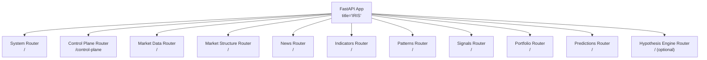
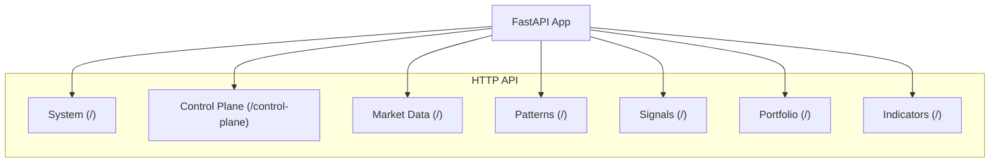
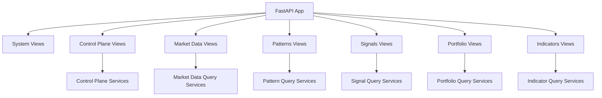

# API Reference

<cite>
**Referenced Files in This Document**
- [main.py](file://src/main.py)
- [app.py](file://src/core/bootstrap/app.py)
- [base.py](file://src/core/settings/base.py)
- [market_data/views.py](file://src/apps/market_data/views.py)
- [patterns/views.py](file://src/apps/patterns/views.py)
- [signals/views.py](file://src/apps/signals/views.py)
- [portfolio/views.py](file://src/apps/portfolio/views.py)
- [indicators/views.py](file://src/apps/indicators/views.py)
- [control_plane/views.py](file://src/apps/control_plane/views.py)
- [system/views.py](file://src/apps/system/views.py)
</cite>

## Table of Contents
1. [Introduction](#introduction)
2. [Project Structure](#project-structure)
3. [Core Components](#core-components)
4. [Architecture Overview](#architecture-overview)
5. [Detailed Component Analysis](#detailed-component-analysis)
6. [Dependency Analysis](#dependency-analysis)
7. [Performance Considerations](#performance-considerations)
8. [Troubleshooting Guide](#troubleshooting-guide)
9. [Conclusion](#conclusion)
10. [Appendices](#appendices)

## Introduction
This document provides a comprehensive API reference for the IRIS platform. It catalogs REST endpoints across modules including market data, patterns, anomalies, signals, portfolio, cross-market analysis, and the control plane. For each endpoint, you will find HTTP methods, URL patterns, request/response schemas using Pydantic models, authentication requirements, and error handling behavior. Real-time streaming and WebSocket endpoints are also documented along with event subscription patterns and message formats. Additional topics include API versioning, rate limiting, pagination, filtering, practical examples, common use cases, and integration guidelines.

## Project Structure
IRIS is a FastAPI application that aggregates multiple domain-specific routers under a single application instance. Each module exposes a dedicated router that is included during application startup. The system supports optional modules and includes middleware for CORS.

**Diagram sources**
- [app.py:49-80](file://src/core/bootstrap/app.py#L49-L80)

Key characteristics:
- Application entrypoint initializes the FastAPI app and registers routers.
- Optional inclusion of the hypothesis engine router depends on settings.
- CORS middleware is configured via settings.

**Section sources**
- [main.py:12-22](file://src/main.py#L12-L22)
- [app.py:49-80](file://src/core/bootstrap/app.py#L49-L80)
- [base.py:8-90](file://src/core/settings/base.py#L8-L90)

## Core Components
- Application bootstrap and routing:
  - Routers registered per module.
  - Optional hypothesis engine router included conditionally.
- Settings:
  - Host/port, database and Redis URLs, event stream name, API keys for external sources, CORS origins, task scheduling intervals, control plane token, AI provider settings, and portfolio constraints.
- Middleware:
  - CORS configured with origins from settings.

**Section sources**
- [app.py:49-80](file://src/core/bootstrap/app.py#L49-L80)
- [base.py:8-90](file://src/core/settings/base.py#L8-L90)

## Architecture Overview
The API surface is composed of multiple domain routers. Each router defines endpoints grouped by functional area. Control plane endpoints require explicit control-mode authentication and a control token. System endpoints expose operational status and health checks.

**Diagram sources**
- [app.py:68-79](file://src/core/bootstrap/app.py#L68-L79)

## Detailed Component Analysis

### System Endpoints
- Purpose: Operational status and health checks.
- Authentication: None.
- Rate limiting: Not enforced by the application.
- Pagination/Filtering: Not applicable.

Endpoints:
- GET /status
  - Response model: SystemStatusRead
  - Description: Returns service status, TaskIQ mode and health, and market data source status snapshots.
  - Example use case: Verify service availability and source rate-limiting state.
- GET /health
  - Response model: JSON object with status field.
  - Description: Health check against the database connection.

**Section sources**
- [system/views.py:37-52](file://src/apps/system/views.py#L37-L52)

### Control Plane Endpoints
- Purpose: Manage event routes, consumers, topology drafts, and audit logs.
- Authentication: Requires X-IRIS-Access-Mode header set to control and a valid X-IRIS-Control-Token matching settings.
- Rate limiting: Not enforced by the application.
- Pagination/Filtering: Some endpoints support limit query parameters.

Headers:
- X-IRIS-Actor: Optional actor identifier.
- X-IRIS-Access-Mode: observe or control (required for mutations).
- X-IRIS-Reason: Reason for the operation.
- X-IRIS-Control-Token: Required when control mode is used.

Endpoints:
- GET /control-plane/registry/events
  - Response model: list of EventDefinitionRead
  - Description: List event definitions.
- GET /control-plane/registry/consumers
  - Response model: list of EventConsumerRead
  - Description: List consumers.
- GET /control-plane/registry/events/{event_type}/compatible-consumers
  - Response model: list of CompatibleConsumerRead
  - Description: List compatible consumers for a given event type.
- GET /control-plane/routes
  - Response model: list of EventRouteRead
  - Description: List current event routes.
- POST /control-plane/routes
  - Request model: EventRouteMutationWrite
  - Response model: EventRouteRead
  - Description: Create a new route.
- PUT /control-plane/routes/{route_key:path}
  - Request model: EventRouteMutationWrite
  - Response model: EventRouteRead
  - Description: Update an existing route.
- POST /control-plane/routes/{route_key:path}/status
  - Request model: EventRouteStatusWrite
  - Response model: EventRouteRead
  - Description: Change route status.
- GET /control-plane/topology/snapshot
  - Response model: TopologySnapshotRead
  - Description: Build a topology snapshot.
- GET /control-plane/topology/graph
  - Response model: TopologyGraphRead
  - Description: Build a topology graph.
- GET /control-plane/drafts
  - Response model: list of TopologyDraftRead
  - Description: List drafts.
- POST /control-plane/drafts
  - Request model: TopologyDraftCreateWrite
  - Response model: TopologyDraftRead
  - Description: Create a draft.
- POST /control-plane/drafts/{draft_id}/changes
  - Request model: TopologyDraftChangeWrite
  - Response model: TopologyDraftChangeRead
  - Description: Add a change to a draft.
- GET /control-plane/drafts/{draft_id}/diff
  - Response model: list of TopologyDiffItemRead
  - Description: Preview diff for a draft.
- POST /control-plane/drafts/{draft_id}/apply
  - Response model: TopologyDraftLifecycleRead
  - Description: Apply a draft.
- POST /control-plane/drafts/{draft_id}/discard
  - Response model: TopologyDraftLifecycleRead
  - Description: Discard a draft.
- GET /control-plane/audit
  - Response model: list of EventRouteAuditLogRead
  - Description: List recent audit log entries.
- GET /control-plane/observability
  - Response model: ObservabilityOverviewRead
  - Description: Get observability overview.

Common errors:
- 400 Bad Request: Validation or compatibility errors.
- 403 Forbidden: Missing or invalid control token; access mode not control.
- 404 Not Found: Route or draft not found.
- 409 Conflict: Route conflict.

**Section sources**
- [control_plane/views.py:88-106](file://src/apps/control_plane/views.py#L88-L106)
- [control_plane/views.py:263-479](file://src/apps/control_plane/views.py#L263-L479)

### Market Data Endpoints
- Purpose: Manage coins and price history records.
- Authentication: None.
- Rate limiting: Not enforced by the application.
- Pagination/Filtering: Not applicable.

Endpoints:
- GET /coins
  - Response model: list of CoinRead
  - Description: List all coins.
- POST /coins
  - Request model: CoinCreate
  - Response model: CoinRead
  - Description: Create a new coin.
  - Notes: On success, triggers a background backfill event if configured.
- DELETE /coins/{symbol}
  - Description: Delete a coin by symbol.
- POST /coins/{symbol}/jobs/run
  - Query parameters:
    - mode: "auto" | "backfill" | "latest"
    - force: bool
  - Response model: JSON object with status, symbol, mode, and force.
  - Description: Queue a job to synchronize or backfill history for a coin.
- GET /coins/{symbol}/history
  - Query parameters:
    - interval: string (optional)
  - Response model: list of PriceHistoryRead
  - Description: Retrieve price history for a coin.
- POST /coins/{symbol}/history
  - Request model: PriceHistoryCreate
  - Response model: PriceHistoryRead
  - Description: Insert a price history record for a coin.

Common errors:
- 404 Not Found: Coin not found.
- 409 Conflict: Coin already exists on creation.
- 400 Bad Request: Validation or value errors on history creation.

**Section sources**
- [market_data/views.py:62-163](file://src/apps/market_data/views.py#L62-L163)

### Patterns Endpoints
- Purpose: Discover and manage patterns, sectors, and market regimes.
- Authentication: None.
- Rate limiting: Not enforced by the application.
- Pagination/Filtering: Some endpoints support limit with bounds.

Endpoints:
- GET /patterns
  - Response model: list of PatternRead
  - Description: List all patterns.
- GET /patterns/features
  - Response model: list of PatternFeatureRead
  - Description: List pattern features.
- PATCH /patterns/features/{feature_slug}
  - Request model: PatternFeatureUpdate
  - Response model: PatternFeatureRead
  - Description: Enable/disable a pattern feature.
- PATCH /patterns/{slug}
  - Request model: PatternUpdate
  - Response model: PatternRead
  - Description: Update pattern lifecycle and CPU cost.
- GET /patterns/discovered
  - Query parameters:
    - timeframe: integer (optional)
    - limit: integer, default 200, min 1, max 1000
  - Response model: list of DiscoveredPatternRead
  - Description: List discovered patterns.
- GET /coins/{symbol}/patterns
  - Query parameters:
    - limit: integer, default 200, min 1, max 1000
  - Response model: list of SignalRead
  - Description: List signals associated with a coin’s patterns.
- GET /coins/{symbol}/regime
  - Response model: CoinRegimeRead
  - Description: Get the market regime for a coin.
- GET /sectors
  - Response model: list of SectorRead
  - Description: List sectors.
- GET /sectors/metrics
  - Query parameters:
    - timeframe: integer (optional)
  - Response model: SectorMetricsResponse
  - Description: Get sector metrics.

Common errors:
- 404 Not Found: Pattern or coin not found.

**Section sources**
- [patterns/views.py:22-117](file://src/apps/patterns/views.py#L22-L117)

### Indicators Endpoints
- Purpose: Retrieve market metrics, radar, flow, and cycle data.
- Authentication: None.
- Rate limiting: Not enforced by the application.
- Pagination/Filtering: Some endpoints support limit and timeframe parameters.

Endpoints:
- GET /coins/metrics
  - Response model: list of CoinMetricsRead
  - Description: List coin-level metrics.
- GET /market/cycle
  - Query parameters:
    - symbol: string (optional)
    - timeframe: integer (optional)
  - Response model: list of MarketCycleRead
  - Description: List market cycles.
- GET /market/radar
  - Query parameters:
    - limit: integer, default 8, min 1, max 24
  - Response model: MarketRadarRead
  - Description: Get market radar snapshot.
- GET /market/flow
  - Query parameters:
    - limit: integer, default 8, min 1, max 24
    - timeframe: integer, default 60, min 15, max 1440
  - Response model: MarketFlowRead
  - Description: Get market flow snapshot.

Common errors:
- None explicitly handled in endpoints.

**Section sources**
- [indicators/views.py:13-46](file://src/apps/indicators/views.py#L13-L46)

### Signals Endpoints
- Purpose: Retrieve signals, decisions, final signals, backtests, and strategy performance.
- Authentication: None.
- Rate limiting: Not enforced by the application.
- Pagination/Filtering: Many endpoints support symbol, timeframe, and limit parameters with bounds.

Endpoints:
- GET /signals
  - Query parameters:
    - symbol: string (optional)
    - timeframe: integer (optional)
    - limit: integer, default 100, min 1, max 500
  - Response model: list of SignalRead
  - Description: List signals.
- GET /signals/top
  - Query parameters:
    - limit: integer, default 20, min 1, max 200
  - Response model: list of SignalRead
  - Description: Top signals.
- GET /decisions
  - Query parameters:
    - symbol: string (optional)
    - timeframe: integer (optional)
    - limit: integer, default 100, min 1, max 500
  - Response model: list of InvestmentDecisionRead
  - Description: List investment decisions.
- GET /decisions/top
  - Query parameters:
    - limit: integer, default 20, min 1, max 200
  - Response model: list of InvestmentDecisionRead
  - Description: Top investment decisions.
- GET /coins/{symbol}/decision
  - Response model: CoinDecisionRead
  - Description: Latest decision for a coin.
- GET /market-decisions
  - Query parameters:
    - symbol: string (optional)
    - timeframe: integer (optional)
    - limit: integer, default 100, min 1, max 500
  - Response model: list of MarketDecisionRead
  - Description: List market decisions.
- GET /market-decisions/top
  - Query parameters:
    - limit: integer, default 20, min 1, max 200
  - Response model: list of MarketDecisionRead
  - Description: Top market decisions.
- GET /coins/{symbol}/market-decision
  - Response model: CoinMarketDecisionRead
  - Description: Latest market decision for a coin.
- GET /final-signals
  - Query parameters:
    - symbol: string (optional)
    - timeframe: integer (optional)
    - limit: integer, default 100, min 1, max 500
  - Response model: list of FinalSignalRead
  - Description: List final signals.
- GET /final-signals/top
  - Query parameters:
    - limit: integer, default 20, min 1, max 200
  - Response model: list of FinalSignalRead
  - Description: Top final signals.
- GET /coins/{symbol}/final-signal
  - Response model: CoinFinalSignalRead
  - Description: Latest final signal for a coin.
- GET /backtests
  - Query parameters:
    - symbol: string (optional)
    - timeframe: integer (optional)
    - signal_type: string (optional)
    - lookback_days: integer, default 365, min 30, max 3650
    - limit: integer, default 100, min 1, max 500
  - Response model: list of BacktestSummaryRead
  - Description: List backtests.
- GET /backtests/top
  - Query parameters:
    - timeframe: integer (optional)
    - lookback_days: integer, default 365, min 30, max 3650
    - limit: integer, default 20, min 1, max 200
  - Response model: list of BacktestSummaryRead
  - Description: Top backtests.
- GET /coins/{symbol}/backtests
  - Query parameters:
    - timeframe: integer (optional)
    - signal_type: string (optional)
    - lookback_days: integer, default 365, min 30, max 3650
    - limit: integer, default 50, min 1, max 200
  - Response model: CoinBacktestsRead
  - Description: Backtests for a coin.
- GET /strategies
  - Query parameters:
    - enabled_only: bool, default False
    - limit: integer, default 100, min 1, max 500
  - Response model: list of StrategyRead
  - Description: List strategies.
- GET /strategies/performance
  - Query parameters:
    - limit: integer, default 100, min 1, max 500
  - Response model: list of StrategyPerformanceRead
  - Description: Strategy performance metrics.

Common errors:
- 404 Not Found: Coin not found for endpoints that require a specific coin.

**Section sources**
- [signals/views.py:23-211](file://src/apps/signals/views.py#L23-L211)

### Portfolio Endpoints
- Purpose: Retrieve portfolio positions, actions, and state.
- Authentication: None.
- Rate limiting: Not enforced by the application.
- Pagination/Filtering: Endpoints support limit with bounds.

Endpoints:
- GET /portfolio/positions
  - Query parameters:
    - limit: integer, default 100, min 1, max 500
  - Response model: list of PortfolioPositionRead
  - Description: List portfolio positions.
- GET /portfolio/actions
  - Query parameters:
    - limit: integer, default 100, min 1, max 500
  - Response model: list of PortfolioActionRead
  - Description: List portfolio actions.
- GET /portfolio/state
  - Response model: PortfolioStateRead
  - Description: Get current portfolio state.

Common errors:
- None explicitly handled in endpoints.

**Section sources**
- [portfolio/views.py:11-32](file://src/apps/portfolio/views.py#L11-L32)

### Cross-Market Analysis Endpoints
- Purpose: Cross-market insights and correlation analysis.
- Authentication: None.
- Rate limiting: Not enforced by the application.
- Pagination/Filtering: Not applicable.

Note: The cross-market module is present in the repository. However, no explicit router or endpoints are defined in the provided files. Consult the module’s views and schemas for available endpoints.

**Section sources**
- [app.py:29-30](file://src/core/bootstrap/app.py#L29-L30)

### Anomalies Endpoints
- Purpose: Anomaly detection and scoring.
- Authentication: None.
- Rate limiting: Not enforced by the application.
- Pagination/Filtering: Not applicable.

Note: The anomalies module is present in the repository. However, no explicit router or endpoints are defined in the provided files. Consult the module’s views and schemas for available endpoints.

**Section sources**
- [app.py:21](file://src/core/bootstrap/app.py#L21)

### Predictions Endpoints
- Purpose: Prediction engine outputs.
- Authentication: None.
- Rate limiting: Not enforced by the application.
- Pagination/Filtering: Not applicable.

Note: The predictions module is present in the repository. However, no explicit router or endpoints are defined in the provided files. Consult the module’s views and schemas for available endpoints.

**Section sources**
- [app.py:30](file://src/core/bootstrap/app.py#L30)

### Hypothesis Engine Endpoints
- Purpose: Hypothesis-driven reasoning and evaluation.
- Authentication: None.
- Rate limiting: Not enforced by the application.
- Pagination/Filtering: Not applicable.
- Availability: Conditionally included based on settings.

Note: The hypothesis engine router is included only when enabled by settings.

**Section sources**
- [app.py:78-79](file://src/core/bootstrap/app.py#L78-L79)

### Market Structure Endpoints
- Purpose: Market structure snapshots and tasks.
- Authentication: None.
- Rate limiting: Not enforced by the application.
- Pagination/Filtering: Not applicable.

Note: The market structure module is present in the repository. However, no explicit router or endpoints are defined in the provided files. Consult the module’s views and schemas for available endpoints.

**Section sources**
- [app.py:25](file://src/core/bootstrap/app.py#L25)

### News Endpoints
- Purpose: News ingestion and normalization.
- Authentication: None.
- Rate limiting: Not enforced by the application.
- Pagination/Filtering: Not applicable.

Note: The news module is present in the repository. However, no explicit router or endpoints are defined in the provided files. Consult the module’s views and schemas for available endpoints.

**Section sources**
- [app.py:26](file://src/core/bootstrap/app.py#L26)

### WebSocket Endpoints and Real-Time Streaming
- Event Stream Name: Defined in settings.
- Consumers and Publishers: Implemented in the runtime streams package.
- Message Formats: Defined in runtime streams messages.
- Subscription Patterns: Consumers subscribe to the configured event stream; publishers emit events to the stream.

Operational details:
- Event stream name is configurable.
- Consumers and publishers are implemented in the runtime streams package.
- Message formats are defined in the runtime streams messages module.

Practical integration guidelines:
- Configure the event stream name in settings.
- Implement consumers to handle incoming events.
- Use publishers to emit events to the stream.

**Section sources**
- [base.py:21](file://src/core/settings/base.py#L21)
- [app.py:21-31](file://src/core/bootstrap/app.py#L21-L31)

## Dependency Analysis
The application composes routers from multiple modules. Each module encapsulates its own views, schemas, and services. The control plane endpoints depend on audit and topology services, while other modules rely on query services and repositories.

**Diagram sources**
- [app.py:68-79](file://src/core/bootstrap/app.py#L68-L79)
- [control_plane/views.py:25-54](file://src/apps/control_plane/views.py#L25-L54)
- [market_data/views.py:9-12](file://src/apps/market_data/views.py#L9-L12)
- [patterns/views.py:3-16](file://src/apps/patterns/views.py#L3-L16)
- [signals/views.py:3-17](file://src/apps/signals/views.py#L3-L17)
- [portfolio/views.py:3-5](file://src/apps/portfolio/views.py#L3-L5)
- [indicators/views.py:3-7](file://src/apps/indicators/views.py#L3-L7)

**Section sources**
- [app.py:68-79](file://src/core/bootstrap/app.py#L68-L79)

## Performance Considerations
- Pagination and limits:
  - Several endpoints enforce minimum and maximum values for limit parameters to prevent excessive loads.
- Rate limiting:
  - Not enforced by the application; consider implementing upstream rate limiting or circuit breakers.
- Background jobs:
  - Market data synchronization jobs are queued via TaskIQ; ensure adequate worker capacity.
- Caching:
  - Modules include caches; leverage them to reduce repeated queries.

[No sources needed since this section provides general guidance]

## Troubleshooting Guide
- 400 Bad Request:
  - Control plane mutation compatibility or draft state errors.
  - Signals backtest lookback range out of bounds.
- 401/403 Forbidden:
  - Control mode required; missing or invalid control token.
- 404 Not Found:
  - Coins, routes, or drafts not found.
- 409 Conflict:
  - Route conflicts in control plane.
- Health check failures:
  - Database connectivity issues; verify connection settings.

**Section sources**
- [control_plane/views.py:304-327](file://src/apps/control_plane/views.py#L304-L327)
- [signals/views.py:137-152](file://src/apps/signals/views.py#L137-L152)
- [system/views.py:49-52](file://src/apps/system/views.py#L49-L52)

## Conclusion
This API reference documents the IRIS platform’s REST endpoints across market data, patterns, signals, portfolio, indicators, and the control plane. Authentication requirements vary by endpoint group, with the control plane requiring explicit control-mode headers and tokens. Pagination and filtering are supported on many endpoints. Real-time streaming is available via the configured event stream. For modules without explicit endpoints in the provided files, consult the module’s views and schemas.

[No sources needed since this section summarizes without analyzing specific files]

## Appendices

### API Versioning
- No explicit versioning scheme is defined in the provided files. Consider adding a version prefix to routes or using Accept headers for future-proofing.

[No sources needed since this section provides general guidance]

### Rate Limiting
- Not enforced by the application. Implement at the gateway or client-side as needed.

[No sources needed since this section provides general guidance]

### Pagination and Filtering
- Many endpoints accept limit parameters with min/max bounds.
- Filtering is supported via query parameters such as symbol, timeframe, and others depending on the endpoint.

**Section sources**
- [patterns/views.py:77-78](file://src/apps/patterns/views.py#L77-L78)
- [signals/views.py:27-31](file://src/apps/signals/views.py#L27-L31)
- [signals/views.py:141-151](file://src/apps/signals/views.py#L141-L151)
- [indicators/views.py:31-45](file://src/apps/indicators/views.py#L31-L45)
- [portfolio/views.py:13-17](file://src/apps/portfolio/views.py#L13-L17)

### Practical Examples and Integration Guidelines
- Retrieve top signals:
  - Endpoint: GET /signals/top?limit=20
  - Response model: list of SignalRead
- Create a coin and trigger backfill:
  - Endpoint: POST /coins
  - Request model: CoinCreate
  - On success, a background job is triggered to synchronize history.
- Control plane topology change:
  - Headers: X-IRIS-Access-Mode: control, X-IRIS-Control-Token: <token>, X-IRIS-Actor: <actor>, X-IRIS-Reason: <reason>
  - Endpoint: POST /control-plane/drafts
  - Request model: TopologyDraftCreateWrite
  - Apply the draft: POST /control-plane/drafts/{draft_id}/apply

**Section sources**
- [signals/views.py:34-41](file://src/apps/signals/views.py#L34-L41)
- [market_data/views.py:69-84](file://src/apps/market_data/views.py#L69-L84)
- [control_plane/views.py:88-106](file://src/apps/control_plane/views.py#L88-L106)
- [control_plane/views.py:366-382](file://src/apps/control_plane/views.py#L366-L382)
- [control_plane/views.py:431-447](file://src/apps/control_plane/views.py#L431-L447)