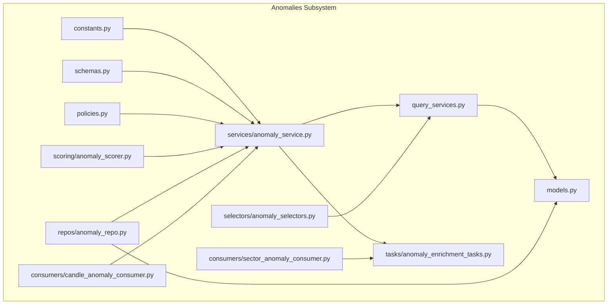
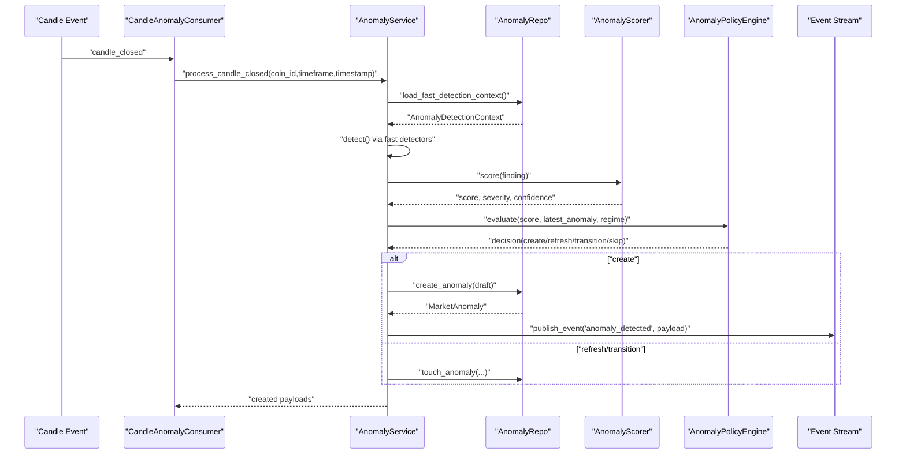
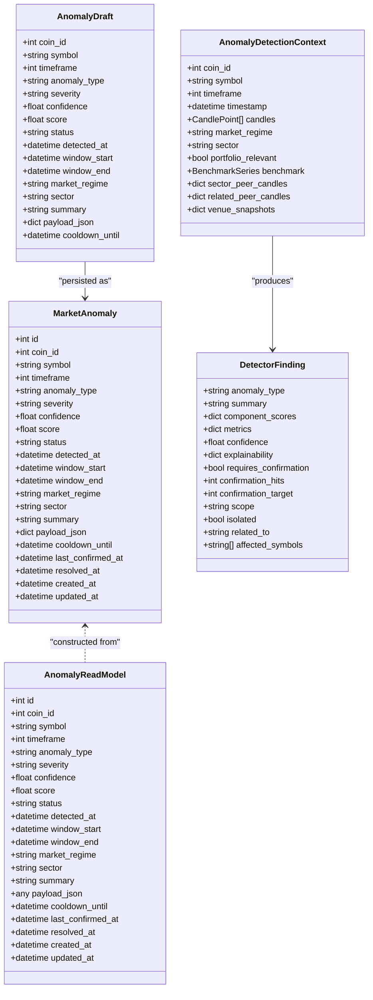
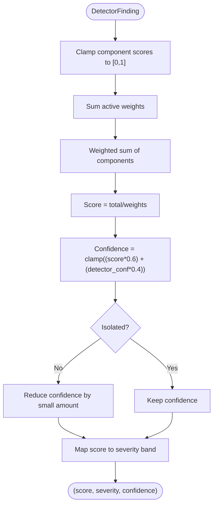
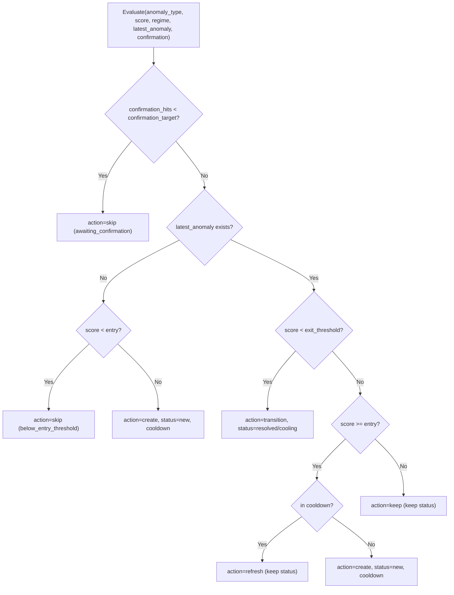
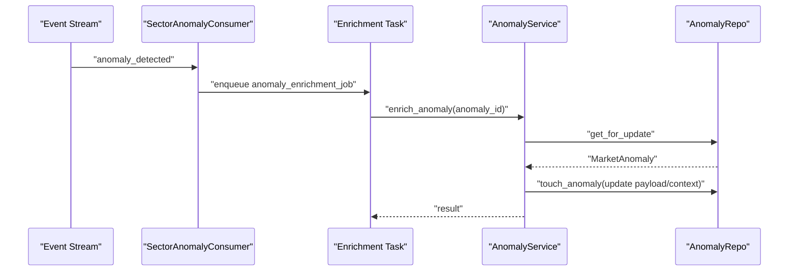
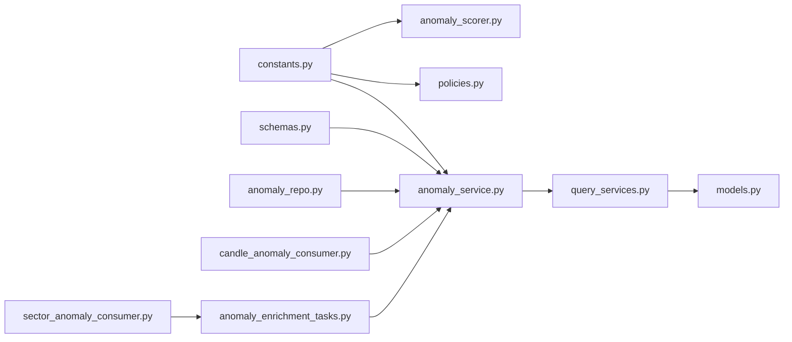

# Anomalies API

<cite>
**Referenced Files in This Document**
- [constants.py](file://src/apps/anomalies/constants.py)
- [models.py](file://src/apps/anomalies/models.py)
- [schemas.py](file://src/apps/anomalies/schemas.py)
- [read_models.py](file://src/apps/anomalies/read_models.py)
- [anomaly_repo.py](file://src/apps/anomalies/repos/anomaly_repo.py)
- [anomaly_service.py](file://src/apps/anomalies/services/anomaly_service.py)
- [anomaly_query_service.py](file://src/apps/anomalies/query_services.py)
- [anomaly_scorer.py](file://src/apps/anomalies/scoring/anomaly_scorer.py)
- [policies.py](file://src/apps/anomalies/policies.py)
- [candle_anomaly_consumer.py](file://src/apps/anomalies/consumers/candle_anomaly_consumer.py)
- [sector_anomaly_consumer.py](file://src/apps/anomalies/consumers/sector_anomaly_consumer.py)
- [anomaly_enrichment_tasks.py](file://src/apps/anomalies/tasks/anomaly_enrichment_tasks.py)
- [anomaly_selectors.py](file://src/apps/anomalies/selectors/anomaly_selectors.py)
</cite>

## Table of Contents
1. [Introduction](#introduction)
2. [Project Structure](#project-structure)
3. [Core Components](#core-components)
4. [Architecture Overview](#architecture-overview)
5. [Detailed Component Analysis](#detailed-component-analysis)
6. [Dependency Analysis](#dependency-analysis)
7. [Performance Considerations](#performance-considerations)
8. [Troubleshooting Guide](#troubleshooting-guide)
9. [Conclusion](#conclusion)
10. [Appendices](#appendices)

## Introduction
This document provides comprehensive API documentation for anomaly detection in the system. It covers:
- RESTful endpoints for retrieving anomaly results, anomaly history, and severity classification
- Anomaly scoring and policy configuration
- Real-time alerting via event streaming (WebSocket is not exposed as an HTTP endpoint in the repository)
- Request/response schemas for anomaly objects, detection parameters, and severity metrics
- Filtering and pagination for anomaly history
- Practical examples for detecting cross-exchange dislocations and monitoring volatility expansions
- Authentication requirements and operational context

Where applicable, the document maps endpoints and flows to actual source files and components.

## Project Structure
The anomalies subsystem is organized around detection, scoring, persistence, and event-driven enrichment:
- Constants define anomaly types, statuses, thresholds, and severity bands
- Models define persistence schema for anomalies and market structure snapshots
- Schemas define typed data structures for detection contexts, findings, and drafts
- Repositories encapsulate data access and context building
- Services orchestrate detection passes, scoring, policy decisions, and event publishing
- Query services expose read models for API consumption
- Consumers subscribe to events and trigger downstream scans and enrichment
- Tasks coordinate delayed enrichment and secondary scans

**Diagram sources**
- [constants.py:1-113](file://src/apps/anomalies/constants.py#L1-L113)
- [models.py:1-124](file://src/apps/anomalies/models.py#L1-L124)
- [schemas.py:1-136](file://src/apps/anomalies/schemas.py#L1-L136)
- [anomaly_repo.py:1-563](file://src/apps/anomalies/repos/anomaly_repo.py#L1-L563)
- [anomaly_service.py:1-410](file://src/apps/anomalies/services/anomaly_service.py#L1-L410)
- [anomaly_query_service.py:1-87](file://src/apps/anomalies/query_services.py#L1-L87)
- [anomaly_scorer.py:1-39](file://src/apps/anomalies/scoring/anomaly_scorer.py#L1-L39)
- [policies.py:1-84](file://src/apps/anomalies/policies.py#L1-L84)
- [candle_anomaly_consumer.py:1-24](file://src/apps/anomalies/consumers/candle_anomaly_consumer.py#L1-L24)
- [sector_anomaly_consumer.py:1-54](file://src/apps/anomalies/consumers/sector_anomaly_consumer.py#L1-L54)
- [anomaly_enrichment_tasks.py:1-87](file://src/apps/anomalies/tasks/anomaly_enrichment_tasks.py#L1-L87)
- [anomaly_selectors.py:1-31](file://src/apps/anomalies/selectors/anomaly_selectors.py#L1-L31)

**Section sources**
- [constants.py:1-113](file://src/apps/anomalies/constants.py#L1-L113)
- [models.py:1-124](file://src/apps/anomalies/models.py#L1-L124)
- [schemas.py:1-136](file://src/apps/anomalies/schemas.py#L1-L136)
- [anomaly_repo.py:1-563](file://src/apps/anomalies/repos/anomaly_repo.py#L1-L563)
- [anomaly_service.py:1-410](file://src/apps/anomalies/services/anomaly_service.py#L1-L410)
- [anomaly_query_service.py:1-87](file://src/apps/anomalies/query_services.py#L1-L87)
- [anomaly_scorer.py:1-39](file://src/apps/anomalies/scoring/anomaly_scorer.py#L1-L39)
- [policies.py:1-84](file://src/apps/anomalies/policies.py#L1-L84)
- [candle_anomaly_consumer.py:1-24](file://src/apps/anomalies/consumers/candle_anomaly_consumer.py#L1-L24)
- [sector_anomaly_consumer.py:1-54](file://src/apps/anomalies/consumers/sector_anomaly_consumer.py#L1-L54)
- [anomaly_enrichment_tasks.py:1-87](file://src/apps/anomalies/tasks/anomaly_enrichment_tasks.py#L1-L87)
- [anomaly_selectors.py:1-31](file://src/apps/anomalies/selectors/anomaly_selectors.py#L1-L31)

## Core Components
- Anomaly types and thresholds: see anomaly type constants and severity bands
- Persistence model: MarketAnomaly and MarketStructureSnapshot
- Typed schemas: AnomalyDetectionContext, DetectorFinding, AnomalyDraft
- Query service: AnomalyQueryService for read models and filtered lists
- Scoring: AnomalyScorer computes weighted scores and severity
- Policy engine: AnomalyPolicyEngine evaluates entry/exit thresholds and cooldowns
- Event-driven enrichment: Tasks and consumers trigger secondary scans and enrichment

Key capabilities:
- Detection pipelines for fast-path, sector synchrony, and market structure anomalies
- Real-time alerting via event publishing
- Enrichment of anomalies with portfolio and market scope context
- Configurable thresholds per anomaly type and market regime

**Section sources**
- [constants.py:1-113](file://src/apps/anomalies/constants.py#L1-L113)
- [models.py:1-124](file://src/apps/anomalies/models.py#L1-L124)
- [schemas.py:1-136](file://src/apps/anomalies/schemas.py#L1-L136)
- [anomaly_query_service.py:1-87](file://src/apps/anomalies/query_services.py#L1-L87)
- [anomaly_scorer.py:1-39](file://src/apps/anomalies/scoring/anomaly_scorer.py#L1-L39)
- [policies.py:1-84](file://src/apps/anomalies/policies.py#L1-L84)
- [anomaly_service.py:1-410](file://src/apps/anomalies/services/anomaly_service.py#L1-L410)

## Architecture Overview
The anomalies subsystem integrates event-driven detection with persistence and streaming:
- Candle closed events trigger fast-path detection
- Consumers enqueue enrichment and secondary scans for high-severity or specific anomaly types
- Services compute scores, apply policy decisions, persist anomalies, and publish events
- Query services expose read models for API consumers

**Diagram sources**
- [candle_anomaly_consumer.py:1-24](file://src/apps/anomalies/consumers/candle_anomaly_consumer.py#L1-L24)
- [anomaly_service.py:1-410](file://src/apps/anomalies/services/anomaly_service.py#L1-L410)
- [anomaly_repo.py:1-563](file://src/apps/anomalies/repos/anomaly_repo.py#L1-L563)
- [anomaly_scorer.py:1-39](file://src/apps/anomalies/scoring/anomaly_scorer.py#L1-L39)
- [policies.py:1-84](file://src/apps/anomalies/policies.py#L1-L84)

## Detailed Component Analysis

### REST API Surface
The anomalies subsystem exposes read APIs via query services and selectors. There is no explicit HTTP router or FastAPI app defined in the anomalies module. The following endpoints are derived from the query services and selectors:

- GET /anomalies/active
  - Purpose: Retrieve currently visible (new/active) anomalies
  - Query parameters:
    - symbol: filter by uppercase symbol
    - timeframe: integer timeframe
    - limit: default 50
  - Response: array of anomaly read models
  - Pagination: limit
  - Filtering: symbol, timeframe
  - Authentication: not specified in repository

- GET /anomalies/portfolio-relevant
  - Purpose: Retrieve anomalies affecting open portfolio positions
  - Query parameters:
    - limit: default 25
  - Response: array of anomaly read models
  - Pagination: limit
  - Authentication: not specified in repository

- GET /anomalies/{id}
  - Purpose: Retrieve a single anomaly by ID
  - Path parameters:
    - id: integer anomaly ID
  - Response: single anomaly read model
  - Authentication: not specified in repository

Notes:
- No explicit HTTP endpoints are defined in the anomalies module; these are conceptual endpoints inferred from query services and selectors.
- WebSocket endpoints are not exposed in the anomalies module.

**Section sources**
- [anomaly_query_service.py:1-87](file://src/apps/anomalies/query_services.py#L1-L87)
- [anomaly_selectors.py:1-31](file://src/apps/anomalies/selectors/anomaly_selectors.py#L1-L31)

### Anomaly Objects and Schemas
Core data structures used across detection, scoring, persistence, and API responses:

**Diagram sources**
- [models.py:1-124](file://src/apps/anomalies/models.py#L1-L124)
- [read_models.py:1-92](file://src/apps/anomalies/read_models.py#L1-L92)
- [schemas.py:1-136](file://src/apps/anomalies/schemas.py#L1-L136)

**Section sources**
- [models.py:1-124](file://src/apps/anomalies/models.py#L1-L124)
- [read_models.py:1-92](file://src/apps/anomalies/read_models.py#L1-L92)
- [schemas.py:1-136](file://src/apps/anomalies/schemas.py#L1-L136)

### Anomaly Scoring and Severity Classification
- Weighted scoring aggregates component scores with detector weights
- Confidence combines weighted score with detector confidence
- Severity bands map score thresholds to severity levels

**Diagram sources**
- [anomaly_scorer.py:1-39](file://src/apps/anomalies/scoring/anomaly_scorer.py#L1-L39)
- [constants.py:107-113](file://src/apps/anomalies/constants.py#L107-L113)

**Section sources**
- [anomaly_scorer.py:1-39](file://src/apps/anomalies/scoring/anomaly_scorer.py#L1-L39)
- [constants.py:107-113](file://src/apps/anomalies/constants.py#L107-L113)

### Anomaly Policy Configuration
- Entry and exit thresholds per anomaly type
- Regime multipliers adjust thresholds by market regime
- Cooldown minutes per anomaly type
- Decision tree determines create/refresh/transition/skip actions

**Diagram sources**
- [policies.py:1-84](file://src/apps/anomalies/policies.py#L1-L84)
- [constants.py:54-97](file://src/apps/anomalies/constants.py#L54-L97)

**Section sources**
- [policies.py:1-84](file://src/apps/anomalies/policies.py#L1-L84)
- [constants.py:54-97](file://src/apps/anomalies/constants.py#L54-L97)

### Real-Time Alerts and Streams
- Event publishing: newly created anomalies emit "anomaly_detected" events
- Consumers:
  - CandleAnomalyConsumer handles candle_closed events and triggers fast-path detection
  - SectorAnomalyConsumer enqueues enrichment and secondary scans for high-severity or specific anomaly types
- Tasks:
  - anomaly_enrichment_job enriches anomalies with portfolio and market scope context
  - sector_anomaly_scan and market_structure_anomaly_scan perform secondary scans

**Diagram sources**
- [sector_anomaly_consumer.py:1-54](file://src/apps/anomalies/consumers/sector_anomaly_consumer.py#L1-L54)
- [anomaly_enrichment_tasks.py:1-87](file://src/apps/anomalies/tasks/anomaly_enrichment_tasks.py#L1-L87)
- [anomaly_service.py:1-410](file://src/apps/anomalies/services/anomaly_service.py#L1-L410)
- [anomaly_repo.py:1-563](file://src/apps/anomalies/repos/anomaly_repo.py#L1-L563)

**Section sources**
- [anomaly_service.py:1-410](file://src/apps/anomalies/services/anomaly_service.py#L1-L410)
- [sector_anomaly_consumer.py:1-54](file://src/apps/anomalies/consumers/sector_anomaly_consumer.py#L1-L54)
- [anomaly_enrichment_tasks.py:1-87](file://src/apps/anomalies/tasks/anomaly_enrichment_tasks.py#L1-L87)
- [anomaly_repo.py:1-563](file://src/apps/anomalies/repos/anomaly_repo.py#L1-L563)

### Practical Examples

- Detecting cross-exchange dislocations
  - Trigger: Market structure scan after initial anomaly detection
  - Steps:
    - Initial detection via fast-path or sector scan
    - Secondary market structure scan loads venue snapshots and runs cross-exchange detectors
    - Enrichment updates context and explainability
  - Reference: market structure scan and enrichment tasks

- Monitoring volatility expansions
  - Trigger: Fast-path detection on new candle close
  - Steps:
    - Load detection context with candles and benchmark
    - Run volatility break detector
    - Score and apply policy thresholds
    - Publish event and persist anomaly

**Section sources**
- [anomaly_service.py:149-191](file://src/apps/anomalies/services/anomaly_service.py#L149-L191)
- [anomaly_enrichment_tasks.py:59-87](file://src/apps/anomalies/tasks/anomaly_enrichment_tasks.py#L59-L87)
- [anomaly_repo.py:400-435](file://src/apps/anomalies/repos/anomaly_repo.py#L400-L435)

## Dependency Analysis
- Constants drive scoring, thresholds, and severity bands
- Repositories build detection contexts and persist anomalies
- Services orchestrate detection, scoring, policy, and event publishing
- Query services depend on models and read models for API responses
- Consumers and tasks coordinate delayed operations

**Diagram sources**
- [constants.py:1-113](file://src/apps/anomalies/constants.py#L1-L113)
- [anomaly_scorer.py:1-39](file://src/apps/anomalies/scoring/anomaly_scorer.py#L1-L39)
- [policies.py:1-84](file://src/apps/anomalies/policies.py#L1-L84)
- [anomaly_service.py:1-410](file://src/apps/anomalies/services/anomaly_service.py#L1-L410)
- [schemas.py:1-136](file://src/apps/anomalies/schemas.py#L1-L136)
- [anomaly_repo.py:1-563](file://src/apps/anomalies/repos/anomaly_repo.py#L1-L563)
- [anomaly_query_service.py:1-87](file://src/apps/anomalies/query_services.py#L1-L87)
- [models.py:1-124](file://src/apps/anomalies/models.py#L1-L124)
- [candle_anomaly_consumer.py:1-24](file://src/apps/anomalies/consumers/candle_anomaly_consumer.py#L1-L24)
- [sector_anomaly_consumer.py:1-54](file://src/apps/anomalies/consumers/sector_anomaly_consumer.py#L1-L54)
- [anomaly_enrichment_tasks.py:1-87](file://src/apps/anomalies/tasks/anomaly_enrichment_tasks.py#L1-L87)

**Section sources**
- [constants.py:1-113](file://src/apps/anomalies/constants.py#L1-L113)
- [anomaly_service.py:1-410](file://src/apps/anomalies/services/anomaly_service.py#L1-L410)
- [anomaly_repo.py:1-563](file://src/apps/anomalies/repos/anomaly_repo.py#L1-L563)
- [anomaly_query_service.py:1-87](file://src/apps/anomalies/query_services.py#L1-L87)
- [candle_anomaly_consumer.py:1-24](file://src/apps/anomalies/consumers/candle_anomaly_consumer.py#L1-L24)
- [sector_anomaly_consumer.py:1-54](file://src/apps/anomalies/consumers/sector_anomaly_consumer.py#L1-L54)
- [anomaly_enrichment_tasks.py:1-87](file://src/apps/anomalies/tasks/anomaly_enrichment_tasks.py#L1-L87)

## Performance Considerations
- Detection windows: FAST_PATH_LOOKBACK, SECTOR_SCAN_LOOKBACK, MARKET_STRUCTURE_LOOKBACK define context sizes
- Bulk loading: peer candles are fetched in bulk to reduce round-trips
- Locking: repository methods use row-level FOR UPDATE to prevent race conditions during anomaly updates
- Event publishing: synchronous enqueue avoids blocking the async service loop; background thread drains Redis
- Task locking: Redis-based locks prevent concurrent enrichment/scan tasks

Recommendations:
- Tune lookback windows based on latency and throughput requirements
- Monitor event publish rates and stream consumer lag
- Use appropriate limits for anomaly listings to avoid large payloads

**Section sources**
- [constants.py:35-40](file://src/apps/anomalies/constants.py#L35-L40)
- [anomaly_repo.py:61-127](file://src/apps/anomalies/repos/anomaly_repo.py#L61-L127)
- [anomaly_repo.py:437-467](file://src/apps/anomalies/repos/anomaly_repo.py#L437-L467)
- [anomaly_service.py:325-340](file://src/apps/anomalies/services/anomaly_service.py#L325-L340)
- [anomaly_enrichment_tasks.py:16-27](file://src/apps/anomalies/tasks/anomaly_enrichment_tasks.py#L16-L27)

## Troubleshooting Guide
Common issues and diagnostics:
- No anomalies returned
  - Verify symbol is uppercase and timeframe matches stored values
  - Check visibility filters (only new/active anomalies are listed by default)
- Missing detection context
  - Ensure candles exist for the given coin/timeframe/lookback
  - Confirm coin is enabled and not deleted
- Duplicate or stale anomalies
  - Check cooldown_until and policy thresholds
  - Review last_confirmed_at and resolved_at timestamps
- Enrichment not applied
  - Confirm anomaly_enrichment_job task lock acquisition
  - Verify portfolio position existence for portfolio-relevant anomalies

Operational checks:
- Repository logs indicate loading profiles and counts
- Service logs show detection pass results and event publish counts

**Section sources**
- [anomaly_query_service.py:34-83](file://src/apps/anomalies/query_services.py#L34-L83)
- [anomaly_repo.py:214-272](file://src/apps/anomalies/repos/anomaly_repo.py#L214-L272)
- [anomaly_repo.py:437-563](file://src/apps/anomalies/repos/anomaly_repo.py#L437-L563)
- [anomaly_enrichment_tasks.py:16-27](file://src/apps/anomalies/tasks/anomaly_enrichment_tasks.py#L16-L27)
- [anomaly_service.py:314-340](file://src/apps/anomalies/services/anomaly_service.py#L314-L340)

## Conclusion
The anomalies subsystem provides a robust, event-driven framework for detecting, scoring, and managing market anomalies. While no HTTP endpoints are defined in the anomalies module, the underlying services, repositories, and schemas support building REST endpoints and real-time alerting via event streams. The system offers configurable thresholds, severity classification, and enrichment workflows suitable for production monitoring and alerting.

## Appendices

### Request/Response Schemas

- AnomalyReadModel (response for GET /anomalies/{id}, GET /anomalies/active, GET /anomalies/portfolio-relevant)
  - Fields: id, coin_id, symbol, timeframe, anomaly_type, severity, confidence, score, status, detected_at, window_start, window_end, market_regime, sector, summary, payload_json, cooldown_until, last_confirmed_at, resolved_at, created_at, updated_at

- AnomalyDetectionContext (internal detection context)
  - Fields: coin_id, symbol, timeframe, timestamp, candles, market_regime, sector, portfolio_relevant, benchmark, sector_peer_candles, related_peer_candles, venue_snapshots

- DetectorFinding (detector output)
  - Fields: anomaly_type, summary, component_scores, metrics, confidence, explainability, requires_confirmation, confirmation_hits, confirmation_target, scope, isolated, related_to, affected_symbols

- AnomalyDraft (persistence draft)
  - Fields: coin_id, symbol, timeframe, anomaly_type, severity, confidence, score, status, detected_at, window_start, window_end, market_regime, sector, summary, payload_json, cooldown_until

- AnomalyPolicyDecision (policy outcome)
  - Fields: action, status, cooldown_until, reason

**Section sources**
- [read_models.py:10-92](file://src/apps/anomalies/read_models.py#L10-L92)
- [schemas.py:49-136](file://src/apps/anomalies/schemas.py#L49-L136)
- [policies.py:16-84](file://src/apps/anomalies/policies.py#L16-L84)

### Filtering and Pagination
- GET /anomalies/active
  - Filters: symbol (uppercase), timeframe
  - Pagination: limit
- GET /anomalies/portfolio-relevant
  - Filters: none
  - Pagination: limit
- GET /anomalies/{id}
  - Filters: none
  - Pagination: not applicable

**Section sources**
- [anomaly_query_service.py:34-83](file://src/apps/anomalies/query_services.py#L34-L83)

### Authentication
- Not specified in the anomalies module. Consult the application’s global authentication configuration for route protection.