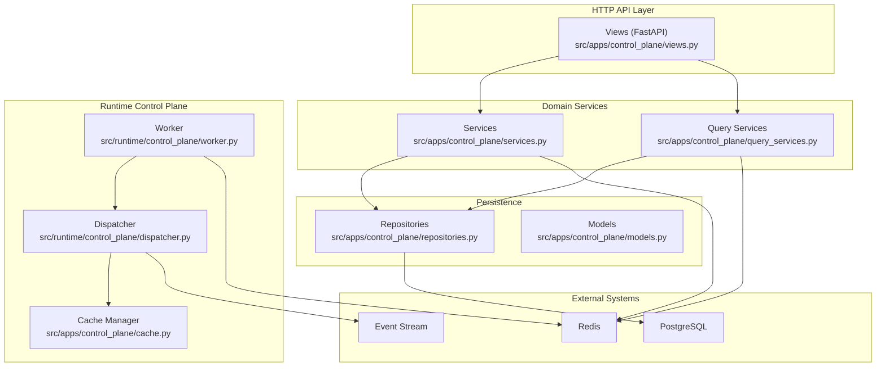
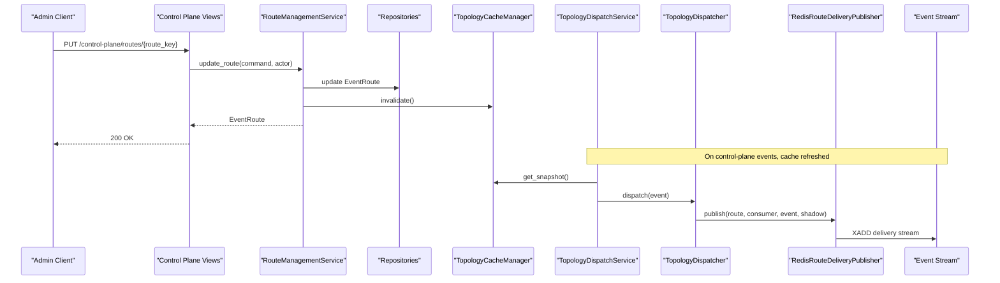
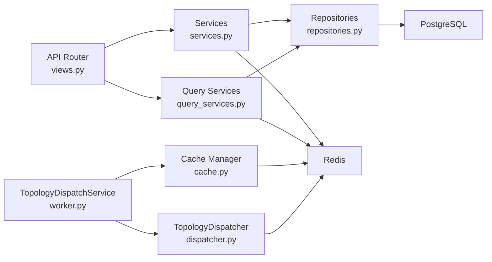

# Control Plane API

<cite>
**Referenced Files in This Document**
- [views.py](file://src/apps/control_plane/views.py)
- [schemas.py](file://src/apps/control_plane/schemas.py)
- [services.py](file://src/apps/control_plane/services.py)
- [models.py](file://src/apps/control_plane/models.py)
- [contracts.py](file://src/apps/control_plane/contracts.py)
- [enums.py](file://src/apps/control_plane/enums.py)
- [query_services.py](file://src/apps/control_plane/query_services.py)
- [repositories.py](file://src/apps/control_plane/repositories.py)
- [metrics.py](file://src/apps/control_plane/metrics.py)
- [cache.py](file://src/apps/control_plane/cache.py)
- [dispatcher.py](file://src/runtime/control_plane/dispatcher.py)
- [worker.py](file://src/runtime/control_plane/worker.py)
- [control_events.py](file://src/apps/control_plane/control_events.py)
- [base.py](file://src/core/settings/base.py)
- [main.py](file://src/main.py)
</cite>

## Table of Contents
1. [Introduction](#introduction)
2. [Project Structure](#project-structure)
3. [Core Components](#core-components)
4. [Architecture Overview](#architecture-overview)
5. [Detailed Component Analysis](#detailed-component-analysis)
6. [Dependency Analysis](#dependency-analysis)
7. [Performance Considerations](#performance-considerations)
8. [Troubleshooting Guide](#troubleshooting-guide)
9. [Conclusion](#conclusion)
10. [Appendices](#appendices)

## Introduction
This document provides comprehensive API documentation for the system control and administrative endpoints. It covers RESTful endpoints for system configuration, event control plane operations, metrics retrieval, and administrative functions. It also documents the control plane topology registry, route management, draft-based topology changes, observability metrics, and administrative audit logs. Authentication and authorization requirements are specified, along with practical examples for configuring system events, monitoring control plane metrics, and managing administrative workflows.

## Project Structure
The control plane API is implemented as a FastAPI application under the control plane app. It exposes HTTP endpoints for topology and route management, registry inspection, draft lifecycle, audit logging, and observability. The runtime control plane integrates with the event stream to dispatch events according to the current topology snapshot.

**Diagram sources**
- [views.py:59-479](file://src/apps/control_plane/views.py#L59-L479)
- [services.py:193-759](file://src/apps/control_plane/services.py#L193-L759)
- [query_services.py:272-720](file://src/apps/control_plane/query_services.py#L272-L720)
- [repositories.py:19-259](file://src/apps/control_plane/repositories.py#L19-L259)
- [models.py:15-259](file://src/apps/control_plane/models.py#L15-L259)
- [dispatcher.py:266-313](file://src/runtime/control_plane/dispatcher.py#L266-L313)
- [worker.py:61-132](file://src/runtime/control_plane/worker.py#L61-L132)
- [cache.py:235-280](file://src/apps/control_plane/cache.py#L235-L280)

**Section sources**
- [views.py:59-479](file://src/apps/control_plane/views.py#L59-L479)
- [services.py:193-759](file://src/apps/control_plane/services.py#L193-L759)
- [query_services.py:272-720](file://src/apps/control_plane/query_services.py#L272-L720)
- [repositories.py:19-259](file://src/apps/control_plane/repositories.py#L19-L259)
- [models.py:15-259](file://src/apps/control_plane/models.py#L15-L259)
- [dispatcher.py:266-313](file://src/runtime/control_plane/dispatcher.py#L266-L313)
- [worker.py:61-132](file://src/runtime/control_plane/worker.py#L61-L132)
- [cache.py:235-280](file://src/apps/control_plane/cache.py#L235-L280)

## Core Components
- HTTP API Router: Defines the control plane endpoints under the "/control-plane" prefix and enforces control-mode authentication for mutation operations.
- Domain Services: RouteManagementService, TopologyDraftService, TopologyObservabilityService encapsulate business logic for route CRUD, topology drafts, and observability computation.
- Query Services: Build topology snapshots, graphs, diffs, and observability overviews from repositories.
- Repositories and Models: Persist event definitions, consumers, routes, topology versions, drafts, changes, and audit logs.
- Runtime Dispatcher: Evaluates events against the topology snapshot and publishes deliveries to Redis streams.
- Metrics Store: Records per-route and per-consumer metrics in Redis for observability.
- Cache Manager: Loads and caches the topology snapshot with TTL and invalidation via control-plane events.

**Section sources**
- [views.py:59-479](file://src/apps/control_plane/views.py#L59-L479)
- [services.py:193-759](file://src/apps/control_plane/services.py#L193-L759)
- [query_services.py:272-720](file://src/apps/control_plane/query_services.py#L272-L720)
- [repositories.py:19-259](file://src/apps/control_plane/repositories.py#L19-L259)
- [models.py:15-259](file://src/apps/control_plane/models.py#L15-L259)
- [metrics.py:29-124](file://src/apps/control_plane/metrics.py#L29-L124)
- [cache.py:235-280](file://src/apps/control_plane/cache.py#L235-L280)

## Architecture Overview
The control plane API orchestrates topology management and event dispatch. Administrative mutations require control mode and a control token. The runtime dispatcher consumes the event stream, evaluates events against the cached topology, and publishes deliveries to consumer streams while recording metrics.

**Diagram sources**
- [views.py:311-345](file://src/apps/control_plane/views.py#L311-L345)
- [services.py:255-310](file://src/apps/control_plane/services.py#L255-L310)
- [repositories.py:73-118](file://src/apps/control_plane/repositories.py#L73-L118)
- [cache.py:260-269](file://src/apps/control_plane/cache.py#L260-L269)
- [worker.py:78-105](file://src/runtime/control_plane/worker.py#L78-L105)
- [dispatcher.py:266-297](file://src/runtime/control_plane/dispatcher.py#L266-L297)
- [worker.py:22-58](file://src/runtime/control_plane/worker.py#L22-L58)

## Detailed Component Analysis

### Authentication and Authorization
- Access Mode Header: X-IRIS-Access-Mode must be "observe" or "control".
- Control Token: X-IRIS-Control-Token must match the configured IRIS_CONTROL_TOKEN setting.
- Actor Metadata: X-IRIS-Actor, X-IRIS-Reason captured for audit trails.
- Control Mode Required: Mutations (create/update/status) require control mode and token.

**Section sources**
- [views.py:63-106](file://src/apps/control_plane/views.py#L63-L106)
- [base.py:51-52](file://src/core/settings/base.py#L51-L52)

### Endpoints Reference

#### Registry Endpoints
- GET /control-plane/registry/events
  - Description: List all event definitions.
  - Response: Array of EventDefinitionRead.
- GET /control-plane/registry/consumers
  - Description: List all event consumers.
  - Response: Array of EventConsumerRead.
- GET /control-plane/registry/events/{event_type}/compatible-consumers
  - Description: List consumers compatible with a given event type.
  - Response: Array of CompatibleConsumerRead.
  - Path Parameters: event_type (string).

**Section sources**
- [views.py:263-287](file://src/apps/control_plane/views.py#L263-L287)
- [query_services.py:272-317](file://src/apps/control_plane/query_services.py#L272-L317)

#### Route Management Endpoints
- GET /control-plane/routes
  - Description: List all event routes.
  - Response: Array of EventRouteRead.
- POST /control-plane/routes
  - Description: Create a new event route.
  - Request Body: EventRouteMutationWrite.
  - Response: EventRouteRead.
  - Requires: Control mode and token.
- PUT /control-plane/routes/{route_key:path}
  - Description: Update an existing event route.
  - Path Parameters: route_key (string).
  - Request Body: EventRouteMutationWrite.
  - Response: EventRouteRead.
  - Requires: Control mode and token.
- POST /control-plane/routes/{route_key:path}/status
  - Description: Change route status and optionally add notes.
  - Path Parameters: route_key (string).
  - Request Body: EventRouteStatusWrite.
  - Response: EventRouteRead.
  - Requires: Control mode and token.

**Section sources**
- [views.py:289-345](file://src/apps/control_plane/views.py#L289-L345)
- [services.py:205-310](file://src/apps/control_plane/services.py#L205-L310)

#### Topology Snapshot and Graph
- GET /control-plane/topology/snapshot
  - Description: Build and return a topology snapshot payload.
  - Response: TopologySnapshotRead.
- GET /control-plane/topology/graph
  - Description: Build and return a topology graph payload.
  - Response: TopologyGraphRead.

**Section sources**
- [views.py:348-357](file://src/apps/control_plane/views.py#L348-L357)
- [query_services.py:341-470](file://src/apps/control_plane/query_services.py#L341-L470)

#### Draft Lifecycle Endpoints
- GET /control-plane/drafts
  - Description: List topology drafts.
  - Response: Array of TopologyDraftRead.
- POST /control-plane/drafts
  - Description: Create a new topology draft.
  - Request Body: TopologyDraftCreateWrite.
  - Response: TopologyDraftRead.
  - Requires: Control mode and token.
- POST /control-plane/drafts/{draft_id}/changes
  - Description: Add a change to a draft.
  - Path Parameters: draft_id (integer).
  - Request Body: TopologyDraftChangeWrite.
  - Response: TopologyDraftChangeRead.
  - Requires: Control mode and token.
- GET /control-plane/drafts/{draft_id}/diff
  - Description: Preview the diff of a draft.
  - Path Parameters: draft_id (integer).
  - Response: Array of TopologyDiffItemRead.
- POST /control-plane/drafts/{draft_id}/apply
  - Description: Apply a draft and publish a new topology version.
  - Path Parameters: draft_id (integer).
  - Response: TopologyDraftLifecycleRead.
  - Requires: Control mode and token.
- POST /control-plane/drafts/{draft_id}/discard
  - Description: Discard a draft.
  - Path Parameters: draft_id (integer).
  - Response: TopologyDraftLifecycleRead.
  - Requires: Control mode and token.

**Section sources**
- [views.py:360-464](file://src/apps/control_plane/views.py#L360-L464)
- [services.py:411-541](file://src/apps/control_plane/services.py#L411-L541)

#### Audit Log Endpoint
- GET /control-plane/audit
  - Description: List recent route audit log entries.
  - Query: limit (integer, default 50, min 1, max 500).
  - Response: Array of EventRouteAuditLogRead.

**Section sources**
- [views.py:466-472](file://src/apps/control_plane/views.py#L466-L472)
- [services.py:140-175](file://src/apps/control_plane/services.py#L140-L175)

#### Observability Endpoint
- GET /control-plane/observability
  - Description: Get observability overview with throughput, failures, dead consumers, and per-route/per-consumer metrics.
  - Response: ObservabilityOverviewRead.

**Section sources**
- [views.py:475-478](file://src/apps/control_plane/views.py#L475-L478)
- [query_services.py:595-706](file://src/apps/control_plane/query_services.py#L595-L706)

### Request/Response Schemas

#### Route Filters Payload
- Fields:
  - symbol: array of strings
  - timeframe: array of integers
  - exchange: array of strings
  - confidence: number or null
  - metadata: object

**Section sources**
- [schemas.py:17-25](file://src/apps/control_plane/schemas.py#L17-L25)

#### Route Throttle Payload
- Fields:
  - limit: integer or null (>= 1)
  - window_seconds: integer (>= 1, default 60)

**Section sources**
- [schemas.py:27-32](file://src/apps/control_plane/schemas.py#L27-L32)

#### Route Shadow Payload
- Fields:
  - enabled: boolean (default false)
  - sample_rate: number (0.0 to 1.0, default 1.0)
  - observe_only: boolean (default true)

**Section sources**
- [schemas.py:34-39](file://src/apps/control_plane/schemas.py#L34-L39)

#### Event Definition Read
- Fields:
  - id: integer
  - event_type: string
  - display_name: string
  - domain: string
  - description: string
  - is_control_event: boolean
  - payload_schema_json: object
  - routing_hints_json: object

**Section sources**
- [schemas.py:42-53](file://src/apps/control_plane/schemas.py#L42-L53)

#### Event Consumer Read
- Fields:
  - id: integer
  - consumer_key: string
  - display_name: string
  - domain: string
  - description: string
  - implementation_key: string
  - delivery_mode: string
  - delivery_stream: string
  - supports_shadow: boolean
  - compatible_event_types_json: array of strings
  - supported_filter_fields_json: array of strings
  - supported_scopes_json: array of strings
  - settings_json: object

**Section sources**
- [schemas.py:55-71](file://src/apps/control_plane/schemas.py#L55-L71)

#### Compatible Consumer Read
- Fields:
  - consumer_key: string
  - display_name: string
  - domain: string
  - supports_shadow: boolean
  - supported_filter_fields: array of strings
  - supported_scopes: array of strings

**Section sources**
- [schemas.py:73-82](file://src/apps/control_plane/schemas.py#L73-L82)

#### Event Route Read
- Fields:
  - id: integer
  - route_key: string
  - event_type: string
  - consumer_key: string
  - status: enum "active"|"muted"|"paused"|"throttled"|"shadow"|"disabled"
  - scope_type: enum "global"|"domain"|"symbol"|"exchange"|"timeframe"|"environment"
  - scope_value: string or null
  - environment: string
  - filters: RouteFiltersPayload
  - throttle: RouteThrottlePayload
  - shadow: RouteShadowPayload
  - notes: string or null
  - priority: integer
  - system_managed: boolean
  - created_at: datetime or null
  - updated_at: datetime or null

**Section sources**
- [schemas.py:84-103](file://src/apps/control_plane/schemas.py#L84-L103)

#### Event Route Mutation Write
- Fields:
  - event_type: string
  - consumer_key: string
  - status: enum "active"|"muted"|"paused"|"throttled"|"shadow"|"disabled" (default "active")
  - scope_type: enum "global"|"domain"|"symbol"|"exchange"|"timeframe"|"environment" (default "global")
  - scope_value: string or null
  - environment: string (default "*")
  - filters: RouteFiltersPayload (default empty)
  - throttle: RouteThrottlePayload (default empty)
  - shadow: RouteShadowPayload (default empty)
  - notes: string or null
  - priority: integer (default 100)
  - system_managed: boolean (default false)

**Section sources**
- [schemas.py:105-120](file://src/apps/control_plane/schemas.py#L105-L120)

#### Event Route Status Write
- Fields:
  - status: enum "active"|"muted"|"paused"|"throttled"|"shadow"|"disabled"
  - notes: string or null

**Section sources**
- [schemas.py:122-127](file://src/apps/control_plane/schemas.py#L122-L127)

#### Topology Node Read
- Fields:
  - id: string
  - node_type: "event"|"consumer"
  - key: string
  - label: string
  - domain: string
  - metadata: object

**Section sources**
- [schemas.py:129-138](file://src/apps/control_plane/schemas.py#L129-L138)

#### Topology Edge Read
- Fields:
  - id: string
  - route_key: string
  - source: string
  - target: string
  - status: enum
  - scope_type: enum
  - scope_value: string or null
  - environment: string
  - filters: RouteFiltersPayload
  - throttle: RouteThrottlePayload
  - shadow: RouteShadowPayload
  - notes: string or null
  - priority: integer
  - system_managed: boolean
  - compatible: boolean

**Section sources**
- [schemas.py:140-158](file://src/apps/control_plane/schemas.py#L140-L158)

#### Topology Graph Read
- Fields:
  - version_number: integer
  - created_at: datetime or null
  - nodes: array of TopologyNodeRead
  - edges: array of TopologyEdgeRead
  - palette: object
  - compatibility: object

**Section sources**
- [schemas.py:160-169](file://src/apps/control_plane/schemas.py#L160-L169)

#### Topology Snapshot Read
- Fields:
  - version_number: integer
  - created_at: datetime or null
  - events: array of objects
  - consumers: array of objects
  - routes: array of objects

**Section sources**
- [schemas.py:171-179](file://src/apps/control_plane/schemas.py#L171-L179)

#### Topology Draft Read
- Fields:
  - id: integer
  - name: string
  - description: string or null
  - status: enum "draft"|"applied"|"discarded"
  - access_mode: enum "observe"|"control"
  - base_version_id: integer or null
  - created_by: string
  - applied_version_id: integer or null
  - created_at: datetime
  - updated_at: datetime
  - applied_at: datetime or null
  - discarded_at: datetime or null

**Section sources**
- [schemas.py:181-196](file://src/apps/control_plane/schemas.py#L181-L196)

#### Topology Draft Create Write
- Fields:
  - name: string
  - description: string or null
  - access_mode: enum "observe"|"control" (default "observe")

**Section sources**
- [schemas.py:198-204](file://src/apps/control_plane/schemas.py#L198-L204)

#### Topology Draft Lifecycle Read
- Fields:
  - draft: TopologyDraftRead
  - published_version_number: integer or null

**Section sources**
- [schemas.py:206-211](file://src/apps/control_plane/schemas.py#L206-L211)

#### Topology Draft Change Write
- Fields:
  - change_type: enum "route_created"|"route_updated"|"route_deleted"|"route_status_changed"
  - target_route_key: string or null
  - payload: object (default empty)

**Section sources**
- [schemas.py:213-219](file://src/apps/control_plane/schemas.py#L213-L219)

#### Topology Draft Change Read
- Fields:
  - id: integer
  - draft_id: integer
  - change_type: enum
  - target_route_key: string or null
  - payload_json: object
  - created_by: string
  - created_at: datetime

**Section sources**
- [schemas.py:221-231](file://src/apps/control_plane/schemas.py#L221-L231)

#### Topology Diff Item Read
- Fields:
  - change_type: enum
  - route_key: string
  - before: object
  - after: object

**Section sources**
- [schemas.py:233-240](file://src/apps/control_plane/schemas.py#L233-L240)

#### Event Route Audit Log Read
- Fields:
  - id: integer
  - route_key_snapshot: string
  - action: string
  - actor: string
  - actor_mode: enum "observe"|"control"
  - reason: string or null
  - before_json: object
  - after_json: object
  - context_json: object
  - created_at: datetime

**Section sources**
- [schemas.py:242-255](file://src/apps/control_plane/schemas.py#L242-L255)

#### Route Observability Read
- Fields:
  - route_key: string
  - event_type: string
  - consumer_key: string
  - status: enum
  - throughput: integer
  - failure_count: integer
  - avg_latency_ms: number or null
  - last_delivered_at: datetime or null
  - last_completed_at: datetime or null
  - lag_seconds: integer or null
  - shadow_count: integer
  - muted: boolean
  - last_reason: string or null

**Section sources**
- [schemas.py:257-273](file://src/apps/control_plane/schemas.py#L257-L273)

#### Consumer Observability Read
- Fields:
  - consumer_key: string
  - domain: string
  - processed_total: integer
  - failure_count: integer
  - avg_latency_ms: number or null
  - last_seen_at: datetime or null
  - last_failure_at: datetime or null
  - lag_seconds: integer or null
  - dead: boolean
  - supports_shadow: boolean
  - delivery_stream: string
  - last_error: string or null

**Section sources**
- [schemas.py:275-289](file://src/apps/control_plane/schemas.py#L275-L289)

#### Observability Overview Read
- Fields:
  - version_number: integer
  - generated_at: datetime
  - throughput: integer
  - failure_count: integer
  - shadow_route_count: integer
  - muted_route_count: integer
  - dead_consumer_count: integer
  - routes: array of RouteObservabilityRead
  - consumers: array of ConsumerObservabilityRead

**Section sources**
- [schemas.py:292-304](file://src/apps/control_plane/schemas.py#L292-L304)

### Control Plane Metrics Queries
- Metrics Store: Records and reads per-route and per-consumer metrics in Redis.
- Throughput and Latency: Aggregated counters and averages derived from stored fields.
- Dead Consumers: Determined by last_seen_at lag exceeding threshold.

**Section sources**
- [metrics.py:29-124](file://src/apps/control_plane/metrics.py#L29-L124)
- [query_services.py:595-706](file://src/apps/control_plane/query_services.py#L595-L706)

### WebSocket Endpoints
- No WebSocket endpoints are exposed in the control plane API. Real-time status updates and administrative notifications are handled via:
  - Control-plane events published to the event stream.
  - Runtime workers consuming events and refreshing topology cache.
  - Observability endpoints for periodic metrics retrieval.

**Section sources**
- [control_events.py:8-22](file://src/apps/control_plane/control_events.py#L8-L22)
- [worker.py:78-105](file://src/runtime/control_plane/worker.py#L78-L105)
- [cache.py:265-269](file://src/apps/control_plane/cache.py#L265-L269)

### Practical Examples

#### Configure System Events
- Create a route:
  - Method: POST /control-plane/routes
  - Headers: X-IRIS-Access-Mode: control, X-IRIS-Control-Token: <IRIS_CONTROL_TOKEN>, optional X-IRIS-Actor, X-IRIS-Reason
  - Body: EventRouteMutationWrite (e.g., event_type, consumer_key, filters, throttle, shadow, priority)
  - Response: EventRouteRead

- Update a route:
  - Method: PUT /control-plane/routes/{route_key}
  - Body: EventRouteMutationWrite
  - Response: EventRouteRead

- Change route status:
  - Method: POST /control-plane/routes/{route_key}/status
  - Body: EventRouteStatusWrite
  - Response: EventRouteRead

**Section sources**
- [views.py:295-345](file://src/apps/control_plane/views.py#L295-L345)
- [schemas.py:105-127](file://src/apps/control_plane/schemas.py#L105-L127)

#### Monitor Control Plane Metrics
- Retrieve observability overview:
  - Method: GET /control-plane/observability
  - Response: ObservabilityOverviewRead
  - Use fields like throughput, failure_count, dead_consumer_count, per-route throughput and latency.

**Section sources**
- [views.py:475-478](file://src/apps/control_plane/views.py#L475-L478)
- [schemas.py:292-304](file://src/apps/control_plane/schemas.py#L292-L304)

#### Manage Administrative Workflows
- Create a topology draft:
  - Method: POST /control-plane/drafts
  - Body: TopologyDraftCreateWrite
  - Response: TopologyDraftRead

- Add changes to a draft:
  - Method: POST /control-plane/drafts/{draft_id}/changes
  - Body: TopologyDraftChangeWrite
  - Response: TopologyDraftChangeRead

- Preview draft diff:
  - Method: GET /control-plane/drafts/{draft_id}/diff
  - Response: Array of TopologyDiffItemRead

- Apply draft:
  - Method: POST /control-plane/drafts/{draft_id}/apply
  - Response: TopologyDraftLifecycleRead (includes published version number)

- Discard draft:
  - Method: POST /control-plane/drafts/{draft_id}/discard
  - Response: TopologyDraftLifecycleRead

- View audit log:
  - Method: GET /control-plane/audit?limit=50
  - Response: Array of EventRouteAuditLogRead

**Section sources**
- [views.py:366-472](file://src/apps/control_plane/views.py#L366-L472)
- [schemas.py:198-211](file://src/apps/control_plane/schemas.py#L198-L211)

## Dependency Analysis
The control plane API depends on:
- FastAPI router for HTTP endpoints and dependency injection.
- SQLAlchemy repositories for persistence.
- Pydantic schemas for request/response validation.
- Redis-backed metrics and cache for runtime observability and topology caching.
- Event stream for control-plane events and delivery publishing.

**Diagram sources**
- [views.py:59-479](file://src/apps/control_plane/views.py#L59-L479)
- [services.py:193-759](file://src/apps/control_plane/services.py#L193-L759)
- [query_services.py:272-720](file://src/apps/control_plane/query_services.py#L272-L720)
- [repositories.py:19-259](file://src/apps/control_plane/repositories.py#L19-L259)
- [cache.py:235-280](file://src/apps/control_plane/cache.py#L235-L280)
- [worker.py:61-132](file://src/runtime/control_plane/worker.py#L61-L132)
- [dispatcher.py:266-313](file://src/runtime/control_plane/dispatcher.py#L266-L313)

**Section sources**
- [views.py:59-479](file://src/apps/control_plane/views.py#L59-L479)
- [services.py:193-759](file://src/apps/control_plane/services.py#L193-L759)
- [query_services.py:272-720](file://src/apps/control_plane/query_services.py#L272-L720)
- [repositories.py:19-259](file://src/apps/control_plane/repositories.py#L19-L259)
- [cache.py:235-280](file://src/apps/control_plane/cache.py#L235-L280)
- [worker.py:61-132](file://src/runtime/control_plane/worker.py#L61-L132)
- [dispatcher.py:266-313](file://src/runtime/control_plane/dispatcher.py#L266-L313)

## Performance Considerations
- Cache TTL: Topology snapshot cached with TTL to reduce database load.
- In-memory throttling: Route-level throttling computed in-memory during evaluation.
- Batched metrics: Metrics recorded per-event with aggregated counters.
- Asynchronous repositories and metrics store leverage async I/O for Redis and PostgreSQL.

[No sources needed since this section provides general guidance]

## Troubleshooting Guide
- Authentication Failures:
  - Ensure X-IRIS-Access-Mode is "control" for mutations.
  - Verify X-IRIS-Control-Token matches IRIS_CONTROL_TOKEN.
- Route Validation Errors:
  - Consumer must be compatible with the event type.
  - Route keys must be unique; conflicts return 409.
- Draft State Errors:
  - Drafts must be in "draft" status to edit; otherwise 400.
  - Draft must match latest published topology version; otherwise 400.
- Observability Gaps:
  - Dead consumer detection depends on last_seen_at lag threshold.
  - Ensure metrics store is reachable and populated.

**Section sources**
- [views.py:88-106](file://src/apps/control_plane/views.py#L88-L106)
- [services.py:366-373](file://src/apps/control_plane/services.py#L366-L373)
- [services.py:460-475](file://src/apps/control_plane/services.py#L460-L475)
- [query_services.py:615-706](file://src/apps/control_plane/query_services.py#L615-L706)

## Conclusion
The control plane API provides a robust, audited interface for managing event routing, topology drafts, and observability. Administrative actions require explicit control mode and token, ensuring secure topology mutations. Runtime integration with Redis and the event stream enables efficient dispatching and real-time observability.

[No sources needed since this section summarizes without analyzing specific files]

## Appendices

### Authentication and Authorization Summary
- Headers:
  - X-IRIS-Actor: string (optional)
  - X-IRIS-Access-Mode: "observe" | "control" (default "observe")
  - X-IRIS-Reason: string (optional)
  - X-IRIS-Control-Token: string (required for control mode)
- Settings:
  - IRIS_CONTROL_TOKEN: string (control plane token)

**Section sources**
- [views.py:88-106](file://src/apps/control_plane/views.py#L88-L106)
- [base.py:51-52](file://src/core/settings/base.py#L51-L52)

### Monitoring Endpoints
- GET /control-plane/observability
  - Provides throughput, failure counts, dead consumer detection, per-route and per-consumer metrics.

**Section sources**
- [views.py:475-478](file://src/apps/control_plane/views.py#L475-L478)
- [schemas.py:292-304](file://src/apps/control_plane/schemas.py#L292-L304)

### System Health Monitoring
- Not exposed as dedicated endpoints; rely on:
  - Observability overview for system health signals.
  - Audit logs for recent administrative activity.
  - Control-plane events for cache invalidation and topology publication.

**Section sources**
- [views.py:466-478](file://src/apps/control_plane/views.py#L466-L478)
- [control_events.py:8-22](file://src/apps/control_plane/control_events.py#L8-L22)