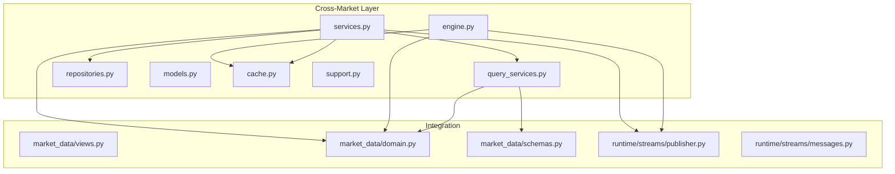
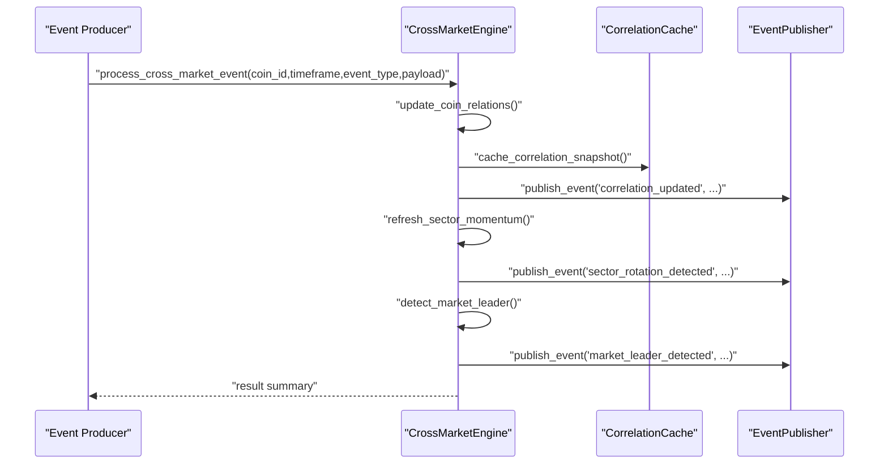
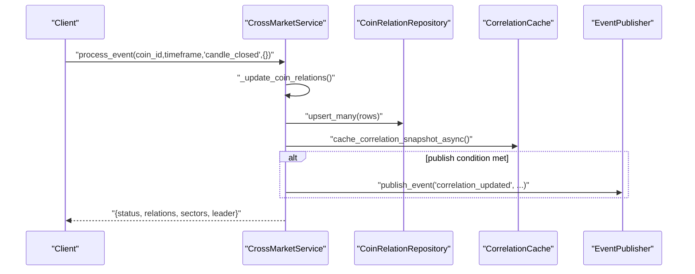
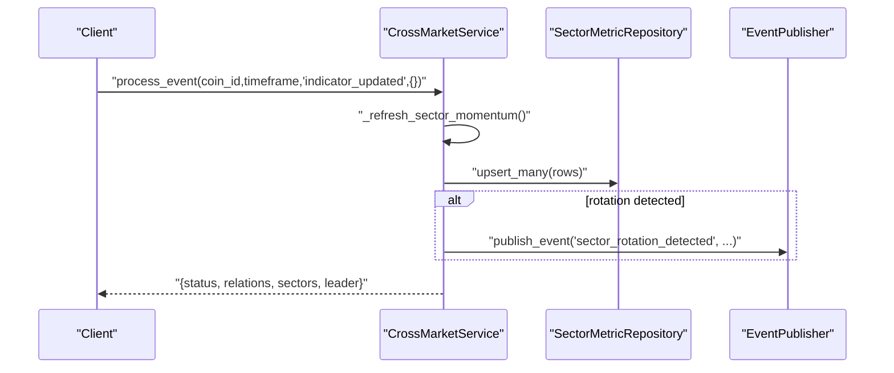
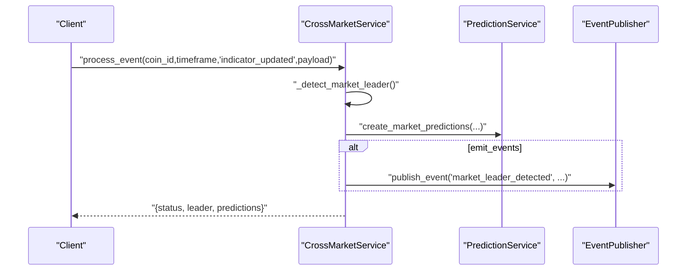
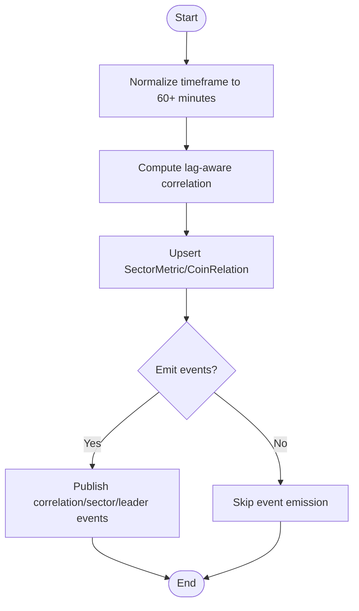
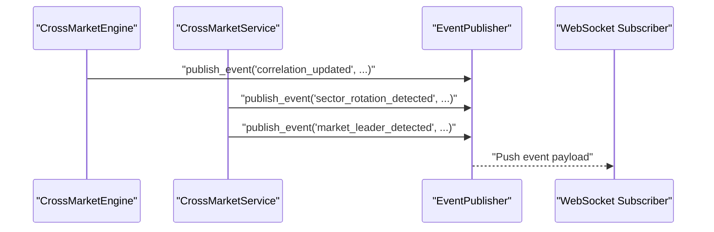
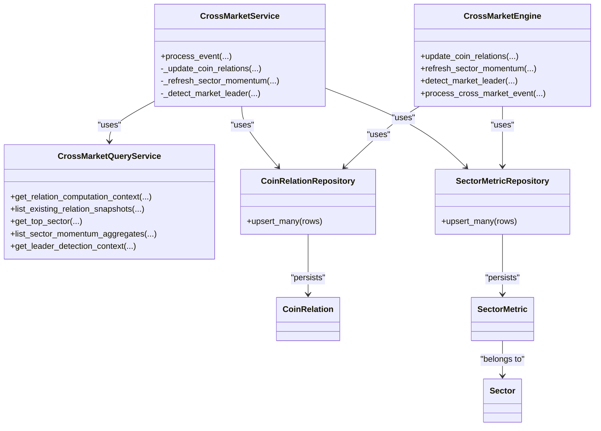

# Cross-Market API

<cite>
**Referenced Files in This Document**
- [engine.py](file://src/apps/cross_market/engine.py)
- [services.py](file://src/apps/cross_market/services.py)
- [query_services.py](file://src/apps/cross_market/query_services.py)
- [repositories.py](file://src/apps/cross_market/repositories.py)
- [models.py](file://src/apps/cross_market/models.py)
- [cache.py](file://src/apps/cross_market/cache.py)
- [support.py](file://src/apps/cross_market/support.py)
- [views.py](file://src/apps/market_data/views.py)
- [domain.py](file://src/apps/market_data/domain.py)
- [schemas.py](file://src/apps/market_data/schemas.py)
- [messages.py](file://src/runtime/streams/messages.py)
- [publisher.py](file://src/runtime/streams/publisher.py)
</cite>

## Table of Contents
1. [Introduction](#introduction)
2. [Project Structure](#project-structure)
3. [Core Components](#core-components)
4. [Architecture Overview](#architecture-overview)
5. [Detailed Component Analysis](#detailed-component-analysis)
6. [Dependency Analysis](#dependency-analysis)
7. [Performance Considerations](#performance-considerations)
8. [Troubleshooting Guide](#troubleshooting-guide)
9. [Conclusion](#conclusion)
10. [Appendices](#appendices)

## Introduction
This document provides comprehensive API documentation for cross-market analysis endpoints. It covers correlation analysis, sector rotation detection, multi-asset market monitoring, and cross-timeframe coordination. It also documents WebSocket endpoints for real-time correlation updates and cross-market event notifications, along with request/response schemas for correlation objects, sector analysis results, and market structure metrics. Authentication, filtering, and pagination guidance are included, with practical examples for crypto-derivatives correlation, sector rotation detection, and cross-market spillover analysis.

## Project Structure
The cross-market subsystem is implemented as a cohesive service layer with supporting models, repositories, query services, caching, and streaming. It integrates with market data and indicators to compute cross-asset relationships and sector momentum, and emits real-time events for downstream consumption.

**Diagram sources**
- [engine.py:1-442](file://src/apps/cross_market/engine.py#L1-L442)
- [services.py:1-483](file://src/apps/cross_market/services.py#L1-L483)
- [query_services.py:1-248](file://src/apps/cross_market/query_services.py#L1-L248)
- [repositories.py:1-64](file://src/apps/cross_market/repositories.py#L1-L64)
- [models.py:1-84](file://src/apps/cross_market/models.py#L1-L84)
- [cache.py:1-172](file://src/apps/cross_market/cache.py#L1-L172)
- [support.py:1-88](file://src/apps/cross_market/support.py#L1-L88)
- [views.py](file://src/apps/market_data/views.py)
- [domain.py](file://src/apps/market_data/domain.py)
- [schemas.py](file://src/apps/market_data/schemas.py)
- [publisher.py](file://src/runtime/streams/publisher.py)
- [messages.py](file://src/runtime/streams/messages.py)

**Section sources**
- [engine.py:1-442](file://src/apps/cross_market/engine.py#L1-L442)
- [services.py:1-483](file://src/apps/cross_market/services.py#L1-L483)
- [query_services.py:1-248](file://src/apps/cross_market/query_services.py#L1-L248)
- [repositories.py:1-64](file://src/apps/cross_market/repositories.py#L1-L64)
- [models.py:1-84](file://src/apps/cross_market/models.py#L1-L84)
- [cache.py:1-172](file://src/apps/cross_market/cache.py#L1-L172)
- [support.py:1-88](file://src/apps/cross_market/support.py#L1-L88)

## Core Components
- CrossMarketEngine: Synchronous computation of correlations, sector momentum, and leader detection; publishes real-time events.
- CrossMarketService: Asynchronous orchestration integrating repositories, query services, candles, and predictions; caches correlation snapshots and emits events.
- CrossMarketQueryService: Reads cross-market context, existing relation snapshots, top sectors, sector aggregates, and leader detection context.
- Repositories: Upsert operations for CoinRelation and SectorMetric.
- Models: ORM definitions for sectors, sector metrics, and coin relations.
- Cache: LRU-backed Redis cache for correlation snapshots with TTL.
- Support: Constants and algorithms for correlation computation, lagged correlation, and normalization.

Key responsibilities:
- Compute lag-aware Pearson correlation between leaders and followers.
- Aggregate sector metrics and detect rotation between sectors.
- Detect market leaders based on regime and activity filters.
- Publish correlation_updated, sector_rotation_detected, and market_leader_detected events.

**Section sources**
- [engine.py:78-390](file://src/apps/cross_market/engine.py#L78-L390)
- [services.py:65-474](file://src/apps/cross_market/services.py#L65-L474)
- [query_services.py:20-244](file://src/apps/cross_market/query_services.py#L20-L244)
- [repositories.py:13-60](file://src/apps/cross_market/repositories.py#L13-L60)
- [models.py:15-81](file://src/apps/cross_market/models.py#L15-L81)
- [cache.py:98-172](file://src/apps/cross_market/cache.py#L98-L172)
- [support.py:39-87](file://src/apps/cross_market/support.py#L39-L87)

## Architecture Overview
The cross-market subsystem orchestrates correlation updates, sector momentum refresh, and leader detection. It reads candle data, computes metrics, persists results, and emits events for real-time subscribers.

**Diagram sources**
- [engine.py:364-390](file://src/apps/cross_market/engine.py#L364-L390)
- [engine.py:78-181](file://src/apps/cross_market/engine.py#L78-L181)
- [engine.py:184-281](file://src/apps/cross_market/engine.py#L184-L281)
- [engine.py:307-361](file://src/apps/cross_market/engine.py#L307-L361)
- [cache.py:98-143](file://src/apps/cross_market/cache.py#L98-L143)
- [publisher.py](file://src/runtime/streams/publisher.py)

**Section sources**
- [engine.py:364-390](file://src/apps/cross_market/engine.py#L364-L390)
- [cache.py:98-143](file://src/apps/cross_market/cache.py#L98-L143)
- [publisher.py](file://src/runtime/streams/publisher.py)

## Detailed Component Analysis

### Correlation Analysis Endpoint
- Purpose: Compute and persist lag-aware correlation between a follower coin and candidate leaders; optionally publish real-time updates.
- Inputs:
  - coin_id: follower coin identifier
  - timeframe: resolution in minutes (normalized to 60+)
  - event_type: controls emission triggers (e.g., candle_closed)
  - payload: optional metadata (ignored for correlation)
- Outputs:
  - status, updated count, published count, best leader, confidence
- Real-time events:
  - correlation_updated: includes leader/follower identifiers, correlation, lag_hours, confidence, timestamp

**Diagram sources**
- [services.py:87-211](file://src/apps/cross_market/services.py#L87-L211)
- [services.py:212-333](file://src/apps/cross_market/services.py#L212-L333)
- [repositories.py:17-33](file://src/apps/cross_market/repositories.py#L17-L33)
- [cache.py:122-143](file://src/apps/cross_market/cache.py#L122-L143)
- [publisher.py](file://src/runtime/streams/publisher.py)

**Section sources**
- [services.py:87-211](file://src/apps/cross_market/services.py#L87-L211)
- [services.py:212-333](file://src/apps/cross_market/services.py#L212-L333)
- [repositories.py:17-33](file://src/apps/cross_market/repositories.py#L17-L33)
- [cache.py:122-143](file://src/apps/cross_market/cache.py#L122-L143)

### Sector Rotation Detection Endpoint
- Purpose: Refresh sector metrics and detect rotation between sectors based on relative strength.
- Inputs:
  - timeframe: resolution in minutes
  - event_type: controls emission triggers (e.g., indicator_updated)
- Outputs:
  - status, updated count, timeframe
- Real-time events:
  - sector_rotation_detected: includes source/target sectors, strengths, timeframe, timestamp

**Diagram sources**
- [services.py:110-190](file://src/apps/cross_market/services.py#L110-L190)
- [services.py:335-399](file://src/apps/cross_market/services.py#L335-L399)
- [repositories.py:40-60](file://src/apps/cross_market/repositories.py#L40-L60)
- [publisher.py](file://src/runtime/streams/publisher.py)

**Section sources**
- [services.py:110-190](file://src/apps/cross_market/services.py#L110-L190)
- [services.py:335-399](file://src/apps/cross_market/services.py#L335-L399)
- [repositories.py:40-60](file://src/apps/cross_market/repositories.py#L40-L60)

### Market Leader Detection Endpoint
- Purpose: Detect market leaders based on activity bucket, price/volume changes, and regime alignment; optionally create predictions.
- Inputs:
  - coin_id: candidate leader
  - timeframe: resolution in minutes
  - event_type: must be indicator_updated
  - payload: supports activity_bucket, price_change_24h, market_regime overrides
- Outputs:
  - status, direction, confidence, predictions summary
- Real-time events:
  - market_leader_detected: includes leader coin, direction, confidence, regime, timestamp

**Diagram sources**
- [services.py:401-474](file://src/apps/cross_market/services.py#L401-L474)
- [publisher.py](file://src/runtime/streams/publisher.py)

**Section sources**
- [services.py:401-474](file://src/apps/cross_market/services.py#L401-L474)

### Cross-Timeframe Coordination
- The engine normalizes input timeframe to at least 60 minutes for correlation computations.
- Sector metrics are stored per timeframe; alignment weighting considers multiple timeframes for bias adjustment.
- The alignment function combines leader decisions, sector trends, and top relations to adjust position weights.

**Diagram sources**
- [engine.py:71-72](file://src/apps/cross_market/engine.py#L71-L72)
- [engine.py:393-441](file://src/apps/cross_market/engine.py#L393-L441)
- [support.py:71-72](file://src/apps/cross_market/support.py#L71-L72)

**Section sources**
- [engine.py:71-72](file://src/apps/cross_market/engine.py#L71-L72)
- [engine.py:393-441](file://src/apps/cross_market/engine.py#L393-L441)
- [support.py:71-72](file://src/apps/cross_market/support.py#L71-L72)

### WebSocket Endpoints and Real-Time Updates
- Event Types:
  - correlation_updated: real-time correlation snapshot for a follower-leader pair
  - sector_rotation_detected: sector rotation detected between two sectors
  - market_leader_detected: market leader identified with direction and confidence
- Consumers subscribe to these topics via the stream publisher/router.

**Diagram sources**
- [engine.py:159-171](file://src/apps/cross_market/engine.py#L159-L171)
- [services.py:140-183](file://src/apps/cross_market/services.py#L140-L183)
- [publisher.py](file://src/runtime/streams/publisher.py)

**Section sources**
- [engine.py:159-171](file://src/apps/cross_market/engine.py#L159-L171)
- [services.py:140-183](file://src/apps/cross_market/services.py#L140-L183)
- [publisher.py](file://src/runtime/streams/publisher.py)

## Dependency Analysis
The cross-market subsystem depends on market data models and schemas, indicators for metrics, and the event streaming infrastructure. It maintains low coupling through repositories and query services.

**Diagram sources**
- [engine.py:78-390](file://src/apps/cross_market/engine.py#L78-L390)
- [services.py:65-474](file://src/apps/cross_market/services.py#L65-L474)
- [query_services.py:20-244](file://src/apps/cross_market/query_services.py#L20-L244)
- [repositories.py:13-60](file://src/apps/cross_market/repositories.py#L13-L60)
- [models.py:15-81](file://src/apps/cross_market/models.py#L15-L81)

**Section sources**
- [engine.py:78-390](file://src/apps/cross_market/engine.py#L78-L390)
- [services.py:65-474](file://src/apps/cross_market/services.py#L65-L474)
- [query_services.py:20-244](file://src/apps/cross_market/query_services.py#L20-L244)
- [repositories.py:13-60](file://src/apps/cross_market/repositories.py#L13-L60)
- [models.py:15-81](file://src/apps/cross_market/models.py#L15-L81)

## Performance Considerations
- Batch upserts: CoinRelationRepository and SectorMetricRepository use ON CONFLICT DO UPDATE to minimize writes.
- Caching: Correlation snapshots are cached in Redis with TTL to reduce recomputation and database load.
- Thresholds: Minimum points and correlation thresholds prevent noisy updates and reduce computational overhead.
- Timeframe normalization: Correlation lookback is normalized to at least 60 minutes to ensure statistical validity.

[No sources needed since this section provides general guidance]

## Troubleshooting Guide
Common issues and resolutions:
- Insufficient candles: If follower or leader series have fewer than minimum points, correlation updates are skipped.
- No candidates found: If no suitable leaders are found, correlation updates are skipped.
- Sector rows not found: If no sector aggregates are available, sector momentum refresh is skipped.
- Leader threshold not met: Leader detection skips unless activity bucket, price/volume changes, and regime align with criteria.

Operational checks:
- Verify Redis connectivity for correlation cache.
- Confirm event emissions are enabled when testing real-time endpoints.
- Validate timeframe normalization and candidate selection logic.

**Section sources**
- [services.py:232-251](file://src/apps/cross_market/services.py#L232-L251)
- [services.py:310-314](file://src/apps/cross_market/services.py#L310-L314)
- [services.py:349-350](file://src/apps/cross_market/services.py#L349-L350)
- [services.py:411-431](file://src/apps/cross_market/services.py#L411-L431)

## Conclusion
The cross-market subsystem provides robust APIs for correlation analysis, sector rotation detection, and leader identification, with real-time event streaming and efficient caching. The modular design enables scalable multi-asset monitoring and cross-timeframe coordination.

[No sources needed since this section summarizes without analyzing specific files]

## Appendices

### Request/Response Schemas

- Correlation Object
  - Fields: leader_coin_id, follower_coin_id, correlation, lag_hours, confidence, updated_at
  - Notes: correlation and confidence are floats; lag_hours is integer; updated_at is timestamp

- Sector Analysis Result
  - Fields: sector_id, timeframe, sector_strength, relative_strength, capital_flow, avg_price_change_24h, avg_volume_change_24h, volatility, trend
  - Notes: trend is one of sideways, bullish, bearish

- Market Structure Metrics
  - Fields: sector_id, timeframe, sector_strength, relative_strength, capital_flow, avg_price_change_24h, avg_volume_change_24h, volatility, trend
  - Notes: aligned with sector analysis result schema

- Leader Detection Result
  - Fields: status, leader_coin_id, direction, confidence, predictions
  - Notes: direction is up/down; predictions is a summary object

- Real-Time Event Payloads
  - correlation_updated: coin_id, timeframe, timestamp, leader_coin_id, follower_coin_id, correlation, lag_hours, confidence
  - sector_rotation_detected: coin_id, timeframe, timestamp, source_sector, target_sector, source_strength, target_strength
  - market_leader_detected: coin_id, timeframe, timestamp, leader_coin_id, leader_symbol, direction, confidence, market_regime

**Section sources**
- [models.py:36-81](file://src/apps/cross_market/models.py#L36-L81)
- [services.py:140-183](file://src/apps/cross_market/services.py#L140-L183)
- [engine.py:159-171](file://src/apps/cross_market/engine.py#L159-L171)

### Authentication and Authorization
- Authentication: Not specified in the cross-market module. Integrate with upstream authentication middleware as per application policy.

[No sources needed since this section provides general guidance]

### Filtering Options
- Asset Classes: Sector associations are used to prioritize same-sector candidates during correlation computation.
- Correlation Thresholds: Minimum correlation and minimum points are enforced to filter weak signals.
- Timeframe Normalization: Correlation lookback and lag windows are normalized by timeframe.

**Section sources**
- [query_services.py:72-87](file://src/apps/cross_market/query_services.py#L72-L87)
- [support.py:5-10](file://src/apps/cross_market/support.py#L5-L10)
- [engine.py:71-72](file://src/apps/cross_market/engine.py#L71-L72)

### Pagination for Historical Correlation Data
- Current implementation focuses on snapshot updates and real-time events. Historical pagination is not exposed in the documented endpoints. To paginate historical correlation data, extend the query service to support offset/limit and sorting by updated_at or correlation magnitude.

[No sources needed since this section provides general guidance]

### Practical Examples

- Monitoring Crypto-Derivatives Correlation
  - Trigger correlation updates for a derivative coin after a candle closes.
  - Subscribe to correlation_updated events to receive real-time updates for leader/follower pairs.
  - Use sector associations to focus on correlated assets within the same sector.

- Detecting Sector Rotation Patterns
  - Periodically trigger sector momentum refresh with desired timeframe.
  - Subscribe to sector_rotation_detected events to identify shifts between sectors.
  - Combine with leader detection to confirm directional bias.

- Analyzing Cross-Market Spillover Effects
  - Compute lag-aware correlations between major spot and derivatives.
  - Monitor correlation_updated events for significant changes exceeding thresholds.
  - Use sector metrics to contextualize spillover impact across sectors.

**Section sources**
- [services.py:104-124](file://src/apps/cross_market/services.py#L104-L124)
- [engine.py:364-390](file://src/apps/cross_market/engine.py#L364-L390)
- [support.py:39-68](file://src/apps/cross_market/support.py#L39-L68)