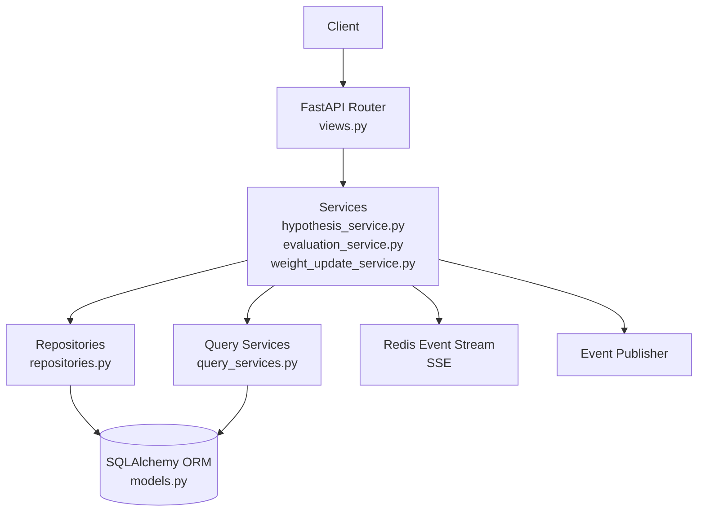
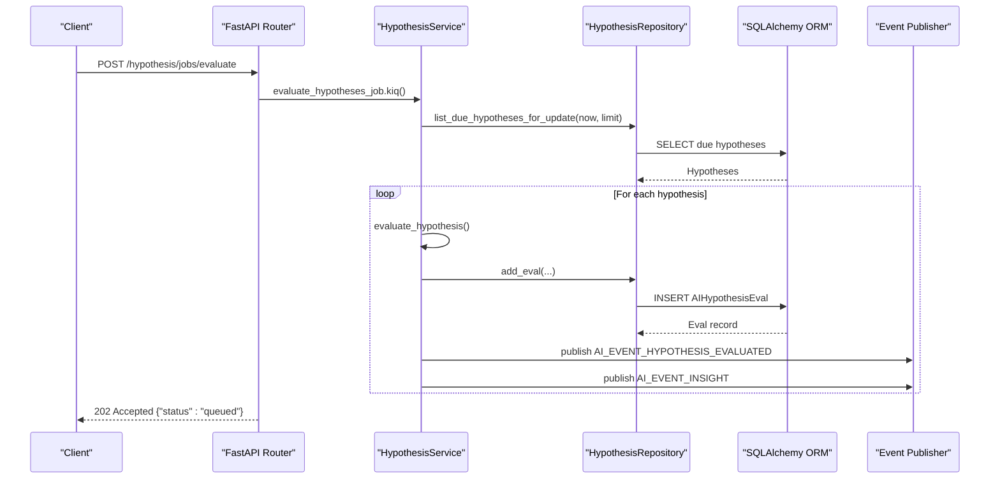
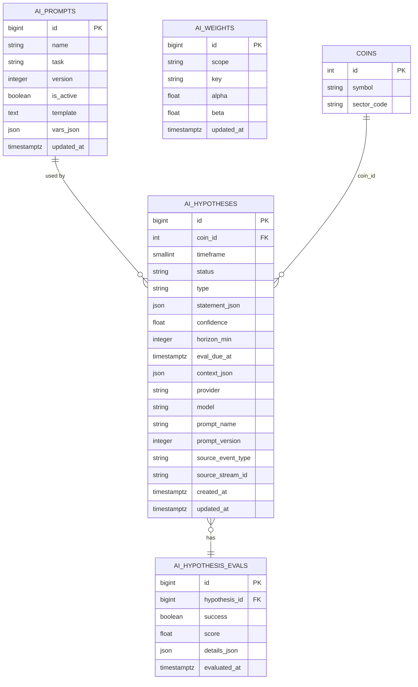
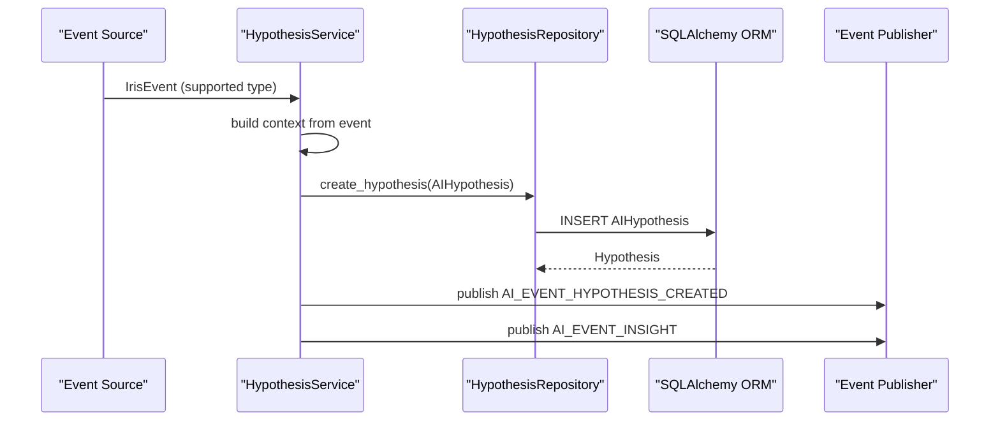
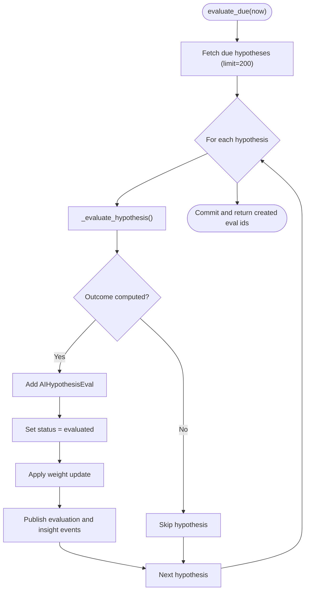
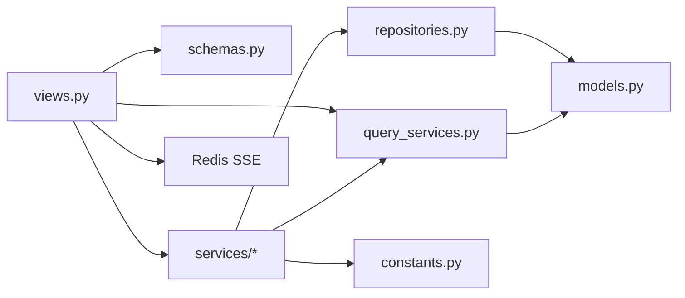

# Hypothesis Engine API

<cite>
**Referenced Files in This Document**
- [views.py](file://src/apps/hypothesis_engine/views.py)
- [schemas.py](file://src/apps/hypothesis_engine/schemas.py)
- [models.py](file://src/apps/hypothesis_engine/models.py)
- [constants.py](file://src/apps/hypothesis_engine/constants.py)
- [query_services.py](file://src/apps/hypothesis_engine/query_services.py)
- [repositories.py](file://src/apps/hypothesis_engine/repositories.py)
- [hypothesis_selectors.py](file://src/apps/hypothesis_engine/selectors/hypothesis_selectors.py)
- [hypothesis_service.py](file://src/apps/hypothesis_engine/services/hypothesis_service.py)
- [evaluation_service.py](file://src/apps/hypothesis_engine/services/evaluation_service.py)
- [weight_update_service.py](file://src/apps/hypothesis_engine/services/weight_update_service.py)
</cite>

## Table of Contents
1. [Introduction](#introduction)
2. [Project Structure](#project-structure)
3. [Core Components](#core-components)
4. [Architecture Overview](#architecture-overview)
5. [Detailed Component Analysis](#detailed-component-analysis)
6. [Dependency Analysis](#dependency-analysis)
7. [Performance Considerations](#performance-considerations)
8. [Troubleshooting Guide](#troubleshooting-guide)
9. [Conclusion](#conclusion)
10. [Appendices](#appendices)

## Introduction
This document provides comprehensive API documentation for the Hypothesis Engine subsystem. It covers REST endpoints for hypothesis creation, provider integration, hypothesis evaluation, and weight management queries. It also documents endpoints for hypothesis history, provider configuration via prompts, and hypothesis validation results. Real-time updates are available through WebSocket-style Server-Sent Events (SSE). The documentation includes request/response schemas, authentication requirements, filtering options, pagination, and practical examples for generating market hypotheses, configuring evaluation weights, and monitoring performance over time.

## Project Structure
The Hypothesis Engine API is implemented as a FastAPI router with Pydantic models and SQLAlchemy ORM entities. Business logic is encapsulated in services, with data access handled by repositories and query services. SSE streaming integrates with an event stream for real-time notifications.

**Diagram sources**
- [views.py:26](file://src/apps/hypothesis_engine/views.py#L26)
- [hypothesis_service.py:21](file://src/apps/hypothesis_engine/services/hypothesis_service.py#L21)
- [evaluation_service.py:39](file://src/apps/hypothesis_engine/services/evaluation_service.py#L39)
- [weight_update_service.py:21](file://src/apps/hypothesis_engine/services/weight_update_service.py#L21)
- [repositories.py:15](file://src/apps/hypothesis_engine/repositories.py#L15)
- [query_services.py:24](file://src/apps/hypothesis_engine/query_services.py#L24)
- [models.py:15](file://src/apps/hypothesis_engine/models.py#L15)

**Section sources**
- [views.py:26](file://src/apps/hypothesis_engine/views.py#L26)
- [models.py:15](file://src/apps/hypothesis_engine/models.py#L15)

## Core Components
- REST endpoints for prompts and hypotheses
- SSE endpoint for real-time AI events
- Evaluation job endpoint
- Pydantic schemas for request/response models
- SQLAlchemy models for persistence
- Services orchestrating business logic
- Repositories and query services for data access

Key capabilities:
- Create and manage AI prompts used for hypothesis generation
- List hypotheses with filtering and pagination
- List evaluation results with filtering
- Trigger evaluation jobs
- Subscribe to real-time AI insights and updates via SSE

**Section sources**
- [views.py:87](file://src/apps/hypothesis_engine/views.py#L87)
- [views.py:126](file://src/apps/hypothesis_engine/views.py#L126)
- [views.py:137](file://src/apps/hypothesis_engine/views.py#L137)
- [views.py:147](file://src/apps/hypothesis_engine/views.py#L147)
- [views.py:155](file://src/apps/hypothesis_engine/views.py#L155)

## Architecture Overview
The API follows a layered architecture:
- Presentation layer: FastAPI router exposing endpoints
- Application services: Orchestrate workflows and coordinate repositories/query services
- Persistence: SQLAlchemy ORM with indexed tables for prompts, hypotheses, evaluations, and weights
- Eventing: Redis-backed event stream for SSE and internal events

**Diagram sources**
- [views.py:147](file://src/apps/hypothesis_engine/views.py#L147)
- [hypothesis_service.py:28](file://src/apps/hypothesis_engine/services/hypothesis_service.py#L28)
- [evaluation_service.py:46](file://src/apps/hypothesis_engine/services/evaluation_service.py#L46)
- [repositories.py:59](file://src/apps/hypothesis_engine/repositories.py#L59)
- [models.py:78](file://src/apps/hypothesis_engine/models.py#L78)

## Detailed Component Analysis

### REST Endpoints

#### Prompts
- GET /hypothesis/prompts
  - Query parameters:
    - name: string (optional)
  - Response: array of AIPromptRead
- POST /hypothesis/prompts
  - Request body: AIPromptCreate
  - Response: AIPromptRead
- PATCH /hypothesis/prompts/{prompt_id}
  - Path parameter: prompt_id (integer)
  - Request body: AIPromptUpdate
  - Response: AIPromptRead
- POST /hypothesis/prompts/{prompt_id}/activate
  - Path parameter: prompt_id (integer)
  - Response: AIPromptRead

Authentication: Not specified in the router; consult application-wide authentication configuration.

Filtering and pagination: Not applicable for prompts.

Example usage:
- Create a new prompt version by sending AIPromptCreate
- Activate a specific prompt version by ID

**Section sources**
- [views.py:87](file://src/apps/hypothesis_engine/views.py#L87)
- [views.py:95](file://src/apps/hypothesis_engine/views.py#L95)
- [views.py:106](file://src/apps/hypothesis_engine/views.py#L106)
- [views.py:118](file://src/apps/hypothesis_engine/views.py#L118)

#### Hypotheses
- GET /hypothesis/hypotheses
  - Query parameters:
    - limit: integer, default 50, min 1, max 500
    - status: string (optional)
    - coin_id: integer (optional, min 1)
  - Response: array of AIHypothesisRead

Authentication: Not specified in the router.

Pagination: Controlled by limit parameter; ordering is by created_at descending.

Filtering: By status and coin_id.

Example usage:
- List recent active hypotheses for a specific coin
- Filter by status to see evaluated vs active

**Section sources**
- [views.py:126](file://src/apps/hypothesis_engine/views.py#L126)
- [query_services.py:60](file://src/apps/hypothesis_engine/query_services.py#L60)
- [hypothesis_selectors.py:28](file://src/apps/hypothesis_engine/selectors/hypothesis_selectors.py#L28)

#### Evaluations
- GET /hypothesis/evals
  - Query parameters:
    - limit: integer, default 50, min 1, max 500
    - hypothesis_id: integer (optional, min 1)
  - Response: array of AIHypothesisEvalRead

Authentication: Not specified in the router.

Pagination: Controlled by limit parameter; ordering is by evaluated_at descending.

Filtering: By hypothesis_id.

Example usage:
- Retrieve evaluation history for a specific hypothesis
- Paginate through recent evaluations

**Section sources**
- [views.py:137](file://src/apps/hypothesis_engine/views.py#L137)
- [query_services.py:79](file://src/apps/hypothesis_engine/query_services.py#L79)
- [hypothesis_selectors.py:47](file://src/apps/hypothesis_engine/selectors/hypothesis_selectors.py#L47)

#### Evaluation Job
- POST /hypothesis/jobs/evaluate
  - Response: 202 Accepted with {"status": "queued"}

Authentication: Not specified in the router.

Example usage:
- Trigger batch evaluation of due hypotheses

**Section sources**
- [views.py:147](file://src/apps/hypothesis_engine/views.py#L147)

#### Real-time Updates (SSE)
- GET /hypothesis/sse/ai
  - Query parameters:
    - cursor: string (optional)
    - once: boolean, default false
  - Response: text/event-stream

Authentication: Not specified in the router.

Behavior:
- Subscribes to Redis event stream
- Filters events by AI_STREAM_PREFIXES
- Emits Server-Sent Events with event type and payload

Example usage:
- Connect with long-lived connection to receive live AI insights and updates

**Section sources**
- [views.py:155](file://src/apps/hypothesis_engine/views.py#L155)
- [constants.py:21](file://src/apps/hypothesis_engine/constants.py#L21)

### Request/Response Schemas

#### AIPromptCreate
- name: string
- task: string
- version: integer, default 1, min 1
- template: string
- vars_json: object, default {}

#### AIPromptUpdate
- task: string or null
- template: string or null
- vars_json: object or null
- is_active: boolean or null

#### AIPromptRead
- id: integer
- name: string
- task: string
- version: integer
- is_active: boolean
- template: string
- vars_json: object
- updated_at: datetime (ISO format)

#### AIHypothesisRead
- id: integer
- coin_id: integer
- timeframe: integer
- status: string
- hypothesis_type: string
- statement_json: object
- confidence: number (float)
- horizon_min: integer
- eval_due_at: datetime (ISO format)
- context_json: object
- provider: string
- model: string
- prompt_name: string
- prompt_version: integer
- source_event_type: string
- source_stream_id: string or null
- created_at: datetime (ISO format)
- updated_at: datetime (ISO format)

#### AIHypothesisEvalRead
- id: integer
- hypothesis_id: integer
- success: boolean
- score: number (float)
- details_json: object
- evaluated_at: datetime (ISO format)

#### AIWeightRead
- id: integer
- scope: string
- weight_key: string
- alpha: number (float)
- beta: number (float)
- updated_at: datetime (ISO format)
- posterior_mean: number (float)

#### AISSEEnvelope
- event: string
- payload: object

Notes:
- Filtering and pagination are applied at the query layer for lists
- Confidence and scores are floating-point numbers
- ISO format datetime strings are used consistently

**Section sources**
- [schemas.py:9](file://src/apps/hypothesis_engine/schemas.py#L9)
- [schemas.py:17](file://src/apps/hypothesis_engine/schemas.py#L17)
- [schemas.py:24](file://src/apps/hypothesis_engine/schemas.py#L24)
- [schemas.py:37](file://src/apps/hypothesis_engine/schemas.py#L37)
- [schemas.py:60](file://src/apps/hypothesis_engine/schemas.py#L60)
- [schemas.py:71](file://src/apps/hypothesis_engine/schemas.py#L71)
- [schemas.py:81](file://src/apps/hypothesis_engine/schemas.py#L81)

### Data Models and Relationships

**Diagram sources**
- [models.py:15](file://src/apps/hypothesis_engine/models.py#L15)
- [models.py:37](file://src/apps/hypothesis_engine/models.py#L37)
- [models.py:78](file://src/apps/hypothesis_engine/models.py#L78)
- [models.py:95](file://src/apps/hypothesis_engine/models.py#L95)
- [models.py:12](file://src/apps/hypothesis_engine/models.py#L12)

**Section sources**
- [models.py:15](file://src/apps/hypothesis_engine/models.py#L15)
- [models.py:37](file://src/apps/hypothesis_engine/models.py#L37)
- [models.py:78](file://src/apps/hypothesis_engine/models.py#L78)
- [models.py:95](file://src/apps/hypothesis_engine/models.py#L95)

### Business Logic Components

#### HypothesisService
Responsibilities:
- Create hypotheses from supported source events
- Generate reasoning context and persist hypothesis
- Publish events for created hypothesis and insights

Key methods:
- create_from_event(event): Creates a hypothesis from an IrisEvent and publishes related events

**Diagram sources**
- [hypothesis_service.py:28](file://src/apps/hypothesis_engine/services/hypothesis_service.py#L28)
- [hypothesis_service.py:45](file://src/apps/hypothesis_engine/services/hypothesis_service.py#L45)
- [hypothesis_service.py:78](file://src/apps/hypothesis_engine/services/hypothesis_service.py#L78)

**Section sources**
- [hypothesis_service.py:21](file://src/apps/hypothesis_engine/services/hypothesis_service.py#L21)
- [hypothesis_service.py:28](file://src/apps/hypothesis_engine/services/hypothesis_service.py#L28)

#### EvaluationService
Responsibilities:
- Evaluate hypotheses due for assessment
- Compute outcome and score based on realized return vs target move
- Persist evaluation results and publish events
- Apply weight updates based on outcomes

Key methods:
- evaluate_due(now): Processes up to limit due hypotheses
- _evaluate_hypothesis(hypothesis, now): Computes success and score
- apply_to_evaluation(evaluation): Applies Bayesian weights

**Diagram sources**
- [evaluation_service.py:46](file://src/apps/hypothesis_engine/services/evaluation_service.py#L46)
- [evaluation_service.py:106](file://src/apps/hypothesis_engine/services/evaluation_service.py#L106)
- [weight_update_service.py:35](file://src/apps/hypothesis_engine/services/weight_update_service.py#L35)

**Section sources**
- [evaluation_service.py:39](file://src/apps/hypothesis_engine/services/evaluation_service.py#L39)
- [evaluation_service.py:106](file://src/apps/hypothesis_engine/services/evaluation_service.py#L106)

#### WeightUpdateService
Responsibilities:
- Maintain Bayesian weights per hypothesis type
- Decay prior parameters and update based on outcome
- Publish weight update events

Key methods:
- apply_to_evaluation(evaluation): Updates alpha/beta and emits event

**Section sources**
- [weight_update_service.py:21](file://src/apps/hypothesis_engine/services/weight_update_service.py#L21)
- [weight_update_service.py:35](file://src/apps/hypothesis_engine/services/weight_update_service.py#L35)

### Data Access Layer

#### HypothesisQueryService
Provides read-only queries:
- list_prompts(name=None)
- get_prompt_read_by_id(prompt_id)
- get_active_prompt(name)
- list_hypotheses(limit, status=None, coin_id=None)
- list_evals(limit, hypothesis_id=None)
- get_coin_context(coin_id)
- get_candle_window(coin_id, timeframe, start, end)

**Section sources**
- [query_services.py:24](file://src/apps/hypothesis_engine/query_services.py#L24)
- [query_services.py:28](file://src/apps/hypothesis_engine/query_services.py#L28)
- [query_services.py:60](file://src/apps/hypothesis_engine/query_services.py#L60)
- [query_services.py:79](file://src/apps/hypothesis_engine/query_services.py#L79)
- [query_services.py:113](file://src/apps/hypothesis_engine/query_services.py#L113)

#### HypothesisRepository
Provides write operations and direct SQL:
- get_prompt_for_update(prompt_id)
- get_prompt_by_name_version(name, version)
- list_prompts_for_update(name=None)
- add_prompt(prompt)
- add_hypothesis(hypothesis)
- list_due_hypotheses_for_update(now, limit)
- add_eval(evaluation)
- get_eval_for_update(eval_id)
- get_weight_for_update(scope, key)
- add_weight(weight)

**Section sources**
- [repositories.py:15](file://src/apps/hypothesis_engine/repositories.py#L15)
- [repositories.py:59](file://src/apps/hypothesis_engine/repositories.py#L59)
- [repositories.py:101](file://src/apps/hypothesis_engine/repositories.py#L101)

## Dependency Analysis

**Diagram sources**
- [views.py:14](file://src/apps/hypothesis_engine/views.py#L14)
- [query_services.py:8](file://src/apps/hypothesis_engine/query_services.py#L8)
- [repositories.py:10](file://src/apps/hypothesis_engine/repositories.py#L10)
- [models.py:6](file://src/apps/hypothesis_engine/models.py#L6)
- [constants.py:3](file://src/apps/hypothesis_engine/constants.py#L3)

**Section sources**
- [views.py:14](file://src/apps/hypothesis_engine/views.py#L14)
- [query_services.py:8](file://src/apps/hypothesis_engine/query_services.py#L8)
- [repositories.py:10](file://src/apps/hypothesis_engine/repositories.py#L10)
- [models.py:6](file://src/apps/hypothesis_engine/models.py#L6)
- [constants.py:3](file://src/apps/hypothesis_engine/constants.py#L3)

## Performance Considerations
- Pagination limits: Hypotheses and evaluations endpoints enforce max limit (default 50, max 500) to prevent heavy queries.
- Batch evaluation: EvaluationService processes up to 200 due hypotheses per run to balance load.
- Indexes: Models define strategic indexes for common filters (status, eval_due_at, coin/timeframe, type/confidence).
- SSE streaming: Uses Redis XREADGROUP/XACK for efficient event consumption; optional cursor supports resuming.

[No sources needed since this section provides general guidance]

## Troubleshooting Guide
Common issues and resolutions:
- Invalid prompt payload during creation: Expect HTTP 400 with error details.
- Prompt not found during activation/update: Expect HTTP 404.
- No candle data for evaluation window: Evaluation skipped until sufficient data is available.
- SSE subscription errors: Verify Redis connectivity and group creation; ensure event stream name matches configuration.

**Section sources**
- [views.py:102](file://src/apps/hypothesis_engine/views.py#L102)
- [views.py:121](file://src/apps/hypothesis_engine/views.py#L121)
- [evaluation_service.py:118](file://src/apps/hypothesis_engine/services/evaluation_service.py#L118)

## Conclusion
The Hypothesis Engine API provides a robust foundation for generating, evaluating, and monitoring market hypotheses. It offers flexible filtering and pagination, real-time insights via SSE, and a structured approach to prompt management and weight updates. Integrators can leverage these endpoints to build automated hypothesis pipelines and monitor performance over time.

[No sources needed since this section summarizes without analyzing specific files]

## Appendices

### Authentication
- Not specified in the router code; consult application-wide authentication configuration.

[No sources needed since this section provides general guidance]

### Practical Examples

- Generate a market hypothesis using AI providers
  - Trigger evaluation job: POST /hypothesis/jobs/evaluate
  - Subscribe to SSE: GET /hypothesis/sse/ai
  - Observe hypothesis_created and ai_insight events

- Configure hypothesis evaluation weights
  - Create or update prompts via POST/PATCH /hypothesis/prompts
  - Activate desired prompt via POST /hypothesis/prompts/{prompt_id}/activate
  - Monitor weight updates via SSE ai_weights_updated events

- Monitor hypothesis performance over time
  - List hypotheses: GET /hypothesis/hypotheses with filters and limit
  - List evaluations: GET /hypothesis/evals with hypothesis_id filter
  - Track evaluation outcomes and posterior mean updates via SSE

[No sources needed since this section provides general guidance]