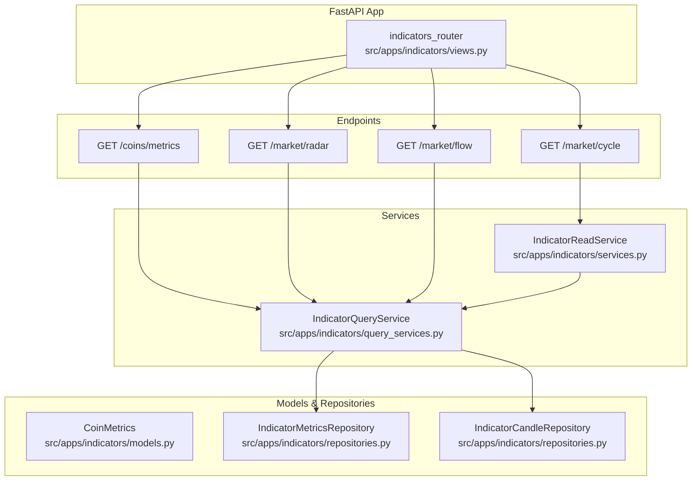
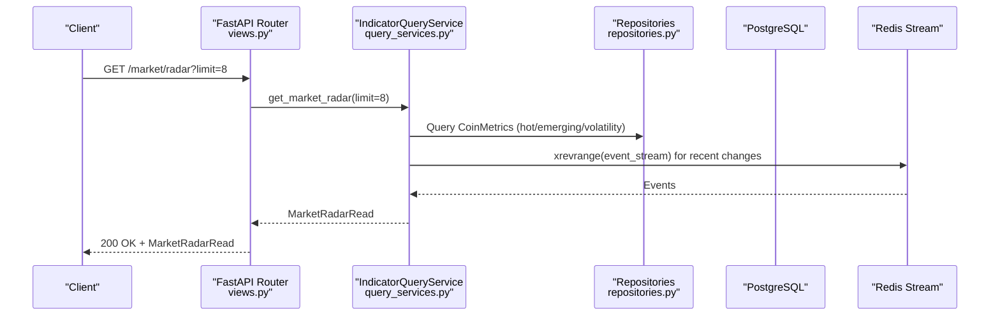
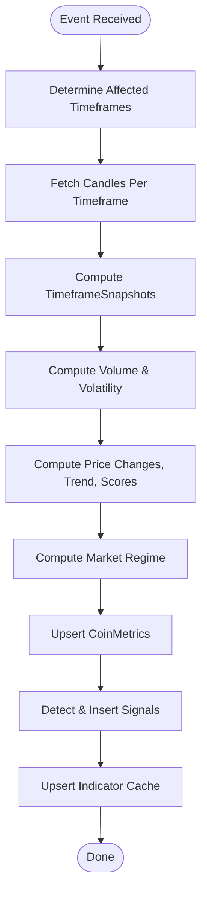
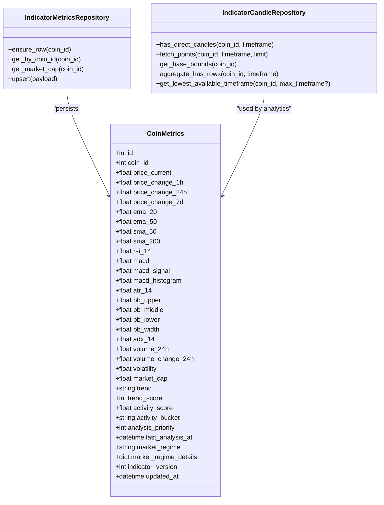
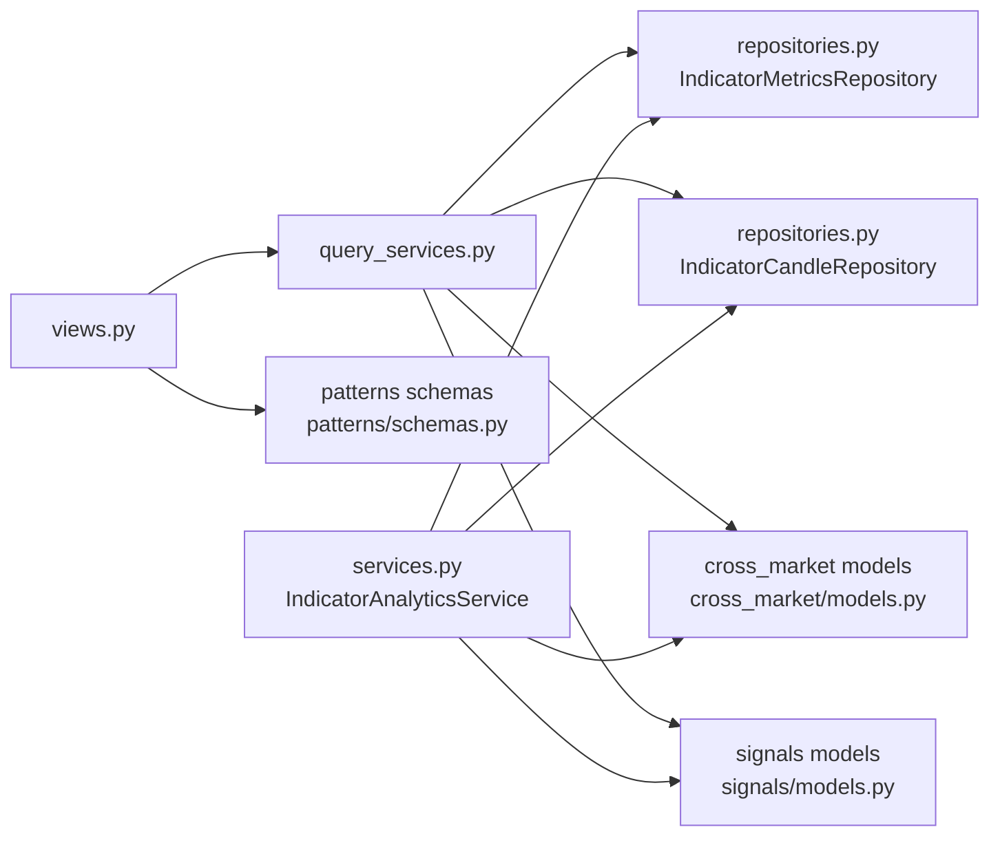

# Indicators API

<cite>
**Referenced Files in This Document**
- [views.py](file://src/apps/indicators/views.py)
- [schemas.py](file://src/apps/indicators/schemas.py)
- [query_services.py](file://src/apps/indicators/query_services.py)
- [services.py](file://src/apps/indicators/services.py)
- [analytics.py](file://src/apps/indicators/analytics.py)
- [domain.py](file://src/apps/indicators/domain.py)
- [read_models.py](file://src/apps/indicators/read_models.py)
- [models.py](file://src/apps/indicators/models.py)
- [repositories.py](file://src/apps/indicators/repositories.py)
- [snapshots.py](file://src/apps/indicators/snapshots.py)
- [app.py](file://src/core/bootstrap/app.py)
- [main.py](file://src/main.py)
</cite>

## Table of Contents
1. [Introduction](#introduction)
2. [Project Structure](#project-structure)
3. [Core Components](#core-components)
4. [Architecture Overview](#architecture-overview)
5. [Detailed Component Analysis](#detailed-component-analysis)
6. [Dependency Analysis](#dependency-analysis)
7. [Performance Considerations](#performance-considerations)
8. [Troubleshooting Guide](#troubleshooting-guide)
9. [Conclusion](#conclusion)
10. [Appendices](#appendices)

## Introduction
This document describes the Indicators API, focusing on REST endpoints for technical indicators and analytics. It covers:
- REST endpoints for coin metrics, market radar, and market flow
- Request/response schemas for indicator objects, radar data, and flow metrics
- Filtering and limits supported by the endpoints
- Analytics processing pipeline for indicator calculations and signal detection
- Real-time update mechanisms via event streaming

It does not document WebSocket endpoints, as none are present in the indicators module.

## Project Structure
The Indicators API is implemented as a FastAPI router mounted under the application. The endpoints are defined in the indicators views module and backed by query services, repositories, and analytics logic.

**Diagram sources**
- [views.py:13-45](file://src/apps/indicators/views.py#L13-L45)
- [query_services.py:59-446](file://src/apps/indicators/query_services.py#L59-L446)
- [services.py:141-176](file://src/apps/indicators/services.py#L141-L176)
- [models.py:15-121](file://src/apps/indicators/models.py#L15-L121)
- [repositories.py:310-350](file://src/apps/indicators/repositories.py#L310-L350)

**Section sources**
- [app.py:68-77](file://src/core/bootstrap/app.py#L68-L77)
- [main.py:1-22](file://src/main.py#L1-L22)

## Core Components
- REST endpoints:
  - GET /coins/metrics: Returns a list of coin metrics with technical indicators and analytics fields.
  - GET /market/radar: Returns market radar data including hot emerging coins, regime changes, and volatility spikes.
  - GET /market/flow: Returns market flow data including leaders, relations, sectors, and sector rotations.
  - GET /market/cycle: Returns market cycle data filtered by optional symbol and timeframe.
- Data models:
  - CoinMetricsRead, MarketRadarRead, MarketFlowRead, MarketLeaderRead, CoinRelationRead, SectorMomentumRead, SectorRotationRead, MarketRegimeChangeRead.
- Analytics pipeline:
  - IndicatorAnalyticsService processes candle events, computes technical indicators, detects signals, and persists metrics.
  - IndicatorReadService exposes read-only queries for radar, flow, and metrics.
- Event streaming:
  - Recent radar and flow items are also populated from Redis event stream for near-real-time updates.

**Section sources**
- [views.py:13-45](file://src/apps/indicators/views.py#L13-L45)
- [schemas.py:8-156](file://src/apps/indicators/schemas.py#L8-L156)
- [services.py:141-176](file://src/apps/indicators/services.py#L141-L176)
- [query_services.py:59-446](file://src/apps/indicators/query_services.py#L59-L446)

## Architecture Overview
The API follows a layered architecture:
- Views: Define endpoints and request validation.
- Services: Encapsulate analytics and read logic.
- Query Services: Orchestrate reads from repositories and Redis.
- Repositories: Access database and external aggregates.
- Analytics: Compute indicators and detect signals.

**Diagram sources**
- [views.py:29-34](file://src/apps/indicators/views.py#L29-L34)
- [query_services.py:321-381](file://src/apps/indicators/query_services.py#L321-L381)
- [repositories.py:310-350](file://src/apps/indicators/repositories.py#L310-L350)

## Detailed Component Analysis

### REST Endpoints

#### GET /coins/metrics
- Purpose: Retrieve technical indicators and analytics for all enabled coins.
- Response: Array of CoinMetricsRead.
- Filters: None (returns all enabled coins ordered by symbol).
- Pagination: Not applicable; returns all matching records.

Response schema: CoinMetricsRead
- Fields include price metrics, moving averages, RSI, MACD, ATR, Bollinger Bands, ADX, volume metrics, volatility, market cap, trend, trend_score, activity metrics, regime info, and timestamps.

**Section sources**
- [views.py:13-16](file://src/apps/indicators/views.py#L13-L16)
- [schemas.py:8-45](file://src/apps/indicators/schemas.py#L8-L45)
- [query_services.py:63-111](file://src/apps/indicators/query_services.py#L63-L111)

#### GET /market/radar
- Purpose: Get market radar insights including hot emerging coins, regime changes, and volatility spikes.
- Query parameters:
  - limit: integer, default 8, min 1, max 24.
- Response: MarketRadarRead containing:
  - hot_coins: MarketRadarCoinRead[]
  - emerging_coins: MarketRadarCoinRead[]
  - regime_changes: MarketRegimeChangeRead[]
  - volatility_spikes: MarketRadarCoinRead[]

Behavior:
- Hot and emerging lists are derived from CoinMetrics with activity filters.
- Regime changes are fetched from Redis event stream.
- Volatility spikes are selected from CoinMetrics by volatility ranking.

**Section sources**
- [views.py:29-34](file://src/apps/indicators/views.py#L29-L34)
- [schemas.py:108-143](file://src/apps/indicators/schemas.py#L108-L143)
- [query_services.py:321-381](file://src/apps/indicators/query_services.py#L321-L381)

#### GET /market/flow
- Purpose: Get market flow data including leaders, relations, sectors, and sector rotations.
- Query parameters:
  - limit: integer, default 8, min 1, max 24.
  - timeframe: integer, default 60, min 15, max 1440.
- Response: MarketFlowRead containing:
  - leaders: MarketLeaderRead[]
  - relations: CoinRelationRead[]
  - sectors: SectorMomentumRead[]
  - rotations: SectorRotationRead[]

Behavior:
- Leaders are recent market leaders from Redis.
- Relations are top correlated coin pairs from CoinRelation.
- Sectors are SectorMetric entries filtered by timeframe.
- Rotations are sector rotation events from Redis.

**Section sources**
- [views.py:37-45](file://src/apps/indicators/views.py#L37-L45)
- [schemas.py:99-156](file://src/apps/indicators/schemas.py#L99-L156)
- [query_services.py:383-446](file://src/apps/indicators/query_services.py#L383-L446)

#### GET /market/cycle
- Purpose: Retrieve market cycle data.
- Query parameters:
  - symbol: optional string filter.
  - timeframe: optional integer filter.
- Response: Array of MarketCycleRead.

**Section sources**
- [views.py:19-26](file://src/apps/indicators/views.py#L19-L26)
- [schemas.py:1-200](file://src/apps/patterns/schemas.py#L1-L200)

### Request/Response Schemas

#### CoinMetricsRead
- Description: Complete technical indicator and analytics snapshot for a coin.
- Typical fields: price_current, price_change_1h, price_change_24h, price_change_7d, ema_20, ema_50, sma_50, sma_200, rsi_14, macd, macd_signal, macd_histogram, atr_14, bb_upper, bb_middle, bb_lower, bb_width, adx_14, volume_24h, volume_change_24h, volatility, market_cap, trend, trend_score, activity_score, activity_bucket, analysis_priority, last_analysis_at, market_regime, market_regime_details, indicator_version, updated_at.

**Section sources**
- [schemas.py:8-45](file://src/apps/indicators/schemas.py#L8-L45)

#### MarketRadarRead
- Description: Market radar composition.
- Fields: hot_coins[], emerging_coins[], regime_changes[], volatility_spikes[].

**Section sources**
- [schemas.py:137-143](file://src/apps/indicators/schemas.py#L137-L143)

#### MarketFlowRead
- Description: Market flow composition.
- Fields: leaders[], relations[], sectors[], rotations[].

**Section sources**
- [schemas.py:99-106](file://src/apps/indicators/schemas.py#L99-L106)

#### Related Schemas
- MarketLeaderRead, CoinRelationRead, SectorMomentumRead, SectorRotationRead, MarketRegimeChangeRead.

**Section sources**
- [schemas.py:48-156](file://src/apps/indicators/schemas.py#L48-L156)

### Analytics Pipeline

#### IndicatorAnalyticsService
- Processes candle analytics events for a given coin/timeframe/timestamp.
- Computes indicators across multiple timeframes, detects signals, and persists metrics.
- Refreshes continuous aggregates for affected timeframes.

Key steps:
- Determine affected timeframes around the event timestamp.
- Fetch candles per timeframe and compute snapshots.
- Aggregate volume and compute volatility.
- Compute price changes, trend, trend_score, activity fields, and market regime.
- Upsert CoinMetrics and cache snapshots.
- Detect signals and persist them.

**Diagram sources**
- [services.py:189-339](file://src/apps/indicators/services.py#L189-L339)
- [analytics.py:117-220](file://src/apps/indicators/analytics.py#L117-L220)

**Section sources**
- [services.py:178-339](file://src/apps/indicators/services.py#L178-L339)
- [analytics.py:106-220](file://src/apps/indicators/analytics.py#L106-L220)

#### IndicatorReadService
- Provides read-only access to:
  - list_coin_metrics()
  - list_signals(symbol?, timeframe?, limit?)
  - get_market_radar(limit?)
  - get_market_flow(limit?, timeframe?)

**Section sources**
- [services.py:141-176](file://src/apps/indicators/services.py#L141-L176)

#### IndicatorQueryService
- Implements the read queries for:
  - list_coin_metrics(): Full coin metrics join with Coin.
  - list_signals(): Filtered by symbol and timeframe with limit.
  - get_market_radar(): Hot/emerging/volatility spikes with regime changes from Redis.
  - get_market_flow(): Leaders, relations, sectors, rotations with recent events from Redis.
  - list_recent_* helpers: Pull recent events from Redis stream.

**Section sources**
- [query_services.py:63-446](file://src/apps/indicators/query_services.py#L63-L446)

### Data Models and Repositories

**Diagram sources**
- [models.py:15-121](file://src/apps/indicators/models.py#L15-L121)
- [repositories.py:310-350](file://src/apps/indicators/repositories.py#L310-L350)
- [repositories.py:93-232](file://src/apps/indicators/repositories.py#L93-L232)

**Section sources**
- [models.py:15-121](file://src/apps/indicators/models.py#L15-L121)
- [repositories.py:93-232](file://src/apps/indicators/repositories.py#L93-L232)
- [repositories.py:310-350](file://src/apps/indicators/repositories.py#L310-L350)

### Technical Indicator Calculations
- Implemented in analytics.py and domain.py:
  - SMA, EMA, RSI, MACD, ATR, Bollinger Bands, ADX.
- Timeframe snapshots computed per candle series.
- Signal detection includes golden/death crosses, breakouts, trend reversals, volume spikes, and RSI extremes.

**Section sources**
- [analytics.py:106-220](file://src/apps/indicators/analytics.py#L106-L220)
- [domain.py:12-205](file://src/apps/indicators/domain.py#L12-L205)
- [analytics.py:394-429](file://src/apps/indicators/analytics.py#L394-L429)

### Real-Time Updates and Event Streaming
- Recent market radar and flow items are populated from a Redis event stream:
  - market_leader_detected
  - sector_rotation_detected
  - market_regime_changed
- The query service pulls recent entries and enriches with coin metadata.

**Section sources**
- [query_services.py:153-206](file://src/apps/indicators/query_services.py#L153-L206)
- [query_services.py:208-283](file://src/apps/indicators/query_services.py#L208-L283)
- [query_services.py:285-319](file://src/apps/indicators/query_services.py#L285-L319)

## Dependency Analysis

**Diagram sources**
- [views.py:3-7](file://src/apps/indicators/views.py#L3-L7)
- [query_services.py:11-34](file://src/apps/indicators/query_services.py#L11-L34)
- [services.py:34-45](file://src/apps/indicators/services.py#L34-L45)

**Section sources**
- [views.py:3-7](file://src/apps/indicators/views.py#L3-L7)
- [query_services.py:11-34](file://src/apps/indicators/query_services.py#L11-L34)
- [services.py:34-45](file://src/apps/indicators/services.py#L34-L45)

## Performance Considerations
- Query optimization:
  - Coin metrics query joins Coin and CoinMetrics with ordering by sort order and symbol.
  - Market radar and flow queries use targeted filters and limits.
- Caching and streaming:
  - Recent leader, rotation, and regime change events are pulled from Redis to reduce DB load.
- Continuous aggregates:
  - IndicatorAnalyticsService refreshes continuous aggregates for affected timeframes to speed up downstream queries.

[No sources needed since this section provides general guidance]

## Troubleshooting Guide
- Endpoint returns empty arrays:
  - Verify coins are enabled and not deleted.
  - Confirm Redis event stream has recent entries for leaders/rotations/regimes.
- Missing indicators in CoinMetricsRead:
  - Ensure analytics pipeline ran for the coin/timeframe and that sufficient historical candles exist.
- Unexpected timeframe filters:
  - For /market/flow, confirm the requested timeframe exists in SectorMetric and that the coin’s sector metrics are populated.

**Section sources**
- [query_services.py:63-111](file://src/apps/indicators/query_services.py#L63-L111)
- [query_services.py:383-446](file://src/apps/indicators/query_services.py#L383-L446)

## Conclusion
The Indicators API provides comprehensive REST endpoints for technical indicators and analytics, including market radar and flow insights. It leverages a robust analytics pipeline to compute indicators across multiple timeframes, detect signals, and maintain persistent metrics. Near-real-time updates are supported via Redis event streaming. The schema definitions and endpoint behaviors are clearly delineated for reliable client integration.

[No sources needed since this section summarizes without analyzing specific files]

## Appendices

### Authentication and Authorization
- No explicit authentication or authorization decorators are applied in the indicators views. Clients should consult application-wide middleware and deployment configuration.

**Section sources**
- [views.py:1-10](file://src/apps/indicators/views.py#L1-L10)

### Practical Examples

- Calculate technical indicators across multiple timeframes:
  - Trigger analytics processing for a coin and timeframe; the service computes snapshots for multiple intervals and persists metrics.
  - Retrieve CoinMetricsRead via GET /coins/metrics to inspect computed indicators.

- Retrieve market radar insights:
  - Call GET /market/radar with desired limit to receive hot emerging coins, regime changes, and volatility spikes.

- Access flow analysis data for market structure:
  - Call GET /market/flow with timeframe and limit to receive leaders, relations, sectors, and rotations.

**Section sources**
- [services.py:189-339](file://src/apps/indicators/services.py#L189-L339)
- [views.py:29-45](file://src/apps/indicators/views.py#L29-L45)
- [query_services.py:321-446](file://src/apps/indicators/query_services.py#L321-L446)