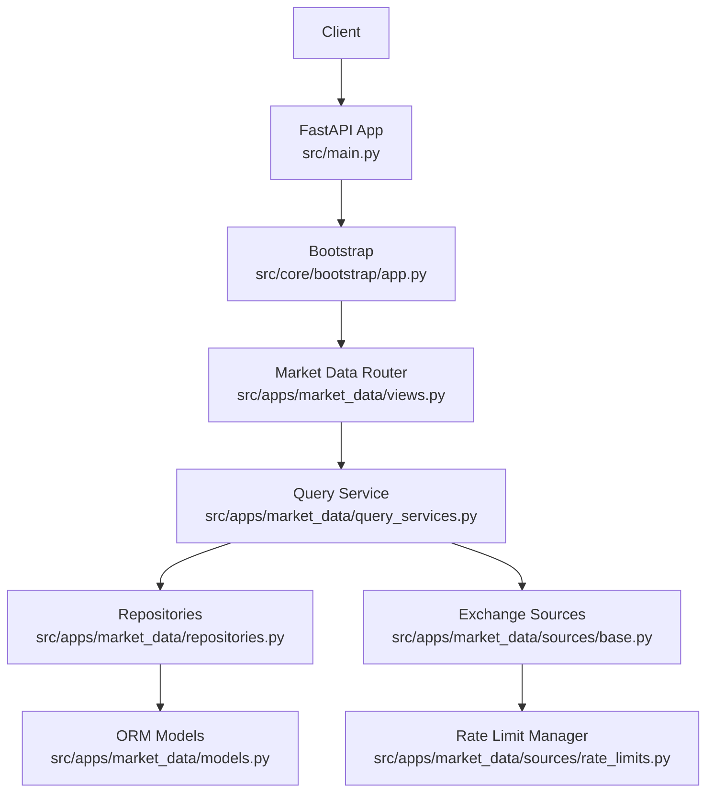
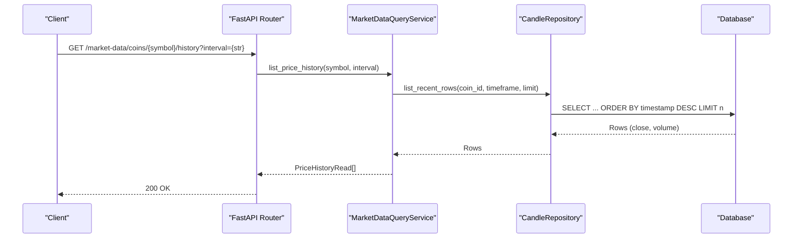
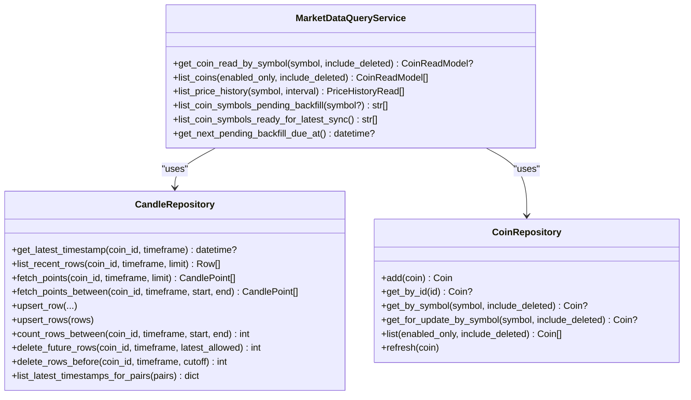

# Market Data API

<cite>
**Referenced Files in This Document**
- [src/main.py](file://src/main.py)
- [src/core/bootstrap/app.py](file://src/core/bootstrap/app.py)
- [src/apps/market_data/views.py](file://src/apps/market_data/views.py)
- [src/apps/market_data/schemas.py](file://src/apps/market_data/schemas.py)
- [src/apps/market_data/domain.py](file://src/apps/market_data/domain.py)
- [src/apps/market_data/services.py](file://src/apps/market_data/services.py)
- [src/apps/market_data/query_services.py](file://src/apps/market_data/query_services.py)
- [src/apps/market_data/repositories.py](file://src/apps/market_data/repositories.py)
- [src/apps/market_data/models.py](file://src/apps/market_data/models.py)
- [src/apps/market_data/sources/base.py](file://src/apps/market_data/sources/base.py)
- [src/apps/market_data/sources/rate_limits.py](file://src/apps/market_data/sources/rate_limits.py)
</cite>

## Table of Contents
1. [Introduction](#introduction)
2. [Project Structure](#project-structure)
3. [Core Components](#core-components)
4. [Architecture Overview](#architecture-overview)
5. [Detailed Component Analysis](#detailed-component-analysis)
6. [Dependency Analysis](#dependency-analysis)
7. [Performance Considerations](#performance-considerations)
8. [Troubleshooting Guide](#troubleshooting-guide)
9. [Conclusion](#conclusion)
10. [Appendices](#appendices)

## Introduction
This document provides comprehensive API documentation for market data endpoints. It covers RESTful endpoints for real-time and historical price data, exchange market data integration, and market status queries. It also documents WebSocket-related streaming capabilities, subscription patterns, and data filtering options. Request and response schemas are specified for candles, trades, order books, and market summaries. Authentication, rate limiting policies, and pagination parameters are included, along with practical examples for common use cases such as retrieving 1-hour candles for BTC-USD across multiple exchanges, subscribing to real-time price updates, and querying market depth data.

## Project Structure
The market data subsystem is implemented as a FastAPI application module. The API router is registered under the application’s bootstrap process and exposes endpoints for coins and price history. Data access is handled via query services and repositories backed by SQLAlchemy ORM and Timescale continuous aggregates. Exchange integrations are abstracted behind a source carousel and rate-limiting manager.

**Diagram sources**
- [src/main.py:1-22](file://src/main.py#L1-L22)
- [src/core/bootstrap/app.py:49-81](file://src/core/bootstrap/app.py#L49-L81)
- [src/apps/market_data/views.py:62-163](file://src/apps/market_data/views.py#L62-L163)
- [src/apps/market_data/query_services.py:26-210](file://src/apps/market_data/query_services.py#L26-L210)
- [src/apps/market_data/repositories.py:112-834](file://src/apps/market_data/repositories.py#L112-L834)
- [src/apps/market_data/models.py:20-168](file://src/apps/market_data/models.py#L20-L168)
- [src/apps/market_data/sources/base.py:50-157](file://src/apps/market_data/sources/base.py#L50-L157)
- [src/apps/market_data/sources/rate_limits.py:123-304](file://src/apps/market_data/sources/rate_limits.py#L123-L304)

**Section sources**
- [src/main.py:1-22](file://src/main.py#L1-L22)
- [src/core/bootstrap/app.py:49-81](file://src/core/bootstrap/app.py#L49-L81)

## Core Components
- REST endpoints for coins and price history
- Data models for coins and candles
- Query service for listing recent price history
- Repositories for candle and coin persistence
- Domain utilities for intervals and timestamps
- Exchange source abstractions and rate limiting

Key responsibilities:
- Views: Define routes, handle request validation, and return standardized responses.
- Schemas: Define request/response models and validation rules.
- Services: Orchestrate business logic, history synchronization, and publishing events.
- Repositories: Provide CRUD and analytical queries against the database and Timescale.
- Domain: Normalize intervals, align timestamps, and compute retention windows.
- Sources: Encapsulate exchange-specific integrations and rate-limiting behavior.

**Section sources**
- [src/apps/market_data/views.py:62-163](file://src/apps/market_data/views.py#L62-L163)
- [src/apps/market_data/schemas.py:12-94](file://src/apps/market_data/schemas.py#L12-L94)
- [src/apps/market_data/services.py:287-323](file://src/apps/market_data/services.py#L287-L323)
- [src/apps/market_data/query_services.py:26-117](file://src/apps/market_data/query_services.py#L26-L117)
- [src/apps/market_data/repositories.py:112-404](file://src/apps/market_data/repositories.py#L112-L404)
- [src/apps/market_data/domain.py:23-49](file://src/apps/market_data/domain.py#L23-L49)
- [src/apps/market_data/sources/base.py:50-157](file://src/apps/market_data/sources/base.py#L50-L157)

## Architecture Overview
The API follows a layered architecture:
- Presentation layer: FastAPI routes and response serialization.
- Application layer: Query services and business services.
- Persistence layer: SQLAlchemy ORM and Timescale continuous aggregates.
- Integration layer: Exchange sources with rate-limiting coordination.

**Diagram sources**
- [src/apps/market_data/views.py:122-136](file://src/apps/market_data/views.py#L122-L136)
- [src/apps/market_data/query_services.py:78-117](file://src/apps/market_data/query_services.py#L78-L117)
- [src/apps/market_data/repositories.py:154-177](file://src/apps/market_data/repositories.py#L154-L177)

## Detailed Component Analysis

### REST Endpoints

- Base path: /market-data
- Tags: coins, history

Endpoints:
- GET /coins
  - Description: List all coins with optional filters.
  - Query parameters:
    - enabled_only: bool (optional)
    - include_deleted: bool (optional)
  - Response: array of CoinRead
- POST /coins
  - Description: Create a new coin.
  - Request body: CoinCreate
  - Response: CoinRead (201)
  - Notes: Conflict if coin already exists.
- DELETE /coins/{symbol}
  - Description: Soft-delete a coin by symbol.
  - Response: 204 No Content
- POST /coins/{symbol}/jobs/run
  - Description: Trigger a history job for a coin.
  - Query parameters:
    - mode: "auto" | "backfill" | "latest" (default "auto")
    - force: bool (default true)
  - Response: JSON with status, symbol, mode, force
- GET /coins/{symbol}/history
  - Description: Retrieve recent price history for a coin.
  - Query parameters:
    - interval: str (optional); supported: "15m", "1h", "4h", "1d"
  - Response: array of PriceHistoryRead
- POST /coins/{symbol}/history
  - Description: Insert a manual price history record for the base timeframe.
  - Request body: PriceHistoryCreate
  - Response: PriceHistoryRead
  - Notes: Only allowed for the base timeframe configured for the coin.

Validation and normalization:
- Interval values are normalized and validated; unsupported intervals are rejected.
- Symbol normalization to uppercase is applied.

Error handling:
- 404 Not Found when coin does not exist.
- 409 Conflict on duplicate coin creation.
- 400 Bad Request for invalid payloads or unsupported intervals.

**Section sources**
- [src/apps/market_data/views.py:62-163](file://src/apps/market_data/views.py#L62-L163)
- [src/apps/market_data/domain.py:23-27](file://src/apps/market_data/domain.py#L23-L27)
- [src/apps/market_data/schemas.py:12-94](file://src/apps/market_data/schemas.py#L12-L94)

### Request/Response Schemas

- CoinBase/CoinCreate/CoinRead
  - Fields:
    - symbol: string (normalized to uppercase)
    - name: string
    - asset_type: string (default "crypto")
    - theme: string (default "core")
    - sector: string | null (serialization alias "sector")
    - source: string (default "default")
    - enabled: bool (default true)
    - sort_order: int (default 0)
    - candles: array of CandleConfig (default includes "15m","1h","4h","1d")
  - Additional fields in CoinRead:
    - id: integer
    - auto_watch_enabled: bool
    - auto_watch_source: string | null
    - sector_code: string (validation alias "sector_code")
    - created_at: datetime
    - history_backfill_completed_at: datetime | null
    - last_history_sync_at: datetime | null
    - next_history_sync_at: datetime | null
    - last_history_sync_error: string | null
    - candles_config: array of CandleConfig (validation alias "candles_config")

- CandleConfig
  - interval: string (normalized)
  - retention_bars: int (>0)

- PriceHistoryBase/PriceHistoryCreate/PriceHistoryRead
  - interval: string (default "1h", normalized)
  - timestamp: datetime (default current UTC)
  - price: float (>0)
  - volume: float | null (>=0)
  - Additional in PriceHistoryRead:
    - coin_id: int

Notes:
- Interval normalization ensures only supported values are accepted.
- Timestamps are normalized to UTC.

**Section sources**
- [src/apps/market_data/schemas.py:12-94](file://src/apps/market_data/schemas.py#L12-L94)
- [src/apps/market_data/domain.py:23-27](file://src/apps/market_data/domain.py#L23-L27)

### Data Models

- Coin
  - Columns: id, symbol (unique), name, asset_type, theme, source, enabled, auto_watch_enabled, auto_watch_source, sort_order, sector_code, sector_id, candles_config (JSON), timestamps, deleted_at
  - Relationships: candles, sector, metrics, indicator_cache, signals, predictions, portfolio entities, risk metrics, final_signals

- Candle
  - Columns: coin_id, timeframe, timestamp (PK triple), open, high, low, close, volume
  - Indices: compound indices for efficient queries

- Continuous Aggregates
  - Timescale continuous aggregates are refreshed for higher timeframes to accelerate queries.

**Section sources**
- [src/apps/market_data/models.py:20-168](file://src/apps/market_data/models.py#L20-L168)
- [src/apps/market_data/repositories.py:748-812](file://src/apps/market_data/repositories.py#L748-L812)

### Exchange Market Data Integration

- BaseMarketSource
  - Provides common interface for fetching OHLCV bars, rate-limit handling, and request wrappers.
  - Supported intervals and asset types vary by concrete source.
  - Rate-limited requests are coordinated via Redis-based rate limiter.

- RateLimitPolicy
  - Defines per-source policies including requests per window, window seconds, minimum interval, and fallback retry seconds.
  - Policies are enforced by RedisRateLimitManager.

- MarketBar
  - Standardized OHLCV bar with source attribution.

Supported sources (examples):
- Binance, Coinbase, Polygon, Kraken, KuCoin, TwelveData, AlphaVantage, MOEX, Yahoo Finance, CoinGecko
- Each source defines its own symbol mapping and supported intervals.

**Section sources**
- [src/apps/market_data/sources/base.py:50-157](file://src/apps/market_data/sources/base.py#L50-L157)
- [src/apps/market_data/sources/rate_limits.py:16-104](file://src/apps/market_data/sources/rate_limits.py#L16-L104)
- [src/apps/market_data/sources/rate_limits.py:123-304](file://src/apps/market_data/sources/rate_limits.py#L123-L304)

### WebSocket Endpoints and Streaming

- Real-time streaming
  - The codebase integrates event publishing for candle insertions and closures, enabling downstream WebSocket consumers to stream updates.
  - Events published:
    - candle_inserted
    - candle_closed
  - Consumers can subscribe to these events and forward them over WebSocket connections.

- Subscription patterns
  - Clients can subscribe to specific coin_id/timeframe combinations.
  - Filtering options:
    - By coin symbol (via coin_id mapping)
    - By timeframe (normalized interval)
    - By timestamp ranges (start/end)

- Data filtering
  - Clients can filter by interval and apply pagination via start/end timestamps or limit/offset.

Note: The WebSocket transport itself is not implemented in the provided files; however, the event publishing infrastructure is present and can be wired to a WebSocket layer.

**Section sources**
- [src/apps/market_data/service_layer.py:54-71](file://src/apps/market_data/service_layer.py#L54-L71)
- [src/apps/market_data/services.py:218-227](file://src/apps/market_data/services.py#L218-L227)

### Pagination and Query Parameters

- GET /coins
  - Query parameters:
    - enabled_only: bool
    - include_deleted: bool
  - Sorting: sort_order asc, symbol asc

- GET /coins/{symbol}/history
  - Query parameters:
    - interval: str (optional; normalized)
  - Pagination:
    - Limit is derived from coin’s retention_bars for the resolved interval.
    - Results are returned in reverse chronological order (most recent first).

- GET /coins/{symbol}/history (historical window)
  - Window queries are supported internally via repository methods that accept start/end bounds.

**Section sources**
- [src/apps/market_data/query_services.py:55-76](file://src/apps/market_data/query_services.py#L55-L76)
- [src/apps/market_data/query_services.py:78-117](file://src/apps/market_data/query_services.py#L78-L117)
- [src/apps/market_data/repositories.py:406-512](file://src/apps/market_data/repositories.py#L406-L512)

### Practical Examples

- Retrieve 1-hour candles for BTC-USD across multiple exchanges
  - Steps:
    - Ensure coin "BTC-USD" exists (POST /market-data/coins or sync watched assets).
    - Trigger a history job (POST /market-data/coins/BTC-USD/jobs/run?mode=backfill&force=true).
    - Query recent history (GET /market-data/coins/BTC-USD/history?interval=1h).
  - Expected response: array of PriceHistoryRead entries ordered by timestamp descending.

- Subscribe to real-time price updates
  - Steps:
    - Subscribe to coin_id/timeframe events (e.g., coin_id=1, timeframe=60).
    - Consume candle_inserted/candle_closed events and broadcast over WebSocket.
  - Filtering: filter by coin_id and timeframe; optionally by timestamp range.

- Query market depth data
  - Current codebase focuses on OHLCV candles. Order book and trade data are not exposed via the documented endpoints.
  - Depth queries would require extending the API with dedicated endpoints for bids/asks and trades.

**Section sources**
- [src/apps/market_data/views.py:97-119](file://src/apps/market_data/views.py#L97-L119)
- [src/apps/market_data/views.py:122-136](file://src/apps/market_data/views.py#L122-L136)
- [src/apps/market_data/service_layer.py:54-71](file://src/apps/market_data/service_layer.py#L54-L71)

## Dependency Analysis

**Diagram sources**
- [src/apps/market_data/query_services.py:26-210](file://src/apps/market_data/query_services.py#L26-L210)
- [src/apps/market_data/repositories.py:112-404](file://src/apps/market_data/repositories.py#L112-L404)

**Section sources**
- [src/apps/market_data/query_services.py:26-210](file://src/apps/market_data/query_services.py#L26-L210)
- [src/apps/market_data/repositories.py:112-404](file://src/apps/market_data/repositories.py#L112-L404)

## Performance Considerations
- Timescale continuous aggregates are refreshed for higher timeframes to accelerate analytical queries.
- Repository methods support fallbacks to aggregate views and resampling when direct storage is unavailable.
- Batched upserts reduce write overhead during history synchronization.
- Rate limiting prevents provider throttling and improves reliability.

[No sources needed since this section provides general guidance]

## Troubleshooting Guide
- 404 Not Found
  - Occurs when a coin does not exist or is deleted.
  - Verify coin symbol and ensure it is enabled.
- 409 Conflict
  - Occurs when attempting to create a duplicate coin.
  - Use a unique symbol.
- 400 Bad Request
  - Occurs for invalid intervals or unsupported manual history writes.
  - Ensure interval is one of "15m","1h","4h","1d"; manual writes are restricted to the base timeframe.
- Rate limiting
  - Providers may return 429 or set Retry-After headers; the client-side manager enforces cooldowns and minimum intervals.
  - Inspect RateLimitedMarketSourceError for retry-after seconds.

**Section sources**
- [src/apps/market_data/views.py:74-83](file://src/apps/market_data/views.py#L74-L83)
- [src/apps/market_data/views.py:149-162](file://src/apps/market_data/views.py#L149-L162)
- [src/apps/market_data/sources/base.py:132-147](file://src/apps/market_data/sources/base.py#L132-L147)
- [src/apps/market_data/sources/rate_limits.py:268-304](file://src/apps/market_data/sources/rate_limits.py#L268-L304)

## Conclusion
The market data API provides robust REST endpoints for retrieving historical candles and managing coin metadata, integrated with exchange sources and rate-limiting controls. Real-time streaming is supported through event publishing suitable for WebSocket consumption. The system emphasizes normalized intervals, retention-based pagination, and scalable query patterns leveraging Timescale.

[No sources needed since this section summarizes without analyzing specific files]

## Appendices

### Authentication and Security
- The application includes CORS middleware; authentication is not implemented in the provided files.
- For production, integrate an authentication layer (e.g., API keys, OAuth) and enforce rate limits at the gateway.

**Section sources**
- [src/core/bootstrap/app.py:60-66](file://src/core/bootstrap/app.py#L60-L66)

### Rate Limiting Policies (Selected Sources)
- Binance: 6000 requests/minute, request cost 2
- Coinbase: 10 rps per IP
- Polygon: 5 requests/minute
- Kraken: conservative client-side pacing
- KuCoin: 2000 requests/30 seconds, request cost 3
- TwelveData: 8 requests/minute
- AlphaVantage: 25 requests/day
- MOEX/Yahoo Finance/CoinGecko: unofficial limits; client-side pacing applied

**Section sources**
- [src/apps/market_data/sources/rate_limits.py:34-104](file://src/apps/market_data/sources/rate_limits.py#L34-L104)