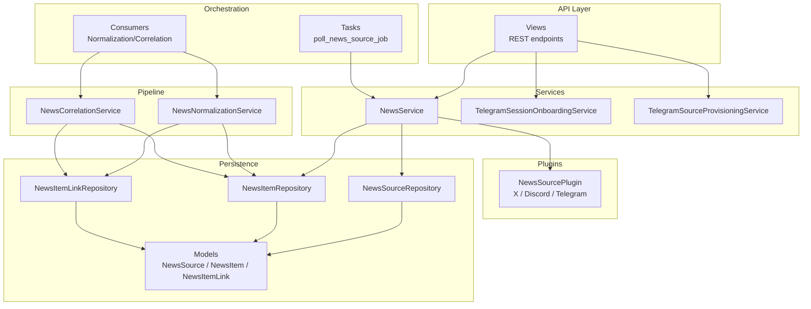
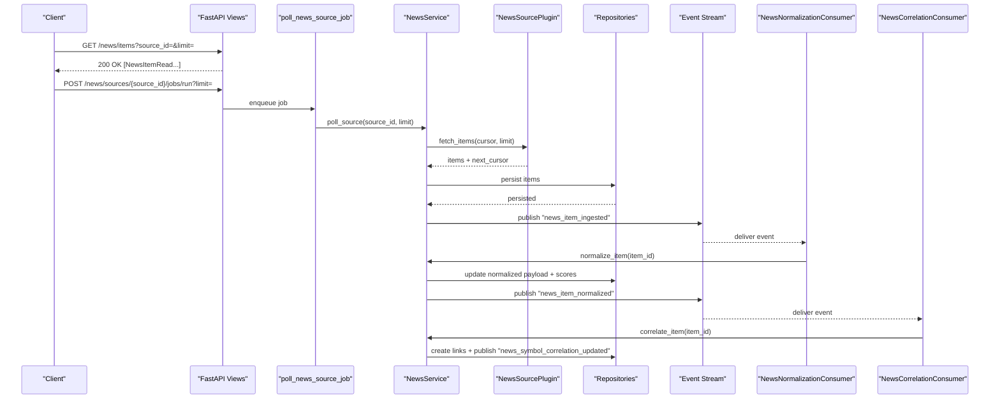
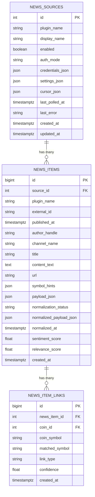
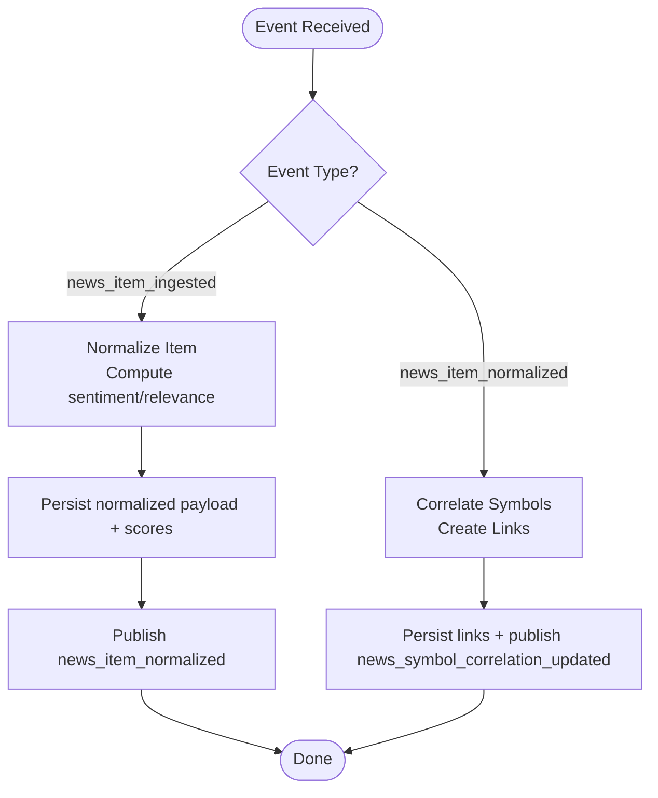
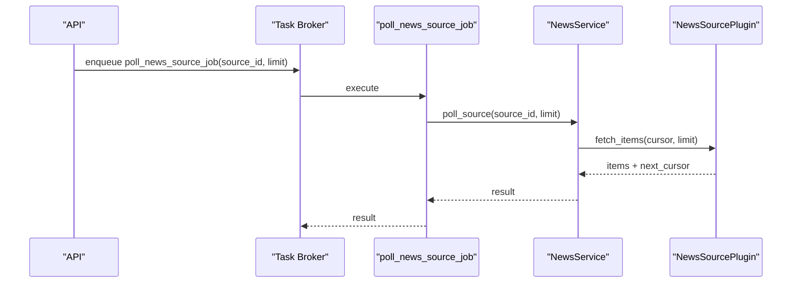
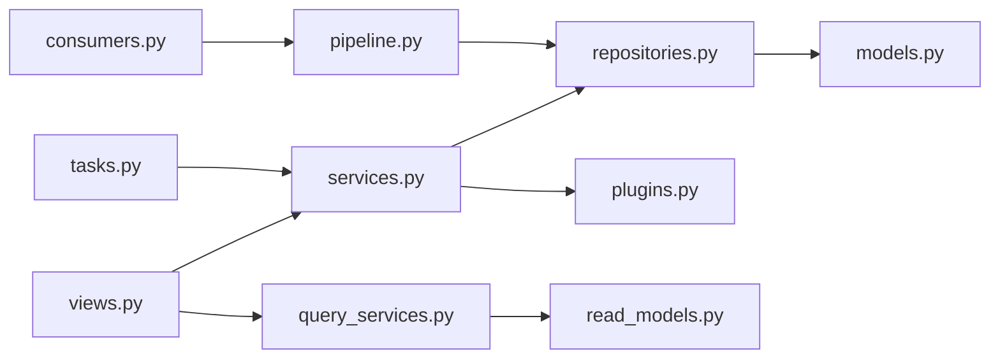

# News API

<cite>
**Referenced Files in This Document**
- [views.py](file://src/apps/news/views.py)
- [schemas.py](file://src/apps/news/schemas.py)
- [models.py](file://src/apps/news/models.py)
- [query_services.py](file://src/apps/news/query_services.py)
- [services.py](file://src/apps/news/services.py)
- [pipeline.py](file://src/apps/news/pipeline.py)
- [constants.py](file://src/apps/news/constants.py)
- [plugins.py](file://src/apps/news/plugins.py)
- [repositories.py](file://src/apps/news/repositories.py)
- [consumers.py](file://src/apps/news/consumers.py)
- [tasks.py](file://src/apps/news/tasks.py)
- [read_models.py](file://src/apps/news/read_models.py)
- [main.py](file://src/main.py)
</cite>

## Table of Contents
1. [Introduction](#introduction)
2. [Project Structure](#project-structure)
3. [Core Components](#core-components)
4. [Architecture Overview](#architecture-overview)
5. [Detailed Component Analysis](#detailed-component-analysis)
6. [Dependency Analysis](#dependency-analysis)
7. [Performance Considerations](#performance-considerations)
8. [Troubleshooting Guide](#troubleshooting-guide)
9. [Conclusion](#conclusion)
10. [Appendices](#appendices)

## Introduction
This document describes the News API subsystem responsible for retrieving news articles, managing news sources, normalizing content, computing sentiment and relevance scores, and correlating news events with market symbols. It also documents the event-driven pipeline that powers automatic normalization and correlation, and outlines how to trigger ingestion jobs and onboard new sources (notably Telegram). The API is implemented as FastAPI routes under the “news” tag and integrates with a background task system and event stream.

## Project Structure
The News API is organized around a set of cohesive modules:
- Views: Public REST endpoints for news sources and items
- Services: Business logic for source management and ingestion
- Pipeline: Normalization, sentiment scoring, and correlation services
- Plugins: Pluggable integrations for different news sources
- Repositories and Models: Persistence layer for news sources, items, and links
- Query Services: Read-model projections and listing helpers
- Consumers and Tasks: Event-driven enrichment and periodic polling
- Constants and Schemas: Shared constants and Pydantic models for request/response shapes

**Diagram sources**
- [views.py:27-176](file://src/apps/news/views.py#L27-L176)
- [services.py:57-241](file://src/apps/news/services.py#L57-L241)
- [pipeline.py:103-307](file://src/apps/news/pipeline.py#L103-L307)
- [plugins.py:59-349](file://src/apps/news/plugins.py#L59-L349)
- [repositories.py:12-170](file://src/apps/news/repositories.py#L12-L170)
- [models.py:15-104](file://src/apps/news/models.py#L15-L104)
- [consumers.py:9-35](file://src/apps/news/consumers.py#L9-L35)
- [tasks.py:12-34](file://src/apps/news/tasks.py#L12-L34)

**Section sources**
- [views.py:27-176](file://src/apps/news/views.py#L27-L176)
- [services.py:57-241](file://src/apps/news/services.py#L57-L241)
- [pipeline.py:103-307](file://src/apps/news/pipeline.py#L103-L307)
- [plugins.py:59-349](file://src/apps/news/plugins.py#L59-L349)
- [repositories.py:12-170](file://src/apps/news/repositories.py#L12-L170)
- [models.py:15-104](file://src/apps/news/models.py#L15-L104)
- [consumers.py:9-35](file://src/apps/news/consumers.py#L9-L35)
- [tasks.py:12-34](file://src/apps/news/tasks.py#L12-L34)

## Core Components
- REST endpoints for:
  - Listing and managing news sources
  - Listing news items with pagination and filtering
  - Triggering ingestion jobs per source
  - Onboarding Telegram sources via wizard and session flows
- Event-driven pipeline:
  - Automatic normalization upon ingestion
  - Automatic correlation upon normalization
- Background tasks:
  - Polling a single source or all enabled sources
- Data models and schemas:
  - NewsSource, NewsItem, NewsItemLink ORM models
  - Pydantic schemas for requests/responses

**Section sources**
- [views.py:31-176](file://src/apps/news/views.py#L31-L176)
- [schemas.py:9-205](file://src/apps/news/schemas.py#L9-L205)
- [models.py:15-104](file://src/apps/news/models.py#L15-L104)
- [consumers.py:9-35](file://src/apps/news/consumers.py#L9-L35)
- [tasks.py:12-34](file://src/apps/news/tasks.py#L12-L34)

## Architecture Overview
The News API follows a layered architecture:
- HTTP layer: FastAPI routes expose endpoints
- Service layer: Orchestration of repositories, plugins, and tasks
- Persistence layer: SQLAlchemy ORM models and repositories
- Event-driven enrichment: Consumers react to ingestion and normalization events
- Task layer: Periodic and on-demand jobs coordinate polling

**Diagram sources**
- [views.py:76-104](file://src/apps/news/views.py#L76-L104)
- [tasks.py:12-22](file://src/apps/news/tasks.py#L12-L22)
- [services.py:145-229](file://src/apps/news/services.py#L145-L229)
- [plugins.py:117-349](file://src/apps/news/plugins.py#L117-L349)
- [repositories.py:82-136](file://src/apps/news/repositories.py#L82-L136)
- [consumers.py:13-34](file://src/apps/news/consumers.py#L13-L34)
- [pipeline.py:109-187](file://src/apps/news/pipeline.py#L109-L187)
- [pipeline.py:209-306](file://src/apps/news/pipeline.py#L209-L306)

## Detailed Component Analysis

### REST Endpoints

- List plugins
  - Method: GET
  - Path: /news/plugins
  - Response: array of NewsPluginRead
  - Purpose: Enumerate supported news source plugins and their metadata

- List news sources
  - Method: GET
  - Path: /news/sources
  - Response: array of NewsSourceRead
  - Purpose: Retrieve all configured news sources

- Create news source
  - Method: POST
  - Path: /news/sources
  - Request: NewsSourceCreate
  - Response: NewsSourceRead (201)
  - Purpose: Register a new news source with credentials/settings

- Patch news source
  - Method: PATCH
  - Path: /news/sources/{source_id}
  - Request: NewsSourceUpdate
  - Response: NewsSourceRead
  - Purpose: Update display name, enabled flag, credentials, settings, and reset cursor/error

- Delete news source
  - Method: DELETE
  - Path: /news/sources/{source_id}
  - Response: 204 No Content
  - Purpose: Remove a news source

- List news items
  - Method: GET
  - Path: /news/items
  - Query:
    - source_id (optional, integer ≥ 1)
    - limit (integer, default 50, min 1, max 100)
  - Response: array of NewsItemRead
  - Purpose: Paginated retrieval of recent news items, optionally filtered by source

- Run ingestion job for a source
  - Method: POST
  - Path: /news/sources/{source_id}/jobs/run
  - Query:
    - limit (integer, default 50, min 1, max 100)
  - Response: object with status, source_id, limit
  - Purpose: Enqueue a polling job for the given source

- Telegram onboarding: request session code
  - Method: POST
  - Path: /news/onboarding/telegram/session/request
  - Request: TelegramSessionCodeRequest
  - Response: TelegramSessionCodeRequestRead
  - Purpose: Send a login code to the provided phone number

- Telegram onboarding: confirm session
  - Method: POST
  - Path: /news/onboarding/telegram/session/confirm
  - Request: TelegramSessionConfirmRequest
  - Response: TelegramSessionConfirmRead
  - Purpose: Exchange code for a reusable session string

- Telegram onboarding: list dialogs
  - Method: POST
  - Path: /news/onboarding/telegram/dialogs
  - Request: TelegramDialogsRequest
  - Response: array of TelegramDialogRead
  - Purpose: Load channels/chats available to the authenticated account

- Telegram onboarding: wizard spec
  - Method: GET
  - Path: /news/onboarding/telegram/wizard
  - Response: TelegramWizardRead
  - Purpose: Describe the step-by-step provisioning flow

- Telegram onboarding: create source from dialog
  - Method: POST
  - Path: /news/onboarding/telegram/sources
  - Request: TelegramSourceFromDialogCreate
  - Response: NewsSourceRead (201)
  - Purpose: Provision a single news source from a selected Telegram dialog

- Telegram onboarding: bulk subscribe
  - Method: POST
  - Path: /news/onboarding/telegram/sources/bulk
  - Request: TelegramBulkSubscribeRequest
  - Response: TelegramBulkSubscribeRead (201)
  - Purpose: Create multiple news sources from selected dialogs

**Section sources**
- [views.py:31-176](file://src/apps/news/views.py#L31-L176)
- [schemas.py:24-205](file://src/apps/news/schemas.py#L24-L205)

### Request/Response Schemas

- NewsPluginRead
  - Fields: name, display_name, description, auth_mode, supported, supports_user_identity, required_credentials[], required_settings[], runtime_dependencies[], unsupported_reason?
  - Used by: GET /news/plugins

- NewsSourceCreate
  - Fields: plugin_name, display_name, enabled?, credentials{}, settings{}
  - Used by: POST /news/sources

- NewsSourceUpdate
  - Fields: display_name?, enabled?, credentials?, settings?, reset_cursor?, clear_error?
  - Used by: PATCH /news/sources/{source_id}

- NewsSourceRead
  - Fields: id, plugin_name, display_name, enabled, status, auth_mode, credential_fields_present[], settings{}, cursor{}, last_polled_at?, last_error?, created_at, updated_at
  - Used by: GET /news/sources, POST/PATCH /news/sources/*

- NewsItemRead
  - Fields: id, source_id, plugin_name, external_id, published_at, author_handle?, channel_name?, title?, content_text, url?, symbol_hints[], payload_json{}, normalization_status, normalized_payload_json{}, normalized_at?, sentiment_score?, relevance_score?, links[]
  - Used by: GET /news/items

- TelegramSessionCodeRequest
  - Fields: api_id, api_hash, phone_number
  - Used by: POST /news/onboarding/telegram/session/request

- TelegramSessionCodeRequestRead
  - Fields: status, phone_number, phone_code_hash
  - Used by: POST /news/onboarding/telegram/session/request

- TelegramSessionConfirmRequest
  - Fields: api_id, api_hash, phone_number, phone_code_hash, code, password?
  - Used by: POST /news/onboarding/telegram/session/confirm

- TelegramSessionConfirmRead
  - Fields: status, session_string?, user_id?, username?, display_name?
  - Used by: POST /news/onboarding/telegram/session/confirm

- TelegramDialogsRequest
  - Fields: api_id, api_hash, session_string, limit?(1..500), include_users?
  - Used by: POST /news/onboarding/telegram/dialogs

- TelegramDialogRead
  - Fields: entity_id, entity_type, title, username?, access_hash?, selectable, settings_hint{}
  - Used by: POST /news/onboarding/telegram/dialogs

- TelegramDialogSelection
  - Fields: entity_id, entity_type, title, username?, access_hash?, display_name?, enabled?, max_items_per_poll?(1..100)
  - Used by: POST /news/onboarding/telegram/sources, POST /news/onboarding/telegram/sources/bulk

- TelegramSourceFromDialogCreate
  - Fields: api_id, api_hash, session_string, dialog: TelegramDialogSelection
  - Used by: POST /news/onboarding/telegram/sources

- TelegramBulkSubscribeRequest
  - Fields: api_id, api_hash, session_string, dialogs[] (min 1, max 100)
  - Used by: POST /news/onboarding/telegram/sources/bulk

- TelegramBulkSubscribeRead
  - Fields: created_count, skipped_count, created[], results[]
  - Used by: POST /news/onboarding/telegram/sources/bulk

- TelegramWizardRead
  - Fields: plugin_name, title, supported_dialog_types[], private_dialog_support?, steps[], notes[], source_payload_example{}
  - Used by: GET /news/onboarding/telegram/wizard

**Section sources**
- [schemas.py:9-205](file://src/apps/news/schemas.py#L9-L205)

### Data Models

**Diagram sources**
- [models.py:15-104](file://src/apps/news/models.py#L15-L104)

**Section sources**
- [models.py:15-104](file://src/apps/news/models.py#L15-L104)

### Authentication and Authorization
- The API is implemented as FastAPI routes and tagged under “news”. There is no explicit authentication decorator applied to the news routes in the provided code. Authentication and authorization are typically enforced at the application bootstrap level and may be handled by middleware or gateway. Consult the application’s main entry and settings for global auth configuration.

**Section sources**
- [views.py:27-176](file://src/apps/news/views.py#L27-L176)
- [main.py:5-9](file://src/main.py#L5-L9)

### Filtering and Pagination
- GET /news/items supports:
  - source_id filter (integer ≥ 1)
  - limit parameter (default 50, min 1, max 100)
- GET /news/sources supports listing all sources
- GET /news/plugins supports listing plugin descriptors

**Section sources**
- [views.py:76-83](file://src/apps/news/views.py#L76-L83)
- [query_services.py:54-72](file://src/apps/news/query_services.py#L54-L72)

### Event-Driven Enrichment and Correlation
- Events:
  - news_item_ingested: emitted after successful ingestion
  - news_item_normalized: emitted after normalization completes
  - news_symbol_correlation_updated: emitted after correlation creates links
- Consumers:
  - NewsNormalizationConsumer: triggers normalization on ingestion
  - NewsCorrelationConsumer: triggers correlation on normalization
- Pipeline:
  - NormalizationService computes sentiment_score, relevance_score, and normalized_payload_json
  - CorrelationService matches detected symbols/names to coins and creates links with confidence

**Diagram sources**
- [consumers.py:13-34](file://src/apps/news/consumers.py#L13-L34)
- [pipeline.py:109-187](file://src/apps/news/pipeline.py#L109-L187)
- [pipeline.py:209-306](file://src/apps/news/pipeline.py#L209-L306)

**Section sources**
- [consumers.py:9-35](file://src/apps/news/consumers.py#L9-L35)
- [pipeline.py:103-307](file://src/apps/news/pipeline.py#L103-L307)
- [constants.py:12-18](file://src/apps/news/constants.py#L12-L18)

### Background Jobs and Polling
- poll_news_source_job(source_id, limit): polls a single source with Redis task lock
- poll_enabled_news_sources_job(limit_per_source): polls all enabled sources with a global lock
- Jobs are enqueued by POST /news/sources/{source_id}/jobs/run

**Diagram sources**
- [views.py:86-104](file://src/apps/news/views.py#L86-L104)
- [tasks.py:12-34](file://src/apps/news/tasks.py#L12-L34)
- [services.py:145-229](file://src/apps/news/services.py#L145-L229)
- [plugins.py:117-349](file://src/apps/news/plugins.py#L117-L349)

**Section sources**
- [tasks.py:12-34](file://src/apps/news/tasks.py#L12-L34)
- [services.py:145-241](file://src/apps/news/services.py#L145-L241)

### Practical Examples

- Retrieve market-moving news
  - Use GET /news/items with limit and optionally source_id to fetch recent items. Market-moving items often have higher relevance_score and sentiment_score after normalization.

- Analyze sentiment across news sources
  - List sources via GET /news/sources, then fetch items per source using GET /news/items with source_id to compare sentiment_score and normalized_payload_json across sources.

- Correlate news events with price movements
  - After normalization, correlation links are created. Use GET /news/items to inspect links[].confidence and matched_symbol to identify correlated assets.

- Onboard a Telegram source
  - Step 1: POST /news/onboarding/telegram/session/request with api_id, api_hash, phone_number
  - Step 2: POST /news/onboarding/telegram/session/confirm with code/password if needed
  - Step 3: POST /news/onboarding/telegram/dialogs to list available dialogs
  - Step 4: POST /news/onboarding/telegram/sources or POST /news/onboarding/telegram/sources/bulk to create sources

**Section sources**
- [views.py:106-176](file://src/apps/news/views.py#L106-L176)
- [schemas.py:92-205](file://src/apps/news/schemas.py#L92-L205)
- [services.py:243-531](file://src/apps/news/services.py#L243-L531)

## Dependency Analysis

**Diagram sources**
- [views.py:27-176](file://src/apps/news/views.py#L27-L176)
- [services.py:57-241](file://src/apps/news/services.py#L57-L241)
- [query_services.py:20-76](file://src/apps/news/query_services.py#L20-L76)
- [repositories.py:12-170](file://src/apps/news/repositories.py#L12-L170)
- [models.py:15-104](file://src/apps/news/models.py#L15-L104)
- [read_models.py:22-162](file://src/apps/news/read_models.py#L22-L162)
- [consumers.py:9-35](file://src/apps/news/consumers.py#L9-L35)
- [pipeline.py:103-307](file://src/apps/news/pipeline.py#L103-L307)
- [tasks.py:12-34](file://src/apps/news/tasks.py#L12-L34)
- [plugins.py:59-349](file://src/apps/news/plugins.py#L59-L349)

**Section sources**
- [views.py:27-176](file://src/apps/news/views.py#L27-L176)
- [services.py:57-241](file://src/apps/news/services.py#L57-L241)
- [query_services.py:20-76](file://src/apps/news/query_services.py#L20-L76)
- [repositories.py:12-170](file://src/apps/news/repositories.py#L12-L170)
- [models.py:15-104](file://src/apps/news/models.py#L15-L104)
- [read_models.py:22-162](file://src/apps/news/read_models.py#L22-L162)
- [consumers.py:9-35](file://src/apps/news/consumers.py#L9-L35)
- [pipeline.py:103-307](file://src/apps/news/pipeline.py#L103-L307)
- [tasks.py:12-34](file://src/apps/news/tasks.py#L12-L34)
- [plugins.py:59-349](file://src/apps/news/plugins.py#L59-L349)

## Performance Considerations
- Pagination limits: The default limit is 50 with a maximum of 100 per request to prevent heavy loads.
- Cursor-based pagination: Plugins maintain cursors to avoid re-ingesting content and to resume efficiently.
- Locking for jobs: Redis task locks prevent overlapping polling runs for the same source or the global enabled-sources poll.
- Asynchronous I/O: Plugins and consumers use async HTTP clients and database sessions to minimize latency.
- Select-in-load: Query service uses selectinload for NewsItem to eagerly load links, reducing N+1 queries.

[No sources needed since this section provides general guidance]

## Troubleshooting Guide
- Invalid news source configuration
  - Symptoms: 400 Bad Request during source creation/update
  - Causes: Missing required credentials/settings, unsupported plugin, duplicate display_name
  - Actions: Verify plugin_name, credentials, and settings; ensure display_name uniqueness

- Unsupported news plugin
  - Symptoms: 400 Bad Request mentioning unsupported plugin
  - Causes: Truth Social is intentionally unsupported; X/Discord/Telegram must be used
  - Actions: Choose a supported plugin and configure accordingly

- Telegram onboarding errors
  - Symptoms: 4xx/5xx responses during onboarding
  - Causes: Missing telethon dependency, invalid session, wrong API fields
  - Actions: Install telethon; ensure api_id/api_hash/session_string; follow wizard steps

- Polling failures
  - Symptoms: Source status shows error, last_error populated
  - Causes: Network/API errors, invalid tokens, rate limits
  - Actions: Reset cursor and clear error; reconfigure credentials; retry

- Missing authentication
  - Symptoms: Unauthorized responses
  - Causes: Global auth not configured or not applied to news routes
  - Actions: Configure application-wide auth per deployment settings

**Section sources**
- [services.py:64-143](file://src/apps/news/services.py#L64-L143)
- [plugins.py:330-349](file://src/apps/news/plugins.py#L330-L349)
- [services.py:243-318](file://src/apps/news/services.py#L243-L318)
- [tasks.py:12-34](file://src/apps/news/tasks.py#L12-L34)

## Conclusion
The News API provides a robust foundation for ingesting, normalizing, and correlating news content with market symbols. Its REST endpoints enable source management and item retrieval, while the event-driven pipeline ensures automatic enrichment. Background tasks and pluggable integrations support scalable ingestion from multiple sources, including Telegram, X (Twitter), and Discord.

[No sources needed since this section summarizes without analyzing specific files]

## Appendices

### Endpoint Reference Summary

- GET /news/plugins
  - Response: array of NewsPluginRead

- GET /news/sources
  - Response: array of NewsSourceRead

- POST /news/sources
  - Request: NewsSourceCreate
  - Response: NewsSourceRead (201)

- PATCH /news/sources/{source_id}
  - Request: NewsSourceUpdate
  - Response: NewsSourceRead

- DELETE /news/sources/{source_id}
  - Response: 204 No Content

- GET /news/items
  - Query: source_id?, limit (1..100)
  - Response: array of NewsItemRead

- POST /news/sources/{source_id}/jobs/run
  - Query: limit (1..100)
  - Response: { status, source_id, limit }

- POST /news/onboarding/telegram/session/request
  - Request: TelegramSessionCodeRequest
  - Response: TelegramSessionCodeRequestRead

- POST /news/onboarding/telegram/session/confirm
  - Request: TelegramSessionConfirmRequest
  - Response: TelegramSessionConfirmRead

- POST /news/onboarding/telegram/dialogs
  - Request: TelegramDialogsRequest
  - Response: array of TelegramDialogRead

- GET /news/onboarding/telegram/wizard
  - Response: TelegramWizardRead

- POST /news/onboarding/telegram/sources
  - Request: TelegramSourceFromDialogCreate
  - Response: NewsSourceRead (201)

- POST /news/onboarding/telegram/sources/bulk
  - Request: TelegramBulkSubscribeRequest
  - Response: TelegramBulkSubscribeRead (201)

**Section sources**
- [views.py:31-176](file://src/apps/news/views.py#L31-L176)
- [schemas.py:24-205](file://src/apps/news/schemas.py#L24-L205)