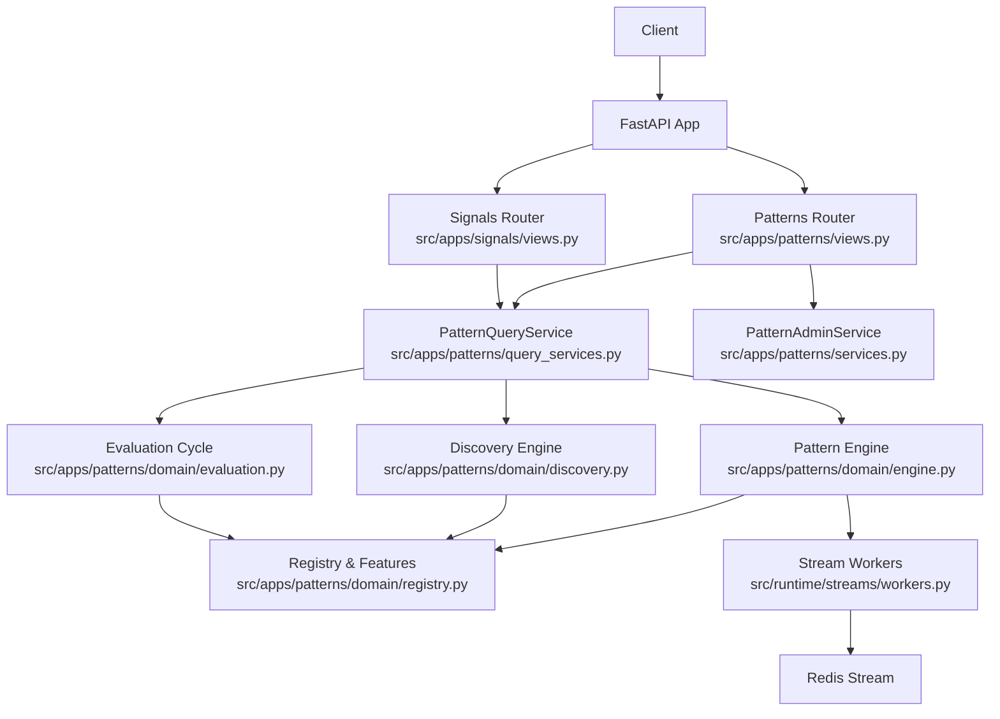
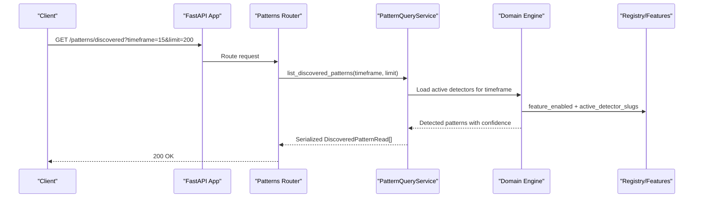
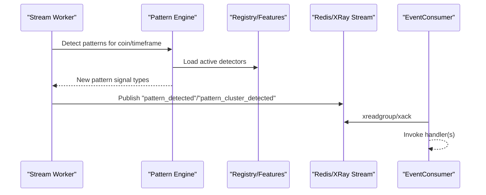
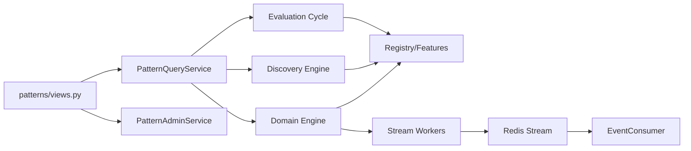
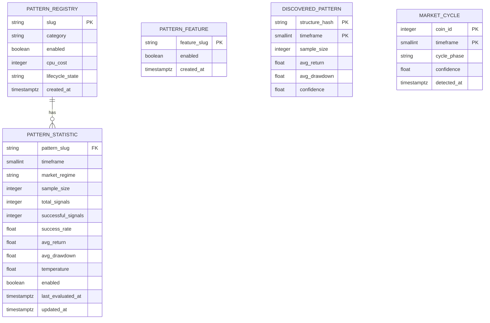

# Patterns API

<cite>
**Referenced Files in This Document**
- [views.py](file://src/apps/patterns/views.py)
- [schemas.py](file://src/apps/patterns/schemas.py)
- [query_services.py](file://src/apps/patterns/query_services.py)
- [models.py](file://src/apps/patterns/models.py)
- [services.py](file://src/apps/patterns/services.py)
- [evaluation.py](file://src/apps/patterns/domain/evaluation.py)
- [discovery.py](file://src/apps/patterns/domain/discovery.py)
- [registry.py](file://src/apps/patterns/domain/registry.py)
- [engine.py](file://src/apps/patterns/domain/engine.py)
- [workers.py](file://src/runtime/streams/workers.py)
- [consumer.py](file://src/runtime/streams/consumer.py)
- [app.py](file://src/core/bootstrap/app.py)
- [signals_schemas.py](file://src/apps/signals/schemas.py)
- [signals_views.py](file://src/apps/signals/views.py)
</cite>

## Table of Contents
1. [Introduction](#introduction)
2. [Project Structure](#project-structure)
3. [Core Components](#core-components)
4. [Architecture Overview](#architecture-overview)
5. [Detailed Component Analysis](#detailed-component-analysis)
6. [Dependency Analysis](#dependency-analysis)
7. [Performance Considerations](#performance-considerations)
8. [Troubleshooting Guide](#troubleshooting-guide)
9. [Conclusion](#conclusion)
10. [Appendices](#appendices)

## Introduction
This document provides comprehensive API documentation for pattern recognition endpoints. It covers:
- REST endpoints for pattern detection results, pattern scoring, multi-timeframe pattern analysis, and pattern evaluation queries
- Endpoints for pattern discovery workflows and pattern history retrieval
- Pattern confidence scoring and evaluation metrics
- Real-time pattern detection updates via event streaming (Redis/XRay streams)
- Request/response schemas for pattern objects, detection parameters, and evaluation metrics
- Authentication requirements, filtering by timeframe and asset, and pagination for pattern history
- Practical examples for detecting continuation patterns across 1m–4h timeframes and retrieving pattern evaluation reports

## Project Structure
The Patterns API is exposed via a FastAPI router and backed by query services, repositories, and domain logic. The application integrates the patterns router into the main FastAPI app during bootstrapping.

**Diagram sources**
- [app.py:49-80](file://src/core/bootstrap/app.py#L49-L80)
- [views.py:18-117](file://src/apps/patterns/views.py#L18-L117)
- [signals_views.py:19-211](file://src/apps/signals/views.py#L19-L211)
- [query_services.py:48-545](file://src/apps/patterns/query_services.py#L48-L545)
- [services.py:10-68](file://src/apps/patterns/services.py#L10-L68)
- [engine.py:29-148](file://src/apps/patterns/domain/engine.py#L29-L148)
- [discovery.py:33-99](file://src/apps/patterns/domain/discovery.py#L33-L99)
- [evaluation.py:12-26](file://src/apps/patterns/domain/evaluation.py#L12-L26)
- [registry.py:58-102](file://src/apps/patterns/domain/registry.py#L58-L102)
- [workers.py:198-228](file://src/runtime/streams/workers.py#L198-L228)

**Section sources**
- [app.py:49-80](file://src/core/bootstrap/app.py#L49-L80)
- [views.py:18-117](file://src/apps/patterns/views.py#L18-L117)

## Core Components
- Patterns Router: Exposes REST endpoints for patterns, discovered patterns, coin-specific patterns, and sector metrics.
- PatternQueryService: Implements read-side queries for patterns, discovered patterns, coin regime, and sector metrics.
- PatternAdminService: Provides write operations to enable/disable pattern features and update pattern lifecycle and CPU cost.
- Domain Engines: Pattern detection, discovery, and evaluation engines coordinate detection across timeframes and assets.
- Event Streaming: Stream workers publish pattern detection events to Redis/XRay streams for real-time updates.

Key capabilities:
- Multi-timeframe pattern analysis across supported intervals
- Confidence scoring for discovered patterns
- Evaluation metrics aggregation per pattern/timeframe/regime
- Real-time pattern detection notifications via event streams

**Section sources**
- [views.py:22-117](file://src/apps/patterns/views.py#L22-L117)
- [query_services.py:286-541](file://src/apps/patterns/query_services.py#L286-L541)
- [services.py:17-64](file://src/apps/patterns/services.py#L17-L64)
- [engine.py:114-148](file://src/apps/patterns/domain/engine.py#L114-L148)
- [discovery.py:33-99](file://src/apps/patterns/domain/discovery.py#L33-L99)
- [evaluation.py:12-26](file://src/apps/patterns/domain/evaluation.py#L12-L26)

## Architecture Overview
The Patterns API follows a layered architecture:
- Presentation Layer: FastAPI routes in patterns/views.py
- Application Layer: Services and query services encapsulate business logic
- Domain Layer: Detection, discovery, evaluation, and registry logic
- Persistence Layer: SQLAlchemy models and repositories
- Streaming Layer: Redis/XRay event streams for real-time notifications

**Diagram sources**
- [views.py:72-79](file://src/apps/patterns/views.py#L72-L79)
- [query_services.py:360-377](file://src/apps/patterns/query_services.py#L360-L377)
- [engine.py:114-148](file://src/apps/patterns/domain/engine.py#L114-L148)
- [registry.py:85-101](file://src/apps/patterns/domain/registry.py#L85-L101)

## Detailed Component Analysis

### REST Endpoints

#### List Patterns
- Method: GET
- Path: /patterns
- Query: None
- Response: Array of PatternRead
- Description: Retrieves all registered patterns with associated statistics grouped by slug.

**Section sources**
- [views.py:22-25](file://src/apps/patterns/views.py#L22-L25)
- [query_services.py:286-311](file://src/apps/patterns/query_services.py#L286-L311)
- [schemas.py:37-46](file://src/apps/patterns/schemas.py#L37-L46)

#### List Pattern Features
- Method: GET
- Path: /patterns/features
- Query: None
- Response: Array of PatternFeatureRead
- Description: Lists pattern features and their enabled state.

**Section sources**
- [views.py:28-31](file://src/apps/patterns/views.py#L28-L31)
- [query_services.py:338-358](file://src/apps/patterns/query_services.py#L338-L358)
- [schemas.py:49-58](file://src/apps/patterns/schemas.py#L49-L58)

#### Update Pattern Feature
- Method: PATCH
- Path: /patterns/features/{feature_slug}
- Path param: feature_slug (string)
- Request body: PatternFeatureUpdate
- Response: PatternFeatureRead
- Description: Enables or disables a pattern feature.

**Section sources**
- [views.py:34-46](file://src/apps/patterns/views.py#L34-L46)
- [services.py:17-38](file://src/apps/patterns/services.py#L17-L38)
- [schemas.py:57-58](file://src/apps/patterns/schemas.py#L57-L58)

#### Update Pattern
- Method: PATCH
- Path: /patterns/{slug}
- Path param: slug (string)
- Request body: PatternUpdate
- Response: PatternRead
- Description: Updates pattern enabled state, lifecycle state, and CPU cost.

**Section sources**
- [views.py:49-69](file://src/apps/patterns/views.py#L49-L69)
- [services.py:40-64](file://src/apps/patterns/services.py#L40-L64)
- [schemas.py:61-65](file://src/apps/patterns/schemas.py#L61-L65)

#### List Discovered Patterns
- Method: GET
- Path: /patterns/discovered
- Query params:
  - timeframe (optional integer)
  - limit (integer, default 200, min 1, max 1000)
- Response: Array of DiscoveredPatternRead
- Description: Returns discovered patterns with confidence, sample size, and return metrics.

**Section sources**
- [views.py:72-79](file://src/apps/patterns/views.py#L72-L79)
- [query_services.py:360-377](file://src/apps/patterns/query_services.py#L360-L377)
- [schemas.py:67-76](file://src/apps/patterns/schemas.py#L67-L76)

#### List Coin Patterns
- Method: GET
- Path: /coins/{symbol}/patterns
- Path param: symbol (string)
- Query params:
  - limit (integer, default 200, min 1, max 1000)
- Response: Array of SignalRead
- Description: Returns recent pattern signals for a given coin symbol.

**Section sources**
- [views.py:82-89](file://src/apps/patterns/views.py#L82-L89)
- [query_services.py:379-397](file://src/apps/patterns/query_services.py#L379-L397)
- [signals_schemas.py:8-27](file://src/apps/signals/schemas.py#L8-L27)

#### Get Coin Regime
- Method: GET
- Path: /coins/{symbol}/regime
- Path param: symbol (string)
- Response: CoinRegimeRead
- Description: Returns canonical regime and per-timeframe regimes for a coin.

**Section sources**
- [views.py:92-100](file://src/apps/patterns/views.py#L92-L100)
- [query_services.py:399-443](file://src/apps/patterns/query_services.py#L399-L443)
- [schemas.py:86-92](file://src/apps/patterns/schemas.py#L86-L92)

#### List Sectors
- Method: GET
- Path: /sectors
- Query: None
- Response: Array of SectorRead
- Description: Returns sectors with coin counts.

**Section sources**
- [views.py:103-106](file://src/apps/patterns/views.py#L103-L106)
- [query_services.py:445-463](file://src/apps/patterns/query_services.py#L445-L463)
- [schemas.py:95-102](file://src/apps/patterns/schemas.py#L95-L102)

#### List Sector Metrics
- Method: GET
- Path: /sectors/metrics
- Query params:
  - timeframe (optional integer)
- Response: SectorMetricsResponse
- Description: Returns sector metrics and narratives filtered by timeframe.

**Section sources**
- [views.py:109-116](file://src/apps/patterns/views.py#L109-L116)
- [query_services.py:465-505](file://src/apps/patterns/query_services.py#L465-L505)
- [schemas.py:132-136](file://src/apps/patterns/schemas.py#L132-L136)

### Request/Response Schemas

#### PatternRead
- Fields: slug, category, enabled, cpu_cost, lifecycle_state, created_at, statistics
- Nested: PatternStatisticRead[]
- Reference: [schemas.py:37-46](file://src/apps/patterns/schemas.py#L37-L46)

#### PatternStatisticRead
- Fields: timeframe, market_regime, sample_size, total_signals, successful_signals, success_rate, avg_return, avg_drawdown, temperature, enabled, last_evaluated_at, updated_at
- Reference: [schemas.py:20-34](file://src/apps/patterns/schemas.py#L20-L34)

#### DiscoveredPatternRead
- Fields: structure_hash, timeframe, sample_size, avg_return, avg_drawdown, confidence
- Reference: [schemas.py:67-76](file://src/apps/patterns/schemas.py#L67-L76)

#### PatternFeatureRead
- Fields: feature_slug, enabled, created_at
- Reference: [schemas.py:49-58](file://src/apps/patterns/schemas.py#L49-L58)

#### PatternFeatureUpdate
- Fields: enabled (boolean)
- Reference: [schemas.py:57-58](file://src/apps/patterns/schemas.py#L57-L58)

#### PatternUpdate
- Fields: enabled (optional), lifecycle_state (optional), cpu_cost (optional)
- Reference: [schemas.py:61-65](file://src/apps/patterns/schemas.py#L61-L65)

#### CoinRegimeRead
- Fields: coin_id, symbol, canonical_regime, items (RegimeTimeframeRead[])
- Reference: [schemas.py:86-92](file://src/apps/patterns/schemas.py#L86-L92)

#### RegimeTimeframeRead
- Fields: timeframe, regime, confidence
- Reference: [schemas.py:78-84](file://src/apps/patterns/schemas.py#L78-L84)

#### SectorRead
- Fields: id, name, description, created_at, coin_count
- Reference: [schemas.py:95-102](file://src/apps/patterns/schemas.py#L95-L102)

#### SectorMetricRead
- Fields: sector_id, name, description, timeframe, sector_strength, relative_strength, capital_flow, avg_price_change_24h, avg_volume_change_24h, volatility, trend, updated_at
- Reference: [schemas.py:105-118](file://src/apps/patterns/schemas.py#L105-L118)

#### SectorNarrativeRead
- Fields: timeframe, top_sector, rotation_state, btc_dominance, capital_wave
- Reference: [schemas.py:122-129](file://src/apps/patterns/schemas.py#L122-L129)

#### SectorMetricsResponse
- Fields: items (SectorMetricRead[]), narratives (SectorNarrativeRead[])
- Reference: [schemas.py:132-136](file://src/apps/patterns/schemas.py#L132-L136)

#### SignalRead (used by coin patterns)
- Fields: id, coin_id, symbol, name, sector, timeframe, signal_type, confidence, priority_score, context_score, regime_alignment, candle_timestamp, created_at, market_regime, cycle_phase, cycle_confidence, cluster_membership
- Reference: [signals_schemas.py:8-27](file://src/apps/signals/schemas.py#L8-L27)

### Authentication and Authorization
- No explicit authentication decorators are present on the patterns routes in the examined files.
- CORS middleware is configured in the application bootstrap.
- Access control depends on deployment-level configuration (e.g., reverse proxy, gateway).

**Section sources**
- [app.py:60-66](file://src/core/bootstrap/app.py#L60-L66)
- [views.py:18-19](file://src/apps/patterns/views.py#L18-L19)

### Filtering and Pagination
- Filtering:
  - timeframe (integer) supported in:
    - GET /patterns/discovered
    - GET /coins/{symbol}/patterns
    - GET /sectors/metrics
    - GET /coins/{symbol}/regime (computed across timeframes)
- Pagination:
  - limit (integer) with bounds enforced (min 1, max 1000) in:
    - GET /patterns/discovered
    - GET /coins/{symbol}/patterns
    - GET /signals (signals router)
    - GET /decisions (signals router)
    - GET /final-signals (signals router)
    - GET /backtests (signals router)

**Section sources**
- [views.py:74-75](file://src/apps/patterns/views.py#L74-L75)
- [views.py:84-85](file://src/apps/patterns/views.py#L84-L85)
- [signals_views.py:25-27](file://src/apps/signals/views.py#L25-L27)
- [signals_views.py:45-47](file://src/apps/signals/views.py#L45-L47)
- [signals_views.py:107-109](file://src/apps/signals/views.py#L107-L109)
- [signals_views.py:138-140](file://src/apps/signals/views.py#L138-L140)

### Real-Time Pattern Detection Updates (Event Streaming)
- Event Types:
  - pattern_detected
  - pattern_cluster_detected
- Publishing:
  - Stream workers detect patterns and publish events to Redis/XRay streams.
- Consumption:
  - EventConsumer reads from the stream, invokes handlers, and acknowledges processed messages.

**Diagram sources**
- [workers.py:198-228](file://src/runtime/streams/workers.py#L198-L228)
- [engine.py:114-148](file://src/apps/patterns/domain/engine.py#L114-L148)
- [registry.py:94-101](file://src/apps/patterns/domain/registry.py#L94-L101)
- [consumer.py:117-166](file://src/runtime/streams/consumer.py#L117-L166)

## Dependency Analysis
- Router depends on:
  - PatternQueryService for read operations
  - PatternAdminService for admin updates
- PatternQueryService depends on:
  - Domain engines (detection, discovery, evaluation)
  - Registry/Features for feature gating
  - SQLAlchemy models for persistence
- Event streaming depends on:
  - Stream workers invoking detection and publishing events
  - EventConsumer consuming and acknowledging stream messages

**Diagram sources**
- [views.py:3-16](file://src/apps/patterns/views.py#L3-L16)
- [query_services.py:48-545](file://src/apps/patterns/query_services.py#L48-L545)
- [services.py:10-68](file://src/apps/patterns/services.py#L10-L68)
- [engine.py:29-148](file://src/apps/patterns/domain/engine.py#L29-L148)
- [discovery.py:33-99](file://src/apps/patterns/domain/discovery.py#L33-L99)
- [evaluation.py:12-26](file://src/apps/patterns/domain/evaluation.py#L12-L26)
- [registry.py:58-102](file://src/apps/patterns/domain/registry.py#L58-L102)
- [workers.py:198-228](file://src/runtime/streams/workers.py#L198-L228)
- [consumer.py:49-225](file://src/runtime/streams/consumer.py#L49-L225)

**Section sources**
- [views.py:3-16](file://src/apps/patterns/views.py#L3-L16)
- [query_services.py:48-545](file://src/apps/patterns/query_services.py#L48-L545)
- [services.py:10-68](file://src/apps/patterns/services.py#L10-L68)
- [engine.py:29-148](file://src/apps/patterns/domain/engine.py#L29-L148)
- [discovery.py:33-99](file://src/apps/patterns/domain/discovery.py#L33-L99)
- [evaluation.py:12-26](file://src/apps/patterns/domain/evaluation.py#L12-L26)
- [registry.py:58-102](file://src/apps/patterns/domain/registry.py#L58-L102)
- [workers.py:198-228](file://src/runtime/streams/workers.py#L198-L228)
- [consumer.py:49-225](file://src/runtime/streams/consumer.py#L49-L225)

## Performance Considerations
- Timeframe coverage: Regime computation spans multiple timeframes (e.g., 15, 60, 240, 1440) to balance responsiveness and stability.
- Limit enforcement: Queries cap returned items to prevent excessive loads.
- Feature gating: Pattern detection and discovery are controlled by feature flags to manage CPU cost and throughput.
- Incremental detection: The engine performs incremental detection with bounded lookback windows to reduce computational overhead.

[No sources needed since this section provides general guidance]

## Troubleshooting Guide
Common issues and resolutions:
- 404 Not Found:
  - Pattern feature or pattern slug not found when updating.
  - Coin symbol not found when retrieving coin regime or patterns.
- 400 Bad Request:
  - Unsupported lifecycle state when updating a pattern.
- Insufficient candles:
  - Detection skipped when insufficient historical bars are available.
- Feature disabled:
  - Detection or discovery skipped if the corresponding feature flag is off.

**Section sources**
- [views.py:42-46](file://src/apps/patterns/views.py#L42-L46)
- [views.py:64-69](file://src/apps/patterns/views.py#L64-L69)
- [views.py:95-99](file://src/apps/patterns/views.py#L95-L99)
- [engine.py:123-128](file://src/apps/patterns/domain/engine.py#L123-L128)
- [registry.py:80-82](file://src/apps/patterns/domain/registry.py#L80-L82)

## Conclusion
The Patterns API offers a comprehensive set of endpoints for discovering, evaluating, and monitoring patterns across multiple timeframes and assets. It integrates tightly with the event streaming subsystem for real-time updates and provides robust filtering and pagination controls. Administrators can manage pattern features and lifecycle states, while clients can retrieve evaluated metrics and signals for informed decision-making.

[No sources needed since this section summarizes without analyzing specific files]

## Appendices

### Endpoint Catalog and Examples

- Example: Detect continuation patterns across 1m–4h timeframes
  - Use GET /patterns/discovered with timeframe filter set to 15, 60, 240, and 1440 respectively.
  - Combine with limit to constrain results.
  - Reference: [views.py:72-79](file://src/apps/patterns/views.py#L72-L79), [query_services.py:360-377](file://src/apps/patterns/query_services.py#L360-L377)

- Example: Retrieve pattern evaluation reports
  - Use GET /patterns to list patterns and their statistics.
  - Use GET /patterns/features to review feature enablement.
  - Reference: [views.py:22-25](file://src/apps/patterns/views.py#L22-L25), [views.py:28-31](file://src/apps/patterns/views.py#L28-L31)

- Example: Get coin-specific patterns
  - Use GET /coins/{symbol}/patterns with limit to retrieve recent pattern signals.
  - Reference: [views.py:82-89](file://src/apps/patterns/views.py#L82-L89), [signals_schemas.py:8-27](file://src/apps/signals/schemas.py#L8-L27)

- Example: Get coin regime
  - Use GET /coins/{symbol}/regime to obtain canonical and per-timeframe regimes.
  - Reference: [views.py:92-100](file://src/apps/patterns/views.py#L92-L100), [query_services.py:399-443](file://src/apps/patterns/query_services.py#L399-L443)

- Example: Real-time pattern detection
  - Subscribe to pattern_detected and pattern_cluster_detected events via Redis/XRay stream consumption.
  - Reference: [workers.py:198-228](file://src/runtime/streams/workers.py#L198-L228), [consumer.py:117-166](file://src/runtime/streams/consumer.py#L117-L166)

### Data Models Overview

**Diagram sources**
- [models.py:54-99](file://src/apps/patterns/models.py#L54-L99)