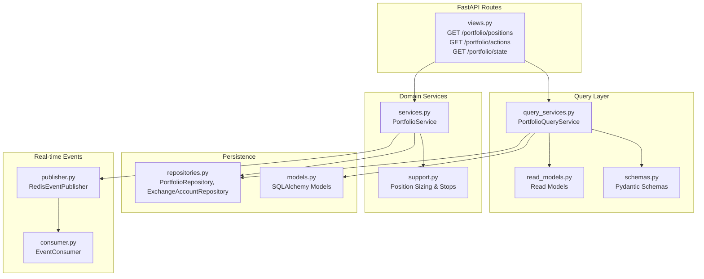
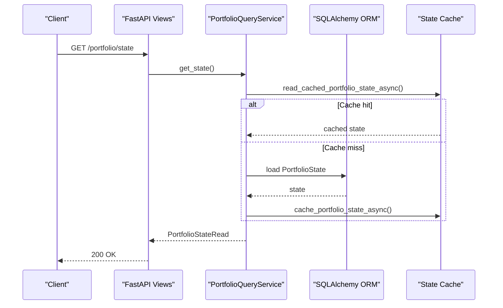
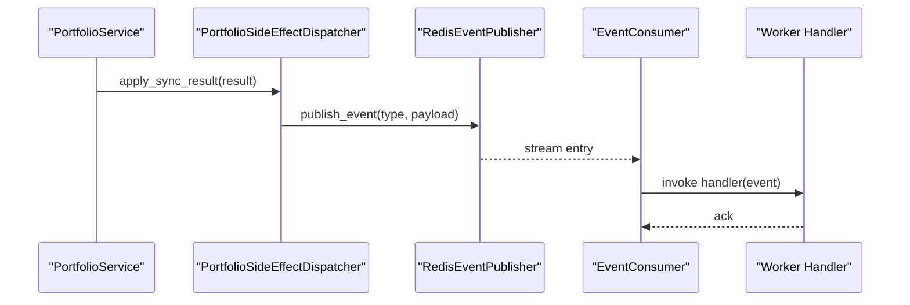
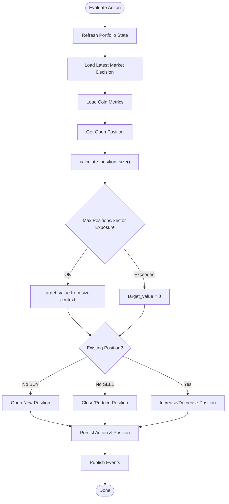
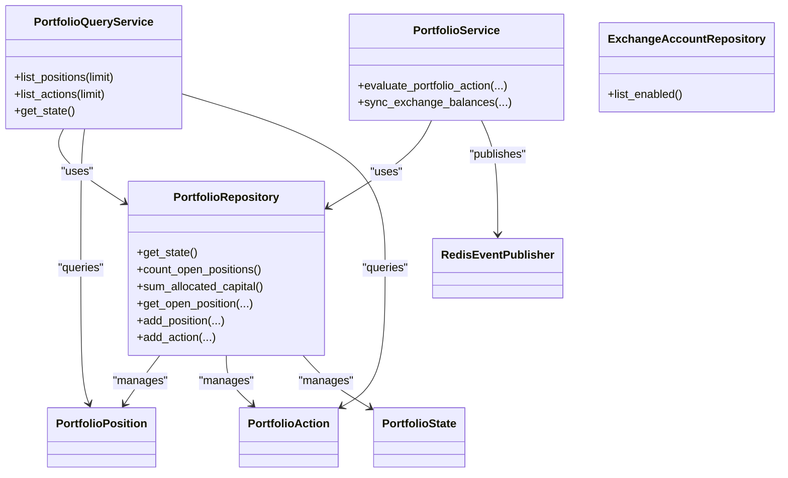

# Portfolio API

<cite>
**Referenced Files in This Document**
- [views.py](file://src/apps/portfolio/views.py)
- [schemas.py](file://src/apps/portfolio/schemas.py)
- [read_models.py](file://src/apps/portfolio/read_models.py)
- [models.py](file://src/apps/portfolio/models.py)
- [query_services.py](file://src/apps/portfolio/query_services.py)
- [repositories.py](file://src/apps/portfolio/repositories.py)
- [services.py](file://src/apps/portfolio/services.py)
- [support.py](file://src/apps/portfolio/support.py)
- [tasks.py](file://src/apps/portfolio/tasks.py)
- [publisher.py](file://src/runtime/streams/publisher.py)
- [consumer.py](file://src/runtime/streams/consumer.py)
- [test_views.py](file://tests/apps/portfolio/test_views.py)
- [test_position_sizing.py](file://tests/apps/portfolio/test_position_sizing.py)
</cite>

## Table of Contents
1. [Introduction](#introduction)
2. [Project Structure](#project-structure)
3. [Core Components](#core-components)
4. [Architecture Overview](#architecture-overview)
5. [Detailed Component Analysis](#detailed-component-analysis)
6. [Dependency Analysis](#dependency-analysis)
7. [Performance Considerations](#performance-considerations)
8. [Troubleshooting Guide](#troubleshooting-guide)
9. [Conclusion](#conclusion)
10. [Appendices](#appendices)

## Introduction
This document provides comprehensive API documentation for portfolio management endpoints. It covers REST endpoints for position management, portfolio actions, and portfolio state retrieval, along with the underlying calculation logic for position sizing and risk controls. It also documents the event-driven real-time update mechanism powered by Redis Streams, including the event types published for balance updates, position changes, and action outcomes. Filtering and pagination are supported via query parameters, and the document includes practical examples for position sizing, drawdown monitoring, and automated position adjustments.

## Project Structure
The portfolio module exposes FastAPI routes under the tag “portfolio” and delegates to query services and repositories for data access. Position sizing and risk control logic are encapsulated in support utilities and invoked by the portfolio service during action evaluation and balance synchronization.

**Diagram sources**
- [views.py:11-31](file://src/apps/portfolio/views.py#L11-L31)
- [query_services.py:26-182](file://src/apps/portfolio/query_services.py#L26-L182)
- [read_models.py:8-114](file://src/apps/portfolio/read_models.py#L8-L114)
- [schemas.py:8-62](file://src/apps/portfolio/schemas.py#L8-L62)
- [repositories.py:15-221](file://src/apps/portfolio/repositories.py#L15-L221)
- [models.py:16-150](file://src/apps/portfolio/models.py#L16-L150)
- [services.py:173-431](file://src/apps/portfolio/services.py#L173-L431)
- [support.py:37-78](file://src/apps/portfolio/support.py#L37-L78)
- [publisher.py:22-101](file://src/runtime/streams/publisher.py#L22-L101)
- [consumer.py:49-230](file://src/runtime/streams/consumer.py#L49-L230)

**Section sources**
- [views.py:11-31](file://src/apps/portfolio/views.py#L11-L31)
- [query_services.py:26-182](file://src/apps/portfolio/query_services.py#L26-L182)
- [repositories.py:15-221](file://src/apps/portfolio/repositories.py#L15-L221)
- [services.py:173-431](file://src/apps/portfolio/services.py#L173-L431)
- [support.py:37-78](file://src/apps/portfolio/support.py#L37-L78)
- [publisher.py:22-101](file://src/runtime/streams/publisher.py#L22-L101)
- [consumer.py:49-230](file://src/runtime/streams/consumer.py#L49-L230)

## Core Components
- REST endpoints:
  - GET /portfolio/positions: List open and partial positions with optional limit.
  - GET /portfolio/actions: List recent portfolio actions with optional limit.
  - GET /portfolio/state: Retrieve portfolio capital and position counts snapshot.
- Pydantic models for responses:
  - PortfolioPositionRead
  - PortfolioActionRead
  - PortfolioStateRead
- Query service:
  - PortfolioQueryService: constructs projections, computes derived fields (e.g., unrealized PnL, risk-to-stop), and caches state.
- Domain service:
  - PortfolioService: evaluates actions, rebalances positions, syncs balances, and publishes events.
- Support utilities:
  - calculate_position_size: computes target position value considering capital, confidence, regime, and volatility.
  - calculate_stops: derives stop-loss and take-profit from ATR and multipliers.
- Repositories and models:
  - PortfolioRepository, ExchangeAccountRepository, SQLAlchemy models for positions, actions, balances, state.

**Section sources**
- [views.py:11-31](file://src/apps/portfolio/views.py#L11-L31)
- [schemas.py:8-62](file://src/apps/portfolio/schemas.py#L8-L62)
- [query_services.py:30-182](file://src/apps/portfolio/query_services.py#L30-L182)
- [services.py:173-431](file://src/apps/portfolio/services.py#L173-L431)
- [support.py:37-78](file://src/apps/portfolio/support.py#L37-L78)
- [repositories.py:39-221](file://src/apps/portfolio/repositories.py#L39-L221)
- [models.py:48-150](file://src/apps/portfolio/models.py#L48-L150)

## Architecture Overview
The API follows a layered architecture:
- Presentation: FastAPI routes delegate to query services.
- Query: Assemble projections, join related entities, compute derived metrics, and cache state.
- Domain: Business logic for action evaluation, position sizing, and event publishing.
- Persistence: Repositories encapsulate SQL operations.
- Real-time: Events published to Redis Streams and consumed by workers.

**Diagram sources**
- [views.py:29-31](file://src/apps/portfolio/views.py#L29-L31)
- [query_services.py:134-182](file://src/apps/portfolio/query_services.py#L134-L182)
- [services.py:479-492](file://src/apps/portfolio/services.py#L479-L492)

## Detailed Component Analysis

### REST Endpoints

- GET /portfolio/positions
  - Purpose: Retrieve open and partial positions with derived fields (e.g., current price, unrealized PnL, risk-to-stop).
  - Query parameters:
    - limit: integer, default 100, min 1, max 500.
  - Response: Array of PortfolioPositionRead.
  - Notes: Positions are filtered by status “open” or “partial”, ordered by position value and ID.

- GET /portfolio/actions
  - Purpose: Retrieve recent portfolio actions (e.g., OPEN_POSITION, CLOSE_POSITION, INCREASE_POSITION, REDUCE_POSITION, HOLD_POSITION).
  - Query parameters:
    - limit: integer, default 100, min 1, max 500.
  - Response: Array of PortfolioActionRead.

- GET /portfolio/state
  - Purpose: Retrieve portfolio capital snapshot (total, allocated, available), open positions count, and max positions.
  - Response: PortfolioStateRead.
  - Notes: State is cached and refreshed on reads.

**Section sources**
- [views.py:11-31](file://src/apps/portfolio/views.py#L11-L31)
- [query_services.py:30-132](file://src/apps/portfolio/query_services.py#L30-L132)
- [query_services.py:134-182](file://src/apps/portfolio/query_services.py#L134-L182)

### Request and Response Schemas

- PortfolioPositionRead
  - Fields: id, coin_id, symbol, name, sector, exchange_account_id, source_exchange, position_type, timeframe, entry_price, position_size, position_value, stop_loss, take_profit, status, opened_at, closed_at, current_price, unrealized_pnl, latest_decision, latest_decision_confidence, regime, risk_to_stop.

- PortfolioActionRead
  - Fields: id, coin_id, symbol, name, action, size, confidence, decision_id, market_decision, created_at.

- PortfolioStateRead
  - Fields: total_capital, allocated_capital, available_capital, updated_at, open_positions, max_positions.

These schemas are generated from read models and validated in views.

**Section sources**
- [schemas.py:8-62](file://src/apps/portfolio/schemas.py#L8-L62)
- [read_models.py:8-114](file://src/apps/portfolio/read_models.py#L8-L114)
- [views.py:11-31](file://src/apps/portfolio/views.py#L11-L31)

### Position Sizing and Risk Controls

- Position sizing
  - Inputs: total_capital, available_capital, decision_confidence, regime, price_current, atr_14.
  - Logic: Computes base_size, applies regime factor, volatility adjustment, clamps confidence, caps by available capital and maximum position size, returns position_value and breakdown metrics.
  - Reference: calculate_position_size.

- Risk control configuration
  - Stop-loss and take-profit derived from ATR and multipliers.
  - Reference: calculate_stops.

- Practical examples
  - Calculating position sizes based on risk parameters:
    - Example path: [test_position_sizing.py:6-26](file://tests/apps/portfolio/test_position_sizing.py#L6-L26)
  - Monitoring portfolio drawdown:
    - Use unrealized_pnl and position_value from PortfolioPositionRead to assess drawdown vs. entry_price.
  - Configuring automated position adjustments:
    - Adjust portfolio_max_positions, portfolio_max_sector_exposure, and ATR multipliers to influence target_value and stop levels.

**Section sources**
- [support.py:37-78](file://src/apps/portfolio/support.py#L37-L78)
- [test_position_sizing.py:6-32](file://tests/apps/portfolio/test_position_sizing.py#L6-L32)

### Real-time Updates via Redis Streams

- Published events
  - portfolio_balance_updated
  - portfolio_position_changed
  - portfolio_position_opened
  - portfolio_position_closed
  - portfolio_rebalanced
  - coin_auto_watch_enabled

- Publishing
  - PortfolioService dispatches events after sync and action evaluation.
  - RedisEventPublisher writes to a Redis stream on a background thread.

- Consuming
  - EventConsumer reads from the stream, acknowledges processed messages, and invokes handlers.

**Diagram sources**
- [services.py:141-171](file://src/apps/portfolio/services.py#L141-L171)
- [publisher.py:22-101](file://src/runtime/streams/publisher.py#L22-L101)
- [consumer.py:49-230](file://src/runtime/streams/consumer.py#L49-L230)

**Section sources**
- [services.py:141-171](file://src/apps/portfolio/services.py#L141-L171)
- [publisher.py:22-101](file://src/runtime/streams/publisher.py#L22-L101)
- [consumer.py:49-230](file://src/runtime/streams/consumer.py#L49-L230)

### Portfolio Action Evaluation Flow

**Diagram sources**
- [services.py:231-431](file://src/apps/portfolio/services.py#L231-L431)
- [support.py:37-78](file://src/apps/portfolio/support.py#L37-L78)

**Section sources**
- [services.py:231-431](file://src/apps/portfolio/services.py#L231-L431)
- [support.py:37-78](file://src/apps/portfolio/support.py#L37-L78)

### Portfolio Sync Job

- Endpoint
  - The portfolio_sync_job is a scheduled task that synchronizes exchange balances, persists results, and triggers side effects (cache updates and event publishing).

- Behavior
  - Acquires a distributed lock, runs sync, commits transaction, applies side effects, and returns a structured payload.

**Section sources**
- [tasks.py:11-22](file://src/apps/portfolio/tasks.py#L11-L22)
- [services.py:433-463](file://src/apps/portfolio/services.py#L433-L463)

## Dependency Analysis

**Diagram sources**
- [query_services.py:26-182](file://src/apps/portfolio/query_services.py#L26-L182)
- [services.py:173-431](file://src/apps/portfolio/services.py#L173-L431)
- [repositories.py:39-221](file://src/apps/portfolio/repositories.py#L39-L221)
- [models.py:48-150](file://src/apps/portfolio/models.py#L48-L150)
- [publisher.py:22-101](file://src/runtime/streams/publisher.py#L22-L101)

**Section sources**
- [query_services.py:26-182](file://src/apps/portfolio/query_services.py#L26-L182)
- [services.py:173-431](file://src/apps/portfolio/services.py#L173-L431)
- [repositories.py:39-221](file://src/apps/portfolio/repositories.py#L39-L221)
- [models.py:48-150](file://src/apps/portfolio/models.py#L48-L150)
- [publisher.py:22-101](file://src/runtime/streams/publisher.py#L22-L101)

## Performance Considerations
- Pagination and limits:
  - All list endpoints accept a limit parameter with an enforced maximum to prevent heavy queries.
- Derived metrics computation:
  - Query service computes unrealized PnL and risk-to-stop in SQL joins and Python mapping to avoid redundant round trips.
- Caching:
  - Portfolio state is cached and refreshed on reads to reduce database load.
- Event publishing:
  - RedisEventPublisher drains I/O on a background thread to keep request paths non-blocking.

[No sources needed since this section provides general guidance]

## Troubleshooting Guide
- Endpoints return empty arrays:
  - Verify that positions have status “open” or “partial” and that the limit is sufficient.
  - See [query_services.py:70-74](file://src/apps/portfolio/query_services.py#L70-L74).
- Portfolio state shows zeros:
  - Ensure PortfolioState exists or is initialized; otherwise, defaults are returned.
  - See [query_services.py:141-152](file://src/apps/portfolio/query_services.py#L141-L152).
- No real-time events received:
  - Confirm Redis stream name and group configuration; ensure consumers are running and ACK-ing messages.
  - See [publisher.py:22-101](file://src/runtime/streams/publisher.py#L22-L101) and [consumer.py:49-230](file://src/runtime/streams/consumer.py#L49-L230).
- Position sizing yields zero:
  - Check max positions, sector exposure thresholds, and available capital; confirm decision confidence and regime inputs.
  - See [services.py:294-307](file://src/apps/portfolio/services.py#L294-L307) and [support.py:37-78](file://src/apps/portfolio/support.py#L37-L78).

**Section sources**
- [query_services.py:70-74](file://src/apps/portfolio/query_services.py#L70-L74)
- [query_services.py:141-152](file://src/apps/portfolio/query_services.py#L141-L152)
- [publisher.py:22-101](file://src/runtime/streams/publisher.py#L22-L101)
- [consumer.py:49-230](file://src/runtime/streams/consumer.py#L49-L230)
- [services.py:294-307](file://src/apps/portfolio/services.py#L294-L307)
- [support.py:37-78](file://src/apps/portfolio/support.py#L37-L78)

## Conclusion
The portfolio API provides robust endpoints for position management, action tracking, and state snapshots, backed by efficient queries and caching. Position sizing and risk controls are configurable and exposed via clear calculation utilities. Real-time updates are delivered reliably through Redis Streams, enabling responsive dashboards and automated workflows.

[No sources needed since this section summarizes without analyzing specific files]

## Appendices

### Authentication and Authorization
- Authentication requirements are not defined in the portfolio module. Clients should follow the application-wide authentication policy configured at the FastAPI level.

[No sources needed since this section does not analyze specific files]

### Filtering and Pagination
- Filtering:
  - Positions are filtered by status “open” or “partial”.
  - Actions are sorted by creation time.
- Pagination:
  - limit parameter supports values from 1 to 500.

**Section sources**
- [query_services.py:70-74](file://src/apps/portfolio/query_services.py#L70-L74)
- [query_services.py:126-127](file://src/apps/portfolio/query_services.py#L126-L127)
- [views.py:13](file://src/apps/portfolio/views.py#L13)
- [views.py:22](file://src/apps/portfolio/views.py#L22)

### Practical Examples

- Calculate position size based on risk parameters
  - Use calculate_position_size with total_capital, available_capital, decision_confidence, regime, price_current, and atr_14.
  - Reference: [support.py:37-78](file://src/apps/portfolio/support.py#L37-L78)
  - Test reference: [test_position_sizing.py:6-26](file://tests/apps/portfolio/test_position_sizing.py#L6-L26)

- Monitor portfolio drawdown
  - Compute unrealized PnL using current_price and entry_price from PortfolioPositionRead; compare against position_value to assess drawdown.

- Configure automated position adjustments
  - Tune portfolio_max_positions, portfolio_max_sector_exposure, and ATR multipliers to influence target_value and stop levels.
  - References: [services.py:304-307](file://src/apps/portfolio/services.py#L304-L307), [support.py:28-34](file://src/apps/portfolio/support.py#L28-L34)

**Section sources**
- [support.py:37-78](file://src/apps/portfolio/support.py#L37-L78)
- [test_position_sizing.py:6-26](file://tests/apps/portfolio/test_position_sizing.py#L6-L26)
- [services.py:304-307](file://src/apps/portfolio/services.py#L304-L307)
- [support.py:28-34](file://src/apps/portfolio/support.py#L28-L34)

### API Definitions

- GET /portfolio/positions
  - Query parameters: limit (integer, default 100, range 1..500)
  - Response: array of PortfolioPositionRead

- GET /portfolio/actions
  - Query parameters: limit (integer, default 100, range 1..500)
  - Response: array of PortfolioActionRead

- GET /portfolio/state
  - Response: PortfolioStateRead

Validation examples:
- [test_views.py:12-32](file://tests/apps/portfolio/test_views.py#L12-L32)

**Section sources**
- [views.py:11-31](file://src/apps/portfolio/views.py#L11-L31)
- [test_views.py:12-32](file://tests/apps/portfolio/test_views.py#L12-L32)