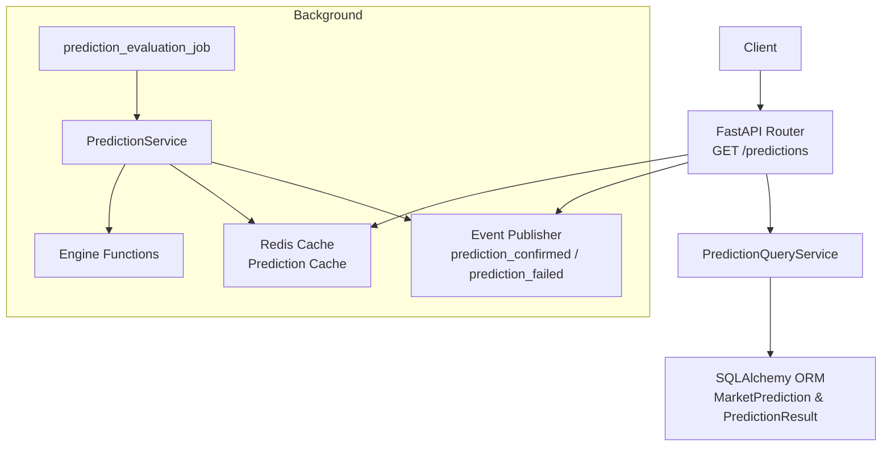
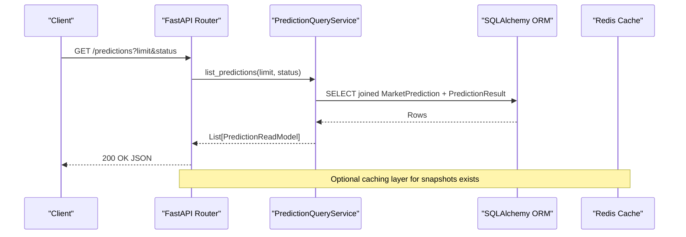
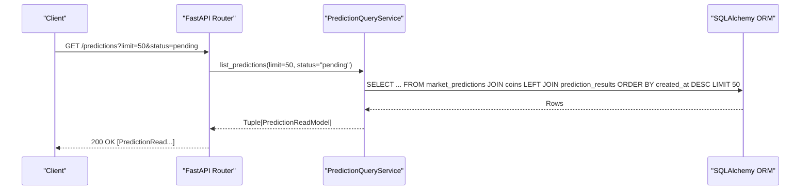
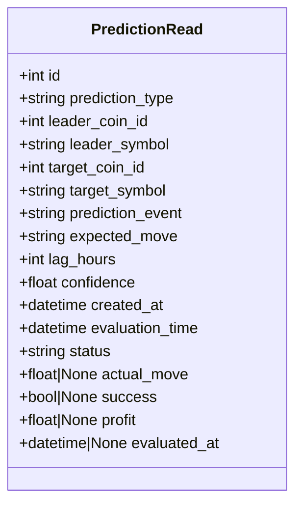
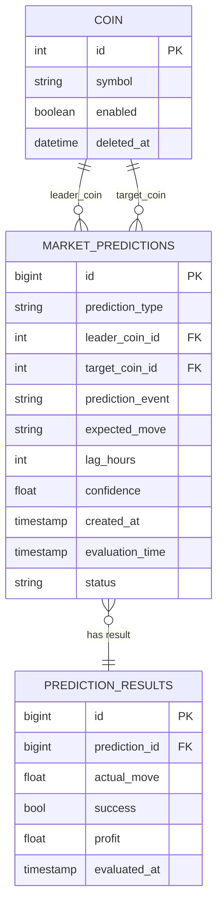
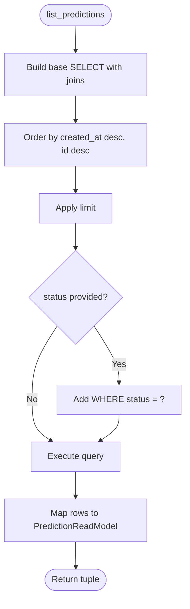
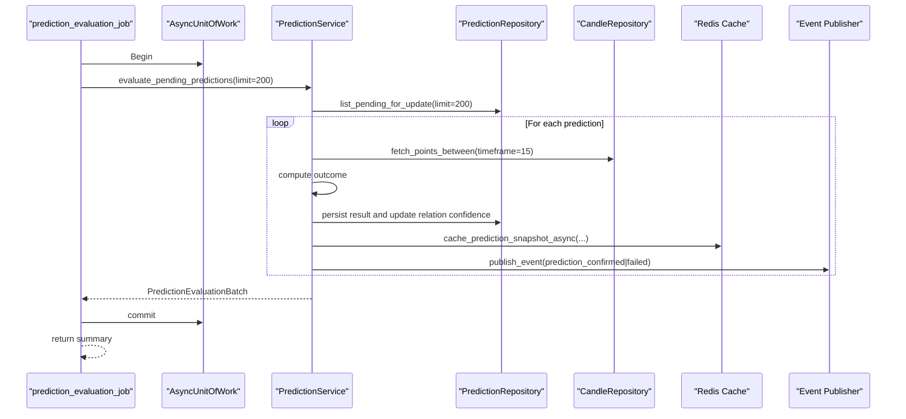
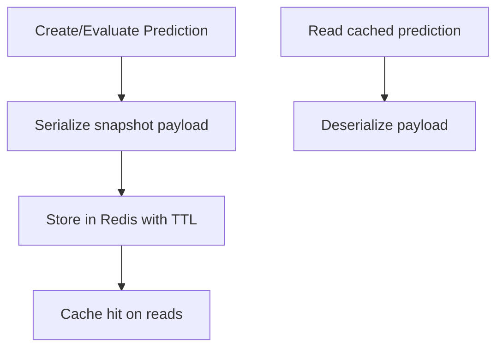
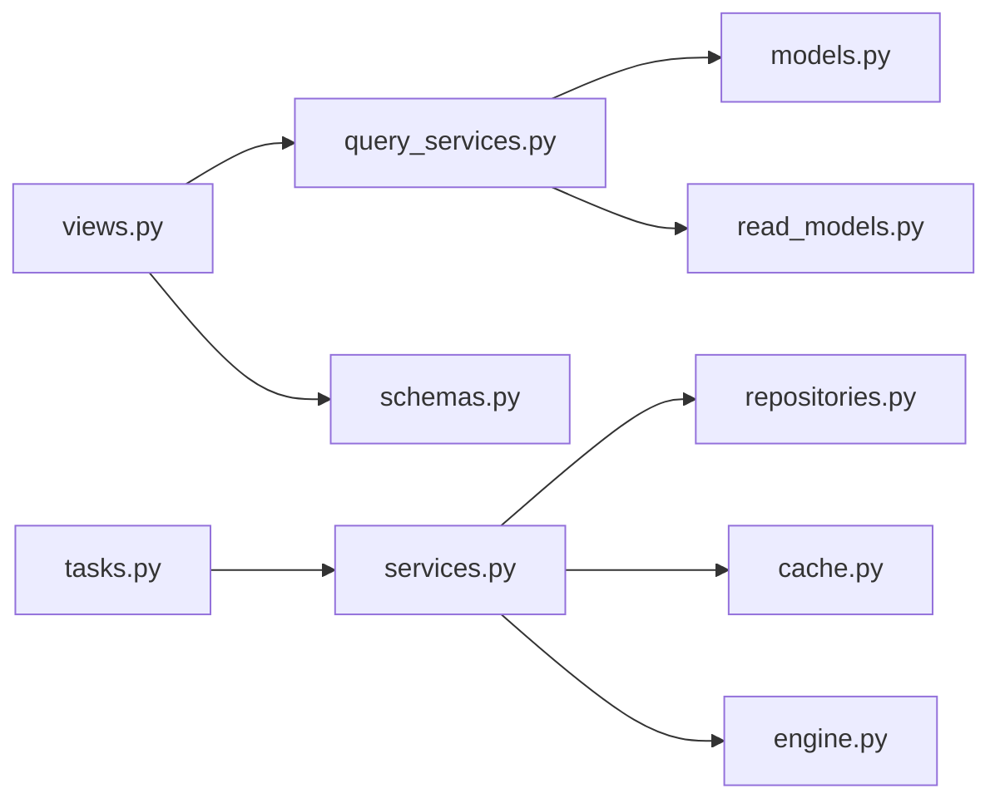

# Predictions API

<cite>
**Referenced Files in This Document**
- [views.py](file://src/apps/predictions/views.py)
- [schemas.py](file://src/apps/predictions/schemas.py)
- [models.py](file://src/apps/predictions/models.py)
- [query_services.py](file://src/apps/predictions/query_services.py)
- [repositories.py](file://src/apps/predictions/repositories.py)
- [services.py](file://src/apps/predictions/services.py)
- [engine.py](file://src/apps/predictions/engine.py)
- [tasks.py](file://src/apps/predictions/tasks.py)
- [cache.py](file://src/apps/predictions/cache.py)
- [support.py](file://src/apps/predictions/support.py)
- [read_models.py](file://src/apps/predictions/read_models.py)
- [selectors.py](file://src/apps/predictions/selectors.py)
- [main.py](file://src/main.py)
</cite>

## Table of Contents
1. [Introduction](#introduction)
2. [Project Structure](#project-structure)
3. [Core Components](#core-components)
4. [Architecture Overview](#architecture-overview)
5. [Detailed Component Analysis](#detailed-component-analysis)
6. [Dependency Analysis](#dependency-analysis)
7. [Performance Considerations](#performance-considerations)
8. [Troubleshooting Guide](#troubleshooting-guide)
9. [Conclusion](#conclusion)
10. [Appendices](#appendices)

## Introduction
This document provides comprehensive API documentation for prediction and forecasting endpoints. It covers:
- REST endpoints for retrieving predictions, model evaluation, and feedback integration
- Memory engine caching for predictions
- Real-time update mechanisms via event publishing
- Request/response schemas, filtering, pagination, and confidence scoring
- Practical examples for retrieving predictive models, evaluating prediction accuracy, and integrating feedback

The backend exposes a FastAPI router under the “predictions” tag and integrates with asynchronous unit-of-work, SQLAlchemy ORM, Redis caching, and event publishing for real-time updates.

## Project Structure
The predictions subsystem is organized around a FastAPI router, Pydantic schemas, SQLAlchemy models, query services, repositories, services, and supporting utilities. It also includes a background task for periodic evaluation and a cache layer for quick reads.

**Diagram sources**
- [views.py:11-18](file://src/apps/predictions/views.py#L11-L18)
- [query_services.py:13-86](file://src/apps/predictions/query_services.py#L13-L86)
- [models.py:15-65](file://src/apps/predictions/models.py#L15-L65)
- [cache.py:118-197](file://src/apps/predictions/cache.py#L118-L197)
- [tasks.py:11-23](file://src/apps/predictions/tasks.py#L11-L23)
- [services.py:140-323](file://src/apps/predictions/services.py#L140-L323)
- [engine.py:306-388](file://src/apps/predictions/engine.py#L306-L388)

**Section sources**
- [views.py:1-19](file://src/apps/predictions/views.py#L1-L19)
- [main.py:9](file://src/main.py#L9)

## Core Components
- FastAPI Router and Endpoint
  - GET /predictions with pagination and optional status filter
- Pydantic Schema
  - PredictionRead for response serialization
- SQLAlchemy Models
  - MarketPrediction and PredictionResult with relationships and indexes
- Query Service
  - Builds joined read queries and applies filters
- Repositories
  - Creation candidates, pending windows, and pending updates
- Services
  - Prediction creation and evaluation workflows, event emission, and side effects
- Engine
  - Legacy and async evaluation and creation helpers
- Cache
  - Redis-backed snapshot caching for predictions
- Tasks
  - Background job orchestrating evaluation with locking

**Section sources**
- [views.py:11-18](file://src/apps/predictions/views.py#L11-L18)
- [schemas.py:8-27](file://src/apps/predictions/schemas.py#L8-L27)
- [models.py:15-65](file://src/apps/predictions/models.py#L15-L65)
- [query_services.py:13-86](file://src/apps/predictions/query_services.py#L13-L86)
- [repositories.py:24-149](file://src/apps/predictions/repositories.py#L24-L149)
- [services.py:140-323](file://src/apps/predictions/services.py#L140-L323)
- [engine.py:24-179](file://src/apps/predictions/engine.py#L24-L179)
- [cache.py:118-197](file://src/apps/predictions/cache.py#L118-L197)
- [tasks.py:11-23](file://src/apps/predictions/tasks.py#L11-L23)

## Architecture Overview
The API follows a layered architecture:
- Presentation: FastAPI router delegates to a query service
- Domain: Services encapsulate business logic for creation and evaluation
- Persistence: Repositories and models manage database operations
- Caching: Redis cache stores prediction snapshots for low-latency reads
- Events: Published upon evaluation outcomes for real-time updates

**Diagram sources**
- [views.py:11-18](file://src/apps/predictions/views.py#L11-L18)
- [query_services.py:46-86](file://src/apps/predictions/query_services.py#L46-L86)
- [models.py:15-65](file://src/apps/predictions/models.py#L15-L65)
- [cache.py:118-197](file://src/apps/predictions/cache.py#L118-L197)

## Detailed Component Analysis

### REST Endpoint: GET /predictions
- Path: /predictions
- Method: GET
- Authentication: Not specified in router; depends on application-wide middleware
- Query Parameters
  - limit: integer, default 50, min 1, max 500
  - status: string, optional (filters by status)
- Response: array of PredictionRead
- Pagination: Controlled by limit; ordering by created_at desc, id desc
- Filtering: status equality filter supported

**Diagram sources**
- [views.py:11-18](file://src/apps/predictions/views.py#L11-L18)
- [query_services.py:46-86](file://src/apps/predictions/query_services.py#L46-L86)

**Section sources**
- [views.py:11-18](file://src/apps/predictions/views.py#L11-L18)
- [query_services.py:46-86](file://src/apps/predictions/query_services.py#L46-L86)

### Request/Response Schemas
- Request
  - GET /predictions
    - Query: limit (integer), status (string, optional)
- Response
  - Array of PredictionRead with fields:
    - id, prediction_type, leader_coin_id, leader_symbol, target_coin_id, target_symbol
    - prediction_event, expected_move, lag_hours, confidence, created_at, evaluation_time, status
    - actual_move, success, profit, evaluated_at (nullable)

**Diagram sources**
- [schemas.py:8-27](file://src/apps/predictions/schemas.py#L8-L27)

**Section sources**
- [schemas.py:8-27](file://src/apps/predictions/schemas.py#L8-L27)

### Data Models and Relationships
- MarketPrediction
  - Fields: id, prediction_type, leader_coin_id, target_coin_id, prediction_event, expected_move, lag_hours, confidence, created_at, evaluation_time, status
  - Relationships: leader_coin (Coin), target_coin (Coin), result (PredictionResult)
  - Indexes: status + evaluation_time, leader + target + created desc
- PredictionResult
  - Fields: id, prediction_id, actual_move, success, profit, evaluated_at
  - Relationship: prediction (MarketPrediction)

**Diagram sources**
- [models.py:15-65](file://src/apps/predictions/models.py#L15-L65)

**Section sources**
- [models.py:15-65](file://src/apps/predictions/models.py#L15-L65)

### Query Service and Read Model
- Purpose: Build joined SQL statements, order by created_at desc, apply limit and optional status filter
- Read Model: PredictionReadModel mirrors PredictionRead for internal processing
- Join Strategy: Left join PredictionResult to include evaluation details when present

**Diagram sources**
- [query_services.py:18-86](file://src/apps/predictions/query_services.py#L18-L86)
- [read_models.py:8-48](file://src/apps/predictions/read_models.py#L8-L48)

**Section sources**
- [query_services.py:13-86](file://src/apps/predictions/query_services.py#L13-L86)
- [read_models.py:8-48](file://src/apps/predictions/read_models.py#L8-L48)

### Prediction Creation and Evaluation Workflows
- Creation
  - Service selects relation candidates with minimum confidence and limit
  - Checks pending windows to avoid overlapping predictions
  - Creates MarketPrediction entries with evaluation_time = now + lag_hours
  - Stores snapshots in cache
- Evaluation
  - Selects pending predictions ordered by created_at asc
  - Computes outcome based on OHLCV within evaluation window
  - Updates status, PredictionResult, and CoinRelation confidence
  - Emits events prediction_confirmed or prediction_failed
  - Applies side effects: cache updates and event publishing

**Diagram sources**
- [tasks.py:11-23](file://src/apps/predictions/tasks.py#L11-L23)
- [services.py:241-323](file://src/apps/predictions/services.py#L241-L323)
- [repositories.py:129-149](file://src/apps/predictions/repositories.py#L129-L149)
- [engine.py:391-476](file://src/apps/predictions/engine.py#L391-L476)
- [cache.py:152-183](file://src/apps/predictions/cache.py#L152-L183)

**Section sources**
- [services.py:160-323](file://src/apps/predictions/services.py#L160-L323)
- [engine.py:24-179](file://src/apps/predictions/engine.py#L24-L179)
- [tasks.py:11-23](file://src/apps/predictions/tasks.py#L11-L23)

### Memory Engine Queries and Caching
- Cache Keys
  - Key pattern: iris:prediction:{id}
  - TTL: ~6.048e+5 seconds (~7 days)
- Operations
  - cache_prediction_snapshot_async(...)
  - read_cached_prediction_async(prediction_id)
- Usage
  - Created predictions and evaluations write snapshots
  - Side effect dispatcher coordinates cache updates after creation and evaluation

**Diagram sources**
- [cache.py:118-197](file://src/apps/predictions/cache.py#L118-L197)
- [services.py:390-424](file://src/apps/predictions/services.py#L390-L424)

**Section sources**
- [cache.py:118-197](file://src/apps/predictions/cache.py#L118-L197)
- [services.py:390-424](file://src/apps/predictions/services.py#L390-L424)

### Background Task: prediction_evaluation_job
- Locking: Uses Redis lock to prevent concurrent runs
- Execution: Calls PredictionService.evaluate_pending_predictions with emit_events=True
- Side Effects: Applies cache snapshots and publishes events

**Section sources**
- [tasks.py:11-23](file://src/apps/predictions/tasks.py#L11-L23)
- [services.py:241-323](file://src/apps/predictions/services.py#L241-L323)

## Dependency Analysis
Key dependencies and relationships:
- Router depends on PredictionQueryService and Pydantic schema
- QueryService depends on SQLAlchemy models and read models
- Services depend on repositories, candle repositories, and event publishing
- Engine provides legacy and async helpers reused by services
- Cache depends on Redis client configured via settings

**Diagram sources**
- [views.py:11-18](file://src/apps/predictions/views.py#L11-L18)
- [query_services.py:13-86](file://src/apps/predictions/query_services.py#L13-L86)
- [models.py:15-65](file://src/apps/predictions/models.py#L15-L65)
- [read_models.py:8-48](file://src/apps/predictions/read_models.py#L8-L48)
- [schemas.py:8-27](file://src/apps/predictions/schemas.py#L8-L27)
- [services.py:140-323](file://src/apps/predictions/services.py#L140-L323)
- [repositories.py:24-149](file://src/apps/predictions/repositories.py#L24-L149)
- [cache.py:118-197](file://src/apps/predictions/cache.py#L118-L197)
- [engine.py:24-179](file://src/apps/predictions/engine.py#L24-L179)
- [tasks.py:11-23](file://src/apps/predictions/tasks.py#L11-L23)

**Section sources**
- [views.py:11-18](file://src/apps/predictions/views.py#L11-L18)
- [query_services.py:13-86](file://src/apps/predictions/query_services.py#L13-L86)
- [services.py:140-323](file://src/apps/predictions/services.py#L140-L323)
- [repositories.py:24-149](file://src/apps/predictions/repositories.py#L24-L149)
- [cache.py:118-197](file://src/apps/predictions/cache.py#L118-L197)
- [engine.py:24-179](file://src/apps/predictions/engine.py#L24-L179)
- [tasks.py:11-23](file://src/apps/predictions/tasks.py#L11-L23)

## Performance Considerations
- Pagination
  - limit constrained between 1 and 500; default 50
  - Ordering by created_at desc ensures newest predictions first
- Database Indexes
  - market_predictions: (status, evaluation_time), (leader_coin_id, target_coin_id, created_at desc)
  - prediction_results: unique index on prediction_id
- Asynchronous Operations
  - Async repositories and services reduce blocking during IO
- Caching
  - Redis TTL prevents stale reads; cache writes occur after creation and evaluation
- Event Publishing
  - Events emitted only on outcome change; batch summaries minimize overhead

[No sources needed since this section provides general guidance]

## Troubleshooting Guide
- Endpoint returns empty list
  - Verify status filter correctness and limit bounds
  - Confirm records exist with matching status and evaluation_time ordering
- Evaluation does nothing
  - Ensure predictions remain in “pending” status and within evaluation window
  - Check background task lock availability and logs
- Cache misses
  - Confirm Redis connectivity and key pattern; check TTL and serialization
- Unexpected confidence values
  - Review relation confidence clamping thresholds and base_confidence scaling

**Section sources**
- [query_services.py:46-86](file://src/apps/predictions/query_services.py#L46-L86)
- [tasks.py:11-23](file://src/apps/predictions/tasks.py#L11-L23)
- [cache.py:118-197](file://src/apps/predictions/cache.py#L118-L197)
- [support.py:17-18](file://src/apps/predictions/support.py#L17-L18)

## Conclusion
The Predictions API provides a robust foundation for retrieving, evaluating, and integrating feedback on cross-market predictions. It supports pagination, filtering, caching, and real-time notifications. The design balances performance with reliability through asynchronous operations, indexing, and background jobs.

[No sources needed since this section summarizes without analyzing specific files]

## Appendices

### API Definitions

- GET /predictions
  - Description: Retrieve paginated predictions with optional status filter
  - Query Parameters:
    - limit: integer, default 50, min 1, max 500
    - status: string, optional
  - Response: array of PredictionRead
  - Notes: Results ordered by created_at desc, id desc

**Section sources**
- [views.py:11-18](file://src/apps/predictions/views.py#L11-L18)

### Request/Response Schemas

- PredictionRead
  - Fields: id, prediction_type, leader_coin_id, leader_symbol, target_coin_id, target_symbol, prediction_event, expected_move, lag_hours, confidence, created_at, evaluation_time, status, actual_move, success, profit, evaluated_at

**Section sources**
- [schemas.py:8-27](file://src/apps/predictions/schemas.py#L8-L27)

### Filtering and Pagination
- Filtering
  - status equality filter supported
- Pagination
  - limit controls page size; default 50; max 500

**Section sources**
- [views.py:13-14](file://src/apps/predictions/views.py#L13-L14)
- [query_services.py:46-69](file://src/apps/predictions/query_services.py#L46-L69)

### Confidence Scoring
- Confidence is stored per prediction and derived from relation confidence with clamping
- Thresholds and clamping logic are defined in support utilities

**Section sources**
- [support.py:5-6](file://src/apps/predictions/support.py#L5-L6)
- [support.py:17-18](file://src/apps/predictions/support.py#L17-L18)
- [services.py:210-211](file://src/apps/predictions/services.py#L210-L211)

### Real-Time Updates
- Events
  - prediction_confirmed
  - prediction_failed
- Emission
  - Occurs during evaluation when outcomes are determined

**Section sources**
- [services.py:282-304](file://src/apps/predictions/services.py#L282-L304)
- [engine.py:362-380](file://src/apps/predictions/engine.py#L362-L380)

### Practical Examples

- Retrieve predictive models
  - GET /predictions?limit=50&status=pending
  - Returns latest predictions awaiting evaluation
- Evaluate prediction accuracy
  - Trigger evaluation job or call evaluation endpoint
  - Inspect actual_move, success, profit, and evaluated_at in response
- Integrate prediction feedback
  - On outcome, CoinRelation confidence is adjusted
  - Cache snapshots updated post-evaluation

**Section sources**
- [views.py:11-18](file://src/apps/predictions/views.py#L11-L18)
- [services.py:241-323](file://src/apps/predictions/services.py#L241-L323)
- [engine.py:306-388](file://src/apps/predictions/engine.py#L306-L388)