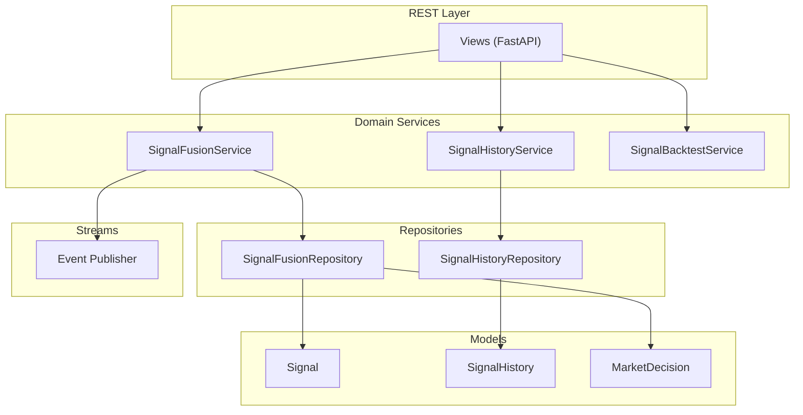
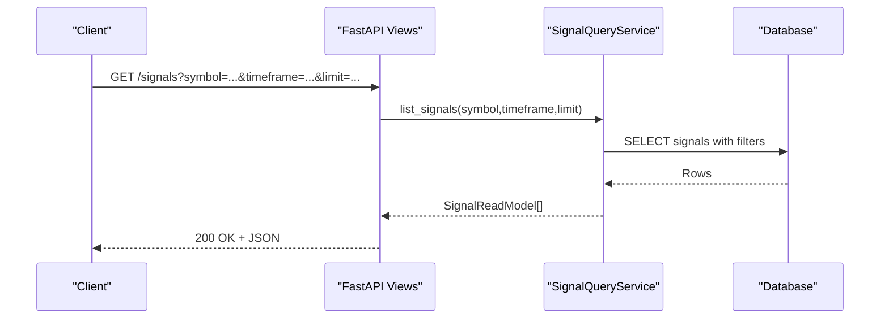
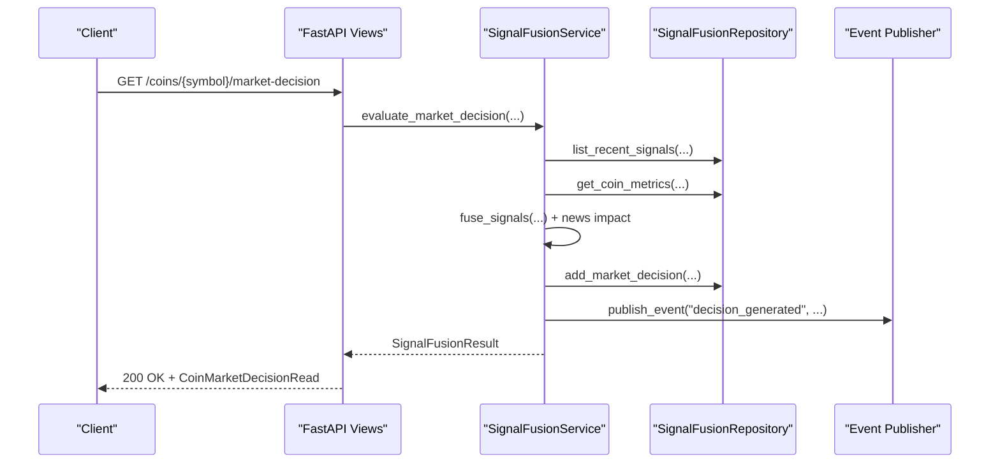
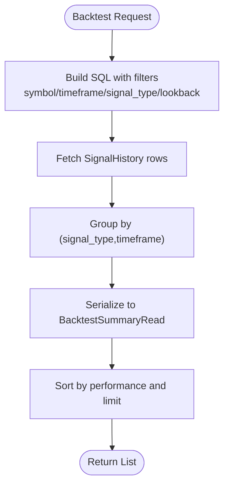
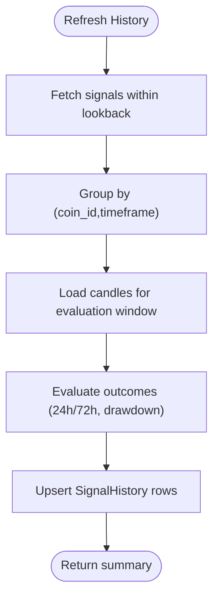
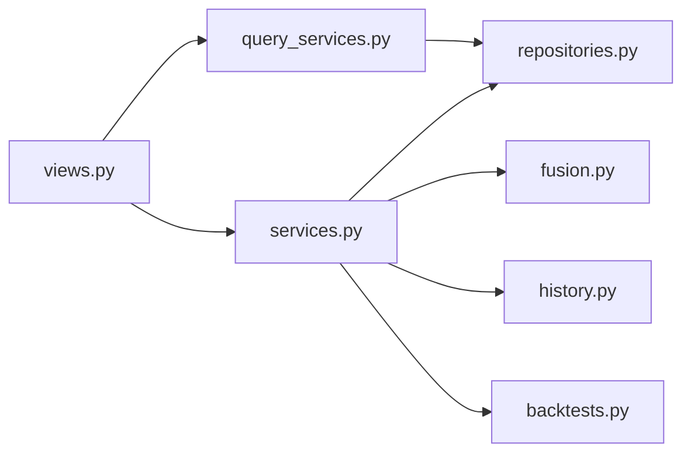

# Signals API

<cite>
**Referenced Files in This Document**
- [views.py](file://src/apps/signals/views.py)
- [schemas.py](file://src/apps/signals/schemas.py)
- [models.py](file://src/apps/signals/models.py)
- [services.py](file://src/apps/signals/services.py)
- [fusion.py](file://src/apps/signals/fusion.py)
- [fusion_support.py](file://src/apps/signals/fusion_support.py)
- [backtests.py](file://src/apps/signals/backtests.py)
- [backtest_support.py](file://src/apps/signals/backtest_support.py)
- [history.py](file://src/apps/signals/history.py)
- [history_support.py](file://src/apps/signals/history_support.py)
- [repositories.py](file://src/apps/signals/repositories.py)
- [query_services.py](file://src/apps/signals/query_services.py)
- [workers.py](file://src/runtime/streams/workers.py)
</cite>

## Table of Contents
1. [Introduction](#introduction)
2. [Project Structure](#project-structure)
3. [Core Components](#core-components)
4. [Architecture Overview](#architecture-overview)
5. [Detailed Component Analysis](#detailed-component-analysis)
6. [Dependency Analysis](#dependency-analysis)
7. [Performance Considerations](#performance-considerations)
8. [Troubleshooting Guide](#troubleshooting-guide)
9. [Conclusion](#conclusion)
10. [Appendices](#appendices)

## Introduction
This document provides comprehensive API documentation for the Signals subsystem, covering REST endpoints for retrieving signals and decisions, multi-source signal fusion, and backtesting evaluation. It also documents the request/response schemas for signal objects, fusion parameters, and evaluation metrics, along with pagination, filtering, and authentication considerations. Real-time signal updates are supported via event publishing, complementing the REST APIs.

## Project Structure
The Signals API is implemented as a FastAPI module under the signals app. Key components include:
- Views: Public REST endpoints for signals, decisions, final signals, market decisions, backtests, and strategies.
- Schemas: Pydantic models defining request/response shapes.
- Services: Business logic for fusion, backtesting, and history evaluation.
- Repositories: Asynchronous repositories for data access.
- Query Services: Aggregation and projection of read models for REST responses.
- Fusion and History Support: Shared helpers for fusion algorithms and backtest metrics.
- Streams Workers: Event publishing for real-time updates.

**Diagram sources**
- [views.py:1-211](file://src/apps/signals/views.py#L1-L211)
- [services.py:156-405](file://src/apps/signals/services.py#L156-L405)
- [repositories.py:99-324](file://src/apps/signals/repositories.py#L99-L324)
- [models.py:15-236](file://src/apps/signals/models.py#L15-L236)
- [workers.py:125-139](file://src/runtime/streams/workers.py#L125-L139)

**Section sources**
- [views.py:1-211](file://src/apps/signals/views.py#L1-L211)
- [schemas.py:1-221](file://src/apps/signals/schemas.py#L1-L221)
- [models.py:1-237](file://src/apps/signals/models.py#L1-L237)

## Core Components
- REST Endpoints: Retrieve recent signals, top signals, investment decisions, market decisions, final signals, backtests, and strategies. Endpoints support filtering by symbol and timeframe, and pagination via limit parameters.
- Signal Fusion: Assembles signals across timeframes, applies regime-aware weighting, cross-market alignment, and optional sentiment impact to produce a unified market decision with confidence and regime metadata.
- Backtesting: Computes aggregated performance metrics (win rate, ROI, Sharpe ratio, max drawdown, average confidence) over configurable lookback windows.
- History Evaluation: Evaluates realized outcomes for historical signals (24h/72h PnL, drawdown) and persists results for downstream analytics.
- Real-time Updates: Emits events when fusion produces new decisions, enabling clients to subscribe for live updates.

**Section sources**
- [views.py:23-211](file://src/apps/signals/views.py#L23-L211)
- [services.py:156-405](file://src/apps/signals/services.py#L156-L405)
- [fusion.py:244-400](file://src/apps/signals/fusion.py#L244-L400)
- [backtests.py:26-208](file://src/apps/signals/backtests.py#L26-L208)
- [history.py:63-202](file://src/apps/signals/history.py#L63-L202)
- [workers.py:125-139](file://src/runtime/streams/workers.py#L125-L139)

## Architecture Overview
The Signals API follows a layered architecture:
- REST layer exposes endpoints via FastAPI routers.
- Query services translate requests into projections and read models.
- Domain services encapsulate fusion, backtesting, and history evaluation.
- Repositories abstract database access for asynchronous sessions.
- Event publishing integrates with the runtime message bus for real-time notifications.

**Diagram sources**
- [views.py:23-31](file://src/apps/signals/views.py#L23-L31)
- [query_services.py:136-177](file://src/apps/signals/query_services.py#L136-L177)

**Section sources**
- [views.py:1-211](file://src/apps/signals/views.py#L1-L211)
- [query_services.py:131-177](file://src/apps/signals/query_services.py#L131-L177)

## Detailed Component Analysis

### REST Endpoints

#### Signal Retrieval
- Endpoint: GET /signals
  - Query parameters:
    - symbol: Optional[str]
    - timeframe: Optional[int]
    - limit: int, default 100, range 1..500
  - Response: Array of SignalRead
  - Pagination: Controlled by limit; ordering by candle_timestamp desc, created_at desc

- Endpoint: GET /signals/top
  - Query parameters:
    - limit: int, default 20, range 1..200
  - Response: Array of SignalRead ordered by priority_score desc

- Endpoint: GET /coins/{symbol}/decision
  - Path parameter: symbol
  - Response: CoinDecisionRead
  - Behavior: Returns per-timeframe decision items; 404 if coin not found

- Endpoint: GET /decisions
  - Query parameters:
    - symbol: Optional[str]
    - timeframe: Optional[int]
    - limit: int, default 100, range 1..500
  - Response: Array of InvestmentDecisionRead

- Endpoint: GET /decisions/top
  - Query parameters:
    - limit: int, default 20, range 1..200
  - Response: Array of InvestmentDecisionRead ordered by score desc, confidence desc

- Endpoint: GET /market-decisions
  - Query parameters:
    - symbol: Optional[str]
    - timeframe: Optional[int]
    - limit: int, default 100, range 1..500
  - Response: Array of MarketDecisionRead

- Endpoint: GET /market-decisions/top
  - Query parameters:
    - limit: int, default 20, range 1..200
  - Response: Array of MarketDecisionRead ordered by confidence desc, signal_count desc

- Endpoint: GET /coins/{symbol}/market-decision
  - Path parameter: symbol
  - Response: CoinMarketDecisionRead
  - Behavior: Returns per-timeframe market decision items; 404 if coin not found

- Endpoint: GET /final-signals
  - Query parameters:
    - symbol: Optional[str]
    - timeframe: Optional[int]
    - limit: int, default 100, range 1..500
  - Response: Array of FinalSignalRead

- Endpoint: GET /final-signals/top
  - Query parameters:
    - limit: int, default 20, range 1..200
  - Response: Array of FinalSignalRead ordered by risk_adjusted_score desc, confidence desc

- Endpoint: GET /coins/{symbol}/final-signal
  - Path parameter: symbol
  - Response: CoinFinalSignalRead
  - Behavior: Returns per-timeframe final signal items; 404 if coin not found

- Endpoint: GET /backtests
  - Query parameters:
    - symbol: Optional[str]
    - timeframe: Optional[int]
    - signal_type: Optional[str]
    - lookback_days: int, default 365, range 30..3650
    - limit: int, default 100, range 1..500
  - Response: Array of BacktestSummaryRead

- Endpoint: GET /backtests/top
  - Query parameters:
    - timeframe: Optional[int]
    - lookback_days: int, default 365, range 30..3650
    - limit: int, default 20, range 1..200
  - Response: Array of BacktestSummaryRead sorted by performance metrics

- Endpoint: GET /coins/{symbol}/backtests
  - Path parameter: symbol
  - Query parameters:
    - timeframe: Optional[int]
    - signal_type: Optional[str]
    - lookback_days: int, default 365, range 30..3650
    - limit: int, default 50, range 1..200
  - Response: CoinBacktestsRead
  - Behavior: 404 if coin not found

- Endpoint: GET /strategies
  - Query parameters:
    - enabled_only: bool, default False
    - limit: int, default 100, range 1..500
  - Response: Array of StrategyRead

- Endpoint: GET /strategies/performance
  - Query parameters:
    - limit: int, default 100, range 1..500
  - Response: Array of StrategyPerformanceRead

**Section sources**
- [views.py:23-211](file://src/apps/signals/views.py#L23-L211)

### Request/Response Schemas

#### Signal Object
- SignalRead
  - Fields: id, coin_id, symbol, name, sector, timeframe, signal_type, confidence, priority_score, context_score, regime_alignment, candle_timestamp, created_at, market_regime, cycle_phase, cycle_confidence, cluster_membership

- FinalSignalRead
  - Fields: id, coin_id, symbol, name, sector, timeframe, decision, confidence, risk_adjusted_score, liquidity_score, slippage_risk, volatility_risk, reason, created_at

- CoinFinalSignalRead and CoinFinalSignalItemRead
  - Fields: timeframe, decision, confidence, risk_adjusted_score, liquidity_score, slippage_risk, volatility_risk, reason, created_at

- InvestmentDecisionRead and CoinDecisionRead/ItemRead
  - Fields: id, coin_id, symbol, name, sector, timeframe, decision, confidence, score, reason, created_at

- MarketDecisionRead and CoinMarketDecisionRead/ItemRead
  - Fields: id, coin_id, symbol, name, sector, timeframe, decision, confidence, signal_count, regime, created_at

- StrategyRead, StrategyRuleRead, StrategyPerformanceRead
  - StrategyRead: id, name, description, enabled, created_at, rules[], performance?
  - StrategyRuleRead: pattern_slug, regime, sector, cycle, min_confidence
  - StrategyPerformanceRead: strategy_id, name, enabled, sample_size, win_rate, avg_return, sharpe_ratio, max_drawdown, updated_at

- BacktestSummaryRead and CoinBacktestsRead
  - BacktestSummaryRead: symbol?, signal_type, timeframe, sample_size, coin_count, win_rate, roi, avg_return, sharpe_ratio, max_drawdown, avg_confidence, last_evaluated_at?

**Section sources**
- [schemas.py:8-221](file://src/apps/signals/schemas.py#L8-L221)

### Signal Fusion and Multi-Source Aggregation
- Fusion process:
  - Context enrichment for the given timeframe.
  - Select recent signals up to a fixed limit and group by candle timestamp windows.
  - Compute success rates per pattern slug and regime.
  - Apply cross-market alignment weights from related leaders and sector trend.
  - Fuse signals into bullish/bearish scores, derive decision and confidence, and optionally incorporate recent news sentiment impact.
  - Compare against the latest decision to avoid emitting unchanged events.
  - Persist the new decision and publish a decision-generated event.

- Fusion parameters:
  - FUSION_SIGNAL_LIMIT, FUSION_CANDLE_GROUPS, FUSION_NEWS_TIMEFRAMES, NEWS_FUSION_MAX_ITEMS, NEWS_FUSION_SCORE_CAP, MATERIAL_CONFIDENCE_DELTA

- Real-time updates:
  - On decision change, publish event "decision_generated" with coin_id, timeframe, timestamp, decision, confidence, signal_count, regime, and news metrics.

**Diagram sources**
- [views.py:94-103](file://src/apps/signals/views.py#L94-L103)
- [services.py:223-405](file://src/apps/signals/services.py#L223-L405)
- [repositories.py:99-181](file://src/apps/signals/repositories.py#L99-L181)
- [fusion.py:290-400](file://src/apps/signals/fusion.py#L290-L400)
- [fusion_support.py:11-18](file://src/apps/signals/fusion_support.py#L11-L18)
- [workers.py:125-139](file://src/runtime/streams/workers.py#L125-L139)

**Section sources**
- [services.py:156-405](file://src/apps/signals/services.py#L156-L405)
- [fusion.py:244-400](file://src/apps/signals/fusion.py#L244-L400)
- [fusion_support.py:11-18](file://src/apps/signals/fusion_support.py#L11-L18)

### Signal Backtesting Queries
- Backtest endpoints compute aggregated metrics over realized outcomes stored in SignalHistory.
- Metrics include sample_size, coin_count, win_rate, roi, avg_return, sharpe_ratio, max_drawdown, avg_confidence, and last_evaluated_at.
- Filtering supports symbol, timeframe, signal_type, lookback_days, and limit.

**Diagram sources**
- [views.py:136-192](file://src/apps/signals/views.py#L136-L192)
- [backtests.py:45-171](file://src/apps/signals/backtests.py#L45-L171)
- [backtest_support.py:34-62](file://src/apps/signals/backtest_support.py#L34-L62)

**Section sources**
- [views.py:136-192](file://src/apps/signals/views.py#L136-L192)
- [backtests.py:26-208](file://src/apps/signals/backtests.py#L26-L208)
- [backtest_support.py:1-70](file://src/apps/signals/backtest_support.py#L1-L70)

### Signal History and Evaluation
- Refresh history endpoint evaluates realized outcomes for historical signals within a lookback window, computing 24h/72h PnL and drawdowns.
- Results are upserted into SignalHistory with conflict resolution.

**Diagram sources**
- [views.py:1-211](file://src/apps/signals/views.py#L1-L211)
- [history.py:82-187](file://src/apps/signals/history.py#L82-L187)
- [history_support.py:90-132](file://src/apps/signals/history_support.py#L90-L132)

**Section sources**
- [views.py:1-211](file://src/apps/signals/views.py#L1-L211)
- [history.py:63-202](file://src/apps/signals/history.py#L63-L202)
- [history_support.py:13-149](file://src/apps/signals/history_support.py#L13-L149)

### Authentication and Security
- No explicit authentication decorators are present on the signals endpoints in the reviewed files. Authentication and authorization should be enforced at the application gateway or via middleware configured in the FastAPI app. Consult the application bootstrap and middleware configuration for enforcement details.

[No sources needed since this section does not analyze specific files]

## Dependency Analysis
- Views depend on SignalQueryService for data retrieval and FastAPI dependency injection for unit-of-work.
- SignalQueryService depends on repositories and read-model builders to assemble responses.
- SignalFusionService orchestrates fusion logic, interacts with repositories, and publishes events.
- Backtest and history services encapsulate evaluation logic and persist results.

**Diagram sources**
- [views.py:1-211](file://src/apps/signals/views.py#L1-L211)
- [query_services.py:131-177](file://src/apps/signals/query_services.py#L131-L177)
- [services.py:156-405](file://src/apps/signals/services.py#L156-L405)
- [repositories.py:99-324](file://src/apps/signals/repositories.py#L99-L324)
- [fusion.py:244-400](file://src/apps/signals/fusion.py#L244-L400)
- [history.py:63-202](file://src/apps/signals/history.py#L63-L202)
- [backtests.py:26-208](file://src/apps/signals/backtests.py#L26-L208)

**Section sources**
- [views.py:1-211](file://src/apps/signals/views.py#L1-L211)
- [query_services.py:131-177](file://src/apps/signals/query_services.py#L131-L177)
- [services.py:156-405](file://src/apps/signals/services.py#L156-L405)
- [repositories.py:99-324](file://src/apps/signals/repositories.py#L99-L324)

## Performance Considerations
- Pagination limits are enforced on endpoints to prevent excessive loads.
- Fusion caps signal windows and news impact to maintain responsiveness.
- Database indexes on signals and history tables optimize lookups by coin_id, timeframe, and timestamps.
- Asynchronous repositories reduce blocking during IO-bound operations.

[No sources needed since this section provides general guidance]

## Troubleshooting Guide
- 404 Not Found: Returned when a coin symbol is not found for coin-specific endpoints (e.g., /coins/{symbol}/decision, /coins/{symbol}/market-decision, /coins/{symbol}/final-signal, /coins/{symbol}/backtests).
- Skipped fusion results: Fusion may skip when no candidate timeframes, recent signals, or sufficient news impact exists; or when the decision is unchanged within a small confidence delta.
- Missing candles: History refresh returns partial results when candles are unavailable for evaluation windows.

**Section sources**
- [views.py:63-71](file://src/apps/signals/views.py#L63-L71)
- [views.py:94-102](file://src/apps/signals/views.py#L94-L102)
- [views.py:125-133](file://src/apps/signals/views.py#L125-L133)
- [views.py:170-191](file://src/apps/signals/views.py#L170-L191)
- [services.py:192-198](file://src/apps/signals/services.py#L192-L198)
- [services.py:245-259](file://src/apps/signals/services.py#L245-L259)
- [services.py:291-304](file://src/apps/signals/services.py#L291-L304)
- [services.py:312-343](file://src/apps/signals/services.py#L312-L343)
- [history.py:117-137](file://src/apps/signals/history.py#L117-L137)

## Conclusion
The Signals API provides robust REST endpoints for retrieving signals and decisions, performing multi-source fusion with regime-aware weighting and sentiment impact, and evaluating historical outcomes and strategy performance. Pagination and filtering enable efficient consumption, while event publishing supports real-time integrations.

[No sources needed since this section summarizes without analyzing specific files]

## Appendices

### Practical Examples

- Fuse technical and sentiment signals
  - Trigger fusion for a coin across allowed timeframes; the service enriches context, selects recent signals, computes success rates, applies cross-market alignment, incorporates recent news sentiment, and emits a decision event if changed.
  - Reference: [services.py:223-405](file://src/apps/signals/services.py#L223-L405), [fusion.py:290-400](file://src/apps/signals/fusion.py#L290-L400)

- Retrieve historical signal performance
  - Call GET /backtests with symbol, timeframe, signal_type, lookback_days, and limit to receive aggregated metrics.
  - Reference: [views.py:136-152](file://src/apps/signals/views.py#L136-L152), [backtests.py:92-138](file://src/apps/signals/backtests.py#L92-L138)

- Configure signal fusion algorithms
  - Adjust fusion parameters such as signal window limits, news impact caps, and candidate timeframes via fusion support constants.
  - Reference: [fusion_support.py:11-18](file://src/apps/signals/fusion_support.py#L11-L18)

- Real-time signal updates
  - Subscribe to "decision_generated" events published by the fusion service to receive live updates when decisions change.
  - Reference: [services.py:355-373](file://src/apps/signals/services.py#L355-L373), [workers.py:125-139](file://src/runtime/streams/workers.py#L125-L139)