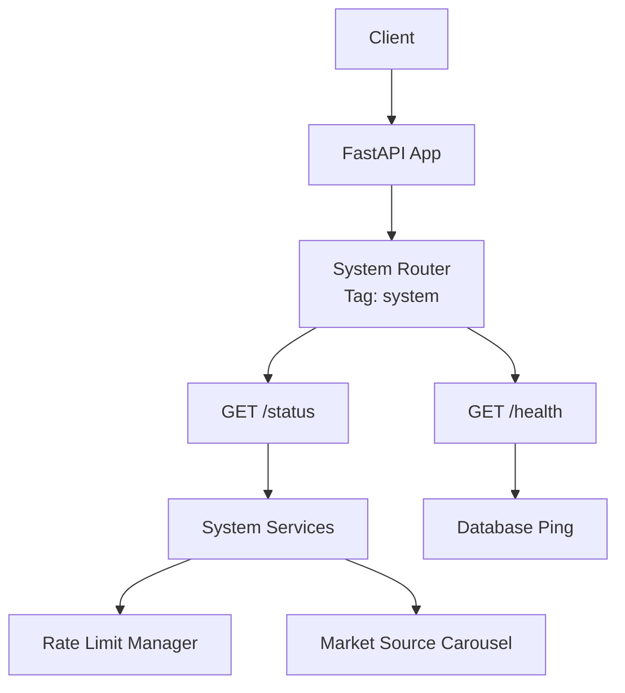
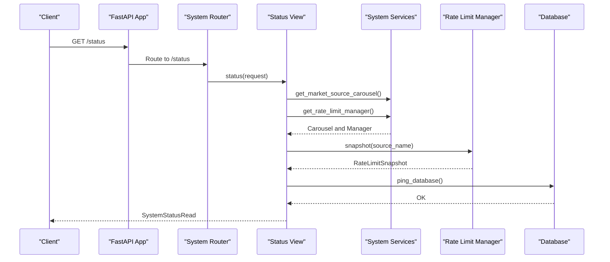
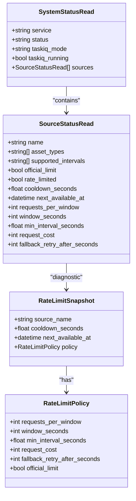
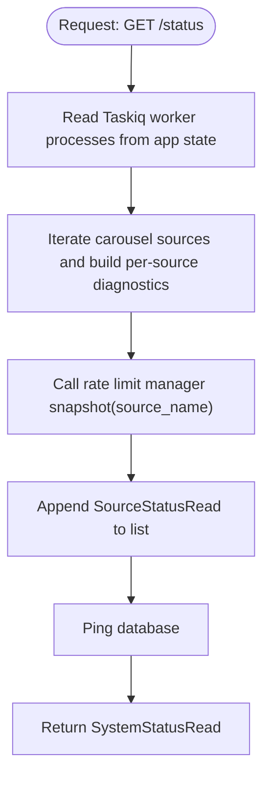
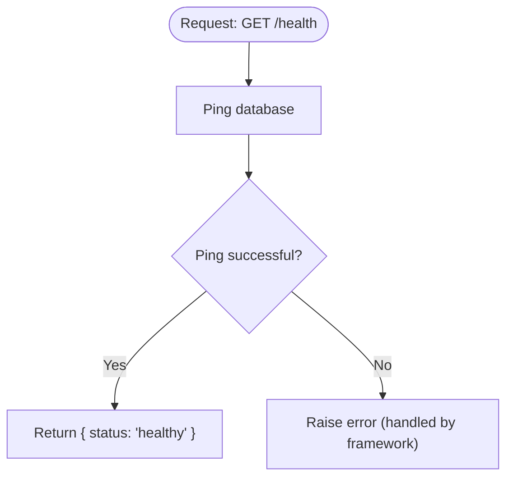
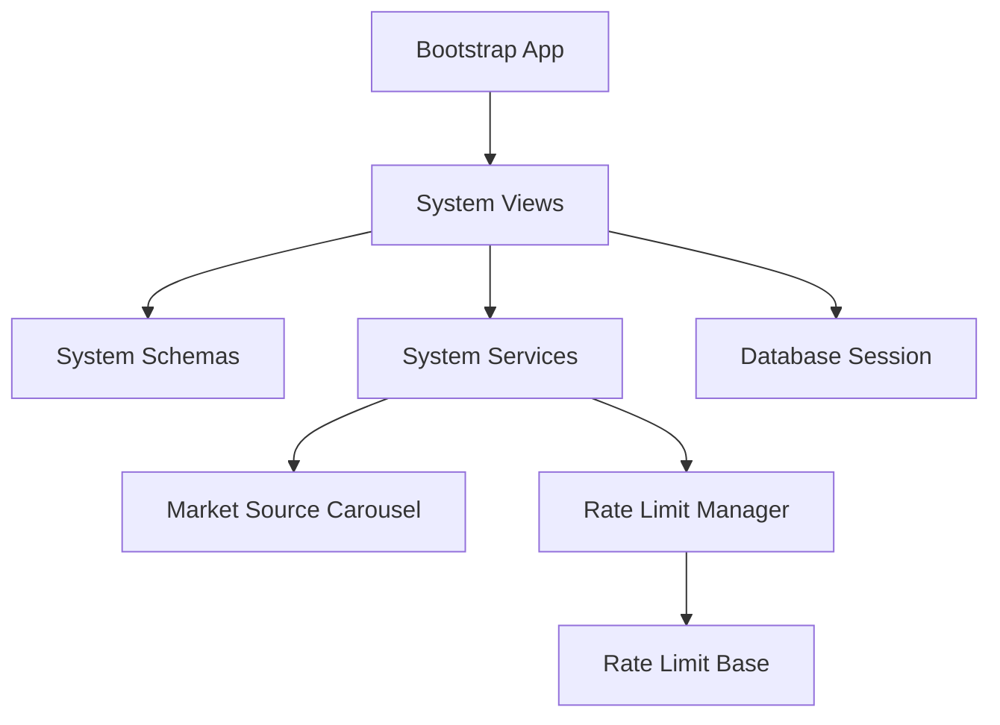

# System API

<cite>
**Referenced Files in This Document**
- [views.py](file://src/apps/system/views.py)
- [schemas.py](file://src/apps/system/schemas.py)
- [services.py](file://src/apps/system/services.py)
- [rate_limits.py](file://src/apps/market_data/sources/rate_limits.py)
- [base.py](file://src/apps/market_data/sources/base.py)
- [session.py](file://src/core/db/session.py)
- [app.py](file://src/core/bootstrap/app.py)
- [base.py](file://src/core/settings/base.py)
- [test_views.py](file://tests/apps/system/test_views.py)
</cite>

## Table of Contents
1. [Introduction](#introduction)
2. [Project Structure](#project-structure)
3. [Core Components](#core-components)
4. [Architecture Overview](#architecture-overview)
5. [Detailed Component Analysis](#detailed-component-analysis)
6. [Dependency Analysis](#dependency-analysis)
7. [Performance Considerations](#performance-considerations)
8. [Troubleshooting Guide](#troubleshooting-guide)
9. [Conclusion](#conclusion)

## Introduction
This document provides API documentation for system-level endpoints and utility functions. It covers:
- REST endpoints for system status, health checks, and configuration diagnostics
- Request and response schemas for system objects and configuration parameters
- Authentication and authorization requirements for system-level access
- Practical examples for health checks, configuration retrieval, and diagnostics

The system endpoints are implemented under the system tag and expose operational insights into the platform’s runtime state, including market data source availability and rate limiting status.

## Project Structure
The system API is implemented as part of the FastAPI application and integrates with market data source management and database connectivity.

**Diagram sources**
- [app.py:49-81](file://src/core/bootstrap/app.py#L49-L81)
- [views.py:37-52](file://src/apps/system/views.py#L37-L52)
- [services.py:1-5](file://src/apps/system/services.py#L1-L5)
- [session.py:56-71](file://src/core/db/session.py#L56-L71)

**Section sources**
- [app.py:49-81](file://src/core/bootstrap/app.py#L49-L81)
- [views.py:37-52](file://src/apps/system/views.py#L37-L52)

## Core Components
- System status endpoint: Returns service metadata, Taskiq worker status, and per-source diagnostics.
- Health check endpoint: Verifies database connectivity and returns a simple health status.
- Rate limit diagnostics: Exposes per-source rate limit policy and current cooldown state.
- Market source diagnostics: Enumerates configured sources and their capabilities.

Key schemas define the shape of responses for system status and per-source status.

**Section sources**
- [views.py:37-52](file://src/apps/system/views.py#L37-L52)
- [schemas.py:6-27](file://src/apps/system/schemas.py#L6-L27)

## Architecture Overview
The system endpoints integrate with:
- Market data source carousel for source metadata
- Rate limit manager for per-source policy and cooldown snapshots
- Database session for health checks

**Diagram sources**
- [views.py:37-52](file://src/apps/system/views.py#L37-L52)
- [views.py:10-34](file://src/apps/system/views.py#L10-L34)
- [services.py:1-5](file://src/apps/system/services.py#L1-L5)
- [rate_limits.py:146-154](file://src/apps/market_data/sources/rate_limits.py#L146-L154)
- [session.py:56-58](file://src/core/db/session.py#L56-L58)

## Detailed Component Analysis

### Endpoints

#### GET /status
- Description: Returns system status including service identity, overall status, Taskiq mode and running state, and per-source diagnostics.
- Authentication: Not required by the endpoint definition.
- Authorization: Not enforced by the endpoint; however, system-level access may be governed by deployment-level controls.
- Response model: SystemStatusRead

Response fields:
- service: String identifier for the service
- status: Operational status string
- taskiq_mode: Taskiq worker mode string
- taskiq_running: Boolean indicating if Taskiq workers are alive
- sources: Array of SourceStatusRead entries

Example response outline:
- service: "iris"
- status: "ok"
- taskiq_mode: "process_workers"
- taskiq_running: true
- sources: [
  {
    name: "binance",
    asset_types: ["crypto"],
    supported_intervals: ["15m","1h","1d"],
    official_limit: true,
    rate_limited: false,
    cooldown_seconds: 0.0,
    next_available_at: null,
    requests_per_window: 6000,
    window_seconds: 60,
    min_interval_seconds: 0.0,
    request_cost: 2,
    fallback_retry_after_seconds: 60
  }
]

Notes:
- The endpoint reads Taskiq worker process state from application state.
- Per-source diagnostics are derived from the market data source carousel and rate limit manager.

**Section sources**
- [views.py:37-46](file://src/apps/system/views.py#L37-L46)
- [schemas.py:21-27](file://src/apps/system/schemas.py#L21-L27)

#### GET /health
- Description: Performs a database connectivity check and returns a simple health status.
- Authentication: Not required by the endpoint definition.
- Authorization: Not enforced by the endpoint.
- Response: Plain JSON with status field

Example response:
- {"status":"healthy"}

**Section sources**
- [views.py:49-52](file://src/apps/system/views.py#L49-L52)
- [session.py:56-58](file://src/core/db/session.py#L56-L58)

### Schemas

#### SystemStatusRead
- service: String
- status: String
- taskiq_mode: String
- taskiq_running: Boolean
- sources: Array of SourceStatusRead

#### SourceStatusRead
- name: String
- asset_types: Array of String
- supported_intervals: Array of String
- official_limit: Boolean
- rate_limited: Boolean
- cooldown_seconds: Number (float)
- next_available_at: DateTime or null
- requests_per_window: Integer or null
- window_seconds: Integer or null
- min_interval_seconds: Number or null
- request_cost: Integer or null
- fallback_retry_after_seconds: Integer or null

These schemas define the structure of the system status response and per-source diagnostics.

**Section sources**
- [schemas.py:6-27](file://src/apps/system/schemas.py#L6-L27)

### Utility Functions and Diagnostics

#### Rate Limit Snapshot
- Purpose: Provides current rate limit state and policy for a given source.
- Inputs: source_name
- Outputs: RateLimitSnapshot with policy and cooldown metadata

Integration:
- The status endpoint iterates over carousel sources and obtains a snapshot for each via the rate limit manager.

**Section sources**
- [rate_limits.py:146-154](file://src/apps/market_data/sources/rate_limits.py#L146-L154)
- [views.py:10-34](file://src/apps/system/views.py#L10-L34)

#### Market Source Carousel
- Purpose: Supplies source metadata (asset types, intervals) and enumerates available sources.
- Integration: Used by the status endpoint to populate per-source diagnostics.

**Section sources**
- [services.py:1-5](file://src/apps/system/services.py#L1-L5)
- [views.py:10-34](file://src/apps/system/views.py#L10-L34)

#### Database Connectivity
- Purpose: Validates database availability for health checks.
- Integration: Called by the health endpoint.

**Section sources**
- [session.py:56-58](file://src/core/db/session.py#L56-L58)
- [views.py:49-52](file://src/apps/system/views.py#L49-L52)

### Authentication and Authorization

- System endpoints (/status, /health) are defined without explicit authentication dependencies in the endpoint code.
- Control plane endpoints enforce authorization via headers and tokens; system endpoints are not gated by the same mechanism.
- Deployment-level controls (e.g., network policies, reverse proxy restrictions) may govern access to system endpoints.

Operational note:
- The system status endpoint reads Taskiq worker process state from application state, which is populated during application startup.

**Section sources**
- [views.py:37-46](file://src/apps/system/views.py#L37-L46)
- [app.py:49-81](file://src/core/bootstrap/app.py#L49-L81)

## Architecture Overview

**Diagram sources**
- [schemas.py:6-27](file://src/apps/system/schemas.py#L6-L27)
- [rate_limits.py:16-32](file://src/apps/market_data/sources/rate_limits.py#L16-L32)

## Detailed Component Analysis

### Endpoint Flow: GET /status

**Diagram sources**
- [views.py:37-46](file://src/apps/system/views.py#L37-L46)
- [views.py:10-34](file://src/apps/system/views.py#L10-L34)
- [session.py:56-58](file://src/core/db/session.py#L56-L58)

### Endpoint Flow: GET /health

**Diagram sources**
- [views.py:49-52](file://src/apps/system/views.py#L49-L52)
- [session.py:56-58](file://src/core/db/session.py#L56-L58)

## Dependency Analysis

**Diagram sources**
- [views.py:1-7](file://src/apps/system/views.py#L1-L7)
- [services.py:1-5](file://src/apps/system/services.py#L1-L5)
- [rate_limits.py:123-154](file://src/apps/market_data/sources/rate_limits.py#L123-L154)
- [base.py:50-97](file://src/apps/market_data/sources/base.py#L50-L97)
- [app.py:49-81](file://src/core/bootstrap/app.py#L49-L81)

**Section sources**
- [views.py:1-7](file://src/apps/system/views.py#L1-L7)
- [services.py:1-5](file://src/apps/system/services.py#L1-L5)
- [rate_limits.py:123-154](file://src/apps/market_data/sources/rate_limits.py#L123-L154)
- [base.py:50-97](file://src/apps/market_data/sources/base.py#L50-L97)
- [app.py:49-81](file://src/core/bootstrap/app.py#L49-L81)

## Performance Considerations
- The status endpoint aggregates per-source diagnostics by iterating over carousel sources and querying rate limit snapshots. This is typically lightweight but scales with the number of configured sources.
- Database ping is performed synchronously within the health endpoint; ensure database connectivity is reliable to avoid latency spikes.
- Rate limit snapshots rely on Redis TTL operations; ensure Redis availability for accurate cooldown reporting.

## Troubleshooting Guide
Common scenarios and remedies:
- Health check fails: Verify database connectivity and credentials. Confirm that the database is reachable from the application host.
- Rate limit cooldowns appear incorrect: Check Redis availability and keys for rate limiting. Review fallback retry-after settings per source.
- Taskiq worker status shows inactive: Inspect application state initialization and worker process management.

Validation references:
- Health endpoint behavior is validated in tests by mocking database ping.
- Status endpoint behavior is validated by mocking source status rows.

**Section sources**
- [test_views.py:12-39](file://tests/apps/system/test_views.py#L12-L39)

## Conclusion
The system API provides essential operational visibility and health assurance for the platform. It exposes system status, per-source diagnostics, and database health checks without requiring explicit authentication at the endpoint level. For production deployments, apply deployment-level access controls and monitor Redis and database availability to maintain accurate diagnostics.