# Anomaly Detection System

<cite>
**Referenced Files in This Document**
- [src/apps/anomalies/detectors/__init__.py](file://src/apps/anomalies/detectors/__init__.py)
- [src/apps/anomalies/detectors/compression_expansion_detector.py](file://src/apps/anomalies/detectors/compression_expansion_detector.py)
- [src/apps/anomalies/detectors/correlation_breakdown_detector.py](file://src/apps/anomalies/detectors/correlation_breakdown_detector.py)
- [src/apps/anomalies/detectors/cross_exchange_dislocation_detector.py](file://src/apps/anomalies/detectors/cross_exchange_dislocation_detector.py)
- [src/apps/anomalies/detectors/failed_breakout_detector.py](file://src/apps/anomalies/detectors/failed_breakout_detector.py)
- [src/apps/anomalies/detectors/funding_open_interest_detector.py](file://src/apps/anomalies/detectors/funding_open_interest_detector.py)
- [src/apps/anomalies/detectors/liquidation_cascade_detector.py](file://src/apps/anomalies/detectors/liquidation_cascade_detector.py)
- [src/apps/anomalies/detectors/price_spike_detector.py](file://src/apps/anomalies/detectors/price_spike_detector.py)
- [src/apps/anomalies/detectors/price_volume_divergence_detector.py](file://src/apps/anomalies/detectors/price_volume_divergence_detector.py)
- [src/apps/anomalies/detectors/relative_divergence_detector.py](file://src/apps/anomalies/detectors/relative_divergence_detector.py)
- [src/apps/anomalies/detectors/synchronous_move_detector.py](file://src/apps/anomalies/detectors/synchronous_move_detector.py)
- [src/apps/anomalies/scoring/anomaly_scorer.py](file://src/apps/anomalies/scoring/anomaly_scorer.py)
- [src/apps/anomalies/services/anomaly_service.py](file://src/apps/anomalies/services/anomaly_service.py)
- [src/apps/anomalies/policies.py](file://src/apps/anomalies/policies.py)
- [src/apps/anomalies/models.py](file://src/apps/anomalies/models.py)
</cite>

## Table of Contents
1. [Introduction](#introduction)
2. [Project Structure](#project-structure)
3. [Core Components](#core-components)
4. [Architecture Overview](#architecture-overview)
5. [Detailed Component Analysis](#detailed-component-analysis)
6. [Dependency Analysis](#dependency-analysis)
7. [Performance Considerations](#performance-considerations)
8. [Troubleshooting Guide](#troubleshooting-guide)
9. [Conclusion](#conclusion)
10. [Appendices](#appendices)

## Introduction
This document describes the anomaly detection subsystem that identifies unusual market behavior across multiple dimensions: price dynamics, volume behavior, volatility regimes, correlation shifts, derivatives fundamentals, cross-venue dislocations, and sector synchronicity. It covers the detector algorithms, scoring methodology, severity classification, alert generation workflow, policy-based filtering, and real-time and historical analysis capabilities.

## Project Structure
The anomaly detection system is organized around detectors, a scoring module, a policy engine, a service orchestrator, persistence models, and supporting schemas/constants. Detectors encapsulate algorithmic logic per anomaly type. The service coordinates detection passes, applies scoring and policy decisions, persists anomalies, and emits alerts. Persistence models define database tables for anomalies and market structure snapshots.

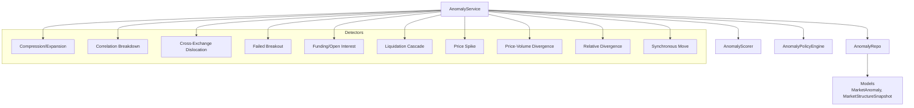

**Diagram sources**
- [src/apps/anomalies/services/anomaly_service.py:44-78](file://src/apps/anomalies/services/anomaly_service.py#L44-L78)
- [src/apps/anomalies/scoring/anomaly_scorer.py:13-38](file://src/apps/anomalies/scoring/anomaly_scorer.py#L13-L38)
- [src/apps/anomalies/policies.py:24-83](file://src/apps/anomalies/policies.py#L24-L83)
- [src/apps/anomalies/models.py:15-121](file://src/apps/anomalies/models.py#L15-L121)

**Section sources**
- [src/apps/anomalies/detectors/__init__.py:1-28](file://src/apps/anomalies/detectors/__init__.py#L1-L28)
- [src/apps/anomalies/services/anomaly_service.py:44-78](file://src/apps/anomalies/services/anomaly_service.py#L44-L78)
- [src/apps/anomalies/models.py:15-121](file://src/apps/anomalies/models.py#L15-L121)

## Core Components
- Detectors: Individual anomaly detection algorithms, each returning a standardized finding with anomaly type, component scores, metrics, confidence, and optional confirmation requirements.
- AnomalyScorer: Aggregates component scores using detector-specific weights into a normalized anomaly score, severity banding, and adjusted confidence.
- AnomalyPolicyEngine: Applies thresholds and regime multipliers to decide whether to skip, keep, refresh, transition, or create anomalies; manages cooldown windows and confirmation gating.
- AnomalyService: Orchestrates detection passes (fast-path, sector synchrony, market structure), runs scoring and policy, persists anomalies, enriches payloads, and publishes alerts.
- Persistence Models: SQLAlchemy models for anomalies and venue-market structure snapshots used by detectors requiring multi-venue/multi-symbol context.

**Section sources**
- [src/apps/anomalies/scoring/anomaly_scorer.py:13-38](file://src/apps/anomalies/scoring/anomaly_scorer.py#L13-L38)
- [src/apps/anomalies/policies.py:24-83](file://src/apps/anomalies/policies.py#L24-L83)
- [src/apps/anomalies/services/anomaly_service.py:44-410](file://src/apps/anomalies/services/anomaly_service.py#L44-L410)
- [src/apps/anomalies/models.py:15-121](file://src/apps/anomalies/models.py#L15-L121)

## Architecture Overview
The system operates in three detection passes:
- Fast Path: Real-time detection on newly closed candles using price/volume/spike/volatility/breakout/divergence/relative divergence/compression/expansion detectors.
- Sector Scan: Detects synchronized moves across sector peers and optionally triggers market structure scans.
- Market Structure Scan: Uses venue snapshots to detect cross-exchange dislocations and derivatives anomalies.

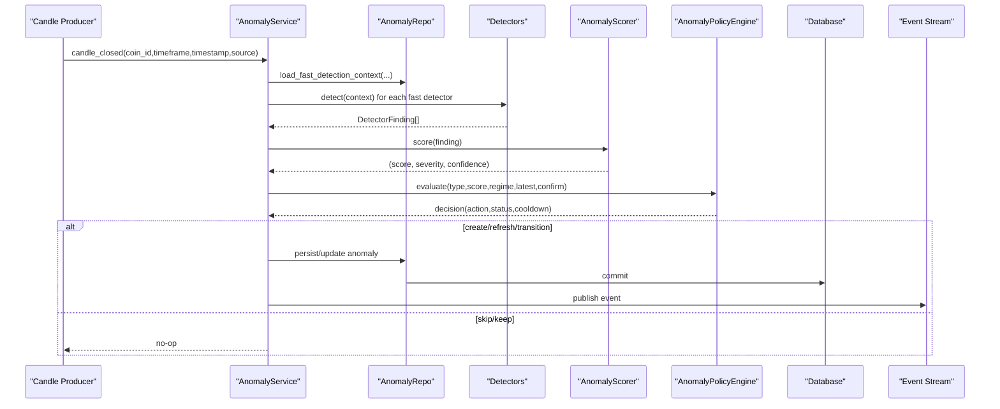

**Diagram sources**
- [src/apps/anomalies/services/anomaly_service.py:80-111](file://src/apps/anomalies/services/anomaly_service.py#L80-L111)
- [src/apps/anomalies/services/anomaly_service.py:243-340](file://src/apps/anomalies/services/anomaly_service.py#L243-L340)
- [src/apps/anomalies/scoring/anomaly_scorer.py:23-38](file://src/apps/anomalies/scoring/anomaly_scorer.py#L23-L38)
- [src/apps/anomalies/policies.py:39-83](file://src/apps/anomalies/policies.py#L39-L83)

## Detailed Component Analysis

### Compression/Expansion Detection
Measures volatility compression followed by an abrupt expansion, validating squeeze strength and price jump intensity. Returns component scores for volatility and price, plus confidence and metrics capturing compression ratio, squeeze percentile, range expansion, and realized jump ratio.

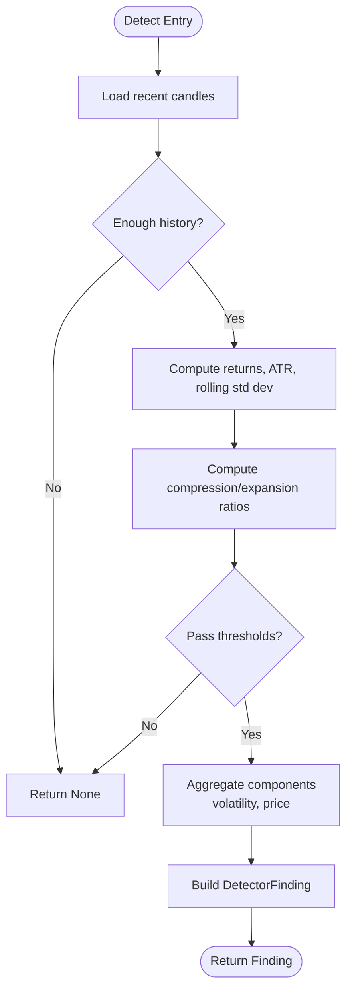

**Diagram sources**
- [src/apps/anomalies/detectors/compression_expansion_detector.py:72-135](file://src/apps/anomalies/detectors/compression_expansion_detector.py#L72-L135)

**Section sources**
- [src/apps/anomalies/detectors/compression_expansion_detector.py:67-135](file://src/apps/anomalies/detectors/compression_expansion_detector.py#L67-L135)

### Correlation Breakdown Detection
Identifies decoupling from benchmark via correlation drop, beta shift, residual variance expansion, and peer dispersion. Requires confirmation hits and marks isolation relative to peers and benchmark.

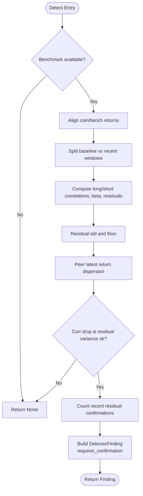

**Diagram sources**
- [src/apps/anomalies/detectors/correlation_breakdown_detector.py:75-182](file://src/apps/anomalies/detectors/correlation_breakdown_detector.py#L75-L182)

**Section sources**
- [src/apps/anomalies/detectors/correlation_breakdown_detector.py:70-182](file://src/apps/anomalies/detectors/correlation_breakdown_detector.py#L70-L182)

### Cross-Exchange Dislocation Detection
Aggregates venue snapshots by timestamp to compute venue spread percentage and basis dispersion, then evaluates z-scores and persistence duration to flag dislocations across multiple venues.

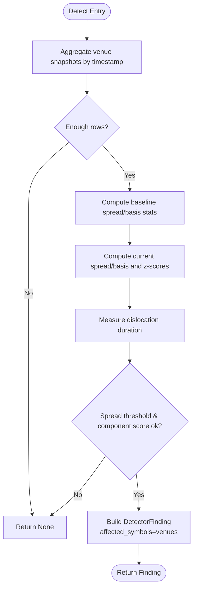

**Diagram sources**
- [src/apps/anomalies/detectors/cross_exchange_dislocation_detector.py:76-151](file://src/apps/anomalies/detectors/cross_exchange_dislocation_detector.py#L76-L151)

**Section sources**
- [src/apps/anomalies/detectors/cross_exchange_dislocation_detector.py:76-151](file://src/apps/anomalies/detectors/cross_exchange_dislocation_detector.py#L76-L151)

### Failed Breakout Detection
Captures breakouts that fail to sustain, measuring excursion beyond a recent range and rejection depth, while incorporating wick/body ratio and volume confirmation.

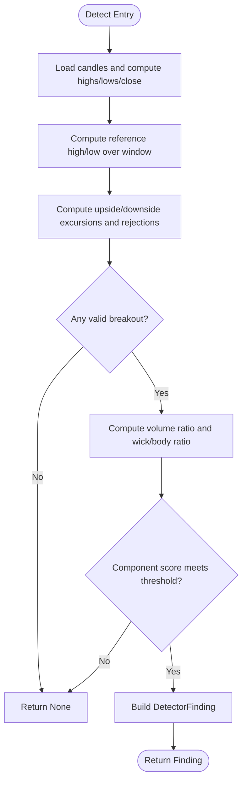

**Diagram sources**
- [src/apps/anomalies/detectors/failed_breakout_detector.py:38-123](file://src/apps/anomalies/detectors/failed_breakout_detector.py#L38-L123)

**Section sources**
- [src/apps/anomalies/detectors/failed_breakout_detector.py:33-123](file://src/apps/anomalies/detectors/failed_breakout_detector.py#L33-L123)

### Funding/Open Interest Analysis
Evaluates abnormal shifts in derivatives positioning via funding z-score, open interest expansion, basis divergence, and price impact adjusted by OI.

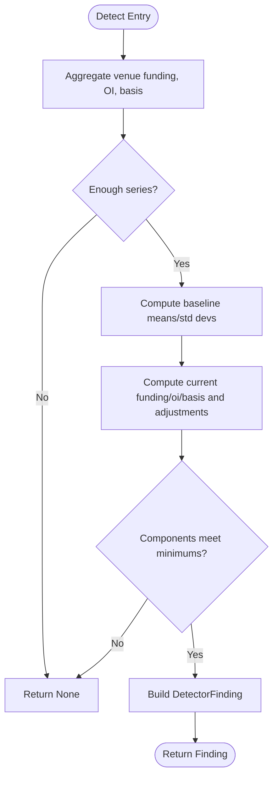

**Diagram sources**
- [src/apps/anomalies/detectors/funding_open_interest_detector.py:62-134](file://src/apps/anomalies/detectors/funding_open_interest_detector.py#L62-L134)

**Section sources**
- [src/apps/anomalies/detectors/funding_open_interest_detector.py:58-134](file://src/apps/anomalies/detectors/funding_open_interest_detector.py#L58-L134)

### Liquidation Cascade Detection
Flags forced unwinds across venues indicated by spikes in total liquidations, open interest drops, price impulse alignment with directional liquidations, and confirmation gating.

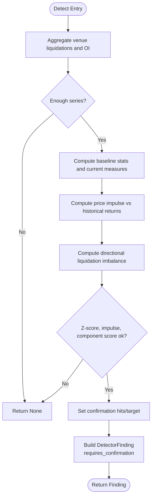

**Diagram sources**
- [src/apps/anomalies/detectors/liquidation_cascade_detector.py:60-140](file://src/apps/anomalies/detectors/liquidation_cascade_detector.py#L60-L140)

**Section sources**
- [src/apps/anomalies/detectors/liquidation_cascade_detector.py:56-140](file://src/apps/anomalies/detectors/liquidation_cascade_detector.py#L56-L140)

### Price Spike Detection
Scores abnormal price displacement using return z-score, percentile rank, candle range z-score, and ATR ratio against rolling baselines.

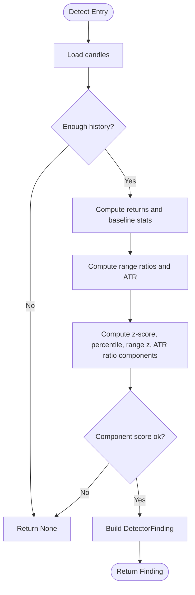

**Diagram sources**
- [src/apps/anomalies/detectors/price_spike_detector.py:74-138](file://src/apps/anomalies/detectors/price_spike_detector.py#L74-L138)

**Section sources**
- [src/apps/anomalies/detectors/price_spike_detector.py:70-138](file://src/apps/anomalies/detectors/price_spike_detector.py#L70-L138)

### Price-Volume Divergence Detection
Identifies situations where price moves strongly without volume participation (or vice versa), computing z-scores and ratios to quantify divergence modes.

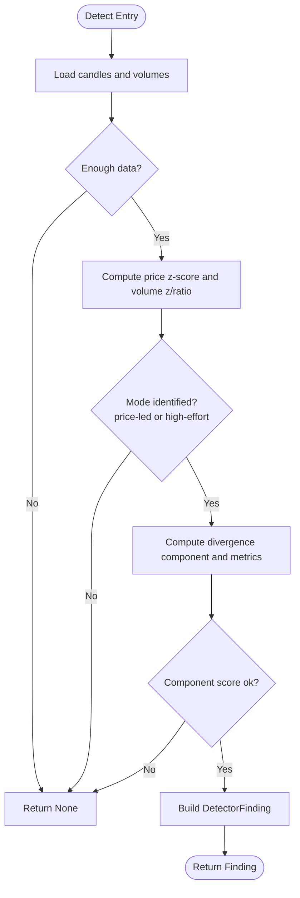

**Diagram sources**
- [src/apps/anomalies/detectors/price_volume_divergence_detector.py:45-131](file://src/apps/anomalies/detectors/price_volume_divergence_detector.py#L45-L131)

**Section sources**
- [src/apps/anomalies/detectors/price_volume_divergence_detector.py:41-131](file://src/apps/anomalies/detectors/price_volume_divergence_detector.py#L41-L131)

### Relative Divergence Detection
Computes beta-adjusted residuals relative to a benchmark and peers, scoring residual deviation, sector gap, and related gap, with confirmation gating and isolation determination.

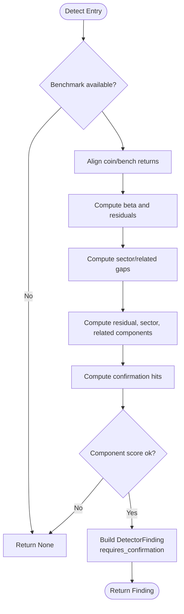

**Diagram sources**
- [src/apps/anomalies/detectors/relative_divergence_detector.py:59-147](file://src/apps/anomalies/detectors/relative_divergence_detector.py#L59-L147)

**Section sources**
- [src/apps/anomalies/detectors/relative_divergence_detector.py:55-147](file://src/apps/anomalies/detectors/relative_divergence_detector.py#L55-L147)

### Synchronous Move Detection
Scans sector peers for simultaneous abnormal returns, measuring breadth, intensity, and alignment to detect coordinated sector moves.

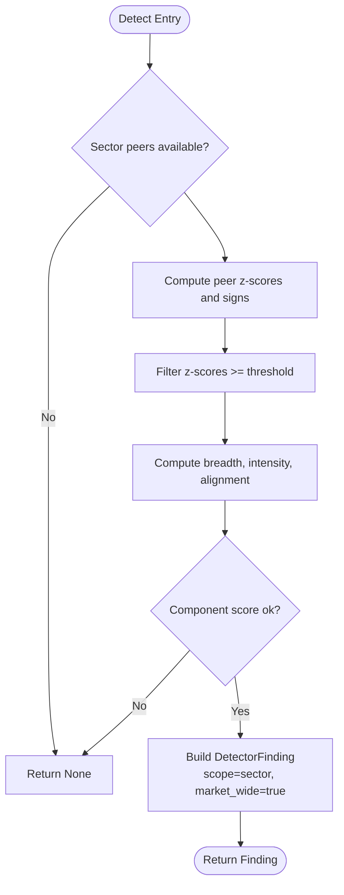

**Diagram sources**
- [src/apps/anomalies/detectors/synchronous_move_detector.py:44-121](file://src/apps/anomalies/detectors/synchronous_move_detector.py#L44-L121)

**Section sources**
- [src/apps/anomalies/detectors/synchronous_move_detector.py:40-121](file://src/apps/anomalies/detectors/synchronous_move_detector.py#L40-L121)

### Anomaly Scoring Methodology
The scorer computes a weighted average of active detector components, clamps to [0,1], and derives severity from predefined bands. Confidence is a mixture of weighted score and raw finding confidence, with small reductions for non-isolated anomalies.

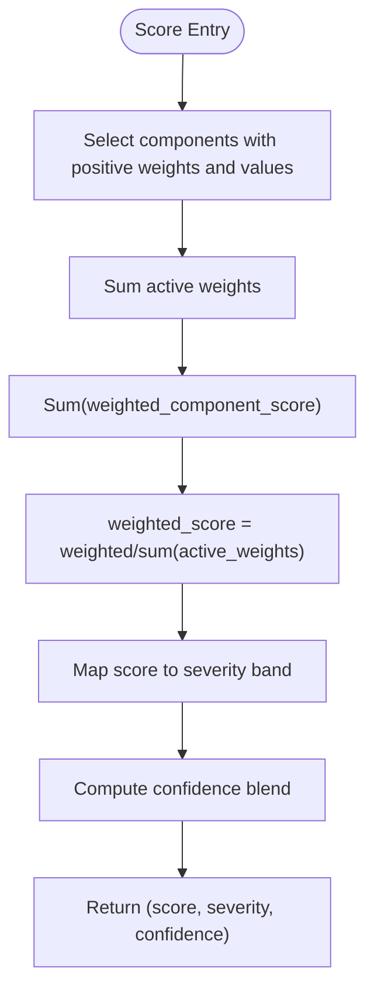

**Diagram sources**
- [src/apps/anomalies/scoring/anomaly_scorer.py:23-38](file://src/apps/anomalies/scoring/anomaly_scorer.py#L23-L38)

**Section sources**
- [src/apps/anomalies/scoring/anomaly_scorer.py:13-38](file://src/apps/anomalies/scoring/anomaly_scorer.py#L13-L38)

### Severity Classification
Severity bands map numeric anomaly scores to discrete categories. The scorer iterates through bands and assigns the lowest band meeting the score threshold.

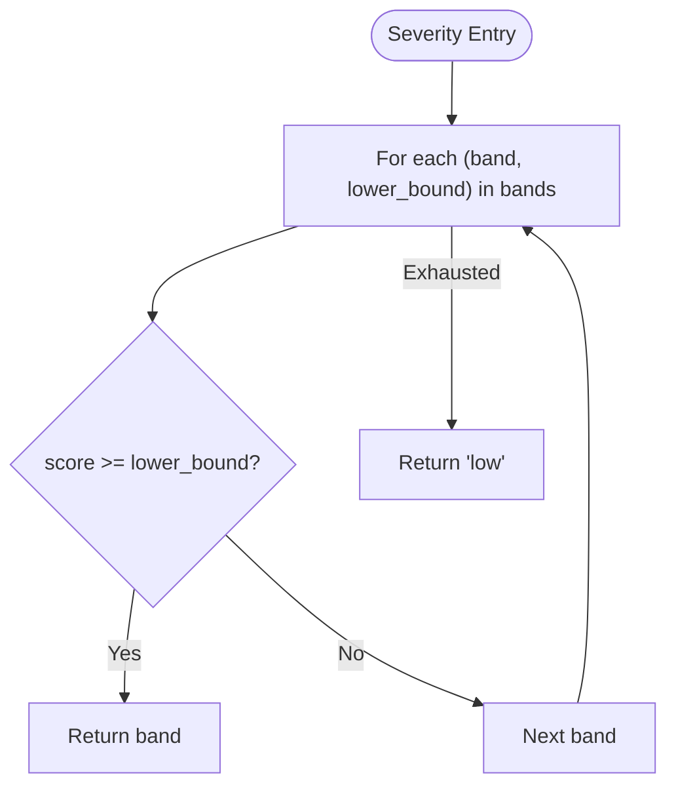

**Diagram sources**
- [src/apps/anomalies/scoring/anomaly_scorer.py:17-21](file://src/apps/anomalies/scoring/anomaly_scorer.py#L17-L21)

**Section sources**
- [src/apps/anomalies/scoring/anomaly_scorer.py:17-21](file://src/apps/anomalies/scoring/anomaly_scorer.py#L17-L21)

### Alert Generation Workflow
On successful creation or refresh/transition, the service builds an AnomalyDraft, persists it, updates payload_json with enriched context/explainability, and publishes an event to the stream. Commit occurs only when changes are made.

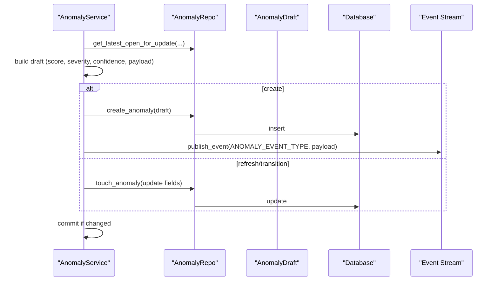

**Diagram sources**
- [src/apps/anomalies/services/anomaly_service.py:243-340](file://src/apps/anomalies/services/anomaly_service.py#L243-L340)

**Section sources**
- [src/apps/anomalies/services/anomaly_service.py:243-340](file://src/apps/anomalies/services/anomaly_service.py#L243-L340)

### Policy-Based Filtering
The policy engine defines entry/exit thresholds per anomaly type, adjusted by market regime multipliers, enforces confirmation targets, and manages cooldown windows. Decisions include skip, keep, refresh, transition, or create.

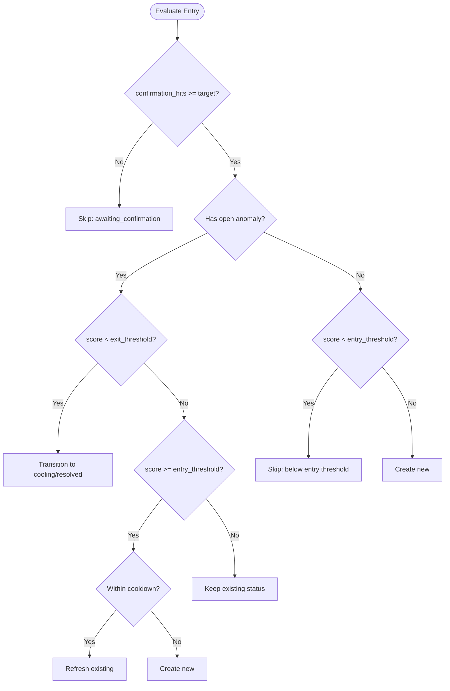

**Diagram sources**
- [src/apps/anomalies/policies.py:39-83](file://src/apps/anomalies/policies.py#L39-L83)

**Section sources**
- [src/apps/anomalies/policies.py:24-83](file://src/apps/anomalies/policies.py#L24-L83)

### Real-Time Monitoring and Historical Analysis
- Real-time: Fast-path detection on candle_closed events, with sector and market structure scans triggered by downstream logic.
- Historical: Persistence enables backtesting and analysis of past anomalies; sector synchronicity and market structure scans operate over configurable lookbacks.

**Section sources**
- [src/apps/anomalies/services/anomaly_service.py:80-191](file://src/apps/anomalies/services/anomaly_service.py#L80-L191)
- [src/apps/anomalies/models.py:15-62](file://src/apps/anomalies/models.py#L15-L62)

### Anomaly Enrichment
Enrichment augments anomaly payloads with portfolio relevance, market scope (isolated vs market-wide), and explainability metadata, then persists the updated payload.

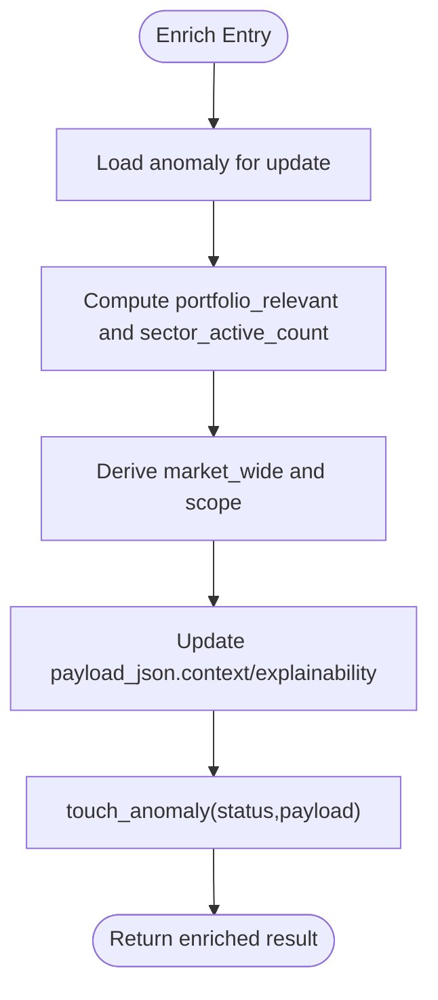

**Diagram sources**
- [src/apps/anomalies/services/anomaly_service.py:193-241](file://src/apps/anomalies/services/anomaly_service.py#L193-L241)

**Section sources**
- [src/apps/anomalies/services/anomaly_service.py:193-241](file://src/apps/anomalies/services/anomaly_service.py#L193-L241)

## Dependency Analysis
The system exhibits clear layering:
- Detectors depend on shared schemas and constants.
- Service composes detectors, scorer, and policy engine.
- Persistence models underpin repository operations used by the service.
- Event publishing is decoupled from service I/O via a stream abstraction.

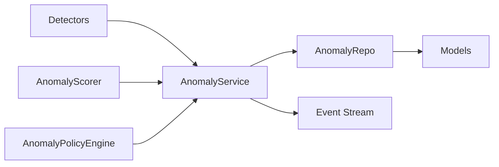

**Diagram sources**
- [src/apps/anomalies/services/anomaly_service.py:21-41](file://src/apps/anomalies/services/anomaly_service.py#L21-L41)
- [src/apps/anomalies/models.py:15-62](file://src/apps/anomalies/models.py#L15-L62)

**Section sources**
- [src/apps/anomalies/services/anomaly_service.py:21-41](file://src/apps/anomalies/services/anomaly_service.py#L21-L41)
- [src/apps/anomalies/models.py:15-62](file://src/apps/anomalies/models.py#L15-L62)

## Performance Considerations
- Window sizing: Detectors specify minimal lookback windows; ensure adequate history availability to avoid frequent early exits.
- Rolling computations: Standard deviations and percentiles are computed per window; consider caching or streaming rolling aggregates if latency becomes a concern.
- Confirmation gating: Some detectors require confirmation hits; tune thresholds and targets to balance sensitivity and false positives.
- Streaming I/O: Event publishing uses a synchronous enqueue API backed by a dedicated thread; service remains non-blocking for the event loop.

## Troubleshooting Guide
- No anomalies created:
  - Verify detection context availability and sufficient lookback windows.
  - Check policy thresholds and market regime multipliers.
  - Confirm detector-specific thresholds are met.
- Excessive cooldown:
  - Review cooldown minutes per anomaly type and recent anomaly timing.
- Insufficient sector or venue data:
  - Ensure sector peer lists and venue snapshots are populated for relevant scans.
- Payload enrichment missing context:
  - Confirm sector anomaly counts and portfolio positions are available.

**Section sources**
- [src/apps/anomalies/services/anomaly_service.py:80-191](file://src/apps/anomalies/services/anomaly_service.py#L80-L191)
- [src/apps/anomalies/policies.py:36-37](file://src/apps/anomalies/policies.py#L36-L37)

## Conclusion
The anomaly detection system combines modular detectors, robust scoring, and policy-driven lifecycle management to deliver timely, interpretable alerts. Its layered design supports real-time monitoring, historical analysis, and enrichment for actionable insights across price, volume, volatility, correlation, derivatives, venue, and sector dynamics.

## Appendices
- Data Models: MarketAnomaly and MarketStructureSnapshot define persistence for anomalies and venue-market structure snapshots.
- Constants and Schemas: Shared anomaly types, severity bands, thresholds, and detection context structures are referenced by detectors and service.

**Section sources**
- [src/apps/anomalies/models.py:15-121](file://src/apps/anomalies/models.py#L15-L121)