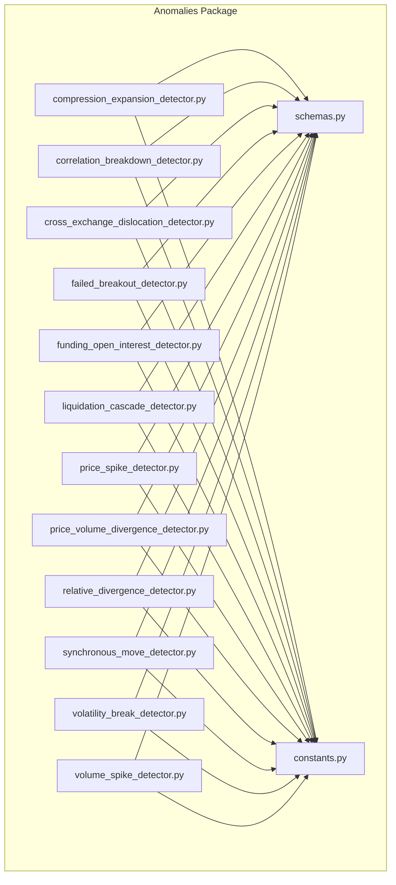
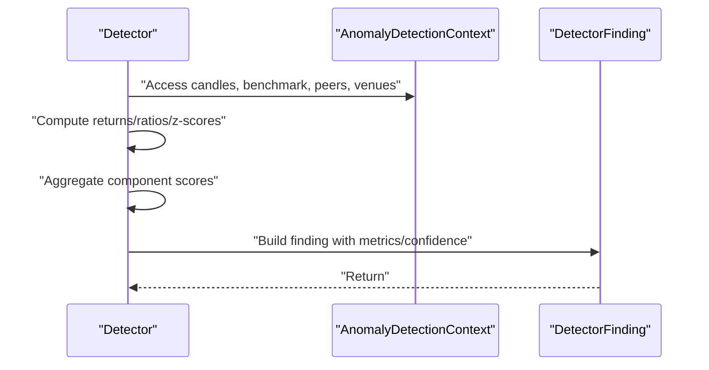
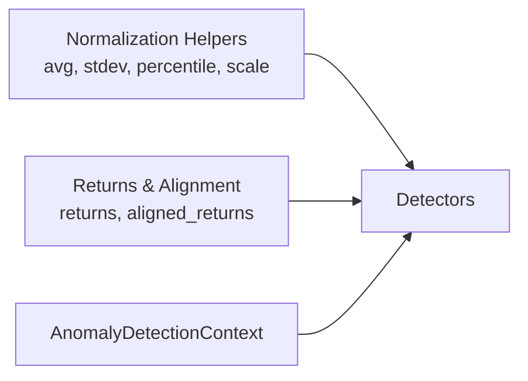

# Anomaly Detectors

<cite>
**Referenced Files in This Document**
- [compression_expansion_detector.py](file://src/apps/anomalies/detectors/compression_expansion_detector.py)
- [correlation_breakdown_detector.py](file://src/apps/anomalies/detectors/correlation_breakdown_detector.py)
- [cross_exchange_dislocation_detector.py](file://src/apps/anomalies/detectors/cross_exchange_dislocation_detector.py)
- [failed_breakout_detector.py](file://src/apps/anomalies/detectors/failed_breakout_detector.py)
- [funding_open_interest_detector.py](file://src/apps/anomalies/detectors/funding_open_interest_detector.py)
- [liquidation_cascade_detector.py](file://src/apps/anomalies/detectors/liquidation_cascade_detector.py)
- [price_spike_detector.py](file://src/apps/anomalies/detectors/price_spike_detector.py)
- [price_volume_divergence_detector.py](file://src/apps/anomalies/detectors/price_volume_divergence_detector.py)
- [relative_divergence_detector.py](file://src/apps/anomalies/detectors/relative_divergence_detector.py)
- [synchronous_move_detector.py](file://src/apps/anomalies/detectors/synchronous_move_detector.py)
- [volatility_break_detector.py](file://src/apps/anomalies/detectors/volatility_break_detector.py)
- [volume_spike_detector.py](file://src/apps/anomalies/detectors/volume_spike_detector.py)
- [constants.py](file://src/apps/anomalies/constants.py)
- [schemas.py](file://src/apps/anomalies/schemas.py)
</cite>

## Table of Contents
1. [Introduction](#introduction)
2. [Project Structure](#project-structure)
3. [Core Components](#core-components)
4. [Architecture Overview](#architecture-overview)
5. [Detailed Component Analysis](#detailed-component-analysis)
6. [Dependency Analysis](#dependency-analysis)
7. [Performance Considerations](#performance-considerations)
8. [Troubleshooting Guide](#troubleshooting-guide)
9. [Conclusion](#conclusion)

## Introduction
This document explains the anomaly detection subsystem and its 12 anomaly detection algorithms. Each detector implements a focused statistical or comparative logic to surface unusual price, volume, volatility, correlation, derivatives, and cross-exchange conditions. The detectors operate over standardized windows, compute normalized scores, and produce a structured finding with confidence, metrics, and explainability metadata. Thresholds and scoring weights are centrally defined to support consistent detection and post-processing.

## Project Structure
The anomaly detection module organizes detectors under a single package, each implementing a detect method that consumes a shared detection context and emits a standardized finding. Supporting constants define anomaly types, thresholds, and scoring weights. The schemas define the input context and output finding structures.

**Diagram sources**
- [compression_expansion_detector.py:67-135](file://src/apps/anomalies/detectors/compression_expansion_detector.py#L67-L135)
- [correlation_breakdown_detector.py:70-182](file://src/apps/anomalies/detectors/correlation_breakdown_detector.py#L70-L182)
- [cross_exchange_dislocation_detector.py:76-151](file://src/apps/anomalies/detectors/cross_exchange_dislocation_detector.py#L76-L151)
- [failed_breakout_detector.py:33-123](file://src/apps/anomalies/detectors/failed_breakout_detector.py#L33-L123)
- [funding_open_interest_detector.py:58-134](file://src/apps/anomalies/detectors/funding_open_interest_detector.py#L58-L134)
- [liquidation_cascade_detector.py:56-140](file://src/apps/anomalies/detectors/liquidation_cascade_detector.py#L56-L140)
- [price_spike_detector.py:70-138](file://src/apps/anomalies/detectors/price_spike_detector.py#L70-L138)
- [price_volume_divergence_detector.py:41-131](file://src/apps/anomalies/detectors/price_volume_divergence_detector.py#L41-L131)
- [relative_divergence_detector.py:55-147](file://src/apps/anomalies/detectors/relative_divergence_detector.py#L55-L147)
- [synchronous_move_detector.py:40-121](file://src/apps/anomalies/detectors/synchronous_move_detector.py#L40-L121)
- [volatility_break_detector.py:54-113](file://src/apps/anomalies/detectors/volatility_break_detector.py#L54-L113)
- [volume_spike_detector.py:39-84](file://src/apps/anomalies/detectors/volume_spike_detector.py#L39-L84)
- [constants.py:1-113](file://src/apps/anomalies/constants.py#L1-L113)
- [schemas.py:49-96](file://src/apps/anomalies/schemas.py#L49-L96)

**Section sources**
- [constants.py:1-113](file://src/apps/anomalies/constants.py#L1-L113)
- [schemas.py:49-96](file://src/apps/anomalies/schemas.py#L49-L96)

## Core Components
- Detection context: Provides candles, optional benchmark series, sector/related peers, and venue snapshots. It also exposes helpers for latest/previous candle timestamps and window bounds.
- DetectorFinding: Standardized output carrying anomaly type, summary, component scores, metrics, confidence, and explainability metadata. Optional fields support confirmation gating and scoping.
- Constants: Centralized anomaly types, thresholds, cooldowns, and detector weights.

Key roles:
- Context normalization: Detectors receive aligned time series and prune insufficient samples early.
- Statistical normalization: Z-scores, percentiles, and rolling windows normalize inputs to comparable scales.
- Weighted aggregation: Component scores are combined into composite confidence and severity bands.
- Threshold gating: Composite scores are compared against entry/exit thresholds to decide detection.

**Section sources**
- [schemas.py:49-96](file://src/apps/anomalies/schemas.py#L49-L96)
- [constants.py:44-113](file://src/apps/anomalies/constants.py#L44-L113)

## Architecture Overview
Detectors consume a unified context and return a standardized finding. Some detectors rely on peer groups or venue snapshots to assess relative or cross-market conditions. Confidence and severity are derived from component scores and thresholds.

**Diagram sources**
- [schemas.py:49-96](file://src/apps/anomalies/schemas.py#L49-L96)
- [price_spike_detector.py:74-138](file://src/apps/anomalies/detectors/price_spike_detector.py#L74-L138)

## Detailed Component Analysis

### Compression/Expansion Detection
Purpose: Detect transition from volatility compression to expansion, signaling potential regime change.

Detection logic:
- Compute rolling standard deviation over a compression window and compare to earlier baseline.
- Track average true range (ATR) over recent and baseline periods.
- Measure realized return relative to recent volatility.
- Combine components with scaling and weighted sum; require minimum thresholds.

Mathematical foundations:
- Returns computed from consecutive close-to-close changes.
- Volatility measured via standard deviation; ATR via high/low/close comparisons.
- Percentile ranking ranks recent volatility against rolling distribution.

Thresholds and time windows:
- Lookback and compression window are bounded; detector enforces minimum lengths.
- Composite score thresholds gate detection; individual components scaled to [0,1].

Practical implementation:
- Uses rolling standard deviation and percentile rank helpers.
- Confidence combines composite score with a component weighting.

**Section sources**
- [compression_expansion_detector.py:67-135](file://src/apps/anomalies/detectors/compression_expansion_detector.py#L67-L135)

### Correlation Breakdown Detection
Purpose: Identify decoupling from benchmark and expanding idiosyncratic variance.

Detection logic:
- Align coin and benchmark returns; require sufficient history.
- Compute long- and short-term correlations; drop indicates structural change.
- Estimate beta; measure residual standard deviation and compare to floor.
- Gauge dispersion vs peers; confirm with recent residual magnitudes.

Mathematical foundations:
- Correlation and covariance computed from aligned returns.
- Beta estimated via covariance over benchmark variance.
- Residuals computed under long-run beta; recent residual std dev compared to floor.

Thresholds and time windows:
- Requires positive baseline correlation; enforces minimum lookback sizes.
- Composite score and residual variance ratio thresholds apply.

Practical implementation:
- Includes confirmation hits based on residual magnitude checks.
- Explainability highlights benchmark and peer-relative context.

**Section sources**
- [correlation_breakdown_detector.py:70-182](file://src/apps/anomalies/detectors/correlation_breakdown_detector.py#L70-L182)

### Cross-Exchange Dislocation Detection
Purpose: Spot persistent pricing inconsistencies across venues.

Detection logic:
- Aggregate venue snapshots per timestamp; compute venue spread percentage and basis dispersion.
- Compare current spread/basis to rolling means/stds; track duration above threshold.
- Score liquidity, relative spread, basis dispersion, and persistence.

Mathematical foundations:
- Median price used to compute spread percentage; basis dispersion across venues.
- Z-scores computed against rolling mean and std; duration counted for persistence.

Thresholds and time windows:
- Minimum snapshots required; enforce minimum spread magnitude.
- Composite score thresholds and persistence duration influence detection.

Practical implementation:
- Isolation flag considers number of affected venues.
- Metrics include z-scores, spreads, and duration.

**Section sources**
- [cross_exchange_dislocation_detector.py:76-151](file://src/apps/anomalies/detectors/cross_exchange_dislocation_detector.py#L76-L151)

### Failed Breakout Detection
Purpose: Flag breakouts that fail to sustain after close.

Detection logic:
- Define breakout window; compute excursion above/below reference high/low.
- Require rejection depth and rejection against reference level.
- Incorporate volume ratio and wick-to-body ratio for confirmation.

Mathematical foundations:
- Wick/body ratio computed using open/close/ high/low.
- Volume comparison to rolling average.

Thresholds and time windows:
- Enforce minimum lookback and breakout window sizes.
- Composite price component score gates detection.

Practical implementation:
- Direction-specific rejection depth and reference level selection.
- Metrics include breakout excursion, rejection depth, and volume ratio.

**Section sources**
- [failed_breakout_detector.py:33-123](file://src/apps/anomalies/detectors/failed_breakout_detector.py#L33-L123)

### Funding/Open Interest Analysis (Perpetual Futures)
Purpose: Detect abnormal derivatives positioning via funding, open interest, and basis.

Detection logic:
- Aggregate funding rates, open interest, and basis across venues per timestamp.
- Compute z-scores for funding and basis; ratio of current OI to recent average.
- Adjust move strength by OI; combine components into derivatives score.

Mathematical foundations:
- Z-scores computed against rolling means/stds.
- OI ratio and adjusted move incorporate price return.

Thresholds and time windows:
- Require sufficient series length; enforce minimum component scores.
- Composite score thresholds apply.

Practical implementation:
- Metrics include funding z-score, OI ratio, basis z-score, and adjusted move.
- Explainability ties to leveraged positioning shifts.

**Section sources**
- [funding_open_interest_detector.py:58-134](file://src/apps/anomalies/detectors/funding_open_interest_detector.py#L58-L134)

### Liquidation Cascade Detection
Purpose: Identify forced unwinding across venues with directional alignment.

Detection logic:
- Aggregate venue liquidations (longs/shorts) and open interest.
- Compute z-score for total liquidations; measure OI drop after large move.
- Compute price impulse relative to historical return std; check directional alignment.
- Combine liquidity, derivatives impact, volatility, and alignment into cascade score.

Mathematical foundations:
- Z-scores for liquidations and price impulse.
- Imbalance ratio measures directional concentration of liquidations.

Thresholds and time windows:
- Enforce minimum series length and non-zero totals.
- Composite score and thresholds for confirmation.

Practical implementation:
- Confirmation hits depend on z-score magnitude.
- Explainability emphasizes forced unwinds and alignment.

**Section sources**
- [liquidation_cascade_detector.py:56-140](file://src/apps/anomalies/detectors/liquidation_cascade_detector.py#L56-L140)

### Price Spike Detection
Purpose: Detect abnormal price displacement versus rolling return and range history.

Detection logic:
- Compute return z-score and percentile rank against baseline returns.
- Evaluate range z-score and ATR ratio relative to recent baseline.
- Weighted combination produces price component; direction indicated by return sign.

Mathematical foundations:
- Returns and range ratios computed from OHLC.
- Z-scores and percentile ranks normalize recent observations.

Thresholds and time windows:
- Enforce minimum lookback; composite score thresholds apply.

Practical implementation:
- Metrics include return z-score, move percentile, ATR ratio, and return by timeframe.
- Explainability compares to rolling price history.

**Section sources**
- [price_spike_detector.py:70-138](file://src/apps/anomalies/detectors/price_spike_detector.py#L70-L138)

### Price-Volume Divergence Detection
Purpose: Identify accumulation/distribution phases via divergent price/volume behavior.

Detection logic:
- Compute price z-score and activation; compute volume z-score and median ratio.
- Mode classification: price-led without participation, or high-effort low-result.
- Imbalance, quiet side, and activation drive divergence component.

Mathematical foundations:
- Z-scores and median-based ratio quantify deviations.
- Activation captures strength of departure from baseline.

Thresholds and time windows:
- Enforce minimum lookback for both price and volume.
- Composite score thresholds gate detection.

Practical implementation:
- Metrics include price return z-score, volume z-score, and ratios.
- Explainability distinguishes between modes.

**Section sources**
- [price_volume_divergence_detector.py:41-131](file://src/apps/anomalies/detectors/price_volume_divergence_detector.py#L41-L131)

### Relative Divergence Detection
Purpose: Detect out-/under-performance relative to benchmark and peers on a beta-adjusted basis.

Detection logic:
- Align coin and benchmark returns; estimate beta; compute residual returns.
- Compute residual z-score; evaluate sector and related gaps relative to peers.
- Confirm consistency of residual signs over recent periods.

Mathematical foundations:
- Beta via covariance over benchmark variance.
- Residuals subtract systematic component; z-score against rolling distribution.

Thresholds and time windows:
- Enforce minimum aligned returns.
- Composite score and confirmation hits apply.

Practical implementation:
- Explainability indicates outperform/underperform and market-wide scope.
- Isolation flag compares sector gap to benchmark movement.

**Section sources**
- [relative_divergence_detector.py:55-147](file://src/apps/anomalies/detectors/relative_divergence_detector.py#L55-L147)

### Synchronous Move Detection
Purpose: Capture coordinated cross-asset moves across a sector.

Detection logic:
- For each peer, compute z-score of latest return vs rolling mean/std.
- Count peers exceeding threshold; compute breadth, intensity, and alignment.
- Combine breadth, intensity, and alignment into synchronicity component.

Mathematical foundations:
- Z-scores computed per peer; alignment ratio aggregates directional signs.
- Breadth equals fraction of movers among peers.

Thresholds and time windows:
- Requires non-empty peer set and sufficient lookback.
- Scope marked as sector-wide; metrics include mover counts and alignment.

Practical implementation:
- Metrics include simultaneous z-score count, breadth, and alignment.
- Explainability emphasizes coordinated cluster behavior.

**Section sources**
- [synchronous_move_detector.py:40-121](file://src/apps/anomalies/detectors/synchronous_move_detector.py#L40-L121)

### Volatility Regime Break Detection
Purpose: Identify transition into materially higher volatility regime.

Detection logic:
- Compare short-window realized volatility to long-window volatility.
- Evaluate ATR expansion and realized return relative to long-window volatility.
- Weighted combination produces volatility component; confirmation via recent large moves.

Mathematical foundations:
- Realized volatility via standard deviation of returns.
- ATR computed from high/low/close sequences.

Thresholds and time windows:
- Enforce minimum windows for short and long volatility.
- Composite score and confirmation hits gate detection.

Practical implementation:
- Metrics include rolling volatility ratio, ATR expansion, and realized ratio.
- Explainability frames transition into higher variance state.

**Section sources**
- [volatility_break_detector.py:54-113](file://src/apps/anomalies/detectors/volatility_break_detector.py#L54-L113)

### Volume Spike Detection
Purpose: Detect abnormal trading participation versus rolling volume baseline.

Detection logic:
- Compute volume z-score, median ratio, and percentile rank against baseline.
- Weighted combination produces volume component.

Mathematical foundations:
- Z-score and median ratio normalize recent volume against rolling distribution.
- Percentile rank quantifies extremity.

Thresholds and time windows:
- Enforce minimum lookback for volume series.
- Composite score thresholds apply.

Practical implementation:
- Metrics include z-score, ratio, and percentile.
- Explainability compares to rolling volume history.

**Section sources**
- [volume_spike_detector.py:39-84](file://src/apps/anomalies/detectors/volume_spike_detector.py#L39-L84)

## Dependency Analysis
Detectors share common building blocks:
- Normalization helpers: averaging, standard deviation, percentile rank, scaling to [0,1].
- Time-series utilities: returns computation, aligned returns across series.
- Context consumption: candles, benchmark, peers, venue snapshots.

**Diagram sources**
- [price_spike_detector.py:14-68](file://src/apps/anomalies/detectors/price_spike_detector.py#L14-L68)
- [correlation_breakdown_detector.py:14-68](file://src/apps/anomalies/detectors/correlation_breakdown_detector.py#L14-L68)
- [schemas.py:49-96](file://src/apps/anomalies/schemas.py#L49-L96)

**Section sources**
- [price_spike_detector.py:14-68](file://src/apps/anomalies/detectors/price_spike_detector.py#L14-L68)
- [correlation_breakdown_detector.py:14-68](file://src/apps/anomalies/detectors/correlation_breakdown_detector.py#L14-L68)
- [schemas.py:49-96](file://src/apps/anomalies/schemas.py#L49-L96)

## Performance Considerations
- Window sizing: Detectors bound lookbacks and window sizes to avoid excessive recomputation while ensuring statistical validity.
- Rolling computations: Prefer vectorized or incremental updates where feasible; current implementations recompute rolling stats per call.
- Early pruning: Many detectors return None when insufficient data exists, reducing downstream processing.
- Aggregation across venues/peers: Sorting and filtering (e.g., movers) are linear in peer count; keep peer sets bounded.

## Troubleshooting Guide
Common issues and remedies:
- Insufficient data: Detectors commonly check minimum lengths for returns/volumes/series and return None if constraints are not met.
- Zero or near-zero denominators: Scaling and z-score computations guard against division by zero using small epsilons or explicit checks.
- Non-aligned series: Detectors align multi-series returns by taking the minimum length tail, preventing index mismatches.
- Confirmation gating: Some detectors require confirmation hits; ensure downstream logic respects requires_confirmation and thresholds.

Operational thresholds:
- Entry and exit thresholds are defined centrally and applied consistently across detectors.
- Cooldowns prevent repeated detections for the same anomaly type within a time window.

**Section sources**
- [constants.py:54-97](file://src/apps/anomalies/constants.py#L54-L97)
- [price_spike_detector.py:74-138](file://src/apps/anomalies/detectors/price_spike_detector.py#L74-L138)
- [volatility_break_detector.py:58-113](file://src/apps/anomalies/detectors/volatility_break_detector.py#L58-L113)

## Conclusion
The anomaly detection subsystem applies robust, standardized statistical methods to surface market regime transitions, fragmentation, arbitrage opportunities, trend reversals, derivatives shifts, margin pressure, volatility spikes, supply-demand imbalances, momentum changes, coordinated moves, volatility regime shifts, and liquidity surges. Detectors are designed for clarity, threshold-driven gating, and explainability, enabling reliable operational use.