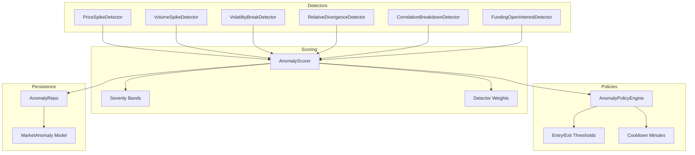
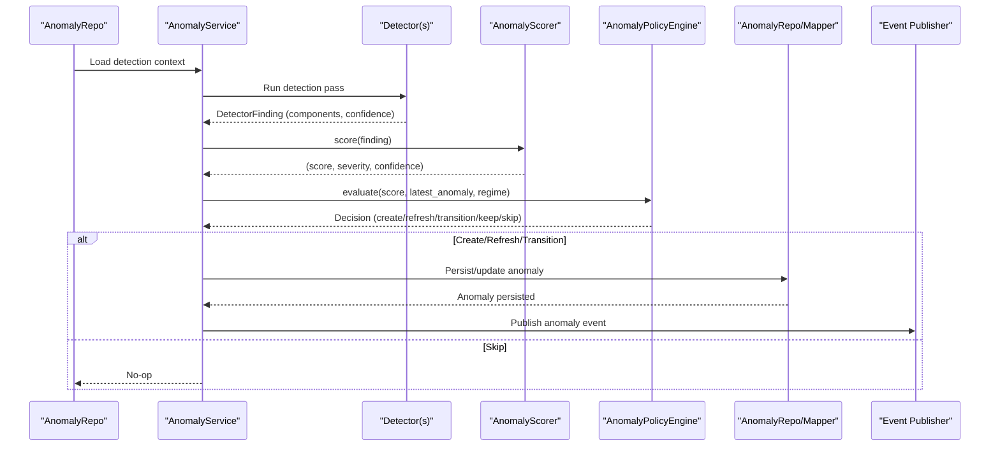
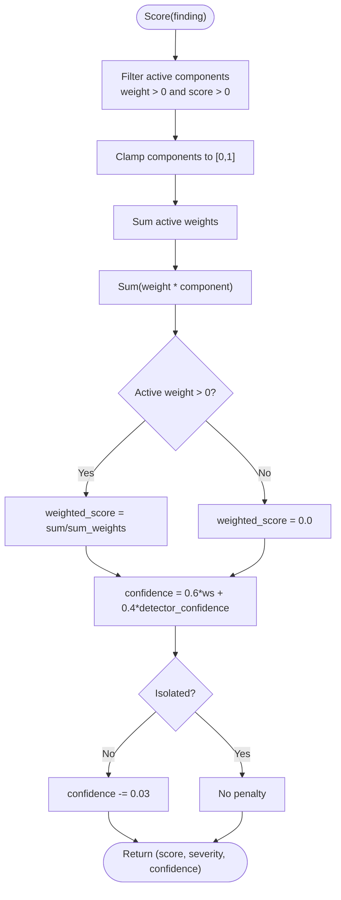
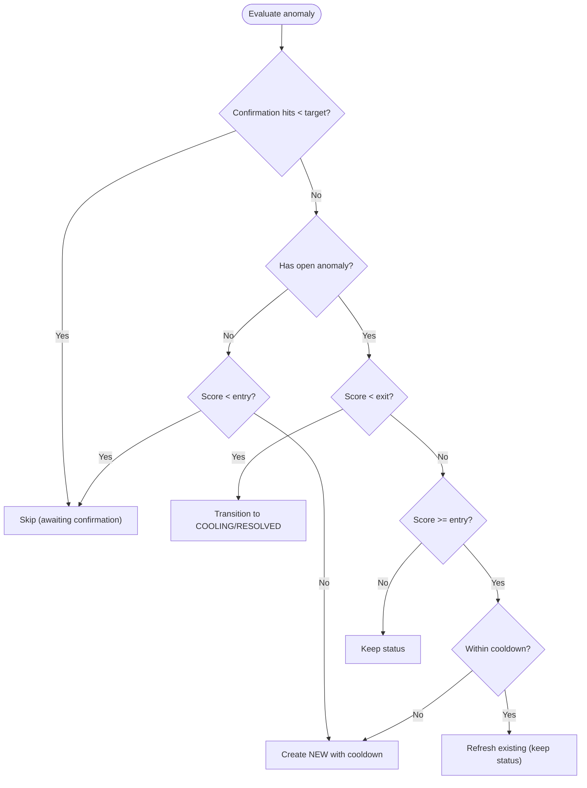
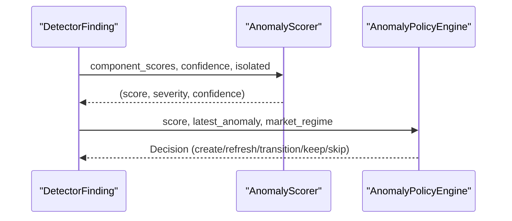
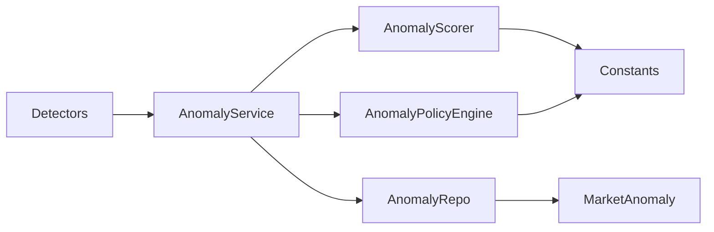

# Anomaly Scoring & Classification

<cite>
**Referenced Files in This Document**
- [anomaly_scorer.py](file://src/apps/anomalies/scoring/anomaly_scorer.py)
- [constants.py](file://src/apps/anomalies/constants.py)
- [schemas.py](file://src/apps/anomalies/schemas.py)
- [models.py](file://src/apps/anomalies/models.py)
- [policies.py](file://src/apps/anomalies/policies.py)
- [anomaly_service.py](file://src/apps/anomalies/services/anomaly_service.py)
- [anomaly_repo.py](file://src/apps/anomalies/repos/anomaly_repo.py)
- [price_spike_detector.py](file://src/apps/anomalies/detectors/price_spike_detector.py)
- [volume_spike_detector.py](file://src/apps/anomalies/detectors/volume_spike_detector.py)
- [volatility_break_detector.py](file://src/apps/anomalies/detectors/volatility_break_detector.py)
- [relative_divergence_detector.py](file://src/apps/anomalies/detectors/relative_divergence_detector.py)
- [correlation_breakdown_detector.py](file://src/apps/anomalies/detectors/correlation_breakdown_detector.py)
- [funding_open_interest_detector.py](file://src/apps/anomalies/detectors/funding_open_interest_detector.py)
- [test_detectors_and_scoring.py](file://tests/apps/anomalies/test_detectors_and_scoring.py)
</cite>

## Table of Contents
1. [Introduction](#introduction)
2. [Project Structure](#project-structure)
3. [Core Components](#core-components)
4. [Architecture Overview](#architecture-overview)
5. [Detailed Component Analysis](#detailed-component-analysis)
6. [Dependency Analysis](#dependency-analysis)
7. [Performance Considerations](#performance-considerations)
8. [Troubleshooting Guide](#troubleshooting-guide)
9. [Conclusion](#conclusion)

## Introduction
This document explains the anomaly scoring and classification system used to combine multiple anomaly factors into severity ratings, confidence calculations, and risk assessment models. It covers:
- How anomaly scores are computed from raw detection signals
- Weight assignment strategies and normalization techniques
- Severity classification thresholds (low, medium, high, critical)
- Confidence interval determination and temporal decay effects
- Threshold configurations for alerting and policy transitions
- Integration with the broader anomaly detection workflow

## Project Structure
The anomaly subsystem is organized around detectors, a scoring module, a policy engine, and persistence. The scoring and classification logic resides primarily in the scoring module and constants, while detectors produce normalized component scores and confidence estimates.

**Diagram sources**
- [anomaly_scorer.py:13-38](file://src/apps/anomalies/scoring/anomaly_scorer.py#L13-L38)
- [constants.py:44-112](file://src/apps/anomalies/constants.py#L44-L112)
- [policies.py:24-83](file://src/apps/anomalies/policies.py#L24-L83)
- [anomaly_repo.py:469-537](file://src/apps/anomalies/repos/anomaly_repo.py#L469-L537)
- [models.py:15-64](file://src/apps/anomalies/models.py#L15-L64)

**Section sources**
- [anomaly_service.py:44-79](file://src/apps/anomalies/services/anomaly_service.py#L44-L79)
- [anomaly_repo.py:27-272](file://src/apps/anomalies/repos/anomaly_repo.py#L27-L272)

## Core Components
- AnomalyScorer: Computes a weighted composite score from detector component scores, derives severity, and calculates confidence with adjustments.
- Constants: Define detector weights, severity bands, entry/exit thresholds, regime multipliers, and cooldown durations.
- Policies: Evaluate whether to create, refresh, transition, or keep anomalies based on thresholds and cooldown logic.
- Models: Persist anomaly records with severity, confidence, score, and metadata.
- Detectors: Produce normalized component scores and confidence per anomaly type.

Key scoring and classification elements:
- Weighted average score: Only active components (weight > 0 and score > 0) contribute; normalization clamps values to [0, 1].
- Severity mapping: Uses ordered severity bands to classify the weighted score.
- Confidence blending: Mixes the weighted score with detector confidence, with optional isolation penalty.

**Section sources**
- [anomaly_scorer.py:13-38](file://src/apps/anomalies/scoring/anomaly_scorer.py#L13-L38)
- [constants.py:44-112](file://src/apps/anomalies/constants.py#L44-L112)
- [policies.py:24-83](file://src/apps/anomalies/policies.py#L24-L83)
- [models.py:15-64](file://src/apps/anomalies/models.py#L15-L64)

## Architecture Overview
End-to-end flow from detection to persistence and alerting:

**Diagram sources**
- [anomaly_service.py:243-340](file://src/apps/anomalies/services/anomaly_service.py#L243-L340)
- [anomaly_repo.py:469-537](file://src/apps/anomalies/repos/anomaly_repo.py#L469-L537)
- [anomaly_scorer.py:23-38](file://src/apps/anomalies/scoring/anomaly_scorer.py#L23-L38)
- [policies.py:39-83](file://src/apps/anomalies/policies.py#L39-L83)

## Detailed Component Analysis

### AnomalyScorer: Weighted Score, Severity, and Confidence
- Active components: Filters out zero-weight or non-positive component scores; clamps all components to [0, 1].
- Weighted score: Normalized weighted average using only active components; zero-division fallback to 0.0.
- Severity: Ordered lookup against severity bands to assign low/medium/high/critical.
- Confidence: Blends weighted score and detector confidence with fixed weights, then applies isolation penalty if applicable.

**Diagram sources**
- [anomaly_scorer.py:23-38](file://src/apps/anomalies/scoring/anomaly_scorer.py#L23-L38)

**Section sources**
- [anomaly_scorer.py:9-38](file://src/apps/anomalies/scoring/anomaly_scorer.py#L9-L38)
- [constants.py:107-112](file://src/apps/anomalies/constants.py#L107-L112)

### Severity Classification System
- Bands: Critical ≥ 0.85; High ≥ 0.70; Medium ≥ 0.40; Low otherwise.
- Deterministic mapping from score to severity label.

**Section sources**
- [constants.py:107-112](file://src/apps/anomalies/constants.py#L107-L112)
- [anomaly_scorer.py:17-21](file://src/apps/anomalies/scoring/anomaly_scorer.py#L17-L21)

### Weight Assignment Strategies
- Detector weights define the contribution of each component (price, volume, volatility, relative, synchronicity, derivatives, liquidity).
- Only components with positive weights participate in the weighted average.

**Section sources**
- [constants.py:44-52](file://src/apps/anomalies/constants.py#L44-L52)
- [anomaly_scorer.py:24-34](file://src/apps/anomalies/scoring/anomaly_scorer.py#L24-L34)

### Normalization Techniques
- Detectors compute normalized components using scaling functions and percentile ranks; AnomalyScorer further clamps to [0, 1].
- This ensures consistent aggregation across heterogeneous inputs.

**Section sources**
- [price_spike_detector.py:26-30](file://src/apps/anomalies/detectors/price_spike_detector.py#L26-L30)
- [volatility_break_detector.py:26-30](file://src/apps/anomalies/detectors/volatility_break_detector.py#L26-L30)
- [correlation_breakdown_detector.py:49-53](file://src/apps/anomalies/detectors/correlation_breakdown_detector.py#L49-L53)
- [funding_open_interest_detector.py:26-30](file://src/apps/anomalies/detectors/funding_open_interest_detector.py#L26-L30)
- [anomaly_scorer.py:25-27](file://src/apps/anomalies/scoring/anomaly_scorer.py#L25-L27)

### Confidence Calculations
- Detector confidence: Provided by each detector; AnomalyScorer blends it with the weighted score using fixed weights.
- Isolation penalty: If the anomaly is not isolated, confidence is reduced slightly to reflect reduced signal strength.

**Section sources**
- [anomaly_scorer.py:35-37](file://src/apps/anomalies/scoring/anomaly_scorer.py#L35-L37)
- [price_spike_detector.py:129](file://src/apps/anomalies/detectors/price_spike_detector.py#L129)
- [volatility_break_detector.py:101](file://src/apps/anomalies/detectors/volatility_break_detector.py#L101)
- [relative_divergence_detector.py:133](file://src/apps/anomalies/detectors/relative_divergence_detector.py#L133)
- [correlation_breakdown_detector.py:168](file://src/apps/anomalies/detectors/correlation_breakdown_detector.py#L168)
- [funding_open_interest_detector.py:125](file://src/apps/anomalies/detectors/funding_open_interest_detector.py#L125)

### Temporal Decay and Confirmation
- Confirmation targets: Some detectors require multiple consecutive confirmations before triggering a strong signal.
- Cooldown periods: Prevent repeated alerts for the same anomaly type within configured minutes.

**Section sources**
- [volatility_break_detector.py:109-112](file://src/apps/anomalies/detectors/volatility_break_detector.py#L109-L112)
- [relative_divergence_detector.py:141-144](file://src/apps/anomalies/detectors/relative_divergence_detector.py#L141-L144)
- [correlation_breakdown_detector.py:176-181](file://src/apps/anomalies/detectors/correlation_breakdown_detector.py#L176-L181)
- [constants.py:84-97](file://src/apps/anomalies/constants.py#L84-L97)

### Threshold Configurations and Alerting
- Entry thresholds: Minimum score to create a new anomaly.
- Exit thresholds: Score below which an anomaly transitions to cooling/resolved.
- Regime multipliers: Adjust thresholds depending on market regime.

**Diagram sources**
- [policies.py:39-83](file://src/apps/anomalies/policies.py#L39-L83)
- [constants.py:54-82](file://src/apps/anomalies/constants.py#L54-L82)
- [constants.py:99-105](file://src/apps/anomalies/constants.py#L99-L105)

**Section sources**
- [policies.py:24-83](file://src/apps/anomalies/policies.py#L24-L83)
- [constants.py:54-105](file://src/apps/anomalies/constants.py#L54-L105)

### Example: Score Calculation Walkthrough
- Detector produces component scores and confidence.
- AnomalyScorer computes weighted score, severity, and confidence.
- Policy evaluates thresholds and cooldown to decide action.

**Diagram sources**
- [anomaly_service.py:257-271](file://src/apps/anomalies/services/anomaly_service.py#L257-L271)
- [anomaly_scorer.py:23-38](file://src/apps/anomalies/scoring/anomaly_scorer.py#L23-L38)
- [policies.py:39-83](file://src/apps/anomalies/policies.py#L39-L83)

**Section sources**
- [test_detectors_and_scoring.py:391-411](file://tests/apps/anomalies/test_detectors_and_scoring.py#L391-L411)

## Dependency Analysis
- Detectors depend on market data and produce DetectorFinding with component_scores and confidence.
- AnomalyService orchestrates detection passes, scoring, and policy decisions.
- AnomalyScorer depends on constants for weights and severity bands.
- AnomalyPolicyEngine depends on constants for thresholds and cooldowns.
- Persistence layer stores anomalies and supports concurrency-safe updates.

**Diagram sources**
- [anomaly_service.py:44-79](file://src/apps/anomalies/services/anomaly_service.py#L44-L79)
- [anomaly_scorer.py:13-38](file://src/apps/anomalies/scoring/anomaly_scorer.py#L13-L38)
- [policies.py:24-83](file://src/apps/anomalies/policies.py#L24-L83)
- [anomaly_repo.py:469-537](file://src/apps/anomalies/repos/anomaly_repo.py#L469-L537)
- [models.py:15-64](file://src/apps/anomalies/models.py#L15-L64)

**Section sources**
- [anomaly_service.py:243-340](file://src/apps/anomalies/services/anomaly_service.py#L243-L340)
- [anomaly_repo.py:437-467](file://src/apps/anomalies/repos/anomaly_repo.py#L437-L467)

## Performance Considerations
- Lightweight normalization and aggregation: Clamping and averaging operations are O(n) per component; keep lookbacks reasonable.
- Early exits in detectors: Many detectors return None when insufficient data is available, avoiding unnecessary computation.
- Fixed-weight blending: Minimal overhead in confidence calculation.
- Persistence batching: Updates are committed only when changes occur.

## Troubleshooting Guide
Common issues and checks:
- No anomaly created despite strong components:
  - Verify confirmation targets met for detectors requiring confirmation.
  - Confirm score meets entry threshold adjusted by market regime multiplier.
- Frequent cooldowns:
  - Review anomaly type-specific cooldown minutes and ensure sufficient time elapsed.
- Misclassified severity:
  - Check component scores and weights; confirm normalization to [0, 1] and active weight computation.
- Low confidence despite high score:
  - Inspect isolation flag; non-isolated anomalies incur a small confidence penalty.

**Section sources**
- [volatility_break_detector.py:109-112](file://src/apps/anomalies/detectors/volatility_break_detector.py#L109-L112)
- [relative_divergence_detector.py:141-144](file://src/apps/anomalies/detectors/relative_divergence_detector.py#L141-L144)
- [correlation_breakdown_detector.py:176-181](file://src/apps/anomalies/detectors/correlation_breakdown_detector.py#L176-L181)
- [constants.py:84-105](file://src/apps/anomalies/constants.py#L84-L105)
- [anomaly_scorer.py:35-37](file://src/apps/anomalies/scoring/anomaly_scorer.py#L35-L37)

## Conclusion
The anomaly scoring and classification system aggregates multiple detector signals using carefully chosen weights, normalizes components to a shared scale, and maps the resulting score to severity bands. Confidence is blended from the weighted score and detector confidence, with isolation-aware adjustments. Policies enforce entry/exit thresholds and cooldowns, ensuring robust alerting aligned with market regimes and confirmation requirements. Together, these components form a modular, extensible framework for anomaly detection and risk assessment.