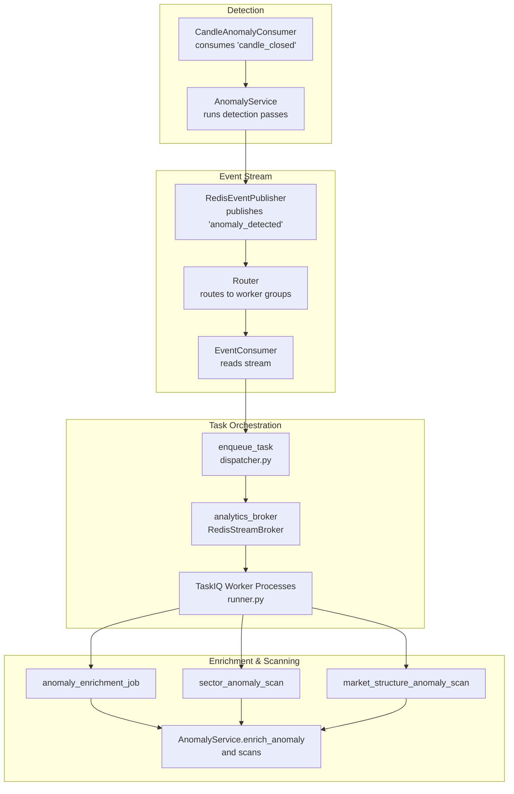
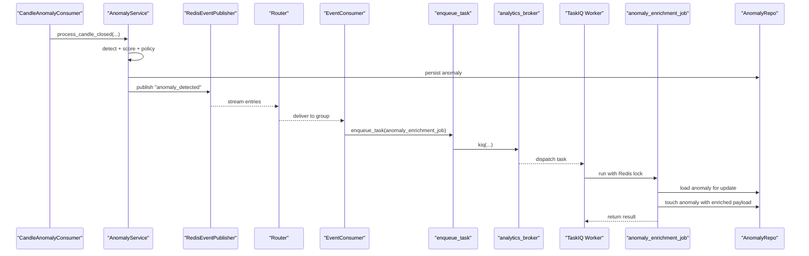
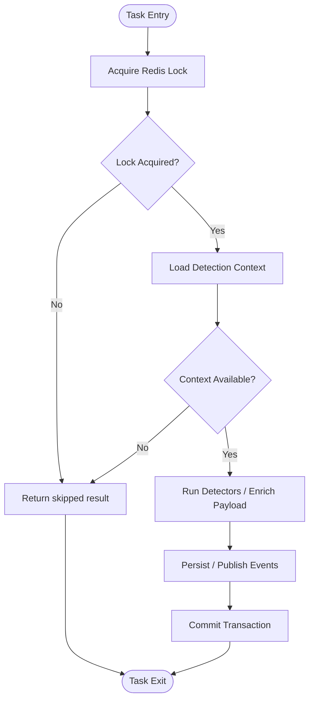
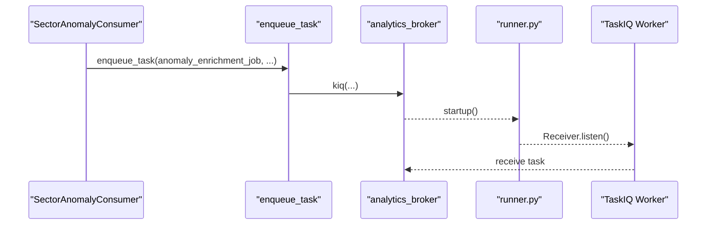
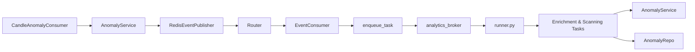
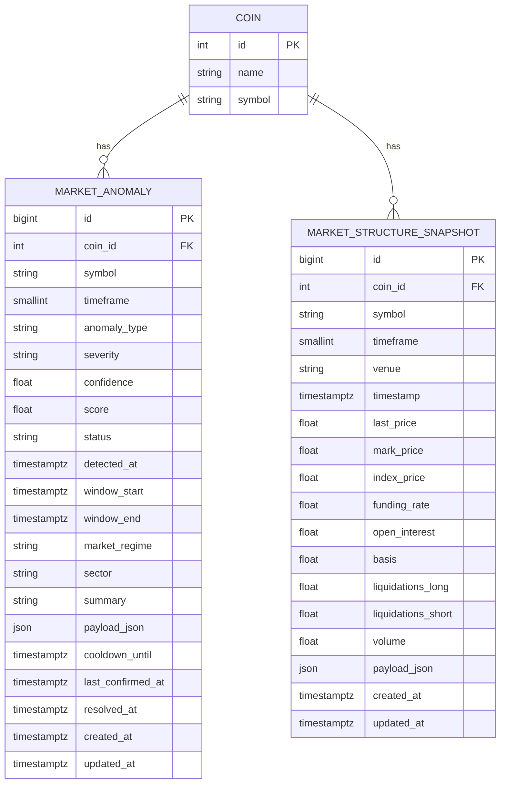

# Background Tasks & Enrichment

<cite>
**Referenced Files in This Document**
- [anomaly_enrichment_tasks.py](file://src/apps/anomalies/tasks/anomaly_enrichment_tasks.py)
- [anomaly_service.py](file://src/apps/anomalies/services/anomaly_service.py)
- [candle_anomaly_consumer.py](file://src/apps/anomalies/consumers/candle_anomaly_consumer.py)
- [sector_anomaly_consumer.py](file://src/apps/anomalies/consumers/sector_anomaly_consumer.py)
- [models.py](file://src/apps/anomalies/models.py)
- [constants.py](file://src/apps/anomalies/constants.py)
- [broker.py](file://src/runtime/orchestration/broker.py)
- [dispatcher.py](file://src/runtime/orchestration/dispatcher.py)
- [runner.py](file://src/runtime/orchestration/runner.py)
- [publisher.py](file://src/runtime/streams/publisher.py)
- [consumer.py](file://src/runtime/streams/consumer.py)
- [router.py](file://src/runtime/streams/router.py)
- [base.py](file://src/core/settings/base.py)
</cite>

## Table of Contents
1. [Introduction](#introduction)
2. [Project Structure](#project-structure)
3. [Core Components](#core-components)
4. [Architecture Overview](#architecture-overview)
5. [Detailed Component Analysis](#detailed-component-analysis)
6. [Dependency Analysis](#dependency-analysis)
7. [Performance Considerations](#performance-considerations)
8. [Troubleshooting Guide](#troubleshooting-guide)
9. [Conclusion](#conclusion)
10. [Appendices](#appendices)

## Introduction
This document explains the background task processing system for anomaly detection enrichment. It covers how anomalies are detected, enriched, correlated, and contextualized across markets and sectors. The system integrates Redis-backed task queues via TaskIQ, event streaming for detection propagation, and background workers that execute enrichment and scanning tasks. It documents task types, scheduling, execution patterns, dependency management, resource allocation, priority handling, timeouts, failure recovery, and operational monitoring hooks.

## Project Structure
The anomaly enrichment subsystem spans three layers:
- Detection and event emission: triggered by candle-close events and published to the event stream.
- Task orchestration: TaskIQ brokers and workers manage background jobs.
- Enrichment and scanning: specialized tasks enrich anomaly metadata and perform sector and market-structure scans.

**Diagram sources**
- [candle_anomaly_consumer.py:13-23](file://src/apps/anomalies/consumers/candle_anomaly_consumer.py#L13-L23)
- [anomaly_service.py:80-111](file://src/apps/anomalies/services/anomaly_service.py#L80-L111)
- [publisher.py:38-88](file://src/runtime/streams/publisher.py#L38-L88)
- [router.py:17-54](file://src/runtime/streams/router.py#L17-L54)
- [consumer.py:190-225](file://src/runtime/streams/consumer.py#L190-L225)
- [dispatcher.py:5-6](file://src/runtime/orchestration/dispatcher.py#L5-L6)
- [broker.py:12-22](file://src/runtime/orchestration/broker.py#L12-L22)
- [runner.py:57-78](file://src/runtime/orchestration/runner.py#L57-L78)
- [anomaly_enrichment_tasks.py:16-26](file://src/apps/anomalies/tasks/anomaly_enrichment_tasks.py#L16-L26)
- [sector_anomaly_consumer.py:21-53](file://src/apps/anomalies/consumers/sector_anomaly_consumer.py#L21-L53)

**Section sources**
- [candle_anomaly_consumer.py:13-23](file://src/apps/anomalies/consumers/candle_anomaly_consumer.py#L13-L23)
- [anomaly_service.py:80-111](file://src/apps/anomalies/services/anomaly_service.py#L80-L111)
- [publisher.py:38-88](file://src/runtime/streams/publisher.py#L38-L88)
- [router.py:17-54](file://src/runtime/streams/router.py#L17-L54)
- [consumer.py:190-225](file://src/runtime/streams/consumer.py#L190-L225)
- [dispatcher.py:5-6](file://src/runtime/orchestration/dispatcher.py#L5-L6)
- [broker.py:12-22](file://src/runtime/orchestration/broker.py#L12-L22)
- [runner.py:57-78](file://src/runtime/orchestration/runner.py#L57-L78)
- [anomaly_enrichment_tasks.py:16-26](file://src/apps/anomalies/tasks/anomaly_enrichment_tasks.py#L16-L26)
- [sector_anomaly_consumer.py:21-53](file://src/apps/anomalies/consumers/sector_anomaly_consumer.py#L21-L53)

## Core Components
- Detection pipeline: On candle-close events, AnomalyService loads fast-path context and runs fast detectors to produce anomaly drafts. If decisions warrant creation or updates, anomalies are persisted and an event is emitted.
- Event routing: The event stream routes anomaly events to the anomaly-sector worker group, which triggers enrichment and secondary scans.
- Task orchestration: TaskIQ brokers separate general and analytics queues. Analytics broker hosts enrichment and scanning tasks. Workers are spawned per configured process count.
- Enrichment and scanning tasks: Tasks coordinate via Redis locks, load contexts, run detectors, and update anomaly payloads with portfolio relevance, market scope, and explainability metadata.

Key responsibilities:
- AnomalyService: detection passes, scoring, policy decisions, persistence, and event publishing.
- SectorAnomalyConsumer: enqueues enrichment and sector/market-structure scans for high-severity anomalies.
- Task modules: define task functions decorated for TaskIQ, with Redis locks and UOW.
- Streams: Redis-backed event publishing and consumption with idempotence and metrics recording.

**Section sources**
- [anomaly_service.py:80-111](file://src/apps/anomalies/services/anomaly_service.py#L80-L111)
- [sector_anomaly_consumer.py:21-53](file://src/apps/anomalies/consumers/sector_anomaly_consumer.py#L21-L53)
- [anomaly_enrichment_tasks.py:16-26](file://src/apps/anomalies/tasks/anomaly_enrichment_tasks.py#L16-L26)
- [broker.py:12-22](file://src/runtime/orchestration/broker.py#L12-L22)
- [runner.py:21-24](file://src/runtime/orchestration/runner.py#L21-L24)
- [publisher.py:38-88](file://src/runtime/streams/publisher.py#L38-L88)
- [consumer.py:190-225](file://src/runtime/streams/consumer.py#L190-L225)

## Architecture Overview
The system combines event-driven detection with asynchronous task processing:

**Diagram sources**
- [candle_anomaly_consumer.py:13-23](file://src/apps/anomalies/consumers/candle_anomaly_consumer.py#L13-L23)
- [anomaly_service.py:80-111](file://src/apps/anomalies/services/anomaly_service.py#L80-L111)
- [publisher.py:38-88](file://src/runtime/streams/publisher.py#L38-L88)
- [router.py:58-62](file://src/runtime/streams/router.py#L58-L62)
- [consumer.py:190-225](file://src/runtime/streams/consumer.py#L190-L225)
- [dispatcher.py:5-6](file://src/runtime/orchestration/dispatcher.py#L5-L6)
- [broker.py:18-22](file://src/runtime/orchestration/broker.py#L18-L22)
- [runner.py:57-78](file://src/runtime/orchestration/runner.py#L57-L78)
- [anomaly_enrichment_tasks.py:16-26](file://src/apps/anomalies/tasks/anomaly_enrichment_tasks.py#L16-L26)

## Detailed Component Analysis

### Task Types and Responsibilities
- anomaly_enrichment_job: Adds portfolio relevance and market scope to anomaly payload, sets status to active if new, and persists updates.
- sector_anomaly_scan: Performs sector synchronicity scan around a trigger anomaly and emits new anomalies if found.
- market_structure_anomaly_scan: Performs derivatives/market-structure anomaly scan and emits new anomalies if found.

Execution patterns:
- Each task validates context availability and returns early if unavailable.
- Tasks use Redis locks keyed by entity/timeframe/timestamp to prevent concurrent executions.
- Each task wraps work in an async unit-of-work to ensure transactional persistence.

**Diagram sources**
- [anomaly_enrichment_tasks.py:16-26](file://src/apps/anomalies/tasks/anomaly_enrichment_tasks.py#L16-L26)
- [anomaly_enrichment_tasks.py:29-56](file://src/apps/anomalies/tasks/anomaly_enrichment_tasks.py#L29-L56)
- [anomaly_enrichment_tasks.py:59-86](file://src/apps/anomalies/tasks/anomaly_enrichment_tasks.py#L59-L86)
- [anomaly_service.py:113-147](file://src/apps/anomalies/services/anomaly_service.py#L113-L147)
- [anomaly_service.py:149-191](file://src/apps/anomalies/services/anomaly_service.py#L149-L191)
- [anomaly_service.py:193-241](file://src/apps/anomalies/services/anomaly_service.py#L193-L241)

**Section sources**
- [anomaly_enrichment_tasks.py:16-26](file://src/apps/anomalies/tasks/anomaly_enrichment_tasks.py#L16-L26)
- [anomaly_enrichment_tasks.py:29-56](file://src/apps/anomalies/tasks/anomaly_enrichment_tasks.py#L29-L56)
- [anomaly_enrichment_tasks.py:59-86](file://src/apps/anomalies/tasks/anomaly_enrichment_tasks.py#L59-L86)
- [anomaly_service.py:113-147](file://src/apps/anomalies/services/anomaly_service.py#L113-L147)
- [anomaly_service.py:149-191](file://src/apps/anomalies/services/anomaly_service.py#L149-L191)
- [anomaly_service.py:193-241](file://src/apps/anomalies/services/anomaly_service.py#L193-L241)

### Task Queue Integration and Execution
- Brokers: Two TaskIQ brokers are configured—general and analytics—each with distinct queue names and consumer groups.
- Worker groups: Runner spawns processes per worker group; analytics group handles anomaly enrichment and scanning tasks.
- Dispatch: enqueue_task delegates to task.kiq to push jobs onto the analytics broker.

**Diagram sources**
- [sector_anomaly_consumer.py:28-46](file://src/apps/anomalies/consumers/sector_anomaly_consumer.py#L28-L46)
- [dispatcher.py:5-6](file://src/runtime/orchestration/dispatcher.py#L5-L6)
- [broker.py:18-22](file://src/runtime/orchestration/broker.py#L18-L22)
- [runner.py:57-78](file://src/runtime/orchestration/runner.py#L57-L78)

**Section sources**
- [broker.py:12-22](file://src/runtime/orchestration/broker.py#L12-L22)
- [runner.py:21-24](file://src/runtime/orchestration/runner.py#L21-L24)
- [runner.py:57-78](file://src/runtime/orchestration/runner.py#L57-L78)
- [dispatcher.py:5-6](file://src/runtime/orchestration/dispatcher.py#L5-L6)
- [sector_anomaly_consumer.py:28-46](file://src/apps/anomalies/consumers/sector_anomaly_consumer.py#L28-L46)

### Dependency Management and Resource Allocation
- Dependencies: Tasks depend on AnomalyService, AsyncUnitOfWork, Redis locks, and TaskIQ broker.
- Resource allocation: Worker processes are configured per group; analytics group is separate to isolate anomaly workloads.

Configuration highlights:
- Worker counts: taskiq_general_worker_processes and taskiq_analytics_worker_processes.
- Queue names and consumer groups: distinct for general vs analytics.

**Section sources**
- [base.py:46-47](file://src/core/settings/base.py#L46-L47)
- [runner.py:21-24](file://src/runtime/orchestration/runner.py#L21-L24)
- [broker.py:7-10](file://src/runtime/orchestration/broker.py#L7-L10)

### Timeout Management and Failure Recovery
- Lock timeouts: Tasks define per-task lock timeouts to avoid deadlocks during enrichment and scanning.
- Event stream idempotence: Consumers acknowledge processed messages and track idempotency keys to avoid reprocessing.
- Metrics: Consumer metrics recorder interface allows capturing success/failure outcomes for observability.

**Section sources**
- [anomaly_enrichment_tasks.py:11-13](file://src/apps/anomalies/tasks/anomaly_enrichment_tasks.py#L11-L13)
- [consumer.py:69-95](file://src/runtime/streams/consumer.py#L69-L95)
- [consumer.py:172-188](file://src/runtime/streams/consumer.py#L172-L188)

### Task Configurations and Examples
- Enrichment task: anomaly_enrichment_job takes anomaly_id; uses Redis lock and AsyncUnitOfWork.
- Sector scan: sector_anomaly_scan takes trigger_coin_id, timeframe, timestamp, optional trigger_anomaly_id; normalizes timestamp and uses lock.
- Market structure scan: market_structure_anomaly_scan mirrors sector scan with different detectors.

Operational examples:
- Enrichment updates anomaly payload with portfolio_relevant and market_wide flags.
- Sector and market-structure scans emit new anomalies when findings exceed thresholds.

**Section sources**
- [anomaly_enrichment_tasks.py:16-26](file://src/apps/anomalies/tasks/anomaly_enrichment_tasks.py#L16-L26)
- [anomaly_enrichment_tasks.py:29-56](file://src/apps/anomalies/tasks/anomaly_enrichment_tasks.py#L29-L56)
- [anomaly_enrichment_tasks.py:59-86](file://src/apps/anomalies/tasks/anomaly_enrichment_tasks.py#L59-L86)
- [anomaly_service.py:193-241](file://src/apps/anomalies/services/anomaly_service.py#L193-L241)
- [anomaly_service.py:113-147](file://src/apps/anomalies/services/anomaly_service.py#L113-L147)
- [anomaly_service.py:149-191](file://src/apps/anomalies/services/anomaly_service.py#L149-L191)

### Monitoring Dashboards for Anomaly Processing Tasks
- Event stream metrics: Consumer metrics recorder interface enables capturing per-route success/failure and errors.
- Worker health: Multiprocess spawning and stop signaling allow controlled lifecycle management.
- Stream health: Event consumer ensures consumer groups and tracks stale messages for reliability.

Recommended dashboard metrics:
- Task queue depth (analytics broker).
- Task execution latency and failures.
- Event stream backlog and consumer lag.
- Idempotency misses and reprocessing rates.

**Section sources**
- [consumer.py:172-188](file://src/runtime/streams/consumer.py#L172-L188)
- [runner.py:91-105](file://src/runtime/orchestration/runner.py#L91-L105)
- [runner.py:108-117](file://src/runtime/orchestration/runner.py#L108-L117)

## Dependency Analysis
High-level dependencies among anomaly enrichment components:

**Diagram sources**
- [candle_anomaly_consumer.py:13-23](file://src/apps/anomalies/consumers/candle_anomaly_consumer.py#L13-L23)
- [anomaly_service.py:80-111](file://src/apps/anomalies/services/anomaly_service.py#L80-L111)
- [publisher.py:38-88](file://src/runtime/streams/publisher.py#L38-L88)
- [router.py:58-62](file://src/runtime/streams/router.py#L58-L62)
- [consumer.py:190-225](file://src/runtime/streams/consumer.py#L190-L225)
- [dispatcher.py:5-6](file://src/runtime/orchestration/dispatcher.py#L5-L6)
- [broker.py:18-22](file://src/runtime/orchestration/broker.py#L18-L22)
- [runner.py:57-78](file://src/runtime/orchestration/runner.py#L57-L78)
- [anomaly_enrichment_tasks.py:16-26](file://src/apps/anomalies/tasks/anomaly_enrichment_tasks.py#L16-L26)

**Section sources**
- [anomaly_service.py:80-111](file://src/apps/anomalies/services/anomaly_service.py#L80-L111)
- [publisher.py:38-88](file://src/runtime/streams/publisher.py#L38-L88)
- [router.py:17-54](file://src/runtime/streams/router.py#L17-L54)
- [consumer.py:190-225](file://src/runtime/streams/consumer.py#L190-L225)
- [dispatcher.py:5-6](file://src/runtime/orchestration/dispatcher.py#L5-L6)
- [broker.py:12-22](file://src/runtime/orchestration/broker.py#L12-L22)
- [runner.py:57-78](file://src/runtime/orchestration/runner.py#L57-L78)
- [anomaly_enrichment_tasks.py:16-26](file://src/apps/anomalies/tasks/anomaly_enrichment_tasks.py#L16-L26)

## Performance Considerations
- Asynchronous I/O: Event publishing uses a background thread to drain Redis writes, keeping the event loop responsive.
- Locking: Per-anomaly and per-scan locks prevent redundant work and contention.
- Batched event consumption: Consumer reads in batches and acknowledges after processing.
- Worker separation: Analytics tasks on a dedicated broker reduces contention with general tasks.
- Backoff and quarantine: While primarily for market structure tasks, similar patterns can be considered for anomaly tasks under heavy load.

[No sources needed since this section provides general guidance]

## Troubleshooting Guide
Common issues and remedies:
- Task skipped due to lock: If a task is already running for the same anomaly or scan parameters, it returns a skipped result. Wait for completion or adjust lock timeouts.
- Context unavailable: If detection context is missing, tasks skip and return a skipped result. Verify upstream data availability.
- Event reprocessing: If idempotency keys indicate duplicates, acknowledgments prevent repeated processing. Investigate consumer lag or handler errors.
- Worker shutdown: Controlled stop via signals; ensure processes terminate cleanly to avoid orphaned tasks.

**Section sources**
- [anomaly_enrichment_tasks.py:22-23](file://src/apps/anomalies/tasks/anomaly_enrichment_tasks.py#L22-L23)
- [anomaly_enrichment_tasks.py:42-48](file://src/apps/anomalies/tasks/anomaly_enrichment_tasks.py#L42-L48)
- [anomaly_enrichment_tasks.py:71-78](file://src/apps/anomalies/tasks/anomaly_enrichment_tasks.py#L71-L78)
- [consumer.py:144-170](file://src/runtime/streams/consumer.py#L144-L170)
- [runner.py:81-88](file://src/runtime/orchestration/runner.py#L81-L88)

## Conclusion
The anomaly enrichment system combines fast detection, event-driven propagation, and robust background task processing. Tasks are isolated on a dedicated analytics queue, protected by Redis locks, and executed by multiprocess workers. Enrichment augments anomalies with portfolio and market scope insights, while sector and market-structure scans expand context. With idempotent event consumption, metrics hooks, and configurable worker counts, the system scales and remains observable.

[No sources needed since this section summarizes without analyzing specific files]

## Appendices

### Data Model Overview
Anomaly records and market structure snapshots are persisted for downstream analysis and correlation.

**Diagram sources**
- [models.py:15-64](file://src/apps/anomalies/models.py#L15-L64)
- [models.py:67-121](file://src/apps/anomalies/models.py#L67-L121)

**Section sources**
- [models.py:15-64](file://src/apps/anomalies/models.py#L15-L64)
- [models.py:67-121](file://src/apps/anomalies/models.py#L67-L121)