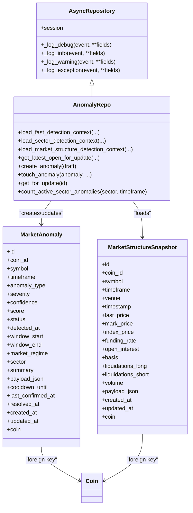
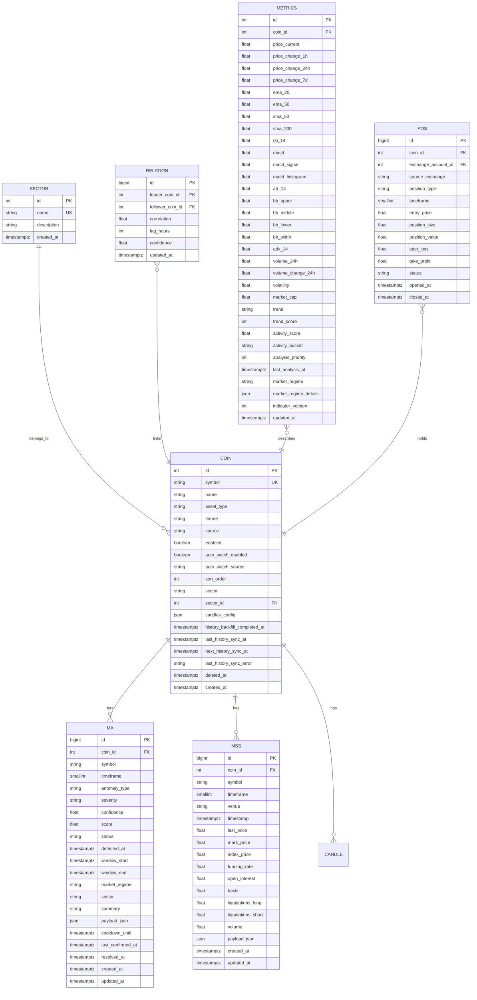

# Data Models & Persistence

<cite>
**Referenced Files in This Document**
- [models.py](file://src/apps/anomalies/models.py)
- [anomaly_repo.py](file://src/apps/anomalies/repos/anomaly_repo.py)
- [schemas.py](file://src/apps/anomalies/schemas.py)
- [read_models.py](file://src/apps/anomalies/read_models.py)
- [constants.py](file://src/apps/anomalies/constants.py)
- [20260312_000021_anomaly_detection_subsystem.py](file://src/migrations/versions/20260312_000021_anomaly_detection_subsystem.py)
- [base.py](file://src/core/db/base.py)
- [persistence.py](file://src/core/db/persistence.py)
- [models.py](file://src/apps/market_data/models.py)
- [models.py](file://src/apps/cross_market/models.py)
- [models.py](file://src/apps/indicators/models.py)
- [models.py](file://src/apps/portfolio/models.py)
</cite>

## Table of Contents
1. [Introduction](#introduction)
2. [Project Structure](#project-structure)
3. [Core Components](#core-components)
4. [Architecture Overview](#architecture-overview)
5. [Detailed Component Analysis](#detailed-component-analysis)
6. [Dependency Analysis](#dependency-analysis)
7. [Performance Considerations](#performance-considerations)
8. [Troubleshooting Guide](#troubleshooting-guide)
9. [Conclusion](#conclusion)

## Introduction
This document details the anomaly detection data models and persistence layer in the Iris backend. It covers:
- The MarketAnomaly entity and its lifecycle fields
- The MarketStructureSnapshot model for market structure data capture
- Database schema design, indexing strategies, foreign key relationships
- Query optimization patterns used in the anomaly repository
- Integration with SQLAlchemy ORM and the AsyncRepository base class
- Entity relationship diagrams, field descriptions, validation rules, and performance considerations

## Project Structure
The anomaly subsystem resides under src/apps/anomalies and integrates with shared models in market_data, cross_market, indicators, and portfolio domains. The SQLAlchemy declarative Base is provided by the core database layer.

```mermaid
graph TB
subgraph "Core DB Layer"
CORE_BASE["Base (core/db/base.py)"]
PERSIST["AsyncRepository (core/db/persistence.py)"]
end
subgraph "Market Data"
COIN["Coin (apps/market_data/models.py)"]
CANDLE["Candle (apps/market_data/models.py)"]
end
subgraph "Cross Market"
SECTOR["Sector (apps/cross_market/models.py)"]
REL["CoinRelation (apps/cross_market/models.py)"]
end
subgraph "Indicators"
METRICS["CoinMetrics (apps/indicators/models.py)"]
end
subgraph "Portfolio"
POS["PortfolioPosition (apps/portfolio/models.py)"]
end
subgraph "Anomalies"
MA["MarketAnomaly (apps/anomalies/models.py)"]
MSS["MarketStructureSnapshot (apps/anomalies/models.py)"]
REPO["AnomalyRepo (apps/anomalies/repos/anomaly_repo.py)"]
SCHEMA["Schemas (apps/anomalies/schemas.py)"]
READM["Read Models (apps/anomalies/read_models.py)"]
CONST["Constants (apps/anomalies/constants.py)"]
end
CORE_BASE --> MA
CORE_BASE --> MSS
PERSIST --> REPO
COIN < --> MA
COIN < --> MSS
COIN < --> CANDLE
SECTOR < --> COIN
REL < --> COIN
METRICS < --> COIN
POS < --> COIN
REPO --> MA
REPO --> MSS
REPO --> SCHEMA
REPO --> CONST
READM --> MA
```

**Diagram sources**
- [base.py:1-4](file://src/core/db/base.py#L1-L4)
- [persistence.py:95-102](file://src/core/db/persistence.py#L95-L102)
- [models.py:20-168](file://src/apps/market_data/models.py#L20-L168)
- [models.py:15-84](file://src/apps/cross_market/models.py#L15-L84)
- [models.py:15-121](file://src/apps/indicators/models.py#L15-L121)
- [models.py:97-151](file://src/apps/portfolio/models.py#L97-L151)
- [models.py:15-124](file://src/apps/anomalies/models.py#L15-L124)
- [anomaly_repo.py:27-563](file://src/apps/anomalies/repos/anomaly_repo.py#L27-L563)
- [schemas.py:11-136](file://src/apps/anomalies/schemas.py#L11-L136)
- [read_models.py:10-92](file://src/apps/anomalies/read_models.py#L10-L92)
- [constants.py:1-113](file://src/apps/anomalies/constants.py#L1-L113)

**Section sources**
- [base.py:1-4](file://src/core/db/base.py#L1-L4)
- [persistence.py:95-102](file://src/core/db/persistence.py#L95-L102)
- [models.py:15-124](file://src/apps/anomalies/models.py#L15-L124)
- [anomaly_repo.py:27-563](file://src/apps/anomalies/repos/anomaly_repo.py#L27-L563)
- [schemas.py:11-136](file://src/apps/anomalies/schemas.py#L11-L136)
- [read_models.py:10-92](file://src/apps/anomalies/read_models.py#L10-L92)
- [constants.py:1-113](file://src/apps/anomalies/constants.py#L1-L113)

## Core Components
- MarketAnomaly: Stores anomaly records with lifecycle fields, scoring, and metadata.
- MarketStructureSnapshot: Captures venue-level market structure metrics for a given coin/timeframe/timestamp.
- AnomalyRepo: Asynchronous repository implementing data access patterns, bulk operations, and transactional updates.
- Schemas: Data transfer objects for detection context and anomaly drafts.
- Read Models: Immutable read-side DTOs for serialization and legacy compatibility.

**Section sources**
- [models.py:15-124](file://src/apps/anomalies/models.py#L15-L124)
- [anomaly_repo.py:27-563](file://src/apps/anomalies/repos/anomaly_repo.py#L27-L563)
- [schemas.py:11-136](file://src/apps/anomalies/schemas.py#L11-L136)
- [read_models.py:10-92](file://src/apps/anomalies/read_models.py#L10-L92)

## Architecture Overview
The anomaly subsystem uses SQLAlchemy ORM with an asynchronous repository pattern. Entities inherit from a shared Base, and the AnomalyRepo extends AsyncRepository to centralize query logic and enforce consistent logging and locking behavior.



**Diagram sources**
- [persistence.py:95-102](file://src/core/db/persistence.py#L95-L102)
- [anomaly_repo.py:27-563](file://src/apps/anomalies/repos/anomaly_repo.py#L27-L563)
- [models.py:15-124](file://src/apps/anomalies/models.py#L15-L124)
- [models.py:20-168](file://src/apps/market_data/models.py#L20-L168)

## Detailed Component Analysis

### MarketAnomaly Entity
MarketAnomaly captures anomaly events with comprehensive metadata and lifecycle fields.

- Fields overview
  - Identity: id
  - Foreign key: coin_id (FK to coins.id, CASCADE)
  - Dimensions: symbol, timeframe
  - Classification: anomaly_type, severity
  - Quality: confidence, score
  - Status: status (default "new")
  - Temporal: detected_at, window_start, window_end
  - Context: market_regime, sector
  - Description: summary
  - Payload: payload_json (JSON)
  - Lifecycle: cooldown_until, last_confirmed_at, resolved_at
  - Audit: created_at, updated_at (server_default/onupdate)

- Indexing strategy
  - Composite index on (coin_id, timeframe, anomaly_type, detected_at DESC) to optimize per-coin/type recent anomaly retrieval
  - Composite index on (status, detected_at DESC) to efficiently list recent open anomalies
  - Composite index on (severity, score DESC) to support severity-based ranking

- Validation rules
  - Non-null constraints on coin_id, symbol, timeframe, anomaly_type, severity, confidence, score, status, window_end, summary
  - Default values for status, confidence, score, timestamps
  - JSON payload defaults to empty dict

- Lifecycle fields
  - cooldown_until: temporal gating for re-detection
  - last_confirmed_at: last update when confirmed
  - resolved_at: completion timestamp

- Relationship
  - Back-populated relationship to Coin

- Migration parity
  - Matches migration definition for column types, defaults, and indexes

**Section sources**
- [models.py:15-65](file://src/apps/anomalies/models.py#L15-L65)
- [20260312_000021_anomaly_detection_subsystem.py:18-54](file://src/migrations/versions/20260312_000021_anomaly_detection_subsystem.py#L18-L54)

### MarketStructureSnapshot Model
MarketStructureSnapshot captures venue-level market structure metrics for a given coin/timeframe/timestamp.

- Fields overview
  - Identity: id
  - Foreign key: coin_id (FK to coins.id, CASCADE)
  - Dimensions: symbol, timeframe, venue, timestamp
  - Metrics: last_price, mark_price, index_price, funding_rate, open_interest, basis, liquidations_long, liquidations_short, volume
  - Payload: payload_json (JSON)
  - Audit: created_at, updated_at

- Indexing strategy
  - Unique composite index on (coin_id, timeframe, venue, timestamp) to prevent duplicates
  - Composite index on (coin_id, timeframe, timestamp DESC) for recent snapshots
  - Composite index on (coin_id, venue, timestamp DESC) for venue-centric queries

- Validation rules
  - Non-null constraints on coin_id, symbol, timeframe, venue, timestamp
  - JSON payload defaults to empty dict

- Relationship
  - Back-populated relationship to Coin

- Migration parity
  - Matches migration definition for column types, defaults, and indexes

**Section sources**
- [models.py:67-121](file://src/apps/anomalies/models.py#L67-L121)
- [20260312_000021_anomaly_detection_subsystem.py:18-54](file://src/migrations/versions/20260312_000021_anomaly_detection_subsystem.py#L18-L54)

### Anomaly Repository Interface and Data Access Patterns
AnomalyRepo encapsulates all anomaly-related persistence operations with asynchronous SQLAlchemy usage and robust logging.

- Initialization
  - Inherits AsyncRepository and sets domain/repository_name for structured logs

- Candle loading helpers
  - _load_candles: Fetches recent candles for a single coin/timeframe
  - _load_candles_for_coin_ids: Bulk loads candles for multiple peers using windowing and partitioning

- Market structure snapshot loading
  - _load_market_structure_snapshots: Loads venue snapshots up to a timestamp with lookback bounds

- Context builders
  - load_fast_detection_context: Builds minimal detection context with coin metadata, candles, optional benchmark series, and portfolio relevance
  - load_sector_detection_context: Extends fast context with sector and related peers, bulk-loading peer candles
  - load_market_structure_detection_context: Adds venue snapshots to the context

- Open anomaly management
  - get_latest_open_for_update: Locks the latest open anomaly by type/timeframe/coin for atomic updates
  - get_for_update: Locks a specific anomaly record for update

- Creation and updates
  - create_anomaly: Constructs and persists a new MarketAnomaly from AnomalyDraft
  - touch_anomaly: Updates mutable fields (status, score, confidence, summary, payload_json, cooldown_until, resolved_at, last_confirmed_at)

- Aggregations
  - count_active_sector_anomalies: Counts open anomalies by sector and timeframe

- Bulk operations
  - Uses subqueries and window functions to minimize round-trips when loading peer candles
  - Applies LIMITs and computed bounds to cap lookback sizes

- Transactional safety
  - Uses with_for_update() for optimistic concurrency control during anomaly updates
  - Flushes changes after create/touch operations

- Logging and observability
  - Structured logs with domain, component, and operation metadata
  - Sanitized log values to protect sensitive data

**Section sources**
- [anomaly_repo.py:27-563](file://src/apps/anomalies/repos/anomaly_repo.py#L27-L563)
- [persistence.py:61-93](file://src/core/db/persistence.py#L61-L93)

### Schemas and Read Models
- AnomalyDetectionContext: Immutable context for anomaly detection pipelines, including candles, benchmark series, peer series, and venue snapshots
- MarketStructurePoint: Venue-level snapshot data transfer object with convenience properties for derived metrics
- AnomalyDraft: Write-side DTO for creating anomalies
- AnomalyReadModel: Immutable read-side DTO for serialization and legacy compatibility, with JSON freezing/thawing utilities

**Section sources**
- [schemas.py:11-136](file://src/apps/anomalies/schemas.py#L11-L136)
- [read_models.py:10-92](file://src/apps/anomalies/read_models.py#L10-L92)

## Dependency Analysis
The anomaly subsystem depends on shared models across domains to enrich detection contexts and maintain referential integrity.



**Diagram sources**
- [models.py:20-168](file://src/apps/market_data/models.py#L20-L168)
- [models.py:15-84](file://src/apps/cross_market/models.py#L15-L84)
- [models.py:15-121](file://src/apps/indicators/models.py#L15-L121)
- [models.py:97-151](file://src/apps/portfolio/models.py#L97-L151)
- [models.py:15-124](file://src/apps/anomalies/models.py#L15-L124)

**Section sources**
- [models.py:20-168](file://src/apps/market_data/models.py#L20-L168)
- [models.py:15-84](file://src/apps/cross_market/models.py#L15-L84)
- [models.py:15-121](file://src/apps/indicators/models.py#L15-L121)
- [models.py:97-151](file://src/apps/portfolio/models.py#L97-L151)
- [models.py:15-124](file://src/apps/anomalies/models.py#L15-L124)

## Performance Considerations
- Indexing
  - MarketAnomaly: composite indexes on (coin_id, timeframe, anomaly_type, detected_at DESC), (status, detected_at DESC), and (severity, score DESC) enable efficient filtering and ranking
  - MarketStructureSnapshot: unique index on (coin_id, timeframe, venue, timestamp) prevents duplicates; secondary indexes on (coin_id, timeframe, timestamp DESC) and (coin_id, venue, timestamp DESC) support time-series queries
  - Related models: existing indexes on coins, candles, and portfolio positions support joins and lookups

- Query patterns
  - Bulk peer candles: windowing with row_number() partitions per coin and ordering by timestamp reduces result set size and avoids N+1 queries
  - Lookback bounds: computed limits (e.g., max(lookback * 12, 96)) cap result sizes while preserving sufficient context
  - Subqueries: pre-filtered subqueries for candles and snapshots improve readability and maintainability

- Concurrency and locking
  - with_for_update() ensures exclusive access when updating anomalies, preventing race conditions during enrichment and resolution
  - Separate read/write logging improves observability of contention

- JSON payloads
  - payload_json fields store detector explainability and auxiliary data; freezing/thawing utilities in read models ensure safe serialization

- Timezone handling
  - All timestamps use timezone-aware DateTime, ensuring consistent comparisons across timezones

[No sources needed since this section provides general guidance]

## Troubleshooting Guide
- Common issues and mitigations
  - Missing candles: Fast detection context returns None when no candles are available for the target coin/timeframe; verify candle ingestion and timeframe alignment
  - No open anomalies: get_latest_open_for_update returns None when no open anomalies match criteria; confirm anomaly_type and timeframe filters
  - Duplicate snapshots: Unique index on MarketStructureSnapshot prevents duplicates; handle conflicts gracefully when ingesting late data
  - Performance regressions: Review query plans for bulk candle loading and consider adjusting lookback bounds or adding missing indexes

- Logging and diagnostics
  - Repository logs include domain, component, operation, and sanitized parameters; use these to trace slow queries and contention
  - Persistence utilities provide sanitization for sensitive fields and truncation for long values

**Section sources**
- [anomaly_repo.py:27-563](file://src/apps/anomalies/repos/anomaly_repo.py#L27-L563)
- [persistence.py:41-58](file://src/core/db/persistence.py#L41-L58)

## Conclusion
The anomaly detection subsystem provides a robust, indexed, and observable persistence layer for anomaly events and market structure snapshots. MarketAnomaly and MarketStructureSnapshot are designed for high-cardinality time-series data with targeted indexes and JSON payloads for extensibility. The AnomalyRepo consolidates complex queries, bulk operations, and concurrency control, enabling reliable anomaly detection pipelines across asset, sector, and venue scopes.