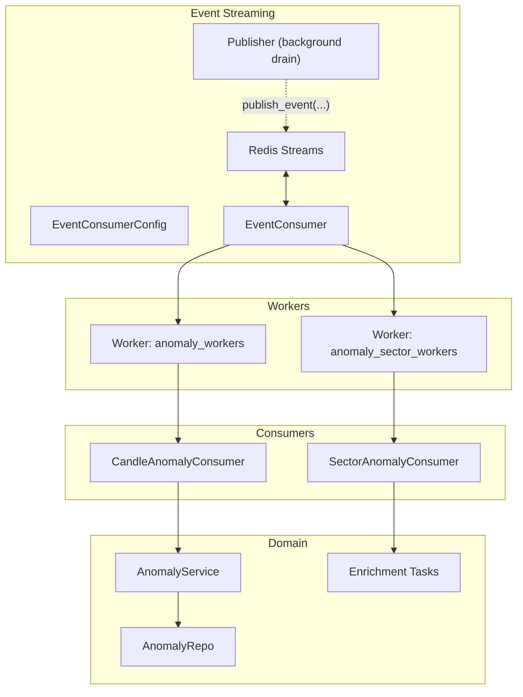
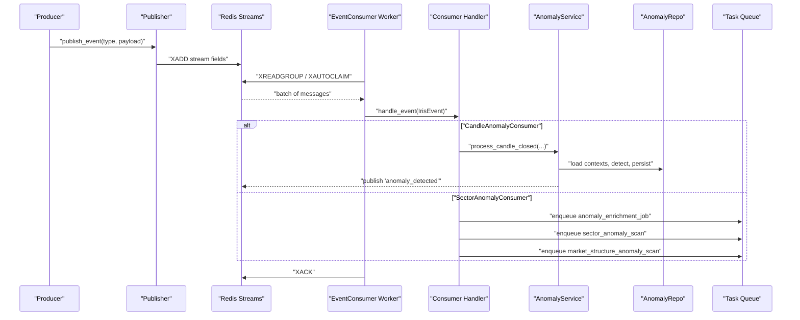
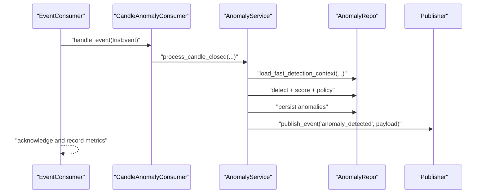
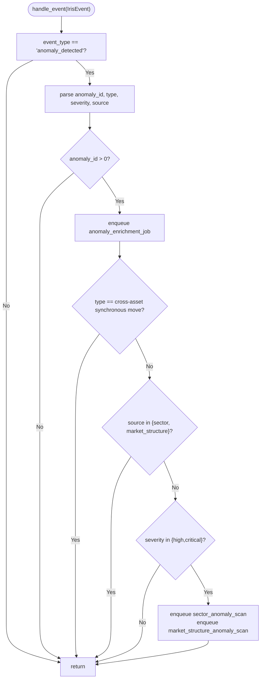
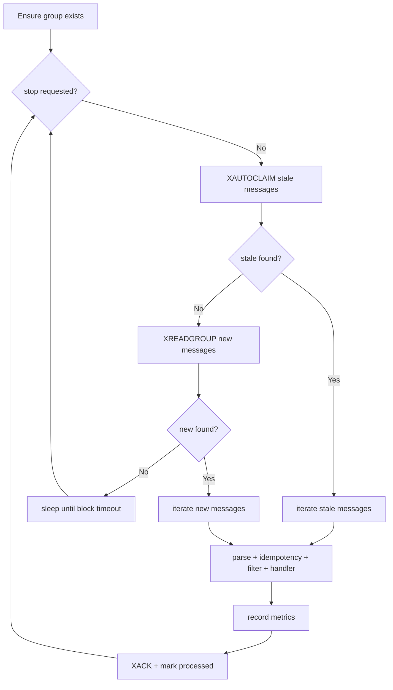
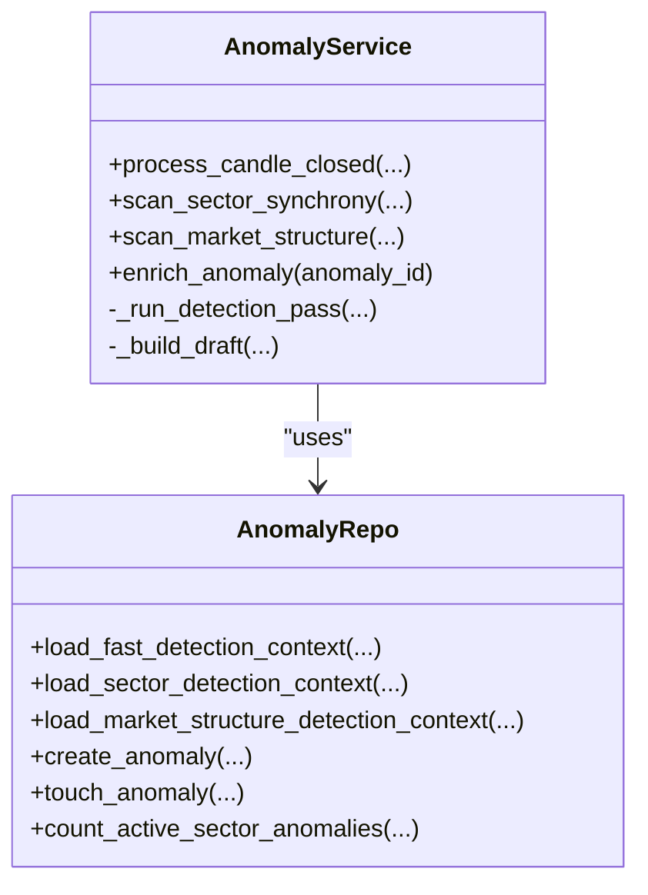
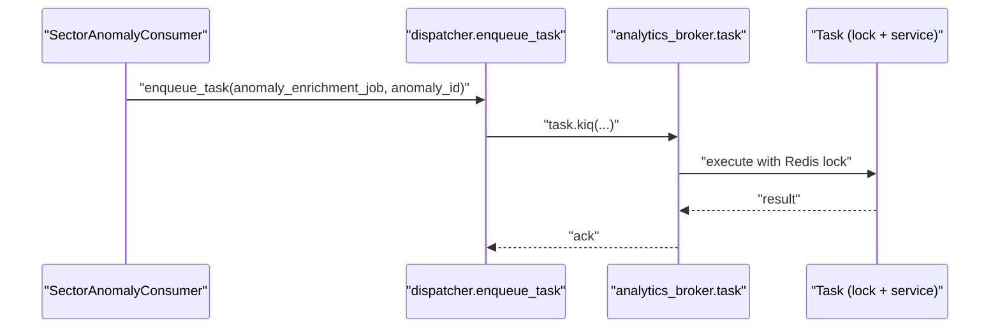
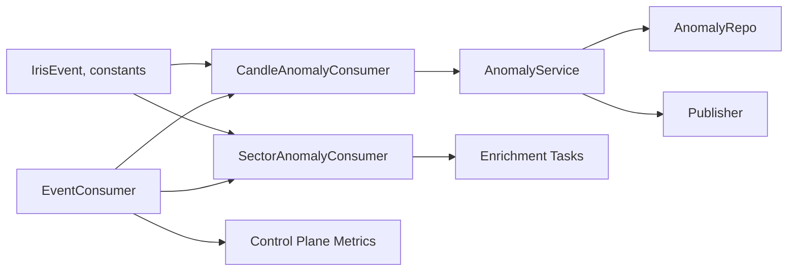

# Event Consumers & Processing

<cite>
**Referenced Files in This Document**
- [candle_anomaly_consumer.py](file://src/apps/anomalies/consumers/candle_anomaly_consumer.py)
- [sector_anomaly_consumer.py](file://src/apps/anomalies/consumers/sector_anomaly_consumer.py)
- [consumer.py](file://src/runtime/streams/consumer.py)
- [types.py](file://src/runtime/streams/types.py)
- [workers.py](file://src/runtime/streams/workers.py)
- [runner.py](file://src/runtime/streams/runner.py)
- [publisher.py](file://src/runtime/streams/publisher.py)
- [anomaly_service.py](file://src/apps/anomalies/services/anomaly_service.py)
- [constants.py](file://src/apps/anomalies/constants.py)
- [anomaly_enrichment_tasks.py](file://src/apps/anomalies/tasks/anomaly_enrichment_tasks.py)
- [dispatcher.py](file://src/runtime/orchestration/dispatcher.py)
- [anomaly_repo.py](file://src/apps/anomalies/repos/anomaly_repo.py)
- [models.py](file://src/apps/anomalies/models.py)
- [base.py](file://src/core/settings/base.py)
</cite>

## Table of Contents
1. [Introduction](#introduction)
2. [Project Structure](#project-structure)
3. [Core Components](#core-components)
4. [Architecture Overview](#architecture-overview)
5. [Detailed Component Analysis](#detailed-component-analysis)
6. [Dependency Analysis](#dependency-analysis)
7. [Performance Considerations](#performance-considerations)
8. [Troubleshooting Guide](#troubleshooting-guide)
9. [Conclusion](#conclusion)

## Introduction
This document explains the event-driven anomaly detection subsystem. It covers:
- The candle anomaly consumer that processes OHLCV-based anomaly events
- The sector anomaly consumer that triggers cross-asset correlation scans and enrichment
- Event consumption patterns, message processing workflows, error handling, retries, and dead-letter management
- Integration with the Redis Streams-based event streaming system
- Consumer configuration, parallel processing, and backpressure handling
- Examples of event formats, processing pipelines, failure recovery, and monitoring approaches

## Project Structure
The anomaly detection system spans three layers:
- Event streaming and transport: Redis Streams, consumer, publisher, and worker orchestration
- Consumers: specialized handlers for anomaly-related events
- Domain services and repositories: anomaly detection, scoring, persistence, and enrichment

**Diagram sources**
- [consumer.py:49-225](file://src/runtime/streams/consumer.py#L49-L225)
- [types.py:12-48](file://src/runtime/streams/types.py#L12-L48)
- [workers.py:378-462](file://src/runtime/streams/workers.py#L378-L462)
- [candle_anomaly_consumer.py:9-24](file://src/apps/anomalies/consumers/candle_anomaly_consumer.py#L9-L24)
- [sector_anomaly_consumer.py:17-54](file://src/apps/anomalies/consumers/sector_anomaly_consumer.py#L17-L54)
- [anomaly_service.py:44-410](file://src/apps/anomalies/services/anomaly_service.py#L44-L410)
- [anomaly_enrichment_tasks.py:16-87](file://src/apps/anomalies/tasks/anomaly_enrichment_tasks.py#L16-L87)
- [publisher.py:22-101](file://src/runtime/streams/publisher.py#L22-L101)

**Section sources**
- [consumer.py:49-225](file://src/runtime/streams/consumer.py#L49-L225)
- [types.py:12-48](file://src/runtime/streams/types.py#L12-L48)
- [workers.py:378-462](file://src/runtime/streams/workers.py#L378-L462)
- [runner.py:50-84](file://src/runtime/streams/runner.py#L50-L84)

## Core Components
- CandleAnomalyConsumer: Processes candle-closed events to run fast-path anomaly detection and publish anomaly events.
- SectorAnomalyConsumer: Handles anomaly-detected events to enqueue enrichment and cross-asset scans.
- EventConsumer: Generic Redis Streams consumer with idempotency, batching, backpressure, and metrics.
- AnomalyService: Orchestrates detection passes, scoring, policy decisions, persistence, and event publishing.
- Enrichment Tasks: Lock-based tasks to enrich anomalies and scan sector/sync market structure.
- Publisher: Background-threaded Redis Stream writer to avoid blocking the event loop.

**Section sources**
- [candle_anomaly_consumer.py:9-24](file://src/apps/anomalies/consumers/candle_anomaly_consumer.py#L9-L24)
- [sector_anomaly_consumer.py:17-54](file://src/apps/anomalies/consumers/sector_anomaly_consumer.py#L17-L54)
- [consumer.py:49-225](file://src/runtime/streams/consumer.py#L49-L225)
- [anomaly_service.py:44-410](file://src/apps/anomalies/services/anomaly_service.py#L44-L410)
- [anomaly_enrichment_tasks.py:16-87](file://src/apps/anomalies/tasks/anomaly_enrichment_tasks.py#L16-L87)
- [publisher.py:22-101](file://src/runtime/streams/publisher.py#L22-L101)

## Architecture Overview
The system uses Redis Streams as the backbone:
- Producers publish events to a named stream.
- Workers subscribe to per-group streams as consumer groups.
- EventConsumer reads batches, ensures idempotency, invokes handlers, records metrics, and acknowledges messages.
- Consumers delegate to domain services or task queues for heavy work.

**Diagram sources**
- [publisher.py:87-101](file://src/runtime/streams/publisher.py#L87-L101)
- [consumer.py:117-171](file://src/runtime/streams/consumer.py#L117-L171)
- [workers.py:358-364](file://src/runtime/streams/workers.py#L358-L364)
- [candle_anomaly_consumer.py:13-24](file://src/apps/anomalies/consumers/candle_anomaly_consumer.py#L13-L24)
- [sector_anomaly_consumer.py:21-54](file://src/apps/anomalies/consumers/sector_anomaly_consumer.py#L21-L54)
- [anomaly_service.py:80-111](file://src/apps/anomalies/services/anomaly_service.py#L80-L111)
- [anomaly_enrichment_tasks.py:16-87](file://src/apps/anomalies/tasks/anomaly_enrichment_tasks.py#L16-L87)

## Detailed Component Analysis

### Candle Anomaly Consumer
Responsibilities:
- Validates incoming events for candle-closed anomalies
- Runs fast-path detection via AnomalyService
- Persists anomalies and publishes anomaly_detected events

Processing flow:
- Accepts IrisEvent with event_type "candle_closed"
- Extracts coin_id, timeframe, timestamp, optional source
- Uses AsyncUnitOfWork and AnomalyService to run detection pass
- Publishes anomaly_detected events asynchronously

**Diagram sources**
- [candle_anomaly_consumer.py:13-24](file://src/apps/anomalies/consumers/candle_anomaly_consumer.py#L13-L24)
- [anomaly_service.py:80-111](file://src/apps/anomalies/services/anomaly_service.py#L80-L111)
- [anomaly_repo.py:214-272](file://src/apps/anomalies/repos/anomaly_repo.py#L214-L272)
- [publisher.py:87-101](file://src/runtime/streams/publisher.py#L87-L101)

**Section sources**
- [candle_anomaly_consumer.py:9-24](file://src/apps/anomalies/consumers/candle_anomaly_consumer.py#L9-L24)
- [anomaly_service.py:80-111](file://src/apps/anomalies/services/anomaly_service.py#L80-L111)
- [anomaly_repo.py:214-272](file://src/apps/anomalies/repos/anomaly_repo.py#L214-L272)

### Sector Anomaly Consumer
Responsibilities:
- Filters anomaly-detected events
- Enqueues enrichment and cross-asset scans for high-severity anomalies
- Skips certain pipelines and types to avoid duplication

Processing flow:
- Validates event_type "anomaly_detected" and anomaly_id
- Enqueues anomaly_enrichment_job
- Applies filters for type, source, and severity
- Enqueues sector and market-structure scans when conditions match

**Diagram sources**
- [sector_anomaly_consumer.py:21-54](file://src/apps/anomalies/consumers/sector_anomaly_consumer.py#L21-L54)
- [constants.py:3-14](file://src/apps/anomalies/constants.py#L3-L14)
- [dispatcher.py:5-6](file://src/runtime/orchestration/dispatcher.py#L5-L6)
- [anomaly_enrichment_tasks.py:16-87](file://src/apps/anomalies/tasks/anomaly_enrichment_tasks.py#L16-L87)

**Section sources**
- [sector_anomaly_consumer.py:17-54](file://src/apps/anomalies/consumers/sector_anomaly_consumer.py#L17-L54)
- [constants.py:3-14](file://src/apps/anomalies/constants.py#L3-L14)
- [dispatcher.py:5-6](file://src/runtime/orchestration/dispatcher.py#L5-L6)
- [anomaly_enrichment_tasks.py:16-87](file://src/apps/anomalies/tasks/anomaly_enrichment_tasks.py#L16-L87)

### EventConsumer: Idempotent, Batched, Metrics-Aware Consumer
Key behaviors:
- Creates or recovers consumer groups
- Reads stale messages (XAUTOCLAIM) after pending idle threshold, then new messages (XREADGROUP)
- Idempotency via stored event fingerprints
- Interested event types filtering
- Metrics recording per message
- Acknowledgement and TTL for processed markers

**Diagram sources**
- [consumer.py:190-217](file://src/runtime/streams/consumer.py#L190-L217)
- [consumer.py:144-171](file://src/runtime/streams/consumer.py#L144-L171)

**Section sources**
- [consumer.py:49-225](file://src/runtime/streams/consumer.py#L49-L225)
- [types.py:51-123](file://src/runtime/streams/types.py#L51-L123)

### AnomalyService: Detection, Scoring, Policy, Persistence, Publishing
Highlights:
- Fast-path detection on OHLCV candles
- Sector synchrony and market-structure scans
- Enrichment adds portfolio and scope context
- Publishes anomaly_detected events with structured payload

**Diagram sources**
- [anomaly_service.py:44-410](file://src/apps/anomalies/services/anomaly_service.py#L44-L410)
- [anomaly_repo.py:27-563](file://src/apps/anomalies/repos/anomaly_repo.py#L27-L563)

**Section sources**
- [anomaly_service.py:44-410](file://src/apps/anomalies/services/anomaly_service.py#L44-L410)
- [anomaly_repo.py:27-563](file://src/apps/anomalies/repos/anomaly_repo.py#L27-L563)

### Enrichment Tasks and Backpressure
- Lock-based tasks prevent concurrent runs per anomaly or per scan window
- Analytics broker dispatches tasks to worker pool
- Dispatcher enqueues tasks via task.kiq()

**Diagram sources**
- [sector_anomaly_consumer.py:28-53](file://src/apps/anomalies/consumers/sector_anomaly_consumer.py#L28-L53)
- [dispatcher.py:5-6](file://src/runtime/orchestration/dispatcher.py#L5-L6)
- [anomaly_enrichment_tasks.py:16-87](file://src/apps/anomalies/tasks/anomaly_enrichment_tasks.py#L16-L87)

**Section sources**
- [anomaly_enrichment_tasks.py:16-87](file://src/apps/anomalies/tasks/anomaly_enrichment_tasks.py#L16-L87)
- [dispatcher.py:5-6](file://src/runtime/orchestration/dispatcher.py#L5-L6)

## Dependency Analysis
- Consumers depend on IrisEvent and AnomalyService
- EventConsumer depends on Redis Streams and metrics recorder
- AnomalyService depends on detectors, scorers, policy engine, and AnomalyRepo
- Publisher is decoupled from event loop via background thread

**Diagram sources**
- [types.py:51-123](file://src/runtime/streams/types.py#L51-L123)
- [candle_anomaly_consumer.py:9-24](file://src/apps/anomalies/consumers/candle_anomaly_consumer.py#L9-L24)
- [sector_anomaly_consumer.py:17-54](file://src/apps/anomalies/consumers/sector_anomaly_consumer.py#L17-L54)
- [anomaly_service.py:44-410](file://src/apps/anomalies/services/anomaly_service.py#L44-L410)
- [anomaly_enrichment_tasks.py:16-87](file://src/apps/anomalies/tasks/anomaly_enrichment_tasks.py#L16-L87)
- [publisher.py:22-101](file://src/runtime/streams/publisher.py#L22-L101)
- [consumer.py:49-225](file://src/runtime/streams/consumer.py#L49-L225)

**Section sources**
- [workers.py:378-462](file://src/runtime/streams/workers.py#L378-L462)
- [runner.py:50-84](file://src/runtime/streams/runner.py#L50-L84)

## Performance Considerations
- Batch size and block timeout: tune for throughput vs latency
- Pending idle threshold: controls stale claim cadence
- Idempotency TTL: balances memory vs reprocessing risk
- Background publisher: avoids blocking event loop on Redis writes
- Lock-based tasks: serialize expensive scans to prevent thrashing

Recommendations:
- Increase batch_size and block_milliseconds for higher throughput
- Monitor Redis lag and adjust pending_idle_milliseconds accordingly
- Use separate worker groups for anomaly_workers and anomaly_sector_workers to scale independently
- Track consumer metrics to identify hotspots and backpressure

**Section sources**
- [base.py:48-50](file://src/core/settings/base.py#L48-L50)
- [consumer.py:27-35](file://src/runtime/streams/consumer.py#L27-L35)
- [publisher.py:18-21](file://src/runtime/streams/publisher.py#L18-L21)

## Troubleshooting Guide

### Error Handling and Retry Strategies
- EventConsumer wraps handler invocation and records metrics on exceptions
- Redis errors are caught and logged; consumer continues after short sleeps
- Idempotency prevents duplicate processing of the same event fingerprint
- Stale message reprocessing via XAUTOCLAIM after pending idle threshold

Failure recovery:
- On handler failure, metrics are recorded and the message remains in the consumer group for redelivery
- Use pending_idle_milliseconds to trigger stale claim and retry after a delay
- For persistent failures, investigate domain logic in AnomalyService or task locks

Dead Letter Management:
- The system relies on consumer group redelivery and idempotency rather than explicit dead-letter queues
- Consider adding a separate consumer group for DLQ processing if needed

**Section sources**
- [consumer.py:154-171](file://src/runtime/streams/consumer.py#L154-L171)
- [consumer.py:201-216](file://src/runtime/streams/consumer.py#L201-L216)
- [consumer.py:97-115](file://src/runtime/streams/consumer.py#L97-L115)

### Monitoring Approaches
- Consumer metrics recorder tracks success/failure per route and event occurrence time
- Use metrics to monitor throughput, error rates, and latency
- Track anomaly detection counts and enrichment completion rates

**Section sources**
- [consumer.py:37-47](file://src/runtime/streams/consumer.py#L37-L47)
- [consumer.py:172-189](file://src/runtime/streams/consumer.py#L172-L189)

### Example Event Formats
- Candle-closed event fields include event_type, coin_id, timeframe, timestamp, and payload
- Anomaly-detected event payload includes anomaly metadata, severity, confidence, scores, and explainability

Reference paths:
- [types.py:136-164](file://src/runtime/streams/types.py#L136-L164)
- [constants.py](file://src/apps/anomalies/constants.py#L29)

**Section sources**
- [types.py:136-164](file://src/runtime/streams/types.py#L136-L164)
- [constants.py](file://src/apps/anomalies/constants.py#L29)

## Conclusion
The anomaly detection subsystem combines Redis Streams, idempotent consumers, and domain-driven services to deliver robust, scalable anomaly processing. CandleAnomalyConsumer focuses on OHLCV-based detection, while SectorAnomalyConsumer orchestrates enrichment and cross-asset scans. The EventConsumer provides reliable delivery, metrics, and backpressure handling. With lock-based tasks and background publishing, the system maintains responsiveness and resilience under load.