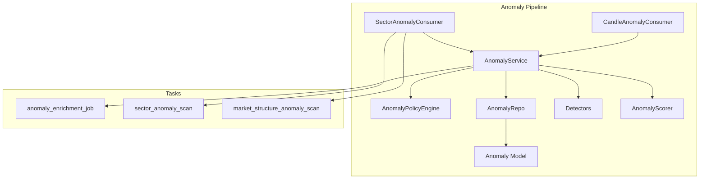
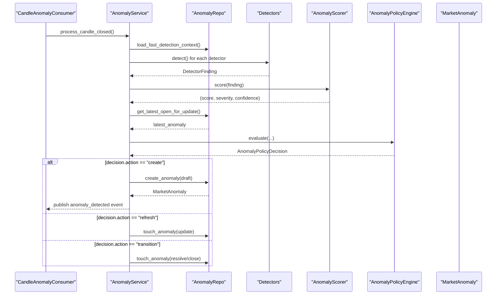
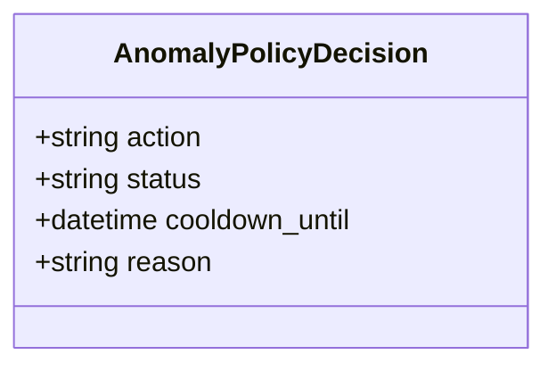
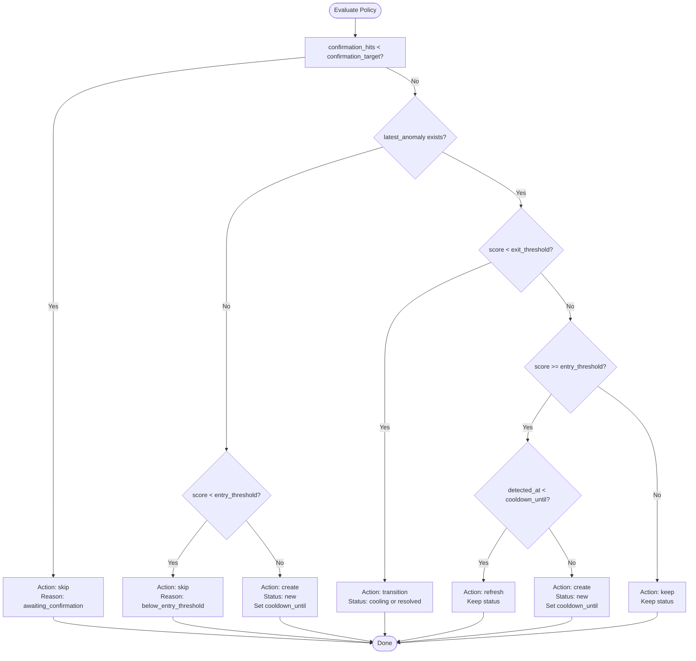
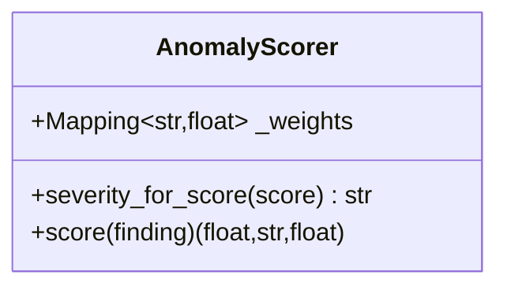
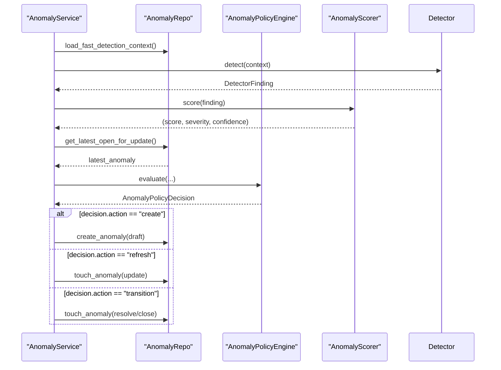
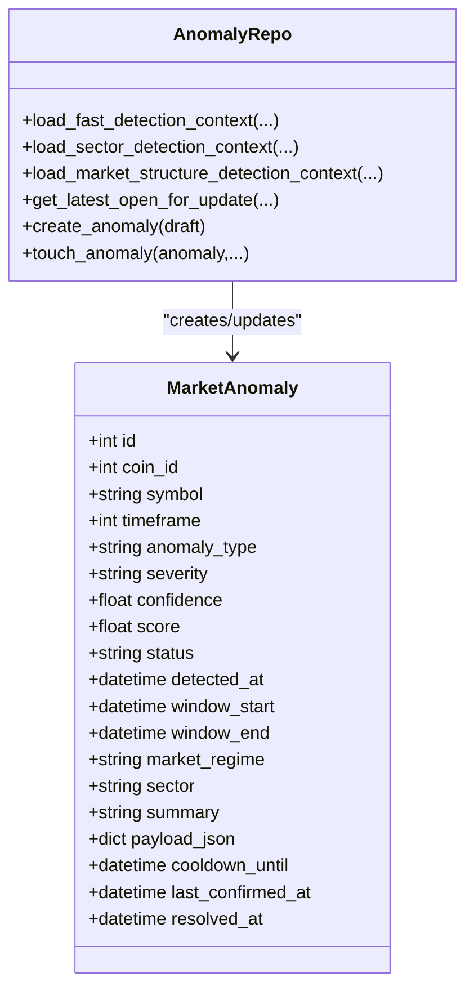
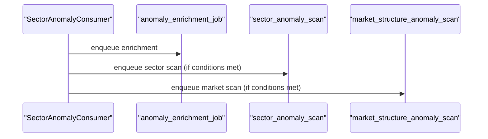
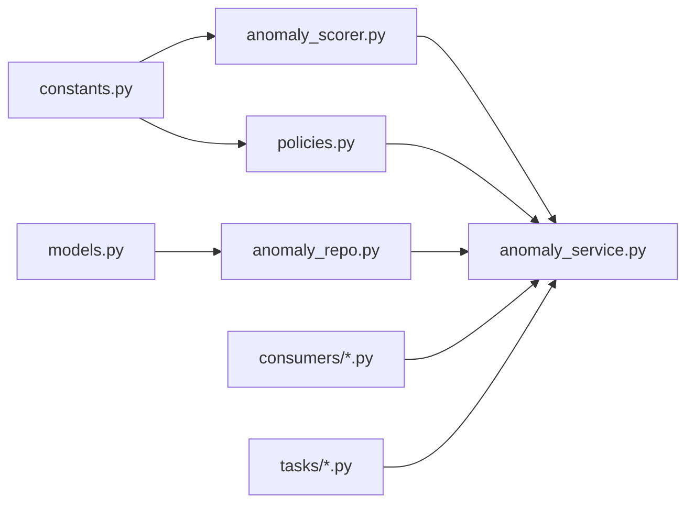

# Policy Management & Filtering

<cite>
**Referenced Files in This Document**
- [policies.py](file://src/apps/anomalies/policies.py)
- [constants.py](file://src/apps/anomalies/constants.py)
- [anomaly_service.py](file://src/apps/anomalies/services/anomaly_service.py)
- [anomaly_repo.py](file://src/apps/anomalies/repos/anomaly_repo.py)
- [schemas.py](file://src/apps/anomalies/schemas.py)
- [models.py](file://src/apps/anomalies/models.py)
- [anomaly_scorer.py](file://src/apps/anomalies/scoring/anomaly_scorer.py)
- [compression_expansion_detector.py](file://src/apps/anomalies/detectors/compression_expansion_detector.py)
- [correlation_breakdown_detector.py](file://src/apps/anomalies/detectors/correlation_breakdown_detector.py)
- [candle_anomaly_consumer.py](file://src/apps/anomalies/consumers/candle_anomaly_consumer.py)
- [sector_anomaly_consumer.py](file://src/apps/anomalies/consumers/sector_anomaly_consumer.py)
- [anomaly_enrichment_tasks.py](file://src/apps/anomalies/tasks/anomaly_enrichment_tasks.py)
- [test_policies.py](file://tests/apps/anomalies/test_policies.py)
</cite>

## Table of Contents
1. [Introduction](#introduction)
2. [Project Structure](#project-structure)
3. [Core Components](#core-components)
4. [Architecture Overview](#architecture-overview)
5. [Detailed Component Analysis](#detailed-component-analysis)
6. [Dependency Analysis](#dependency-analysis)
7. [Performance Considerations](#performance-considerations)
8. [Troubleshooting Guide](#troubleshooting-guide)
9. [Conclusion](#conclusion)
10. [Appendices](#appendices)

## Introduction
This document explains the policy management system for anomaly detection filtering and alerting control. It covers how policy-based filtering prevents false positives, manages alert frequency, and controls notification distribution. The system integrates time-based filters, asset class restrictions, market regime conditions, sector-specific rules, and custom filtering criteria. It also documents cooldown mechanisms, duplicate detection prevention, policy evaluation order, and dynamic policy adjustment capabilities. Examples of policy configurations, filtering scenarios, and integration with the anomaly detection pipeline are included.

## Project Structure
The policy management system resides in the anomalies subsystem and interacts with detectors, scorers, repositories, services, consumers, and tasks. The structure supports:
- Policy engine and decision model
- Detection and scoring
- Persistence and context loading
- Event-driven enrichment and follow-up scans
- Consumer-driven pipeline triggers

**Diagram sources**
- [candle_anomaly_consumer.py:13-23](file://src/apps/anomalies/consumers/candle_anomaly_consumer.py#L13-L23)
- [sector_anomaly_consumer.py:21-53](file://src/apps/anomalies/consumers/sector_anomaly_consumer.py#L21-L53)
- [anomaly_service.py:44-78](file://src/apps/anomalies/services/anomaly_service.py#L44-L78)
- [policies.py:24-83](file://src/apps/anomalies/policies.py#L24-L83)
- [anomaly_repo.py:27-563](file://src/apps/anomalies/repos/anomaly_repo.py#L27-L563)
- [anomaly_scorer.py:13-39](file://src/apps/anomalies/scoring/anomaly_scorer.py#L13-L39)
- [models.py:15-64](file://src/apps/anomalies/models.py#L15-L64)
- [anomaly_enrichment_tasks.py:16-86](file://src/apps/anomalies/tasks/anomaly_enrichment_tasks.py#L16-L86)

**Section sources**
- [policies.py:1-84](file://src/apps/anomalies/policies.py#L1-L84)
- [constants.py:1-113](file://src/apps/anomalies/constants.py#L1-L113)
- [anomaly_service.py:44-78](file://src/apps/anomalies/services/anomaly_service.py#L44-L78)
- [anomaly_repo.py:27-563](file://src/apps/anomalies/repos/anomaly_repo.py#L27-L563)
- [schemas.py:49-136](file://src/apps/anomalies/schemas.py#L49-L136)
- [models.py:15-124](file://src/apps/anomalies/models.py#L15-L124)
- [anomaly_scorer.py:13-39](file://src/apps/anomalies/scoring/anomaly_scorer.py#L13-L39)
- [compression_expansion_detector.py:67-135](file://src/apps/anomalies/detectors/compression_expansion_detector.py#L67-L135)
- [correlation_breakdown_detector.py:70-182](file://src/apps/anomalies/detectors/correlation_breakdown_detector.py#L70-L182)
- [candle_anomaly_consumer.py:9-24](file://src/apps/anomalies/consumers/candle_anomaly_consumer.py#L9-L24)
- [sector_anomaly_consumer.py:17-54](file://src/apps/anomalies/consumers/sector_anomaly_consumer.py#L17-L54)
- [anomaly_enrichment_tasks.py:16-86](file://src/apps/anomalies/tasks/anomaly_enrichment_tasks.py#L16-L86)

## Core Components
- Policy decision model: encapsulates action, status, cooldown, and reason.
- Policy engine: evaluates entry/exit thresholds, applies market regime multipliers, enforces cooldown, and decides whether to skip, keep, refresh, transition, or create anomalies.
- Scoring: computes weighted composite scores, severity bands, and confidence.
- Service orchestration: runs detectors, scores findings, consults policy, persists anomalies, publishes events, and triggers enrichment and follow-up scans.
- Repository: loads detection contexts (fast, sector, market structure), fetches latest open anomalies, creates and updates anomalies.
- Consumers: subscribe to events and trigger enrichment and secondary scans.
- Tasks: enforce concurrency and perform enrichment and scans.

Key configuration options:
- Entry and exit thresholds per anomaly type
- Cooldown minutes per anomaly type
- Market regime multipliers
- Severity bands
- Confirmation requirements for specific detectors

**Section sources**
- [policies.py:16-83](file://src/apps/anomalies/policies.py#L16-L83)
- [constants.py:54-112](file://src/apps/anomalies/constants.py#L54-L112)
- [anomaly_scorer.py:13-39](file://src/apps/anomalies/scoring/anomaly_scorer.py#L13-L39)
- [anomaly_service.py:243-340](file://src/apps/anomalies/services/anomaly_service.py#L243-L340)
- [anomaly_repo.py:437-563](file://src/apps/anomalies/repos/anomaly_repo.py#L437-L563)
- [candle_anomaly_consumer.py:13-23](file://src/apps/anomalies/consumers/candle_anomaly_consumer.py#L13-L23)
- [sector_anomaly_consumer.py:21-53](file://src/apps/anomalies/consumers/sector_anomaly_consumer.py#L21-L53)
- [anomaly_enrichment_tasks.py:16-86](file://src/apps/anomalies/tasks/anomaly_enrichment_tasks.py#L16-L86)

## Architecture Overview
The policy management system sits between detectors and persistence, mediating decisions based on thresholds, regime conditions, and cooldowns. It ensures that only validated anomalies are persisted and emitted, while preventing excessive alerts and false positives.

**Diagram sources**
- [candle_anomaly_consumer.py:13-23](file://src/apps/anomalies/consumers/candle_anomaly_consumer.py#L13-L23)
- [anomaly_service.py:80-111](file://src/apps/anomalies/services/anomaly_service.py#L80-L111)
- [anomaly_service.py:243-340](file://src/apps/anomalies/services/anomaly_service.py#L243-L340)
- [anomaly_repo.py:437-498](file://src/apps/anomalies/repos/anomaly_repo.py#L437-L498)
- [policies.py:39-83](file://src/apps/anomalies/policies.py#L39-L83)
- [models.py:15-64](file://src/apps/anomalies/models.py#L15-L64)

## Detailed Component Analysis

### Policy Decision Model
The decision model carries the outcome of policy evaluation, including action, status change, cooldown expiration, and reason for skipping.

**Diagram sources**
- [policies.py:16-22](file://src/apps/anomalies/policies.py#L16-L22)

**Section sources**
- [policies.py:16-22](file://src/apps/anomalies/policies.py#L16-L22)

### Policy Engine
The policy engine encapsulates:
- Entry and exit threshold computation adjusted by market regime multipliers
- Cooldown calculation per anomaly type
- Evaluation logic that:
  - Skips until confirmation targets are met
  - Transitions anomalies from active to cooling or resolved based on exit thresholds
  - Refreshes existing anomalies during cooldown windows
  - Creates new anomalies when thresholds are exceeded outside cooldown

**Diagram sources**
- [policies.py:24-83](file://src/apps/anomalies/policies.py#L24-L83)
- [constants.py:54-105](file://src/apps/anomalies/constants.py#L54-L105)

**Section sources**
- [policies.py:24-83](file://src/apps/anomalies/policies.py#L24-L83)
- [constants.py:54-105](file://src/apps/anomalies/constants.py#L54-L105)
- [test_policies.py:27-99](file://tests/apps/anomalies/test_policies.py#L27-L99)

### Scoring and Severity Assignment
The scorer:
- Computes a weighted composite score from detector components
- Applies severity bands to produce a severity label
- Produces confidence adjusted by isolation and component weights

**Diagram sources**
- [anomaly_scorer.py:13-39](file://src/apps/anomalies/scoring/anomaly_scorer.py#L13-L39)
- [constants.py:44-52](file://src/apps/anomalies/constants.py#L44-L52)
- [constants.py:107-112](file://src/apps/anomalies/constants.py#L107-L112)

**Section sources**
- [anomaly_scorer.py:13-39](file://src/apps/anomalies/scoring/anomaly_scorer.py#L13-L39)
- [constants.py:44-52](file://src/apps/anomalies/constants.py#L44-L52)
- [constants.py:107-112](file://src/apps/anomalies/constants.py#L107-L112)

### Service Orchestration and Policy Evaluation Order
The service orchestrates:
- Loading detection contexts (fast, sector, market structure)
- Running detectors and scoring findings
- Fetching latest open anomaly for the same asset/type
- Evaluating policy decisions
- Persisting anomalies and publishing events
- Triggering enrichment and follow-up scans

**Diagram sources**
- [anomaly_service.py:243-340](file://src/apps/anomalies/services/anomaly_service.py#L243-L340)
- [anomaly_repo.py:437-537](file://src/apps/anomalies/repos/anomaly_repo.py#L437-L537)
- [policies.py:39-83](file://src/apps/anomalies/policies.py#L39-L83)
- [anomaly_scorer.py:23-38](file://src/apps/anomalies/scoring/anomaly_scorer.py#L23-L38)

**Section sources**
- [anomaly_service.py:80-191](file://src/apps/anomalies/services/anomaly_service.py#L80-L191)
- [anomaly_service.py:243-340](file://src/apps/anomalies/services/anomaly_service.py#L243-L340)

### Persistence and Context Loading
The repository:
- Loads candles and benchmarks for fast-path detection
- Loads sector and related peers for sector synchrony detection
- Loads venue snapshots for market structure detection
- Retrieves the latest open anomaly for the same asset/type with row-level locking
- Creates and updates anomalies with fields such as severity, confidence, score, status, cooldown, and timestamps

**Diagram sources**
- [anomaly_repo.py:214-435](file://src/apps/anomalies/repos/anomaly_repo.py#L214-L435)
- [anomaly_repo.py:437-563](file://src/apps/anomalies/repos/anomaly_repo.py#L437-L563)
- [models.py:15-64](file://src/apps/anomalies/models.py#L15-L64)

**Section sources**
- [anomaly_repo.py:214-435](file://src/apps/anomalies/repos/anomaly_repo.py#L214-L435)
- [anomaly_repo.py:437-563](file://src/apps/anomalies/repos/anomaly_repo.py#L437-L563)
- [models.py:15-64](file://src/apps/anomalies/models.py#L15-L64)

### Event-Driven Enrichment and Follow-Up Scans
Consumers and tasks:
- Enrich anomalies after initial detection
- Trigger sector synchrony and market structure scans based on severity and type
- Enforce concurrency via task locks

**Diagram sources**
- [sector_anomaly_consumer.py:21-53](file://src/apps/anomalies/consumers/sector_anomaly_consumer.py#L21-L53)
- [anomaly_enrichment_tasks.py:16-86](file://src/apps/anomalies/tasks/anomaly_enrichment_tasks.py#L16-L86)

**Section sources**
- [sector_anomaly_consumer.py:17-54](file://src/apps/anomalies/consumers/sector_anomaly_consumer.py#L17-L54)
- [anomaly_enrichment_tasks.py:16-86](file://src/apps/anomalies/tasks/anomaly_enrichment_tasks.py#L16-L86)

### Example Detectors and Confirmation Requirements
- Compression expansion detector: detects volatility compression/expansion transitions and contributes components to the composite score.
- Correlation breakdown detector: measures correlation drop, beta shift, residual variance, and peer dispersion; requires confirmation over recent periods.

These detectors populate fields such as requires_confirmation, confirmation_hits, confirmation_target, and scope, which influence policy decisions.

**Section sources**
- [compression_expansion_detector.py:67-135](file://src/apps/anomalies/detectors/compression_expansion_detector.py#L67-L135)
- [correlation_breakdown_detector.py:70-182](file://src/apps/anomalies/detectors/correlation_breakdown_detector.py#L70-L182)
- [schemas.py:81-96](file://src/apps/anomalies/schemas.py#L81-L96)

## Dependency Analysis
The policy system exhibits clear separation of concerns:
- Policies depend on constants for thresholds, regime multipliers, and cooldowns
- Service depends on repo, scorer, and policy engine
- Repo depends on models and external domains for context
- Consumers and tasks depend on service for orchestration

**Diagram sources**
- [constants.py:54-112](file://src/apps/anomalies/constants.py#L54-L112)
- [policies.py:24-83](file://src/apps/anomalies/policies.py#L24-L83)
- [anomaly_scorer.py:13-39](file://src/apps/anomalies/scoring/anomaly_scorer.py#L13-L39)
- [anomaly_service.py:44-78](file://src/apps/anomalies/services/anomaly_service.py#L44-L78)
- [anomaly_repo.py:27-563](file://src/apps/anomalies/repos/anomaly_repo.py#L27-L563)
- [models.py:15-64](file://src/apps/anomalies/models.py#L15-L64)
- [candle_anomaly_consumer.py:13-23](file://src/apps/anomalies/consumers/candle_anomaly_consumer.py#L13-L23)
- [sector_anomaly_consumer.py:21-53](file://src/apps/anomalies/consumers/sector_anomaly_consumer.py#L21-L53)
- [anomaly_enrichment_tasks.py:16-86](file://src/apps/anomalies/tasks/anomaly_enrichment_tasks.py#L16-L86)

**Section sources**
- [constants.py:54-112](file://src/apps/anomalies/constants.py#L54-L112)
- [policies.py:24-83](file://src/apps/anomalies/policies.py#L24-L83)
- [anomaly_service.py:44-78](file://src/apps/anomalies/services/anomaly_service.py#L44-L78)
- [anomaly_repo.py:27-563](file://src/apps/anomalies/repos/anomaly_repo.py#L27-L563)

## Performance Considerations
- Concurrency control: task locks prevent overlapping enrichment and scans, reducing redundant work.
- Asynchronous unit of work: service commits only when changes occur, minimizing database overhead.
- Streaming: event publishing uses a synchronous enqueue API with background drain to avoid blocking the event loop.
- Selective context loading: repositories load only necessary candles and snapshots per detection pass.

[No sources needed since this section provides general guidance]

## Troubleshooting Guide
Common issues and resolutions:
- No anomaly created despite high score:
  - Verify confirmation_target is met; detectors may require confirmation_hits ≥ confirmation_target.
  - Check market regime multipliers affecting entry thresholds.
- Excessive alerts or no alerts:
  - Adjust cooldown minutes per anomaly type to tune alert frequency.
  - Review severity bands and component weights influencing score and confidence.
- Duplicate detections:
  - Ensure get_latest_open_for_update is used to fetch the latest anomaly and apply cooldown logic.
- Sector or market structure scans not triggering:
  - Confirm consumer conditions (severity levels, anomaly type, source pipeline) and task lock availability.

**Section sources**
- [test_policies.py:27-99](file://tests/apps/anomalies/test_policies.py#L27-L99)
- [policies.py:39-83](file://src/apps/anomalies/policies.py#L39-L83)
- [anomaly_repo.py:437-467](file://src/apps/anomalies/repos/anomaly_repo.py#L437-L467)
- [sector_anomaly_consumer.py:33-53](file://src/apps/anomalies/consumers/sector_anomaly_consumer.py#L33-L53)
- [anomaly_enrichment_tasks.py:16-86](file://src/apps/anomalies/tasks/anomaly_enrichment_tasks.py#L16-L86)

## Conclusion
The policy management system provides robust filtering and alerting control for anomaly detection. By combining time-based filters, market regime adjustments, confirmation requirements, and cooldown enforcement, it minimizes false positives and manages alert frequency. Integration with enrichment and follow-up scans ensures contextual awareness and timely resolution. Configuration via constants enables dynamic tuning of thresholds, cooldowns, and severity bands to adapt to changing market conditions.

[No sources needed since this section summarizes without analyzing specific files]

## Appendices

### Policy Configuration Options
- Per-anomaly-type thresholds:
  - Entry thresholds for initiating new anomalies
  - Exit thresholds for transitioning anomalies
- Market regime multipliers:
  - Adjust entry thresholds based on regime (e.g., high volatility)
- Cooldown minutes:
  - Time window to suppress repeated alerts for the same anomaly type
- Severity bands:
  - Map composite scores to severity labels
- Confirmation requirements:
  - Some detectors require confirmation_hits ≥ confirmation_target before creation

**Section sources**
- [constants.py:54-112](file://src/apps/anomalies/constants.py#L54-L112)
- [policies.py:28-37](file://src/apps/anomalies/policies.py#L28-L37)

### Filtering Scenarios and Examples
- Confirmation gating:
  - Correlation breakdown requires confirmation over recent periods before creating an anomaly.
- Regime-adjusted thresholds:
  - Entry thresholds increase in high-volatility regimes to reduce false positives.
- Cooldown enforcement:
  - During cooldown, existing anomalies are refreshed rather than re-created.
- Resolution transitions:
  - When score drops below exit thresholds, anomalies transition to cooling or resolved depending on current status.

**Section sources**
- [correlation_breakdown_detector.py:144-178](file://src/apps/anomalies/detectors/correlation_breakdown_detector.py#L144-L178)
- [policies.py:53-74](file://src/apps/anomalies/policies.py#L53-L74)
- [test_policies.py:44-99](file://tests/apps/anomalies/test_policies.py#L44-L99)

### Integration with Anomaly Detection Pipeline
- Candle closed events trigger fast-path detection and enrichment.
- Sector and market structure scans are enqueued based on severity and anomaly type.
- Events are published upon anomaly creation and consumed to trigger downstream actions.

**Section sources**
- [candle_anomaly_consumer.py:13-23](file://src/apps/anomalies/consumers/candle_anomaly_consumer.py#L13-L23)
- [sector_anomaly_consumer.py:21-53](file://src/apps/anomalies/consumers/sector_anomaly_consumer.py#L21-L53)
- [anomaly_service.py:325-340](file://src/apps/anomalies/services/anomaly_service.py#L325-L340)