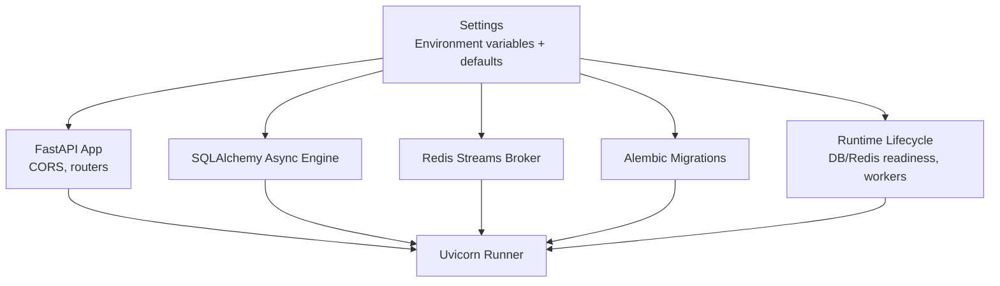
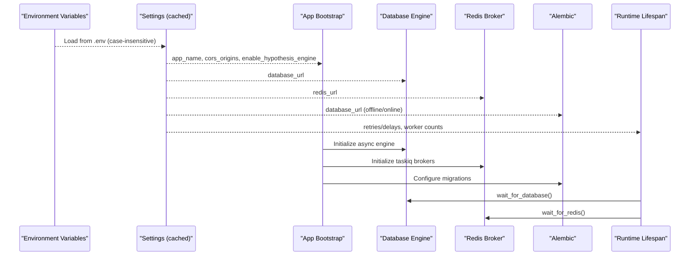
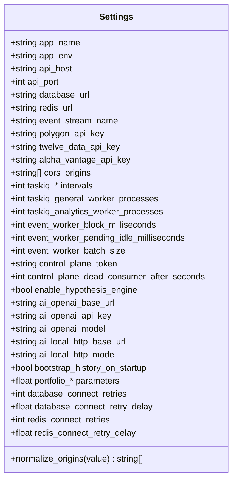
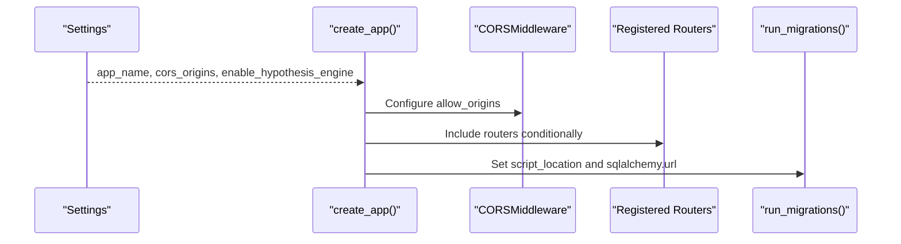
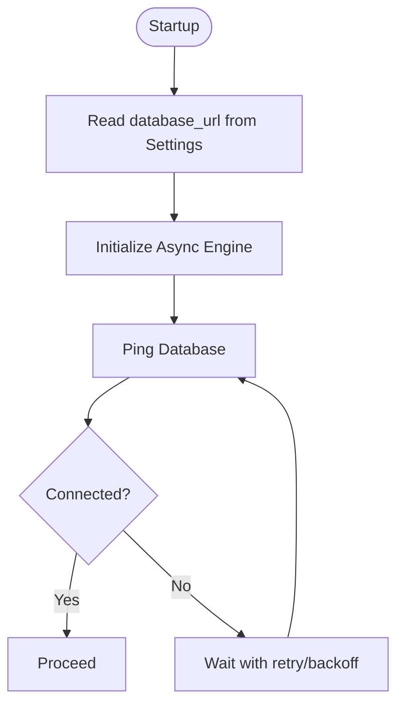
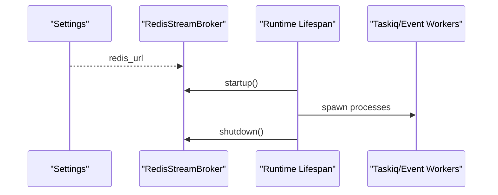
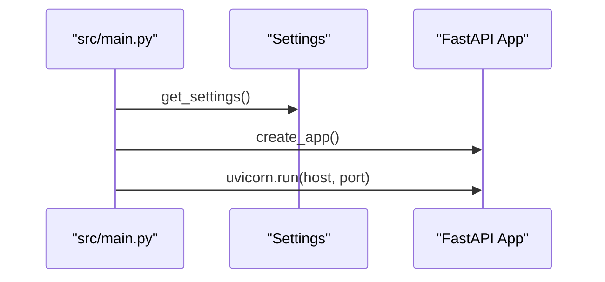
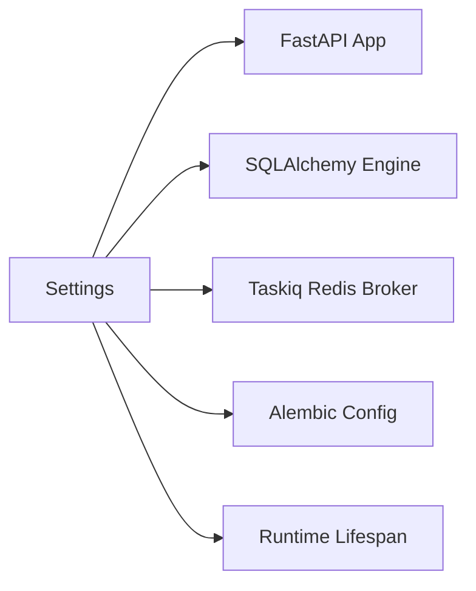

# Configuration Management

<cite>
**Referenced Files in This Document**
- [base.py](file://src/core/settings/base.py)
- [main.py](file://src/main.py)
- [app.py](file://src/core/bootstrap/app.py)
- [lifespan.py](file://src/core/bootstrap/lifespan.py)
- [session.py](file://src/core/db/session.py)
- [env.py](file://src/migrations/env.py)
- [broker.py](file://src/runtime/orchestration/broker.py)
- [locks.py](file://src/runtime/orchestration/locks.py)
- [pyproject.toml](file://pyproject.toml)
</cite>

## Table of Contents
1. [Introduction](#introduction)
2. [Project Structure](#project-structure)
3. [Core Components](#core-components)
4. [Architecture Overview](#architecture-overview)
5. [Detailed Component Analysis](#detailed-component-analysis)
6. [Dependency Analysis](#dependency-analysis)
7. [Performance Considerations](#performance-considerations)
8. [Troubleshooting Guide](#troubleshooting-guide)
9. [Conclusion](#conclusion)
10. [Appendices](#appendices)

## Introduction
This document explains configuration management across the IRIS platform. It covers environment variable configuration, settings validation, deployment-specific configurations, and runtime parameter management. It documents the settings hierarchy, default configurations, environment-specific overrides, and how database connections, Redis, exchange API credentials, and service dependencies are configured. It also provides guidance for development versus production setups, security considerations for sensitive settings, configuration validation, best practices for environment management, secrets handling, and preventing configuration drift.

## Project Structure
Configuration in IRIS is centralized around a single Pydantic-based settings class with environment variable mapping and caching. The settings are consumed by:
- Application bootstrap and FastAPI creation
- Database engine initialization
- Taskiq brokers and Redis connectivity
- Alembic migrations
- Runtime lifecycle initialization

**Diagram sources**
- [base.py:8-90](file://src/core/settings/base.py#L8-L90)
- [app.py:49-81](file://src/core/bootstrap/app.py#L49-L81)
- [session.py:19-45](file://src/core/db/session.py#L19-L45)
- [broker.py:12-22](file://src/runtime/orchestration/broker.py#L12-L22)
- [env.py:17-18](file://src/migrations/env.py#L17-L18)
- [lifespan.py:22-70](file://src/core/bootstrap/lifespan.py#L22-L70)
- [main.py:12-17](file://src/main.py#L12-L17)

**Section sources**
- [base.py:8-90](file://src/core/settings/base.py#L8-L90)
- [app.py:49-81](file://src/core/bootstrap/app.py#L49-L81)
- [session.py:19-45](file://src/core/db/session.py#L19-L45)
- [broker.py:12-22](file://src/runtime/orchestration/broker.py#L12-L22)
- [env.py:17-18](file://src/migrations/env.py#L17-L18)
- [lifespan.py:22-70](file://src/core/bootstrap/lifespan.py#L22-L70)
- [main.py:12-17](file://src/main.py#L12-L17)

## Core Components
- Centralized settings class with environment variable aliases and defaults
- LRU-cached settings accessor for performance
- Validation via Pydantic field validators
- Environment file support and case-insensitive loading
- Cross-cutting usage by FastAPI, database, Redis, and Alembic

Key configuration areas:
- Application identity and network binding
- Database connection URL
- Redis connection URL
- Event stream name
- Exchange API keys
- CORS origins normalization
- Taskiq scheduling intervals and worker counts
- Control plane token and dead consumer timeouts
- AI provider endpoints and models
- Portfolio risk parameters
- Retry/backoff parameters for DB and Redis connectivity

**Section sources**
- [base.py:8-90](file://src/core/settings/base.py#L8-L90)

## Architecture Overview
The configuration architecture follows a strict separation of concerns:
- Settings define the canonical configuration surface
- Bootstrap reads settings to configure FastAPI, middleware, and routers
- Database and Redis engines consume settings for connectivity
- Alembic consumes settings for offline/online migrations
- Runtime lifespan uses settings to coordinate readiness and lifecycle

**Diagram sources**
- [base.py:72-90](file://src/core/settings/base.py#L72-L90)
- [app.py:49-81](file://src/core/bootstrap/app.py#L49-L81)
- [session.py:19-45](file://src/core/db/session.py#L19-L45)
- [broker.py:12-22](file://src/runtime/orchestration/broker.py#L12-L22)
- [env.py:17-18](file://src/migrations/env.py#L17-L18)
- [lifespan.py:22-70](file://src/core/bootstrap/lifespan.py#L22-L70)

## Detailed Component Analysis

### Settings Model and Environment Variable Mapping
- Centralized configuration class with typed fields and environment aliases
- Defaults for development-friendly values
- Case-insensitive environment loading and ignored extras
- CORS origins normalization from comma-separated strings to lists

**Diagram sources**
- [base.py:8-90](file://src/core/settings/base.py#L8-L90)

**Section sources**
- [base.py:8-90](file://src/core/settings/base.py#L8-L90)

### FastAPI Application Bootstrap and Middleware
- FastAPI app is created with settings-driven title and CORS middleware
- Conditional inclusion of routers based on settings
- Alembic configuration updates SQLAlchemy URL from settings

**Diagram sources**
- [app.py:49-81](file://src/core/bootstrap/app.py#L49-L81)
- [app.py:37-42](file://src/core/bootstrap/app.py#L37-L42)

**Section sources**
- [app.py:49-81](file://src/core/bootstrap/app.py#L49-L81)

### Database Connectivity and Migration
- Asynchronous SQLAlchemy engine initialized from settings
- Synchronous engine retained for tests and legacy code
- Alembic offline/online migrations configured using settings
- Database readiness checks with retry/backoff

**Diagram sources**
- [session.py:19-45](file://src/core/db/session.py#L19-L45)
- [session.py:61-72](file://src/core/db/session.py#L61-L72)
- [env.py:17-18](file://src/migrations/env.py#L17-L18)

**Section sources**
- [session.py:19-45](file://src/core/db/session.py#L19-L45)
- [session.py:61-72](file://src/core/db/session.py#L61-L72)
- [env.py:17-18](file://src/migrations/env.py#L17-L18)

### Redis and Taskiq Integration
- Taskiq brokers configured from Redis URL
- Worker lifecycle coordinated via lifespan
- Redis readiness checks with retry/backoff

**Diagram sources**
- [broker.py:12-22](file://src/runtime/orchestration/broker.py#L12-L22)
- [lifespan.py:35-41](file://src/core/bootstrap/lifespan.py#L35-L41)

**Section sources**
- [broker.py:12-22](file://src/runtime/orchestration/broker.py#L12-L22)
- [locks.py:67-78](file://src/runtime/orchestration/locks.py#L67-L78)
- [lifespan.py:35-41](file://src/core/bootstrap/lifespan.py#L35-L41)

### Uvicorn Runtime and Settings Consumption
- Uvicorn runner binds to host/port from settings
- Main entry point initializes settings and creates the app

**Diagram sources**
- [main.py:8-17](file://src/main.py#L8-L17)

**Section sources**
- [main.py:8-17](file://src/main.py#L8-L17)

## Dependency Analysis
- Settings are consumed across the application boundary:
  - FastAPI bootstrap and middleware
  - Database engine initialization
  - Redis/Tasqik broker initialization
  - Alembic migration configuration
  - Runtime lifecycle readiness checks
- The settings accessor is cached to avoid repeated parsing and environment file reads

**Diagram sources**
- [base.py:87-90](file://src/core/settings/base.py#L87-L90)
- [app.py:49-81](file://src/core/bootstrap/app.py#L49-L81)
- [session.py:19-45](file://src/core/db/session.py#L19-L45)
- [broker.py:12-22](file://src/runtime/orchestration/broker.py#L12-L22)
- [env.py:17-18](file://src/migrations/env.py#L17-L18)
- [lifespan.py:22-70](file://src/core/bootstrap/lifespan.py#L22-L70)

**Section sources**
- [base.py:87-90](file://src/core/settings/base.py#L87-L90)
- [app.py:49-81](file://src/core/bootstrap/app.py#L49-L81)
- [session.py:19-45](file://src/core/db/session.py#L19-L45)
- [broker.py:12-22](file://src/runtime/orchestration/broker.py#L12-L22)
- [env.py:17-18](file://src/migrations/env.py#L17-L18)
- [lifespan.py:22-70](file://src/core/bootstrap/lifespan.py#L22-L70)

## Performance Considerations
- Settings are cached with a single-entry LRU cache to minimize repeated environment parsing overhead
- Database and Redis connectivity uses retry/backoff loops; tune retries and delays for your environment
- CORS origins normalization avoids expensive per-request parsing by converting a single string to a list once
- Alembic migrations run synchronously during startup; keep migrations minimal to reduce cold-start impact

[No sources needed since this section provides general guidance]

## Troubleshooting Guide
Common configuration issues and resolutions:
- Database connectivity failures
  - Verify DATABASE_URL correctness and network reachability
  - Increase database_connect_retries or database_connect_retry_delay for flaky environments
- Redis connectivity failures
  - Verify REDIS_URL correctness and network reachability
  - Increase redis_connect_retries or redis_connect_retry_delay for flaky environments
- CORS errors
  - Ensure CORS_ORIGINS is a comma-separated string or list; the validator normalizes it
  - Confirm allow_origins includes client origins used by the frontend
- Alembic migration failures
  - Confirm DATABASE_URL is correct and reachable
  - Run migrations offline or online depending on environment
- Taskiq/Redis queue issues
  - Confirm redis_url is correct and queues/consumer groups are accessible
  - Review worker process counts and intervals for workload capacity
- Exchange API credential issues
  - Set POLYGON_API_KEY, TWELVE_DATA_API_KEY, ALPHA_VANTAGE_API_KEY appropriately
  - Ensure keys are valid and have required permissions

**Section sources**
- [session.py:61-72](file://src/core/db/session.py#L61-L72)
- [locks.py:67-78](file://src/runtime/orchestration/locks.py#L67-L78)
- [base.py:79-84](file://src/core/settings/base.py#L79-L84)
- [env.py:17-18](file://src/migrations/env.py#L17-L18)
- [broker.py:12-22](file://src/runtime/orchestration/broker.py#L12-L22)
- [base.py:22-24](file://src/core/settings/base.py#L22-L24)

## Conclusion
IRIS centralizes configuration through a strongly-typed settings class with environment variable aliases, defaults, and validation. This approach ensures predictable behavior across environments, simplifies deployment-specific overrides, and reduces configuration drift. By leveraging the cached settings accessor and consistent consumption across FastAPI, database, Redis, and Alembic, IRIS achieves a clean separation of concerns and robust runtime behavior.

[No sources needed since this section summarizes without analyzing specific files]

## Appendices

### Settings Hierarchy and Overrides
- Environment file (.env) loaded with case-insensitive keys and ignored extras
- Environment variables override .env values
- Programmatic defaults apply when neither .env nor environment variables are present
- Validation normalizes certain fields (e.g., CORS origins) at load time

**Section sources**
- [base.py:72-84](file://src/core/settings/base.py#L72-L84)

### Development vs Production Guidance
- Development defaults are optimized for local iteration (e.g., localhost host, default ports, relaxed retries)
- Production should set explicit DATABASE_URL, REDIS_URL, API host/port, and sensitive keys
- Enable/disable optional features (e.g., hypothesis engine) via settings
- Use stricter CORS origins in production and enforce HTTPS

**Section sources**
- [base.py:8-20](file://src/core/settings/base.py#L8-L20)
- [base.py:53-58](file://src/core/settings/base.py#L53-L58)

### Security Considerations for Sensitive Settings
- Store secrets externally (e.g., secret managers or environment injection) and avoid committing .env files
- Restrict access to .env and CI/CD secrets
- Rotate API keys regularly and limit their scope
- Avoid logging sensitive values; sanitize logs and error messages

[No sources needed since this section provides general guidance]

### Best Practices for Environment Management and Drift Prevention
- Define a canonical .env template with comments for all keys
- Pin dependency versions via pyproject.toml and lock files
- Use separate .env files per environment (local, staging, prod) with CI/CD overlays
- Validate configuration at startup (use readiness checks and health endpoints)
- Automate configuration audits and diff checks in CI

**Section sources**
- [pyproject.toml:1-89](file://pyproject.toml#L1-L89)