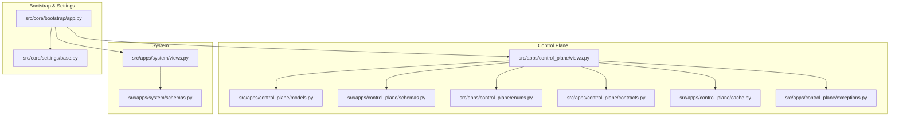
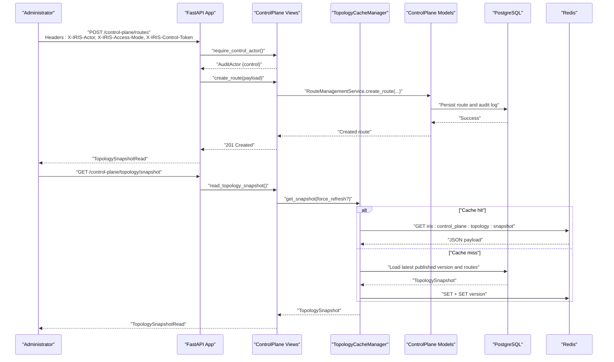
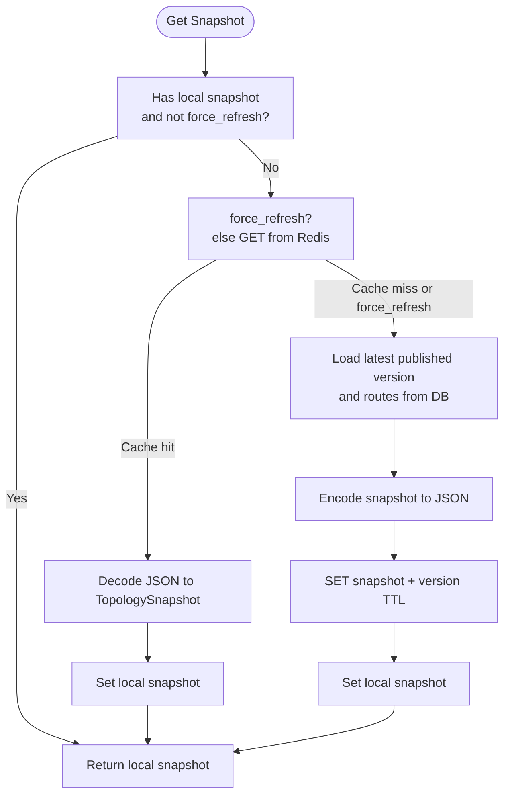
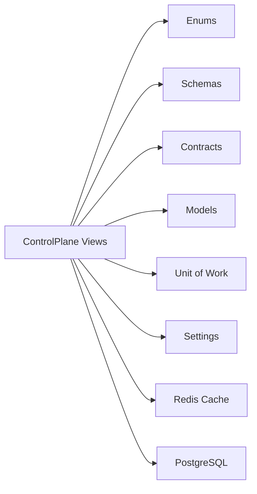

# Administrative Operations

<cite>
**Referenced Files in This Document**
- [views.py](file://src/apps/control_plane/views.py)
- [cache.py](file://src/apps/control_plane/cache.py)
- [models.py](file://src/apps/control_plane/models.py)
- [schemas.py](file://src/apps/control_plane/schemas.py)
- [enums.py](file://src/apps/control_plane/enums.py)
- [contracts.py](file://src/apps/control_plane/contracts.py)
- [exceptions.py](file://src/apps/control_plane/exceptions.py)
- [views.py](file://src/apps/system/views.py)
- [schemas.py](file://src/apps/system/schemas.py)
- [app.py](file://src/core/bootstrap/app.py)
- [base.py](file://src/core/settings/base.py)
</cite>

## Table of Contents
1. [Introduction](#introduction)
2. [Project Structure](#project-structure)
3. [Core Components](#core-components)
4. [Architecture Overview](#architecture-overview)
5. [Detailed Component Analysis](#detailed-component-analysis)
6. [Dependency Analysis](#dependency-analysis)
7. [Performance Considerations](#performance-considerations)
8. [Troubleshooting Guide](#troubleshooting-guide)
9. [Conclusion](#conclusion)
10. [Appendices](#appendices)

## Introduction
This document describes administrative operations and system management capabilities centered on the control plane topology and system health endpoints. It covers:
- Administrative endpoints for topology configuration, route management, and lifecycle controls
- Cache management for control plane topology snapshots
- Operational dashboards and observability surfaces
- Security controls, access modes, and audit trails
- Practical examples of administrative tasks and system maintenance procedures

## Project Structure
Administrative and system management functionality is primarily implemented under the control plane and system application packages, integrated into the FastAPI application via routers and services.

**Diagram sources**
- [app.py:49-80](file://src/core/bootstrap/app.py#L49-L80)
- [views.py:59-479](file://src/apps/control_plane/views.py#L59-L479)
- [cache.py:235-279](file://src/apps/control_plane/cache.py#L235-L279)
- [models.py:15-259](file://src/apps/control_plane/models.py#L15-L259)
- [schemas.py:1-304](file://src/apps/control_plane/schemas.py#L1-L304)
- [enums.py:1-65](file://src/apps/control_plane/enums.py#L1-L65)
- [contracts.py:1-244](file://src/apps/control_plane/contracts.py#L1-L244)
- [exceptions.py:1-46](file://src/apps/control_plane/exceptions.py#L1-L46)
- [views.py:1-53](file://src/apps/system/views.py#L1-L53)
- [schemas.py:1-27](file://src/apps/system/schemas.py#L1-L27)
- [base.py:8-90](file://src/core/settings/base.py#L8-L90)

**Section sources**
- [app.py:49-80](file://src/core/bootstrap/app.py#L49-L80)
- [views.py:59-479](file://src/apps/control_plane/views.py#L59-L479)
- [views.py:1-53](file://src/apps/system/views.py#L1-L53)

## Core Components
- Control plane administrative endpoints: topology registry, routes, drafts, audit log, and observability
- Control plane cache: topology snapshot caching and invalidation
- System status and health: runtime system status and health checks
- Access control and audit: access modes, control tokens, and audit logs
- Data models and schemas: topology entities, route configurations, and observability payloads

**Section sources**
- [views.py:59-479](file://src/apps/control_plane/views.py#L59-L479)
- [cache.py:235-279](file://src/apps/control_plane/cache.py#L235-L279)
- [views.py:1-53](file://src/apps/system/views.py#L1-L53)
- [models.py:15-259](file://src/apps/control_plane/models.py#L15-L259)
- [schemas.py:1-304](file://src/apps/control_plane/schemas.py#L1-L304)
- [enums.py:1-65](file://src/apps/control_plane/enums.py#L1-L65)
- [contracts.py:1-244](file://src/apps/control_plane/contracts.py#L1-L244)
- [exceptions.py:1-46](file://src/apps/control_plane/exceptions.py#L1-L46)

## Architecture Overview
Administrative operations are exposed via a dedicated control plane router with strict access controls and audit logging. Topology snapshots are cached for performance and invalidated on control-plane events. System endpoints expose runtime status and health.

**Diagram sources**
- [views.py:59-479](file://src/apps/control_plane/views.py#L59-L479)
- [cache.py:235-279](file://src/apps/control_plane/cache.py#L235-L279)
- [models.py:15-259](file://src/apps/control_plane/models.py#L15-L259)

## Detailed Component Analysis

### Control Plane Administrative Endpoints
- Registry endpoints: list event definitions and consumers, and compatible consumers per event
- Route endpoints: create, update, update status, and list routes
- Topology endpoints: snapshot and graph
- Draft lifecycle: create, add changes, preview diff, apply, discard
- Audit log: recent audit entries
- Observability: overview of throughput, failures, shadow/muted/dead states

Access control:
- Requires control access mode and a valid control token header
- Enforces actor identity, reason, and surface context in audit records

Operational controls:
- Route throttling, shadow sampling, filters, and scoping
- Status transitions (active, muted, paused, throttled, shadow, disabled)
- Draft-based change management with preview and atomic application

Security and audit:
- All mutations record audit actions with before/after snapshots and actor metadata
- Control mode enforced for topology mutations

**Section sources**
- [views.py:263-479](file://src/apps/control_plane/views.py#L263-L479)
- [enums.py:6-65](file://src/apps/control_plane/enums.py#L6-L65)
- [schemas.py:42-304](file://src/apps/control_plane/schemas.py#L42-L304)
- [contracts.py:117-122](file://src/apps/control_plane/contracts.py#L117-L122)
- [models.py:157-247](file://src/apps/control_plane/models.py#L157-L247)

### Control Plane Cache Management
Topology snapshots are cached in Redis with a time-to-live and a separate version key. The cache manager:
- Loads from cache when available and not forced to refresh
- Falls back to loading from the database and persists encoded snapshots to Redis
- Invalidates cache entries and refreshes on control-plane events

**Diagram sources**
- [cache.py:246-268](file://src/apps/control_plane/cache.py#L246-L268)

**Section sources**
- [cache.py:235-279](file://src/apps/control_plane/cache.py#L235-L279)

### System Status and Health
- System status endpoint aggregates taskiq worker health and market data source status
- Health endpoint validates database connectivity

**Section sources**
- [views.py:1-53](file://src/apps/system/views.py#L1-L53)
- [schemas.py:6-27](file://src/apps/system/schemas.py#L6-L27)

### Access Controls, Tokens, and Audit Trails
- Access mode parsing enforces either observe or control
- Control token validation against settings
- AuditActor captures actor identity, mode, reason, and surface context
- Audit logs capture actions, snapshots, and JSON diffs

**Section sources**
- [views.py:63-109](file://src/apps/control_plane/views.py#L63-L109)
- [base.py:51-52](file://src/core/settings/base.py#L51-L52)
- [contracts.py:117-122](file://src/apps/control_plane/contracts.py#L117-L122)
- [models.py:221-247](file://src/apps/control_plane/models.py#L221-L247)

### Data Models and Schemas
Key entities:
- EventDefinition: event registry with domains and control flags
- EventConsumer: consumer registry with delivery and compatibility metadata
- EventRoute: route configuration with status, scope, filters, throttle, shadow, and system-managed flag
- TopologyConfigVersion: published topology versions
- TopologyDraft and TopologyDraftChange: draft lifecycle and change payloads
- EventRouteAuditLog: audit trail entries

Schemas define request/response shapes for routes, topology snapshots/graphs, drafts, and observability.

**Section sources**
- [models.py:15-259](file://src/apps/control_plane/models.py#L15-L259)
- [schemas.py:1-304](file://src/apps/control_plane/schemas.py#L1-L304)
- [enums.py:1-65](file://src/apps/control_plane/enums.py#L1-L65)
- [contracts.py:182-244](file://src/apps/control_plane/contracts.py#L182-L244)

## Dependency Analysis
Administrative operations depend on:
- FastAPI routers and dependency injection for unit-of-work and settings
- SQLAlchemy models for persistence
- Redis for topology snapshot caching
- Pydantic schemas for request/response validation

**Diagram sources**
- [views.py:59-479](file://src/apps/control_plane/views.py#L59-L479)
- [enums.py:1-65](file://src/apps/control_plane/enums.py#L1-L65)
- [schemas.py:1-304](file://src/apps/control_plane/schemas.py#L1-L304)
- [contracts.py:1-244](file://src/apps/control_plane/contracts.py#L1-L244)
- [models.py:15-259](file://src/apps/control_plane/models.py#L15-L259)
- [cache.py:36-38](file://src/apps/control_plane/cache.py#L36-L38)
- [base.py:8-90](file://src/core/settings/base.py#L8-L90)

**Section sources**
- [views.py:59-479](file://src/apps/control_plane/views.py#L59-L479)
- [cache.py:36-38](file://src/apps/control_plane/cache.py#L36-L38)
- [base.py:8-90](file://src/core/settings/base.py#L8-L90)

## Performance Considerations
- Topology snapshot caching reduces database load and latency for topology reads
- Cache TTL balances freshness and performance; refresh on control-plane events ensures consistency
- Route filtering, throttling, and shadow sampling help manage throughput and risk during operational changes
- Observability endpoints aggregate metrics for quick diagnostics

[No sources needed since this section provides general guidance]

## Troubleshooting Guide
Common administrative issues and resolutions:
- Control mode required: ensure X-IRIS-Access-Mode is set to control and X-IRIS-Control-Token matches configured token
- Route conflicts or compatibility errors: review event-consumer compatibility and scope combinations
- Draft state errors: confirm draft status and lifecycle transitions (create → add changes → preview diff → apply/discard)
- Cache inconsistencies: invalidate topology cache to force refresh after control-plane changes

**Section sources**
- [views.py:88-106](file://src/apps/control_plane/views.py#L88-L106)
- [exceptions.py:16-45](file://src/apps/control_plane/exceptions.py#L16-L45)
- [cache.py:260-268](file://src/apps/control_plane/cache.py#L260-L268)

## Conclusion
The administrative subsystem provides a secure, auditable, and observable control plane for managing topology routes, consumers, and event definitions. It integrates robust caching, access controls, and lifecycle management for safe operational changes while exposing system health and observability surfaces for monitoring.

[No sources needed since this section summarizes without analyzing specific files]

## Appendices

### Administrative Endpoints Reference
- GET /control-plane/registry/events
- GET /control-plane/registry/consumers
- GET /control-plane/registry/events/{event_type}/compatible-consumers
- GET /control-plane/routes
- POST /control-plane/routes
- PUT /control-plane/routes/{route_key:path}
- POST /control-plane/routes/{route_key:path}/status
- GET /control-plane/topology/snapshot
- GET /control-plane/topology/graph
- GET /control-plane/drafts
- POST /control-plane/drafts
- POST /control-plane/drafts/{draft_id}/changes
- GET /control-plane/drafts/{draft_id}/diff
- POST /control-plane/drafts/{draft_id}/apply
- POST /control-plane/drafts/{draft_id}/discard
- GET /control-plane/audit
- GET /control-plane/observability
- GET /system/status
- GET /system/health

Headers:
- X-IRIS-Actor: operator identity
- X-IRIS-Access-Mode: observe or control
- X-IRIS-Reason: operational reason
- X-IRIS-Control-Token: secret token when control mode is required

**Section sources**
- [views.py:263-479](file://src/apps/control_plane/views.py#L263-L479)
- [views.py:37-53](file://src/apps/system/views.py#L37-L53)