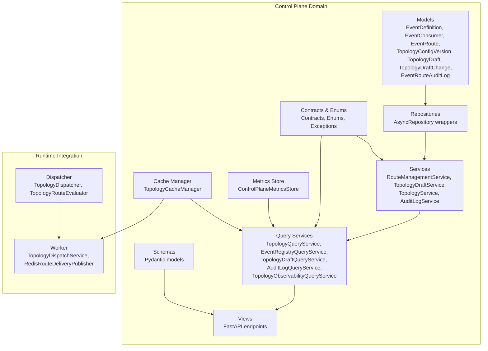
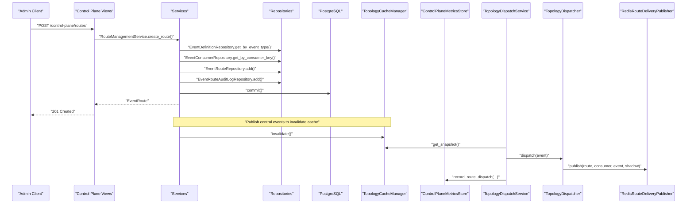
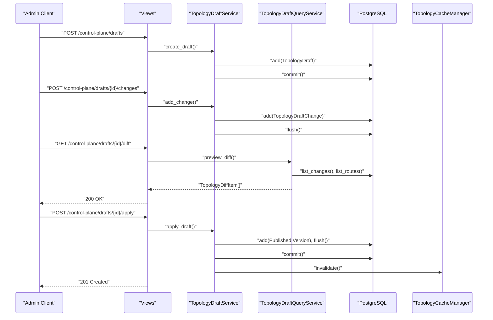
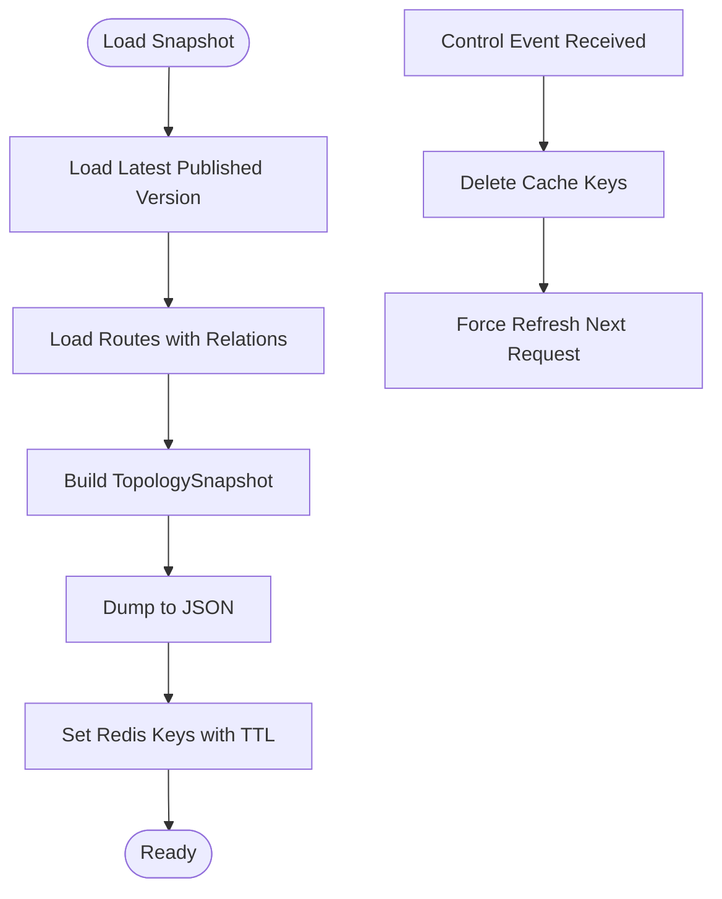
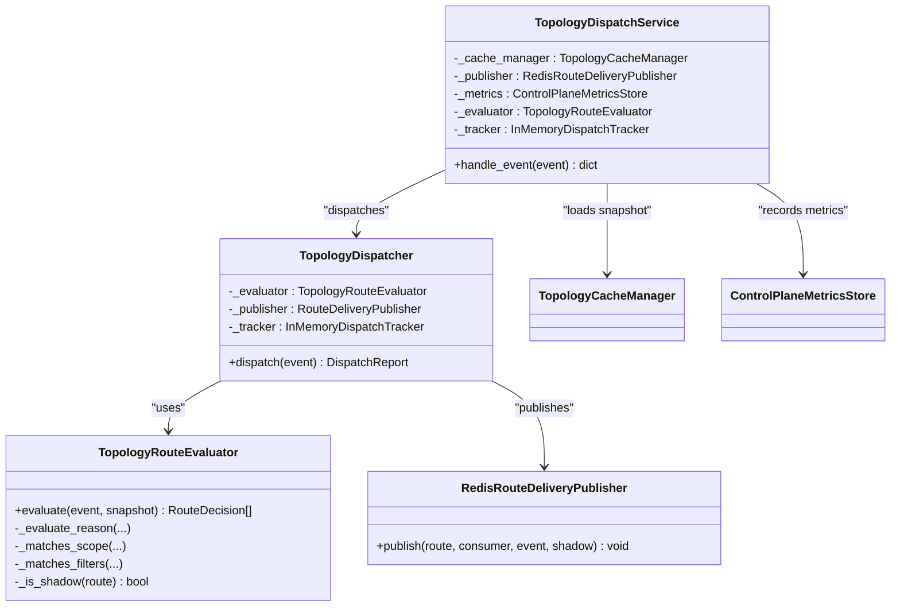
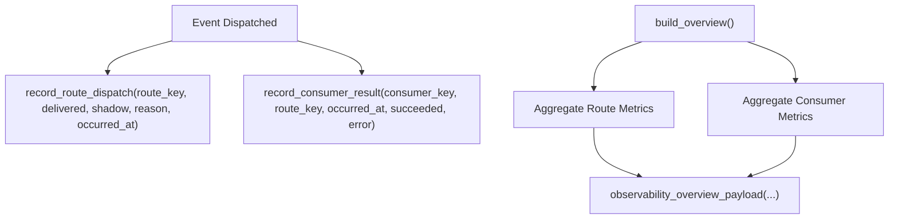
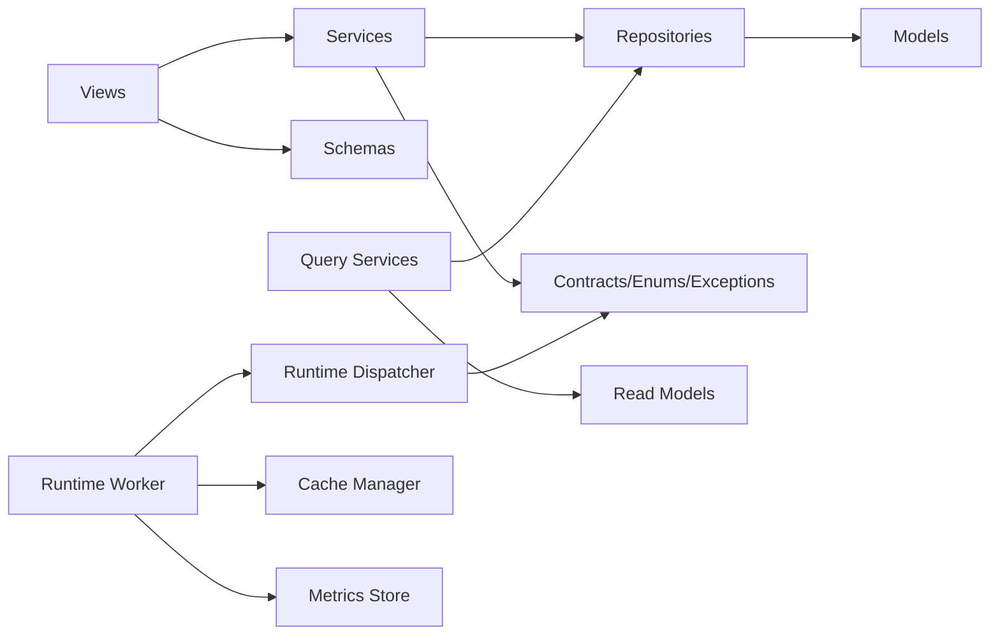
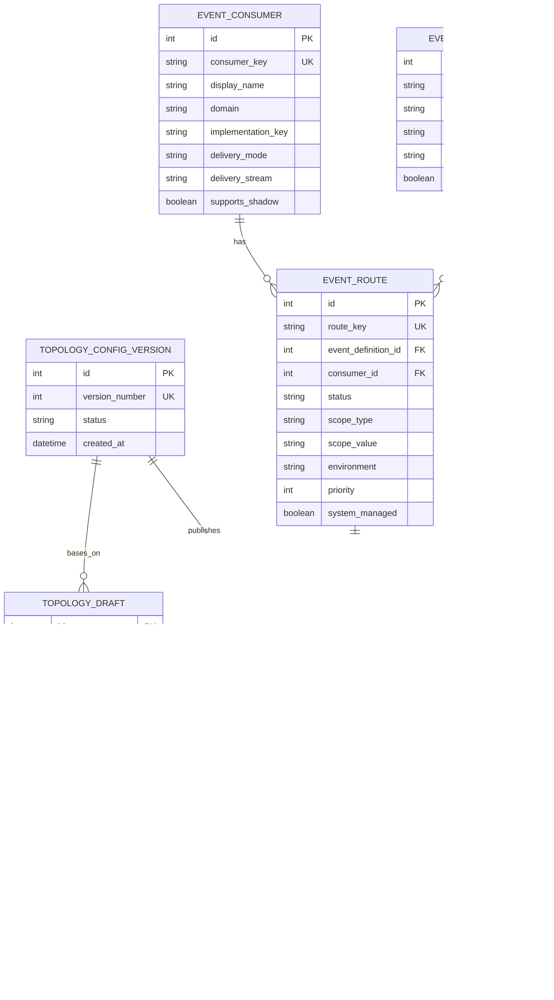

# Control Plane

<cite>
**Referenced Files in This Document**
- [__init__.py](file://src/apps/control_plane/__init__.py)
- [cache.py](file://src/apps/control_plane/cache.py)
- [contracts.py](file://src/apps/control_plane/contracts.py)
- [control_events.py](file://src/apps/control_plane/control_events.py)
- [enums.py](file://src/apps/control_plane/enums.py)
- [exceptions.py](file://src/apps/control_plane/exceptions.py)
- [models.py](file://src/apps/control_plane/models.py)
- [metrics.py](file://src/apps/control_plane/metrics.py)
- [query_services.py](file://src/apps/control_plane/query_services.py)
- [read_models.py](file://src/apps/control_plane/read_models.py)
- [repositories.py](file://src/apps/control_plane/repositories.py)
- [schemas.py](file://src/apps/control_plane/schemas.py)
- [services.py](file://src/apps/control_plane/services.py)
- [views.py](file://src/apps/control_plane/views.py)
- [dispatcher.py](file://src/runtime/control_plane/dispatcher.py)
- [worker.py](file://src/runtime/control_plane/worker.py)
</cite>

## Table of Contents
1. [Introduction](#introduction)
2. [Project Structure](#project-structure)
3. [Core Components](#core-components)
4. [Architecture Overview](#architecture-overview)
5. [Detailed Component Analysis](#detailed-component-analysis)
6. [Dependency Analysis](#dependency-analysis)
7. [Performance Considerations](#performance-considerations)
8. [Troubleshooting Guide](#troubleshooting-guide)
9. [Conclusion](#conclusion)
10. [Appendices](#appendices)

## Introduction
This document describes the control plane system that manages event routing topology, administrative operations, and observability for the runtime orchestration layer. It covers:
- Administrative functions: creating, updating, and auditing event routes; managing topology drafts and publishing versions.
- Metrics collection and operational monitoring: route and consumer metrics, observability overview.
- System state management: topology snapshots, cache management, and control-plane events.
- Integration with runtime orchestration: dispatcher evaluation, throttling, and delivery to consumer streams.
- Operational dashboards: topology graph and snapshot endpoints; audit logs and observability overview.

## Project Structure
The control plane is organized around domain models, repositories, services, query services, schemas, and FastAPI views. Runtime integration is provided via a dispatcher and worker that consume events, evaluate routes against a cached topology, and publish to downstream streams.

**Diagram sources**
- [models.py:15-247](file://src/apps/control_plane/models.py#L15-L247)
- [repositories.py:19-257](file://src/apps/control_plane/repositories.py#L19-L257)
- [services.py:140-758](file://src/apps/control_plane/services.py#L140-L758)
- [query_services.py:272-720](file://src/apps/control_plane/query_services.py#L272-L720)
- [contracts.py:15-243](file://src/apps/control_plane/contracts.py#L15-L243)
- [enums.py:6-64](file://src/apps/control_plane/enums.py#L6-L64)
- [exceptions.py:4-45](file://src/apps/control_plane/exceptions.py#L4-L45)
- [schemas.py:17-304](file://src/apps/control_plane/schemas.py#L17-L304)
- [views.py:263-479](file://src/apps/control_plane/views.py#L263-L479)
- [metrics.py:29-123](file://src/apps/control_plane/metrics.py#L29-L123)
- [cache.py:41-279](file://src/apps/control_plane/cache.py#L41-L279)
- [dispatcher.py:114-312](file://src/runtime/control_plane/dispatcher.py#L114-L312)
- [worker.py:61-131](file://src/runtime/control_plane/worker.py#L61-L131)

**Section sources**
- [__init__.py:1-108](file://src/apps/control_plane/__init__.py#L1-L108)
- [views.py:263-479](file://src/apps/control_plane/views.py#L263-L479)

## Core Components
- Models define the persistent topology: event definitions, consumers, routes, topology versions, drafts, changes, and audit logs.
- Repositories encapsulate CRUD and queries for the control plane domain.
- Services implement administrative workflows: route creation/update/status change, draft lifecycle, topology publishing, and audit logging.
- Query services build read models for topology snapshots, graphs, diffs, and observability.
- Contracts and enums define typed structures and enumerations for routes, scopes, statuses, and draft changes.
- Metrics store records per-route and per-consumer telemetry.
- Cache manager maintains a Redis-backed topology snapshot with TTL and invalidation on control-plane events.
- Runtime dispatcher evaluates events against the cached topology and publishes to consumer streams.
- Worker integrates cache, dispatcher, and metrics to process events and maintain dispatch counters.

**Section sources**
- [models.py:15-247](file://src/apps/control_plane/models.py#L15-L247)
- [repositories.py:19-257](file://src/apps/control_plane/repositories.py#L19-L257)
- [services.py:140-758](file://src/apps/control_plane/services.py#L140-L758)
- [query_services.py:272-720](file://src/apps/control_plane/query_services.py#L272-L720)
- [contracts.py:15-243](file://src/apps/control_plane/contracts.py#L15-L243)
- [enums.py:6-64](file://src/apps/control_plane/enums.py#L6-L64)
- [metrics.py:29-123](file://src/apps/control_plane/metrics.py#L29-L123)
- [cache.py:41-279](file://src/apps/control_plane/cache.py#L41-L279)
- [dispatcher.py:114-312](file://src/runtime/control_plane/dispatcher.py#L114-L312)
- [worker.py:61-131](file://src/runtime/control_plane/worker.py#L61-L131)

## Architecture Overview
The control plane exposes administrative and observability APIs backed by SQL and Redis. Runtime workers consume events, consult a cached topology snapshot, evaluate routing decisions, and publish to downstream streams. Control-plane events trigger cache invalidation to keep runtime dispatchers aligned with the latest topology.

**Diagram sources**
- [views.py:295-327](file://src/apps/control_plane/views.py#L295-L327)
- [services.py:205-346](file://src/apps/control_plane/services.py#L205-L346)
- [repositories.py:107-118](file://src/apps/control_plane/repositories.py#L107-L118)
- [cache.py:260-268](file://src/apps/control_plane/cache.py#L260-L268)
- [worker.py:78-105](file://src/runtime/control_plane/worker.py#L78-L105)
- [dispatcher.py:280-297](file://src/runtime/control_plane/dispatcher.py#L280-L297)
- [metrics.py:33-97](file://src/apps/control_plane/metrics.py#L33-L97)

## Detailed Component Analysis

### Administrative Endpoints and Workflows
- Registry endpoints: list event definitions and consumers; list compatible consumers for an event type.
- Route management: create, update, and change status of routes with validation and audit logging.
- Draft lifecycle: create drafts, add changes, preview diff, apply or discard drafts; apply publishes a new topology version.
- Audit logs: list recent audit entries for route changes.
- Observability overview: aggregated throughput, failures, shadow/muted counts, and per-route/per-consumer metrics.

**Diagram sources**
- [views.py:366-447](file://src/apps/control_plane/views.py#L366-L447)
- [services.py:423-541](file://src/apps/control_plane/services.py#L423-L541)
- [query_services.py:472-578](file://src/apps/control_plane/query_services.py#L472-L578)
- [cache.py:260-268](file://src/apps/control_plane/cache.py#L260-L268)

**Section sources**
- [views.py:263-479](file://src/apps/control_plane/views.py#L263-L479)
- [services.py:411-541](file://src/apps/control_plane/services.py#L411-L541)
- [query_services.py:472-578](file://src/apps/control_plane/query_services.py#L472-L578)

### System State Management and Cache
- TopologySnapshotLoader builds a snapshot from the latest published version and joins related entities.
- TopologySnapshotCodec serializes/deserializes snapshots for storage.
- TopologyCacheManager caches the snapshot in Redis with TTL and invalidates on control-plane events.
- Control events include route updates, status changes, and topology publication.

**Diagram sources**
- [cache.py:41-130](file://src/apps/control_plane/cache.py#L41-L130)
- [cache.py:133-232](file://src/apps/control_plane/cache.py#L133-L232)
- [cache.py:235-279](file://src/apps/control_plane/cache.py#L235-L279)
- [control_events.py:14-22](file://src/apps/control_plane/control_events.py#L14-L22)

**Section sources**
- [cache.py:41-279](file://src/apps/control_plane/cache.py#L41-L279)
- [control_events.py:14-45](file://src/apps/control_plane/control_events.py#L14-L45)

### Runtime Orchestration Integration
- TopologyRouteEvaluator evaluates an event against the cached topology, applying scope matching, filters, throttling, and status rules.
- TopologyDispatcher coordinates evaluation and publishing via a publisher protocol.
- TopologyDispatchService orchestrates cache retrieval, dispatcher invocation, and metrics recording.
- RedisRouteDeliveryPublisher writes structured event payloads to consumer delivery streams.

**Diagram sources**
- [dispatcher.py:114-312](file://src/runtime/control_plane/dispatcher.py#L114-L312)
- [worker.py:61-131](file://src/runtime/control_plane/worker.py#L61-L131)

**Section sources**
- [dispatcher.py:114-312](file://src/runtime/control_plane/dispatcher.py#L114-L312)
- [worker.py:61-131](file://src/runtime/control_plane/worker.py#L61-L131)

### Metrics Collection and Observability
- ControlPlaneMetricsStore records per-route and per-consumer metrics: evaluated/delivered/skipped counts, latency aggregates, timestamps, and reasons.
- TopologyObservabilityQueryService computes an observability overview aggregating route and consumer metrics.
- Schemas define read models for observability responses.

**Diagram sources**
- [metrics.py:29-123](file://src/apps/control_plane/metrics.py#L29-L123)
- [query_services.py:595-706](file://src/apps/control_plane/query_services.py#L595-L706)
- [schemas.py:257-304](file://src/apps/control_plane/schemas.py#L257-L304)

**Section sources**
- [metrics.py:29-123](file://src/apps/control_plane/metrics.py#L29-L123)
- [query_services.py:595-706](file://src/apps/control_plane/query_services.py#L595-L706)
- [schemas.py:257-304](file://src/apps/control_plane/schemas.py#L257-L304)

### Administrative Endpoints Reference
- GET /control-plane/registry/events
- GET /control-plane/registry/consumers
- GET /control-plane/registry/events/{event_type}/compatible-consumers
- GET /control-plane/routes
- POST /control-plane/routes
- PUT /control-plane/routes/{route_key:path}
- POST /control-plane/routes/{route_key:path}/status
- GET /control-plane/topology/snapshot
- GET /control-plane/topology/graph
- GET /control-plane/drafts
- POST /control-plane/drafts
- POST /control-plane/drafts/{draft_id}/changes
- GET /control-plane/drafts/{draft_id}/diff
- POST /control-plane/drafts/{draft_id}/apply
- POST /control-plane/drafts/{draft_id}/discard
- GET /control-plane/audit
- GET /control-plane/observability

Access control:
- X-IRIS-Access-Mode must be "control" for mutation endpoints.
- X-IRIS-Control-Token must match configured token.

**Section sources**
- [views.py:263-479](file://src/apps/control_plane/views.py#L263-L479)

## Dependency Analysis
The control plane follows layered architecture:
- Views depend on services and schemas.
- Services depend on repositories, models, contracts, enums, and exceptions.
- Query services depend on repositories and read models.
- Runtime dispatcher depends on contracts and runtime stream types.
- Worker depends on cache, dispatcher, metrics, and runtime consumer infrastructure.

**Diagram sources**
- [views.py:263-479](file://src/apps/control_plane/views.py#L263-L479)
- [services.py:140-758](file://src/apps/control_plane/services.py#L140-L758)
- [repositories.py:19-257](file://src/apps/control_plane/repositories.py#L19-L257)
- [models.py:15-247](file://src/apps/control_plane/models.py#L15-L247)
- [contracts.py:15-243](file://src/apps/control_plane/contracts.py#L15-L243)
- [enums.py:6-64](file://src/apps/control_plane/enums.py#L6-L64)
- [exceptions.py:4-45](file://src/apps/control_plane/exceptions.py#L4-L45)
- [read_models.py:18-323](file://src/apps/control_plane/read_models.py#L18-L323)
- [dispatcher.py:114-312](file://src/runtime/control_plane/dispatcher.py#L114-L312)
- [worker.py:61-131](file://src/runtime/control_plane/worker.py#L61-L131)
- [cache.py:41-279](file://src/apps/control_plane/cache.py#L41-L279)
- [metrics.py:29-123](file://src/apps/control_plane/metrics.py#L29-L123)

**Section sources**
- [__init__.py:1-108](file://src/apps/control_plane/__init__.py#L1-L108)

## Performance Considerations
- Cache hit/miss: TopologyCacheManager uses Redis with TTL to minimize database load; force-refresh on control events ensures low-latency propagation.
- Evaluation cost: TopologyRouteEvaluator sorts routes by priority and applies early exits for incompatible consumers/environment/scope/filters/status/throttle.
- Metrics aggregation: Hash-based metrics reduce memory footprint; latency aggregates are maintained incrementally.
- Batch consumption: Runtime worker uses configurable batch sizes and blocking reads to balance throughput and latency.

## Troubleshooting Guide
Common errors and resolutions:
- EventRouteConflict: A route key already exists; choose a unique key or update the existing route.
- EventRouteNotFound: Route key not found; verify the key or recreate the route.
- EventRouteCompatibilityError: Consumer does not declare support for the event type; align consumer compatibility.
- TopologyDraftNotFound: Draft ID does not exist; re-check the draft identifier.
- TopologyDraftStateError: Draft is not in a state allowing the requested operation; rebase or re-open the draft.
- Access control failures: Ensure X-IRIS-Access-Mode is "control" and X-IRIS-Control-Token matches configuration.

Operational checks:
- Verify cache keys exist and TTL is set; invalidate and refresh if stale.
- Confirm control-plane events are published to trigger cache invalidation.
- Review audit logs for recent actions and reasons.
- Inspect observability overview for dead consumers and high failure rates.

**Section sources**
- [exceptions.py:4-45](file://src/apps/control_plane/exceptions.py#L4-L45)
- [views.py:88-106](file://src/apps/control_plane/views.py#L88-L106)
- [cache.py:260-268](file://src/apps/control_plane/cache.py#L260-L268)
- [query_services.py:595-706](file://src/apps/control_plane/query_services.py#L595-L706)

## Conclusion
The control plane provides a robust, auditable, and observable foundation for managing event routing topology. It offers safe administrative workflows, efficient caching, and seamless integration with runtime dispatchers. Administrators can manage routes, draft and publish topology changes, monitor health, and drive operational dashboards—all while maintaining strong separation of concerns and extensibility.

## Appendices

### Data Model Overview

**Diagram sources**
- [models.py:15-247](file://src/apps/control_plane/models.py#L15-L247)