# Event Management

<cite>
**Referenced Files in This Document**
- [models.py](file://src/apps/control_plane/models.py)
- [schemas.py](file://src/apps/control_plane/schemas.py)
- [services.py](file://src/apps/control_plane/services.py)
- [repositories.py](file://src/apps/control_plane/repositories.py)
- [contracts.py](file://src/apps/control_plane/contracts.py)
- [enums.py](file://src/apps/control_plane/enums.py)
- [control_events.py](file://src/apps/control_plane/control_events.py)
- [query_services.py](file://src/apps/control_plane/query_services.py)
- [read_models.py](file://src/apps/control_plane/read_models.py)
- [views.py](file://src/apps/control_plane/views.py)
- [router.py](file://src/runtime/streams/router.py)
- [consumer.py](file://src/runtime/streams/consumer.py)
- [publisher.py](file://src/runtime/streams/publisher.py)
- [types.py](file://src/runtime/streams/types.py)
</cite>

## Table of Contents
1. [Introduction](#introduction)
2. [Project Structure](#project-structure)
3. [Core Components](#core-components)
4. [Architecture Overview](#architecture-overview)
5. [Detailed Component Analysis](#detailed-component-analysis)
6. [Dependency Analysis](#dependency-analysis)
7. [Performance Considerations](#performance-considerations)
8. [Troubleshooting Guide](#troubleshooting-guide)
9. [Conclusion](#conclusion)
10. [Appendices](#appendices)

## Introduction
This document describes the event management system within the control plane. It explains how event definitions are created, how event consumers register themselves, and how event routes connect producers to consumers. It documents the EventDefinition model (event types, domains, payload schemas), EventConsumer configuration (delivery modes, implementation keys, compatibility), and the EventRoute system (filtering, throttling, shadow configurations). It also covers lifecycle management, status tracking, and audit logging for operational visibility, and provides practical examples for creating events, registering consumers, and configuring routes.

## Project Structure
The event management system spans the control plane application and the runtime streams subsystem:
- Control plane: models, schemas, services, repositories, queries, views, enums, contracts, and control events define the topology and governance of event routing.
- Runtime streams: publisher, consumer, router, and types implement the event bus and worker consumption.

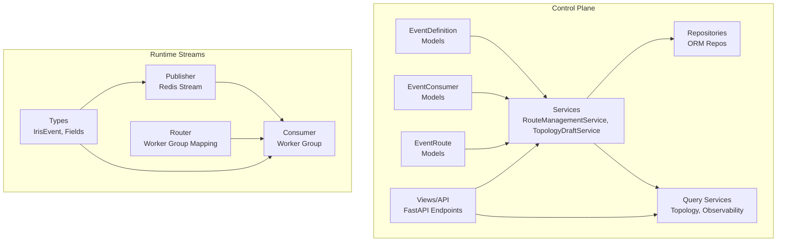

**Diagram sources**
- [models.py:15-200](file://src/apps/control_plane/models.py#L15-L200)
- [services.py:193-759](file://src/apps/control_plane/services.py#L193-L759)
- [repositories.py:19-259](file://src/apps/control_plane/repositories.py#L19-L259)
- [query_services.py:341-720](file://src/apps/control_plane/query_services.py#L341-L720)
- [views.py:295-479](file://src/apps/control_plane/views.py#L295-L479)
- [publisher.py:22-101](file://src/runtime/streams/publisher.py#L22-L101)
- [consumer.py:49-230](file://src/runtime/streams/consumer.py#L49-L230)
- [router.py:17-63](file://src/runtime/streams/router.py#L17-L63)
- [types.py:51-165](file://src/runtime/streams/types.py#L51-L165)

**Section sources**
- [models.py:15-200](file://src/apps/control_plane/models.py#L15-L200)
- [services.py:193-759](file://src/apps/control_plane/services.py#L193-L759)
- [repositories.py:19-259](file://src/apps/control_plane/repositories.py#L19-L259)
- [query_services.py:341-720](file://src/apps/control_plane/query_services.py#L341-L720)
- [views.py:295-479](file://src/apps/control_plane/views.py#L295-L479)
- [publisher.py:22-101](file://src/runtime/streams/publisher.py#L22-L101)
- [consumer.py:49-230](file://src/runtime/streams/consumer.py#L49-L230)
- [router.py:17-63](file://src/runtime/streams/router.py#L17-L63)
- [types.py:51-165](file://src/runtime/streams/types.py#L51-L165)

## Core Components
- EventDefinition: Defines event types, display names, domains, descriptions, control-event flags, and JSON schemas for payloads and routing hints. It maintains a collection of related routes.
- EventConsumer: Describes consumer capabilities including domain, delivery mode/stream, implementation key, compatibility with event types, filter/scopes support, and settings. It maintains a collection of related routes.
- EventRoute: Connects an EventDefinition to an EventConsumer, with status, scope (global/domain/symbol/exchange/timeframe/environment), environment selector, filters, throttling, shadow configuration, priority, and system-managed flag. It records audit logs.
- Control Events: Publishes control-plane events for topology changes and cache invalidation.
- Services: RouteManagementService handles creation/update/status changes with compatibility checks and audit logging; TopologyDraftService manages draft lifecycles and applies changes; AuditLogService persists audit logs.
- Repositories: Provide ORM-backed CRUD and lookup operations for all entities.
- Query Services: Build topology snapshots, graphs, diffs, and observability overviews.
- Views: Expose REST endpoints for registry, routes, topology, drafts, audit logs, and observability.

**Section sources**
- [models.py:15-200](file://src/apps/control_plane/models.py#L15-L200)
- [schemas.py:42-120](file://src/apps/control_plane/schemas.py#L42-L120)
- [services.py:193-759](file://src/apps/control_plane/services.py#L193-L759)
- [repositories.py:19-259](file://src/apps/control_plane/repositories.py#L19-L259)
- [query_services.py:341-720](file://src/apps/control_plane/query_services.py#L341-L720)
- [views.py:295-479](file://src/apps/control_plane/views.py#L295-L479)
- [control_events.py:8-46](file://src/apps/control_plane/control_events.py#L8-L46)

## Architecture Overview
The control plane governs event topology via REST APIs and stores state in relational models. Runtime workers consume events from a Redis stream, filtered by worker groups and event types.

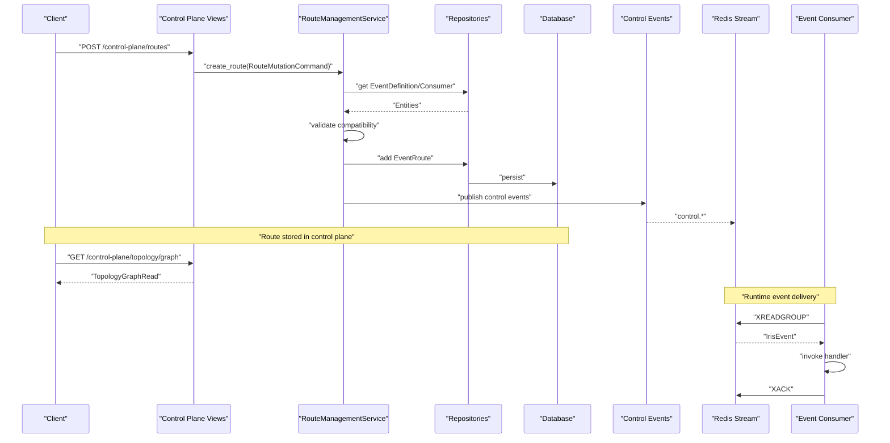

**Diagram sources**
- [views.py:295-346](file://src/apps/control_plane/views.py#L295-L346)
- [services.py:205-253](file://src/apps/control_plane/services.py#L205-L253)
- [repositories.py:73-118](file://src/apps/control_plane/repositories.py#L73-L118)
- [control_events.py:25-34](file://src/apps/control_plane/control_events.py#L25-L34)
- [consumer.py:190-217](file://src/runtime/streams/consumer.py#L190-L217)
- [types.py:156-165](file://src/runtime/streams/types.py#L156-L165)

## Detailed Component Analysis

### EventDefinition Model
- Purpose: Define canonical event types with metadata and schemas.
- Key attributes:
  - event_type (unique), display_name, domain, description
  - is_control_event flag
  - payload_schema_json and routing_hints_json for validation and hints
  - created_at/updated_at timestamps
- Relationships: Has many EventRoute entries.

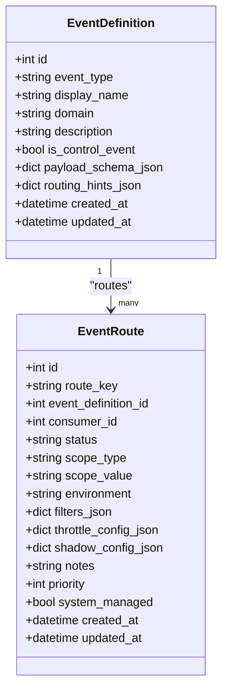

**Diagram sources**
- [models.py:15-44](file://src/apps/control_plane/models.py#L15-L44)
- [models.py:157-200](file://src/apps/control_plane/models.py#L157-L200)

**Section sources**
- [models.py:15-44](file://src/apps/control_plane/models.py#L15-L44)

### EventConsumer Model
- Purpose: Describe consumers and their capabilities.
- Key attributes:
  - consumer_key (unique), display_name, domain, description
  - implementation_key, delivery_mode, delivery_stream
  - supports_shadow, compatible_event_types_json, supported_filter_fields_json, supported_scopes_json
  - settings_json
  - created_at/updated_at
- Relationships: Has many EventRoute entries.

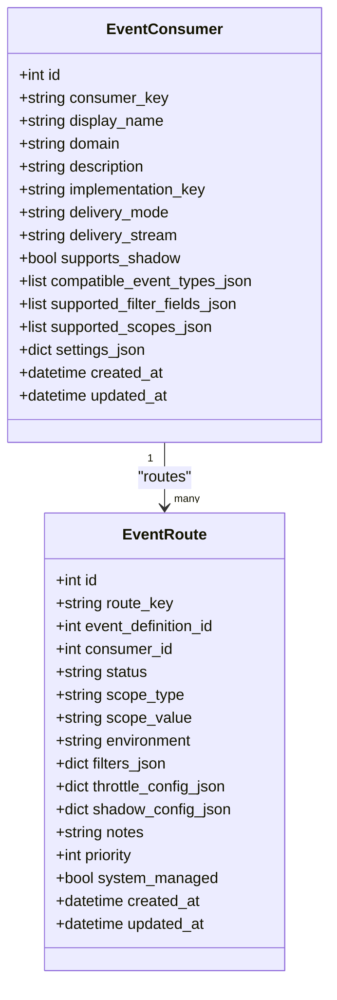

**Diagram sources**
- [models.py:46-79](file://src/apps/control_plane/models.py#L46-L79)
- [models.py:157-200](file://src/apps/control_plane/models.py#L157-L200)

**Section sources**
- [models.py:46-79](file://src/apps/control_plane/models.py#L46-L79)

### EventRoute Model and Routing Configuration
- Purpose: Connect EventDefinition to EventConsumer with routing policy.
- Key attributes:
  - route_key (unique), status, scope_type/scope_value, environment
  - filters_json, throttle_config_json, shadow_config_json
  - notes, priority, system_managed
- Relationships: Belongs to EventDefinition and EventConsumer; has audit logs.

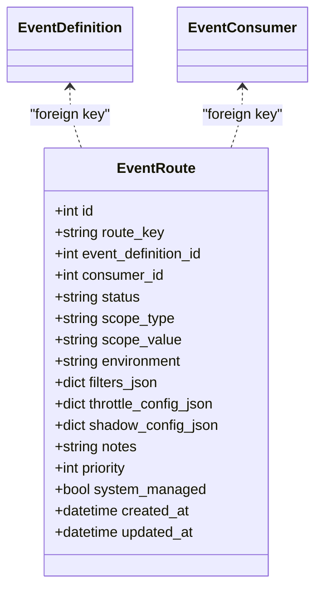

**Diagram sources**
- [models.py:157-200](file://src/apps/control_plane/models.py#L157-L200)

**Section sources**
- [models.py:157-200](file://src/apps/control_plane/models.py#L157-L200)

### Route Filters, Throttle, Shadow Contracts
- Filters: Support symbol, timeframe, exchange lists, confidence threshold, and arbitrary metadata filters.
- Throttle: Limit per-window events.
- Shadow: Enable sampling and observe-only behavior.

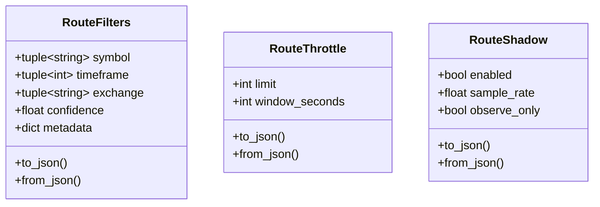

**Diagram sources**
- [contracts.py:39-114](file://src/apps/control_plane/contracts.py#L39-L114)

**Section sources**
- [contracts.py:39-114](file://src/apps/control_plane/contracts.py#L39-L114)

### Route Management Service
- Responsibilities:
  - Create/update routes with compatibility checks against EventDefinition and EventConsumer.
  - Enforce uniqueness of route_key.
  - Persist changes and emit control-plane events.
  - Log audit trail with before/after snapshots.
- Status change updates route status and notes.

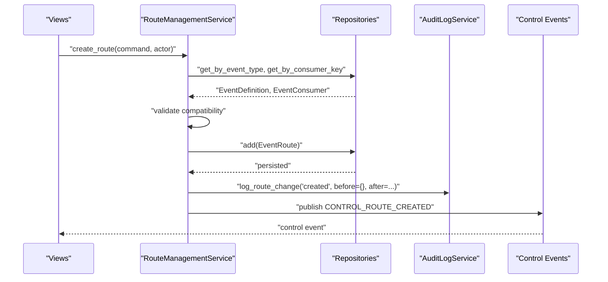

**Diagram sources**
- [services.py:205-253](file://src/apps/control_plane/services.py#L205-L253)
- [services.py:140-175](file://src/apps/control_plane/services.py#L140-L175)
- [control_events.py:25-34](file://src/apps/control_plane/control_events.py#L25-L34)

**Section sources**
- [services.py:193-365](file://src/apps/control_plane/services.py#L193-L365)

### Topology Draft Service
- Manages draft lifecycles:
  - Create draft, add changes (create/update/delete/status-change), preview diff, apply draft, discard draft.
- Applies changes atomically, validates compatibility, and logs audit actions.
- Emits topology published and cache invalidation control events upon successful application.

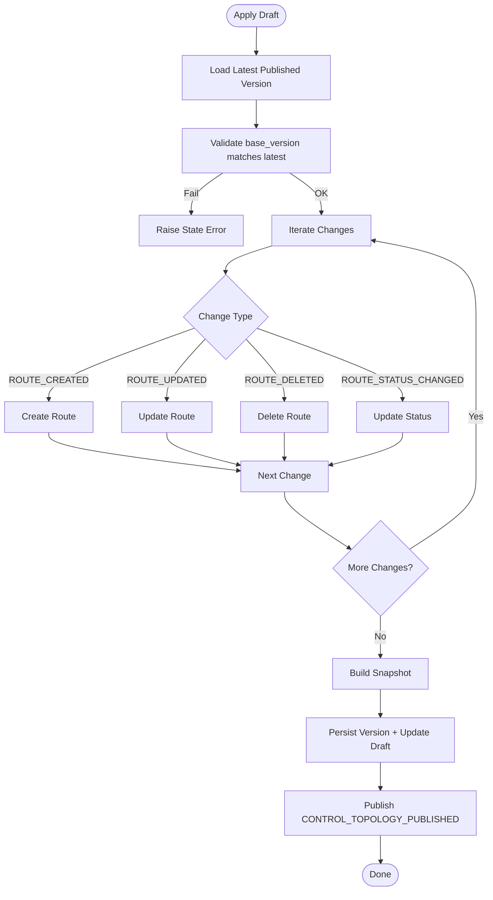

**Diagram sources**
- [services.py:460-520](file://src/apps/control_plane/services.py#L460-L520)
- [services.py:543-615](file://src/apps/control_plane/services.py#L543-L615)
- [control_events.py:25-34](file://src/apps/control_plane/control_events.py#L25-L34)

**Section sources**
- [services.py:411-542](file://src/apps/control_plane/services.py#L411-L542)

### Audit Logging
- Captures route changes with before/after snapshots, actor, reason, and context.
- Supports listing recent audit logs.

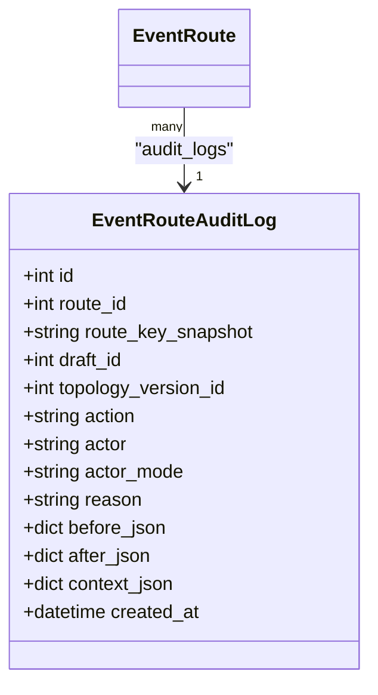

**Diagram sources**
- [models.py:221-247](file://src/apps/control_plane/models.py#L221-L247)

**Section sources**
- [services.py:140-175](file://src/apps/control_plane/services.py#L140-L175)
- [repositories.py:120-149](file://src/apps/control_plane/repositories.py#L120-L149)

### Runtime Event Delivery
- Publisher: Asynchronously publishes events to Redis stream with background drain thread.
- Consumer: Reads from Redis stream using XREADGROUP, supports stale claim, idempotency key, ack, and metrics recording.
- Router: Maps worker groups to event types for subscription.

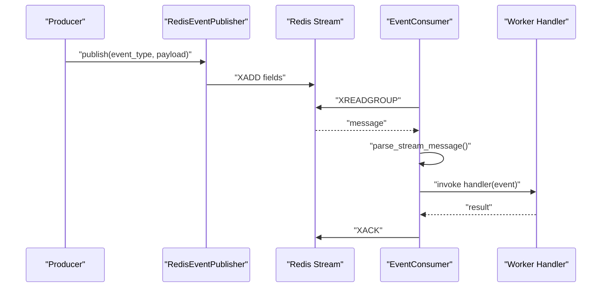

**Diagram sources**
- [publisher.py:38-88](file://src/runtime/streams/publisher.py#L38-L88)
- [consumer.py:190-217](file://src/runtime/streams/consumer.py#L190-L217)
- [types.py:156-165](file://src/runtime/streams/types.py#L156-L165)

**Section sources**
- [publisher.py:22-101](file://src/runtime/streams/publisher.py#L22-L101)
- [consumer.py:49-230](file://src/runtime/streams/consumer.py#L49-L230)
- [router.py:17-63](file://src/runtime/streams/router.py#L17-L63)
- [types.py:51-165](file://src/runtime/streams/types.py#L51-L165)

## Dependency Analysis
- Control plane depends on:
  - Models for persistence and relationships
  - Repositories for ORM operations
  - Services for business logic and control events
  - Query services for topology and observability
  - Views for REST exposure
- Runtime streams depend on:
  - Types for event structure and serialization
  - Publisher/Consumer for stream I/O
  - Router for worker group mapping

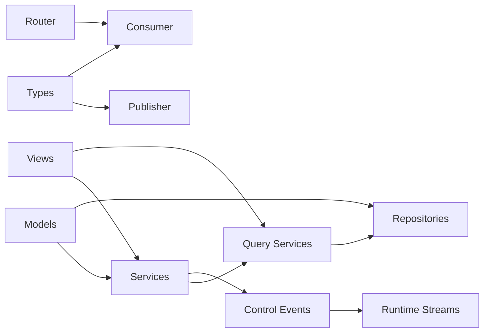

**Diagram sources**
- [models.py:15-200](file://src/apps/control_plane/models.py#L15-L200)
- [services.py:193-759](file://src/apps/control_plane/services.py#L193-L759)
- [repositories.py:19-259](file://src/apps/control_plane/repositories.py#L19-L259)
- [query_services.py:341-720](file://src/apps/control_plane/query_services.py#L341-L720)
- [views.py:295-479](file://src/apps/control_plane/views.py#L295-L479)
- [control_events.py:25-34](file://src/apps/control_plane/control_events.py#L25-L34)
- [publisher.py:22-101](file://src/runtime/streams/publisher.py#L22-L101)
- [consumer.py:49-230](file://src/runtime/streams/consumer.py#L49-L230)
- [router.py:17-63](file://src/runtime/streams/router.py#L17-L63)
- [types.py:51-165](file://src/runtime/streams/types.py#L51-L165)

**Section sources**
- [models.py:15-200](file://src/apps/control_plane/models.py#L15-L200)
- [services.py:193-759](file://src/apps/control_plane/services.py#L193-L759)
- [repositories.py:19-259](file://src/apps/control_plane/repositories.py#L19-L259)
- [query_services.py:341-720](file://src/apps/control_plane/query_services.py#L341-L720)
- [views.py:295-479](file://src/apps/control_plane/views.py#L295-L479)
- [publisher.py:22-101](file://src/runtime/streams/publisher.py#L22-L101)
- [consumer.py:49-230](file://src/runtime/streams/consumer.py#L49-L230)
- [router.py:17-63](file://src/runtime/streams/router.py#L17-L63)
- [types.py:51-165](file://src/runtime/streams/types.py#L51-L165)

## Performance Considerations
- Event routing and topology queries use joined loads to minimize N+1 selects.
- Audit logs and observability metrics are computed on demand; cache invalidation events trigger downstream recomputation.
- Stream publishing uses a background thread to avoid blocking the main loop; consumers batch reads and handle stale claims efficiently.
- Route filters, throttle, and shadow configurations are stored as JSON and normalized for efficient comparisons.

[No sources needed since this section provides general guidance]

## Troubleshooting Guide
Common issues and resolutions:
- Route creation conflicts: Ensure route_key is unique; the system raises a conflict error if it already exists.
- Compatibility errors: Consumers must declare compatibility with the event type; otherwise, route creation/update fails.
- Draft state errors: Drafts must be in draft status and match the latest published topology version to apply.
- Access control: Control-plane mutations require control mode and a valid control token.
- Audit visibility: Use the audit endpoint to inspect recent route changes with before/after snapshots.

**Section sources**
- [services.py:205-253](file://src/apps/control_plane/services.py#L205-L253)
- [services.py:460-520](file://src/apps/control_plane/services.py#L460-L520)
- [views.py:88-107](file://src/apps/control_plane/views.py#L88-L107)
- [views.py:466-473](file://src/apps/control_plane/views.py#L466-L473)

## Conclusion
The event management system provides a robust, auditable, and observable framework for governing event routing across the platform. Control plane models and services define and enforce topology policies, while runtime streams deliver events reliably to worker groups. The combination of filters, throttling, and shadow configurations enables fine-grained control over event processing, and comprehensive audit logging ensures operational visibility.

[No sources needed since this section summarizes without analyzing specific files]

## Appendices

### Practical Examples

- Create an EventDefinition
  - Use the registry endpoint to list or manage event definitions.
  - Example path: [views.py:263-267](file://src/apps/control_plane/views.py#L263-L267)

- Register an EventConsumer
  - Use the registry endpoint to list or manage consumers.
  - Example path: [views.py:269-272](file://src/apps/control_plane/views.py#L269-L272)

- Create an EventRoute
  - POST to routes with a mutation payload containing event_type, consumer_key, filters, throttle, shadow, scope, environment, priority, and notes.
  - Example path: [views.py:295-308](file://src/apps/control_plane/views.py#L295-L308)

- Update an EventRoute
  - PUT to routes/{route_key} with the same mutation payload.
  - Example path: [views.py:311-327](file://src/apps/control_plane/views.py#L311-L327)

- Change Route Status
  - POST to routes/{route_key}/status with status and optional notes.
  - Example path: [views.py:330-345](file://src/apps/control_plane/views.py#L330-L345)

- View Topology Snapshot and Graph
  - GET topology/snapshot and topology/graph.
  - Example paths: [views.py:348-358](file://src/apps/control_plane/views.py#L348-L358)

- Manage Drafts
  - Create draft, add changes, preview diff, apply or discard.
  - Example paths: [views.py:366-447](file://src/apps/control_plane/views.py#L366-L447)

- Observe Routes and Consumers
  - GET observability for throughput, failures, lags, and dead consumers.
  - Example path: [views.py:475-479](file://src/apps/control_plane/views.py#L475-L479)

- Audit Logs
  - GET audit endpoint to review recent changes.
  - Example path: [views.py:466-473](file://src/apps/control_plane/views.py#L466-L473)

**Section sources**
- [views.py:263-267](file://src/apps/control_plane/views.py#L263-L267)
- [views.py:269-272](file://src/apps/control_plane/views.py#L269-L272)
- [views.py:295-345](file://src/apps/control_plane/views.py#L295-L345)
- [views.py:348-358](file://src/apps/control_plane/views.py#L348-L358)
- [views.py:366-447](file://src/apps/control_plane/views.py#L366-L447)
- [views.py:466-479](file://src/apps/control_plane/views.py#L466-L479)