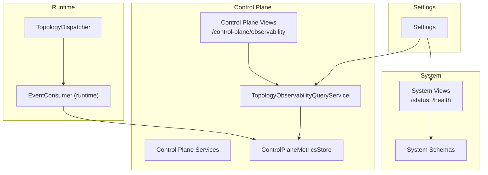
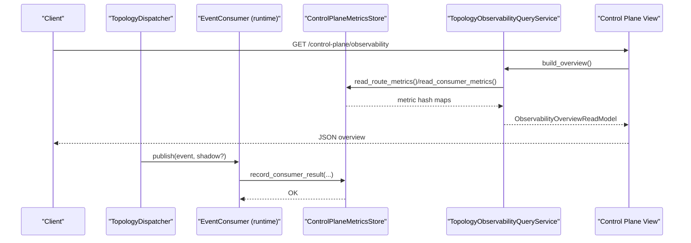
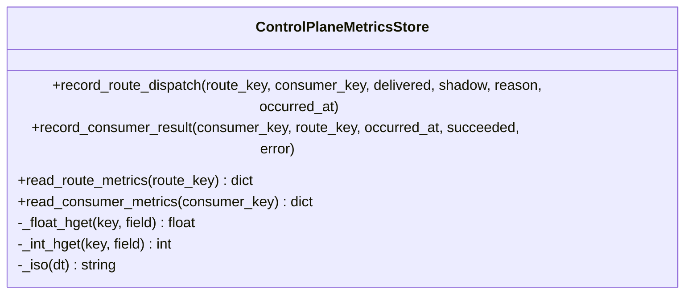
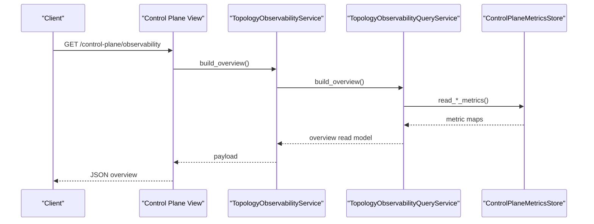
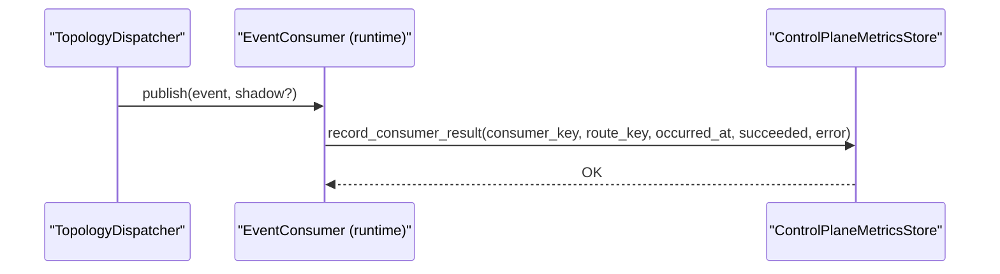
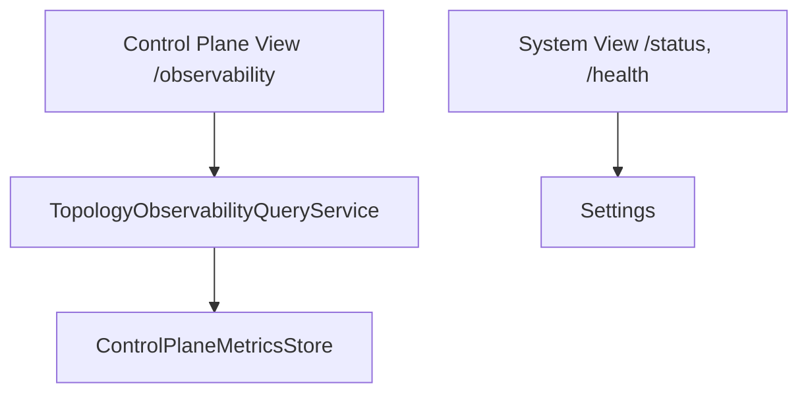

# Metrics and Monitoring

<cite>
**Referenced Files in This Document**
- [metrics.py](file://src/apps/control_plane/metrics.py)
- [views.py](file://src/apps/control_plane/views.py)
- [services.py](file://src/apps/control_plane/services.py)
- [query_services.py](file://src/apps/control_plane/query_services.py)
- [read_models.py](file://src/apps/control_plane/read_models.py)
- [dispatcher.py](file://src/runtime/control_plane/dispatcher.py)
- [consumer.py](file://src/runtime/streams/consumer.py)
- [views.py](file://src/apps/system/views.py)
- [schemas.py](file://src/apps/system/schemas.py)
- [base.py](file://src/core/settings/base.py)
- [main.py](file://src/main.py)
</cite>

## Table of Contents
1. [Introduction](#introduction)
2. [Project Structure](#project-structure)
3. [Core Components](#core-components)
4. [Architecture Overview](#architecture-overview)
5. [Detailed Component Analysis](#detailed-component-analysis)
6. [Dependency Analysis](#dependency-analysis)
7. [Performance Considerations](#performance-considerations)
8. [Troubleshooting Guide](#troubleshooting-guide)
9. [Conclusion](#conclusion)
10. [Appendices](#appendices)

## Introduction
This document explains the metrics and monitoring capabilities within the control plane. It covers:
- System health check endpoints and system status reporting
- Operational metrics collection for routes and consumers
- Performance monitoring via latency and throughput metrics
- Metric types, storage, and retrieval
- Dashboard integration patterns and alert thresholds
- Examples of querying metrics and interpreting performance data
- Integration with external monitoring systems and custom metric collection patterns

## Project Structure
The metrics and monitoring system spans several modules:
- Control plane metrics store and observability queries
- Control plane HTTP endpoints for observability
- Runtime stream consumer metrics recording
- System-level health and status endpoints
- Global settings controlling monitoring behavior

**Diagram sources**
- [views.py:475-478](file://src/apps/control_plane/views.py#L475-L478)
- [query_services.py:595-719](file://src/apps/control_plane/query_services.py#L595-L719)
- [metrics.py:29-123](file://src/apps/control_plane/metrics.py#L29-L123)
- [consumer.py:172-188](file://src/runtime/streams/consumer.py#L172-L188)
- [dispatcher.py:266-297](file://src/runtime/control_plane/dispatcher.py#L266-L297)
- [views.py:37-52](file://src/apps/system/views.py#L37-L52)
- [schemas.py:6-26](file://src/apps/system/schemas.py#L6-L26)
- [base.py:52-52](file://src/core/settings/base.py#L52-L52)

**Section sources**
- [views.py:475-478](file://src/apps/control_plane/views.py#L475-L478)
- [query_services.py:595-719](file://src/apps/control_plane/query_services.py#L595-L719)
- [metrics.py:29-123](file://src/apps/control_plane/metrics.py#L29-L123)
- [consumer.py:172-188](file://src/runtime/streams/consumer.py#L172-L188)
- [dispatcher.py:266-297](file://src/runtime/control_plane/dispatcher.py#L266-L297)
- [views.py:37-52](file://src/apps/system/views.py#L37-L52)
- [schemas.py:6-26](file://src/apps/system/schemas.py#L6-L26)
- [base.py:52-52](file://src/core/settings/base.py#L52-L52)

## Core Components
- ControlPlaneMetricsStore: Records and reads route and consumer metrics in Redis. Tracks counts, latencies, timestamps, and errors.
- TopologyObservabilityQueryService: Builds an observability overview aggregating route and consumer metrics.
- Control plane HTTP endpoint /control-plane/observability: Returns aggregated observability data.
- Runtime EventConsumer: Records consumer-side metrics after processing events.
- System endpoints /status and /health: Report system status and confirm database connectivity.

Key metric types and fields:
- Routes:
  - Throughput: delivered_total, evaluated_total, skipped_total
  - Latency: latency_total_ms, latency_count, last_delivered_at, last_completed_at
  - Outcome: success_total, failure_total, last_error, last_reason
  - Shadow: shadow_total
- Consumers:
  - Throughput: processed_total, success_total, failure_total
  - Latency: latency_total_ms, latency_count
  - Health: last_seen_at, last_failure_at, last_error
  - Dead consumer detection: lag_seconds compared against threshold

**Section sources**
- [metrics.py:29-123](file://src/apps/control_plane/metrics.py#L29-L123)
- [query_services.py:615-705](file://src/apps/control_plane/query_services.py#L615-L705)
- [read_models.py:183-226](file://src/apps/control_plane/read_models.py#L183-L226)
- [views.py:475-478](file://src/apps/control_plane/views.py#L475-L478)
- [consumer.py:172-188](file://src/runtime/streams/consumer.py#L172-L188)
- [views.py:37-52](file://src/apps/system/views.py#L37-L52)

## Architecture Overview
The control plane metrics pipeline integrates runtime event processing with observability queries and HTTP exposure.

**Diagram sources**
- [dispatcher.py:266-297](file://src/runtime/control_plane/dispatcher.py#L266-L297)
- [consumer.py:172-188](file://src/runtime/streams/consumer.py#L172-L188)
- [metrics.py:29-123](file://src/apps/control_plane/metrics.py#L29-L123)
- [query_services.py:615-705](file://src/apps/control_plane/query_services.py#L615-L705)
- [views.py:475-478](file://src/apps/control_plane/views.py#L475-L478)

## Detailed Component Analysis

### ControlPlaneMetricsStore
Responsibilities:
- Persist per-route and per-consumer metrics in Redis hashes
- Compute and store latency totals and counts
- Track last seen/completion timestamps and error markers
- Provide read APIs for route and consumer metrics

Metric keys:
- Route metrics key: iris:control_plane:metrics:route:{route_key}
- Consumer metrics key: iris:control_plane:metrics:consumer:{consumer_key}

Important behaviors:
- Latency computed as elapsed wall-clock time between occurred_at and now
- Average latency derived from total latency divided by count
- Dead consumer detection uses last_seen_at lag against configured threshold

**Diagram sources**
- [metrics.py:29-123](file://src/apps/control_plane/metrics.py#L29-L123)

**Section sources**
- [metrics.py:29-123](file://src/apps/control_plane/metrics.py#L29-L123)

### Observability Overview and Endpoints
- Endpoint: GET /control-plane/observability
- Service: TopologyObservabilityService builds overview via TopologyObservabilityQueryService
- Query aggregates:
  - Throughput and failures per route
  - Consumer processed/failure counts and average latency
  - Dead consumer detection based on lag_seconds vs threshold
  - Counts for shadow/muted routes and dead consumers

**Diagram sources**
- [views.py:475-478](file://src/apps/control_plane/views.py#L475-L478)
- [services.py:393-408](file://src/apps/control_plane/services.py#L393-L408)
- [query_services.py:615-705](file://src/apps/control_plane/query_services.py#L615-L705)
- [metrics.py:98-102](file://src/apps/control_plane/metrics.py#L98-L102)

**Section sources**
- [views.py:475-478](file://src/apps/control_plane/views.py#L475-L478)
- [services.py:393-408](file://src/apps/control_plane/services.py#L393-L408)
- [query_services.py:615-705](file://src/apps/control_plane/query_services.py#L615-L705)
- [read_models.py:183-226](file://src/apps/control_plane/read_models.py#L183-L226)

### Runtime Consumer Metrics Recording
- EventConsumer records metrics after processing each message
- Uses ControlPlaneMetricsStore to persist:
  - processed_total, success_total, failure_total
  - latency_total_ms, latency_count
  - last_seen_at, last_failure_at, last_error
  - route linkage via consumer_key

**Diagram sources**
- [dispatcher.py:266-297](file://src/runtime/control_plane/dispatcher.py#L266-L297)
- [consumer.py:172-188](file://src/runtime/streams/consumer.py#L172-L188)
- [metrics.py:61-97](file://src/apps/control_plane/metrics.py#L61-L97)

**Section sources**
- [consumer.py:172-188](file://src/runtime/streams/consumer.py#L172-L188)
- [metrics.py:61-97](file://src/apps/control_plane/metrics.py#L61-L97)

### System Health and Status Endpoints
- GET /status: Returns service status, task worker health, and market source status details
- GET /health: Pings the database and returns a health status

These endpoints complement control plane observability by providing infrastructure-level insights.

**Section sources**
- [views.py:37-52](file://src/apps/system/views.py#L37-L52)
- [schemas.py:6-26](file://src/apps/system/schemas.py#L6-L26)

### Settings and Thresholds
- control_plane_dead_consumer_after_seconds: Dead consumer threshold in seconds
- Redis and database connection retries and delays influence metrics availability and reliability

**Section sources**
- [base.py:52-52](file://src/core/settings/base.py#L52-L52)
- [base.py:69-70](file://src/core/settings/base.py#L69-L70)

## Dependency Analysis
- Control plane observability depends on:
  - Redis-backed metrics store
  - Published topology snapshots and event routing decisions
  - Runtime consumer processing to populate metrics
- System endpoints depend on:
  - Database connectivity checks
  - Task worker process liveness
  - Market source carousel and rate limiter snapshots

**Diagram sources**
- [metrics.py:29-123](file://src/apps/control_plane/metrics.py#L29-L123)
- [query_services.py:595-719](file://src/apps/control_plane/query_services.py#L595-L719)
- [views.py:475-478](file://src/apps/control_plane/views.py#L475-L478)
- [views.py:37-52](file://src/apps/system/views.py#L37-L52)
- [base.py:52-52](file://src/core/settings/base.py#L52-L52)

**Section sources**
- [metrics.py:29-123](file://src/apps/control_plane/metrics.py#L29-L123)
- [query_services.py:595-719](file://src/apps/control_plane/query_services.py#L595-L719)
- [views.py:475-478](file://src/apps/control_plane/views.py#L475-L478)
- [views.py:37-52](file://src/apps/system/views.py#L37-L52)
- [base.py:52-52](file://src/core/settings/base.py#L52-L52)

## Performance Considerations
- Latency computation:
  - Wall-clock latency is calculated per event and accumulated in Redis
  - Average latency is derived from total latency divided by count
- Throughput:
  - Routes track evaluated/delivered/skipped/shadow counts
  - Consumers track processed and success/failure counts
- Dead consumer detection:
  - Based on last_seen_at lag versus a configurable threshold
- Storage:
  - Metrics stored as Redis hash fields; reads fetch entire maps for aggregation

Recommendations:
- Monitor average latency trends and failure rates to detect performance regressions
- Use shadow routes to measure impact before enabling production delivery
- Tune throttles to prevent overload during bursts

[No sources needed since this section provides general guidance]

## Troubleshooting Guide
Common scenarios and remedies:
- High failure counts:
  - Inspect last_error and last_failure_at for root causes
  - Review consumer logs and retry behavior
- Elevated latency:
  - Compare avg_latency_ms trends; investigate downstream consumer performance
- Dead consumers:
  - Confirm lag_seconds exceeds control_plane_dead_consumer_after_seconds
  - Investigate consumer process health and network connectivity
- Missing metrics:
  - Verify Redis connectivity and credentials
  - Ensure runtime consumers are configured with a metrics store

Operational checks:
- Use GET /control-plane/observability to inspect route and consumer health
- Use GET /health to validate database connectivity
- Use GET /status to confirm task worker and source status

**Section sources**
- [query_services.py:681-705](file://src/apps/control_plane/query_services.py#L681-L705)
- [metrics.py:61-97](file://src/apps/control_plane/metrics.py#L61-L97)
- [views.py:49-52](file://src/apps/system/views.py#L49-L52)
- [views.py:37-46](file://src/apps/system/views.py#L37-L46)

## Conclusion
The control plane provides a robust foundation for metrics and monitoring:
- Real-time observability via Redis-backed counters and latency tracking
- HTTP endpoints exposing route and consumer health
- System-level health and status for infrastructure visibility
- Configurable thresholds for dead consumer detection
- Clear extension points for integrating with external monitoring systems

[No sources needed since this section summarizes without analyzing specific files]

## Appendices

### Metric Types and Fields Reference
- Route-level metrics:
  - evaluated_total, delivered_total, skipped_total, shadow_total
  - success_total, failure_total
  - latency_total_ms, latency_count
  - last_delivered_at, last_completed_at, last_reason
- Consumer-level metrics:
  - processed_total, success_total, failure_total
  - latency_total_ms, latency_count
  - last_seen_at, last_failure_at, last_error

**Section sources**
- [metrics.py:33-97](file://src/apps/control_plane/metrics.py#L33-L97)
- [query_services.py:655-705](file://src/apps/control_plane/query_services.py#L655-L705)
- [read_models.py:183-226](file://src/apps/control_plane/read_models.py#L183-L226)

### Example Queries and Interpretation
- Query observability overview:
  - Endpoint: GET /control-plane/observability
  - Interpretation: Use throughput, failure_count, avg_latency_ms, and dead_consumer_count to assess system health
- Check consumer health:
  - Use read_consumer_metrics(consumer_key) to inspect processed_total, failure_total, and last_error
- Check route health:
  - Use read_route_metrics(route_key) to inspect delivered_total, last_delivered_at, and last_reason

**Section sources**
- [views.py:475-478](file://src/apps/control_plane/views.py#L475-L478)
- [metrics.py:98-102](file://src/apps/control_plane/metrics.py#L98-L102)
- [query_services.py:655-679](file://src/apps/control_plane/query_services.py#L655-L679)

### Alerting Thresholds and Patterns
- Dead consumer threshold:
  - control_plane_dead_consumer_after_seconds controls when a consumer is considered dead based on lag_seconds
- Failure rate and latency:
  - Define SLOs for avg_latency_ms and failure_count per route/consumer
- Shadow mode:
  - Use shadow_total to monitor observation-only traffic before enabling production delivery

**Section sources**
- [base.py:52-52](file://src/core/settings/base.py#L52-L52)
- [query_services.py:681-705](file://src/apps/control_plane/query_services.py#L681-L705)

### Integration with External Monitoring Systems
- Export patterns:
  - Poll /control-plane/observability periodically and export to your TSDB or dashboard
  - Map route_key and consumer_key to labels for drill-down
- Dashboards:
  - Build panels for throughput, failure rates, latency, and dead consumer counts
  - Add alerts for sustained increases in failure_count or latency
- Custom metrics:
  - Extend ControlPlaneMetricsStore to emit structured logs or push to Prometheus/Grafana
  - Use route_metric_key and consumer_metric_key namespaces for consistent labeling

[No sources needed since this section provides general guidance]