# Topology Management

<cite>
**Referenced Files in This Document**
- [models.py](file://src/apps/control_plane/models.py)
- [services.py](file://src/apps/control_plane/services.py)
- [enums.py](file://src/apps/control_plane/enums.py)
- [contracts.py](file://src/apps/control_plane/contracts.py)
- [repositories.py](file://src/apps/control_plane/repositories.py)
- [query_services.py](file://src/apps/control_plane/query_services.py)
- [read_models.py](file://src/apps/control_plane/read_models.py)
- [schemas.py](file://src/apps/control_plane/schemas.py)
- [views.py](file://src/apps/control_plane/views.py)
- [exceptions.py](file://src/apps/control_plane/exceptions.py)
- [control_events.py](file://src/apps/control_plane/control_events.py)
- [metrics.py](file://src/apps/control_plane/metrics.py)
- [cache.py](file://src/apps/control_plane/cache.py)
- [dispatcher.py](file://src/runtime/control_plane/dispatcher.py)
</cite>

## Table of Contents
1. [Introduction](#introduction)
2. [Project Structure](#project-structure)
3. [Core Components](#core-components)
4. [Architecture Overview](#architecture-overview)
5. [Detailed Component Analysis](#detailed-component-analysis)
6. [Dependency Analysis](#dependency-analysis)
7. [Performance Considerations](#performance-considerations)
8. [Troubleshooting Guide](#troubleshooting-guide)
9. [Conclusion](#conclusion)
10. [Appendices](#appendices)

## Introduction
This document explains topology management in the control plane, focusing on:
- TopologyConfigVersion: Published configuration snapshots with immutable versioning
- TopologyDraft: Change proposals with review and approval workflows
- TopologyDraftChange: Granular change records tracked per draft
- EventRouteAuditLog: Immutable audit trail for topology changes
- Access modes and status tracking
- Practical workflows: create, modify, approve, apply, and rollback
- Real-time dispatch and observability

The goal is to enable safe, auditable, and observable topology evolution across the system.

## Project Structure
The control plane module organizes topology management around:
- Data models and relationships
- Services implementing business logic
- Repositories and query services for persistence and projections
- Pydantic schemas and FastAPI views for the API surface
- Enums, contracts, and read models for typed operations
- Metrics, cache, and dispatcher for runtime observability and dispatch

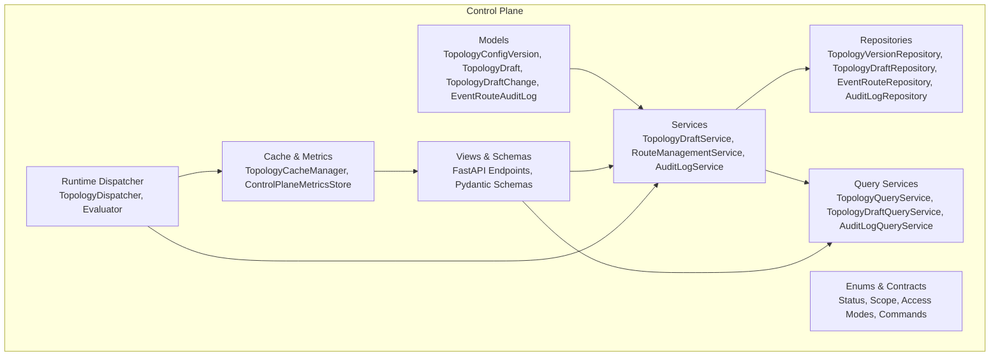

**Diagram sources**
- [models.py:82-247](file://src/apps/control_plane/models.py#L82-L247)
- [services.py:411-759](file://src/apps/control_plane/services.py#L411-L759)
- [repositories.py:1-259](file://src/apps/control_plane/repositories.py#L1-L259)
- [query_services.py:341-720](file://src/apps/control_plane/query_services.py#L341-L720)
- [enums.py:1-65](file://src/apps/control_plane/enums.py#L1-L65)
- [contracts.py:1-244](file://src/apps/control_plane/contracts.py#L1-L244)
- [schemas.py:1-304](file://src/apps/control_plane/schemas.py#L1-L304)
- [views.py:1-479](file://src/apps/control_plane/views.py#L1-L479)
- [cache.py:41-280](file://src/apps/control_plane/cache.py#L41-L280)
- [dispatcher.py:114-313](file://src/runtime/control_plane/dispatcher.py#L114-L313)

**Section sources**
- [models.py:1-259](file://src/apps/control_plane/models.py#L1-L259)
- [services.py:1-759](file://src/apps/control_plane/services.py#L1-L759)
- [repositories.py:1-259](file://src/apps/control_plane/repositories.py#L1-L259)
- [query_services.py:1-720](file://src/apps/control_plane/query_services.py#L1-L720)
- [enums.py:1-65](file://src/apps/control_plane/enums.py#L1-L65)
- [contracts.py:1-244](file://src/apps/control_plane/contracts.py#L1-L244)
- [schemas.py:1-304](file://src/apps/control_plane/schemas.py#L1-L304)
- [views.py:1-479](file://src/apps/control_plane/views.py#L1-L479)
- [cache.py:1-280](file://src/apps/control_plane/cache.py#L1-L280)
- [dispatcher.py:1-313](file://src/runtime/control_plane/dispatcher.py#L1-L313)

## Core Components
- TopologyConfigVersion: Immutable published snapshot with version_number and status
- TopologyDraft: Proposal with status, access_mode, base_version_id, and audit trail
- TopologyDraftChange: Typed change records (create/update/delete/status-change) linked to a draft
- EventRouteAuditLog: Immutable audit entries for route and draft actions
- Services: TopologyDraftService orchestrates draft lifecycle and applies changes; RouteManagementService handles route CRUD and status changes; AuditLogService writes audit logs
- Repositories: Typed repositories for all entities
- Query Services: Build topology snapshots, diffs, and observability
- Views/Schemas: API endpoints and typed payloads
- Cache/Metrics: Snapshot caching and runtime metrics
- Runtime Dispatcher: Evaluates and dispatches events against the current topology

**Section sources**
- [models.py:82-247](file://src/apps/control_plane/models.py#L82-L247)
- [services.py:411-759](file://src/apps/control_plane/services.py#L411-L759)
- [repositories.py:1-259](file://src/apps/control_plane/repositories.py#L1-L259)
- [query_services.py:341-720](file://src/apps/control_plane/query_services.py#L341-L720)
- [views.py:1-479](file://src/apps/control_plane/views.py#L1-L479)
- [cache.py:41-280](file://src/apps/control_plane/cache.py#L41-L280)
- [dispatcher.py:114-313](file://src/runtime/control_plane/dispatcher.py#L114-L313)

## Architecture Overview
The system separates concerns across layers:
- Persistence: SQLAlchemy models and repositories
- Business logic: Services encapsulate workflows
- Projection: Query services build read models and payloads
- API: Views expose endpoints with typed schemas
- Runtime: Dispatcher consumes topology snapshot and metrics

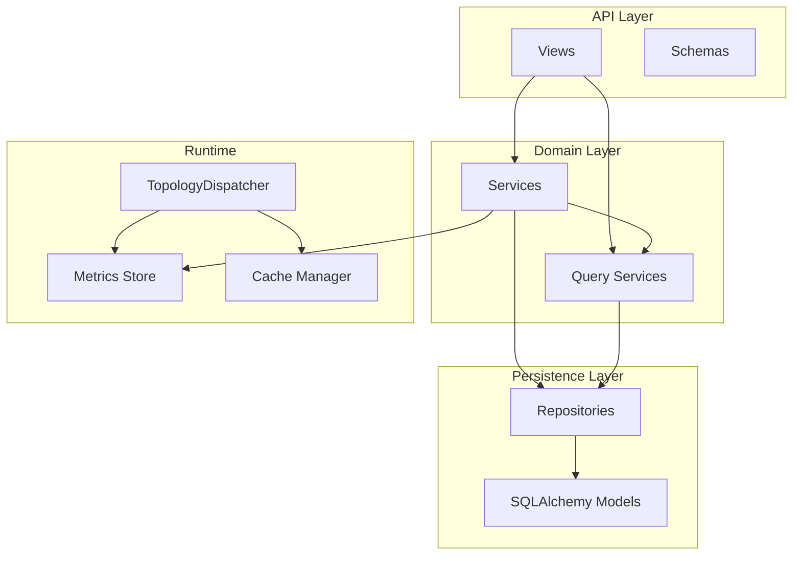

**Diagram sources**
- [views.py:1-479](file://src/apps/control_plane/views.py#L1-L479)
- [schemas.py:1-304](file://src/apps/control_plane/schemas.py#L1-L304)
- [services.py:411-759](file://src/apps/control_plane/services.py#L411-L759)
- [query_services.py:341-720](file://src/apps/control_plane/query_services.py#L341-L720)
- [repositories.py:1-259](file://src/apps/control_plane/repositories.py#L1-L259)
- [models.py:1-259](file://src/apps/control_plane/models.py#L1-L259)
- [cache.py:235-280](file://src/apps/control_plane/cache.py#L235-L280)
- [metrics.py:29-124](file://src/apps/control_plane/metrics.py#L29-L124)
- [dispatcher.py:266-313](file://src/runtime/control_plane/dispatcher.py#L266-L313)

## Detailed Component Analysis

### TopologyConfigVersion: Published Configuration Snapshots
- Immutable published versions keyed by version_number
- Status constrained to published
- snapshot_json stores a serialized topology snapshot for auditing and rollback
- Drafts reference base_version_id to track lineage

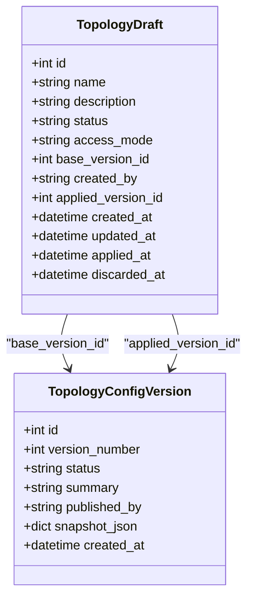

**Diagram sources**
- [models.py:82-154](file://src/apps/control_plane/models.py#L82-L154)

**Section sources**
- [models.py:82-102](file://src/apps/control_plane/models.py#L82-L102)
- [repositories.py:151-174](file://src/apps/control_plane/repositories.py#L151-L174)

### TopologyDraft: Draft Lifecycle and Approval
- Drafts start as draft, can be applied or discarded
- access_mode controls whether mutation requires control mode
- base_version_id anchors drafts to the latest published topology
- Changes are recorded via TopologyDraftChange entries
- Audit logs capture all draft-related actions

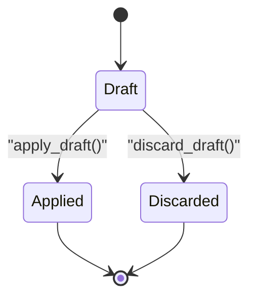

**Diagram sources**
- [enums.py:24-28](file://src/apps/control_plane/enums.py#L24-L28)
- [services.py:460-541](file://src/apps/control_plane/services.py#L460-L541)

**Section sources**
- [models.py:104-154](file://src/apps/control_plane/models.py#L104-L154)
- [services.py:411-541](file://src/apps/control_plane/services.py#L411-L541)
- [views.py:366-463](file://src/apps/control_plane/views.py#L366-L463)

### TopologyDraftChange: Tracking Modifications
- Records change_type, target_route_key, and payload
- Supports create, update, delete, and status-change
- Stored per draft and ordered by creation

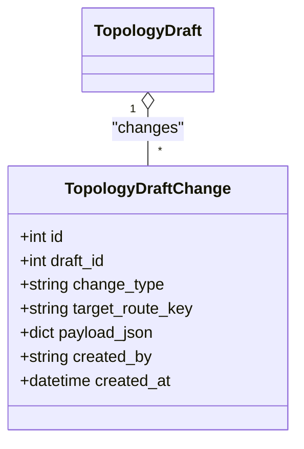

**Diagram sources**
- [models.py:203-219](file://src/apps/control_plane/models.py#L203-L219)

**Section sources**
- [models.py:203-219](file://src/apps/control_plane/models.py#L203-L219)
- [services.py:440-458](file://src/apps/control_plane/services.py#L440-L458)
- [repositories.py:218-248](file://src/apps/control_plane/repositories.py#L218-L248)

### EventRouteAuditLog: Immutable Change History
- Captures route and draft actions with before/after snapshots
- Includes actor, actor_mode, reason, and context
- Supports timeline queries and compliance audits

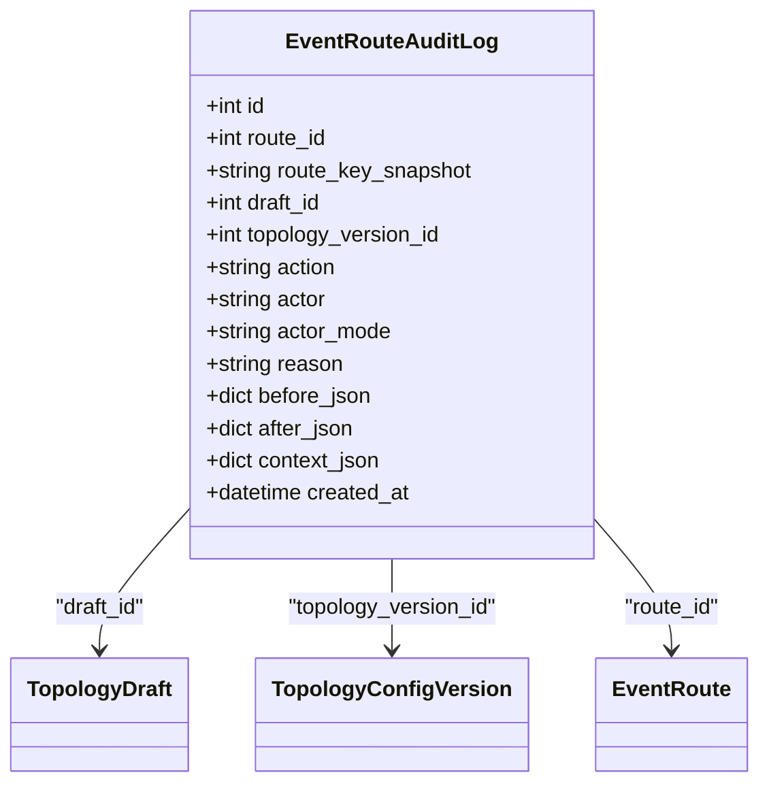

**Diagram sources**
- [models.py:221-247](file://src/apps/control_plane/models.py#L221-L247)

**Section sources**
- [models.py:221-247](file://src/apps/control_plane/models.py#L221-L247)
- [services.py:140-175](file://src/apps/control_plane/services.py#L140-L175)
- [repositories.py:120-148](file://src/apps/control_plane/repositories.py#L120-L148)

### Workflow: Creating, Reviewing, and Applying Drafts
- Create draft anchored to latest published version
- Add changes (create/update/delete/status-change)
- Preview diff to review impact
- Apply draft to publish a new version
- Discard draft to cancel changes

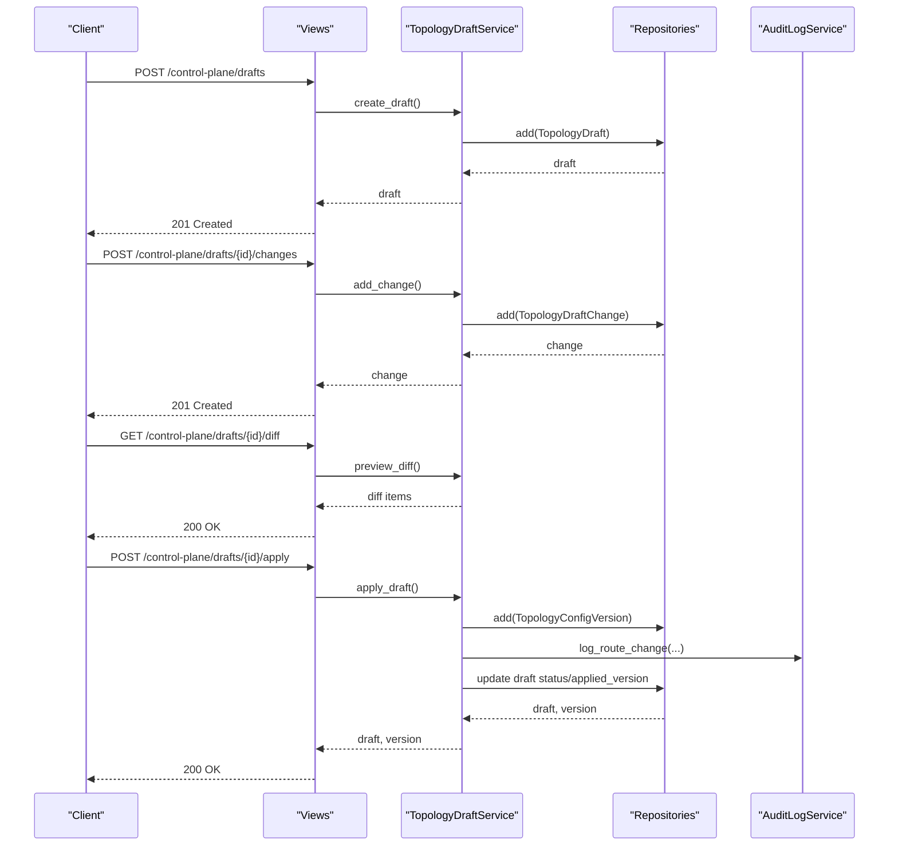

**Diagram sources**
- [views.py:366-447](file://src/apps/control_plane/views.py#L366-L447)
- [services.py:411-519](file://src/apps/control_plane/services.py#L411-L519)
- [repositories.py:151-248](file://src/apps/control_plane/repositories.py#L151-L248)

**Section sources**
- [views.py:366-447](file://src/apps/control_plane/views.py#L366-L447)
- [services.py:411-519](file://src/apps/control_plane/services.py#L411-L519)

### Applying Changes: Draft to Published Version
- Validates draft is editable and matches latest published version
- Iterates changes and applies them to live routes
- Builds snapshot for the new version and updates draft state

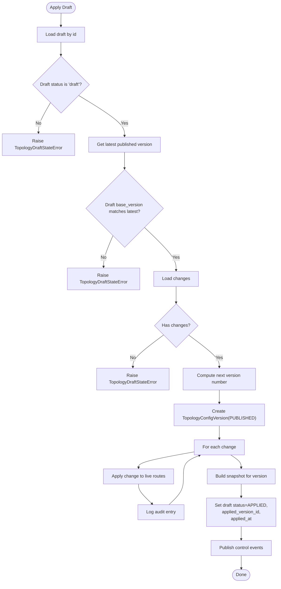

**Diagram sources**
- [services.py:460-519](file://src/apps/control_plane/services.py#L460-L519)
- [repositories.py:151-174](file://src/apps/control_plane/repositories.py#L151-L174)

**Section sources**
- [services.py:460-519](file://src/apps/control_plane/services.py#L460-L519)

### Access Modes and Security Controls
- X-IRIS-Access-Mode header enforces either observe or control
- Control mode is required for topology mutations
- X-IRIS-Control-Token validates administrative access
- AuditActor captures actor identity, mode, reason, and context

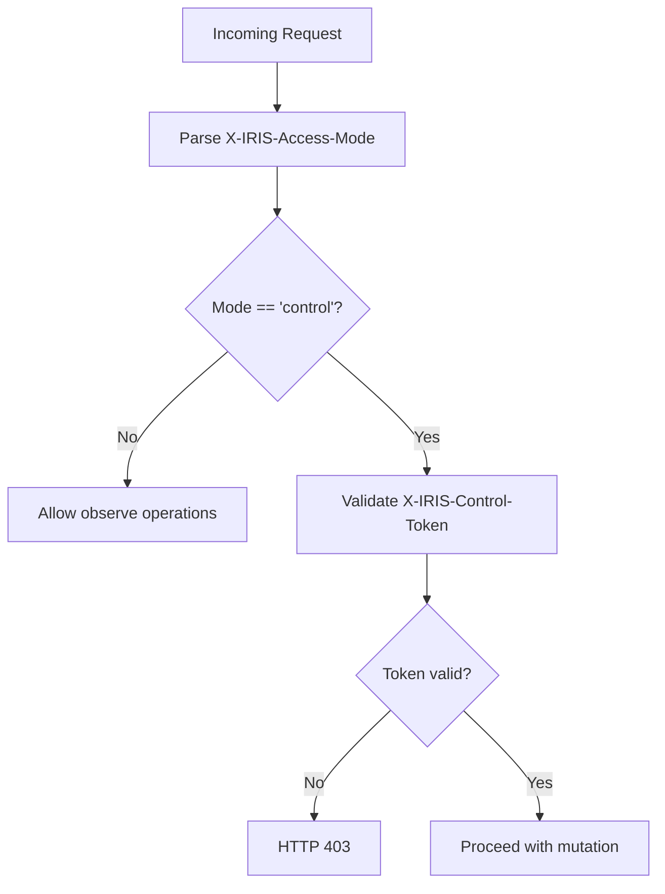

**Diagram sources**
- [views.py:88-109](file://src/apps/control_plane/views.py#L88-L109)
- [contracts.py:117-122](file://src/apps/control_plane/contracts.py#L117-L122)

**Section sources**
- [views.py:63-109](file://src/apps/control_plane/views.py#L63-L109)
- [contracts.py:117-122](file://src/apps/control_plane/contracts.py#L117-L122)

### Status Tracking and Rollback Procedures
- Status values include active, muted, paused, throttled, shadow, disabled
- Shadow routes support non-disruptive testing
- Rollback leverages published versions; re-apply previous version snapshot
- Audit logs provide immutable history for compliance

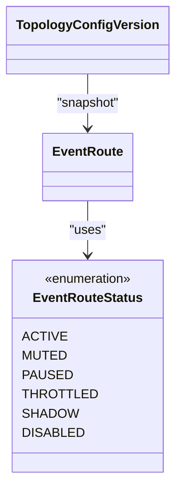

**Diagram sources**
- [enums.py:6-12](file://src/apps/control_plane/enums.py#L6-L12)
- [models.py:157-201](file://src/apps/control_plane/models.py#L157-L201)

**Section sources**
- [enums.py:6-12](file://src/apps/control_plane/enums.py#L6-L12)
- [services.py:543-614](file://src/apps/control_plane/services.py#L543-L614)

### Practical Examples
- Create a draft: POST /control-plane/drafts with name, optional description, and access_mode
- Add a change: POST /control-plane/drafts/{id}/changes with change_type and payload
- Preview diff: GET /control-plane/drafts/{id}/diff
- Apply draft: POST /control-plane/drafts/{id}/apply
- Discard draft: POST /control-plane/drafts/{id}/discard
- List recent audit logs: GET /control-plane/audit?limit=N

**Section sources**
- [views.py:366-463](file://src/apps/control_plane/views.py#L366-L463)
- [schemas.py:198-240](file://src/apps/control_plane/schemas.py#L198-L240)

## Dependency Analysis
Key relationships:
- TopologyDraftService depends on repositories for drafts, changes, routes, versions, and audit logs
- Query services depend on repositories to build snapshots, diffs, and observability
- Views depend on services and schemas for request/response handling
- Runtime dispatcher depends on cache manager and metrics store for current topology and telemetry

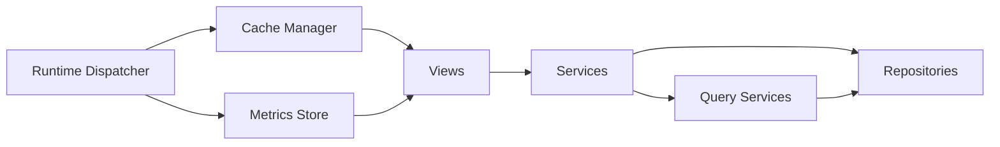

**Diagram sources**
- [views.py:1-479](file://src/apps/control_plane/views.py#L1-L479)
- [services.py:411-759](file://src/apps/control_plane/services.py#L411-L759)
- [repositories.py:1-259](file://src/apps/control_plane/repositories.py#L1-L259)
- [query_services.py:341-720](file://src/apps/control_plane/query_services.py#L341-L720)
- [cache.py:235-280](file://src/apps/control_plane/cache.py#L235-L280)
- [metrics.py:29-124](file://src/apps/control_plane/metrics.py#L29-L124)
- [dispatcher.py:266-313](file://src/runtime/control_plane/dispatcher.py#L266-L313)

**Section sources**
- [services.py:411-759](file://src/apps/control_plane/services.py#L411-L759)
- [repositories.py:1-259](file://src/apps/control_plane/repositories.py#L1-L259)
- [query_services.py:341-720](file://src/apps/control_plane/query_services.py#L341-L720)
- [views.py:1-479](file://src/apps/control_plane/views.py#L1-L479)
- [cache.py:235-280](file://src/apps/control_plane/cache.py#L235-L280)
- [metrics.py:29-124](file://src/apps/control_plane/metrics.py#L29-L124)
- [dispatcher.py:266-313](file://src/runtime/control_plane/dispatcher.py#L266-L313)

## Performance Considerations
- Caching: TopologySnapshotLoader and TopologyCacheManager reduce database load; cache TTL balances freshness and cost
- Metrics: ControlPlaneMetricsStore uses Redis for low-latency counters and latency tracking
- Dispatch evaluation: In-memory throttle and counters minimize overhead during hot-path dispatch
- Query projections: Query services pre-aggregate data for snapshots and diffs

[No sources needed since this section provides general guidance]

## Troubleshooting Guide
Common errors and resolutions:
- Draft not editable: Ensure status is draft and base_version matches latest published
- No changes to apply: Add at least one change before applying
- Stale draft: Rebase on latest published version
- Route conflicts: Ensure route_key uniqueness and compatibility between event type and consumer
- Access denied: Provide valid control token and set access mode to control for mutations

Operational checks:
- Verify latest published version via topology snapshot endpoint
- Inspect recent audit logs for actions and reasons
- Use observability overview to assess consumer health and route lag

**Section sources**
- [services.py:460-519](file://src/apps/control_plane/services.py#L460-L519)
- [exceptions.py:28-33](file://src/apps/control_plane/exceptions.py#L28-L33)
- [views.py:289-346](file://src/apps/control_plane/views.py#L289-L346)
- [query_services.py:595-720](file://src/apps/control_plane/query_services.py#L595-L720)

## Conclusion
The control plane provides a robust, auditable, and observable topology management system:
- Published versions ensure immutability and traceability
- Drafts enable collaborative change management with previews and approvals
- Audit logs and metrics support compliance and operational excellence
- Real-time dispatcher evaluates and routes events against the current topology snapshot

[No sources needed since this section summarizes without analyzing specific files]

## Appendices

### API Endpoints Summary
- GET /control-plane/registry/events
- GET /control-plane/registry/consumers
- GET /control-plane/registry/events/{event_type}/compatible-consumers
- GET /control-plane/routes
- POST /control-plane/routes
- PUT /control-plane/routes/{route_key:path}
- POST /control-plane/routes/{route_key:path}/status
- GET /control-plane/topology/snapshot
- GET /control-plane/topology/graph
- GET /control-plane/drafts
- POST /control-plane/drafts
- POST /control-plane/drafts/{draft_id}/changes
- GET /control-plane/drafts/{draft_id}/diff
- POST /control-plane/drafts/{draft_id}/apply
- POST /control-plane/drafts/{draft_id}/discard
- GET /control-plane/audit
- GET /control-plane/observability

**Section sources**
- [views.py:263-479](file://src/apps/control_plane/views.py#L263-L479)