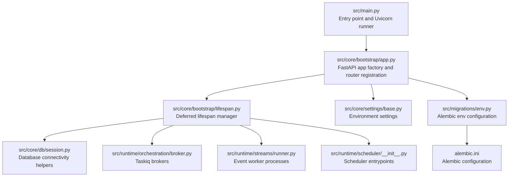
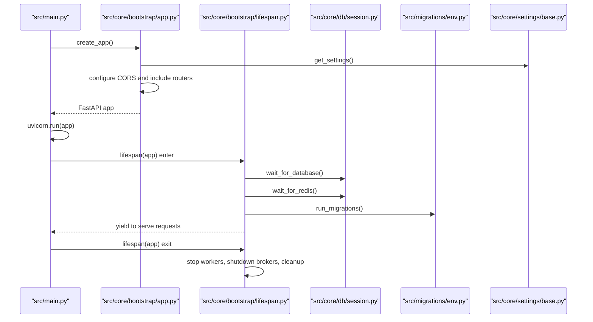
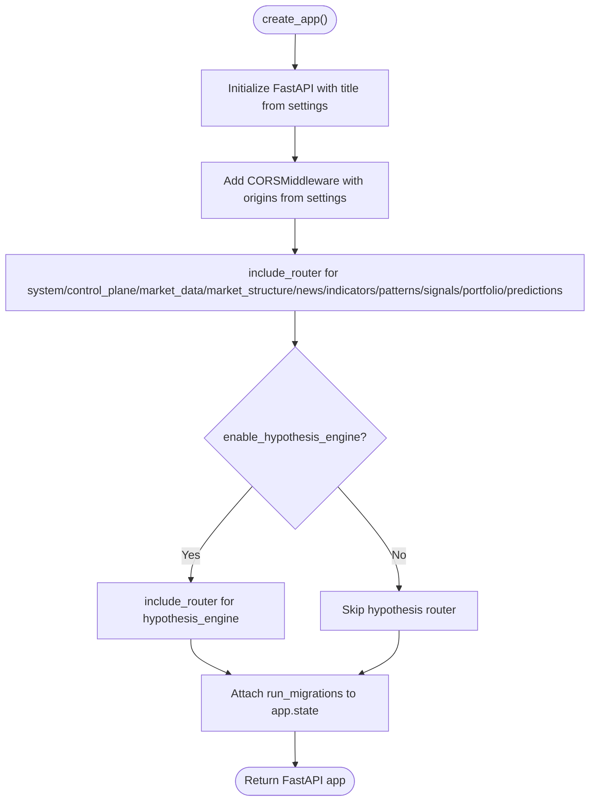
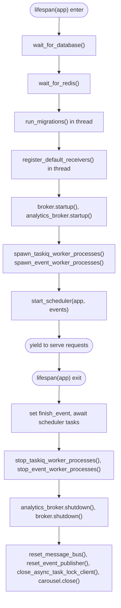
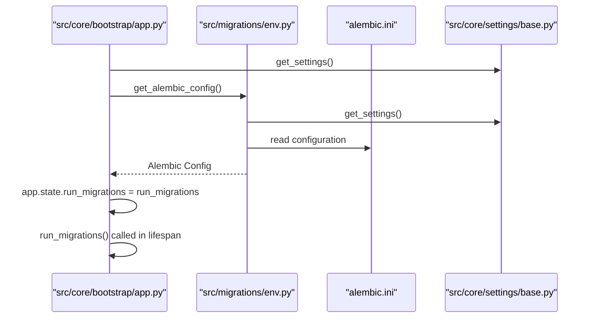
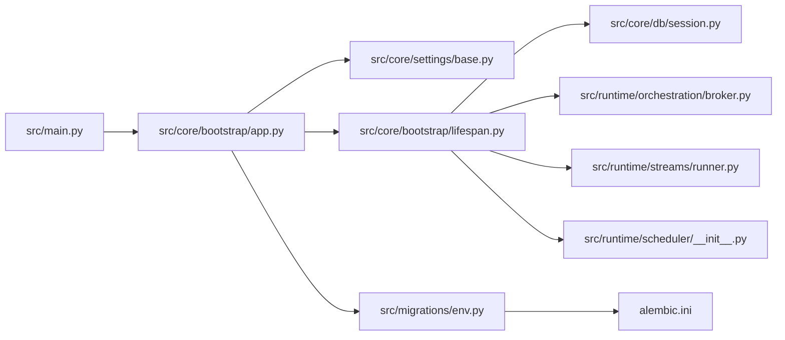

# Application Bootstrap

<cite>
**Referenced Files in This Document**
- [src/main.py](file://src/main.py)
- [src/core/bootstrap/app.py](file://src/core/bootstrap/app.py)
- [src/core/bootstrap/lifespan.py](file://src/core/bootstrap/lifespan.py)
- [src/core/settings/base.py](file://src/core/settings/base.py)
- [src/core/db/session.py](file://src/core/db/session.py)
- [src/migrations/env.py](file://src/migrations/env.py)
- [alembic.ini](file://alembic.ini)
- [src/runtime/orchestration/broker.py](file://src/runtime/orchestration/broker.py)
- [src/runtime/streams/runner.py](file://src/runtime/streams/runner.py)
- [src/apps/system/views.py](file://src/apps/system/views.py)
- [src/apps/system/services.py](file://src/apps/system/services.py)
- [src/runtime/scheduler/__init__.py](file://src/runtime/scheduler/__init__.py)
- [src/core/db/persistence.py](file://src/core/db/persistence.py)
</cite>

## Table of Contents
1. [Introduction](#introduction)
2. [Project Structure](#project-structure)
3. [Core Components](#core-components)
4. [Architecture Overview](#architecture-overview)
5. [Detailed Component Analysis](#detailed-component-analysis)
6. [Dependency Analysis](#dependency-analysis)
7. [Performance Considerations](#performance-considerations)
8. [Troubleshooting Guide](#troubleshooting-guide)
9. [Conclusion](#conclusion)

## Introduction
This document explains the IRIS application bootstrap process. It covers how the FastAPI application is created, how routers for feature modules are registered, how CORS middleware is configured, and how the lifespan is deferred and managed. It also documents the dynamic import system used to load routers, Alembic migration integration, conditional feature loading based on settings, the application initialization sequence, dependency injection setup, startup/shutdown procedures, configuration options for different environments, error handling during bootstrapping, and performance considerations for application startup.

## Project Structure
The bootstrap pipeline centers around three primary files:
- Application entrypoint and server runner
- FastAPI application factory and router registration
- Lifespan manager coordinating startup and shutdown

**Diagram sources**
- [src/main.py:1-22](file://src/main.py#L1-L22)
- [src/core/bootstrap/app.py:1-81](file://src/core/bootstrap/app.py#L1-L81)
- [src/core/bootstrap/lifespan.py:1-70](file://src/core/bootstrap/lifespan.py#L1-L70)
- [src/core/db/session.py:1-72](file://src/core/db/session.py#L1-L72)
- [src/runtime/orchestration/broker.py:1-23](file://src/runtime/orchestration/broker.py#L1-L23)
- [src/runtime/streams/runner.py:1-84](file://src/runtime/streams/runner.py#L1-L84)
- [src/runtime/scheduler/__init__.py:1-30](file://src/runtime/scheduler/__init__.py#L1-L30)
- [src/core/settings/base.py:1-90](file://src/core/settings/base.py#L1-L90)
- [src/migrations/env.py:1-56](file://src/migrations/env.py#L1-L56)
- [alembic.ini:1-38](file://alembic.ini#L1-L38)

**Section sources**
- [src/main.py:1-22](file://src/main.py#L1-L22)
- [src/core/bootstrap/app.py:1-81](file://src/core/bootstrap/app.py#L1-L81)
- [src/core/bootstrap/lifespan.py:1-70](file://src/core/bootstrap/lifespan.py#L1-L70)

## Core Components
- FastAPI application factory: Creates the ASGI app, sets title from settings, registers CORS middleware, and conditionally includes routers for feature modules.
- Deferred lifespan manager: Coordinates database readiness, waits for Redis, runs Alembic migrations, starts brokers and workers, and orchestrates cleanup on shutdown.
- Settings provider: Centralized configuration with environment-specific defaults and normalization.
- Database session helpers: Async engine and retry logic for database connectivity.
- Alembic integration: Configures Alembic via environment and settings, and exposes a migration runner callable attached to app state.
- Runtime components: Taskiq brokers, event worker processes, and scheduler entrypoints are started and stopped within the lifespan.

**Section sources**
- [src/core/bootstrap/app.py:37-81](file://src/core/bootstrap/app.py#L37-L81)
- [src/core/bootstrap/lifespan.py:22-70](file://src/core/bootstrap/lifespan.py#L22-L70)
- [src/core/settings/base.py:8-90](file://src/core/settings/base.py#L8-L90)
- [src/core/db/session.py:19-72](file://src/core/db/session.py#L19-L72)
- [src/migrations/env.py:11-56](file://src/migrations/env.py#L11-L56)
- [alembic.ini:1-38](file://alembic.ini#L1-L38)

## Architecture Overview
The bootstrap architecture follows a layered approach:
- Entry point initializes the app and runs the server.
- App factory constructs the FastAPI instance, configures CORS, and registers routers.
- Lifespan performs pre-flight checks (database and Redis), runs migrations, starts background systems, and manages shutdown.

**Diagram sources**
- [src/main.py:8-22](file://src/main.py#L8-L22)
- [src/core/bootstrap/app.py:49-81](file://src/core/bootstrap/app.py#L49-L81)
- [src/core/bootstrap/lifespan.py:22-70](file://src/core/bootstrap/lifespan.py#L22-L70)
- [src/core/db/session.py:61-72](file://src/core/db/session.py#L61-L72)
- [src/migrations/env.py:34-56](file://src/migrations/env.py#L34-L56)
- [src/core/settings/base.py:87-90](file://src/core/settings/base.py#L87-L90)

## Detailed Component Analysis

### FastAPI Application Creation Workflow
- Dynamic router imports: Routers are imported from feature modules and included in the app. Conditional inclusion is supported for the hypothesis engine router based on settings.
- CORS middleware: Configured using origins from settings with permissive allow-all methods and headers.
- Deferred lifespan: The lifespan is attached as an async context manager so that startup steps occur before serving requests and shutdown occurs after.

**Diagram sources**
- [src/core/bootstrap/app.py:49-81](file://src/core/bootstrap/app.py#L49-L81)

**Section sources**
- [src/core/bootstrap/app.py:49-81](file://src/core/bootstrap/app.py#L49-L81)

### Router Registration for Feature Modules
- Routers are imported from feature modules and registered in a fixed order. The hypothesis engine router is included conditionally based on a setting.
- The system router is always included to expose health and status endpoints.

**Section sources**
- [src/core/bootstrap/app.py:21-31](file://src/core/bootstrap/app.py#L21-L31)
- [src/core/bootstrap/app.py:68-79](file://src/core/bootstrap/app.py#L68-L79)

### CORS Middleware Configuration
- Origins are loaded from settings and normalized. The middleware allows credentials, all methods, and all headers.

**Section sources**
- [src/core/bootstrap/app.py:60-66](file://src/core/bootstrap/app.py#L60-L66)
- [src/core/settings/base.py:25-31](file://src/core/settings/base.py#L25-L31)
- [src/core/settings/base.py:79-84](file://src/core/settings/base.py#L79-L84)

### Deferred Lifespan Management
- Pre-start:
  - Wait for database connectivity with retries.
  - Wait for Redis connectivity with retries.
  - Run Alembic migrations synchronously using a thread executor to avoid blocking the event loop.
  - Register legacy receivers synchronously.
- Runtime:
  - Start Taskiq brokers.
  - Spawn taskiq worker processes and event worker processes.
  - Start scheduler tasks.
- Shutdown:
  - Signal schedulers to finish and await their completion.
  - Stop worker processes.
  - Shutdown brokers and reset internal message buses.
  - Close async task lock client and market source carousel.

**Diagram sources**
- [src/core/bootstrap/lifespan.py:22-70](file://src/core/bootstrap/lifespan.py#L22-L70)
- [src/core/db/session.py:61-72](file://src/core/db/session.py#L61-L72)
- [src/runtime/orchestration/broker.py:12-22](file://src/runtime/orchestration/broker.py#L12-L22)
- [src/runtime/streams/runner.py:50-84](file://src/runtime/streams/runner.py#L50-L84)
- [src/runtime/scheduler/__init__.py:1-30](file://src/runtime/scheduler/__init__.py#L1-L30)

**Section sources**
- [src/core/bootstrap/lifespan.py:22-70](file://src/core/bootstrap/lifespan.py#L22-L70)

### Dynamic Import System
- Routers are imported dynamically at module level in the app factory. This enables clean separation of concerns and straightforward registration without circular imports at import time.
- Conditional inclusion is performed based on settings, allowing feature toggles without modifying the import list.

**Section sources**
- [src/core/bootstrap/app.py:21-31](file://src/core/bootstrap/app.py#L21-L31)
- [src/core/bootstrap/app.py:78-79](file://src/core/bootstrap/app.py#L78-L79)

### Alembic Migration Integration
- Alembic configuration is loaded from the repository’s alembic.ini and adjusted programmatically to set the script location and SQLAlchemy URL from settings.
- A callable is attached to app state to run migrations asynchronously via a thread executor during startup.
- The Alembic env script reads settings and configures metadata and offline/online modes accordingly.

**Diagram sources**
- [src/core/bootstrap/app.py:37-47](file://src/core/bootstrap/app.py#L37-L47)
- [src/migrations/env.py:11-56](file://src/migrations/env.py#L11-L56)
- [alembic.ini:1-38](file://alembic.ini#L1-L38)
- [src/core/settings/base.py:87-90](file://src/core/settings/base.py#L87-L90)

**Section sources**
- [src/core/bootstrap/app.py:37-47](file://src/core/bootstrap/app.py#L37-L47)
- [src/migrations/env.py:11-56](file://src/migrations/env.py#L11-L56)
- [alembic.ini:1-38](file://alembic.ini#L1-L38)

### Conditional Feature Loading Based on Settings
- The hypothesis engine router is included only when the corresponding setting is enabled. This allows enabling/disabling features without changing the app factory code.

**Section sources**
- [src/core/bootstrap/app.py:78-79](file://src/core/bootstrap/app.py#L78-L79)
- [src/core/settings/base.py:53](file://src/core/settings/base.py#L53)

### Application Initialization Sequence
- Load settings.
- Create FastAPI app with title from settings.
- Add CORS middleware using settings.
- Include routers for system and all major feature domains.
- Conditionally include the hypothesis router.
- Attach migration runner to app state.
- Run via Uvicorn with host/port from settings.

**Section sources**
- [src/main.py:8-22](file://src/main.py#L8-L22)
- [src/core/bootstrap/app.py:49-81](file://src/core/bootstrap/app.py#L49-L81)
- [src/core/settings/base.py:87-90](file://src/core/settings/base.py#L87-L90)

### Dependency Injection Setup
- Database sessions are provided via an async generator that yields scoped sessions.
- Persistence utilities offer standardized logging and data sanitization for repositories and query services.
- Market source carousel and rate limit manager are exposed via services for use in system views.

**Section sources**
- [src/core/db/session.py:48-54](file://src/core/db/session.py#L48-L54)
- [src/core/db/persistence.py:61-124](file://src/core/db/persistence.py#L61-L124)
- [src/apps/system/services.py:1-5](file://src/apps/system/services.py#L1-L5)

### Startup and Shutdown Procedures
- Startup:
  - Database and Redis readiness checks.
  - Alembic migrations executed once during bootstrap.
  - Brokers and workers started.
  - Scheduler tasks launched.
- Shutdown:
  - Schedulers signaled and awaited.
  - Workers stopped gracefully.
  - Brokers shut down and internal buses reset.
  - Resource cleanup performed.

**Section sources**
- [src/core/bootstrap/lifespan.py:22-70](file://src/core/bootstrap/lifespan.py#L22-L70)

### Configuration Options for Different Environments
- Environment variables are loaded from a .env file with relaxed case sensitivity and ignored extras.
- Defaults are provided for development, including database and Redis URLs, API host/port, and CORS origins.
- Additional keys include API keys for external providers, scheduler intervals, worker counts, and feature flags.

**Section sources**
- [src/core/settings/base.py:72-77](file://src/core/settings/base.py#L72-L77)
- [src/core/settings/base.py:8-71](file://src/core/settings/base.py#L8-L71)

## Dependency Analysis
The bootstrap pipeline exhibits low coupling and clear separation of concerns:
- Entry point depends on the app factory.
- App factory depends on settings and router modules.
- Lifespan depends on database, Redis, brokers, workers, and scheduler.
- Alembic env depends on settings and shared metadata.

**Diagram sources**
- [src/main.py:5-9](file://src/main.py#L5-L9)
- [src/core/bootstrap/app.py:32-34](file://src/core/bootstrap/app.py#L32-L34)
- [src/core/bootstrap/lifespan.py:8-17](file://src/core/bootstrap/lifespan.py#L8-L17)
- [src/migrations/env.py:8-18](file://src/migrations/env.py#L8-L18)

**Section sources**
- [src/main.py:5-9](file://src/main.py#L5-L9)
- [src/core/bootstrap/app.py:32-34](file://src/core/bootstrap/app.py#L32-L34)
- [src/core/bootstrap/lifespan.py:8-17](file://src/core/bootstrap/lifespan.py#L8-L17)
- [src/migrations/env.py:8-18](file://src/migrations/env.py#L8-L18)

## Performance Considerations
- Deferred migrations: Executed synchronously in a thread to keep the HTTP path unblocked, minimizing cold-start latency impact.
- Worker spawning: Process-based workers are started once during bootstrap; this avoids per-request overhead but increases initial resource usage.
- Retry loops: Database and Redis readiness checks use bounded retries with delays to tolerate slow container startups.
- CORS configuration: Permissive settings simplify development but should be narrowed in production.
- Scheduler tasks: Background scheduling is coordinated centrally; ensure intervals are tuned to workload.

[No sources needed since this section provides general guidance]

## Troubleshooting Guide
- Database connectivity failures during startup:
  - Verify DATABASE_URL and network reachability.
  - Increase retries and delays if containers start out of order.
- Redis connectivity failures:
  - Confirm REDIS_URL and network configuration.
  - Adjust retries and delays similarly.
- Alembic migration errors:
  - Inspect logs for SQL errors.
  - Ensure migrations directory and script location are correct.
- CORS issues:
  - Validate that allowed origins include frontend URLs.
- Health endpoint:
  - Use the system health endpoint to confirm database connectivity.
- Worker processes:
  - Check process lists and logs for worker startup and termination.

**Section sources**
- [src/core/db/session.py:61-72](file://src/core/db/session.py#L61-L72)
- [src/apps/system/views.py:49-53](file://src/apps/system/views.py#L49-L53)

## Conclusion
The IRIS bootstrap process is designed for reliability and modularity. The app factory centralizes configuration and router registration, while the deferred lifespan ensures robust startup sequencing. Alembic migrations are integrated cleanly, and conditional feature loading supports flexible deployments. With proper environment configuration and monitoring, the system achieves predictable startup and graceful shutdown across development and production environments.