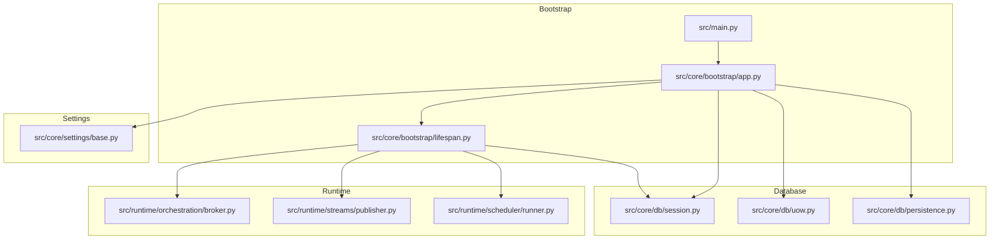
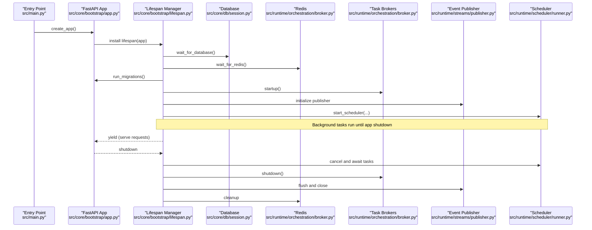
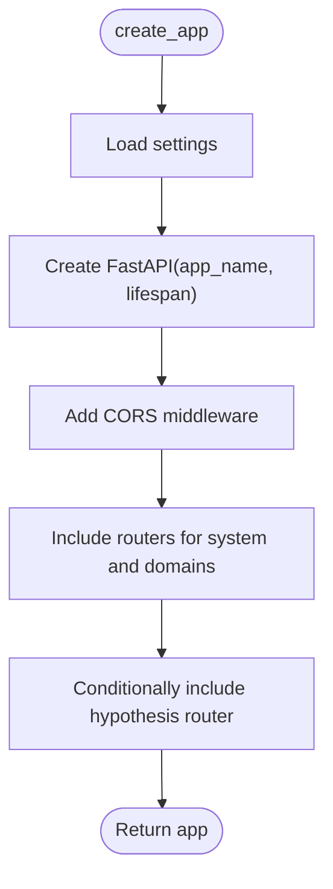
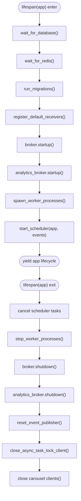
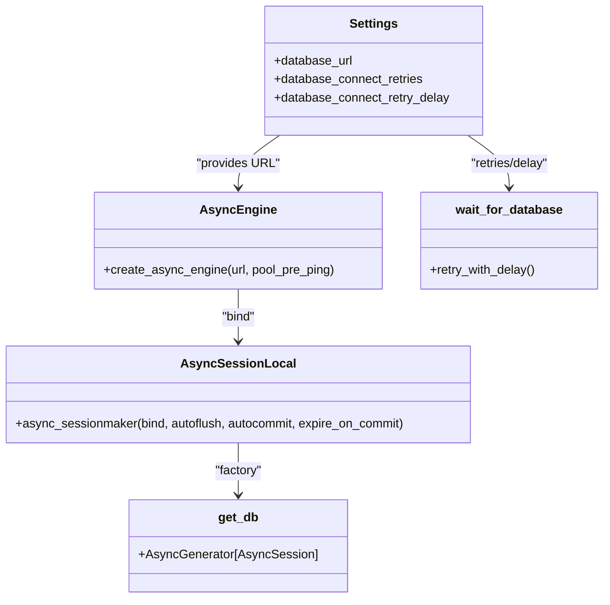
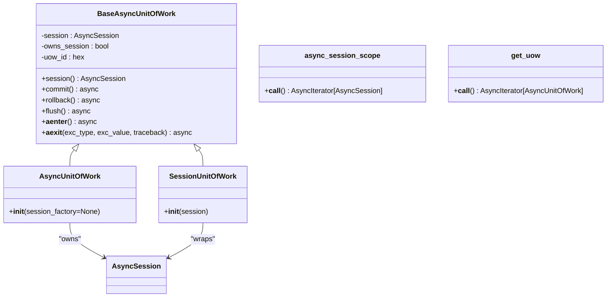
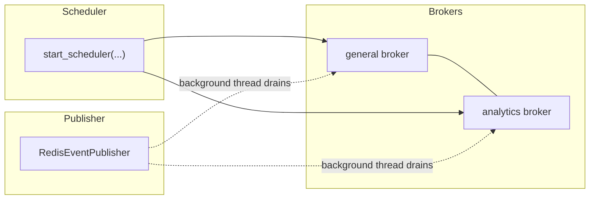
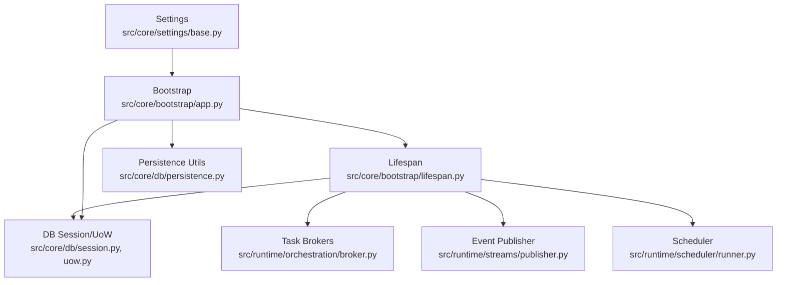

# Core Infrastructure

<cite>
**Referenced Files in This Document**
- [src/main.py](file://src/main.py)
- [src/core/bootstrap/app.py](file://src/core/bootstrap/app.py)
- [src/core/bootstrap/lifespan.py](file://src/core/bootstrap/lifespan.py)
- [src/core/settings/base.py](file://src/core/settings/base.py)
- [src/core/db/session.py](file://src/core/db/session.py)
- [src/core/db/uow.py](file://src/core/db/uow.py)
- [src/core/db/persistence.py](file://src/core/db/persistence.py)
- [src/runtime/orchestration/broker.py](file://src/runtime/orchestration/broker.py)
- [src/runtime/streams/publisher.py](file://src/runtime/streams/publisher.py)
- [src/runtime/scheduler/runner.py](file://src/runtime/scheduler/runner.py)
</cite>

## Table of Contents
1. [Introduction](#introduction)
2. [Project Structure](#project-structure)
3. [Core Components](#core-components)
4. [Architecture Overview](#architecture-overview)
5. [Detailed Component Analysis](#detailed-component-analysis)
6. [Dependency Analysis](#dependency-analysis)
7. [Performance Considerations](#performance-considerations)
8. [Troubleshooting Guide](#troubleshooting-guide)
9. [Conclusion](#conclusion)

## Introduction
This document explains the IRIS core infrastructure: application bootstrap, dependency injection setup, database configuration with SQLAlchemy, session management, and the unit of work pattern. It also documents the settings management system, environment configuration, and lifecycle management. The focus is on the modular architecture foundation, shared services, and cross-cutting concerns such as persistence logging, event streaming, and scheduling. Guidance on performance, error handling, and monitoring is included to support reliable operation of the core infrastructure.

## Project Structure
The core infrastructure spans several modules:
- Bootstrap: application creation, middleware, router inclusion, and lifespan management
- Settings: environment-driven configuration via Pydantic settings
- Database: SQLAlchemy async engine/session factory, session provider, and unit of work
- Persistence utilities: standardized logging and sanitization for persistence operations
- Runtime: task brokers, event publisher, and scheduler for background work

**Diagram sources**
- [src/main.py:1-22](file://src/main.py#L1-L22)
- [src/core/bootstrap/app.py:1-81](file://src/core/bootstrap/app.py#L1-L81)
- [src/core/bootstrap/lifespan.py:1-70](file://src/core/bootstrap/lifespan.py#L1-L70)
- [src/core/settings/base.py:1-90](file://src/core/settings/base.py#L1-L90)
- [src/core/db/session.py:1-72](file://src/core/db/session.py#L1-L72)
- [src/core/db/uow.py:1-109](file://src/core/db/uow.py#L1-L109)
- [src/core/db/persistence.py:1-124](file://src/core/db/persistence.py#L1-L124)
- [src/runtime/orchestration/broker.py:1-23](file://src/runtime/orchestration/broker.py#L1-L23)
- [src/runtime/streams/publisher.py:1-101](file://src/runtime/streams/publisher.py#L1-L101)
- [src/runtime/scheduler/runner.py:1-200](file://src/runtime/scheduler/runner.py#L1-L200)

**Section sources**
- [src/main.py:1-22](file://src/main.py#L1-L22)
- [src/core/bootstrap/app.py:1-81](file://src/core/bootstrap/app.py#L1-L81)
- [src/core/bootstrap/lifespan.py:1-70](file://src/core/bootstrap/lifespan.py#L1-L70)
- [src/core/settings/base.py:1-90](file://src/core/settings/base.py#L1-L90)
- [src/core/db/session.py:1-72](file://src/core/db/session.py#L1-L72)
- [src/core/db/uow.py:1-109](file://src/core/db/uow.py#L1-L109)
- [src/core/db/persistence.py:1-124](file://src/core/db/persistence.py#L1-L124)
- [src/runtime/orchestration/broker.py:1-23](file://src/runtime/orchestration/broker.py#L1-L23)
- [src/runtime/streams/publisher.py:1-101](file://src/runtime/streams/publisher.py#L1-L101)
- [src/runtime/scheduler/runner.py:1-200](file://src/runtime/scheduler/runner.py#L1-L200)

## Core Components
- Application bootstrap and routing: creates a FastAPI app, configures CORS, includes routers, and sets up a deferred lifespan manager
- Lifespan management: orchestrates startup and shutdown sequences for database, Redis, brokers, workers, and schedulers
- Settings management: typed configuration loaded from environment with sensible defaults and normalization
- Database configuration: async SQLAlchemy engine and session factory, plus synchronous fallback for tests and legacy code
- Unit of work pattern: async transaction boundary with commit/rollback hooks and structured logging
- Persistence utilities: standardized logging and sensitive-data sanitization for persistence operations
- Runtime systems: task brokers, event publisher, and scheduler for background jobs

**Section sources**
- [src/core/bootstrap/app.py:49-81](file://src/core/bootstrap/app.py#L49-L81)
- [src/core/bootstrap/lifespan.py:22-70](file://src/core/bootstrap/lifespan.py#L22-L70)
- [src/core/settings/base.py:8-90](file://src/core/settings/base.py#L8-L90)
- [src/core/db/session.py:15-72](file://src/core/db/session.py#L15-L72)
- [src/core/db/uow.py:13-109](file://src/core/db/uow.py#L13-L109)
- [src/core/db/persistence.py:61-124](file://src/core/db/persistence.py#L61-L124)
- [src/runtime/orchestration/broker.py:12-23](file://src/runtime/orchestration/broker.py#L12-L23)
- [src/runtime/streams/publisher.py:22-101](file://src/runtime/streams/publisher.py#L22-L101)
- [src/runtime/scheduler/runner.py:25-200](file://src/runtime/scheduler/runner.py#L25-L200)

## Architecture Overview
The core infrastructure follows a layered design:
- Entry point initializes settings and builds the FastAPI application
- Deferred lifespan manages long-lived resources and background tasks
- Database and Redis connectivity are awaited before serving requests
- Task brokers and event publisher are started and stopped with the application lifecycle
- Scheduler periodically enqueues domain-specific tasks

**Diagram sources**
- [src/main.py:8-22](file://src/main.py#L8-L22)
- [src/core/bootstrap/app.py:49-81](file://src/core/bootstrap/app.py#L49-L81)
- [src/core/bootstrap/lifespan.py:22-70](file://src/core/bootstrap/lifespan.py#L22-L70)
- [src/core/db/session.py:61-72](file://src/core/db/session.py#L61-L72)
- [src/runtime/orchestration/broker.py:12-23](file://src/runtime/orchestration/broker.py#L12-L23)
- [src/runtime/streams/publisher.py:79-101](file://src/runtime/streams/publisher.py#L79-L101)
- [src/runtime/scheduler/runner.py:25-200](file://src/runtime/scheduler/runner.py#L25-L200)

## Detailed Component Analysis

### Application Bootstrap and Routing
- Creates a FastAPI app with title from settings and a deferred lifespan
- Adds CORS middleware configured from settings
- Includes routers for system and multiple feature domains
- Conditionally includes the hypothesis engine router based on settings
- Exposes a method to run migrations during startup

**Diagram sources**
- [src/core/bootstrap/app.py:49-81](file://src/core/bootstrap/app.py#L49-L81)
- [src/core/settings/base.py:87-90](file://src/core/settings/base.py#L87-L90)

**Section sources**
- [src/core/bootstrap/app.py:34-81](file://src/core/bootstrap/app.py#L34-L81)
- [src/core/settings/base.py:87-90](file://src/core/settings/base.py#L87-L90)

### Lifespan Management
- Waits for database and Redis readiness
- Runs Alembic migrations synchronously once during startup
- Registers default receivers (legacy sync) during startup
- Starts task brokers and spawns worker processes
- Initializes scheduler with stop/backfill events
- On shutdown, cancels scheduler tasks, stops workers, shuts down brokers, resets publishers, closes Redis client, and closes carousel clients

**Diagram sources**
- [src/core/bootstrap/lifespan.py:22-70](file://src/core/bootstrap/lifespan.py#L22-L70)

**Section sources**
- [src/core/bootstrap/lifespan.py:22-70](file://src/core/bootstrap/lifespan.py#L22-L70)

### Settings Management System
- Typed settings class with defaults and environment variable aliases
- Normalizes CORS origins from comma-separated strings
- Provides cached getter for settings to avoid repeated parsing
- Supports environment file loading and case-insensitive keys

Key configuration highlights:
- Application identity and server binding
- Database and Redis URLs
- Event stream name and worker/process counts
- Feature flags (e.g., hypothesis engine)
- Portfolio risk and capital parameters
- Retry and delay settings for database and Redis connectivity

**Section sources**
- [src/core/settings/base.py:8-90](file://src/core/settings/base.py#L8-L90)

### Database Configuration with SQLAlchemy
- Async engine and session factory configured with pre-ping
- Synchronous engine/sessionmaker retained for tests and legacy code
- Session provider yields AsyncSession for dependency injection
- Database readiness checked with retries and delays

**Diagram sources**
- [src/core/db/session.py:15-72](file://src/core/db/session.py#L15-L72)
- [src/core/settings/base.py:13-16](file://src/core/settings/base.py#L13-L16)
- [src/core/db/session.py:61-72](file://src/core/db/session.py#L61-L72)

**Section sources**
- [src/core/db/session.py:15-72](file://src/core/db/session.py#L15-L72)
- [src/core/db/session.py:48-54](file://src/core/db/session.py#L48-L54)
- [src/core/db/session.py:61-72](file://src/core/db/session.py#L61-L72)

### Unit of Work Pattern Implementation
- BaseAsyncUnitOfWork wraps an AsyncSession with transaction lifecycle hooks
- Commit, rollback, and flush emit structured logs with a per-uow identifier
- Automatic rollback on exit when exceptions occur
- AsyncUnitOfWork creates and owns a new session; SessionUnitOfWork reuses an existing session
- async_session_scope and get_uow provide convenient dependency-injection contexts

**Diagram sources**
- [src/core/db/uow.py:13-109](file://src/core/db/uow.py#L13-L109)

**Section sources**
- [src/core/db/uow.py:13-109](file://src/core/db/uow.py#L13-L109)

### Persistence Utilities and Logging
- PersistenceComponent standardizes logging with component metadata
- Sanitization redacts sensitive keys and truncates long values
- Freeze/thaw utilities preserve immutability for JSON-like structures
- Logger name for persistence events is exposed for instrumentation

**Section sources**
- [src/core/db/persistence.py:61-124](file://src/core/db/persistence.py#L61-L124)

### Runtime Systems: Brokers, Publisher, and Scheduler
- Task brokers: Redis-backed brokers for general and analytics queues with consumer groups
- Event publisher: synchronous Redis stream writer behind a background thread; exposes publish/flush/close
- Scheduler: periodic task enqueuing for history backfills, price snapshots, pattern/statistics updates, market structure refresh, discovery jobs, portfolio sync, prediction evaluation, and news polling

**Diagram sources**
- [src/runtime/orchestration/broker.py:12-23](file://src/runtime/orchestration/broker.py#L12-L23)
- [src/runtime/streams/publisher.py:22-101](file://src/runtime/streams/publisher.py#L22-L101)
- [src/runtime/scheduler/runner.py:25-200](file://src/runtime/scheduler/runner.py#L25-L200)

**Section sources**
- [src/runtime/orchestration/broker.py:12-23](file://src/runtime/orchestration/broker.py#L12-L23)
- [src/runtime/streams/publisher.py:22-101](file://src/runtime/streams/publisher.py#L22-L101)
- [src/runtime/scheduler/runner.py:25-200](file://src/runtime/scheduler/runner.py#L25-L200)

## Dependency Analysis
The core infrastructure exhibits low coupling and clear separation of concerns:
- Bootstrap depends on settings and runtime components
- Lifespan coordinates database, Redis, brokers, workers, and scheduler
- Database and persistence utilities are foundational and used across modules
- Runtime components are optional and managed centrally in lifespan

**Diagram sources**
- [src/core/settings/base.py:8-90](file://src/core/settings/base.py#L8-L90)
- [src/core/bootstrap/app.py:32-81](file://src/core/bootstrap/app.py#L32-L81)
- [src/core/bootstrap/lifespan.py:19-70](file://src/core/bootstrap/lifespan.py#L19-L70)
- [src/core/db/session.py:10-72](file://src/core/db/session.py#L10-L72)
- [src/core/db/uow.py:10-109](file://src/core/db/uow.py#L10-L109)
- [src/core/db/persistence.py:10-124](file://src/core/db/persistence.py#L10-L124)
- [src/runtime/orchestration/broker.py:3-23](file://src/runtime/orchestration/broker.py#L3-L23)
- [src/runtime/streams/publisher.py:11-101](file://src/runtime/streams/publisher.py#L11-L101)
- [src/runtime/scheduler/runner.py:18-200](file://src/runtime/scheduler/runner.py#L18-L200)

**Section sources**
- [src/core/bootstrap/app.py:32-81](file://src/core/bootstrap/app.py#L32-L81)
- [src/core/bootstrap/lifespan.py:19-70](file://src/core/bootstrap/lifespan.py#L19-L70)
- [src/core/db/session.py:10-72](file://src/core/db/session.py#L10-L72)
- [src/core/db/uow.py:10-109](file://src/core/db/uow.py#L10-L109)
- [src/core/db/persistence.py:10-124](file://src/core/db/persistence.py#L10-L124)
- [src/runtime/orchestration/broker.py:3-23](file://src/runtime/orchestration/broker.py#L3-L23)
- [src/runtime/streams/publisher.py:11-101](file://src/runtime/streams/publisher.py#L11-L101)
- [src/runtime/scheduler/runner.py:18-200](file://src/runtime/scheduler/runner.py#L18-L200)

## Performance Considerations
- Asynchronous I/O: SQLAlchemy async engine and Redis publisher operate asynchronously; ensure handlers remain non-blocking
- Backoff and batching: task intervals and worker counts are configurable; tune for workload characteristics
- Connection pooling: pre-ping enabled on engines; configure retries and delays to balance startup robustness vs. latency
- Logging overhead: persistence logger emits structured events; keep verbosity appropriate for production
- Event publishing: background thread drains; monitor flush behavior and stop conditions during shutdown

[No sources needed since this section provides general guidance]

## Troubleshooting Guide
- Database connectivity failures: verify URL, network, and credentials; check retry count and delay settings; confirm readiness checks succeed
- Redis connectivity failures: verify URL and network reachability; ensure consumer group and queue names match broker configuration
- Migration failures: Alembic runs once at startup; inspect logs around migration invocation and fix schema discrepancies
- Event publishing errors: review RedisError warnings and ensure stream capacity; use flush to drain pending events during shutdown
- Scheduler not running: confirm intervals are positive and scheduler was started with stop/backfill events
- CORS issues: validate origins list; ensure it accepts both string and list formats

**Section sources**
- [src/core/db/session.py:61-72](file://src/core/db/session.py#L61-L72)
- [src/runtime/orchestration/broker.py:12-23](file://src/runtime/orchestration/broker.py#L12-L23)
- [src/core/bootstrap/app.py:37-47](file://src/core/bootstrap/app.py#L37-L47)
- [src/runtime/streams/publisher.py:54-62](file://src/runtime/streams/publisher.py#L54-L62)
- [src/runtime/scheduler/runner.py:25-200](file://src/runtime/scheduler/runner.py#L25-L200)
- [src/core/settings/base.py:79-84](file://src/core/settings/base.py#L79-L84)

## Conclusion
The IRIS core infrastructure provides a robust, modular foundation for the application:
- Bootstrap and lifespan manage startup/shutdown reliably
- Settings drive configuration from environment with strong defaults
- SQLAlchemy async sessions and the unit of work pattern encapsulate transactions and logging
- Persistence utilities standardize observability and safety
- Runtime components coordinate background work via brokers, publisher, and scheduler

Adopting the recommended practices ensures predictable performance, maintainable error handling, and clear monitoring across the system.