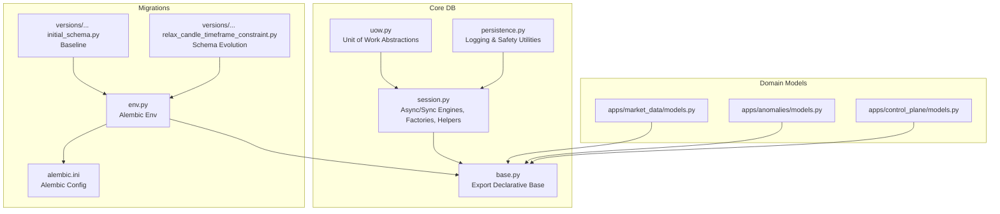
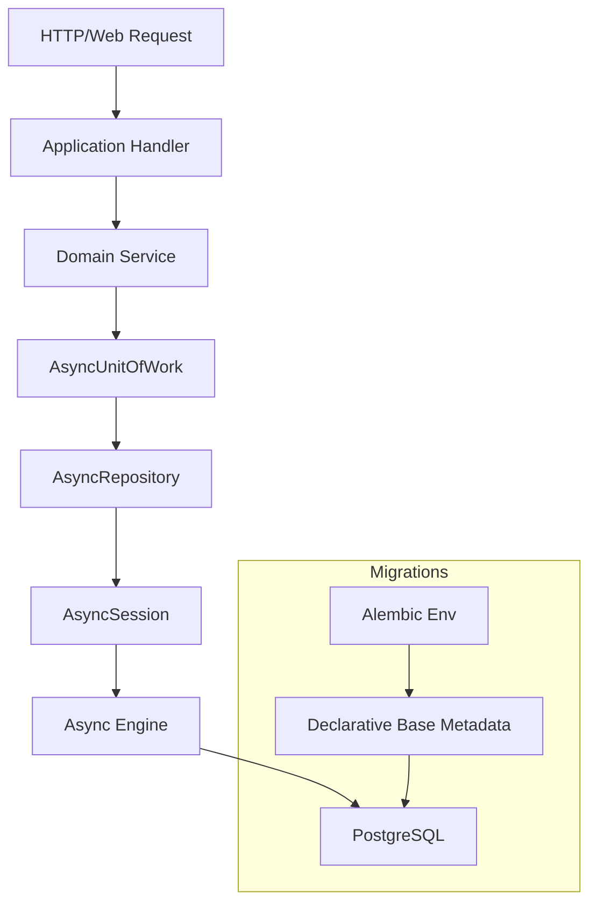
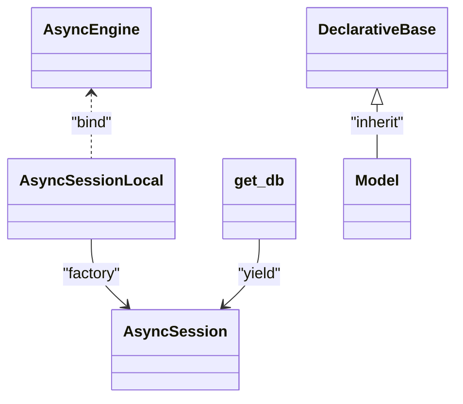
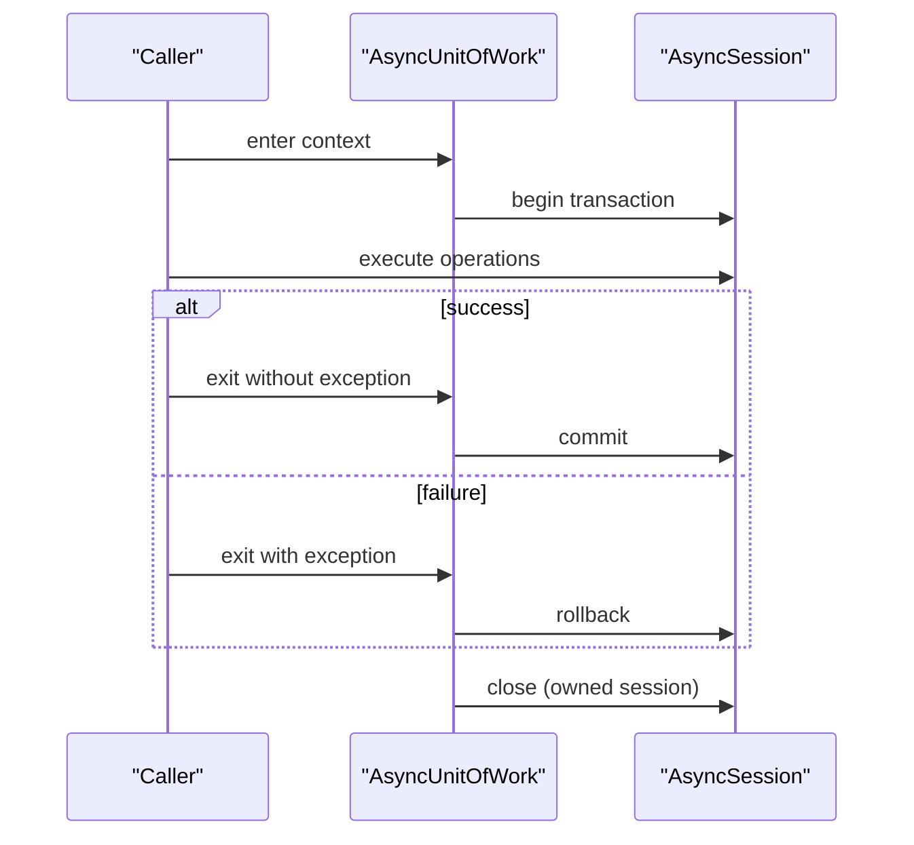
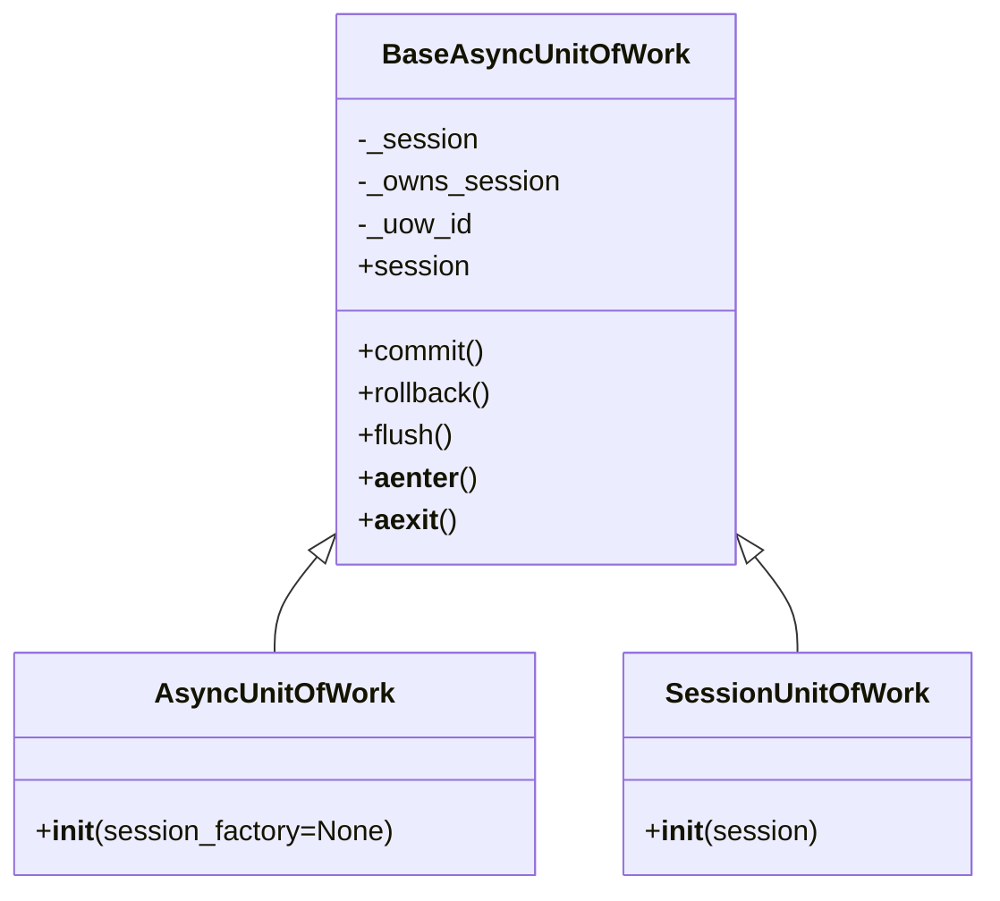
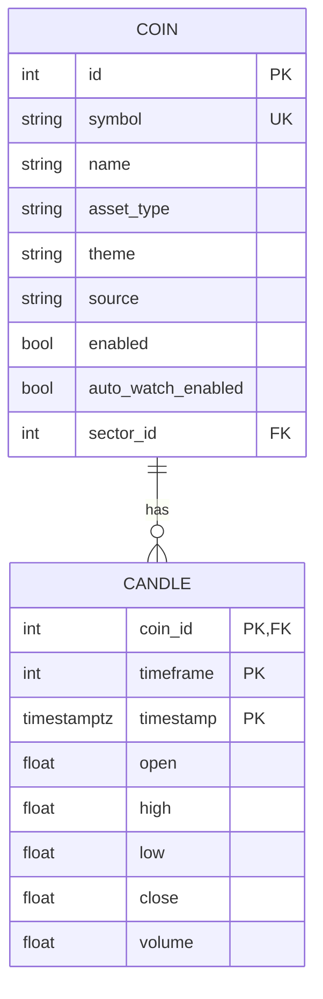
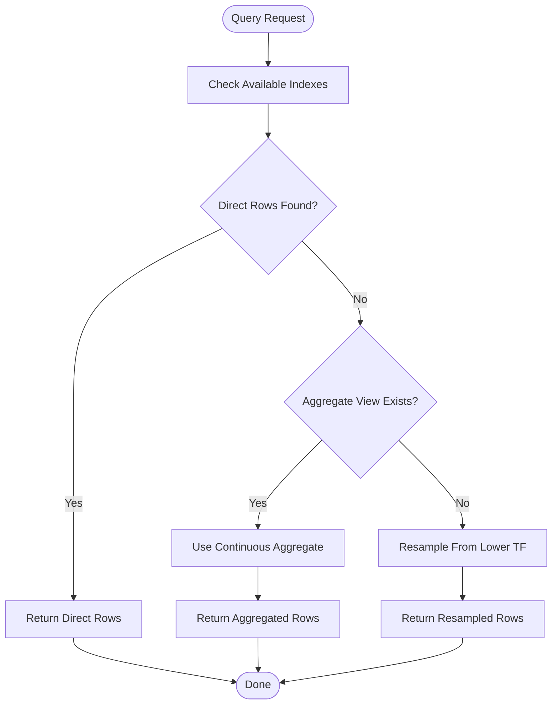
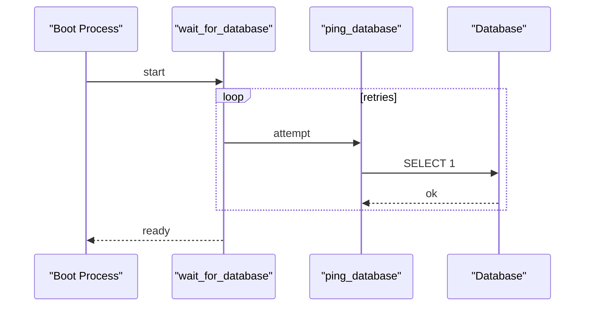
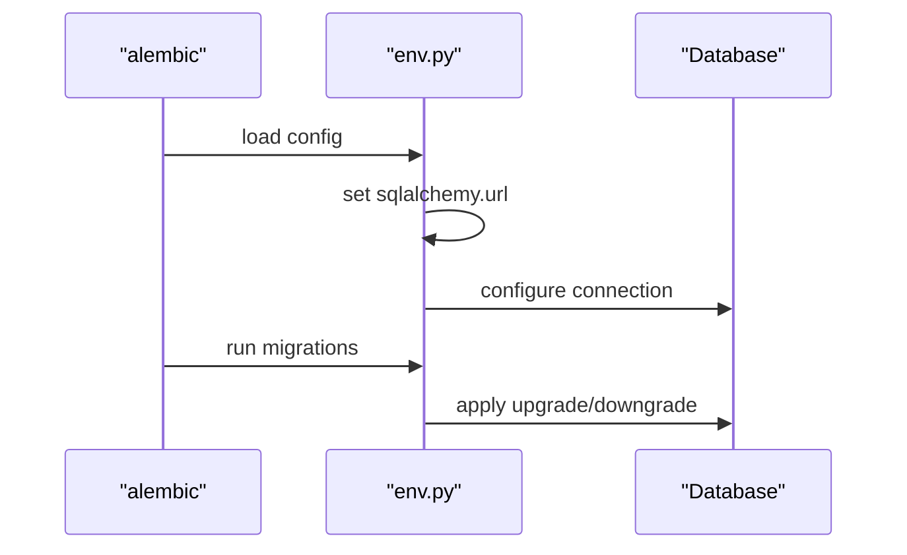
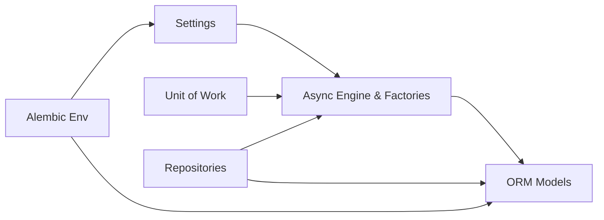

# Database Management

<cite>
**Referenced Files in This Document**
- [session.py](file://src/core/db/session.py)
- [uow.py](file://src/core/db/uow.py)
- [persistence.py](file://src/core/db/persistence.py)
- [base.py](file://src/core/db/base.py)
- [base.py](file://src/core/settings/base.py)
- [env.py](file://src/migrations/env.py)
- [alembic.ini](file://alembic.ini)
- [20260310_000001_initial_schema.py](file://src/migrations/versions/20260310_000001_initial_schema.py)
- [20260311_000009_relax_candle_timeframe_constraint.py](file://src/migrations/versions/20260311_000009_relax_candle_timeframe_constraint.py)
- [market_data/models.py](file://src/apps/market_data/models.py)
- [anomalies/models.py](file://src/apps/anomalies/models.py)
- [control_plane/models.py](file://src/apps/control_plane/models.py)
- [market_data/repositories.py](file://src/apps/market_data/repositories.py)
</cite>

## Table of Contents
1. [Introduction](#introduction)
2. [Project Structure](#project-structure)
3. [Core Components](#core-components)
4. [Architecture Overview](#architecture-overview)
5. [Detailed Component Analysis](#detailed-component-analysis)
6. [Dependency Analysis](#dependency-analysis)
7. [Performance Considerations](#performance-considerations)
8. [Troubleshooting Guide](#troubleshooting-guide)
9. [Conclusion](#conclusion)
10. [Appendices](#appendices)

## Introduction
This document explains the IRIS database management system with a focus on SQLAlchemy ORM configuration, declarative base setup, asynchronous database sessions, connection pooling, the session factory pattern, transaction management, unit of work implementation, schema design principles, relationship mappings, query optimization strategies, connection string configuration, SSL settings, migration workflows, performance tuning, connection limits, and error handling.

## Project Structure
IRIS organizes database concerns under a dedicated core package and leverages Alembic for migrations. The key areas are:
- Declarative base and session factories for async/sync engines
- Unit of work abstractions for transaction control
- Persistence utilities for logging and safe value handling
- Application models grouped by domain
- Migration scripts and Alembic configuration

**Diagram sources**
- [session.py:1-72](file://src/core/db/session.py#L1-L72)
- [uow.py:1-109](file://src/core/db/uow.py#L1-L109)
- [persistence.py:1-124](file://src/core/db/persistence.py#L1-L124)
- [base.py:1-4](file://src/core/db/base.py#L1-L4)
- [env.py:1-56](file://src/migrations/env.py#L1-L56)
- [alembic.ini:1-38](file://alembic.ini#L1-L38)
- [20260310_000001_initial_schema.py:1-59](file://src/migrations/versions/20260310_000001_initial_schema.py#L1-L59)
- [20260311_000009_relax_candle_timeframe_constraint.py:1-25](file://src/migrations/versions/20260311_000009_relax_candle_timeframe_constraint.py#L1-L25)
- [market_data/models.py:1-168](file://src/apps/market_data/models.py#L1-L168)
- [anomalies/models.py:1-124](file://src/apps/anomalies/models.py#L1-L124)
- [control_plane/models.py:1-259](file://src/apps/control_plane/models.py#L1-L259)

**Section sources**
- [session.py:1-72](file://src/core/db/session.py#L1-L72)
- [uow.py:1-109](file://src/core/db/uow.py#L1-L109)
- [persistence.py:1-124](file://src/core/db/persistence.py#L1-L124)
- [base.py:1-4](file://src/core/db/base.py#L1-L4)
- [env.py:1-56](file://src/migrations/env.py#L1-L56)
- [alembic.ini:1-38](file://alembic.ini#L1-L38)
- [20260310_000001_initial_schema.py:1-59](file://src/migrations/versions/20260310_000001_initial_schema.py#L1-L59)
- [20260311_000009_relax_candle_timeframe_constraint.py:1-25](file://src/migrations/versions/20260311_000009_relax_candle_timeframe_constraint.py#L1-L25)
- [market_data/models.py:1-168](file://src/apps/market_data/models.py#L1-L168)
- [anomalies/models.py:1-124](file://src/apps/anomalies/models.py#L1-L124)
- [control_plane/models.py:1-259](file://src/apps/control_plane/models.py#L1-L259)

## Core Components
- Declarative base and engines
  - Asynchronous and synchronous SQLAlchemy engines are created from settings-derived URLs with pre-ping enabled for robust connection health checks.
  - A shared DeclarativeBase subclass is exported for all models to inherit from.
- Session factories and dependency injection
  - AsyncSessionLocal and SessionLocal provide scoped factories bound to their respective engines.
  - An async generator get_db yields AsyncSession instances for dependency injection in request lifecycles.
- Unit of Work
  - BaseAsyncUnitOfWork encapsulates transaction lifecycle with commit, rollback, flush, and context manager hooks.
  - AsyncUnitOfWork creates and owns a new session; SessionUnitOfWork wraps an existing session without owning it.
  - Utility async_session_scope and get_uow simplify usage in services and tasks.
- Persistence utilities
  - PERSISTENCE_LOGGER centralizes persistence logs with sensitive data sanitization and frozen/thawed JSON helpers.
  - AsyncRepository and AsyncQueryService provide typed components for repositories and read-side services.

**Section sources**
- [session.py:15-72](file://src/core/db/session.py#L15-L72)
- [base.py:1-4](file://src/core/db/base.py#L1-L4)
- [uow.py:13-109](file://src/core/db/uow.py#L13-L109)
- [persistence.py:61-124](file://src/core/db/persistence.py#L61-L124)

## Architecture Overview
IRIS uses an async-first ORM architecture with explicit transaction boundaries via the unit of work. Repositories operate within a session, and services orchestrate business operations while ensuring commits or rollbacks. Migrations evolve the schema through Alembic, sourcing the database URL from settings.

**Diagram sources**
- [session.py:48-72](file://src/core/db/session.py#L48-L72)
- [uow.py:75-94](file://src/core/db/uow.py#L75-L94)
- [env.py:17-18](file://src/migrations/env.py#L17-L18)

## Detailed Component Analysis

### SQLAlchemy ORM Configuration and Declarative Base
- Declarative base
  - A lightweight DeclarativeBase subclass is defined and exported for model declaration.
- Engines and factories
  - Async engine and sessionmaker are configured with future=True and pool_pre_ping=True for connection health.
  - Synchronous engine and sessionmaker mirror async settings for legacy/test usage.
- Dependency injection
  - get_db yields AsyncSession for request-scoped lifecycles.

**Diagram sources**
- [session.py:15-54](file://src/core/db/session.py#L15-L54)
- [base.py:1-4](file://src/core/db/base.py#L1-L4)

**Section sources**
- [session.py:15-54](file://src/core/db/session.py#L15-L54)
- [base.py:1-4](file://src/core/db/base.py#L1-L4)

### Session Factory Pattern and Transaction Management
- Session factory pattern
  - AsyncSessionLocal provides a factory bound to the async engine; get_db yields a scoped AsyncSession for dependency injection.
- Transaction management
  - BaseAsyncUnitOfWork implements __aenter__/__aexit__ to log and manage transactions.
  - commit, rollback, and flush methods are exposed with structured logging.
  - Ownership semantics: AsyncUnitOfWork owns the session; SessionUnitOfWork wraps an external session.

**Diagram sources**
- [uow.py:23-67](file://src/core/db/uow.py#L23-L67)

**Section sources**
- [uow.py:13-109](file://src/core/db/uow.py#L13-L109)

### Unit of Work Implementation
- BaseAsyncUnitOfWork
  - Tracks a uow_id for logging, exposes commit/rollback/flush, and ensures cleanup in __aexit__.
  - Detects open transactions and logs appropriate events.
- AsyncUnitOfWork vs SessionUnitOfWork
  - AsyncUnitOfWork constructs and owns a new session via AsyncSessionLocal.
  - SessionUnitOfWork accepts an existing AsyncSession and does not close it.

**Diagram sources**
- [uow.py:13-89](file://src/core/db/uow.py#L13-L89)

**Section sources**
- [uow.py:13-89](file://src/core/db/uow.py#L13-L89)

### Database Schema Design Principles and Relationship Mappings
- Domain-driven modeling
  - Models are grouped per domain (market_data, anomalies, control_plane) and inherit from the shared DeclarativeBase.
- Primary keys, indexes, and constraints
  - Composite primary keys are used for time-series tables (e.g., candles).
  - Unique and multi-column indexes optimize frequent queries (e.g., coins symbol, candles composite index).
  - Foreign keys define referential integrity with cascading deletes where appropriate.
- Relationships
  - One-to-many and many-to-one relationships are declared with back_populates/cascade configurations to maintain data consistency.
- Example models
  - MarketData: Coin and Candle with rich relationships and indexes.
  - Anomalies: MarketAnomaly and MarketStructureSnapshot with domain-specific indexes.
  - ControlPlane: EventDefinition, EventConsumer, EventRoute, TopologyDraft variants with complex relationships.

**Diagram sources**
- [market_data/models.py:20-168](file://src/apps/market_data/models.py#L20-L168)

**Section sources**
- [market_data/models.py:20-168](file://src/apps/market_data/models.py#L20-L168)
- [anomalies/models.py:15-124](file://src/apps/anomalies/models.py#L15-L124)
- [control_plane/models.py:15-259](file://src/apps/control_plane/models.py#L15-L259)

### Query Optimization Strategies
- Index selection
  - Multi-column indexes on (coin_id, timeframe, timestamp) and unique indexes on (coin_id, timeframe, venue, timestamp) accelerate time-series queries.
- Aggregation and continuous aggregates
  - Repositories leverage Timescale continuous aggregates and SQL aggregation to avoid scanning raw high-frequency data.
- Upsert patterns
  - ON CONFLICT DO UPDATE reduces round-trips for time-series updates.
- Bulk operations
  - Bulk upserts and batched deletes minimize network overhead.

**Diagram sources**
- [market_data/repositories.py:179-278](file://src/apps/market_data/repositories.py#L179-L278)

**Section sources**
- [market_data/repositories.py:179-278](file://src/apps/market_data/repositories.py#L179-L278)

### Connection String Configuration and SSL Settings
- Connection string
  - DATABASE_URL is loaded from environment via settings and passed to both async and sync engines.
- SSL/TLS
  - The configuration relies on SQLAlchemy’s URL parsing. To enable SSL/TLS, append the desired SSL parameters to the DATABASE_URL (e.g., sslmode).
- Connection retries and readiness
  - wait_for_database pings the database a configurable number of times with a delay to handle startup races.

**Diagram sources**
- [session.py:61-72](file://src/core/db/session.py#L61-L72)

**Section sources**
- [base.py:13-16](file://src/core/settings/base.py#L13-L16)
- [session.py:61-72](file://src/core/db/session.py#L61-L72)

### Database Migration Workflows
- Alembic environment
  - env.py loads settings and sets the SQLAlchemy URL, exposing Base.metadata for migrations.
- Offline vs online modes
  - Offline mode writes migrations against the URL; online mode uses a connected engine from config.
- Migration scripts
  - Initial schema defines core tables and indexes.
  - Subsequent migrations evolve constraints and indexes safely.

**Diagram sources**
- [env.py:17-56](file://src/migrations/env.py#L17-L56)

**Section sources**
- [env.py:1-56](file://src/migrations/env.py#L1-56)
- [alembic.ini:1-38](file://alembic.ini#L1-L38)
- [20260310_000001_initial_schema.py:20-59](file://src/migrations/versions/20260310_000001_initial_schema.py#L20-L59)
- [20260311_000009_relax_candle_timeframe_constraint.py:19-25](file://src/migrations/versions/20260311_000009_relax_candle_timeframe_constraint.py#L19-L25)

## Dependency Analysis
- Cohesion and coupling
  - Models depend on the shared DeclarativeBase; repositories depend on AsyncSession and models.
  - Unit of work isolates transaction control from repositories/services.
- External dependencies
  - Alembic manages schema evolution; settings drive database connectivity.
- Potential circular dependencies
  - Base exports are minimal; imports are unidirectional from models to Base.

**Diagram sources**
- [session.py:10-12](file://src/core/db/session.py#L10-L12)
- [env.py:8-12](file://src/migrations/env.py#L8-L12)

**Section sources**
- [session.py:10-12](file://src/core/db/session.py#L10-L12)
- [env.py:8-12](file://src/migrations/env.py#L8-L12)

## Performance Considerations
- Connection pooling and health checks
  - pool_pre_ping=True ensures stale connections are recycled; consider tuning pool_size and max_overflow in production deployments.
- Asynchronous I/O
  - Prefer AsyncSession for I/O-bound workloads; avoid mixing sync/async engines unnecessarily.
- Query optimization
  - Use targeted indexes and continuous aggregates to reduce scan costs.
  - Batch operations and upserts minimize round trips.
- Logging overhead
  - PERSISTENCE_LOGGER emits structured logs; ensure log levels are tuned in production.

[No sources needed since this section provides general guidance]

## Troubleshooting Guide
- Connection failures during boot
  - wait_for_database retries until the database responds; adjust database_connect_retries and database_connect_retry_delay accordingly.
- Transaction errors
  - BaseAsyncUnitOfWork logs uow.commit, uow.rollback, and uow.exit_error; inspect logs for exceptions and ensure proper exception propagation.
- Sensitive data exposure
  - sanitize_log_value redacts sensitive keys; verify that PERSISTENCE_LOGGER is configured appropriately.

**Section sources**
- [session.py:61-72](file://src/core/db/session.py#L61-L72)
- [uow.py:30-67](file://src/core/db/uow.py#L30-L67)
- [persistence.py:41-58](file://src/core/db/persistence.py#L41-L58)

## Conclusion
IRIS implements a clean, async-first database layer built on SQLAlchemy with a strong emphasis on transaction control via the unit of work, robust session factories, and domain-driven schema design. Migrations are managed through Alembic, and repositories encapsulate query logic with performance-conscious patterns. Proper configuration of connection strings, SSL, and retry behavior ensures reliable operation across environments.

## Appendices

### Appendix A: Settings Reference
- database_url: Connection string for PostgreSQL (supports SSL via URL parameters).
- database_connect_retries, database_connect_retry_delay: Startup retry configuration.

**Section sources**
- [base.py:13-16](file://src/core/settings/base.py#L13-L16)
- [base.py:67-70](file://src/core/settings/base.py#L67-L70)