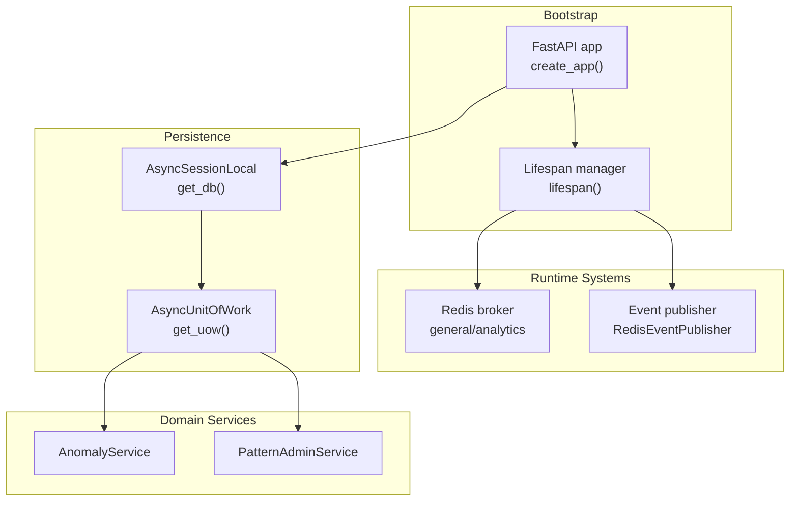
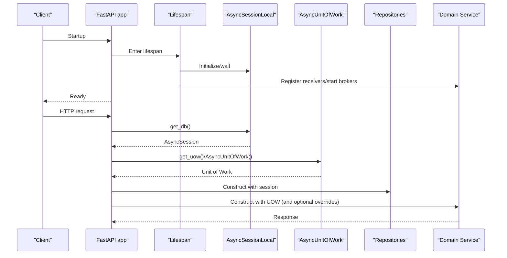
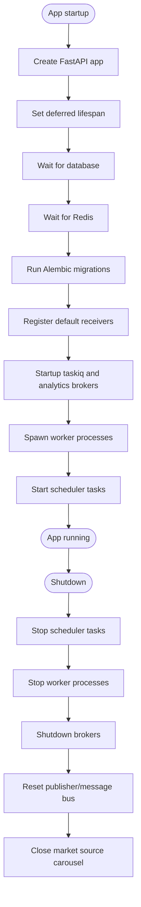
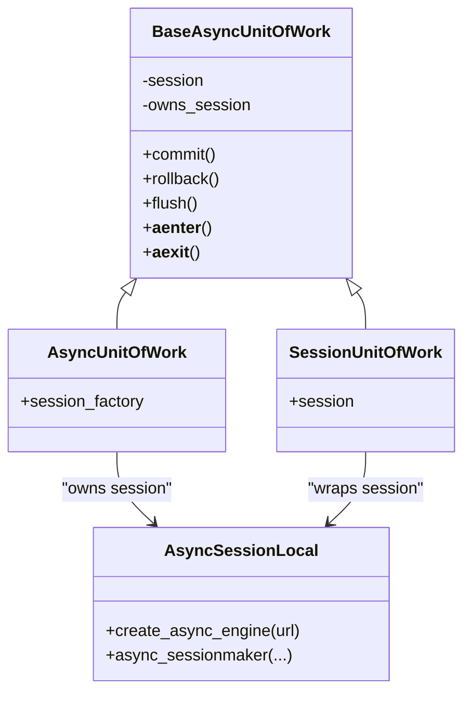
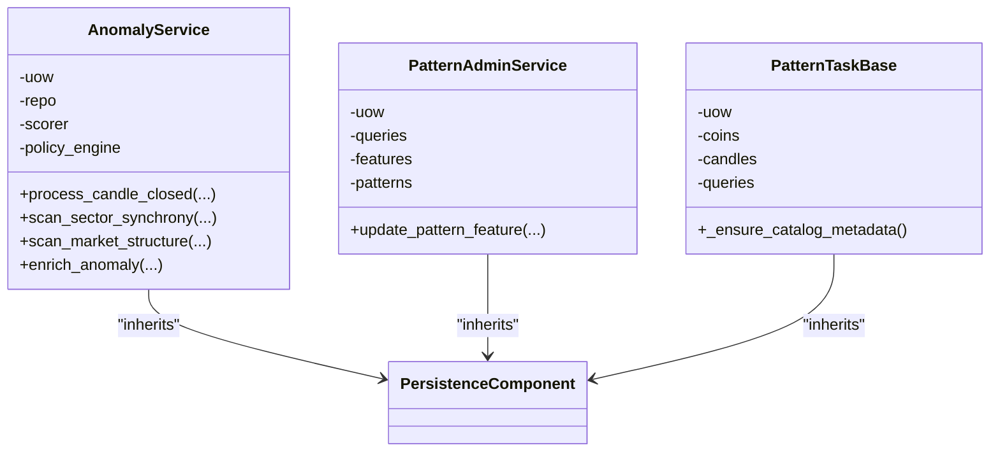
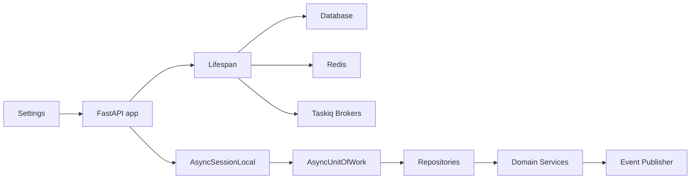

# Dependency Injection

<cite>
**Referenced Files in This Document**
- [app.py](file://src/core/bootstrap/app.py)
- [lifespan.py](file://src/core/bootstrap/lifespan.py)
- [main.py](file://src/main.py)
- [base.py](file://src/core/settings/base.py)
- [session.py](file://src/core/db/session.py)
- [uow.py](file://src/core/db/uow.py)
- [persistence.py](file://src/core/db/persistence.py)
- [broker.py](file://src/runtime/orchestration/broker.py)
- [publisher.py](file://src/runtime/streams/publisher.py)
- [anomaly_service.py](file://src/apps/anomalies/services/anomaly_service.py)
- [service_layer.py](file://src/apps/market_data/service_layer.py)
- [patterns_services.py](file://src/apps/patterns/services.py)
- [patterns_repositories.py](file://src/apps/patterns/repositories.py)
- [patterns_task_service_base.py](file://src/apps/patterns/task_service_base.py)
- [test_bootstrap_db_main.py](file://tests/core/test_bootstrap_db_main.py)
</cite>

## Table of Contents
1. [Introduction](#introduction)
2. [Project Structure](#project-structure)
3. [Core Components](#core-components)
4. [Architecture Overview](#architecture-overview)
5. [Detailed Component Analysis](#detailed-component-analysis)
6. [Dependency Analysis](#dependency-analysis)
7. [Performance Considerations](#performance-considerations)
8. [Troubleshooting Guide](#troubleshooting-guide)
9. [Conclusion](#conclusion)

## Introduction
This document explains the dependency injection system in IRIS, focusing on how the FastAPI application composes cross-cutting concerns and service-layer components. It covers:
- How shared services are constructed and injected into application components
- Repository and unit-of-work patterns
- Service-layer integration and lifecycle management
- Dependency resolution process, lifetime semantics, and testing strategies with mock dependencies
- Best practices for organizing dependencies, avoiding circular imports, and maintaining clean architecture boundaries

## Project Structure
IRIS follows a layered architecture with clear separation between FastAPI bootstrap, settings, persistence, runtime systems, and application domains. The DI model centers around:
- Application factory and lifespan for startup/shutdown orchestration
- Global singletons for external systems (database, Redis, brokers)
- Per-request or per-task unit-of-work and repositories
- Domain services that compose repositories, scorers, and policies

**Diagram sources**
- [app.py:49-81](file://src/core/bootstrap/app.py#L49-L81)
- [lifespan.py:22-70](file://src/core/bootstrap/lifespan.py#L22-L70)
- [broker.py:12-23](file://src/runtime/orchestration/broker.py#L12-L23)
- [publisher.py:79-101](file://src/runtime/streams/publisher.py#L79-L101)
- [session.py:48-54](file://src/core/db/session.py#L48-L54)
- [uow.py:91-109](file://src/core/db/uow.py#L91-L109)
- [anomaly_service.py:44-79](file://src/apps/anomalies/services/anomaly_service.py#L44-L79)
- [patterns_services.py:10-16](file://src/apps/patterns/services.py#L10-L16)

**Section sources**
- [app.py:49-81](file://src/core/bootstrap/app.py#L49-L81)
- [lifespan.py:22-70](file://src/core/bootstrap/lifespan.py#L22-L70)
- [main.py:1-21](file://src/main.py#L1-L21)

## Core Components
- FastAPI application factory and lifespan: Creates the ASGI app, registers routers, middleware, and orchestrates startup/shutdown of external systems.
- Settings: Provides typed configuration via a cached settings provider.
- Database session and unit of work: Supplies async database sessions and transactional boundaries.
- Persistence base classes: Standardize logging and component metadata for repositories and query services.
- Runtime systems: Redis-backed brokers and a thread-drained event publisher.
- Domain services: Compose repositories, scorers, and policies; optionally accept overrides for testing.

Key DI anchors:
- Application creation and deferred lifespan
- Global singletons for external systems
- Request/task-scoped unit of work and repositories
- Optional constructor overrides for domain services

**Section sources**
- [base.py:87-90](file://src/core/settings/base.py#L87-L90)
- [session.py:19-54](file://src/core/db/session.py#L19-L54)
- [uow.py:13-109](file://src/core/db/uow.py#L13-L109)
- [persistence.py:95-123](file://src/core/db/persistence.py#L95-L123)
- [broker.py:12-23](file://src/runtime/orchestration/broker.py#L12-L23)
- [publisher.py:79-101](file://src/runtime/streams/publisher.py#L79-L101)
- [anomaly_service.py:44-79](file://src/apps/anomalies/services/anomaly_service.py#L44-L79)
- [patterns_services.py:10-16](file://src/apps/patterns/services.py#L10-L16)

## Architecture Overview
The DI architecture blends FastAPI’s dependency model with explicit composition:
- Global singletons are initialized in the lifespan and attached to app.state for later access.
- Per-request or per-task components (database session, unit of work, repositories) are created on demand.
- Domain services receive either default constructed collaborators or overrideable dependencies for testing.

**Diagram sources**
- [app.py:49-81](file://src/core/bootstrap/app.py#L49-L81)
- [lifespan.py:22-70](file://src/core/bootstrap/lifespan.py#L22-L70)
- [session.py:48-54](file://src/core/db/session.py#L48-L54)
- [uow.py:91-109](file://src/core/db/uow.py#L91-L109)
- [anomaly_service.py:44-79](file://src/apps/anomalies/services/anomaly_service.py#L44-L79)

## Detailed Component Analysis

### FastAPI Application Factory and Lifespan
- The application factory creates a FastAPI app with CORS middleware and includes all domain routers. It sets a deferred lifespan that initializes external systems and runs migrations.
- The lifespan waits for database and Redis readiness, runs Alembic migrations synchronously once, registers legacy console receivers, starts brokers, spawns worker processes, and starts the scheduler. On shutdown, it tears down workers, brokers, and resets publishers and message buses.

**Diagram sources**
- [app.py:49-81](file://src/core/bootstrap/app.py#L49-L81)
- [lifespan.py:22-70](file://src/core/bootstrap/lifespan.py#L22-L70)

**Section sources**
- [app.py:49-81](file://src/core/bootstrap/app.py#L49-L81)
- [lifespan.py:22-70](file://src/core/bootstrap/lifespan.py#L22-L70)
- [test_bootstrap_db_main.py:19-55](file://tests/core/test_bootstrap_db_main.py#L19-L55)
- [test_bootstrap_db_main.py:57-148](file://tests/core/test_bootstrap_db_main.py#L57-L148)

### Settings and Configuration
- Settings are loaded via a cached provider to avoid repeated parsing and to centralize configuration access across the app.
- Environment variables are normalized and validated, including CORS origins and feature flags.

**Section sources**
- [base.py:87-90](file://src/core/settings/base.py#L87-L90)

### Database Session and Unit of Work
- Asynchronous SQLAlchemy engine and session factory are created from settings.
- A generator yields sessions per request; a unit-of-work context manager wraps transactions and logs lifecycle events.
- Two forms are provided: owning a new session or wrapping an existing session.

**Diagram sources**
- [session.py:19-54](file://src/core/db/session.py#L19-L54)
- [uow.py:13-109](file://src/core/db/uow.py#L13-L109)

**Section sources**
- [session.py:19-54](file://src/core/db/session.py#L19-L54)
- [uow.py:13-109](file://src/core/db/uow.py#L13-L109)

### Persistence Component Base
- Repositories and query services inherit from a base that logs persistence events and annotates logs with component metadata (domain, component type, component name).
- This enables consistent observability across repositories and query services.

**Section sources**
- [persistence.py:95-123](file://src/core/db/persistence.py#L95-L123)

### Runtime Systems: Brokers and Event Publisher
- Taskiq brokers are configured with Redis and consumer groups for general and analytics queues.
- A thread-driven Redis event publisher enqueues events off the main loop and drains them on a background thread, exposing a synchronous enqueue API.

**Section sources**
- [broker.py:12-23](file://src/runtime/orchestration/broker.py#L12-L23)
- [publisher.py:22-101](file://src/runtime/streams/publisher.py#L22-L101)

### Domain Services: Composition and Overrides
- Services construct repositories and query services using the current session from a unit of work.
- Constructors accept optional overrides for collaborators (e.g., scorers, policy engines) to support testing and controlled behavior.
- Some services also depend on global publishers for asynchronous side effects.

**Diagram sources**
- [anomaly_service.py:44-79](file://src/apps/anomalies/services/anomaly_service.py#L44-L79)
- [patterns_services.py:10-16](file://src/apps/patterns/services.py#L10-L16)
- [patterns_task_service_base.py:26-57](file://src/apps/patterns/task_service_base.py#L26-L57)

**Section sources**
- [anomaly_service.py:44-79](file://src/apps/anomalies/services/anomaly_service.py#L44-L79)
- [patterns_services.py:10-16](file://src/apps/patterns/services.py#L10-L16)
- [patterns_task_service_base.py:26-57](file://src/apps/patterns/task_service_base.py#L26-L57)

### Repository Patterns
- Repositories are thin wrappers around the session, inheriting persistence logging and component metadata.
- They encapsulate CRUD and specialized queries, often using “for update” semantics for concurrency control.

**Section sources**
- [patterns_repositories.py:10-28](file://src/apps/patterns/repositories.py#L10-L28)
- [persistence.py:95-123](file://src/core/db/persistence.py#L95-L123)

### Service Layer Integration
- The market data service layer demonstrates a hybrid approach: it uses synchronous helpers for legacy paths but integrates with async orchestration and publishers.
- It depends on repositories and publishers to emit domain events.

**Section sources**
- [service_layer.py:54-71](file://src/apps/market_data/service_layer.py#L54-L71)

## Dependency Analysis
- Coupling and cohesion:
  - Domain services depend on repositories and query services via the session provided by the unit of work, keeping business logic cohesive and testable.
  - Global singletons (database, Redis, brokers) are accessed through the lifespan and app.state, minimizing tight coupling in request handlers.
- Direct and indirect dependencies:
  - AnomalyService depends on AnomalyRepo, AnomalyScorer, and AnomalyPolicyEngine; these are either constructed by default or overridden.
  - PatternAdminService composes repositories and a query service from the same session.
- External dependencies and integration points:
  - Redis-backed brokers and a thread-driven publisher integrate asynchronously with the request path.
- Interface contracts and implementation details:
  - PersistenceComponent defines a consistent logging interface for repositories and query services.
  - Unit of work ensures transactional boundaries and deterministic cleanup.

**Diagram sources**
- [base.py:87-90](file://src/core/settings/base.py#L87-L90)
- [app.py:49-81](file://src/core/bootstrap/app.py#L49-L81)
- [lifespan.py:22-70](file://src/core/bootstrap/lifespan.py#L22-L70)
- [session.py:19-54](file://src/core/db/session.py#L19-L54)
- [uow.py:13-109](file://src/core/db/uow.py#L13-L109)
- [anomaly_service.py:44-79](file://src/apps/anomalies/services/anomaly_service.py#L44-L79)
- [publisher.py:79-101](file://src/runtime/streams/publisher.py#L79-L101)

**Section sources**
- [base.py:87-90](file://src/core/settings/base.py#L87-L90)
- [app.py:49-81](file://src/core/bootstrap/app.py#L49-L81)
- [lifespan.py:22-70](file://src/core/bootstrap/lifespan.py#L22-L70)
- [session.py:19-54](file://src/core/db/session.py#L19-L54)
- [uow.py:13-109](file://src/core/db/uow.py#L13-L109)
- [anomaly_service.py:44-79](file://src/apps/anomalies/services/anomaly_service.py#L44-L79)
- [publisher.py:79-101](file://src/runtime/streams/publisher.py#L79-L101)

## Performance Considerations
- Background event publishing: The event publisher drains Redis writes on a dedicated thread, preventing blocking the main event loop.
- Synchronous waits: Database and Redis readiness checks are awaited; migrations and legacy receiver registration run once during startup outside the request path.
- Transactional boundaries: Unit of work commits or rolls back deterministically, reducing contention and ensuring consistency.

[No sources needed since this section provides general guidance]

## Troubleshooting Guide
Common issues and remedies:
- Database connectivity failures during startup: The lifespan retries connection according to settings and raises the last error after retries are exhausted.
- Redis unavailability: Similar retry and delay mechanism applies.
- Migration failures: Alembic upgrades run synchronously once at startup; check logs for errors.
- Publisher stalls: The publisher exposes a flush method guarded by an internal event; use it to drain pending items before shutdown.

**Section sources**
- [session.py:61-72](file://src/core/db/session.py#L61-L72)
- [lifespan.py:22-70](file://src/core/bootstrap/lifespan.py#L22-L70)
- [publisher.py:63-74](file://src/runtime/streams/publisher.py#L63-L74)

## Conclusion
IRIS implements a pragmatic dependency injection model:
- Global singletons are provisioned in the lifespan and exposed via app.state.
- Per-request or per-task components (session, unit of work, repositories) are created on demand.
- Domain services compose collaborators and accept overrides for testing.
- Cross-cutting concerns (persistence logging, event publishing, broker orchestration) are centralized and observable.
This design supports clean architecture boundaries, testability, and operational reliability.