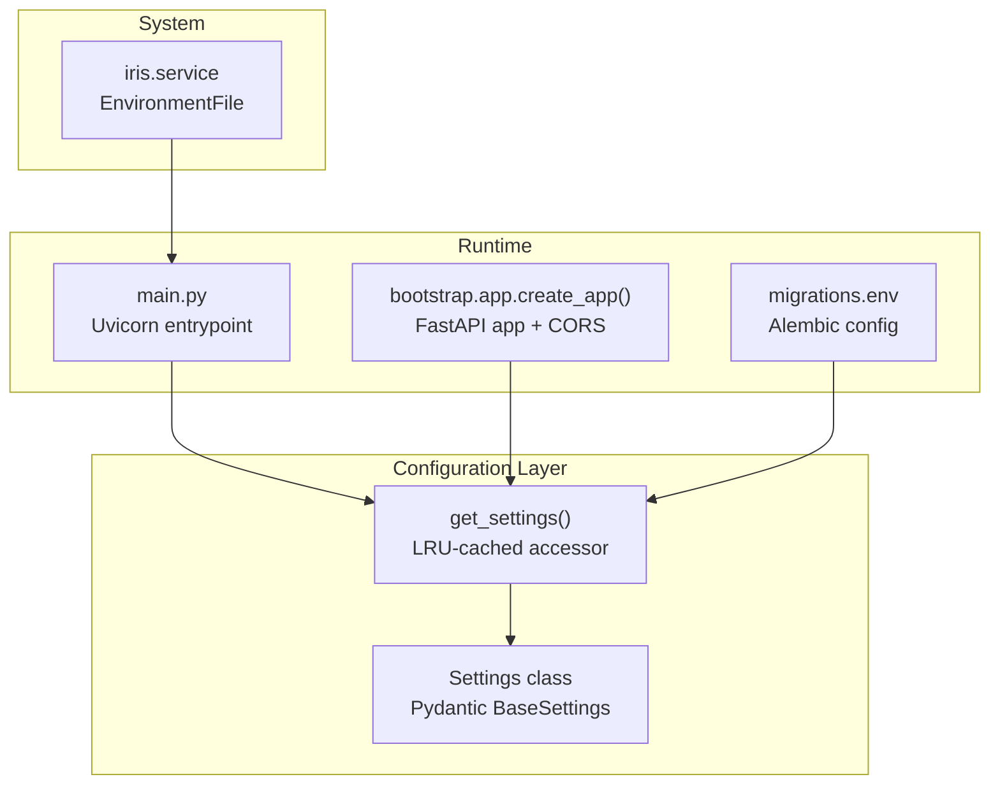
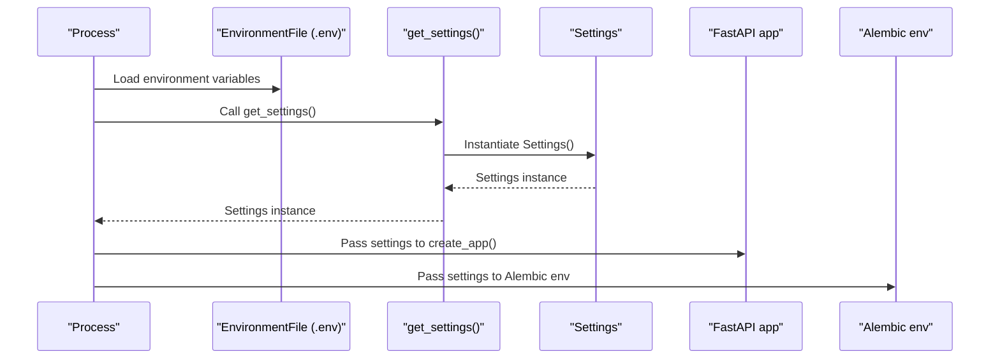
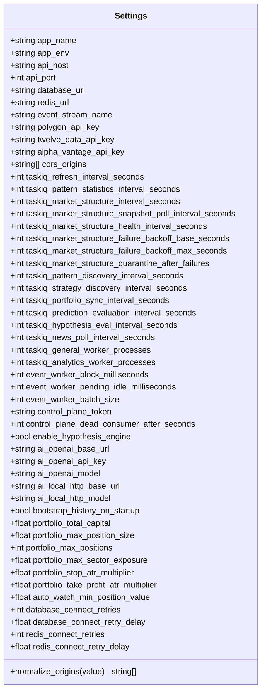
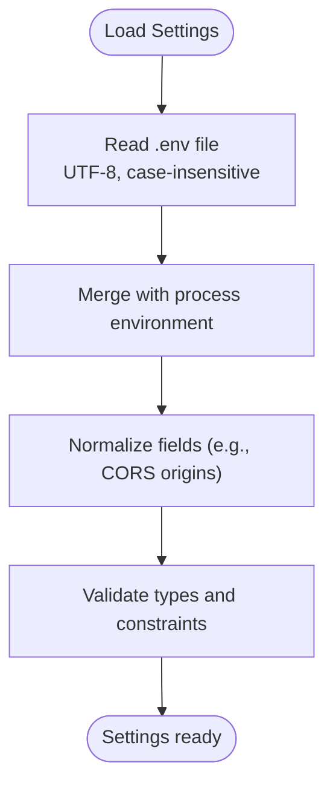
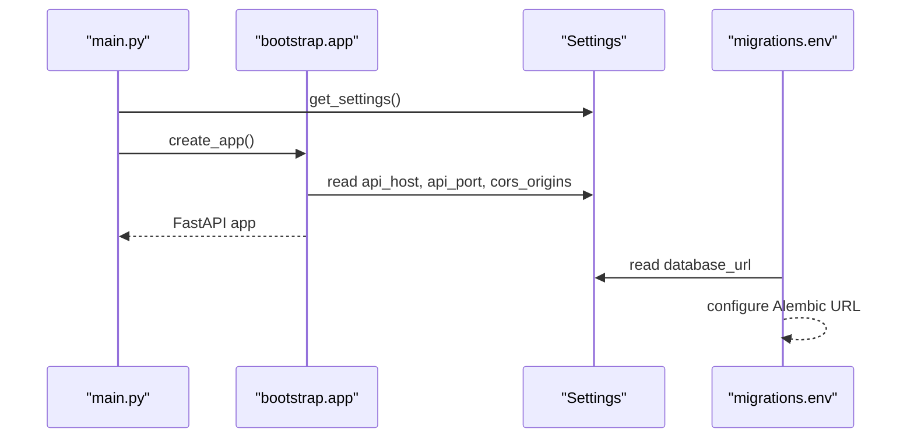
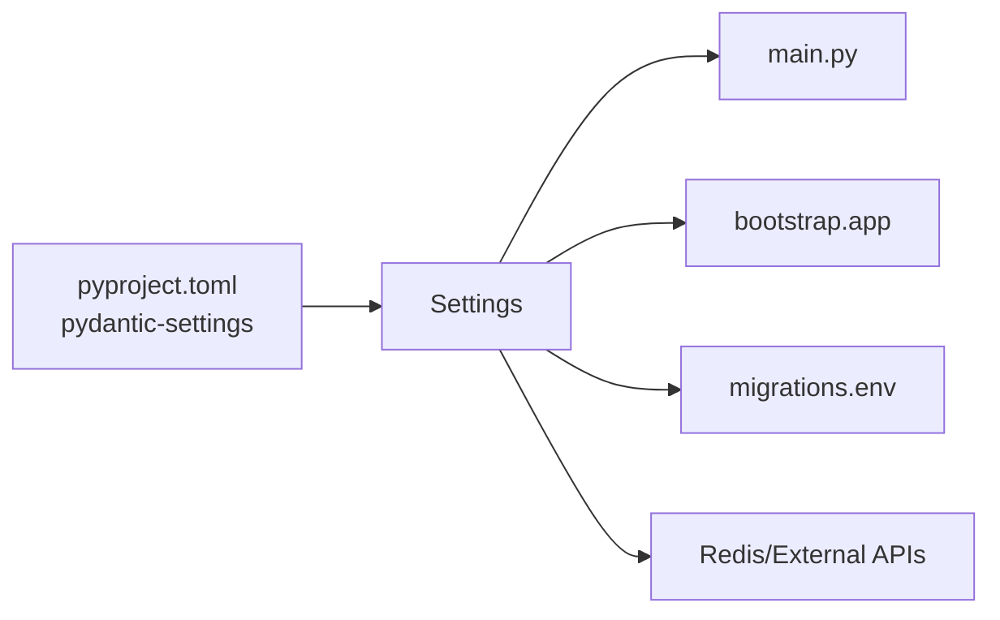

# Settings and Configuration

<cite>
**Referenced Files in This Document**
- [base.py](file://src/core/settings/base.py)
- [__init__.py](file://src/core/settings/__init__.py)
- [main.py](file://src/main.py)
- [app.py](file://src/core/bootstrap/app.py)
- [env.py](file://src/migrations/env.py)
- [pyproject.toml](file://pyproject.toml)
- [iris.service](file://iris.service)
</cite>

## Table of Contents
1. [Introduction](#introduction)
2. [Project Structure](#project-structure)
3. [Core Components](#core-components)
4. [Architecture Overview](#architecture-overview)
5. [Detailed Component Analysis](#detailed-component-analysis)
6. [Dependency Analysis](#dependency-analysis)
7. [Performance Considerations](#performance-considerations)
8. [Troubleshooting Guide](#troubleshooting-guide)
9. [Conclusion](#conclusion)

## Introduction
This document explains the IRIS settings and configuration management system. It covers how configuration is loaded via environment variables, validated using Pydantic, and made available across the application. It also documents the configuration hierarchy, default values, type safety guarantees, and how runtime configuration is exposed. Security considerations for secrets and best practices for managing configuration are included.

## Project Structure
The configuration system centers around a single Pydantic settings class with environment variable support and a cached accessor. It integrates with:
- Application startup to configure the web server and middleware
- Alembic migrations to read database credentials
- System service configuration via an environment file

**Diagram sources**
- [base.py:87-90](file://src/core/settings/base.py#L87-L90)
- [main.py:8-17](file://src/main.py#L8-L17)
- [app.py:49-80](file://src/core/bootstrap/app.py#L49-L80)
- [env.py:9-18](file://src/migrations/env.py#L9-L18)
- [iris.service:8](file://iris.service#L8)

**Section sources**
- [base.py:8-90](file://src/core/settings/base.py#L8-L90)
- [main.py:8-17](file://src/main.py#L8-L17)
- [app.py:49-80](file://src/core/bootstrap/app.py#L49-L80)
- [env.py:9-18](file://src/migrations/env.py#L9-L18)
- [iris.service:8](file://iris.service#L8)

## Core Components
- Settings class: Defines typed configuration fields, aliases for environment variables, defaults, and normalization logic.
- get_settings(): Returns a cached instance of Settings, ensuring a single configuration object is used application-wide.
- Environment loading: Uses Pydantic Settings with a .env file, UTF-8 encoding, case-insensitive variables, and safe extra handling.
- Integration points: Uvicorn server host/port, CORS origins, database URL, Redis URL, and Alembic migration configuration.

Key characteristics:
- Type safety: Fields are strongly typed; invalid values raise validation errors during instantiation.
- Defaults: Many fields have sensible defaults for development.
- Aliases: Environment variables are mapped via aliases to avoid naming collisions and to match common conventions.
- Normalization: Some fields are normalized (for example, CORS origins) before validation.

**Section sources**
- [base.py:8-90](file://src/core/settings/base.py#L8-L90)
- [__init__.py:1-3](file://src/core/settings/__init__.py#L1-L3)

## Architecture Overview
The configuration architecture follows a layered approach:
- Settings class encapsulates configuration and validation
- Cached accessor ensures single-instance reuse
- Runtime components read from the cached settings
- Alembic reads settings for database connectivity during migrations

**Diagram sources**
- [base.py:87-90](file://src/core/settings/base.py#L87-L90)
- [main.py:8-17](file://src/main.py#L8-L17)
- [app.py:49-80](file://src/core/bootstrap/app.py#L49-L80)
- [env.py:9-18](file://src/migrations/env.py#L9-L18)
- [iris.service:8](file://iris.service#L8)

## Detailed Component Analysis

### Settings Model and Validation
The Settings class defines all configuration fields with:
- Types: Ensuring correct runtime types
- Defaults: Providing sane defaults for local development
- Aliases: Mapping to environment variables
- Validators: Normalizing inputs (for example, CORS origins)

Validation rules and behaviors:
- Case-insensitive environment variables
- Extra fields ignored (safe for future or unrelated keys)
- UTF-8 decoding of the .env file
- Normalization of CORS origins from comma-separated strings to lists

Important fields and their roles:
- Server binding: api_host, api_port
- Database: database_url
- Caching: redis_url
- Event stream: event_stream_name
- API keys: polygon_api_key, twelve_data_api_key, alpha_vantage_api_key
- CORS: cors_origins
- TaskIQ scheduling and worker counts
- Control plane token: control_plane_token
- Hypothesis engine toggle: enable_hypothesis_engine
- AI provider endpoints and models
- Portfolio risk controls
- Retry and delay settings for database and Redis connections

**Diagram sources**
- [base.py:8-90](file://src/core/settings/base.py#L8-L90)

**Section sources**
- [base.py:8-90](file://src/core/settings/base.py#L8-L90)

### Environment Variable Loading and Hierarchy
- File-based configuration: The Settings class loads from a .env file with UTF-8 encoding and case-insensitive variable names.
- Environment override: Variables from the process environment take precedence over .env values.
- Case sensitivity: Environment variables are matched case-insensitively.
- Extra fields: Unknown keys in .env are ignored, preventing accidental misconfiguration breakage.
- System service integration: The systemd unit file sources an external environment file, enabling deployment-specific overrides.

**Diagram sources**
- [base.py:72-77](file://src/core/settings/base.py#L72-L77)
- [iris.service:8](file://iris.service#L8)

**Section sources**
- [base.py:72-77](file://src/core/settings/base.py#L72-L77)
- [iris.service:8](file://iris.service#L8)

### Runtime Configuration Usage
- Application startup: The main entrypoint retrieves settings and starts Uvicorn with configured host and port.
- FastAPI app creation: The bootstrap module reads settings to configure CORS and conditionally include routers.
- Alembic migrations: The migration environment reads settings to configure SQLAlchemy URL.

**Diagram sources**
- [main.py:8-17](file://src/main.py#L8-L17)
- [app.py:49-80](file://src/core/bootstrap/app.py#L49-L80)
- [env.py:9-18](file://src/migrations/env.py#L9-L18)

**Section sources**
- [main.py:8-17](file://src/main.py#L8-L17)
- [app.py:49-80](file://src/core/bootstrap/app.py#L49-L80)
- [env.py:9-18](file://src/migrations/env.py#L9-L18)

### Configuration File Formats
- .env: Plain-text key=value pairs. The loader supports UTF-8 encoding and ignores unknown keys.
- systemd service: The .service file references an external environment file path for production deployments.

Practical guidance:
- Keep .env minimal and only include keys present in the Settings model.
- Use the systemd EnvironmentFile directive for production to separate secrets from source control.

**Section sources**
- [base.py:72-77](file://src/core/settings/base.py#L72-L77)
- [iris.service:8](file://iris.service#L8)

### Validation Rules and Error Handling
- Type validation: Fields must match declared types; otherwise, instantiation fails with a validation error.
- String-to-list normalization: CORS origins accept either a comma-separated string or a list; invalid inputs cause validation failure.
- Unknown keys: Ignored safely, reducing risk of misconfiguration crashes.
- Environment precedence: Conflicts between .env and environment variables are resolved by the loader’s merge behavior.

Recommended practices:
- Validate early: Run a startup health check that instantiates Settings to surface configuration errors immediately.
- Use CI linting: Combine with static analysis and type checks to catch mismatches.

**Section sources**
- [base.py:79-84](file://src/core/settings/base.py#L79-L84)
- [base.py:72-77](file://src/core/settings/base.py#L72-L77)

### Debugging Techniques for Configuration Issues
Common symptoms and remedies:
- Unexpected default values: Confirm the .env file path and variable names; remember case-insensitivity.
- CORS policy failures: Verify that the normalized cors_origins list includes the frontend origin.
- Database connection errors: Ensure database_url is set and reachable; check retries and delays if applicable.
- Alembic upgrade failures: Confirm the database_url is correctly passed to Alembic.

Diagnostic steps:
- Print effective settings at startup to confirm resolution order.
- Temporarily log raw environment variables to verify presence and spelling.
- Test Settings instantiation in isolation to surface validation errors quickly.

**Section sources**
- [base.py:72-77](file://src/core/settings/base.py#L72-L77)
- [env.py:9-18](file://src/migrations/env.py#L9-L18)

### Security Considerations for Sensitive Settings
- Secrets exposure: Store sensitive values (for example, API keys and tokens) in environment variables or secure secret stores, not in .env.
- Least privilege: Limit permissions on environment files and restrict access to deployment systems.
- Rotation and auditing: Regularly rotate API keys and track changes to configuration.
- Avoid logging secrets: Ensure logs do not print configuration values.

Relevant fields to protect:
- polygon_api_key, twelve_data_api_key, alpha_vantage_api_key
- control_plane_token
- database_url, redis_url

**Section sources**
- [base.py:13-24](file://src/core/settings/base.py#L13-L24)
- [base.py:51](file://src/core/settings/base.py#L51)

### Best Practices for Configuration Management
- Centralized definition: Keep all configuration in the Settings class for discoverability.
- Typed access: Always read configuration via get_settings() to ensure a single canonical instance.
- Environment separation: Use .env for development, EnvironmentFile for production, and secrets managers for sensitive values.
- Defaults for development: Provide safe defaults to reduce friction for new developers.
- Validation early: Fail fast by validating configuration at application startup.
- Documentation: Keep .env examples and comments up to date with the Settings model.

**Section sources**
- [base.py:87-90](file://src/core/settings/base.py#L87-L90)
- [pyproject.toml:13](file://pyproject.toml#L13)

## Dependency Analysis
The configuration system depends on:
- Pydantic Settings for validation and environment loading
- Uvicorn for server configuration
- Alembic for database migrations
- Optional: Redis and external APIs for feature toggles and integrations

**Diagram sources**
- [pyproject.toml:13](file://pyproject.toml#L13)
- [base.py:8-90](file://src/core/settings/base.py#L8-L90)
- [main.py:8-17](file://src/main.py#L8-L17)
- [app.py:49-80](file://src/core/bootstrap/app.py#L49-L80)
- [env.py:9-18](file://src/migrations/env.py#L9-L18)

**Section sources**
- [pyproject.toml:13](file://pyproject.toml#L13)
- [base.py:8-90](file://src/core/settings/base.py#L8-L90)
- [main.py:8-17](file://src/main.py#L8-L17)
- [app.py:49-80](file://src/core/bootstrap/app.py#L49-L80)
- [env.py:9-18](file://src/migrations/env.py#L9-L18)

## Performance Considerations
- Single instance caching: get_settings() uses LRU caching to avoid repeated parsing and validation overhead.
- Minimal parsing cost: Environment loading occurs once at first access; subsequent reads are O(1).
- Avoid redundant reloads: Do not re-instantiate Settings unless necessary.

**Section sources**
- [base.py:87-90](file://src/core/settings/base.py#L87-L90)

## Troubleshooting Guide
- Configuration not applied:
  - Verify .env path and variable names; remember case-insensitivity.
  - Confirm systemd EnvironmentFile path if using production deployment.
- CORS blocked requests:
  - Ensure the frontend origin is present in the normalized cors_origins list.
- Database connection failures:
  - Validate database_url and network reachability.
  - Adjust retry counts and delays if needed.
- Alembic upgrade errors:
  - Confirm database_url is correctly propagated to Alembic.

**Section sources**
- [base.py:72-77](file://src/core/settings/base.py#L72-L77)
- [env.py:9-18](file://src/migrations/env.py#L9-L18)

## Conclusion
IRIS uses a robust, Pydantic-powered configuration system that enforces type safety, supports environment-driven customization, and integrates cleanly with the application lifecycle. By centralizing configuration in a single Settings class, leveraging cached access, and applying strict validation, the system balances developer ergonomics with operational reliability. Following the recommended practices and security guidelines will help maintain a secure and maintainable configuration posture across environments.