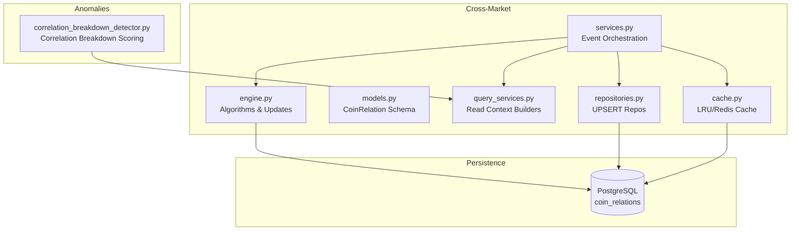
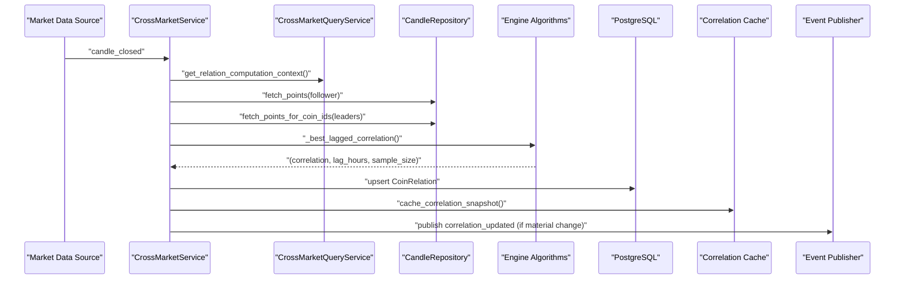
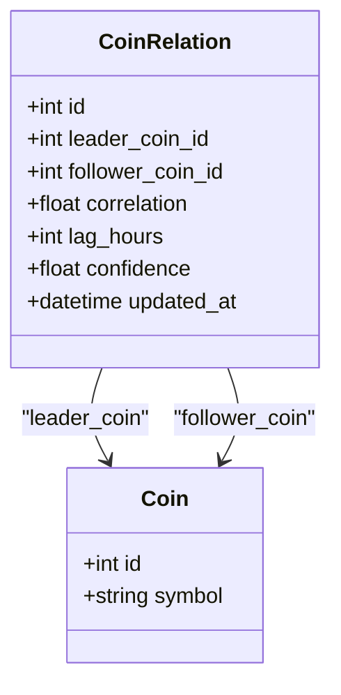
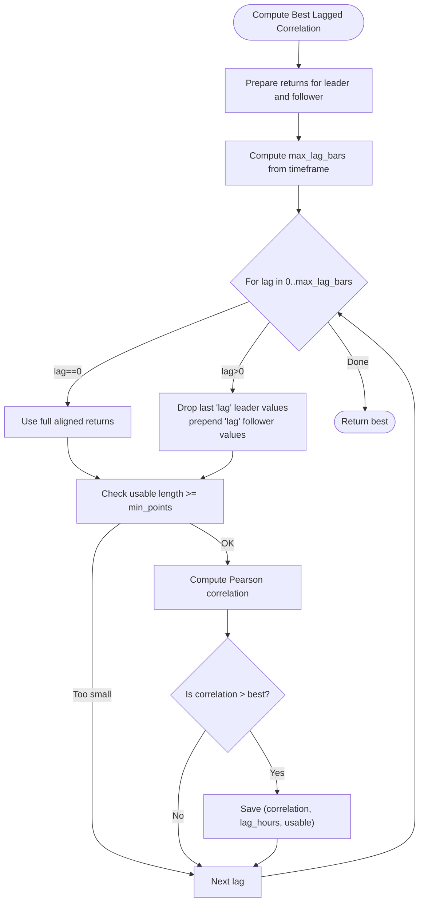
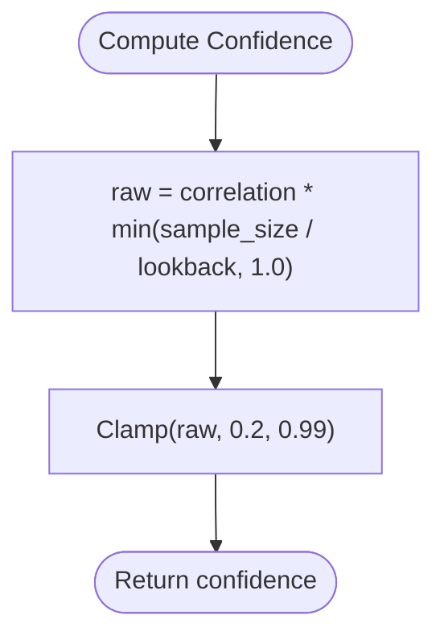
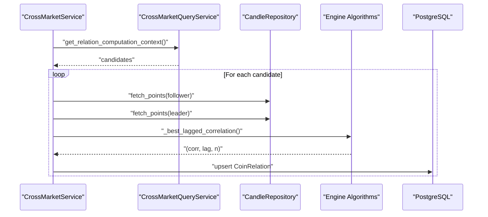
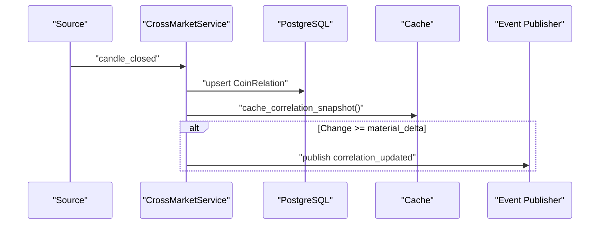
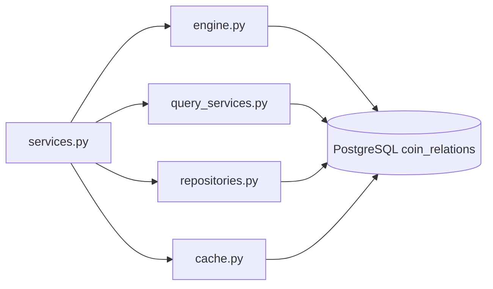

# Correlation Analysis

<cite>
**Referenced Files in This Document**
- [engine.py](file://src/apps/cross_market/engine.py)
- [services.py](file://src/apps/cross_market/services.py)
- [models.py](file://src/apps/cross_market/models.py)
- [cache.py](file://src/apps/cross_market/cache.py)
- [query_services.py](file://src/apps/cross_market/query_services.py)
- [repositories.py](file://src/apps/cross_market/repositories.py)
- [read_models.py](file://src/apps/cross_market/read_models.py)
- [correlation_breakdown_detector.py](file://src/apps/anomalies/detectors/correlation_breakdown_detector.py)
- [test_correlation_detection.py](file://tests/apps/cross_market/test_correlation_detection.py)
- [20260311_000020_cross_market_prediction.py](file://src/migrations/versions/20260311_000020_cross_market_prediction.py)
</cite>

## Table of Contents
1. [Introduction](#introduction)
2. [Project Structure](#project-structure)
3. [Core Components](#core-components)
4. [Architecture Overview](#architecture-overview)
5. [Detailed Component Analysis](#detailed-component-analysis)
6. [Dependency Analysis](#dependency-analysis)
7. [Performance Considerations](#performance-considerations)
8. [Troubleshooting Guide](#troubleshooting-guide)
9. [Conclusion](#conclusion)
10. [Appendices](#appendices)

## Introduction
This document explains the correlation analysis subsystem that computes cross-market relationships, detects lagged associations, and maintains dynamic correlation snapshots. It covers the CoinRelation model, lag detection and confidence scoring, pairwise correlation analysis, dynamic updates, thresholding, and anomaly detection for correlation breakdowns. Practical applications include identifying arbitrage-like spreads, diversification benefits, systemic risk via correlation networks, clustering and decay analysis, and cross-asset hedging strategies. Stability testing, regime-dependent analysis, and correlation shock detection are also addressed.

## Project Structure
The correlation analysis spans several modules:
- Engine: core algorithms for lag detection, Pearson correlation, candidate selection, and event-driven updates
- Services: orchestrates correlation updates per event, caches, and emits correlation_updated events
- Models: persistent schema for CoinRelation and related entities
- Cache: LRU and Redis-backed caching for correlation snapshots
- Query Services: read-side context builders and aggregates
- Repositories: UPSERT helpers for CoinRelation and SectorMetric
- Tests: deterministic lag detection and snapshot validation

**Diagram sources**
- [engine.py:131-234](file://src/apps/cross_market/engine.py#L131-L234)
- [services.py:217-338](file://src/apps/cross_market/services.py#L217-L338)
- [models.py:57-81](file://src/apps/cross_market/models.py#L57-L81)
- [query_services.py:24-108](file://src/apps/cross_market/query_services.py#L24-L108)
- [repositories.py:17-33](file://src/apps/cross_market/repositories.py#L17-L33)
- [cache.py:98-143](file://src/apps/cross_market/cache.py#L98-L143)
- [correlation_breakdown_detector.py:70-181](file://src/apps/anomalies/detectors/correlation_breakdown_detector.py#L70-L181)

**Section sources**
- [engine.py:22-27](file://src/apps/cross_market/engine.py#L22-L27)
- [services.py:70-216](file://src/apps/cross_market/services.py#L70-L216)
- [models.py:57-81](file://src/apps/cross_market/models.py#L57-L81)
- [cache.py:14-171](file://src/apps/cross_market/cache.py#L14-L171)
- [query_services.py:20-244](file://src/apps/cross_market/query_services.py#L20-L244)
- [repositories.py:13-60](file://src/apps/cross_market/repositories.py#L13-L60)
- [correlation_breakdown_detector.py:70-181](file://src/apps/anomalies/detectors/correlation_breakdown_detector.py#L70-L181)

## Core Components
- CoinRelation model: stores leader/follower pair correlation, lag in hours, confidence, and timestamps. It defines unique indexing on leader/follower pairs and relationships to Coins.
- Lag-aware correlation: computes Pearson correlation across aligned returns with a sliding lag window up to a configured maximum.
- Confidence scoring: scales correlation by effective sample coverage relative to lookback.
- Dynamic updates: on candle_closed events, recomputes relations for a follower against selected leaders; emits correlation_updated when changes exceed a material delta.
- Cache: LRU and Redis-backed snapshot storage for fast reads during alignment weighting and downstream decisions.

Key thresholds and parameters:
- Lookback: 200 bars
- Minimum points: 48
- Maximum lag: 8 hours
- Minimum correlation: 0.25
- Material delta: 0.04
- Preferred leaders: BTCUSD, ETHUSD, SOLUSD

**Section sources**
- [models.py:57-81](file://src/apps/cross_market/models.py#L57-L81)
- [engine.py:22-27](file://src/apps/cross_market/engine.py#L22-L27)
- [engine.py:56-80](file://src/apps/cross_market/engine.py#L56-L80)
- [engine.py:131-234](file://src/apps/cross_market/engine.py#L131-L234)
- [services.py:217-338](file://src/apps/cross_market/services.py#L217-L338)
- [cache.py:14-171](file://src/apps/cross_market/cache.py#L14-L171)

## Architecture Overview
The correlation pipeline runs in response to market events:
- On candle close, the service fetches follower and candidate leader returns, computes lagged correlations, applies thresholds, and upserts CoinRelation records.
- Updated relations are cached and optionally emitted as correlation_updated events.
- Downstream systems can use cached snapshots and confidence-weighted alignment to adjust position sizing or directional bias.

**Diagram sources**
- [services.py:92-216](file://src/apps/cross_market/services.py#L92-L216)
- [engine.py:131-234](file://src/apps/cross_market/engine.py#L131-L234)
- [cache.py:98-143](file://src/apps/cross_market/cache.py#L98-L143)

## Detailed Component Analysis

### CoinRelation Model and Schema
The CoinRelation entity persists pairwise leader-follower correlation metadata with constraints and relationships:
- Unique index on (leader_coin_id, follower_coin_id)
- Foreign keys to Coins for leader and follower
- Fields: correlation, lag_hours, confidence, updated_at
- Relationships enable back-populated navigation to Coin instances

**Diagram sources**
- [models.py:57-81](file://src/apps/cross_market/models.py#L57-L81)

**Section sources**
- [models.py:57-81](file://src/apps/cross_market/models.py#L57-L81)
- [20260311_000020_cross_market_prediction.py:27-46](file://src/migrations/versions/20260311_000020_cross_market_prediction.py#L27-L46)

### Lag Detection and Best Lag Search
The lag detection algorithm:
- Converts candle closes to simple returns for both leader and follower
- Computes the Pearson correlation across aligned returns for lags from 0 to max_lag_bars
- Tracks the best correlation, lag in hours, and effective sample size
- Returns lag in hours rounded from bar lag using timeframe

**Diagram sources**
- [engine.py:56-80](file://src/apps/cross_market/engine.py#L56-L80)
- [engine.py:34-53](file://src/apps/cross_market/engine.py#L34-L53)

**Section sources**
- [engine.py:56-80](file://src/apps/cross_market/engine.py#L56-L80)
- [engine.py:34-53](file://src/apps/cross_market/engine.py#L34-L53)

### Confidence Scoring Mechanism
Confidence is computed as:
- Clamp(correlation × min(sample_size / lookback, 1.0), 0.2, 0.99)
- Ensures minimum baseline confidence and caps at high correlation with strong evidence

**Diagram sources**
- [services.py:283](file://src/apps/cross_market/services.py#L283)
- [engine.py:153](file://src/apps/cross_market/engine.py#L153)

**Section sources**
- [services.py:283](file://src/apps/cross_market/services.py#L283)
- [engine.py:153](file://src/apps/cross_market/engine.py#L153)

### Pairwise Correlation Analysis and Thresholding
Pairwise analysis:
- Candidate leaders are selected from preferred symbols and ranked by market metrics
- For each leader, returns are aligned with follower returns
- Minimum points threshold ensures statistical validity
- Minimum correlation threshold filters weak relationships
- Best lag and confidence are recorded

**Diagram sources**
- [services.py:217-338](file://src/apps/cross_market/services.py#L217-L338)
- [engine.py:131-234](file://src/apps/cross_market/engine.py#L131-L234)

**Section sources**
- [services.py:217-338](file://src/apps/cross_market/services.py#L217-L338)
- [engine.py:87-128](file://src/apps/cross_market/engine.py#L87-L128)

### Dynamic Correlation Updating and Events
Dynamic updates:
- Triggered on candle_closed for the follower
- Existing snapshots are loaded to compare changes
- Material delta determines whether to emit correlation_updated
- Cache is updated after successful upsert

**Diagram sources**
- [services.py:217-338](file://src/apps/cross_market/services.py#L217-L338)
- [engine.py:196-234](file://src/apps/cross_market/engine.py#L196-L234)
- [cache.py:98-143](file://src/apps/cross_market/cache.py#L98-L143)

**Section sources**
- [services.py:217-338](file://src/apps/cross_market/services.py#L217-L338)
- [engine.py:196-234](file://src/apps/cross_market/engine.py#L196-L234)

### Correlation-Based Arbitrage Opportunities
Approach:
- Identify strong lagged followers relative to major leaders (e.g., BTC/ETH/SOL)
- Monitor spread deviations from historical correlation bands
- Use confidence-weighted alignment to size positions and manage exposure
- Emit correlation_updated events to trigger downstream actions

Practical example:
- A follower exhibits a significant positive lag with a leader; monitor spread reversion expectations
- Combine with volatility regimes to avoid false signals during high-dispersion periods

[No sources needed since this section synthesizes concepts without quoting specific code]

### Diversification Benefits Calculation
Approach:
- Build a correlation matrix across assets using CoinRelation snapshots
- Use inverse-variance or minimum variance weights constrained by correlation structure
- Incorporate cached confidence to downweight noisy relationships

[No sources needed since this section provides general methodology]

### Systemic Risk Assessment Through Correlation Networks
Approach:
- Construct adjacency from CoinRelation where correlation exceeds a threshold
- Compute network metrics: clustering coefficient, average path length, centrality
- Track changes in network density and community structure over time to detect systemic stress

[No sources needed since this section provides general methodology]

### Practical Examples

#### Correlation Clustering
- Group assets by sector or community using correlation similarity
- Apply hierarchical clustering on correlation distances to form coherent groups
- Monitor shifts in cluster membership as regime changes

[No sources needed since this section provides general methodology]

#### Correlation Decay Analysis
- Track lagged correlation over expanding windows to estimate decay rates
- Fit exponential decay models to infer half-lives of relationships
- Use decay parameters to calibrate rolling lookbacks and hedge ratios

[No sources needed since this section provides general methodology]

#### Cross-Asset Hedging Strategies
- Use lagged correlation to compute hedge ratios between pairs
- Employ confidence-weighted adjustments to reduce turnover during low-confidence periods
- Rebalance on correlation_updated events exceeding a threshold

[No sources needed since this section provides general methodology]

### Correlation Stability Testing
- Compare rolling correlations over disjoint windows (e.g., long vs. short)
- Compute standard errors and significance tests for correlation differences
- Flag pairs with unstable correlations for reduced position sizing

[No sources needed since this section provides general methodology]

### Regime-Dependent Correlation Analysis
- Segment data by market regimes (e.g., bull/bear/high_volatility)
- Estimate separate correlation matrices per regime
- Adjust directional bias and hedge ratios according to regime probabilities

[No sources needed since this section provides general methodology]

### Correlation Shock Detection
- Detect sudden drops in correlation or spikes in beta
- Use standardized residuals and dispersion relative to peers
- Trigger confirmation windows and anomaly findings similar to correlation breakdown detector

**Section sources**
- [correlation_breakdown_detector.py:70-181](file://src/apps/anomalies/detectors/correlation_breakdown_detector.py#L70-L181)

## Dependency Analysis
The correlation subsystem integrates tightly with market data, persistence, and streaming:

**Diagram sources**
- [services.py:70-216](file://src/apps/cross_market/services.py#L70-L216)
- [query_services.py:20-244](file://src/apps/cross_market/query_services.py#L20-L244)
- [repositories.py:13-60](file://src/apps/cross_market/repositories.py#L13-L60)
- [cache.py:14-171](file://src/apps/cross_market/cache.py#L14-L171)
- [engine.py:131-234](file://src/apps/cross_market/engine.py#L131-L234)

**Section sources**
- [services.py:70-216](file://src/apps/cross_market/services.py#L70-L216)
- [query_services.py:20-244](file://src/apps/cross_market/query_services.py#L20-L244)
- [repositories.py:13-60](file://src/apps/cross_market/repositories.py#L13-L60)
- [cache.py:14-171](file://src/apps/cross_market/cache.py#L14-L171)
- [engine.py:131-234](file://src/apps/cross_market/engine.py#L131-L234)

## Performance Considerations
- Efficient lookback and lag scanning: cap max lag by timeframe and clamp to prevent excessive scans
- Early filtering: skip candidates with insufficient points and below-minimum correlation
- Batched upserts: use ON CONFLICT DO UPDATE to minimize round-trips
- Caching: leverage Redis for hot reads and LRU for lightweight sync paths
- Streaming: emit correlation_updated only on material changes to reduce noise

[No sources needed since this section provides general guidance]

## Troubleshooting Guide
Common issues and resolutions:
- Insufficient data: ensure follower and leader series meet minimum points threshold
- No relations found: verify candidate selection and preferred leader symbols
- Stale cache: confirm cache_correlation_snapshot is invoked post-upsert
- Excessive emissions: tune material delta to suppress minor fluctuations
- Anomaly detection sensitivity: adjust correlation breakdown thresholds and confirmation targets

**Section sources**
- [services.py:248-256](file://src/apps/cross_market/services.py#L248-L256)
- [engine.py:143-144](file://src/apps/cross_market/engine.py#L143-L144)
- [engine.py:207-211](file://src/apps/cross_market/engine.py#L207-L211)
- [correlation_breakdown_detector.py:95-96](file://src/apps/anomalies/detectors/correlation_breakdown_detector.py#L95-L96)

## Conclusion
The correlation analysis subsystem provides robust lag-aware pairwise relationships with confidence scoring and dynamic updates. It supports downstream use cases such as arbitrage monitoring, diversification, systemic risk assessment, and anomaly detection. The design balances accuracy with performance through efficient algorithms, batching, and caching.

[No sources needed since this section summarizes without analyzing specific files]

## Appendices

### Example: Lag Detection Validation
A test demonstrates that a follower with a known lag against a leader achieves a high correlation and accurate lag hours, with cached snapshot parity.

**Section sources**
- [test_correlation_detection.py:18-109](file://tests/apps/cross_market/test_correlation_detection.py#L18-L109)