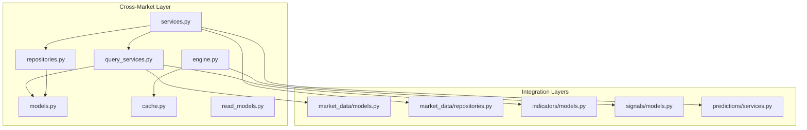
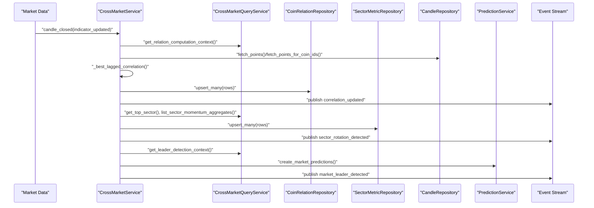
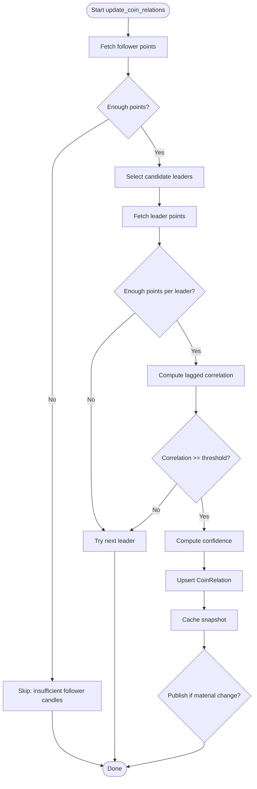
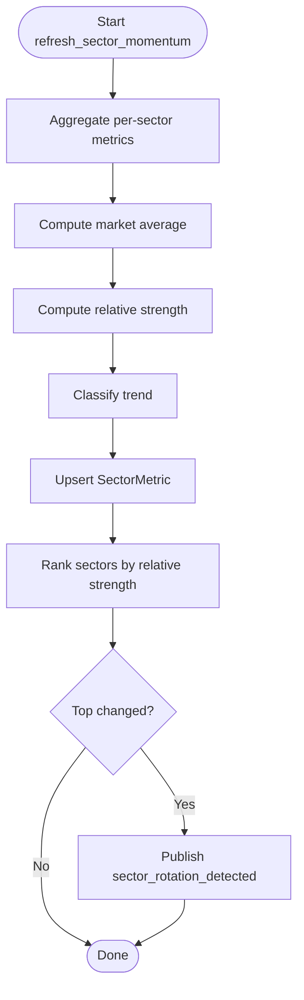
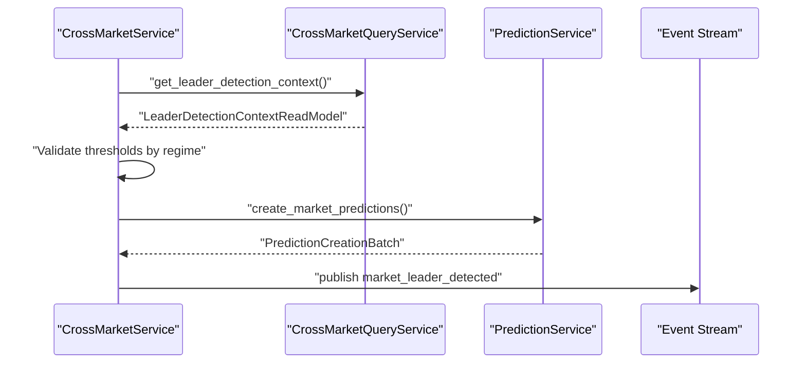
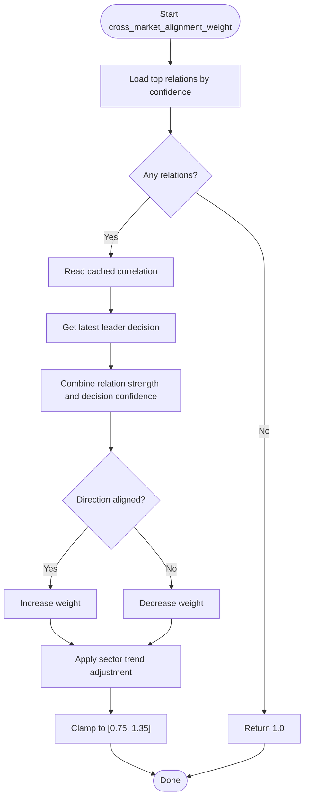
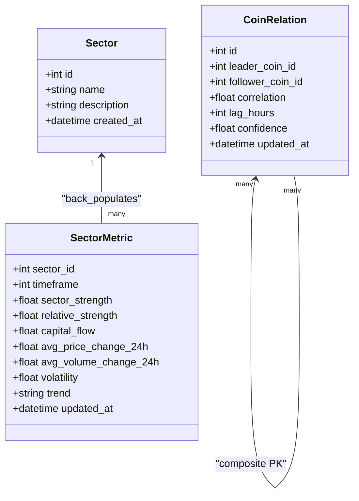
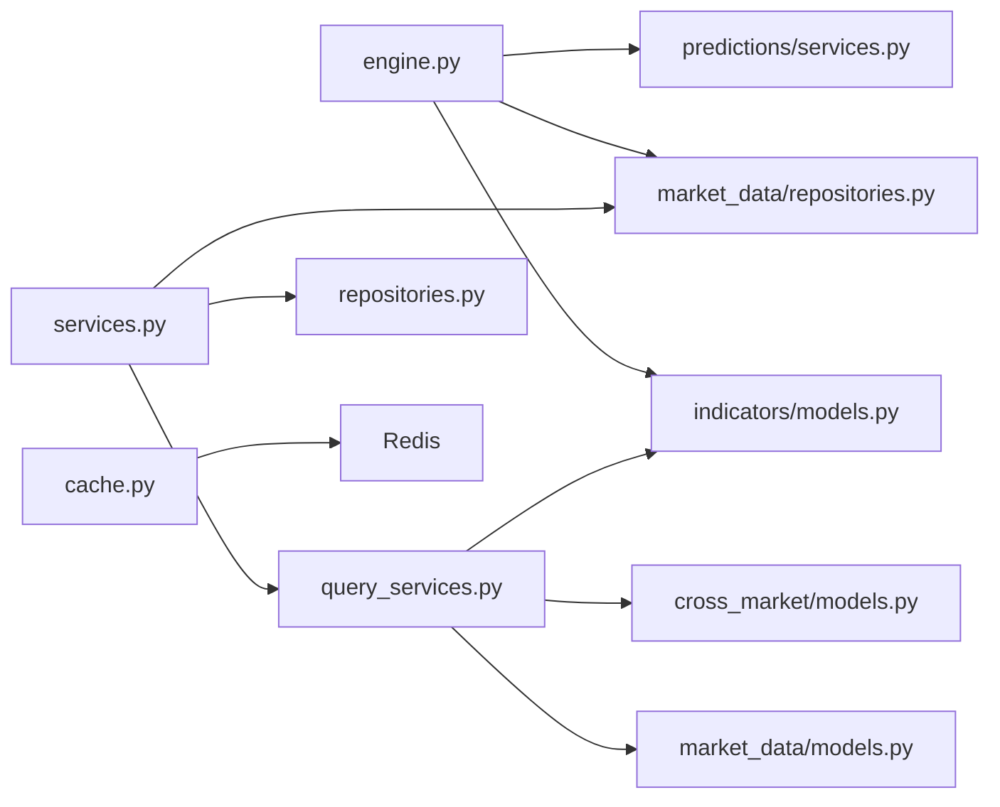

# Cross-Market Analysis

<cite>
**Referenced Files in This Document**
- [engine.py](file://src/apps/cross_market/engine.py)
- [services.py](file://src/apps/cross_market/services.py)
- [models.py](file://src/apps/cross_market/models.py)
- [cache.py](file://src/apps/cross_market/cache.py)
- [query_services.py](file://src/apps/cross_market/query_services.py)
- [repositories.py](file://src/apps/cross_market/repositories.py)
- [read_models.py](file://src/apps/cross_market/read_models.py)
- [models.py](file://src/apps/market_data/models.py)
- [repositories.py](file://src/apps/market_data/repositories.py)
- [models.py](file://src/apps/indicators/models.py)
- [models.py](file://src/apps/signals/models.py)
- [services.py](file://src/apps/predictions/services.py)
- [test_engine.py](file://tests/apps/cross_market/test_engine.py)
- [test_correlation_detection.py](file://tests/apps/cross_market/test_correlation_detection.py)
- [test_sector_momentum.py](file://tests/apps/cross_market/test_sector_momentum.py)
- [test_cache_services.py](file://tests/apps/cross_market/test_cache_services.py)
</cite>

## Table of Contents
1. [Introduction](#introduction)
2. [Project Structure](#project-structure)
3. [Core Components](#core-components)
4. [Architecture Overview](#architecture-overview)
5. [Detailed Component Analysis](#detailed-component-analysis)
6. [Dependency Analysis](#dependency-analysis)
7. [Performance Considerations](#performance-considerations)
8. [Troubleshooting Guide](#troubleshooting-guide)
9. [Conclusion](#conclusion)
10. [Appendices](#appendices)

## Introduction
This document describes the cross-market analysis system responsible for multi-asset correlation analysis, sector rotation detection, market structure monitoring across multiple timeframes, and cross-timeframe coordination. It explains how correlation matrices are computed, how sector momentum is analyzed, and how market regimes are detected across asset classes. It also documents caching strategies for correlation data, performance optimizations for large correlation computations, real-time correlation monitoring, market structure snapshot generation, cross-asset pattern recognition, and systematic trading across multiple markets.

## Project Structure
The cross-market subsystem is organized around three primary layers:
- Domain logic and orchestration: engine and services
- Data access: repositories and query services
- Persistence models: SQLAlchemy ORM models
- Integration points: market data, indicators, signals, and predictions

**Diagram sources**
- [engine.py:1-495](file://src/apps/cross_market/engine.py#L1-L495)
- [services.py:1-493](file://src/apps/cross_market/services.py#L1-L493)
- [query_services.py:1-248](file://src/apps/cross_market/query_services.py#L1-L248)
- [repositories.py:1-64](file://src/apps/cross_market/repositories.py#L1-L64)
- [models.py:1-84](file://src/apps/cross_market/models.py#L1-L84)
- [cache.py:1-172](file://src/apps/cross_market/cache.py#L1-L172)
- [read_models.py:1-68](file://src/apps/cross_market/read_models.py#L1-L68)
- [models.py](file://src/apps/market_data/models.py)
- [repositories.py](file://src/apps/market_data/repositories.py)
- [models.py](file://src/apps/indicators/models.py)
- [models.py](file://src/apps/signals/models.py)
- [services.py](file://src/apps/predictions/services.py)

**Section sources**
- [engine.py:1-495](file://src/apps/cross_market/engine.py#L1-L495)
- [services.py:1-493](file://src/apps/cross_market/services.py#L1-L493)
- [query_services.py:1-248](file://src/apps/cross_market/query_services.py#L1-L248)
- [repositories.py:1-64](file://src/apps/cross_market/repositories.py#L1-L64)
- [models.py:1-84](file://src/apps/cross_market/models.py#L1-L84)
- [cache.py:1-172](file://src/apps/cross_market/cache.py#L1-L172)
- [read_models.py:1-68](file://src/apps/cross_market/read_models.py#L1-L68)

## Core Components
- Correlation engine: computes lagged Pearson correlations across leaders and followers, materiality thresholds, and confidence adjustments.
- Sector momentum service: aggregates per-sector metrics, computes relative strength, and detects rotation.
- Market leader detection: identifies leaders based on regime-aware thresholds and emits predictions.
- Cross-market alignment weighting: adjusts position weights using recent correlation and sector trends.
- Caching: Redis-backed LRU cache for correlation snapshots with TTL.
- Async service orchestration: batched writes, side effects, and event publishing.

Key responsibilities:
- Multi-asset correlation analysis with lag detection and confidence scoring
- Sector rotation detection via relative strength ranking
- Market regime-aware leader detection and downstream prediction creation
- Real-time correlation monitoring via event stream publishing
- Cross-timeframe coordination via unified timeframe normalization

**Section sources**
- [engine.py:131-234](file://src/apps/cross_market/engine.py#L131-L234)
- [engine.py:237-334](file://src/apps/cross_market/engine.py#L237-L334)
- [engine.py:360-414](file://src/apps/cross_market/engine.py#L360-L414)
- [engine.py:446-494](file://src/apps/cross_market/engine.py#L446-L494)
- [services.py:70-216](file://src/apps/cross_market/services.py#L70-L216)
- [services.py:217-404](file://src/apps/cross_market/services.py#L217-L404)
- [cache.py:98-172](file://src/apps/cross_market/cache.py#L98-L172)

## Architecture Overview
The system orchestrates three concurrent workflows:
- Correlation updates: leader-follower correlation computation and caching
- Sector momentum refresh: per-sector aggregation and rotation detection
- Market leader detection: regime-aware leader identification and prediction creation

**Diagram sources**
- [services.py:92-216](file://src/apps/cross_market/services.py#L92-L216)
- [query_services.py:24-108](file://src/apps/cross_market/query_services.py#L24-L108)
- [repositories.py:17-60](file://src/apps/cross_market/repositories.py#L17-L60)
- [repositories.py:115-200](file://src/apps/market_data/repositories.py#L115-L200)
- [services.py:162-170](file://src/apps/predictions/services.py#L162-L170)

## Detailed Component Analysis

### Correlation Matrix Computation and Monitoring
- Leader selection: prioritizes preferred symbols and same-sector coins, then ranks by market cap/activity.
- Returns calculation: converts OHLC series to simple returns.
- Lag-aware correlation: slides lag window up to a maximum in hours, selects best correlation with minimum sample size.
- Confidence scoring: scales correlation by sample coverage and clamps to acceptable bounds.
- Materiality filtering: only publishes meaningful changes based on deltas.
- Caching: serializes correlation snapshots to Redis with TTL; reads cached values for alignment weighting.

**Diagram sources**
- [engine.py:131-234](file://src/apps/cross_market/engine.py#L131-L234)
- [engine.py:56-80](file://src/apps/cross_market/engine.py#L56-L80)
- [engine.py:87-128](file://src/apps/cross_market/engine.py#L87-L128)
- [cache.py:98-120](file://src/apps/cross_market/cache.py#L98-L120)

**Section sources**
- [engine.py:34-54](file://src/apps/cross_market/engine.py#L34-L54)
- [engine.py:56-80](file://src/apps/cross_market/engine.py#L56-L80)
- [engine.py:87-128](file://src/apps/cross_market/engine.py#L87-L128)
- [engine.py:131-234](file://src/apps/cross_market/engine.py#L131-L234)
- [cache.py:98-172](file://src/apps/cross_market/cache.py#L98-L172)

### Sector Rotation Detection and Momentum Analysis
- Aggregation: averages per-sector metrics (price/volume changes, volatility) across enabled coins.
- Relative strength: subtracts market average from sector strength.
- Trend classification: bullish/bearish/sideways thresholds.
- Top sector detection: ranks sectors by relative strength and emits rotation events when top changes.

**Diagram sources**
- [engine.py:237-334](file://src/apps/cross_market/engine.py#L237-L334)

**Section sources**
- [engine.py:237-334](file://src/apps/cross_market/engine.py#L237-L334)
- [models.py:36-54](file://src/apps/cross_market/models.py#L36-L54)

### Market Regime-Aware Leader Detection and Predictions
- Context: activity bucket, price/volume changes, and market regime.
- Thresholds: require hot activity, minimum magnitude moves, and regime-consistent direction.
- Confidence: composed from magnitude and activity bucket.
- Prediction creation: builds downstream predictions for followers of the detected leader.

**Diagram sources**
- [services.py:406-478](file://src/apps/cross_market/services.py#L406-L478)
- [query_services.py:213-244](file://src/apps/cross_market/query_services.py#L213-L244)
- [services.py:162-170](file://src/apps/predictions/services.py#L162-L170)

**Section sources**
- [services.py:406-478](file://src/apps/cross_market/services.py#L406-L478)
- [query_services.py:213-244](file://src/apps/cross_market/query_services.py#L213-L244)
- [services.py:162-170](file://src/apps/predictions/services.py#L162-L170)

### Cross-Timeframe Coordination and Alignment Weighting
- Timeframe normalization: aligns correlation computations to a base timeframe.
- Alignment weighting: combines leader decision confidence, correlation strength, and sector trend to adjust directional bias.
- Sector trend alignment: adds weight when sector matches directional bias.

**Diagram sources**
- [engine.py:446-494](file://src/apps/cross_market/engine.py#L446-L494)

**Section sources**
- [engine.py:446-494](file://src/apps/cross_market/engine.py#L446-L494)

### Data Models and Relationships

**Diagram sources**
- [models.py:15-84](file://src/apps/cross_market/models.py#L15-L84)

**Section sources**
- [models.py:15-84](file://src/apps/cross_market/models.py#L15-L84)

## Dependency Analysis
- Engine depends on market data repositories for candle points, on indicators models for metrics, and on predictions engine for leader predictions.
- Services depend on repositories and query services for data access, and on predictions service for side effects.
- Cache depends on Redis clients configured via settings.
- Tests validate end-to-end event flows and caching round-trips.

**Diagram sources**
- [engine.py:17-20](file://src/apps/cross_market/engine.py#L17-L20)
- [services.py:6-15](file://src/apps/cross_market/services.py#L6-L15)
- [cache.py:32-40](file://src/apps/cross_market/cache.py#L32-L40)

**Section sources**
- [engine.py:17-20](file://src/apps/cross_market/engine.py#L17-L20)
- [services.py:6-15](file://src/apps/cross_market/services.py#L6-L15)
- [cache.py:32-40](file://src/apps/cross_market/cache.py#L32-L40)

## Performance Considerations
- Efficient leader selection: limits candidate pool and leverages database ordering by market metrics.
- Batched writes: uses ON CONFLICT DO UPDATE to minimize round trips.
- Asynchronous processing: services compute in parallel and commit once if side effects occur.
- Caching: avoids repeated heavy computations by storing correlation snapshots with TTL.
- Timeframe normalization: ensures consistent correlation windows across heterogeneous intervals.

Recommendations:
- Monitor Redis latency and cache hit ratio for correlation snapshots.
- Tune RELATION_LOOKBACK and RELATION_MIN_POINTS for desired responsiveness vs. stability.
- Consider partitioning SectorMetric by timeframe for large-scale sector analysis.
- Use connection pooling and async I/O for high-frequency event processing.

[No sources needed since this section provides general guidance]

## Troubleshooting Guide
Common issues and resolutions:
- No relations found: verify sufficient candle history and candidate availability; check leader selection logic.
- Low correlation confidence: inspect lookback length, sample size, and lag window; confirm timeframe normalization.
- Sector rotation not detected: ensure sufficient coins per sector and regime thresholds; verify aggregation correctness.
- Cache misses: confirm Redis connectivity and key formatting; check TTL and serialization.
- Prediction creation skipped: validate leader detection thresholds and context presence.

Validation references:
- Correlation detection tests assert minimum correlation and lag hours.
- Sector momentum tests assert trend classification and relative strength ordering.
- Cache tests assert serialization, deserialization, and TTL behavior.
- End-to-end tests assert event publication and downstream prediction creation.

**Section sources**
- [test_correlation_detection.py:18-109](file://tests/apps/cross_market/test_correlation_detection.py#L18-L109)
- [test_sector_momentum.py:8-105](file://tests/apps/cross_market/test_sector_momentum.py#L8-L105)
- [test_cache_services.py:47-120](file://tests/apps/cross_market/test_cache_services.py#L47-L120)
- [test_engine.py:56-177](file://tests/apps/cross_market/test_engine.py#L56-L177)

## Conclusion
The cross-market analysis system integrates correlation computation, sector momentum, and leader detection with robust caching and event-driven orchestration. It supports multi-asset, multi-timeframe monitoring and enables systematic trading decisions through alignment weighting and prediction creation. The modular design and asynchronous processing facilitate scalability and real-time responsiveness.

[No sources needed since this section summarizes without analyzing specific files]

## Appendices

### API and Event Contracts
- correlation_updated: emitted when a leader-follower relation crosses materiality thresholds.
- sector_rotation_detected: emitted when the top sector by relative strength changes.
- market_leader_detected: emitted after successful leader detection with prediction batch summary.

**Section sources**
- [engine.py:212-225](file://src/apps/cross_market/engine.py#L212-L225)
- [engine.py:322-333](file://src/apps/cross_market/engine.py#L322-L333)
- [engine.py:394-407](file://src/apps/cross_market/engine.py#L394-L407)
- [services.py:144-157](file://src/apps/cross_market/services.py#L144-L157)
- [services.py:159-171](file://src/apps/cross_market/services.py#L159-L171)
- [services.py:173-188](file://src/apps/cross_market/services.py#L173-L188)