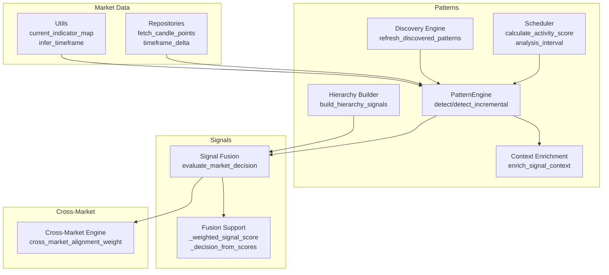
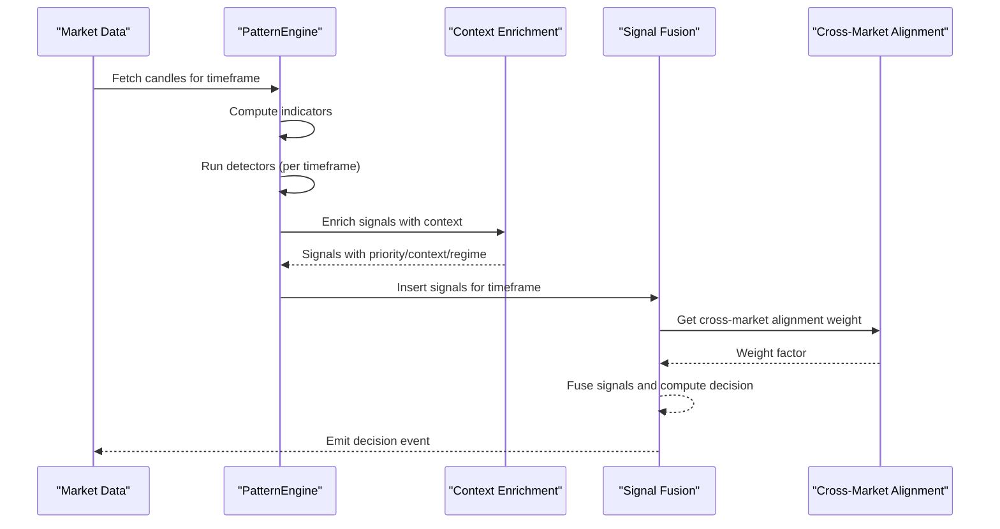
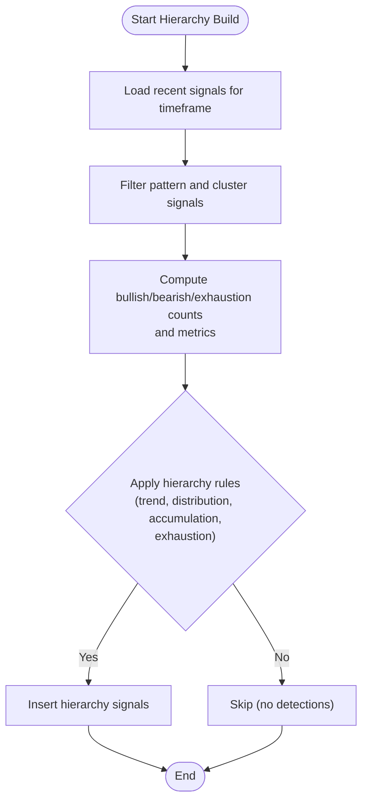
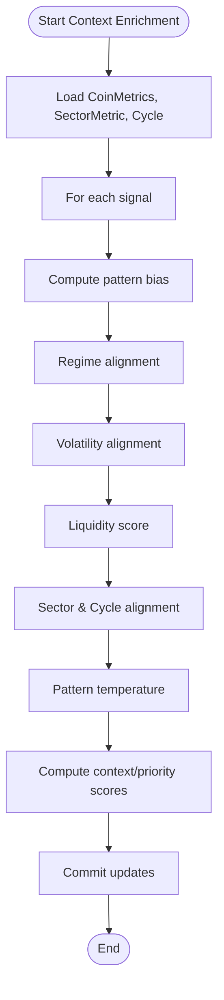
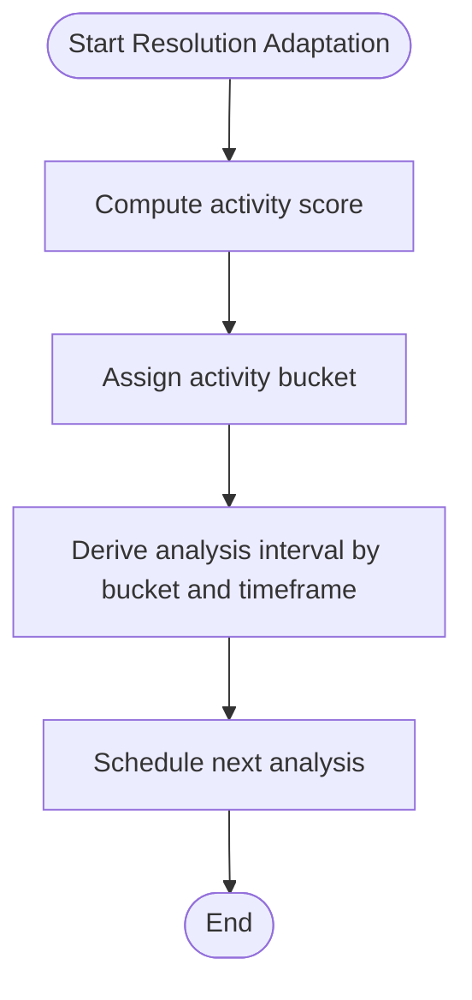
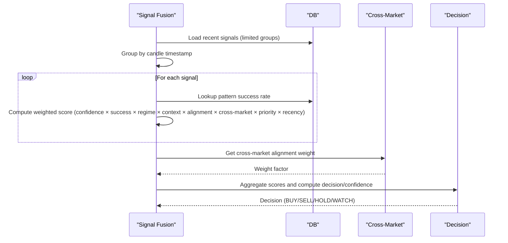
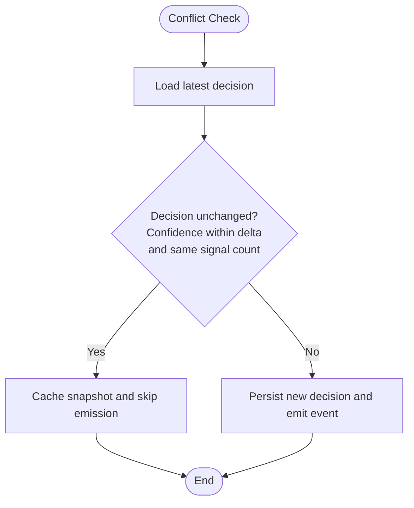
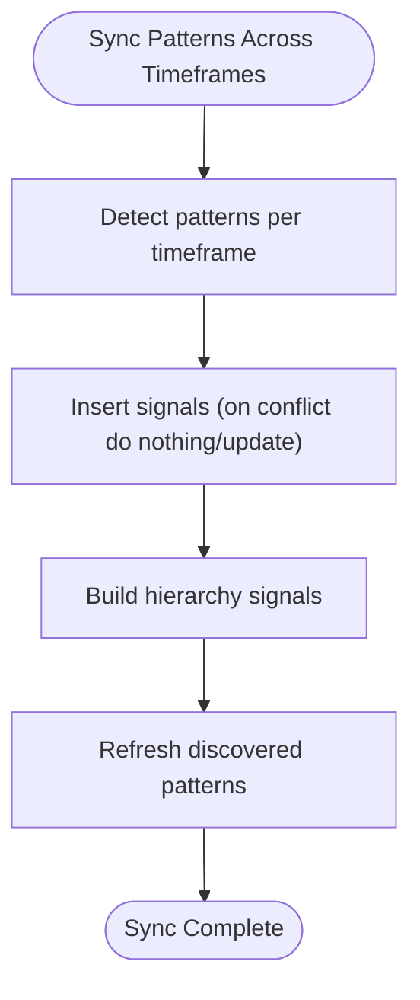
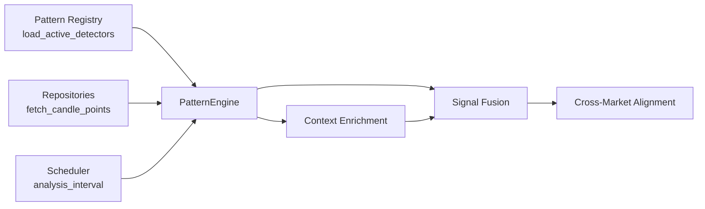

# Cross-Timeframe Coordination

<cite>
**Referenced Files in This Document**
- [engine.py](file://src/apps/patterns/domain/engine.py)
- [hierarchy.py](file://src/apps/patterns/domain/hierarchy.py)
- [scheduler.py](file://src/apps/patterns/domain/scheduler.py)
- [context.py](file://src/apps/patterns/domain/context.py)
- [discovery.py](file://src/apps/patterns/domain/discovery.py)
- [fusion.py](file://src/apps/signals/fusion.py)
- [fusion_support.py](file://src/apps/signals/fusion_support.py)
- [engine.py](file://src/apps/cross_market/engine.py)
- [repositories.py](file://src/apps/market_data/repositories.py)
- [utils.py](file://src/apps/patterns/domain/utils.py)
- [registry.py](file://src/apps/patterns/domain/registry.py)
- [base.py](file://src/apps/patterns/domain/base.py)
</cite>

## Table of Contents
1. [Introduction](#introduction)
2. [Project Structure](#project-structure)
3. [Core Components](#core-components)
4. [Architecture Overview](#architecture-overview)
5. [Detailed Component Analysis](#detailed-component-analysis)
6. [Dependency Analysis](#dependency-analysis)
7. [Performance Considerations](#performance-considerations)
8. [Troubleshooting Guide](#troubleshooting-guide)
9. [Conclusion](#conclusion)

## Introduction
This document explains cross-timeframe coordination mechanisms implemented in the system. It covers timeframe alignment strategies, multi-resolution pattern recognition, timeframe-consistent decision making, hierarchy establishment, resolution adaptation, conflict resolution, pattern synchronization, signal fusion across timeframes, and timeframe-based position sizing. Practical examples and optimization strategies are included to help operators configure and operate the system effectively.

## Project Structure
Cross-timeframe coordination spans several domains:
- Pattern detection and enrichment across multiple timeframes
- Signal fusion and decision generation per timeframe
- Cross-market alignment and sector dynamics
- Scheduler-driven adaptive resampling and analysis intervals
- Utilities for indicator computation and timeframe inference

**Diagram sources**
- [engine.py:21-212](file://src/apps/patterns/domain/engine.py#L21-L212)
- [hierarchy.py:57-139](file://src/apps/patterns/domain/hierarchy.py#L57-L139)
- [context.py:127-214](file://src/apps/patterns/domain/context.py#L127-L214)
- [scheduler.py:21-98](file://src/apps/patterns/domain/scheduler.py#L21-L98)
- [discovery.py:33-99](file://src/apps/patterns/domain/discovery.py#L33-L99)
- [fusion.py:290-400](file://src/apps/signals/fusion.py#L290-L400)
- [fusion_support.py:94-205](file://src/apps/signals/fusion_support.py#L94-L205)
- [engine.py:393-442](file://src/apps/cross_market/engine.py#L393-L442)
- [repositories.py:179-200](file://src/apps/market_data/repositories.py#L179-L200)
- [utils.py:117-157](file://src/apps/patterns/domain/utils.py#L117-L157)

**Section sources**
- [engine.py:21-212](file://src/apps/patterns/domain/engine.py#L21-L212)
- [fusion.py:290-400](file://src/apps/signals/fusion.py#L290-L400)
- [engine.py:393-442](file://src/apps/cross_market/engine.py#L393-L442)
- [scheduler.py:21-98](file://src/apps/patterns/domain/scheduler.py#L21-L98)
- [utils.py:117-157](file://src/apps/patterns/domain/utils.py#L117-L157)

## Core Components
- PatternEngine: Orchestrates detection, context enrichment, and insertion of pattern signals across supported timeframes.
- SignalFusionCompatibilityService: Builds timeframe-consistent decisions by fusing recent signals and optionally incorporating news impact.
- Cross-Market Alignment: Computes alignment weights between assets and sectors to improve decision robustness.
- Scheduler: Determines analysis frequency and priority based on activity buckets and timeframe.
- Context Enrichment: Applies regime, volatility, liquidity, sector, and cycle alignments to boost signal quality.
- Discovery Engine: Learns recurring structures across timeframes to inform pattern success metrics.

**Section sources**
- [engine.py:29-148](file://src/apps/patterns/domain/engine.py#L29-L148)
- [fusion.py:290-400](file://src/apps/signals/fusion.py#L290-L400)
- [engine.py:393-442](file://src/apps/cross_market/engine.py#L393-L442)
- [scheduler.py:21-98](file://src/apps/patterns/domain/scheduler.py#L21-L98)
- [context.py:127-214](file://src/apps/patterns/domain/context.py#L127-L214)
- [discovery.py:33-99](file://src/apps/patterns/domain/discovery.py#L33-L99)

## Architecture Overview
The system coordinates multiple timeframes by:
- Detecting patterns at each timeframe independently
- Enriching signals with context-aware scores
- Fusing signals within a timeframe to produce a single decision
- Incorporating cross-market and sector alignment
- Applying adaptive scheduling to reduce redundant work

**Diagram sources**
- [engine.py:114-148](file://src/apps/patterns/domain/engine.py#L114-L148)
- [context.py:127-187](file://src/apps/patterns/domain/context.py#L127-L187)
- [fusion.py:290-400](file://src/apps/signals/fusion.py#L290-L400)
- [engine.py:393-442](file://src/apps/cross_market/engine.py#L393-L442)

## Detailed Component Analysis

### Timeframe Hierarchy and Multi-Resolution Pattern Recognition
- Hierarchy builder aggregates pattern and cluster signals within a rolling window to derive higher-order signals aligned to the current timeframe.
- PatternEngine supports multiple timeframes and runs only detectors enabled for the given timeframe.
- Discovery Engine compresses price windows into signatures and correlates with future returns to learn recurring structures across timeframes.

**Diagram sources**
- [hierarchy.py:57-139](file://src/apps/patterns/domain/hierarchy.py#L57-L139)

**Section sources**
- [hierarchy.py:57-139](file://src/apps/patterns/domain/hierarchy.py#L57-L139)
- [engine.py:29-72](file://src/apps/patterns/domain/engine.py#L29-L72)
- [discovery.py:33-99](file://src/apps/patterns/domain/discovery.py#L33-L99)

### Timeframe Alignment Strategies and Context Enrichment
- Context enrichment computes priority and context scores by combining:
  - Regime alignment (bull/bear/sideways/high/low volatility)
  - Volatility alignment (BB width, ATR spikes)
  - Liquidity score (volume change, market cap)
  - Sector and cycle alignment
  - Pattern temperature (historical success)
- These factors are applied consistently across timeframes to maintain alignment.

**Diagram sources**
- [context.py:127-187](file://src/apps/patterns/domain/context.py#L127-L187)

**Section sources**
- [context.py:22-187](file://src/apps/patterns/domain/context.py#L22-L187)

### Adaptive Timeframe Selection and Resolution Adaptation
- PatternEngine maps human-readable intervals to numeric timeframes and detects incrementally within a lookback window.
- Scheduler calculates activity scores and assigns buckets (HOT/WARM/COLD/DEAD), then derives analysis intervals per bucket and timeframe.
- Repositories provide candle fetching and timeframe deltas for scheduling and bucketing.

**Diagram sources**
- [scheduler.py:21-98](file://src/apps/patterns/domain/scheduler.py#L21-L98)
- [engine.py:114-148](file://src/apps/patterns/domain/engine.py#L114-L148)
- [repositories.py:179-200](file://src/apps/market_data/repositories.py#L179-L200)

**Section sources**
- [engine.py:22-27](file://src/apps/patterns/domain/engine.py#L22-L27)
- [scheduler.py:21-98](file://src/apps/patterns/domain/scheduler.py#L21-L98)
- [repositories.py:179-200](file://src/apps/market_data/repositories.py#L179-L200)

### Multi-Timeframe Signal Fusion and Timeframe-Consistent Decisions
- Signal fusion selects recent signals within a timeframe, groups by candle timestamp, and computes weighted scores considering:
  - Confidence and success rate
  - Regime weight by signal archetype
  - Context and alignment factors
  - Cross-market alignment weight
  - Recency weighting
- Final decision is derived from aggregated bullish/bearish scores with thresholds and minimum total score requirements.

**Diagram sources**
- [fusion.py:290-400](file://src/apps/signals/fusion.py#L290-L400)
- [fusion_support.py:94-205](file://src/apps/signals/fusion_support.py#L94-L205)
- [engine.py:393-442](file://src/apps/cross_market/engine.py#L393-L442)

**Section sources**
- [fusion.py:290-400](file://src/apps/signals/fusion.py#L290-L400)
- [fusion_support.py:94-205](file://src/apps/signals/fusion_support.py#L94-L205)
- [engine.py:393-442](file://src/apps/cross_market/engine.py#L393-L442)

### Timeframe Conflict Resolution and Position Sizing
- Conflict resolution is implicit in fusion: when the latest decision matches the new one within a small confidence delta and signal count, the system caches without emitting a new event.
- Position sizing is not explicitly implemented in the analyzed code; however, fusion outputs a confidence score per timeframe that can serve as a basis for risk scaling.

**Diagram sources**
- [fusion.py:326-350](file://src/apps/signals/fusion.py#L326-L350)

**Section sources**
- [fusion.py:326-350](file://src/apps/signals/fusion.py#L326-L350)

### Pattern Synchronization Across Timeframes
- PatternEngine detects patterns incrementally for each timeframe and inserts them atomically with conflict handling.
- Hierarchy builder reuses existing signals to derive higher-level signals aligned to the current timeframe.
- Discovery Engine periodically recomputes discovered patterns to inform success metrics used during fusion.

**Diagram sources**
- [engine.py:74-148](file://src/apps/patterns/domain/engine.py#L74-L148)
- [hierarchy.py:57-139](file://src/apps/patterns/domain/hierarchy.py#L57-L139)
- [discovery.py:33-99](file://src/apps/patterns/domain/discovery.py#L33-L99)

**Section sources**
- [engine.py:74-148](file://src/apps/patterns/domain/engine.py#L74-L148)
- [hierarchy.py:57-139](file://src/apps/patterns/domain/hierarchy.py#L57-L139)
- [discovery.py:33-99](file://src/apps/patterns/domain/discovery.py#L33-L99)

### Practical Examples of Timeframe-Consistent Trading Setups
- Multi-resolution trend filtering: Use hierarchy signals (trend continuation/distribution) combined with regime-aligned context to filter false signals.
- Systematic timeframe coordination: Apply cross-market alignment weights to reduce contrarian positions within a timeframe.
- Adaptive timeframe selection: Use scheduler-derived intervals to reduce analysis frequency for COLD/WARM buckets while maintaining HOT cadence.

[No sources needed since this section provides conceptual examples]

### Timeframe-Based Position Sizing
- Confidence scores from fusion can be used to scale position sizes per timeframe after applying risk budgets and volatility targets. This is a recommended extension not present in the analyzed code.

[No sources needed since this section provides conceptual guidance]

## Dependency Analysis
Key dependencies and relationships:
- PatternEngine depends on repositories for candles and indicators, and on registry for active detectors.
- Signal fusion depends on context enrichment, cross-market alignment, and pattern success rates.
- Scheduler influences detection cadence via analysis intervals.

**Diagram sources**
- [registry.py:94-102](file://src/apps/patterns/domain/registry.py#L94-L102)
- [engine.py:126-148](file://src/apps/patterns/domain/engine.py#L126-L148)
- [context.py:127-187](file://src/apps/patterns/domain/context.py#L127-L187)
- [fusion.py:290-400](file://src/apps/signals/fusion.py#L290-L400)
- [engine.py:393-442](file://src/apps/cross_market/engine.py#L393-L442)
- [scheduler.py:58-81](file://src/apps/patterns/domain/scheduler.py#L58-L81)

**Section sources**
- [registry.py:94-102](file://src/apps/patterns/domain/registry.py#L94-L102)
- [engine.py:126-148](file://src/apps/patterns/domain/engine.py#L126-L148)
- [context.py:127-187](file://src/apps/patterns/domain/context.py#L127-L187)
- [fusion.py:290-400](file://src/apps/signals/fusion.py#L290-L400)
- [engine.py:393-442](file://src/apps/cross_market/engine.py#L393-L442)
- [scheduler.py:58-81](file://src/apps/patterns/domain/scheduler.py#L58-L81)

## Performance Considerations
- Limit signal windows and candle groups to reduce computational overhead during fusion.
- Use scheduler buckets to throttle analysis frequency for low-activity assets.
- Batch context enrichment and leverage caching for regime and correlation snapshots.
- Keep indicator computations efficient; reuse computed series where possible.

[No sources needed since this section provides general guidance]

## Troubleshooting Guide
Common issues and resolutions:
- Insufficient candles: Detection skips when fewer than a minimum threshold is available; ensure adequate historical bars.
- No active detectors/timeframe mismatch: Verify detector support and feature enablement for the selected timeframe.
- Decision unchanged: If the new decision matches the latest within the material delta, the system caches without emitting; check thresholds and confidence drift.
- Cross-market alignment missing: Ensure relations and sector metrics are populated; verify leader detection conditions.

**Section sources**
- [engine.py:126-128](file://src/apps/patterns/domain/engine.py#L126-L128)
- [registry.py:94-102](file://src/apps/patterns/domain/registry.py#L94-L102)
- [fusion.py:326-350](file://src/apps/signals/fusion.py#L326-L350)
- [engine.py:393-442](file://src/apps/cross_market/engine.py#L393-L442)

## Conclusion
The system coordinates multiple timeframes through a modular pipeline: detection per timeframe, context-aware enrichment, fusion to a single decision per timeframe, and optional cross-market alignment. Scheduler-driven adaptation reduces unnecessary work, while hierarchy and discovery engines enhance robustness. Operators can tune fusion thresholds, enable/disable features, and leverage confidence scores for position sizing to achieve timeframe-consistent trading strategies.