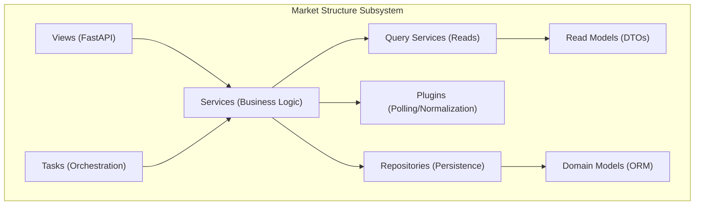
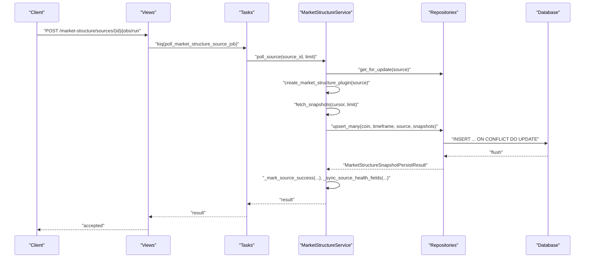
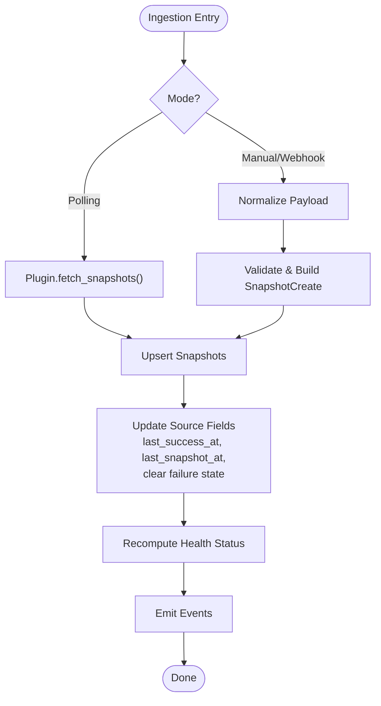
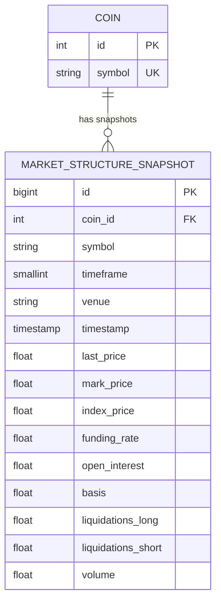
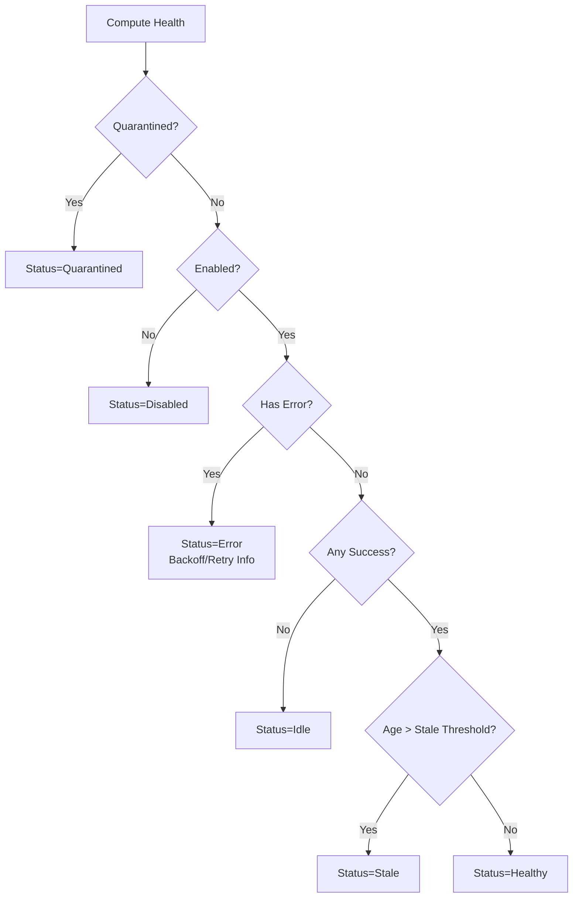
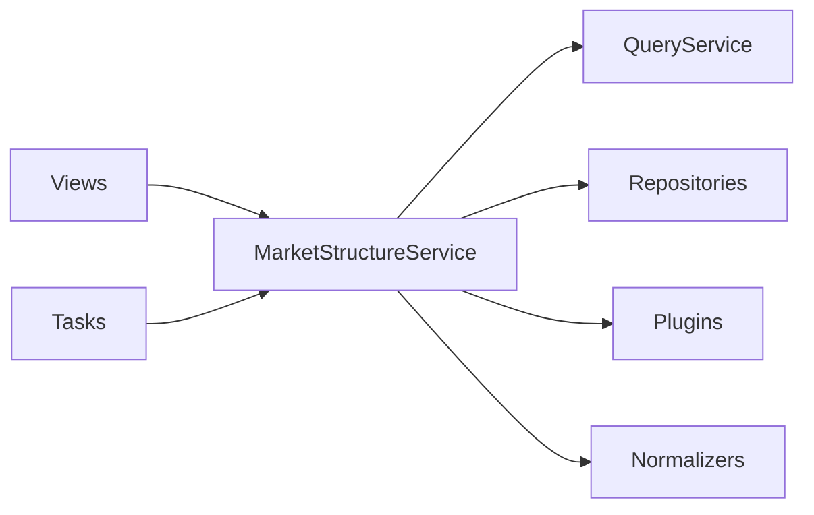

# Market Structure Monitoring

<cite>
**Referenced Files in This Document**
- [models.py](file://src/apps/market_structure/models.py)
- [services.py](file://src/apps/market_structure/services.py)
- [tasks.py](file://src/apps/market_structure/tasks.py)
- [query_services.py](file://src/apps/market_structure/query_services.py)
- [read_models.py](file://src/apps/market_structure/read_models.py)
- [repositories.py](file://src/apps/market_structure/repositories.py)
- [schemas.py](file://src/apps/market_structure/schemas.py)
- [plugins.py](file://src/apps/market_structure/plugins.py)
- [normalizers.py](file://src/apps/market_structure/normalizers.py)
- [constants.py](file://src/apps/market_structure/constants.py)
- [views.py](file://src/apps/market_structure/views.py)
- [models.py](file://src/apps/anomalies/models.py)
</cite>

## Table of Contents
1. [Introduction](#introduction)
2. [Project Structure](#project-structure)
3. [Core Components](#core-components)
4. [Architecture Overview](#architecture-overview)
5. [Detailed Component Analysis](#detailed-component-analysis)
6. [Dependency Analysis](#dependency-analysis)
7. [Performance Considerations](#performance-considerations)
8. [Troubleshooting Guide](#troubleshooting-guide)
9. [Conclusion](#conclusion)
10. [Appendices](#appendices)

## Introduction
This document explains how the system monitors market structure across multiple assets and timeframes. It covers structure snapshot generation, ingestion and persistence, cross-asset and multi-timeframe alignment, structure consistency checks, divergence detection, and transition analysis. It also documents caching strategies, performance optimizations for multi-asset monitoring, real-time updates via webhooks and polling, and practical examples for structure-based trading signals, cross-market confirmation, systematic structure-following strategies, structure persistence, historical analysis, and risk management.

## Project Structure
The market structure subsystem is organized around:
- Domain models for sources and snapshots
- Plugins for structured polling and normalization
- Services orchestrating ingestion, persistence, health, and alerts
- Tasks for background polling and health refresh
- Queries and read models for efficient reads
- Repositories for persistence
- Views exposing REST endpoints for provisioning, ingestion, and inspection

**Diagram sources**
- [views.py:31-397](file://src/apps/market_structure/views.py#L31-L397)
- [tasks.py:13-51](file://src/apps/market_structure/tasks.py#L13-L51)
- [services.py:352-800](file://src/apps/market_structure/services.py#L352-L800)
- [plugins.py:111-293](file://src/apps/market_structure/plugins.py#L111-L293)
- [repositories.py:36-247](file://src/apps/market_structure/repositories.py#L36-L247)
- [query_services.py:26-136](file://src/apps/market_structure/query_services.py#L26-L136)
- [read_models.py:79-386](file://src/apps/market_structure/read_models.py#L79-L386)
- [models.py:12-49](file://src/apps/market_structure/models.py#L12-L49)
- [models.py:67-124](file://src/apps/anomalies/models.py#L67-L124)

**Section sources**
- [models.py:12-49](file://src/apps/market_structure/models.py#L12-L49)
- [models.py:67-124](file://src/apps/anomalies/models.py#L67-L124)
- [services.py:352-800](file://src/apps/market_structure/services.py#L352-L800)
- [tasks.py:13-51](file://src/apps/market_structure/tasks.py#L13-L51)
- [query_services.py:26-136](file://src/apps/market_structure/query_services.py#L26-L136)
- [read_models.py:79-386](file://src/apps/market_structure/read_models.py#L79-L386)
- [repositories.py:36-247](file://src/apps/market_structure/repositories.py#L36-L247)
- [schemas.py:9-213](file://src/apps/market_structure/schemas.py#L9-L213)
- [plugins.py:111-293](file://src/apps/market_structure/plugins.py#L111-L293)
- [normalizers.py:26-314](file://src/apps/market_structure/normalizers.py#L26-L314)
- [constants.py:1-49](file://src/apps/market_structure/constants.py#L1-L49)
- [views.py:31-397](file://src/apps/market_structure/views.py#L31-L397)

## Core Components
- MarketStructureSource: ORM entity representing a configured data source (plugin, venue, timeframe, credentials, settings, cursor, health, quarantine, timestamps).
- MarketStructureSnapshot: ORM entity storing per-coin/timeframe/venue snapshots with structure metrics and raw payload.
- MarketStructureService: Orchestrates source lifecycle, polling, manual ingestion, webhook normalization, persistence, health computation, and alerting.
- MarketStructureSourcePlugin: Pluggable interface for fetching snapshots (Binance USD-M, Bybit derivatives, Manual push).
- MarketStructureWebhookPayloadNormalizer: Normalizes provider-specific webhook payloads into standardized snapshots.
- MarketStructureQueryService and read models: Efficient read-side DTOs for health, sources, snapshots, and webhook registration.
- Repositories: Upsert snapshots, manage sources, resolve coins.
- Tasks: Background jobs for polling individual sources, polling all enabled sources, and refreshing source health.
- Views: REST endpoints for provisioning, ingestion, health, snapshots, and triggering jobs.

**Section sources**
- [models.py:12-49](file://src/apps/market_structure/models.py#L12-L49)
- [models.py:67-124](file://src/apps/anomalies/models.py#L67-L124)
- [services.py:352-800](file://src/apps/market_structure/services.py#L352-L800)
- [plugins.py:66-293](file://src/apps/market_structure/plugins.py#L66-L293)
- [normalizers.py:26-314](file://src/apps/market_structure/normalizers.py#L26-L314)
- [query_services.py:26-136](file://src/apps/market_structure/query_services.py#L26-L136)
- [read_models.py:79-386](file://src/apps/market_structure/read_models.py#L79-L386)
- [repositories.py:36-247](file://src/apps/market_structure/repositories.py#L36-L247)
- [tasks.py:13-51](file://src/apps/market_structure/tasks.py#L13-L51)
- [views.py:31-397](file://src/apps/market_structure/views.py#L31-L397)

## Architecture Overview
The system ingests structure snapshots via two primary paths:
- Polling: Plugin-based fetchers pull from exchange APIs and persist snapshots.
- Webhooks: Provider-specific normalizers convert native payloads into standardized snapshots.

Snapshots are persisted with upsert semantics keyed by coin, timeframe, venue, and timestamp. Health and alerting are computed per source and emitted as events. Background tasks coordinate polling and health refresh with Redis-based task locks.

**Diagram sources**
- [views.py:316-337](file://src/apps/market_structure/views.py#L316-L337)
- [tasks.py:13-27](file://src/apps/market_structure/tasks.py#L13-L27)
- [services.py:526-612](file://src/apps/market_structure/services.py#L526-L612)
- [repositories.py:145-237](file://src/apps/market_structure/repositories.py#L145-L237)

## Detailed Component Analysis

### Structure Snapshot Generation and Ingestion
- Polling snapshots:
  - Plugins implement fetch_snapshots and return FetchedMarketStructureSnapshot records.
  - MarketStructureService persists snapshots via MarketStructureSnapshotRepository.upsert_many with conflict resolution.
  - Health and timestamps are updated upon success.
- Manual/webhook ingestion:
  - MarketStructureService accepts snapshots via ingest_manual_snapshots or ingest_native_webhook_payload.
  - Native payloads are normalized by provider-specific normalizers into standardized snapshots.
  - Persistence and health updates mirror polling.

**Diagram sources**
- [services.py:526-685](file://src/apps/market_structure/services.py#L526-L685)
- [repositories.py:145-237](file://src/apps/market_structure/repositories.py#L145-L237)
- [plugins.py:101-108](file://src/apps/market_structure/plugins.py#L101-L108)
- [normalizers.py:32-39](file://src/apps/market_structure/normalizers.py#L32-L39)

**Section sources**
- [services.py:526-685](file://src/apps/market_structure/services.py#L526-L685)
- [repositories.py:145-237](file://src/apps/market_structure/repositories.py#L145-L237)
- [plugins.py:101-108](file://src/apps/market_structure/plugins.py#L101-L108)
- [normalizers.py:32-39](file://src/apps/market_structure/normalizers.py#L32-L39)

### Cross-Asset Structure Comparison
- Snapshots are indexed by coin_id, timeframe, venue, and timestamp, enabling multi-asset comparisons at the same timeframe and venue.
- QueryService.list_snapshots supports filtering by coin_symbol and venue, allowing side-by-side comparisons across assets.
- Multi-timeframe alignment:
  - Each snapshot carries timeframe (minutes).
  - To align multiple timeframes, query snapshots grouped by timeframe and join on coin_id and venue.

**Diagram sources**
- [models.py:67-124](file://src/apps/anomalies/models.py#L67-L124)
- [query_services.py:77-99](file://src/apps/market_structure/query_services.py#L77-L99)

**Section sources**
- [query_services.py:77-99](file://src/apps/market_structure/query_services.py#L77-L99)
- [models.py:67-124](file://src/apps/anomalies/models.py#L67-L124)

### Multi-Timeframe Structure Alignment
- Each snapshot includes timeframe (minutes). Aligning across timeframes:
  - Retrieve snapshots for target assets and venues at desired timeframes.
  - Group by coin_id and venue, then match timestamps within tolerance to compare structure metrics across frames.
- Practical example:
  - Compare 15m and 1h snapshots for the same coin and venue to confirm trend consistency and filter noise.

[No sources needed since this section provides conceptual guidance]

### Structure Consistency Checking
- Health computation per source:
  - Staleness thresholds depend on ingest mode and timeframe.
  - Quarantine triggers after configurable failure count.
  - Backoff scheduling prevents thrashing.
- Event emission:
  - Health transitions and alerts are published when status changes.

**Diagram sources**
- [services.py:275-350](file://src/apps/market_structure/services.py#L275-L350)
- [read_models.py:198-268](file://src/apps/market_structure/read_models.py#L198-L268)

**Section sources**
- [services.py:275-350](file://src/apps/market_structure/services.py#L275-L350)
- [read_models.py:198-268](file://src/apps/market_structure/read_models.py#L198-L268)

### Divergence Detection Across Markets
- Strategy:
  - For a given coin and venue, compare snapshots across multiple venues (e.g., exchanges).
  - Compute differences in funding_rate, open_interest, basis, liquidations_long/short, and price series.
  - Flag divergences exceeding thresholds (e.g., funding_rate spread, oi imbalance).
- Implementation hooks:
  - Use list_snapshots with venue filters and apply statistical tests or thresholds in downstream analytics.

[No sources needed since this section provides conceptual guidance]

### Structure Transition Analysis
- Track transitions between health statuses (idle → healthy, healthy → stale, error → healthy) and alert kinds.
- Use last_alerted_at and last_alert_kind to monitor recent transitions and avoid redundant notifications.
- Historical snapshots enable trend analysis across time.

**Section sources**
- [services.py:748-783](file://src/apps/market_structure/services.py#L748-L783)
- [read_models.py:198-268](file://src/apps/market_structure/read_models.py#L198-L268)

### Caching Strategies for Structure Data
- Read-side DTOs:
  - Read models encapsulate health, source, and snapshot data for efficient retrieval.
- QueryService caches minimal ORM materialization for lists and single lookups.
- Recommendations:
  - Cache frequent queries (e.g., latest snapshot per coin/timeframe/venue) in application-level caches.
  - Use time-based TTL aligned with snapshot frequency and staleness thresholds.

**Section sources**
- [read_models.py:79-386](file://src/apps/market_structure/read_models.py#L79-L386)
- [query_services.py:26-136](file://src/apps/market_structure/query_services.py#L26-L136)

### Performance Optimization for Multi-Asset Monitoring
- Batch ingestion:
  - upsert_many performs bulk upserts with conflict resolution to minimize round-trips.
- Concurrency:
  - Background tasks use Redis task locks to prevent overlapping runs.
  - Polling tasks support per-source and global polling modes.
- Parallelism:
  - Plugins can issue concurrent requests (e.g., Binance premium index and open interest).
- Limits:
  - Poll limits and webhook batch sizes are bounded to protect resources.

**Section sources**
- [repositories.py:149-237](file://src/apps/market_structure/repositories.py#L149-L237)
- [tasks.py:13-51](file://src/apps/market_structure/tasks.py#L13-L51)
- [plugins.py:173-179](file://src/apps/market_structure/plugins.py#L173-L179)
- [constants.py:29-31](file://src/apps/market_structure/constants.py#L29-L31)

### Real-Time Structure Updates
- Webhooks:
  - Native webhook ingestion normalizes provider payloads and persists snapshots immediately.
  - Tokenized ingestion ensures authorized pushes.
- Polling:
  - Scheduled tasks poll enabled sources with backoff and quarantine safeguards.
- Health refresh:
  - Periodic job recomputes health for all sources and emits events.

**Section sources**
- [views.py:372-397](file://src/apps/market_structure/views.py#L372-L397)
- [services.py:687-706](file://src/apps/market_structure/services.py#L687-L706)
- [tasks.py:42-51](file://src/apps/market_structure/tasks.py#L42-L51)

### Practical Examples

#### Structure-Based Trading Signals
- Trend confirmation:
  - Long bias when funding_rate positive and open_interest increasing across venues.
- Reversal warning:
  - Negative basis and rising liquidations short suggest exhaustion.
- Volatility spikes:
  - Sudden volume surge with divergent funding_rate may precede breakouts.

[No sources needed since this section provides conceptual guidance]

#### Cross-Market Structure Confirmation
- Compare snapshots across venues for the same coin and timeframe.
- Confirm structural levels (support/resistance proxies) and funding dynamics across venues to reduce false signals.

[No sources needed since this section provides conceptual guidance]

#### Systematic Structure-Following Strategies
- Multi-timeframe filter:
  - Only enter trades when higher timeframe supports the direction.
- Venue diversification:
  - Enter only if structure metrics agree across multiple venues.
- Risk controls:
  - Exit on health degradation or quarantine events for any source.

[No sources needed since this section provides conceptual guidance]

#### Structure Persistence and Historical Analysis
- Snapshots are stored with unique composite keys and upsert semantics.
- Historical analysis:
  - Use list_snapshots with coin_symbol and venue filters.
  - Aggregate by timeframe to reconstruct multi-frame histories.

**Section sources**
- [repositories.py:149-237](file://src/apps/market_structure/repositories.py#L149-L237)
- [query_services.py:77-99](file://src/apps/market_structure/query_services.py#L77-L99)

#### Structure-Based Risk Management
- Monitor source health and quarantine events as early warnings.
- Apply dynamic position sizing based on structure stability (e.g., lower size during stale or error states).
- Enforce hard stops on divergent conditions (e.g., extreme funding spreads).

**Section sources**
- [services.py:748-783](file://src/apps/market_structure/services.py#L748-L783)
- [read_models.py:198-268](file://src/apps/market_structure/read_models.py#L198-L268)

## Dependency Analysis
- MarketStructureService depends on:
  - QueryService for reads
  - Repositories for persistence
  - Plugins for fetching
  - Normalizers for webhook payloads
  - Settings for backoff/quarantine thresholds
- Plugins and normalizers are registered centrally and discovered by plugin name/provider.
- Views delegate to services and tasks; tasks wrap services with UOW and task locks.

**Diagram sources**
- [views.py:31-397](file://src/apps/market_structure/views.py#L31-L397)
- [services.py:352-800](file://src/apps/market_structure/services.py#L352-L800)
- [tasks.py:13-51](file://src/apps/market_structure/tasks.py#L13-L51)
- [plugins.py:111-131](file://src/apps/market_structure/plugins.py#L111-L131)
- [normalizers.py:291-306](file://src/apps/market_structure/normalizers.py#L291-L306)

**Section sources**
- [services.py:352-800](file://src/apps/market_structure/services.py#L352-L800)
- [plugins.py:111-131](file://src/apps/market_structure/plugins.py#L111-L131)
- [normalizers.py:291-306](file://src/apps/market_structure/normalizers.py#L291-L306)
- [views.py:31-397](file://src/apps/market_structure/views.py#L31-L397)
- [tasks.py:13-51](file://src/apps/market_structure/tasks.py#L13-L51)

## Performance Considerations
- Prefer batch upserts for high-frequency ingestion.
- Use Redis task locks to serialize expensive operations.
- Tune poll intervals and stale thresholds to balance freshness and load.
- Limit webhook batch sizes to prevent overload.

[No sources needed since this section provides general guidance]

## Troubleshooting Guide
- Unauthorized webhook ingestion:
  - Ensure X-IRIS-Ingest-Token header matches source credentials.
- Unsupported plugin or provider:
  - Verify plugin_name and provider are registered.
- Stale or quarantined sources:
  - Review health status, last_error, backoff_until, and quarantine fields.
- Poll failures:
  - Inspect consecutive_failures and backoff_until; consider releasing quarantine if appropriate.

**Section sources**
- [services.py:647-649](file://src/apps/market_structure/services.py#L647-L649)
- [services.py:712-732](file://src/apps/market_structure/services.py#L712-L732)
- [read_models.py:198-268](file://src/apps/market_structure/read_models.py#L198-L268)

## Conclusion
The market structure monitoring subsystem provides a robust, extensible framework for collecting, persisting, and analyzing structure snapshots across assets and timeframes. It supports both automated polling and real-time webhooks, enforces health and alerting discipline, and offers clear pathways for cross-asset comparison, divergence detection, and transition analysis. With careful caching, batching, and task coordination, it scales to multi-asset, multi-timeframe monitoring while maintaining reliability and observability.

## Appendices

### API Surface Summary
- Provisioning and management:
  - GET /market-structure/plugins
  - GET /market-structure/sources
  - POST /market-structure/sources
  - PATCH /market-structure/sources/{source_id}
  - DELETE /market-structure/sources/{source_id}
  - GET /market-structure/sources/{source_id}/health
  - GET /market-structure/sources/{source_id}/webhook
  - POST /market-structure/sources/{source_id}/webhook/rotate-token
- Ingestion:
  - POST /market-structure/sources/{source_id}/snapshots
  - POST /market-structure/sources/{source_id}/webhook/native
- Inspection:
  - GET /market-structure/snapshots
- Jobs:
  - POST /market-structure/sources/{source_id}/jobs/run
  - POST /market-structure/health/jobs/run

**Section sources**
- [views.py:58-397](file://src/apps/market_structure/views.py#L58-L397)