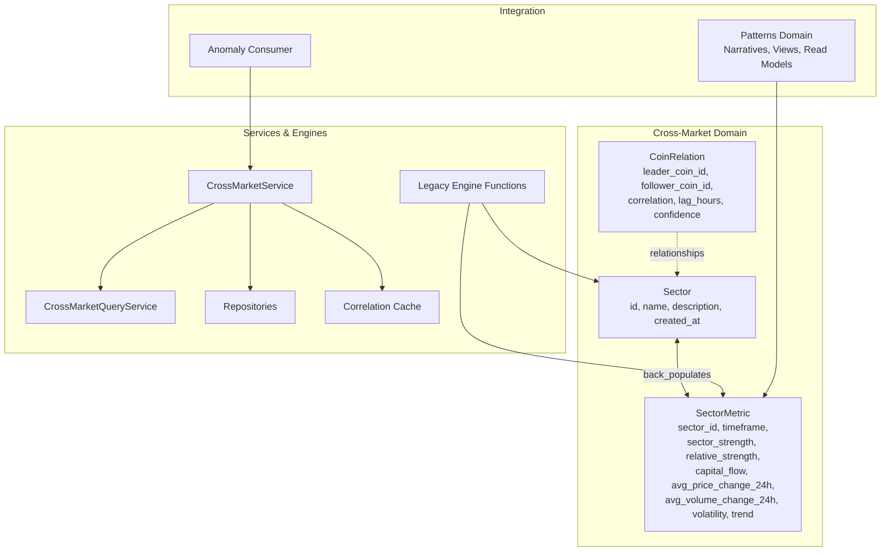
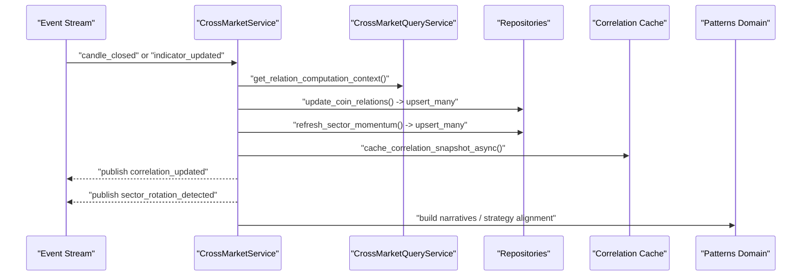
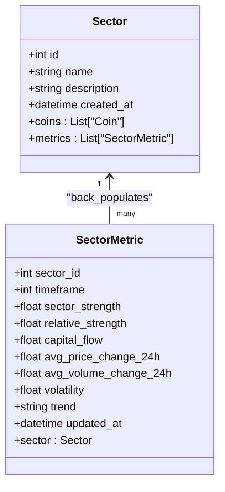
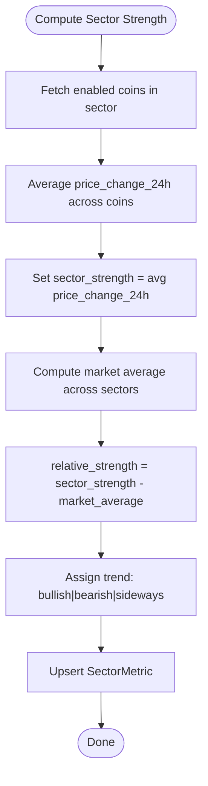
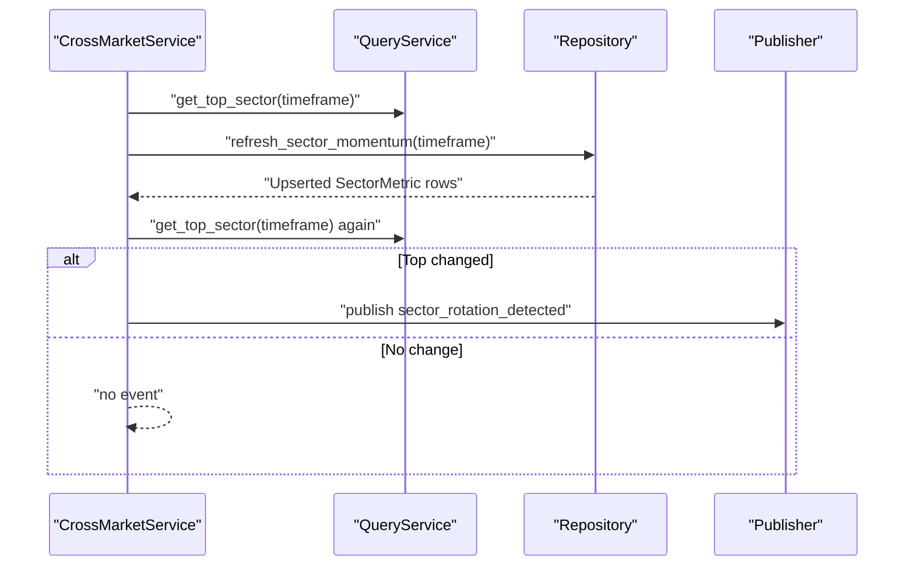
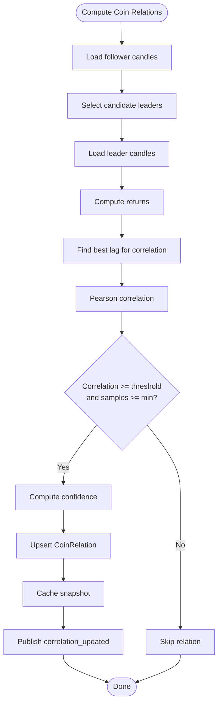
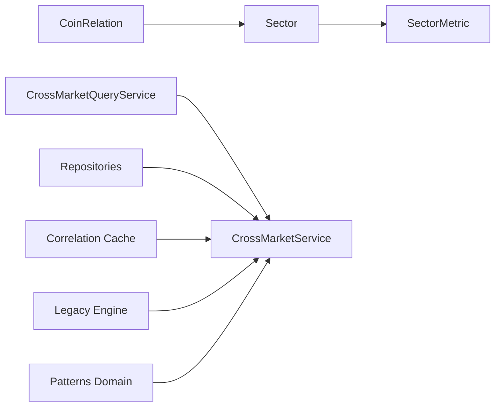

# Sector Analysis

<cite>
**Referenced Files in This Document**
- [models.py](file://src/apps/cross_market/models.py)
- [engine.py](file://src/apps/cross_market/engine.py)
- [services.py](file://src/apps/cross_market/services.py)
- [repositories.py](file://src/apps/cross_market/repositories.py)
- [cache.py](file://src/apps/cross_market/cache.py)
- [query_services.py](file://src/apps/cross_market/query_services.py)
- [sector_anomaly_consumer.py](file://src/apps/anomalies/consumers/sector_anomaly_consumer.py)
- [test_sector_momentum.py](file://tests/apps/cross_market/test_sector_momentum.py)
- [narrative.py](file://src/apps/patterns/domain/narrative.py)
- [views.py](file://src/apps/patterns/views.py)
- [read_models.py](file://src/apps/patterns/read_models.py)
- [decision.py](file://src/apps/patterns/domain/decision.py)
- [strategy.py](file://src/apps/patterns/domain/strategy.py)
</cite>

## Table of Contents
1. [Introduction](#introduction)
2. [Project Structure](#project-structure)
3. [Core Components](#core-components)
4. [Architecture Overview](#architecture-overview)
5. [Detailed Component Analysis](#detailed-component-analysis)
6. [Dependency Analysis](#dependency-analysis)
7. [Performance Considerations](#performance-considerations)
8. [Troubleshooting Guide](#troubleshooting-guide)
9. [Conclusion](#conclusion)
10. [Appendices](#appendices)

## Introduction
This document explains the sector analysis functionality implemented in the backend. It covers sector classification and categorization of assets, sector strength and relative strength calculations, capital flow tracking, volatility measurement, momentum analysis, sector rotation detection, and systematic allocation strategies grounded in sector metrics. It also documents the Sector and SectorMetric models, their relationships, and the data fields used across timeframes. Practical examples illustrate how to detect rotation, analyze outperformance, and apply systematic sector allocation strategies. Finally, it outlines correlation analysis, clustering, and dynamic reclassification approaches.

## Project Structure
Sector analysis spans several modules:
- Domain models define Sector and SectorMetric entities and their relationships.
- Engine and services compute sector metrics, detect leaders, and publish rotation events.
- Repositories encapsulate persistence for sector metrics and cross-asset relations.
- Cache stores recent correlation snapshots for fast alignment weighting.
- Query services provide read-side computations for leader detection and sector aggregates.
- Anomaly consumer triggers sector scans for high-severity anomalies.
- Patterns module integrates sector metrics into broader market narratives and strategy alignment.

**Diagram sources**
- [models.py:15-54](file://src/apps/cross_market/models.py#L15-L54)
- [services.py:70-492](file://src/apps/cross_market/services.py#L70-L492)
- [engine.py:237-334](file://src/apps/cross_market/engine.py#L237-L334)
- [repositories.py:13-60](file://src/apps/cross_market/repositories.py#L13-L60)
- [cache.py:98-171](file://src/apps/cross_market/cache.py#L98-L171)
- [query_services.py:20-244](file://src/apps/cross_market/query_services.py#L20-L244)
- [narrative.py:144-148](file://src/apps/patterns/domain/narrative.py#L144-L148)
- [sector_anomaly_consumer.py:17-53](file://src/apps/anomalies/consumers/sector_anomaly_consumer.py#L17-L53)

**Section sources**
- [models.py:15-54](file://src/apps/cross_market/models.py#L15-L54)
- [services.py:70-492](file://src/apps/cross_market/services.py#L70-L492)
- [engine.py:237-334](file://src/apps/cross_market/engine.py#L237-L334)
- [repositories.py:13-60](file://src/apps/cross_market/repositories.py#L13-L60)
- [cache.py:98-171](file://src/apps/cross_market/cache.py#L98-L171)
- [query_services.py:20-244](file://src/apps/cross_market/query_services.py#L20-L244)
- [narrative.py:144-148](file://src/apps/patterns/domain/narrative.py#L144-L148)
- [sector_anomaly_consumer.py:17-53](file://src/apps/anomalies/consumers/sector_anomaly_consumer.py#L17-L53)

## Core Components
- Sector: A named grouping of tradable assets (coins) with creation metadata and bidirectional relationships to coins and sector metrics.
- SectorMetric: Per-sector, per-timeframe metrics capturing strength, relative strength, capital flow, average price/volume changes, volatility, trend, and timestamps.
- CoinRelation: Tracks leader-follower relationships between coins with correlation, lag, and confidence, plus caching hooks.
- CrossMarketService: Orchestrates correlation updates, sector momentum refresh, and leader detection; publishes side effects.
- Legacy Engine: Provides core functions for correlation computation, sector momentum aggregation, rotation detection, and alignment weights.
- Query Services: Supplies read-side context for correlation computation, sector aggregates, top sector, and leader detection context.
- Repositories: Upsert sector metrics and coin relations with conflict resolution.
- Cache: LRU-backed Redis cache for correlation snapshots enabling fast alignment weighting.
- Patterns Integration: Uses sector metrics for narratives, strategy alignment, and decision reasoning.

**Section sources**
- [models.py:15-54](file://src/apps/cross_market/models.py#L15-L54)
- [services.py:70-492](file://src/apps/cross_market/services.py#L70-L492)
- [engine.py:237-334](file://src/apps/cross_market/engine.py#L237-L334)
- [query_services.py:20-244](file://src/apps/cross_market/query_services.py#L20-L244)
- [repositories.py:13-60](file://src/apps/cross_market/repositories.py#L13-L60)
- [cache.py:98-171](file://src/apps/cross_market/cache.py#L98-L171)
- [narrative.py:144-148](file://src/apps/patterns/domain/narrative.py#L144-L148)

## Architecture Overview
The system computes sector metrics and cross-asset relations asynchronously and persists them atomically. Events drive recomputation, and side effects (rotation detection, leader detection, correlation updates) are published for downstream systems.

**Diagram sources**
- [services.py:92-206](file://src/apps/cross_market/services.py#L92-L206)
- [query_services.py:24-108](file://src/apps/cross_market/query_services.py#L24-L108)
- [repositories.py:17-60](file://src/apps/cross_market/repositories.py#L17-L60)
- [cache.py:122-143](file://src/apps/cross_market/cache.py#L122-L143)
- [narrative.py:144-148](file://src/apps/patterns/domain/narrative.py#L144-L148)

## Detailed Component Analysis

### Sector and SectorMetric Models
- Sector: Primary key id, unique name, optional description, created_at; back-populates coins and sector_metrics.
- SectorMetric: Composite primary key (sector_id, timeframe); fields include sector_strength, relative_strength, capital_flow, avg_price_change_24h, avg_volume_change_24h, volatility, trend, updated_at; back-populates sector.

**Diagram sources**
- [models.py:15-54](file://src/apps/cross_market/models.py#L15-L54)

**Section sources**
- [models.py:15-54](file://src/apps/cross_market/models.py#L15-L54)

### Sector Classification and Categorization
- Assets are grouped into sectors via the Sector entity. Coins belong to a sector and contribute to sector metrics.
- Sector names are unique and used consistently across metrics and narratives.

**Section sources**
- [models.py:15-33](file://src/apps/cross_market/models.py#L15-L33)

### Sector Strength Calculation Methodology
- Sector strength is computed as the average of constituent coins’ 24-hour price change across enabled, non-deleted coins in the sector.
- Market average is derived from all sector strengths, enabling relative strength computation.

**Diagram sources**
- [engine.py:250-292](file://src/apps/cross_market/engine.py#L250-L292)
- [services.py:340-404](file://src/apps/cross_market/services.py#L340-L404)
- [query_services.py:176-211](file://src/apps/cross_market/query_services.py#L176-L211)

**Section sources**
- [engine.py:250-292](file://src/apps/cross_market/engine.py#L250-L292)
- [services.py:340-404](file://src/apps/cross_market/services.py#L340-L404)
- [query_services.py:176-211](file://src/apps/cross_market/query_services.py#L176-L211)

### Relative Strength Index Computation Across Timeframes
- Relative strength is stored per sector and per timeframe. It equals sector strength minus the market average.
- The system supports multiple timeframes; metrics are keyed by (sector_id, timeframe) and refreshed independently.

**Section sources**
- [engine.py:284-284](file://src/apps/cross_market/engine.py#L284-L284)
- [services.py:367-367](file://src/apps/cross_market/services.py#L367-L367)
- [models.py:39-42](file://src/apps/cross_market/models.py#L39-L42)

### Capital Flow Tracking Within Sectors
- Sector capital flow is computed as a weighted combination of normalized 24-hour price change and volume change across sector constituents.
- This metric is persisted alongside sector strength and relative strength.

**Section sources**
- [engine.py:258-258](file://src/apps/cross_market/engine.py#L258-L258)
- [services.py:374-374](file://src/apps/cross_market/services.py#L374-L374)
- [query_services.py:187-189](file://src/apps/cross_market/query_services.py#L187-L189)

### Volatility Measurement Within Sectors
- Sector volatility is the average of constituent coins’ volatility measures across enabled, non-deleted coins.
- Volatility is persisted per sector and timeframe.

**Section sources**
- [engine.py:255-255](file://src/apps/cross_market/engine.py#L255-L255)
- [services.py:377-377](file://src/apps/cross_market/services.py#L377-L377)
- [query_services.py:185-185](file://src/apps/cross_market/query_services.py#L185-L185)

### Sector Momentum Analysis
- Sector momentum is driven by 24-hour price and volume changes, trend classification, and relative strength.
- Trend labels are derived from thresholds on average price and volume changes.

**Section sources**
- [engine.py:274-279](file://src/apps/cross_market/engine.py#L274-L279)
- [services.py:362-367](file://src/apps/cross_market/services.py#L362-L367)

### Sector Rotation Detection
- Rotation occurs when the top-performing sector by relative strength changes between refresh cycles.
- The service emits a “sector_rotation_detected” event with source and target sectors and strengths.

**Diagram sources**
- [services.py:340-404](file://src/apps/cross_market/services.py#L340-L404)
- [query_services.py:154-174](file://src/apps/cross_market/query_services.py#L154-L174)
- [engine.py:309-333](file://src/apps/cross_market/engine.py#L309-L333)

**Section sources**
- [services.py:386-400](file://src/apps/cross_market/services.py#L386-L400)
- [engine.py:309-333](file://src/apps/cross_market/engine.py#L309-L333)

### Systematic Sector Allocation Strategies
- Strategy alignment uses sector strength and capital flow from SectorMetric to inform bias and position sizing.
- Patterns domain composes sector metrics into decision reasoning and strategy alignment.

**Section sources**
- [decision.py:206-232](file://src/apps/patterns/domain/decision.py#L206-L232)
- [strategy.py:101-127](file://src/apps/patterns/domain/strategy.py#L101-L127)

### Sector Clustering and Dynamic Reclassification
- Sector clustering is not implemented in the analyzed code. Assets are classified into sectors via the Sector entity and Coin.sector_id.
- Dynamic reclassification is not present; sector membership is managed externally and reflected in Coin.sector_id.

**Section sources**
- [models.py:27-27](file://src/apps/cross_market/models.py#L27-L27)

### Sector Correlation Analysis
- Leader-follower relationships are computed using lagged Pearson correlation between return series of candidate leaders and a follower.
- Minimum correlation threshold and minimum sample size govern inclusion; confidence is scaled by sample coverage.
- Correlation snapshots are cached for fast alignment weighting and event publishing.

**Diagram sources**
- [engine.py:131-234](file://src/apps/cross_market/engine.py#L131-L234)
- [services.py:217-338](file://src/apps/cross_market/services.py#L217-L338)
- [cache.py:98-171](file://src/apps/cross_market/cache.py#L98-L171)

**Section sources**
- [engine.py:56-80](file://src/apps/cross_market/engine.py#L56-L80)
- [engine.py:131-234](file://src/apps/cross_market/engine.py#L131-L234)
- [services.py:217-338](file://src/apps/cross_market/services.py#L217-L338)
- [cache.py:98-171](file://src/apps/cross_market/cache.py#L98-L171)

### Sector Outperformance Analysis
- Outperformance is measured by relative strength (sector strength minus market average).
- Tests demonstrate ordering of sectors by relative strength after refresh.

**Section sources**
- [test_sector_momentum.py:85-105](file://tests/apps/cross_market/test_sector_momentum.py#L85-L105)
- [engine.py:268-269](file://src/apps/cross_market/engine.py#L268-L269)

### Market Leader Detection and Cross-Market Alignment Weight
- Leaders are detected when activity bucket, price/volume changes, and regime align with thresholds.
- Cross-market alignment weight adjusts directional bias by combining leader decisions, correlation strength, and sector trend.

**Section sources**
- [engine.py:360-414](file://src/apps/cross_market/engine.py#L360-L414)
- [engine.py:446-494](file://src/apps/cross_market/engine.py#L446-L494)
- [services.py:406-478](file://src/apps/cross_market/services.py#L406-L478)

### Sector Narratives and Integration with Patterns
- Sector metrics are used to build narratives and inform strategy alignment and decision-making.
- Read models expose sector metrics for API consumption.

**Section sources**
- [narrative.py:103-148](file://src/apps/patterns/domain/narrative.py#L103-L148)
- [read_models.py:218-232](file://src/apps/patterns/read_models.py#L218-L232)
- [views.py:103-116](file://src/apps/patterns/views.py#L103-L116)

## Dependency Analysis
- SectorMetric depends on Sector via foreign key and timeframe composite primary key.
- Cross-market services depend on query services for context, repositories for persistence, and cache for correlation snapshots.
- Legacy engine functions are mirrored in services for async operation and side effects.

**Diagram sources**
- [models.py:15-54](file://src/apps/cross_market/models.py#L15-L54)
- [services.py:70-492](file://src/apps/cross_market/services.py#L70-L492)
- [engine.py:237-334](file://src/apps/cross_market/engine.py#L237-L334)
- [repositories.py:13-60](file://src/apps/cross_market/repositories.py#L13-L60)
- [cache.py:98-171](file://src/apps/cross_market/cache.py#L98-L171)

**Section sources**
- [models.py:15-54](file://src/apps/cross_market/models.py#L15-L54)
- [services.py:70-492](file://src/apps/cross_market/services.py#L70-L492)
- [engine.py:237-334](file://src/apps/cross_market/engine.py#L237-L334)
- [repositories.py:13-60](file://src/apps/cross_market/repositories.py#L13-L60)
- [cache.py:98-171](file://src/apps/cross_market/cache.py#L98-L171)

## Performance Considerations
- Upsert with on-conflict update minimizes write amplification for sector metrics and relations.
- LRU cache for correlation snapshots reduces repeated heavy computations and database reads.
- Asynchronous repositories and services enable batching and side-effect dispatch without blocking the main event loop.
- Thresholds and minimum sample sizes prevent noisy correlation updates.

[No sources needed since this section provides general guidance]

## Troubleshooting Guide
Common issues and diagnostics:
- Sector metrics not updating: verify enabled and non-deleted coin filter and group-by logic.
- Rotation event missing: confirm top sector comparison before and after refresh.
- Correlation not materializing: check minimum correlation threshold, minimum points, and lag bounds.
- Cache misses affecting alignment: ensure correlation snapshots are cached and readable.

**Section sources**
- [engine.py:266-267](file://src/apps/cross_market/engine.py#L266-L267)
- [engine.py:316-333](file://src/apps/cross_market/engine.py#L316-L333)
- [engine.py:150-153](file://src/apps/cross_market/engine.py#L150-L153)
- [cache.py:146-154](file://src/apps/cross_market/cache.py#L146-L154)

## Conclusion
The sector analysis subsystem provides robust, time-aware metrics for sector strength, relative strength, capital flow, and volatility. It integrates cross-asset correlation analysis, rotation detection, and leader identification to support systematic strategies. Sector metrics feed higher-level patterns and decision-making, while caching and asynchronous processing ensure scalability and responsiveness.

[No sources needed since this section summarizes without analyzing specific files]

## Appendices

### API Surface for Sector Metrics
- GET /patterns/sectors: Lists sectors.
- GET /patterns/sectors/metrics: Lists sector metrics with optional timeframe filter.

**Section sources**
- [views.py:103-116](file://src/apps/patterns/views.py#L103-L116)

### Practical Examples

- Sector Rotation Detection
  - Trigger: indicator_updated event.
  - Outcome: “sector_rotation_detected” event emitted when top sector by relative strength changes.

  **Section sources**
  - [services.py:386-400](file://src/apps/cross_market/services.py#L386-L400)
  - [engine.py:309-333](file://src/apps/cross_market/engine.py#L309-L333)

- Sector Outperformance Analysis
  - Compute relative_strength per sector and rank by descending order.

  **Section sources**
  - [engine.py:268-269](file://src/apps/cross_market/engine.py#L268-L269)
  - [test_sector_momentum.py:104-105](file://tests/apps/cross_market/test_sector_momentum.py#L104-L105)

- Systematic Sector Allocation Strategy
  - Use sector_strength and capital_flow to inform bias and position sizing; incorporate sector trend for alignment.

  **Section sources**
  - [decision.py:206-232](file://src/apps/patterns/domain/decision.py#L206-L232)
  - [strategy.py:101-127](file://src/apps/patterns/domain/strategy.py#L101-L127)

- Sector Correlation Analysis
  - Compute lagged Pearson correlation between leader/follower returns and cache results.

  **Section sources**
  - [engine.py:56-80](file://src/apps/cross_market/engine.py#L56-L80)
  - [engine.py:131-234](file://src/apps/cross_market/engine.py#L131-L234)
  - [cache.py:98-171](file://src/apps/cross_market/cache.py#L98-L171)

- Anomaly-Triggered Sector Scans
  - High-severity anomalies can trigger sector anomaly scans via the anomaly consumer.

  **Section sources**
  - [sector_anomaly_consumer.py:33-53](file://src/apps/anomalies/consumers/sector_anomaly_consumer.py#L33-L53)