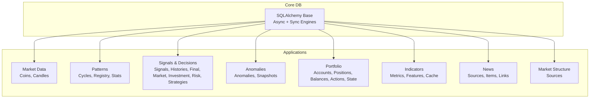
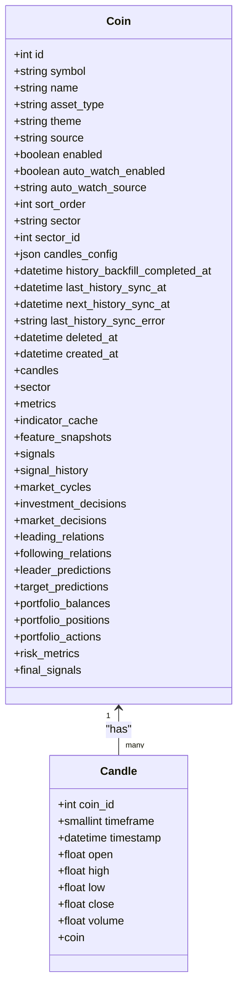
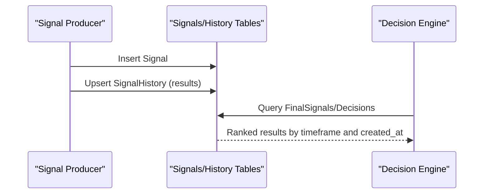
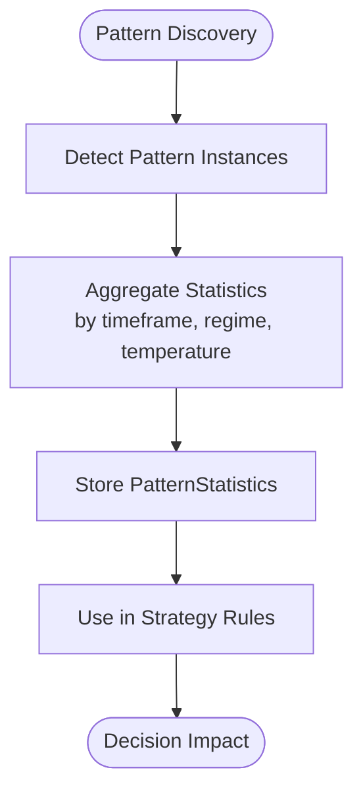
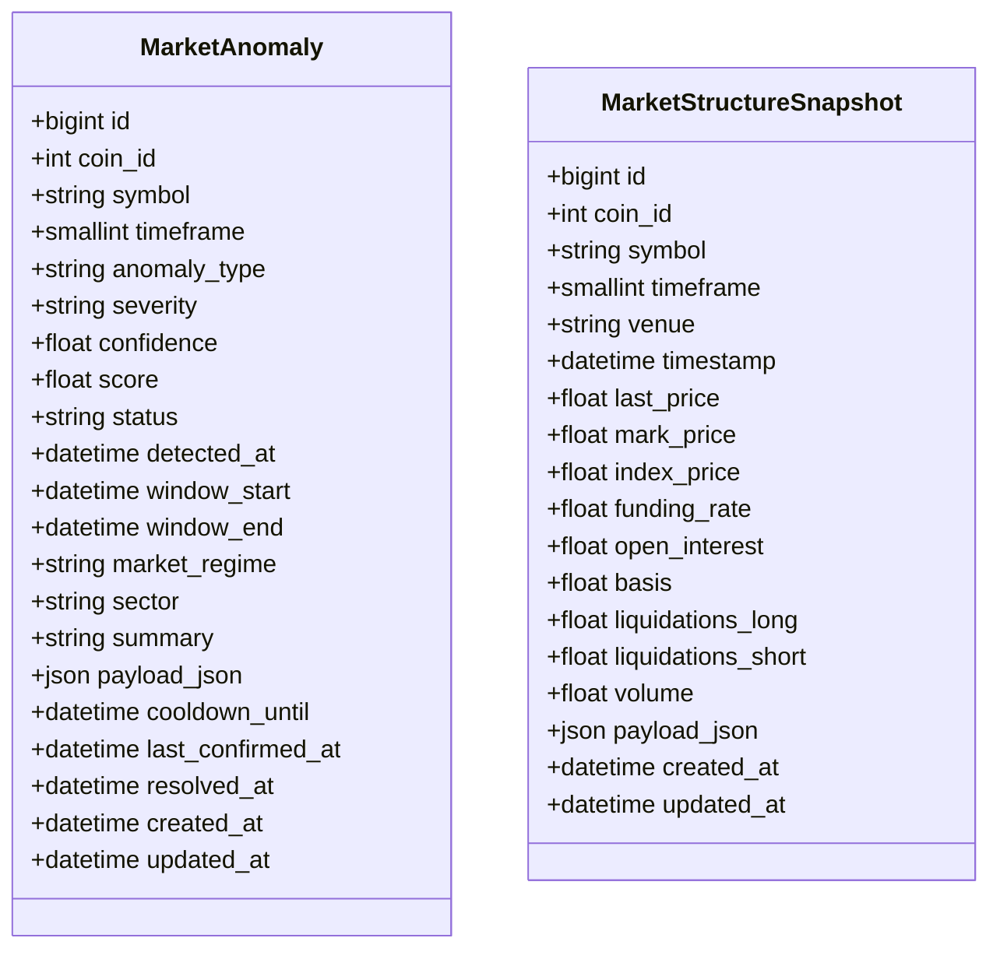
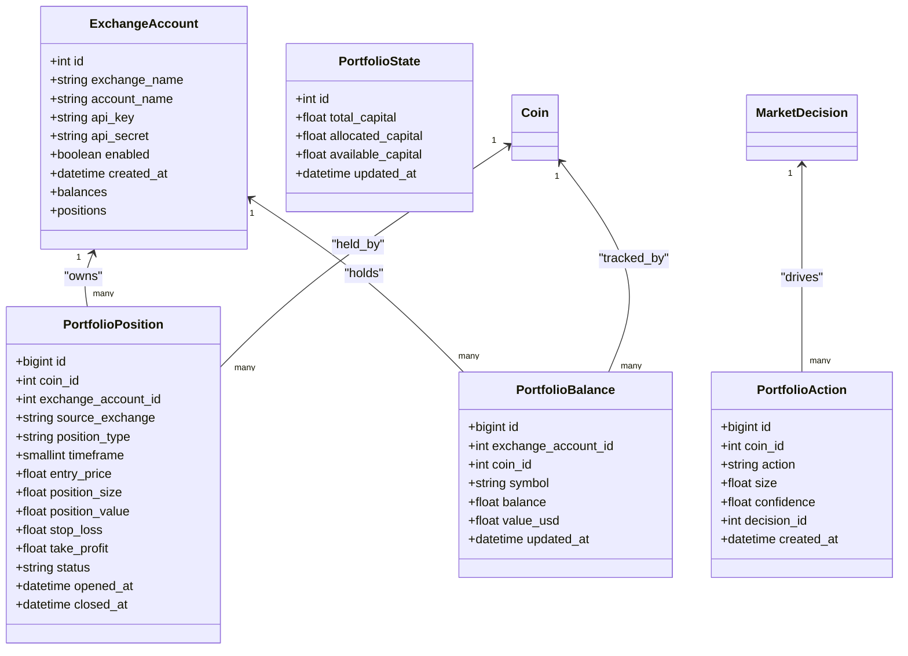
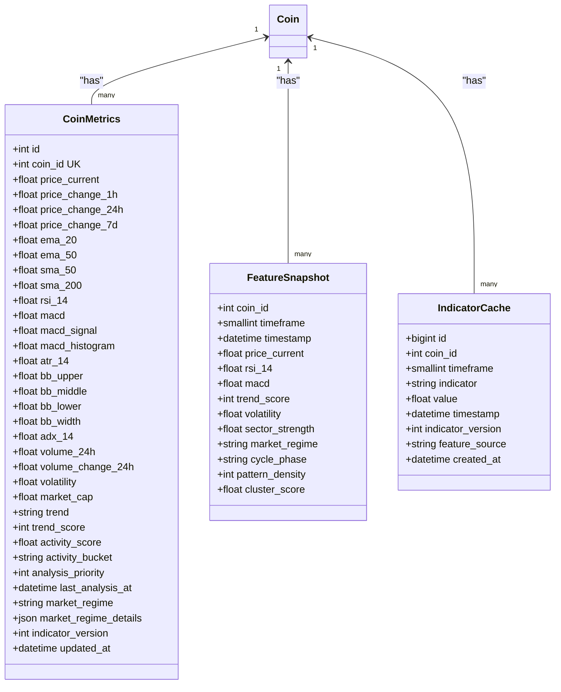
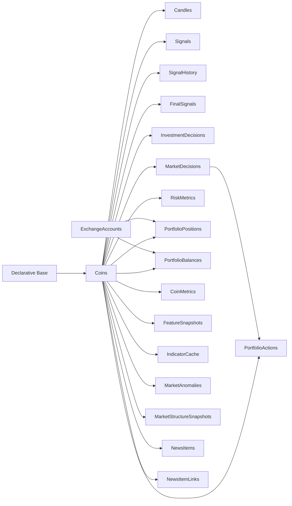

# Database Schema Design

<cite>
**Referenced Files in This Document**
- [session.py](file://src/core/db/session.py)
- [base.py](file://src/core/db/base.py)
- [persistence.py](file://src/core/db/persistence.py)
- [alembic.ini](file://alembic.ini)
- [20260310_000001_initial_schema.py](file://src/migrations/versions/20260310_000001_initial_schema.py)
- [20260311_000005_seed_default_assets.py](file://src/migrations/versions/20260311_000005_seed_default_assets.py)
- [20260311_000019_portfolio_engine.py](file://src/migrations/versions/20260311_000019_portfolio_engine.py)
- [market_data/models.py](file://src/apps/market_data/models.py)
- [patterns/models.py](file://src/apps/patterns/models.py)
- [signals/models.py](file://src/apps/signals/models.py)
- [anomalies/models.py](file://src/apps/anomalies/models.py)
- [portfolio/models.py](file://src/apps/portfolio/models.py)
- [indicators/models.py](file://src/apps/indicators/models.py)
- [news/models.py](file://src/apps/news/models.py)
- [market_structure/models.py](file://src/apps/market_structure/models.py)
</cite>

## Table of Contents
1. [Introduction](#introduction)
2. [Project Structure](#project-structure)
3. [Core Components](#core-components)
4. [Architecture Overview](#architecture-overview)
5. [Detailed Component Analysis](#detailed-component-analysis)
6. [Dependency Analysis](#dependency-analysis)
7. [Performance Considerations](#performance-considerations)
8. [Troubleshooting Guide](#troubleshooting-guide)
9. [Conclusion](#conclusion)
10. [Appendices](#appendices)

## Introduction
This document describes the database schema design for the financial trading platform. It covers entity relationships, migration management with Alembic, data model definitions across applications, and index optimization strategies. The schema supports market data ingestion, pattern intelligence, anomaly detection, signals and decisions, portfolio management, and related analytics.

## Project Structure
The database layer is built on SQLAlchemy declarative models with an asynchronous session factory and Alembic migrations. The schema spans multiple application domains:
- Market data and OHLCV candles
- Patterns and market regimes
- Signals, decisions, and risk metrics
- Anomalies and market structure snapshots
- Portfolio accounting and positions
- Indicators and analytics
- News ingestion and normalization



**Diagram sources**
- [session.py:15-45](file://src/core/db/session.py#L15-L45)
- [market_data/models.py:20-168](file://src/apps/market_data/models.py#L20-L168)
- [patterns/models.py:15-109](file://src/apps/patterns/models.py#L15-L109)
- [signals/models.py:15-237](file://src/apps/signals/models.py#L15-L237)
- [anomalies/models.py:15-124](file://src/apps/anomalies/models.py#L15-L124)
- [portfolio/models.py:16-151](file://src/apps/portfolio/models.py#L16-L151)
- [indicators/models.py:15-121](file://src/apps/indicators/models.py#L15-L121)
- [news/models.py:15-104](file://src/apps/news/models.py#L15-L104)
- [market_structure/models.py:12-49](file://src/apps/market_structure/models.py#L12-L49)

**Section sources**
- [session.py:15-45](file://src/core/db/session.py#L15-L45)
- [base.py:1-4](file://src/core/db/base.py#L1-L4)

## Core Components
- Declarative Base and engines: Asynchronous and synchronous SQLAlchemy engines configured with connection pooling and pre-ping. Sessions are managed via async generators.
- Persistence utilities: Logging helpers and repository/query service base classes for structured persistence logging and safe JSON serialization.

Key characteristics:
- Asynchronous ORM sessions for web runtime
- Synchronous engine retained for tests and maintenance scripts
- Centralized Base class for all models
- Structured persistence logging with sensitive data redaction

**Section sources**
- [session.py:15-72](file://src/core/db/session.py#L15-L72)
- [persistence.py:61-124](file://src/core/db/persistence.py#L61-L124)

## Architecture Overview
The schema is organized around a central asset registry (coins) and time-series data (candles). Higher-level constructs (signals, decisions, patterns, anomalies) reference coins and each other to form a cohesive analytical pipeline. Portfolio tables link decisions to real-world positions and balances.

```mermaid
erDiagram
COINS {
int id PK
string symbol UK
string name
string asset_type
string theme
string source
boolean enabled
boolean auto_watch_enabled
string auto_watch_source
int sort_order
string sector
int sector_id FK
json candles_config
timestamptz history_backfill_completed_at
timestamptz last_history_sync_at
timestamptz next_history_sync_at
string last_history_sync_error
timestamptz deleted_at
timestamptz created_at
}
CANDLES {
int coin_id PK,FK
smallint timeframe PK
timestamptz timestamp PK
float open
float high
float low
float close
float volume
}
EXCHANGE_ACCOUNTS {
int id PK
string exchange_name
string account_name
string api_key
string api_secret
boolean enabled
timestamptz created_at
}
PORTFOLIO_STATE {
int id PK
float total_capital
float allocated_capital
float available_capital
timestamptz updated_at
}
PORTFOLIO_POSITIONS {
bigint id PK
int coin_id FK
int exchange_account_id FK
string source_exchange
string position_type
smallint timeframe
float entry_price
float position_size
float position_value
float stop_loss
float take_profit
string status
timestamptz opened_at
timestamptz closed_at
}
PORTFOLIO_BALANCES {
bigint id PK
int exchange_account_id FK
int coin_id FK
string symbol
float balance
float value_usd
timestamptz updated_at
}
PORTFOLIO_ACTIONS {
bigint id PK
int coin_id FK
string action
float size
float confidence
int decision_id FK
timestamptz created_at
}
SIGNALS {
bigint id PK
int coin_id FK
smallint timeframe
string signal_type
float confidence
float priority_score
float context_score
float regime_alignment
string market_regime
timestamptz candle_timestamp
timestamptz created_at
}
SIGNAL_HISTORY {
bigint id PK
int coin_id FK
smallint timeframe
string signal_type
float confidence
string market_regime
timestamptz candle_timestamp
float profit_after_24h
float profit_after_72h
float maximum_drawdown
float result_return
float result_drawdown
timestamptz evaluated_at
}
FINAL_SIGNALS {
bigint id PK
int coin_id FK
smallint timeframe
string decision
float confidence
float risk_adjusted_score
string reason
timestamptz created_at
}
INVESTMENT_DECISIONS {
bigint id PK
int coin_id FK
smallint timeframe
string decision
float confidence
float score
string reason
timestamptz created_at
}
MARKET_DECISIONS {
bigint id PK
int coin_id FK
smallint timeframe
string decision
float confidence
int signal_count
timestamptz created_at
}
RISK_METRICS {
int coin_id PK,FK
smallint timeframe PK
float liquidity_score
float slippage_risk
float volatility_risk
timestamptz updated_at
}
STRATEGIES {
int id PK
string name UK
string description
boolean enabled
timestamptz created_at
}
STRATEGY_RULES {
int strategy_id PK,FK
string pattern_slug PK
string regime
string sector
string cycle
float min_confidence
}
STRATEGY_PERFORMANCE {
int strategy_id PK,FK
int sample_size
float win_rate
float avg_return
float sharpe_ratio
float max_drawdown
timestamptz updated_at
}
DISCOVERED_PATTERNS {
string structure_hash PK
smallint timeframe PK
int sample_size
float avg_return
float avg_drawdown
float confidence
}
MARKET_CYCLES {
int coin_id PK,FK
smallint timeframe PK
string cycle_phase
float confidence
timestamptz detected_at
}
PATTERN_FEATURE {
string feature_slug PK
boolean enabled
timestamptz created_at
}
PATTERN_REGISTRY {
string slug PK
string category
boolean enabled
int cpu_cost
string lifecycle_state
timestamptz created_at
}
PATTERN_STATISTICS {
string pattern_slug PK,FK
smallint timeframe PK
string market_regime PK
int sample_size
int total_signals
int successful_signals
float success_rate
float avg_return
float avg_drawdown
float temperature
boolean enabled
timestamptz last_evaluated_at
timestamptz updated_at
}
MARKET_ANOMALIES {
bigint id PK
int coin_id FK
string symbol
smallint timeframe
string anomaly_type
string severity
float confidence
float score
string status
timestamptz detected_at
timestamptz window_start
timestamptz window_end
string market_regime
string sector
string summary
json payload_json
timestamptz cooldown_until
timestamptz last_confirmed_at
timestamptz resolved_at
timestamptz created_at
timestamptz updated_at
}
MARKET_STRUCTURE_SNAPSHOTS {
bigint id PK
int coin_id FK
string symbol
smallint timeframe
string venue
timestamptz timestamp
float last_price
float mark_price
float index_price
float funding_rate
float open_interest
float basis
float liquidations_long
float liquidations_short
float volume
json payload_json
timestamptz created_at
timestamptz updated_at
}
COIN_METRICS {
int id PK
int coin_id FK UK
float price_current
float price_change_1h
float price_change_24h
float price_change_7d
float ema_20
float ema_50
float sma_50
float sma_200
float rsi_14
float macd
float macd_signal
float macd_histogram
float atr_14
float bb_upper
float bb_middle
float bb_lower
float bb_width
float adx_14
float volume_24h
float volume_change_24h
float volatility
float market_cap
string trend
int trend_score
float activity_score
string activity_bucket
int analysis_priority
timestamptz last_analysis_at
string market_regime
json market_regime_details
int indicator_version
timestamptz updated_at
}
FEATURE_SNAPSHOTS {
int coin_id PK,FK
smallint timeframe PK
timestamptz timestamp PK
float price_current
float rsi_14
float macd
int trend_score
float volatility
float sector_strength
string market_regime
string cycle_phase
int pattern_density
float cluster_score
}
INDICATOR_CACHE {
bigint id PK
int coin_id FK
smallint timeframe
string indicator
float value
timestamptz timestamp
int indicator_version
string feature_source
timestamptz created_at
}
NEWS_SOURCES {
int id PK
string plugin_name
string display_name
boolean enabled
string auth_mode
json credentials_json
json settings_json
json cursor_json
timestamptz last_polled_at
string last_error
timestamptz created_at
timestamptz updated_at
}
NEWS_ITEMS {
bigint id PK
int source_id FK
string plugin_name
string external_id
timestamptz published_at
string author_handle
string channel_name
string title
text content_text
string url
json symbol_hints
json payload_json
string normalization_status
json normalized_payload_json
timestamptz normalized_at
float sentiment_score
float relevance_score
timestamptz created_at
}
NEWS_ITEM_LINKS {
bigint id PK
bigint news_item_id FK
int coin_id FK
string coin_symbol
string matched_symbol
string link_type
float confidence
timestamptz created_at
}
MARKET_STRUCTURE_SOURCES {
int id PK
string plugin_name
string display_name
boolean enabled
string auth_mode
json credentials_json
json settings_json
json cursor_json
timestamptz last_polled_at
timestamptz last_success_at
timestamptz last_snapshot_at
string last_error
string health_status
timestamptz health_changed_at
int consecutive_failures
timestamptz backoff_until
timestamptz quarantined_at
string quarantine_reason
timestamptz last_alerted_at
string last_alert_kind
timestamptz created_at
timestamptz updated_at
}
COINS ||--o{ CANDLES : "has"
COINS ||--o{ SIGNALS : "has"
COINS ||--o{ SIGNAL_HISTORY : "has"
COINS ||--o{ FINAL_SIGNALS : "has"
COINS ||--o{ INVESTMENT_DECISIONS : "has"
COINS ||--o{ MARKET_DECISIONS : "has"
COINS ||--o{ RISK_METRICS : "has"
COINS ||--o{ PORTFOLIO_POSITIONS : "has"
COINS ||--o{ PORTFOLIO_BALANCES : "has"
COINS ||--o{ PORTFOLIO_ACTIONS : "has"
COINS ||--o{ COIN_METRICS : "has"
COINS ||--o{ FEATURE_SNAPSHOTS : "has"
COINS ||--o{ INDICATOR_CACHE : "has"
COINS ||--o{ MARKET_ANOMALIES : "has"
COINS ||--o{ MARKET_STRUCTURE_SNAPSHOTS : "has"
COINS ||--o{ NEWS_ITEMS : "mentions"
COINS ||--o{ NEWS_ITEM_LINKS : "linked_to"
EXCHANGE_ACCOUNTS ||--o{ PORTFOLIO_POSITIONS : "owns"
EXCHANGE_ACCOUNTS ||--o{ PORTFOLIO_BALANCES : "holds"
STRATEGIES ||--o{ STRATEGY_RULES : "defines"
STRATEGIES ||--o{ STRATEGY_PERFORMANCE : "measures"
PATTERN_REGISTRY ||--o{ PATTERN_STATISTICS : "evaluates"
```

**Diagram sources**
- [market_data/models.py:20-168](file://src/apps/market_data/models.py#L20-L168)
- [signals/models.py:15-237](file://src/apps/signals/models.py#L15-L237)
- [patterns/models.py:15-109](file://src/apps/patterns/models.py#L15-L109)
- [anomalies/models.py:15-124](file://src/apps/anomalies/models.py#L15-L124)
- [portfolio/models.py:16-151](file://src/apps/portfolio/models.py#L16-L151)
- [indicators/models.py:15-121](file://src/apps/indicators/models.py#L15-L121)
- [news/models.py:15-104](file://src/apps/news/models.py#L15-L104)
- [market_structure/models.py:12-49](file://src/apps/market_structure/models.py#L12-L49)

## Detailed Component Analysis

### Market Data and Coins
- Coins table stores asset metadata, classification, watch settings, and synchronization timestamps. It references sectors and holds many-to-one relationships to downstream analytics.
- Candles table stores OHLCV time-series with composite primary keys (coin_id, timeframe, timestamp) and supporting indexes for efficient queries by coin/timeframe/timestamp and reverse ordering.



**Diagram sources**
- [market_data/models.py:20-168](file://src/apps/market_data/models.py#L20-L168)

**Section sources**
- [market_data/models.py:20-168](file://src/apps/market_data/models.py#L20-L168)

### Signals, Decisions, and Risk
- Signal and SignalHistory tables track per-coin, per-timeframe signals with unique constraints and indexes optimized for lookups by coin/timeframe/timestamp and signal type.
- FinalSignal, InvestmentDecision, and MarketDecision capture synthesized decisions with ranking and confidence metrics.
- RiskMetric captures per-coin/per-timeframe risk scores.
- Strategy-related tables define rules and performance metrics.



**Diagram sources**
- [signals/models.py:15-237](file://src/apps/signals/models.py#L15-L237)

**Section sources**
- [signals/models.py:15-237](file://src/apps/signals/models.py#L15-L237)

### Patterns and Market Regimes
- DiscoveredPattern and PatternStatistics tables support pattern analytics with temperature, success rates, and regime-aware aggregations.
- MarketCycle tracks cycle phases per coin/timeframe.



**Diagram sources**
- [patterns/models.py:15-109](file://src/apps/patterns/models.py#L15-L109)

**Section sources**
- [patterns/models.py:15-109](file://src/apps/patterns/models.py#L15-L109)

### Anomalies and Market Structure
- MarketAnomaly captures anomaly events with severity, status, and temporal windows.
- MarketStructureSnapshot captures venue-specific structure metrics.



**Diagram sources**
- [anomalies/models.py:15-124](file://src/apps/anomalies/models.py#L15-L124)

**Section sources**
- [anomalies/models.py:15-124](file://src/apps/anomalies/models.py#L15-L124)

### Portfolio Management
- ExchangeAccount holds exchange credentials and enables filtering by exchange/name.
- PortfolioPosition and PortfolioBalance track holdings, values, and statuses.
- PortfolioAction ties actions to decisions and coins.
- PortfolioState maintains capital allocation.



**Diagram sources**
- [portfolio/models.py:16-151](file://src/apps/portfolio/models.py#L16-L151)

**Section sources**
- [portfolio/models.py:16-151](file://src/apps/portfolio/models.py#L16-L151)

### Indicators and Analytics
- CoinMetrics aggregates derived metrics with indexes on trend and volume change.
- FeatureSnapshot captures per-coin/per-timeframe feature vectors.
- IndicatorCache stores computed indicator values with uniqueness constraints.



**Diagram sources**
- [indicators/models.py:15-121](file://src/apps/indicators/models.py#L15-L121)

**Section sources**
- [indicators/models.py:15-121](file://src/apps/indicators/models.py#L15-L121)

### News Pipeline
- NewsSource manages source plugins and cursors.
- NewsItem stores normalized content and scores.
- NewsItemLink connects items to coins with confidence.

```mermaid
sequenceDiagram
participant Source as "NewsSource"
participant Item as "NewsItem"
participant Link as "NewsItemLink"
Source->>Item : Create item with metadata
Item->>Link : Create links to relevant coins
Link-->>Item : Confidence-ranked matches
```

**Diagram sources**
- [news/models.py:15-104](file://src/apps/news/models.py#L15-L104)

**Section sources**
- [news/models.py:15-104](file://src/apps/news/models.py#L15-L104)

### Market Structure Sources
- MarketStructureSource tracks health, polling, and snapshot timing for structure data providers.

**Section sources**
- [market_structure/models.py:12-49](file://src/apps/market_structure/models.py#L12-L49)

## Dependency Analysis
- All models inherit from a single Base class and live under the same database.
- Foreign keys enforce referential integrity across coins to downstream analytics.
- Many-to-one relationships dominate, with a few one-to-many and one-to-one (e.g., CoinMetrics).
- Indexes are strategically placed to optimize frequent queries (time-series scans, ranking, filtering).



**Diagram sources**
- [session.py:15-16](file://src/core/db/session.py#L15-L16)
- [market_data/models.py:20-168](file://src/apps/market_data/models.py#L20-L168)
- [signals/models.py:15-237](file://src/apps/signals/models.py#L15-L237)
- [portfolio/models.py:16-151](file://src/apps/portfolio/models.py#L16-L151)
- [indicators/models.py:15-121](file://src/apps/indicators/models.py#L15-L121)
- [anomalies/models.py:15-124](file://src/apps/anomalies/models.py#L15-L124)
- [news/models.py:15-104](file://src/apps/news/models.py#L15-L104)

**Section sources**
- [session.py:15-16](file://src/core/db/session.py#L15-L16)
- [market_data/models.py:20-168](file://src/apps/market_data/models.py#L20-L168)

## Performance Considerations
Indexing strategies:
- Time-series primary keys and composite indexes on coin_id/timeframe/timestamp enable fast range scans and reverse-time ordering.
- Unique constraints prevent duplicates for signals and snapshots.
- Reverse indexes on created_at and score fields support ranking and time-based retrieval.
- JSON and text fields are not indexed; consider selective GIN/TSVector indexes if full-text search is introduced.

Storage and data types:
- Numeric precision chosen for price/volume to avoid floating-point drift.
- JSON columns store dynamic payloads; consider partitioning or archival for very large documents.

Partitioning and lifecycle:
- Consider time-partitioned tables for candles and snapshots to manage growth.
- Implement soft-deletion patterns (e.g., deleted_at) and periodic cleanup jobs.

Concurrency and locking:
- Use appropriate isolation levels and consider read replicas for reporting workloads.
- Batch writes for candles and snapshots to reduce lock contention.

[No sources needed since this section provides general guidance]

## Troubleshooting Guide
Common issues and mitigations:
- Migration conflicts: Alembic revisions are timestamped; ensure sequential application and resolve dependency mismatches.
- Index creation failures: Some migrations add functional or partial indexes; verify SQL dialect support.
- Data integrity errors: Foreign keys enforce cascading deletes and SET NULL where appropriate; validate upstream deletions.
- Performance regressions: Review missing indexes on hot query paths; add composite indexes incrementally.

**Section sources**
- [20260310_000001_initial_schema.py:20-59](file://src/migrations/versions/20260310_000001_initial_schema.py#L20-L59)
- [20260311_000019_portfolio_engine.py:18-100](file://src/migrations/versions/20260311_000019_portfolio_engine.py#L18-L100)

## Conclusion
The schema is designed around a robust asset registry and time-series foundation, with specialized tables for signals, decisions, patterns, anomalies, portfolio, and analytics. Alembic migrations provide controlled evolution, while indexes and data types optimize for performance. The architecture supports scalable ingestion, analysis, and execution workflows across multiple financial domains.

## Appendices

### Migration Management with Alembic
- Revision naming convention embeds timestamps for deterministic ordering.
- Typical migration lifecycle: create tables/indexes, seed data, evolve schema, maintain backward compatibility.
- Downgrade paths drop indexes and tables in reverse dependency order.

**Section sources**
- [alembic.ini](file://alembic.ini)
- [20260310_000001_initial_schema.py:1-59](file://src/migrations/versions/20260310_000001_initial_schema.py#L1-L59)
- [20260311_000005_seed_default_assets.py:1-349](file://src/migrations/versions/20260311_000005_seed_default_assets.py#L1-L349)
- [20260311_000019_portfolio_engine.py:1-100](file://src/migrations/versions/20260311_000019_portfolio_engine.py#L1-L100)

### Data Model Definitions Across Applications
- Market Data: Coins, Candles
- Patterns: DiscoveredPattern, MarketCycle, PatternRegistry, PatternStatistic
- Signals: Signal, SignalHistory, FinalSignal, InvestmentDecision, MarketDecision, RiskMetric, Strategy, StrategyRule, StrategyPerformance
- Anomalies: MarketAnomaly, MarketStructureSnapshot
- Portfolio: ExchangeAccount, PortfolioPosition, PortfolioBalance, PortfolioAction, PortfolioState
- Indicators: CoinMetrics, FeatureSnapshot, IndicatorCache
- News: NewsSource, NewsItem, NewsItemLink
- Market Structure: MarketStructureSource

**Section sources**
- [market_data/models.py:20-168](file://src/apps/market_data/models.py#L20-L168)
- [patterns/models.py:15-109](file://src/apps/patterns/models.py#L15-L109)
- [signals/models.py:15-237](file://src/apps/signals/models.py#L15-L237)
- [anomalies/models.py:15-124](file://src/apps/anomalies/models.py#L15-L124)
- [portfolio/models.py:16-151](file://src/apps/portfolio/models.py#L16-L151)
- [indicators/models.py:15-121](file://src/apps/indicators/models.py#L15-L121)
- [news/models.py:15-104](file://src/apps/news/models.py#L15-L104)
- [market_structure/models.py:12-49](file://src/apps/market_structure/models.py#L12-L49)