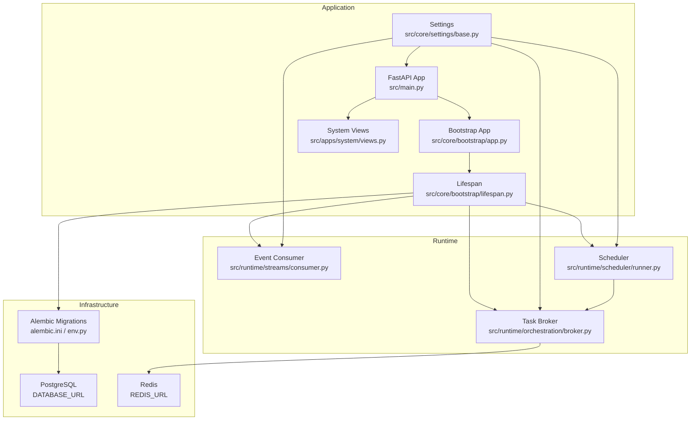
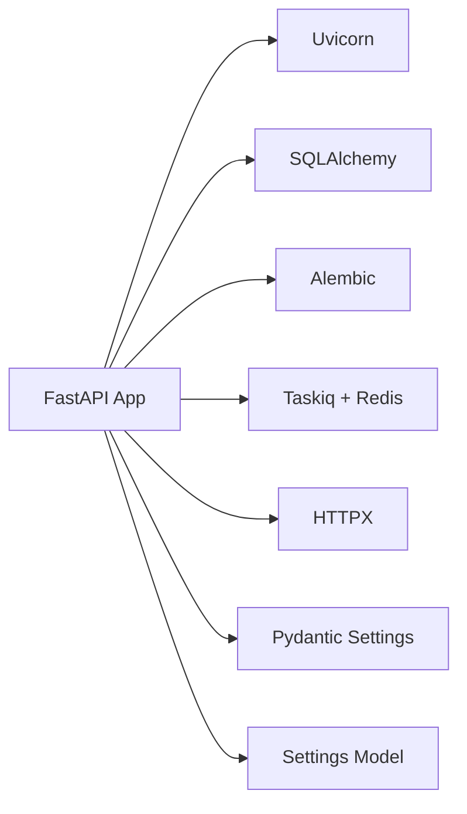
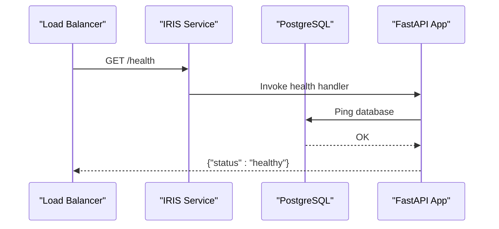

# Deployment Guide

<cite>
**Referenced Files in This Document**
- [Dockerfile](file://Dockerfile)
- [.dockerignore](file://.dockerignore)
- [iris.service](file://iris.service)
- [pyproject.toml](file://pyproject.toml)
- [alembic.ini](file://alembic.ini)
- [src/main.py](file://src/main.py)
- [src/core/bootstrap/app.py](file://src/core/bootstrap/app.py)
- [src/core/bootstrap/lifespan.py](file://src/core/bootstrap/lifespan.py)
- [src/core/settings/base.py](file://src/core/settings/base.py)
- [src/runtime/orchestration/broker.py](file://src/runtime/orchestration/broker.py)
- [src/runtime/streams/consumer.py](file://src/runtime/streams/consumer.py)
- [src/runtime/scheduler/runner.py](file://src/runtime/scheduler/runner.py)
- [src/apps/system/views.py](file://src/apps/system/views.py)
- [src/migrations/env.py](file://src/migrations/env.py)
</cite>

## Table of Contents
1. [Introduction](#introduction)
2. [Project Structure](#project-structure)
3. [Core Components](#core-components)
4. [Architecture Overview](#architecture-overview)
5. [Detailed Component Analysis](#detailed-component-analysis)
6. [Dependency Analysis](#dependency-analysis)
7. [Performance Considerations](#performance-considerations)
8. [Troubleshooting Guide](#troubleshooting-guide)
9. [Conclusion](#conclusion)
10. [Appendices](#appendices)

## Introduction
This guide provides comprehensive deployment instructions for the IRIS platform. It covers containerization with Docker, production-grade systemd service configuration, environment variable management, dependency orchestration, scaling strategies, monitoring, load balancing, health checks, failover mechanisms, performance and logging configuration, alerting, deployment automation, rollback procedures, and maintenance workflows. Security considerations, network configuration, and resource optimization are addressed for production environments.

## Project Structure
IRIS is a Python FastAPI application with a modular architecture composed of runtime orchestration, streaming event consumers, scheduled tasks, and multiple domain applications. The deployment artifacts include a Dockerfile for containerization, a systemd unit for process supervision, and configuration files for migrations and package management.

```mermaid
graph TB
A["Dockerfile"] --> B["Container Image"]
C[".dockerignore"] --> B
D["pyproject.toml"] --> B
E["iris.service"] --> F["systemd Unit"]
G["alembic.ini"] --> H["Database Migrations"]
I["src/main.py"] --> J["FastAPI App"]
K["src/core/bootstrap/app.py"] --> J
L["src/core/bootstrap/lifespan.py"] --> J
M["src/core/settings/base.py"] --> N["Settings"]
O["src/runtime/orchestration/broker.py"] --> P["Redis Streams"]
Q["src/runtime/streams/consumer.py"] --> P
R["src/runtime/scheduler/runner.py"] --> S["Task Scheduling"]
T["src/apps/system/views.py"] --> U["Health and Status Endpoints"]
```

**Diagram sources**
- [Dockerfile:1-18](file://Dockerfile#L1-L18)
- [.dockerignore:1-6](file://.dockerignore#L1-L6)
- [pyproject.toml:1-89](file://pyproject.toml#L1-L89)
- [iris.service:1-15](file://iris.service#L1-L15)
- [alembic.ini:1-38](file://alembic.ini#L1-L38)
- [src/main.py:1-22](file://src/main.py#L1-L22)
- [src/core/bootstrap/app.py:1-81](file://src/core/bootstrap/app.py#L1-L81)
- [src/core/bootstrap/lifespan.py:1-70](file://src/core/bootstrap/lifespan.py#L1-L70)
- [src/core/settings/base.py:1-90](file://src/core/settings/base.py#L1-L90)
- [src/runtime/orchestration/broker.py:1-23](file://src/runtime/orchestration/broker.py#L1-L23)
- [src/runtime/streams/consumer.py:1-230](file://src/runtime/streams/consumer.py#L1-L230)
- [src/runtime/scheduler/runner.py:1-317](file://src/runtime/scheduler/runner.py#L1-L317)
- [src/apps/system/views.py:1-53](file://src/apps/system/views.py#L1-L53)

**Section sources**
- [Dockerfile:1-18](file://Dockerfile#L1-L18)
- [.dockerignore:1-6](file://.dockerignore#L1-L6)
- [pyproject.toml:1-89](file://pyproject.toml#L1-L89)
- [iris.service:1-15](file://iris.service#L1-L15)
- [alembic.ini:1-38](file://alembic.ini#L1-L38)
- [src/main.py:1-22](file://src/main.py#L1-L22)
- [src/core/bootstrap/app.py:1-81](file://src/core/bootstrap/app.py#L1-L81)
- [src/core/bootstrap/lifespan.py:1-70](file://src/core/bootstrap/lifespan.py#L1-L70)
- [src/core/settings/base.py:1-90](file://src/core/settings/base.py#L1-L90)
- [src/runtime/orchestration/broker.py:1-23](file://src/runtime/orchestration/broker.py#L1-L23)
- [src/runtime/streams/consumer.py:1-230](file://src/runtime/streams/consumer.py#L1-L230)
- [src/runtime/scheduler/runner.py:1-317](file://src/runtime/scheduler/runner.py#L1-L317)
- [src/apps/system/views.py:1-53](file://src/apps/system/views.py#L1-L53)

## Core Components
- Containerization: Built with a Python slim image, using uv for fast dependency installation, exposing port 8000, and running via Uvicorn.
- Systemd Service: Runs the FastAPI application module, supervises restarts, and loads environment variables from a dedicated file.
- Settings Management: Centralized via Pydantic Settings with environment variable overrides and sensible defaults.
- Runtime Orchestration: Task brokers backed by Redis Streams, event consumers, and a scheduler that enqueues periodic tasks.
- Health and Status: Exposes health and system status endpoints for monitoring and readiness probes.
- Database Migrations: Alembic configuration and environment integration for schema management.

**Section sources**
- [Dockerfile:1-18](file://Dockerfile#L1-L18)
- [iris.service:1-15](file://iris.service#L1-L15)
- [src/core/settings/base.py:1-90](file://src/core/settings/base.py#L1-L90)
- [src/runtime/orchestration/broker.py:1-23](file://src/runtime/orchestration/broker.py#L1-L23)
- [src/runtime/streams/consumer.py:1-230](file://src/runtime/streams/consumer.py#L1-L230)
- [src/runtime/scheduler/runner.py:1-317](file://src/runtime/scheduler/runner.py#L1-L317)
- [src/apps/system/views.py:1-53](file://src/apps/system/views.py#L1-L53)
- [alembic.ini:1-38](file://alembic.ini#L1-L38)
- [src/migrations/env.py:1-56](file://src/migrations/env.py#L1-L56)

## Architecture Overview
The IRIS platform runs as a FastAPI application with asynchronous lifecycle hooks. On startup, it waits for database and Redis connectivity, applies migrations, initializes brokers and workers, and starts the scheduler. Consumers read from Redis Streams and process events asynchronously. Scheduled tasks are enqueued periodically according to settings.

**Diagram sources**
- [src/main.py:1-22](file://src/main.py#L1-L22)
- [src/core/bootstrap/app.py:1-81](file://src/core/bootstrap/app.py#L1-L81)
- [src/core/bootstrap/lifespan.py:1-70](file://src/core/bootstrap/lifespan.py#L1-L70)
- [src/core/settings/base.py:1-90](file://src/core/settings/base.py#L1-L90)
- [src/runtime/orchestration/broker.py:1-23](file://src/runtime/orchestration/broker.py#L1-L23)
- [src/runtime/streams/consumer.py:1-230](file://src/runtime/streams/consumer.py#L1-L230)
- [src/runtime/scheduler/runner.py:1-317](file://src/runtime/scheduler/runner.py#L1-L317)
- [src/apps/system/views.py:1-53](file://src/apps/system/views.py#L1-L53)
- [alembic.ini:1-38](file://alembic.ini#L1-L38)
- [src/migrations/env.py:1-56](file://src/migrations/env.py#L1-L56)

## Detailed Component Analysis

### Containerization with Docker
- Base image: Python slim with uv installed for fast dependency resolution.
- Working directory and environment: Sets link mode and prepends a virtual environment to PATH.
- Dependencies: Uses uv sync with frozen lockfiles to ensure reproducible installs.
- Application entrypoint: Exposes port 8000 and runs Uvicorn pointing to the FastAPI app factory.
- Build context: Copies project files after dependency install to leverage layer caching.

Best practices:
- Pin uv version in CI to ensure deterministic builds.
- Keep .dockerignore minimal but include Python cache and test caches.
- Use multi-stage builds if minimizing image size is critical.

**Section sources**
- [Dockerfile:1-18](file://Dockerfile#L1-L18)
- [.dockerignore:1-6](file://.dockerignore#L1-L6)
- [pyproject.toml:1-89](file://pyproject.toml#L1-L89)

### Systemd Service Configuration
- Description and timing: Starts after network is up.
- Execution: Runs the FastAPI module as a simple service with working directory.
- Environment: Loads environment variables from a dedicated file.
- Restart policy: Automatic restart with a small delay to avoid tight loops.

Operational tips:
- Place the environment file under /etc/iris/iris.env with appropriate permissions.
- Use systemd drop-ins for overrides in staging vs production.
- Monitor logs via journalctl for the service unit.

**Section sources**
- [iris.service:1-15](file://iris.service#L1-L15)

### Environment Variable Management
- Settings model defines defaults and aliases for environment variables.
- Supports database URL, Redis URL, API host/port, CORS origins, task scheduling intervals, worker counts, and feature flags.
- Case-insensitive loading with optional .env file support.

Recommended variables for production:
- DATABASE_URL, REDIS_URL, POLYGON_API_KEY, TWELVE_DATA_API_KEY, ALPHA_VANTAGE_API_KEY, IRIS_CONTROL_TOKEN, CORS_ORIGINS.
- Feature flags: enable_hypothesis_engine, bootstrap_history_on_startup.

Validation:
- Use pydantic validators to normalize lists and enforce types.
- Load-time validation ensures missing secrets fail early.

**Section sources**
- [src/core/settings/base.py:1-90](file://src/core/settings/base.py#L1-L90)

### Dependency Orchestration
- Lifespan lifecycle:
  - Waits for database and Redis readiness.
  - Applies Alembic migrations synchronously during startup.
  - Initializes brokers, spawns Taskiq and event worker processes, and starts the scheduler.
  - Gracefully shuts down on exit, closing connections and stopping workers.

- Brokers and queues:
  - General and analytics Redis Stream brokers with consumer groups.
  - Queues and consumer group names configured via settings.

- Event consumers:
  - Async Redis-based consumers with idempotency tracking, stale message reprocessing, and metrics recording hooks.
  - Batch sizes, blocking timeouts, and TTLs configurable via settings.

- Scheduler:
  - Periodic task enqueuing controlled by settings intervals.
  - Conditional inclusion of hypothesis engine tasks.

**Section sources**
- [src/core/bootstrap/lifespan.py:1-70](file://src/core/bootstrap/lifespan.py#L1-L70)
- [src/runtime/orchestration/broker.py:1-23](file://src/runtime/orchestration/broker.py#L1-L23)
- [src/runtime/streams/consumer.py:1-230](file://src/runtime/streams/consumer.py#L1-L230)
- [src/runtime/scheduler/runner.py:1-317](file://src/runtime/scheduler/runner.py#L1-L317)

### Monitoring and Health Checks
- Health endpoint: Returns healthy status after verifying database connectivity.
- System status endpoint: Reports service status, taskiq mode, and worker health.
- Logging: Alembic and SQLAlchemy loggers configured in alembic.ini; adjust levels for production.

Recommendations:
- Use the health endpoint for Kubernetes readiness/liveness probes.
- Expose Prometheus metrics via a metrics endpoint if integrating with Prometheus.
- Centralize logs to a SIEM or log aggregation platform.

**Section sources**
- [src/apps/system/views.py:1-53](file://src/apps/system/views.py#L1-L53)
- [alembic.ini:1-38](file://alembic.ini#L1-L38)

### Load Balancing Strategies
- Horizontal scaling: Run multiple instances behind a reverse proxy or load balancer.
- Sticky sessions: Not required for stateless FastAPI routes; keep downstream state in Redis or PostgreSQL.
- Upstream health checks: Route unhealthy instances out of rotation using health endpoints.

[No sources needed since this section provides general guidance]

### Failover Mechanisms
- Database: Use a highly available PostgreSQL cluster and configure failover VIP or DNS.
- Redis: Use Redis Sentinel or managed Redis with automatic failover.
- Workers: Multiple consumer processes and consumer groups enable rebalancing when nodes fail.

[No sources needed since this section provides general guidance]

### Performance Monitoring, Logging, and Alerting
- Performance: Instrument task durations, consumer throughput, and database query latency.
- Logging: Configure log levels per component; ship structured logs to stdout/stderr for container log collection.
- Alerting: Alert on failing health checks, high error rates, consumer lag, and migration failures.

[No sources needed since this section provides general guidance]

### Deployment Automation and Rollback Procedures
- CI/CD: Build images with Docker, push to a registry, and deploy via your platform’s rollout mechanism.
- Rollback: Tag images, perform blue/green or rolling updates, and revert on failure.
- Zero-downtime: Use readiness probes and graceful shutdown to avoid dropping requests.

[No sources needed since this section provides general guidance]

### Maintenance Workflows
- Schema changes: Apply migrations via Alembic; ensure downtime windows for breaking changes.
- Backups: Schedule regular backups for PostgreSQL and Redis snapshots.
- Secrets rotation: Rotate API keys and tokens without redeploying by updating environment files.

[No sources needed since this section provides general guidance]

## Dependency Analysis
The application depends on FastAPI, Uvicorn, SQLAlchemy, Alembic, Taskiq with Redis, Redis client, and HTTP clients. Settings drive external integrations and operational behavior.

**Diagram sources**
- [pyproject.toml:1-89](file://pyproject.toml#L1-L89)
- [src/core/settings/base.py:1-90](file://src/core/settings/base.py#L1-L90)

**Section sources**
- [pyproject.toml:1-89](file://pyproject.toml#L1-L89)
- [src/core/settings/base.py:1-90](file://src/core/settings/base.py#L1-L90)

## Performance Considerations
- Concurrency: Tune worker processes and batch sizes based on CPU and I/O characteristics.
- Database: Use connection pooling, index frequently queried columns, and monitor slow queries.
- Redis: Monitor memory usage, pipeline commands, and avoid blocking operations.
- Scheduling: Adjust intervals to balance freshness and resource usage.

[No sources needed since this section provides general guidance]

## Troubleshooting Guide
Common issues and remedies:
- Database connectivity errors on startup: Verify DATABASE_URL and network access; confirm migrations applied.
- Redis connectivity errors: Confirm REDIS_URL and network ACLs; check consumer group creation.
- Health check failures: Inspect database ping and external API keys.
- Consumer lag: Increase worker processes or reduce batch size; monitor Redis stream backlog.

**Section sources**
- [src/core/bootstrap/lifespan.py:1-70](file://src/core/bootstrap/lifespan.py#L1-L70)
- [src/apps/system/views.py:1-53](file://src/apps/system/views.py#L1-L53)

## Conclusion
This guide outlines a robust, production-ready deployment strategy for IRIS, covering containerization, service management, environment configuration, runtime orchestration, monitoring, scaling, and operational procedures. By following these practices, teams can achieve reliable, observable, and maintainable deployments.

[No sources needed since this section summarizes without analyzing specific files]

## Appendices

### Production Environment Variables
Key variables to define in the environment file:
- DATABASE_URL: PostgreSQL connection string
- REDIS_URL: Redis connection string
- POLYGON_API_KEY, TWELVE_DATA_API_KEY, ALPHA_VANTAGE_API_KEY: Market data provider credentials
- IRIS_CONTROL_TOKEN: Control plane access token
- CORS_ORIGINS: Comma-separated list of allowed origins
- enable_hypothesis_engine: Enable hypothesis engine tasks
- bootstrap_history_on_startup: Perform initial backfill on startup

**Section sources**
- [src/core/settings/base.py:1-90](file://src/core/settings/base.py#L1-L90)

### Health Check Sequence

**Diagram sources**
- [src/apps/system/views.py:1-53](file://src/apps/system/views.py#L1-L53)