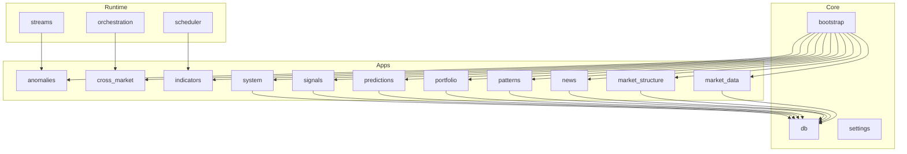
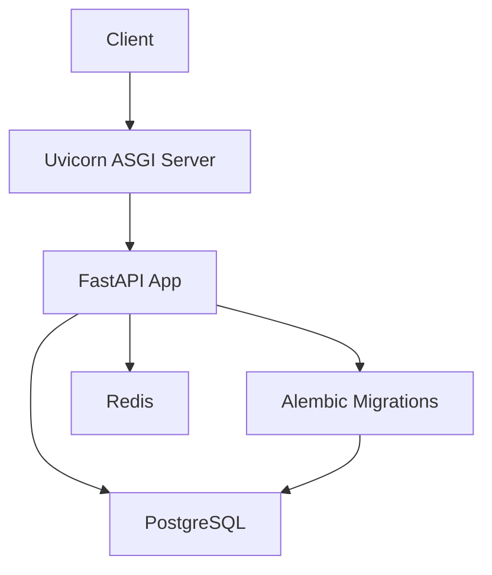
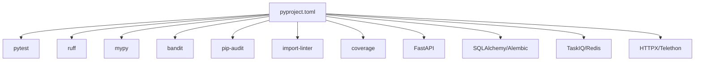

# Development Guidelines

<cite>
**Referenced Files in This Document**
- [pyproject.toml](file://pyproject.toml)
- [Dockerfile](file://Dockerfile)
- [alembic.ini](file://alembic.ini)
- [src/main.py](file://src/main.py)
- [src/core/bootstrap/app.py](file://src/core/bootstrap/app.py)
- [src/core/settings/base.py](file://src/core/settings/base.py)
- [tests/conftest.py](file://tests/conftest.py)
</cite>

## Table of Contents
1. [Introduction](#introduction)
2. [Project Structure](#project-structure)
3. [Core Components](#core-components)
4. [Architecture Overview](#architecture-overview)
5. [Detailed Component Analysis](#detailed-component-analysis)
6. [Dependency Analysis](#dependency-analysis)
7. [Performance Considerations](#performance-considerations)
8. [Troubleshooting Guide](#troubleshooting-guide)
9. [Conclusion](#conclusion)
10. [Appendices](#appendices)

## Introduction
This document defines comprehensive development guidelines for contributing to the IRIS platform. It covers code style and formatting standards enforced via Ruff, linting configuration, type checking with MyPy, dependency management, testing requirements, documentation standards, security scanning, quality gates, and operational practices for local development, debugging, and troubleshooting. It also outlines branching and pull request practices aligned with the repository’s tooling and structure.

## Project Structure
The IRIS backend is organized around a layered architecture:
- Runtime layer orchestrating streams, orchestration, and scheduling
- Application domains (apps) implementing features such as anomalies, cross-market, indicators, market data, market structure, news, patterns, portfolio, predictions, signals, and system
- Core layer providing bootstrapping, database, settings, and shared infrastructure
- Tests under a dedicated tests directory mirroring the src layout

**Section sources**
- [src/apps/__init__.py:1-14](file://src/apps/__init__.py#L1-L14)

## Core Components
- Application bootstrap and routing: The FastAPI application is created with deferred lifespan initialization, Alembic migration execution hook, CORS middleware, and inclusion of routers from multiple app domains.
- Settings: Centralized configuration via Pydantic settings with environment variable support and normalization helpers.
- Testing harness: A comprehensive pytest configuration with fixtures for database migrations, Redis isolation, and per-domain cleanup routines.

Key implementation references:
- Application creation and router registration
  - [src/core/bootstrap/app.py:49-81](file://src/core/bootstrap/app.py#L49-L81)
- Settings definition and environment binding
  - [src/core/settings/base.py:8-90](file://src/core/settings/base.py#L8-L90)
- Test fixtures and database migrations
  - [tests/conftest.py:96-103](file://tests/conftest.py#L96-L103)

**Section sources**
- [src/core/bootstrap/app.py:49-81](file://src/core/bootstrap/app.py#L49-L81)
- [src/core/settings/base.py:8-90](file://src/core/settings/base.py#L8-L90)
- [tests/conftest.py:96-103](file://tests/conftest.py#L96-L103)

## Architecture Overview
The backend exposes a FastAPI application that dynamically includes routers for multiple functional domains. Alembic manages database migrations at startup. Redis and PostgreSQL are used for event streaming and persistence respectively. The container image uses uv for deterministic dependency installation.

**Diagram sources**
- [src/core/bootstrap/app.py:37-47](file://src/core/bootstrap/app.py#L37-L47)
- [src/main.py:12-17](file://src/main.py#L12-L17)
- [Dockerfile:10-17](file://Dockerfile#L10-L17)

**Section sources**
- [src/core/bootstrap/app.py:37-47](file://src/core/bootstrap/app.py#L37-L47)
- [src/main.py:12-17](file://src/main.py#L12-L17)
- [Dockerfile:10-17](file://Dockerfile#L10-L17)

## Detailed Component Analysis

### Code Style and Formatting Standards (Ruff)
- Target Python version and line length are configured in the project configuration.
- Lint ruleset includes error categories, bug detection, import sorting, pyupgrade, SIM (simple), C4 (comprehensions), RET (return), RUF (per-file), and PERF (performance).
- Source roots include src and tests; migrations are excluded from linting.
- Formatting is handled by Ruff’s formatter; ensure consistent formatting across contributions.

Recommended actions:
- Run Ruff lint and fix automatically before committing.
- Keep line length within configured limits.
- Respect import order and module layering contracts.

**Section sources**
- [pyproject.toml:45-49](file://pyproject.toml#L45-L49)
- [pyproject.toml:51-53](file://pyproject.toml#L51-L53)

### Type Checking (MyPy)
- Strict mode is enabled with missing imports ignored, namespace packages supported, and explicit package bases configured.
- Errors are presented with concise codes and pretty formatting.

Recommended actions:
- Resolve all MyPy errors prior to merge.
- Add type hints for new code and update existing stubs.

**Section sources**
- [pyproject.toml:54-62](file://pyproject.toml#L54-L62)

### Linting and Import Contracts (Import Linter)
- Layered import contracts enforce boundaries between runtime, apps, and core.
- First-party packages are recognized to detect misuse of external dependencies.

Recommended actions:
- Review import contracts locally before submitting changes.
- Ensure imports respect layer boundaries.

**Section sources**
- [pyproject.toml:67-78](file://pyproject.toml#L67-L78)

### Dependency Management and Security Scanning
- Dependencies are declared in the project configuration.
- Dev dependency groups include testing, linting, auditing, and static analysis tools.
- Security scanning tools included in dev dependencies: bandit, pip-audit, semgrep, eradicate, vulture, deptry, import-linter.

Recommended actions:
- Use the dev dependency group for local development and CI checks.
- Run security scans periodically and address findings.

**Section sources**
- [pyproject.toml:6-39](file://pyproject.toml#L6-L39)

### Testing Requirements
- Test discovery is configured to scan the tests directory.
- Async mode is enabled for tests.
- Coverage is enabled with branch coverage and source path set to src.
- Test fixtures handle database migrations, Redis event stream isolation, and cleanup of domain-specific state.

Recommended actions:
- Write tests alongside features; maintain high coverage.
- Use provided fixtures to isolate and clean state between tests.
- Verify async behavior with asyncio-aware fixtures.

**Section sources**
- [pyproject.toml:41-43](file://pyproject.toml#L41-L43)
- [pyproject.toml:79-86](file://pyproject.toml#L79-L86)
- [tests/conftest.py:96-103](file://tests/conftest.py#L96-L103)
- [tests/conftest.py:118-153](file://tests/conftest.py#L118-L153)
- [tests/conftest.py:170-227](file://tests/conftest.py#L170-L227)
- [tests/conftest.py:229-255](file://tests/conftest.py#L229-L255)
- [tests/conftest.py:257-272](file://tests/conftest.py#L257-L272)
- [tests/conftest.py:275-291](file://tests/conftest.py#L275-L291)

### Commit Message Conventions
- No specific commit convention is defined in the repository configuration.
- Recommended practice: Use imperative mood, keep subject lines concise, and reference related issues or pull requests where applicable.

[No sources needed since this section provides general guidance]

### Branch Management and Pull Request Process
- No repository branching policy is defined in the configuration.
- Recommended practice: Feature branches per task, small focused commits, PRs with clear descriptions and acceptance criteria, and approval from maintainers.

[No sources needed since this section provides general guidance]

### Code Review Guidelines
- Ensure adherence to Ruff and MyPy configurations.
- Verify import contracts and layer boundaries.
- Confirm tests pass and coverage remains acceptable.
- Validate settings and environment variables are handled securely.

[No sources needed since this section provides general guidance]

### Documentation Standards
- Docstrings and inline comments should explain intent and behavior for complex logic.
- Public APIs should be documented with parameter and return type information.
- Configuration and environment variables should be documented in settings.

[No sources needed since this section provides general guidance]

### Quality Gates
- Enforce Ruff lint and fix, MyPy strict checks, import contracts, and tests with coverage.
- Security scanning via dev dependencies should be part of pre-merge checks.

**Section sources**
- [pyproject.toml:54-62](file://pyproject.toml#L54-L62)
- [pyproject.toml:67-78](file://pyproject.toml#L67-L78)
- [pyproject.toml:79-86](file://pyproject.toml#L79-L86)

### Best Practices for New Features, Bug Fixes, and Performance Improvements
- New features: Add domain models, services, repositories, and views; write tests; update settings if needed; document configuration.
- Bug fixes: Include regression tests; ensure state cleanup fixtures cover affected domains.
- Performance improvements: Profile with appropriate tools; measure impact against baseline; document trade-offs.

[No sources needed since this section provides general guidance]

### Local Development Setup
- Install dependencies using uv with frozen lockfiles for deterministic installs.
- Configure environment variables via .env according to settings.
- Run the application with uvicorn pointing to the FastAPI app factory.

Recommended actions:
- Use uv sync for reproducible environments.
- Source environment variables from .env for local runs.
- Start services (PostgreSQL and Redis) as needed by your workflow.

**Section sources**
- [Dockerfile:10-17](file://Dockerfile#L10-L17)
- [src/core/settings/base.py:87-90](file://src/core/settings/base.py#L87-L90)
- [src/main.py:12-17](file://src/main.py#L12-L17)

### Debugging Techniques
- Use pytest fixtures to isolate state and reproduce issues deterministically.
- Leverage Alembic migrations in tests to ensure consistent schema state.
- Utilize Redis client fixtures to inspect and manage event streams during tests.

**Section sources**
- [tests/conftest.py:96-103](file://tests/conftest.py#L96-L103)
- [tests/conftest.py:112-115](file://tests/conftest.py#L112-L115)
- [tests/conftest.py:118-153](file://tests/conftest.py#L118-L153)

### Troubleshooting Common Development Issues
- Database connectivity: Adjust connection retries and delays in settings if needed.
- Redis connectivity: Validate Redis URL and retry configuration.
- Alembic migrations failing: Ensure migrations are applied before running tests or the server.

**Section sources**
- [src/core/settings/base.py:67-70](file://src/core/settings/base.py#L67-L70)
- [tests/conftest.py:96-103](file://tests/conftest.py#L96-L103)

## Dependency Analysis
The project relies on FastAPI, SQLAlchemy, Alembic, TaskIQ, Redis, HTTP clients, and Telethon. Dev dependencies cover testing, linting, auditing, and static analysis. Import contracts enforce layer boundaries.

**Diagram sources**
- [pyproject.toml:6-39](file://pyproject.toml#L6-L39)

**Section sources**
- [pyproject.toml:6-39](file://pyproject.toml#L6-L39)

## Performance Considerations
- Keep imports minimal and scoped to reduce module load overhead.
- Prefer async patterns for IO-bound workloads.
- Monitor and optimize database queries; leverage SQLAlchemy best practices.
- Use caching and batch processing where appropriate.

[No sources needed since this section provides general guidance]

## Troubleshooting Guide
- If migrations fail during tests or startup, confirm Alembic configuration and database URL.
- If tests hang or leak state, review Redis cleanup and event stream fixtures.
- If type errors appear after adding new modules, ensure MyPy settings and type hints are consistent.

**Section sources**
- [tests/conftest.py:96-103](file://tests/conftest.py#L96-L103)
- [tests/conftest.py:118-153](file://tests/conftest.py#L118-L153)

## Conclusion
These guidelines consolidate the IRIS backend’s development practices derived from the repository’s configuration and structure. By adhering to Ruff and MyPy standards, respecting import contracts, maintaining robust tests with coverage, and following recommended operational practices, contributors can deliver high-quality, maintainable features efficiently.

## Appendices
- Alembic configuration for migrations and logging
  - [alembic.ini:1-38](file://alembic.ini#L1-L38)
- Application entrypoint and server invocation
  - [src/main.py:1-22](file://src/main.py#L1-L22)
- Bootstrap and router wiring
  - [src/core/bootstrap/app.py:49-81](file://src/core/bootstrap/app.py#L49-L81)
- Settings and environment variables
  - [src/core/settings/base.py:8-90](file://src/core/settings/base.py#L8-L90)
- Test fixtures and database migration hooks
  - [tests/conftest.py:96-103](file://tests/conftest.py#L96-L103)