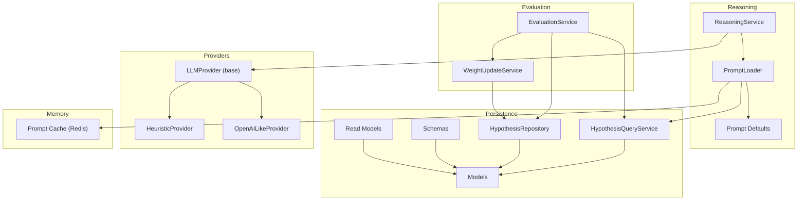
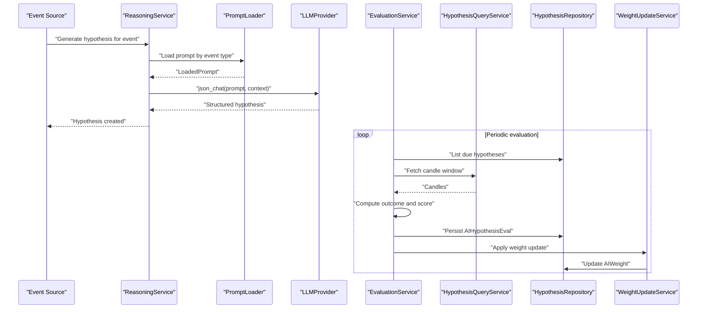
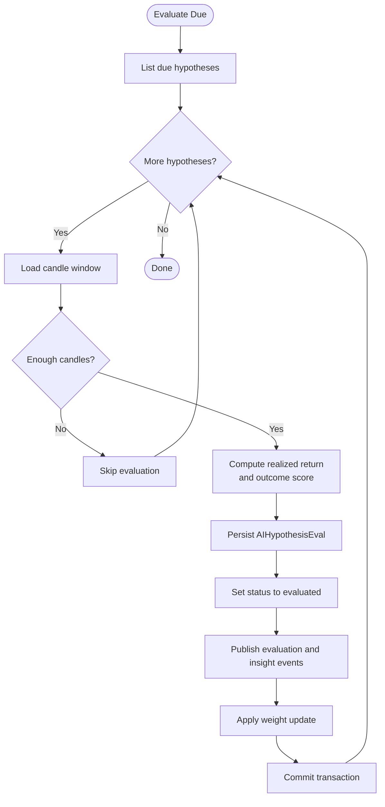
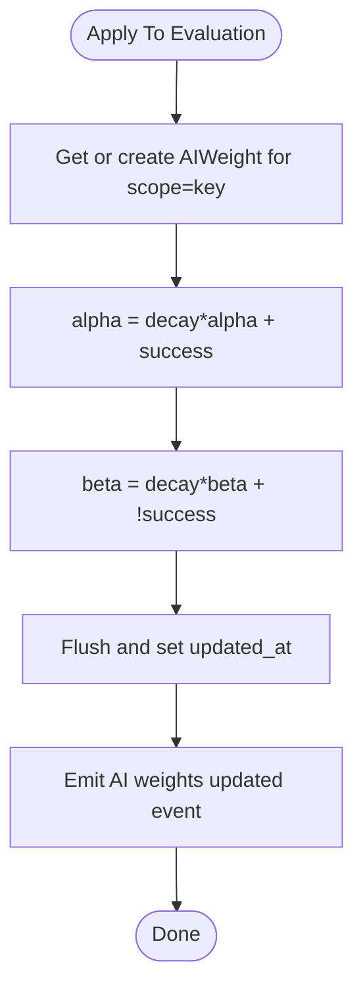
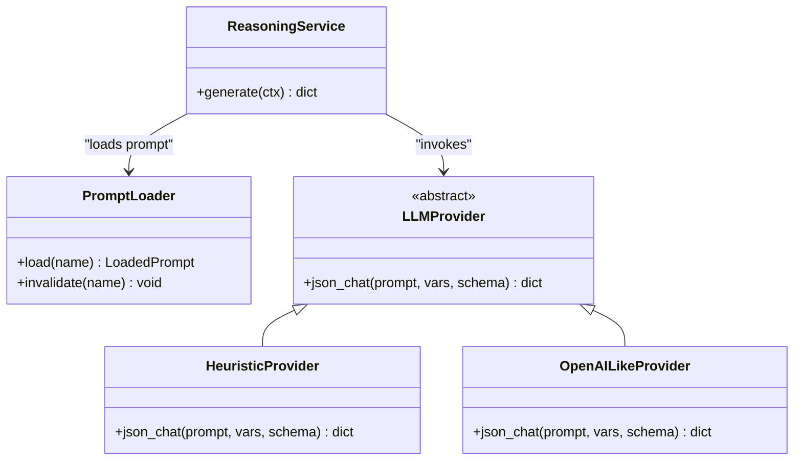
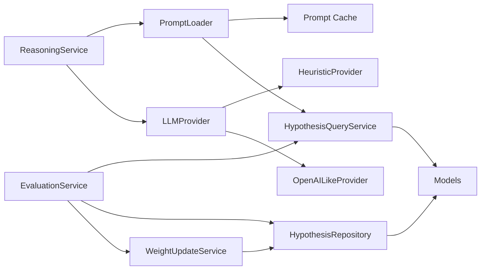

# Evaluation and Reasoning

<cite>
**Referenced Files in This Document**
- [evaluation_service.py](file://src/apps/hypothesis_engine/services/evaluation_service.py)
- [weight_update_service.py](file://src/apps/hypothesis_engine/services/weight_update_service.py)
- [reasoning_service.py](file://src/apps/hypothesis_engine/agents/reasoning_service.py)
- [constants.py](file://src/apps/hypothesis_engine/constants.py)
- [models.py](file://src/apps/hypothesis_engine/models.py)
- [schemas.py](file://src/apps/hypothesis_engine/schemas.py)
- [repositories.py](file://src/apps/hypothesis_engine/repositories.py)
- [query_services.py](file://src/apps/hypothesis_engine/query_services.py)
- [loader.py](file://src/apps/hypothesis_engine/prompts/loader.py)
- [defaults.py](file://src/apps/hypothesis_engine/prompts/defaults.py)
- [base.py](file://src/apps/hypothesis_engine/providers/base.py)
- [heuristic.py](file://src/apps/hypothesis_engine/providers/heuristic.py)
- [openai_like.py](file://src/apps/hypothesis_engine/providers/openai_like.py)
- [cache.py](file://src/apps/hypothesis_engine/memory/cache.py)
- [read_models.py](file://src/apps/hypothesis_engine/read_models.py)
</cite>

## Table of Contents
1. [Introduction](#introduction)
2. [Project Structure](#project-structure)
3. [Core Components](#core-components)
4. [Architecture Overview](#architecture-overview)
5. [Detailed Component Analysis](#detailed-component-analysis)
6. [Dependency Analysis](#dependency-analysis)
7. [Performance Considerations](#performance-considerations)
8. [Troubleshooting Guide](#troubleshooting-guide)
9. [Conclusion](#conclusion)

## Introduction
This document explains the hypothesis evaluation and reasoning services that power testable market hypotheses. It covers:
- Evaluation algorithms for hypothesis validity and confidence scoring
- Performance metrics and thresholds
- Reasoning service capabilities for hypothesis generation, cross-referencing with market data, and logical consistency checks
- Weight update mechanisms for adjusting hypothesis importance based on validation outcomes
- Evaluation workflows, inference patterns, and integration with external analytical systems
- Optimization strategies for batch processing and evaluation throughput

## Project Structure
The hypothesis engine resides under src/apps/hypothesis_engine and is composed of:
- Agents: reasoning service for generating hypotheses
- Services: evaluation and weight update services
- Providers: LLM providers (heuristic and OpenAI-like)
- Prompts: loader and defaults for dynamic prompt selection
- Persistence: models, repositories, and query services
- Memory: Redis-backed caching for prompts
- Schemas and read models: typed DTOs for API and internal use

**Diagram sources**
- [reasoning_service.py:18-60](file://src/apps/hypothesis_engine/agents/reasoning_service.py#L18-L60)
- [loader.py:38-70](file://src/apps/hypothesis_engine/prompts/loader.py#L38-L70)
- [defaults.py:15-68](file://src/apps/hypothesis_engine/prompts/defaults.py#L15-L68)
- [evaluation_service.py:39-140](file://src/apps/hypothesis_engine/services/evaluation_service.py#L39-L140)
- [weight_update_service.py:21-67](file://src/apps/hypothesis_engine/services/weight_update_service.py#L21-L67)
- [repositories.py:15-124](file://src/apps/hypothesis_engine/repositories.py#L15-L124)
- [query_services.py:24-147](file://src/apps/hypothesis_engine/query_services.py#L24-L147)
- [models.py:37-115](file://src/apps/hypothesis_engine/models.py#L37-L115)
- [schemas.py:9-84](file://src/apps/hypothesis_engine/schemas.py#L9-L84)
- [read_models.py:10-112](file://src/apps/hypothesis_engine/read_models.py#L10-L112)
- [cache.py:12-59](file://src/apps/hypothesis_engine/memory/cache.py#L12-L59)
- [base.py:7-16](file://src/apps/hypothesis_engine/providers/base.py#L7-L16)
- [heuristic.py:27-66](file://src/apps/hypothesis_engine/providers/heuristic.py#L27-L66)
- [openai_like.py:25-65](file://src/apps/hypothesis_engine/providers/openai_like.py#L25-L65)

**Section sources**
- [constants.py:1-50](file://src/apps/hypothesis_engine/constants.py#L1-L50)
- [models.py:37-115](file://src/apps/hypothesis_engine/models.py#L37-L115)
- [schemas.py:9-84](file://src/apps/hypothesis_engine/schemas.py#L9-L84)
- [read_models.py:10-112](file://src/apps/hypothesis_engine/read_models.py#L10-L112)

## Core Components
- EvaluationService: evaluates hypotheses by computing realized returns over candle windows and emits evaluation and insight events; applies weight updates via WeightUpdateService.
- WeightUpdateService: maintains Bayesian weights per hypothesis type and updates them based on evaluation outcomes.
- ReasoningService: generates hypotheses from event contexts using prompts and providers, with fallback to heuristic provider.
- PromptLoader: loads active prompts from cache or database, with fallback to defaults.
- Providers: HeuristicProvider and OpenAILikeProvider implement LLMProvider interface for JSON outputs conforming to a fixed schema.
- Persistence: Models define ORM entities; Repositories and QueryServices encapsulate reads/writes; Read Models and Schemas provide typed interfaces.

**Section sources**
- [evaluation_service.py:39-140](file://src/apps/hypothesis_engine/services/evaluation_service.py#L39-L140)
- [weight_update_service.py:21-67](file://src/apps/hypothesis_engine/services/weight_update_service.py#L21-L67)
- [reasoning_service.py:18-60](file://src/apps/hypothesis_engine/agents/reasoning_service.py#L18-L60)
- [loader.py:38-70](file://src/apps/hypothesis_engine/prompts/loader.py#L38-L70)
- [base.py:7-16](file://src/apps/hypothesis_engine/providers/base.py#L7-L16)
- [heuristic.py:27-66](file://src/apps/hypothesis_engine/providers/heuristic.py#L27-L66)
- [openai_like.py:25-65](file://src/apps/hypothesis_engine/providers/openai_like.py#L25-L65)
- [models.py:37-115](file://src/apps/hypothesis_engine/models.py#L37-L115)
- [repositories.py:15-124](file://src/apps/hypothesis_engine/repositories.py#L15-L124)
- [query_services.py:24-147](file://src/apps/hypothesis_engine/query_services.py#L24-L147)
- [schemas.py:9-84](file://src/apps/hypothesis_engine/schemas.py#L9-L84)
- [read_models.py:10-112](file://src/apps/hypothesis_engine/read_models.py#L10-L112)

## Architecture Overview
The system orchestrates event-driven hypothesis generation and evaluation:
- ReasoningService selects a prompt based on event type and merges context to produce a structured hypothesis.
- EvaluationService periodically fetches due hypotheses, computes realized returns from market candles, and writes evaluations.
- WeightUpdateService updates Bayesian weights per hypothesis type to reflect recent validation outcomes.
- Events are published for downstream consumers (e.g., insights, SSE streams).

**Diagram sources**
- [reasoning_service.py:23-60](file://src/apps/hypothesis_engine/agents/reasoning_service.py#L23-L60)
- [loader.py:46-70](file://src/apps/hypothesis_engine/prompts/loader.py#L46-L70)
- [heuristic.py:30-66](file://src/apps/hypothesis_engine/providers/heuristic.py#L30-L66)
- [openai_like.py:41-65](file://src/apps/hypothesis_engine/providers/openai_like.py#L41-L65)
- [evaluation_service.py:46-140](file://src/apps/hypothesis_engine/services/evaluation_service.py#L46-L140)
- [query_services.py:113-143](file://src/apps/hypothesis_engine/query_services.py#L113-L143)
- [repositories.py:59-117](file://src/apps/hypothesis_engine/repositories.py#L59-L117)
- [weight_update_service.py:35-67](file://src/apps/hypothesis_engine/services/weight_update_service.py#L35-L67)

## Detailed Component Analysis

### EvaluationService
Responsibilities:
- Batch-evaluates hypotheses due for update within a time window.
- Computes validity and score from realized returns versus target move and direction.
- Persists evaluation records and publishes events for downstream processing.
- Triggers weight updates per hypothesis type.

Key algorithms:
- Outcome computation considers direction (up/down/neutral), realized return, and target_move threshold. Scores are normalized to [0, 1].
- Candle window retrieval ensures at least two bars are available before evaluation.

**Diagram sources**
- [evaluation_service.py:46-140](file://src/apps/hypothesis_engine/services/evaluation_service.py#L46-L140)
- [query_services.py:113-143](file://src/apps/hypothesis_engine/query_services.py#L113-L143)
- [repositories.py:59-88](file://src/apps/hypothesis_engine/repositories.py#L59-L88)
- [weight_update_service.py:35-67](file://src/apps/hypothesis_engine/services/weight_update_service.py#L35-L67)

Evaluation criteria and scoring:
- Direction-aware thresholding: progress toward target_move determines success; scores are normalized.
- Details include entry/exit prices, realized return, bars used, and window timestamps.

Threshold configurations:
- Default target_move and horizon_min are defined in constants.
- Confidence bounds are enforced during generation.

**Section sources**
- [evaluation_service.py:27-37](file://src/apps/hypothesis_engine/services/evaluation_service.py#L27-L37)
- [evaluation_service.py:106-140](file://src/apps/hypothesis_engine/services/evaluation_service.py#L106-L140)
- [constants.py:28-29](file://src/apps/hypothesis_engine/constants.py#L28-L29)

### WeightUpdateService
Responsibilities:
- Maintains Bayesian weights (alpha, beta) per hypothesis type scope.
- Applies decay factor and updates posteriors upon evaluation outcomes.
- Emits weight update events for downstream consumption.

Bayesian update mechanism:
- On success: alpha increases; beta remains unchanged (scaled by decay).
- On failure: beta increases; alpha remains unchanged (scaled by decay).
- Posterior mean computed as alpha/(alpha+beta).

**Diagram sources**
- [weight_update_service.py:35-67](file://src/apps/hypothesis_engine/services/weight_update_service.py#L35-L67)
- [constants.py:24-26](file://src/apps/hypothesis_engine/constants.py#L24-L26)

**Section sources**
- [weight_update_service.py:16-18](file://src/apps/hypothesis_engine/services/weight_update_service.py#L16-L18)
- [weight_update_service.py:35-67](file://src/apps/hypothesis_engine/services/weight_update_service.py#L35-L67)
- [constants.py:24-26](file://src/apps/hypothesis_engine/constants.py#L24-L26)

### ReasoningService
Responsibilities:
- Selects prompt by event type or falls back to default.
- Loads prompt via PromptLoader (cache/db/fallback).
- Chooses provider (LLM or heuristic) and enforces output schema.
- Normalizes and validates outputs (type, confidence, horizon_min, direction, target_move, assets).

**Diagram sources**
- [reasoning_service.py:18-60](file://src/apps/hypothesis_engine/agents/reasoning_service.py#L18-L60)
- [loader.py:38-70](file://src/apps/hypothesis_engine/prompts/loader.py#L38-L70)
- [base.py:7-16](file://src/apps/hypothesis_engine/providers/base.py#L7-L16)
- [heuristic.py:27-66](file://src/apps/hypothesis_engine/providers/heuristic.py#L27-L66)
- [openai_like.py:25-65](file://src/apps/hypothesis_engine/providers/openai_like.py#L25-L65)

**Section sources**
- [reasoning_service.py:23-60](file://src/apps/hypothesis_engine/agents/reasoning_service.py#L23-L60)
- [loader.py:46-70](file://src/apps/hypothesis_engine/prompts/loader.py#L46-L70)
- [defaults.py:15-29](file://src/apps/hypothesis_engine/prompts/defaults.py#L15-L29)
- [constants.py:42-49](file://src/apps/hypothesis_engine/constants.py#L42-L49)

### Prompt System and Schema
- PromptLoader caches active prompts in Redis with TTL and invalidation support.
- Defaults define a canonical output schema and fallback prompts for event types.
- Output schema enforces required fields for hypothesis generation.

**Section sources**
- [loader.py:27-70](file://src/apps/hypothesis_engine/prompts/loader.py#L27-L70)
- [cache.py:25-59](file://src/apps/hypothesis_engine/memory/cache.py#L25-L59)
- [defaults.py:15-68](file://src/apps/hypothesis_engine/prompts/defaults.py#L15-L68)
- [schemas.py:71-84](file://src/apps/hypothesis_engine/schemas.py#L71-L84)

### Persistence Layer
- Models define ORM entities for hypotheses, evaluations, weights, and prompts.
- Repositories encapsulate write operations and row-level locking for weights.
- QueryServices expose read-only operations and candle window queries.
- Read Models and Schemas provide typed interfaces for API and internal processing.

**Section sources**
- [models.py:37-115](file://src/apps/hypothesis_engine/models.py#L37-L115)
- [repositories.py:59-117](file://src/apps/hypothesis_engine/repositories.py#L59-L117)
- [query_services.py:113-143](file://src/apps/hypothesis_engine/query_services.py#L113-L143)
- [read_models.py:67-112](file://src/apps/hypothesis_engine/read_models.py#L67-L112)
- [schemas.py:9-84](file://src/apps/hypothesis_engine/schemas.py#L9-L84)

## Dependency Analysis
- ReasoningService depends on PromptLoader and provider implementations.
- EvaluationService depends on QueryService for candle data and Repository for persistence; integrates WeightUpdateService.
- WeightUpdateService depends on Repository for scoped weight access and updates.
- PromptLoader depends on Redis cache and QueryService; falls back to defaults.
- Providers implement a shared interface and differ in output generation strategy.

**Diagram sources**
- [reasoning_service.py:18-60](file://src/apps/hypothesis_engine/agents/reasoning_service.py#L18-L60)
- [loader.py:38-70](file://src/apps/hypothesis_engine/prompts/loader.py#L38-L70)
- [evaluation_service.py:39-140](file://src/apps/hypothesis_engine/services/evaluation_service.py#L39-L140)
- [weight_update_service.py:21-67](file://src/apps/hypothesis_engine/services/weight_update_service.py#L21-L67)
- [repositories.py:15-124](file://src/apps/hypothesis_engine/repositories.py#L15-L124)
- [query_services.py:24-147](file://src/apps/hypothesis_engine/query_services.py#L24-L147)
- [cache.py:12-59](file://src/apps/hypothesis_engine/memory/cache.py#L12-L59)
- [base.py:7-16](file://src/apps/hypothesis_engine/providers/base.py#L7-L16)
- [heuristic.py:27-66](file://src/apps/hypothesis_engine/providers/heuristic.py#L27-L66)
- [openai_like.py:25-65](file://src/apps/hypothesis_engine/providers/openai_like.py#L25-L65)

**Section sources**
- [constants.py:1-50](file://src/apps/hypothesis_engine/constants.py#L1-L50)
- [models.py:37-115](file://src/apps/hypothesis_engine/models.py#L37-L115)
- [schemas.py:9-84](file://src/apps/hypothesis_engine/schemas.py#L9-L84)
- [read_models.py:10-112](file://src/apps/hypothesis_engine/read_models.py#L10-L112)

## Performance Considerations
- Batch evaluation: EvaluationService retrieves up to a fixed limit of due hypotheses per run to bound workload.
- Candle window fetching: Queries only required timestamps and closes to minimize payload size.
- Prompt caching: Active prompts are cached in Redis with TTL to reduce database round-trips.
- Weight updates: Row-level locking ensures atomic updates; batching reduces contention.
- Provider timeouts: OpenAI-like provider sets explicit timeouts to avoid long hangs.
- Concurrency: Services operate asynchronously; ensure adequate connection pooling for database and Redis.

[No sources needed since this section provides general guidance]

## Troubleshooting Guide
Common issues and remedies:
- No candles available for evaluation window: EvaluationService skips hypotheses with fewer than two candles; ensure market data availability and correct timeframes.
- Missing trigger timestamp in hypothesis context: EvaluationService ignores hypotheses without a valid trigger timestamp.
- Provider failures: ReasoningService falls back to heuristic provider when LLM calls fail; verify provider configuration and network connectivity.
- Prompt cache misses: PromptLoader falls back to defaults; invalidate cache and confirm active prompt existence.
- Weight update not emitted: WeightUpdateService requires a valid evaluation and hypothesis; check evaluation persistence and scope/key correctness.

**Section sources**
- [evaluation_service.py:106-140](file://src/apps/hypothesis_engine/services/evaluation_service.py#L106-L140)
- [reasoning_service.py:34-41](file://src/apps/hypothesis_engine/agents/reasoning_service.py#L34-L41)
- [loader.py:46-70](file://src/apps/hypothesis_engine/prompts/loader.py#L46-L70)
- [weight_update_service.py:35-67](file://src/apps/hypothesis_engine/services/weight_update_service.py#L35-L67)

## Conclusion
The hypothesis evaluation and reasoning subsystem combines structured generation, robust evaluation, and adaptive weighting to maintain a dynamic, evidence-driven set of market hypotheses. By leveraging prompt caching, provider fallbacks, and Bayesian weight updates, the system balances accuracy and resilience while enabling scalable batch processing and real-time event-driven workflows.