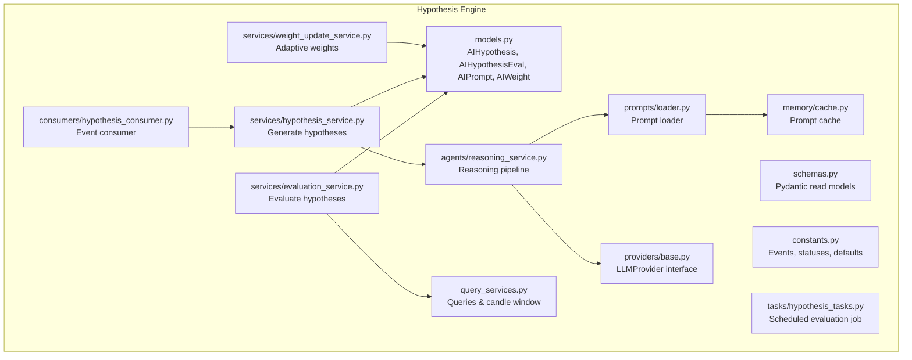
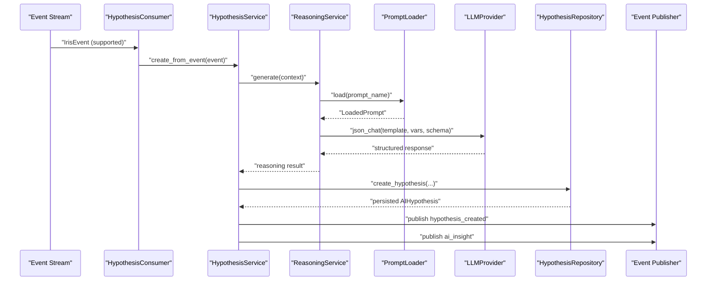
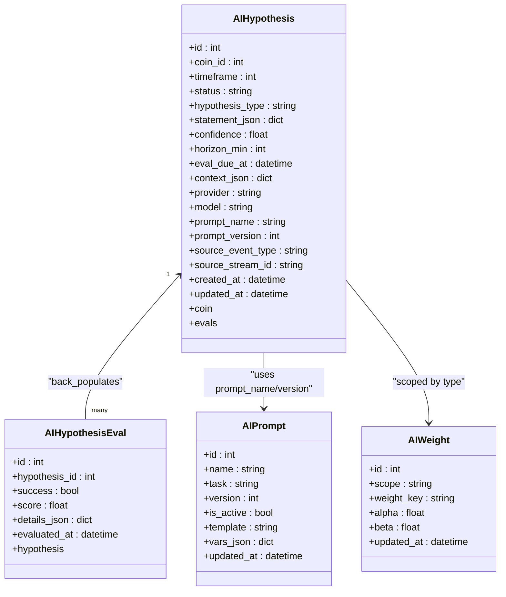
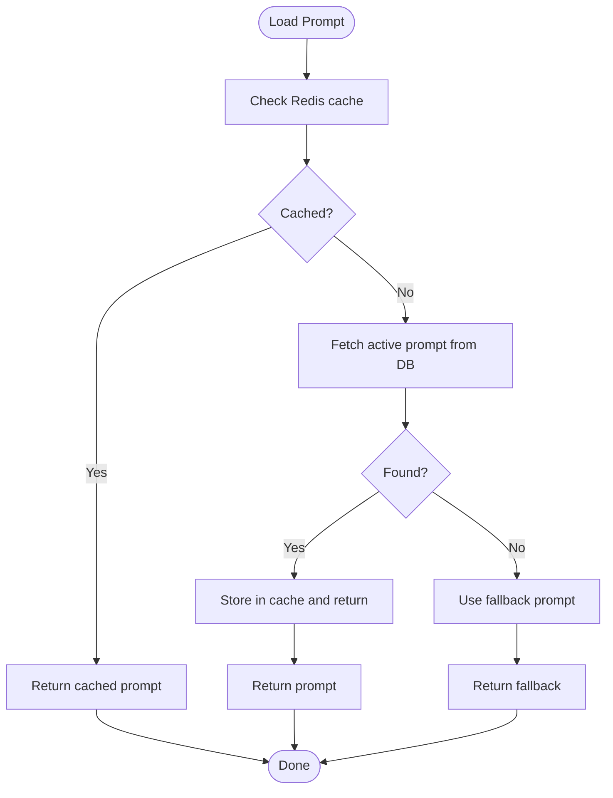
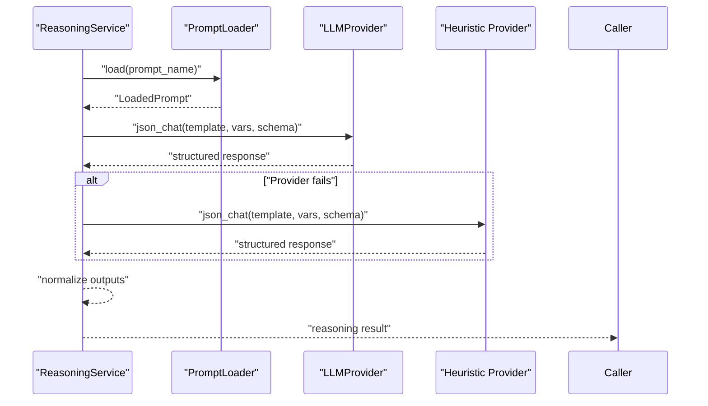
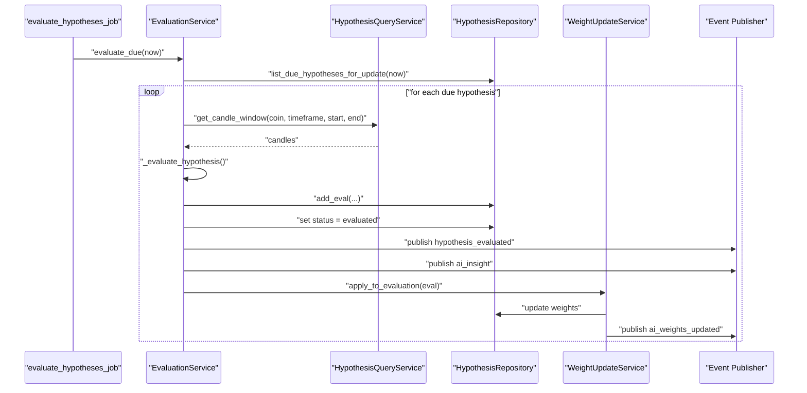
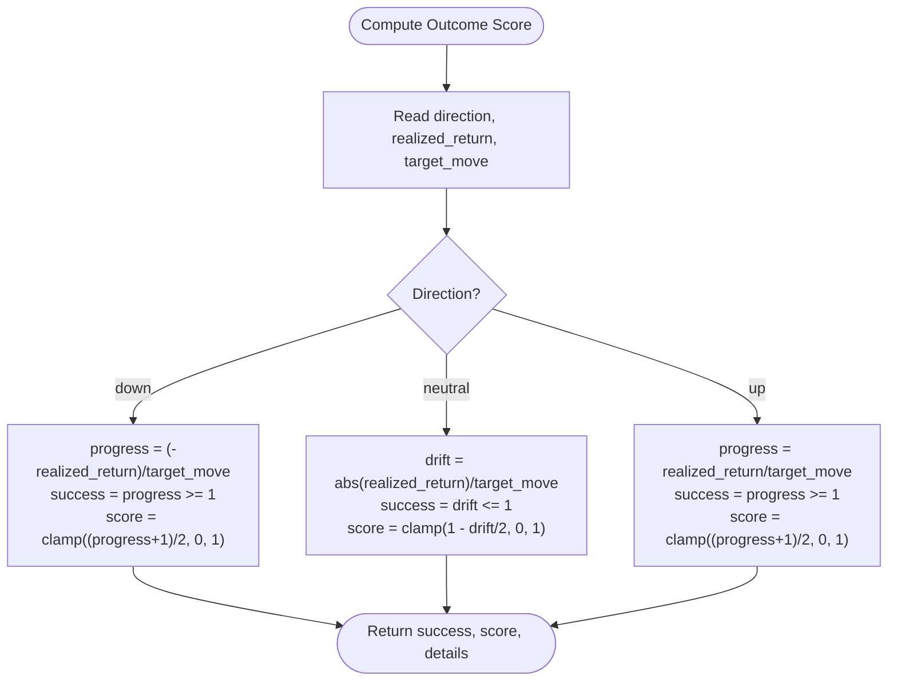
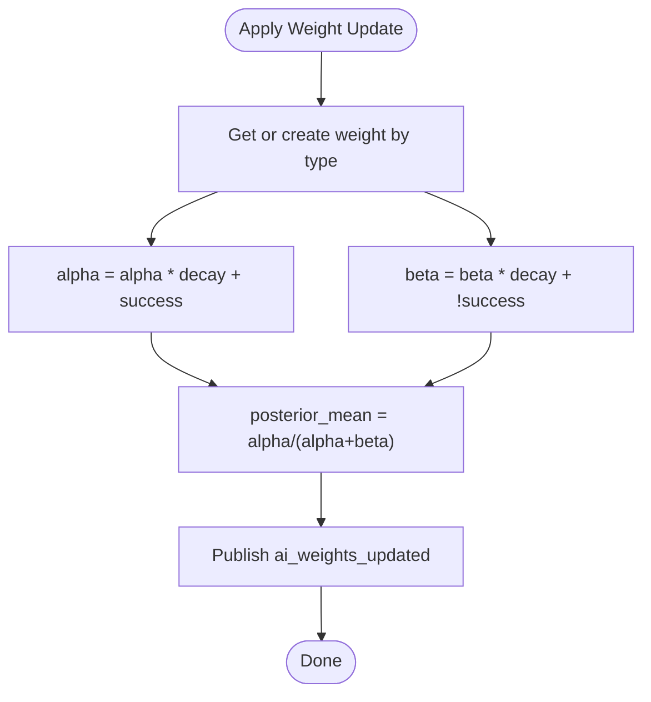
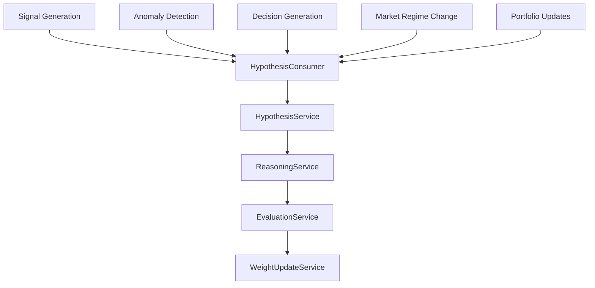
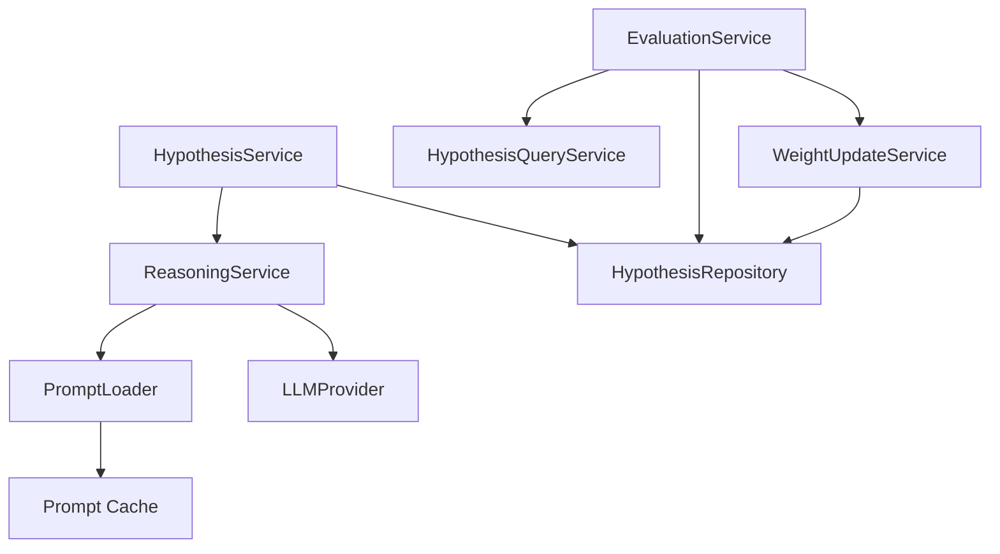

# Hypothesis Engine Overview

<cite>
**Referenced Files in This Document**
- [models.py](file://src/apps/hypothesis_engine/models.py)
- [schemas.py](file://src/apps/hypothesis_engine/schemas.py)
- [constants.py](file://src/apps/hypothesis_engine/constants.py)
- [query_services.py](file://src/apps/hypothesis_engine/query_services.py)
- [memory/cache.py](file://src/apps/hypothesis_engine/memory/cache.py)
- [prompts/loader.py](file://src/apps/hypothesis_engine/prompts/loader.py)
- [providers/base.py](file://src/apps/hypothesis_engine/providers/base.py)
- [agents/reasoning_service.py](file://src/apps/hypothesis_engine/agents/reasoning_service.py)
- [services/hypothesis_service.py](file://src/apps/hypothesis_engine/services/hypothesis_service.py)
- [services/evaluation_service.py](file://src/apps/hypothesis_engine/services/evaluation_service.py)
- [services/weight_update_service.py](file://src/apps/hypothesis_engine/services/weight_update_service.py)
- [consumers/hypothesis_consumer.py](file://src/apps/hypothesis_engine/consumers/hypothesis_consumer.py)
- [tasks/hypothesis_tasks.py](file://src/apps/hypothesis_engine/tasks/hypothesis_tasks.py)
</cite>

## Table of Contents
1. [Introduction](#introduction)
2. [Project Structure](#project-structure)
3. [Core Components](#core-components)
4. [Architecture Overview](#architecture-overview)
5. [Detailed Component Analysis](#detailed-component-analysis)
6. [Dependency Analysis](#dependency-analysis)
7. [Performance Considerations](#performance-considerations)
8. [Troubleshooting Guide](#troubleshooting-guide)
9. [Conclusion](#conclusion)
10. [Appendices](#appendices)

## Introduction
The hypothesis engine generates AI-powered market hypotheses triggered by real-time events from the broader system (signals, anomalies, decisions, market regime changes, and portfolio updates). It encapsulates a structured lifecycle from generation to evaluation and weight update, integrating with pattern recognition, anomaly detection, and signal generation systems. The system emphasizes confidence scoring, horizon-based evaluation windows, and adaptive weighting to refine future hypothesis quality.

## Project Structure
The hypothesis engine is organized around domain models, services, providers, prompts, and runtime integration points:
- Domain models define persistent entities and relationships.
- Services orchestrate generation, evaluation, and weight updates.
- Providers abstract LLM interfaces.
- Prompts manage templated reasoning with caching and fallbacks.
- Consumers and tasks integrate with the event stream and scheduling.

**Diagram sources**
- [models.py:15-115](file://src/apps/hypothesis_engine/models.py#L15-L115)
- [schemas.py:9-84](file://src/apps/hypothesis_engine/schemas.py#L9-L84)
- [constants.py:1-50](file://src/apps/hypothesis_engine/constants.py#L1-L50)
- [query_services.py:24-147](file://src/apps/hypothesis_engine/query_services.py#L24-L147)
- [memory/cache.py:25-59](file://src/apps/hypothesis_engine/memory/cache.py#L25-L59)
- [prompts/loader.py:38-70](file://src/apps/hypothesis_engine/prompts/loader.py#L38-L70)
- [providers/base.py:7-16](file://src/apps/hypothesis_engine/providers/base.py#L7-L16)
- [agents/reasoning_service.py:18-60](file://src/apps/hypothesis_engine/agents/reasoning_service.py#L18-L60)
- [services/hypothesis_service.py:21-106](file://src/apps/hypothesis_engine/services/hypothesis_service.py#L21-L106)
- [services/evaluation_service.py:39-140](file://src/apps/hypothesis_engine/services/evaluation_service.py#L39-L140)
- [services/weight_update_service.py:21-67](file://src/apps/hypothesis_engine/services/weight_update_service.py#L21-L67)
- [consumers/hypothesis_consumer.py:10-19](file://src/apps/hypothesis_engine/consumers/hypothesis_consumer.py#L10-L19)
- [tasks/hypothesis_tasks.py:12-23](file://src/apps/hypothesis_engine/tasks/hypothesis_tasks.py#L12-L23)

**Section sources**
- [models.py:15-115](file://src/apps/hypothesis_engine/models.py#L15-L115)
- [schemas.py:9-84](file://src/apps/hypothesis_engine/schemas.py#L9-L84)
- [constants.py:1-50](file://src/apps/hypothesis_engine/constants.py#L1-L50)
- [query_services.py:24-147](file://src/apps/hypothesis_engine/query_services.py#L24-L147)
- [memory/cache.py:25-59](file://src/apps/hypothesis_engine/memory/cache.py#L25-L59)
- [prompts/loader.py:38-70](file://src/apps/hypothesis_engine/prompts/loader.py#L38-L70)
- [providers/base.py:7-16](file://src/apps/hypothesis_engine/providers/base.py#L7-L16)
- [agents/reasoning_service.py:18-60](file://src/apps/hypothesis_engine/agents/reasoning_service.py#L18-L60)
- [services/hypothesis_service.py:21-106](file://src/apps/hypothesis_engine/services/hypothesis_service.py#L21-L106)
- [services/evaluation_service.py:39-140](file://src/apps/hypothesis_engine/services/evaluation_service.py#L39-L140)
- [services/weight_update_service.py:21-67](file://src/apps/hypothesis_engine/services/weight_update_service.py#L21-L67)
- [consumers/hypothesis_consumer.py:10-19](file://src/apps/hypothesis_engine/consumers/hypothesis_consumer.py#L10-L19)
- [tasks/hypothesis_tasks.py:12-23](file://src/apps/hypothesis_engine/tasks/hypothesis_tasks.py#L12-L23)

## Core Components
- AIHypothesis: Captures a market hypothesis with type, statement, confidence, horizon, evaluation due date, context, provider/model, and source event metadata. It relates to evaluations via a one-to-many association.
- AIHypothesisEval: Stores evaluation outcomes (success, score, details) per hypothesis, with a unique constraint ensuring one evaluation per hypothesis.
- AIPrompt: Defines reusable prompt templates for reasoning, including task, versioning, activation, and variable configuration.
- AIWeight: Maintains Bayesian weights (alpha, beta) per hypothesis type for adaptive scoring and decays over time.

Key relationships:
- AIHypothesis has a foreign key to coins and maintains a relationship to AIHypothesisEval.
- AIHypothesisEval belongs to AIHypothesis.
- AIWeight is scoped by key (hypothesis type) and supports posterior mean computation.

**Section sources**
- [models.py:37-93](file://src/apps/hypothesis_engine/models.py#L37-L93)
- [schemas.py:37-84](file://src/apps/hypothesis_engine/schemas.py#L37-L84)

## Architecture Overview
The system integrates event-driven triggers, AI reasoning, evaluation, and adaptive weighting:
- Event Consumer receives supported events and delegates creation to HypothesisService.
- ReasoningService loads a prompt, selects a provider, and generates a structured hypothesis response.
- HypothesisService persists the hypothesis and emits insights and creation events.
- Scheduled EvaluationService evaluates due hypotheses against realized returns and emits evaluation events.
- WeightUpdateService updates Bayesian weights per hypothesis type and emits weight change events.

**Diagram sources**
- [consumers/hypothesis_consumer.py:14-19](file://src/apps/hypothesis_engine/consumers/hypothesis_consumer.py#L14-L19)
- [services/hypothesis_service.py:28-106](file://src/apps/hypothesis_engine/services/hypothesis_service.py#L28-L106)
- [agents/reasoning_service.py:23-60](file://src/apps/hypothesis_engine/agents/reasoning_service.py#L23-L60)
- [prompts/loader.py:46-67](file://src/apps/hypothesis_engine/prompts/loader.py#L46-L67)
- [providers/base.py:13-15](file://src/apps/hypothesis_engine/providers/base.py#L13-L15)

## Detailed Component Analysis

### Entities and Data Model

**Diagram sources**
- [models.py:15-115](file://src/apps/hypothesis_engine/models.py#L15-L115)

**Section sources**
- [models.py:15-115](file://src/apps/hypothesis_engine/models.py#L15-L115)
- [schemas.py:9-84](file://src/apps/hypothesis_engine/schemas.py#L9-L84)

### Prompt Management and Caching
- PromptLoader resolves the active prompt by name, using Redis cache, database, or fallback.
- Memory cache stores active prompt payloads with TTL and version increment on invalidation.
- Prompt variables configure provider selection and model parameters.

**Diagram sources**
- [prompts/loader.py:46-67](file://src/apps/hypothesis_engine/prompts/loader.py#L46-L67)
- [memory/cache.py:25-59](file://src/apps/hypothesis_engine/memory/cache.py#L25-L59)

**Section sources**
- [prompts/loader.py:38-70](file://src/apps/hypothesis_engine/prompts/loader.py#L38-L70)
- [memory/cache.py:25-59](file://src/apps/hypothesis_engine/memory/cache.py#L25-L59)
- [constants.py:11-16](file://src/apps/hypothesis_engine/constants.py#L11-L16)

### Reasoning Pipeline
- ReasoningService selects a prompt based on event type, merges context variables, and invokes a provider.
- It falls back to a heuristic provider if the primary provider fails.
- Normalizes outputs to enforce bounds for confidence, horizon, direction, and target move.

**Diagram sources**
- [agents/reasoning_service.py:23-60](file://src/apps/hypothesis_engine/agents/reasoning_service.py#L23-L60)
- [prompts/loader.py:46-67](file://src/apps/hypothesis_engine/prompts/loader.py#L46-L67)
- [providers/base.py:13-15](file://src/apps/hypothesis_engine/providers/base.py#L13-L15)

**Section sources**
- [agents/reasoning_service.py:18-60](file://src/apps/hypothesis_engine/agents/reasoning_service.py#L18-L60)
- [providers/base.py:7-16](file://src/apps/hypothesis_engine/providers/base.py#L7-L16)

### Hypothesis Lifecycle: Generation to Evaluation
- Generation: HypothesisService validates supported events, builds context, calls ReasoningService, persists AIHypothesis, and publishes creation and insight events.
- Evaluation: EvaluationService identifies due hypotheses, computes realized returns over the evaluation window, scores outcomes, persists AIHypothesisEval, updates status, and publishes evaluation and insight events.
- Weighting: WeightUpdateService applies Bayesian updates per hypothesis type and emits weight change events.

**Diagram sources**
- [tasks/hypothesis_tasks.py:12-23](file://src/apps/hypothesis_engine/tasks/hypothesis_tasks.py#L12-L23)
- [services/evaluation_service.py:46-140](file://src/apps/hypothesis_engine/services/evaluation_service.py#L46-L140)
- [query_services.py:113-143](file://src/apps/hypothesis_engine/query_services.py#L113-L143)
- [services/weight_update_service.py:35-67](file://src/apps/hypothesis_engine/services/weight_update_service.py#L35-L67)

**Section sources**
- [services/hypothesis_service.py:28-106](file://src/apps/hypothesis_engine/services/hypothesis_service.py#L28-L106)
- [services/evaluation_service.py:39-140](file://src/apps/hypothesis_engine/services/evaluation_service.py#L39-L140)
- [services/weight_update_service.py:21-67](file://src/apps/hypothesis_engine/services/weight_update_service.py#L21-L67)

### Confidence Scoring Mechanism
- Outcome scoring considers realized return versus target move and direction:
  - Down: success if negative return meets or exceeds target move; score normalized.
  - Neutral: success if absolute return is within target move; score normalized.
  - Up: success if positive return meets or exceeds target move; score normalized.
- The scoring function ensures bounded outputs between 0 and 1.

**Diagram sources**
- [services/evaluation_service.py:27-37](file://src/apps/hypothesis_engine/services/evaluation_service.py#L27-L37)

**Section sources**
- [services/evaluation_service.py:27-37](file://src/apps/hypothesis_engine/services/evaluation_service.py#L27-L37)

### Weight Management
- Weights are maintained per hypothesis type with alpha and beta parameters.
- After each evaluation, alpha/beta are updated using exponential decay and binary outcome.
- Posterior mean is computed as alpha / (alpha + beta) and emitted with weight update events.

**Diagram sources**
- [services/weight_update_service.py:35-67](file://src/apps/hypothesis_engine/services/weight_update_service.py#L35-L67)
- [constants.py:24-27](file://src/apps/hypothesis_engine/constants.py#L24-L27)

**Section sources**
- [services/weight_update_service.py:21-67](file://src/apps/hypothesis_engine/services/weight_update_service.py#L21-L67)
- [constants.py:24-27](file://src/apps/hypothesis_engine/constants.py#L24-L27)

### Integration with Other Systems
- Supported source events include signal creation, anomaly detection, decision generation, market regime changes, and portfolio updates.
- Hypotheses emit creation and insight events; evaluations emit evaluation and insight events; weights emit weight updates.
- The system interacts with pattern recognition, anomaly detection, and signal generation via event-driven triggers.

**Diagram sources**
- [constants.py:31-50](file://src/apps/hypothesis_engine/constants.py#L31-L50)
- [consumers/hypothesis_consumer.py:14-19](file://src/apps/hypothesis_engine/consumers/hypothesis_consumer.py#L14-L19)
- [services/hypothesis_service.py:28-106](file://src/apps/hypothesis_engine/services/hypothesis_service.py#L28-L106)
- [services/evaluation_service.py:46-140](file://src/apps/hypothesis_engine/services/evaluation_service.py#L46-L140)
- [services/weight_update_service.py:35-67](file://src/apps/hypothesis_engine/services/weight_update_service.py#L35-L67)

**Section sources**
- [constants.py:31-50](file://src/apps/hypothesis_engine/constants.py#L31-L50)
- [consumers/hypothesis_consumer.py:10-19](file://src/apps/hypothesis_engine/consumers/hypothesis_consumer.py#L10-L19)
- [services/hypothesis_service.py:21-106](file://src/apps/hypothesis_engine/services/hypothesis_service.py#L21-L106)
- [services/evaluation_service.py:39-140](file://src/apps/hypothesis_engine/services/evaluation_service.py#L39-L140)
- [services/weight_update_service.py:21-67](file://src/apps/hypothesis_engine/services/weight_update_service.py#L21-L67)

## Dependency Analysis
- Cohesion: Services encapsulate cohesive workflows (generation, evaluation, weighting).
- Coupling: Services depend on repositories and query services; reasoning depends on prompt loader and providers.
- External integrations: Redis cache for prompt storage, event publishing for SSE distribution, scheduled tasks for periodic evaluation.

**Diagram sources**
- [services/hypothesis_service.py:22-26](file://src/apps/hypothesis_engine/services/hypothesis_service.py#L22-L26)
- [agents/reasoning_service.py:23-40](file://src/apps/hypothesis_engine/agents/reasoning_service.py#L23-L40)
- [prompts/loader.py:46-67](file://src/apps/hypothesis_engine/prompts/loader.py#L46-L67)
- [memory/cache.py:25-59](file://src/apps/hypothesis_engine/memory/cache.py#L25-L59)
- [services/evaluation_service.py:40-44](file://src/apps/hypothesis_engine/services/evaluation_service.py#L40-L44)
- [query_services.py:24-58](file://src/apps/hypothesis_engine/query_services.py#L24-L58)
- [services/weight_update_service.py:22-24](file://src/apps/hypothesis_engine/services/weight_update_service.py#L22-L24)

**Section sources**
- [services/hypothesis_service.py:22-26](file://src/apps/hypothesis_engine/services/hypothesis_service.py#L22-L26)
- [agents/reasoning_service.py:23-40](file://src/apps/hypothesis_engine/agents/reasoning_service.py#L23-L40)
- [prompts/loader.py:46-67](file://src/apps/hypothesis_engine/prompts/loader.py#L46-L67)
- [memory/cache.py:25-59](file://src/apps/hypothesis_engine/memory/cache.py#L25-L59)
- [services/evaluation_service.py:40-44](file://src/apps/hypothesis_engine/services/evaluation_service.py#L40-L44)
- [query_services.py:24-58](file://src/apps/hypothesis_engine/query_services.py#L24-L58)
- [services/weight_update_service.py:22-24](file://src/apps/hypothesis_engine/services/weight_update_service.py#L22-L24)

## Performance Considerations
- Prompt caching reduces latency and DB load; cache TTL balances freshness and performance.
- Evaluation batch size limits concurrent processing; scheduled jobs use distributed locking to prevent overlap.
- Candle window queries are constrained by timestamps and timeframe to minimize scan cost.
- Weight updates are flushed and committed efficiently per evaluation.

[No sources needed since this section provides general guidance]

## Troubleshooting Guide
- No hypothesis created: Verify event type is supported and coin context exists; check event consumer routing and unit of work commit.
- Evaluation skipped: Confirm hypotheses are due and candle window contains sufficient bars; inspect evaluation job lock acquisition.
- Weight not updating: Ensure evaluation has persisted and hypothesis type key exists; confirm weight scope and decay constants.
- Prompt errors: Validate prompt availability and provider configuration; check fallback logic and cache invalidation.

**Section sources**
- [consumers/hypothesis_consumer.py:14-19](file://src/apps/hypothesis_engine/consumers/hypothesis_consumer.py#L14-L19)
- [services/hypothesis_service.py:28-34](file://src/apps/hypothesis_engine/services/hypothesis_service.py#L28-L34)
- [services/evaluation_service.py:46-47](file://src/apps/hypothesis_engine/services/evaluation_service.py#L46-L47)
- [services/weight_update_service.py:35-48](file://src/apps/hypothesis_engine/services/weight_update_service.py#L35-L48)
- [prompts/loader.py:64-67](file://src/apps/hypothesis_engine/prompts/loader.py#L64-L67)

## Conclusion
The hypothesis engine provides a robust, event-driven framework for generating, evaluating, and refining AI-powered market hypotheses. Its modular design integrates seamlessly with existing analytical subsystems, enabling adaptive reasoning and continuous improvement through Bayesian weighting. The system’s emphasis on structured outputs, confidence scoring, and prompt caching ensures scalable and reliable operation across diverse market conditions.

[No sources needed since this section summarizes without analyzing specific files]

## Appendices
- Event types and scopes are defined centrally for consistent behavior across services.
- Default parameters (horizon, target move) ensure minimal viable outputs when provider responses are partial.

**Section sources**
- [constants.py:28-30](file://src/apps/hypothesis_engine/constants.py#L28-L30)
- [agents/reasoning_service.py:47-50](file://src/apps/hypothesis_engine/agents/reasoning_service.py#L47-L50)