# Hypothesis Engine

<cite>
**Referenced Files in This Document**
- [models.py](file://src/apps/hypothesis_engine/models.py)
- [constants.py](file://src/apps/hypothesis_engine/constants.py)
- [repositories.py](file://src/apps/hypothesis_engine/repositories.py)
- [query_services.py](file://src/apps/hypothesis_engine/query_services.py)
- [memory/cache.py](file://src/apps/hypothesis_engine/memory/cache.py)
- [prompts/defaults.py](file://src/apps/hypothesis_engine/prompts/defaults.py)
- [prompts/loader.py](file://src/apps/hypothesis_engine/prompts/loader.py)
- [providers/base.py](file://src/apps/hypothesis_engine/providers/base.py)
- [providers/heuristic.py](file://src/apps/hypothesis_engine/providers/heuristic.py)
- [providers/local_http.py](file://src/apps/hypothesis_engine/providers/local_http.py)
- [providers/openai_like.py](file://src/apps/hypothesis_engine/providers/openai_like.py)
- [agents/reasoning_service.py](file://src/apps/hypothesis_engine/agents/reasoning_service.py)
- [services/hypothesis_service.py](file://src/apps/hypothesis_engine/services/hypothesis_service.py)
- [services/evaluation_service.py](file://src/apps/hypothesis_engine/services/evaluation_service.py)
- [services/weight_update_service.py](file://src/apps/hypothesis_engine/services/weight_update_service.py)
- [tasks/hypothesis_tasks.py](file://src/apps/hypothesis_engine/tasks/hypothesis_tasks.py)
- [consumers/hypothesis_consumer.py](file://src/apps/hypothesis_engine/consumers/hypothesis_consumer.py)
- [views.py](file://src/apps/hypothesis_engine/views.py)
</cite>

## Table of Contents
1. [Introduction](#introduction)
2. [Project Structure](#project-structure)
3. [Core Components](#core-components)
4. [Architecture Overview](#architecture-overview)
5. [Detailed Component Analysis](#detailed-component-analysis)
6. [Dependency Analysis](#dependency-analysis)
7. [Performance Considerations](#performance-considerations)
8. [Troubleshooting Guide](#troubleshooting-guide)
9. [Conclusion](#conclusion)
10. [Appendices](#appendices)

## Introduction
The AI-powered Hypothesis Engine generates testable market hypotheses triggered by real-time events, evaluates their outcomes, and updates confidence weights using Bayesian posteriors. It integrates multiple reasoning providers (heuristic, local HTTP, OpenAI-like), a robust prompt system with caching, and a durable memory layer for hypotheses, evaluations, and weights. The system publishes structured AI insights and maintains a lifecycle from creation to evaluation and weight updates.

## Project Structure
The hypothesis engine is organized around domain models, repositories, query services, prompt management, provider integrations, reasoning agents, and evaluation/weight services. Supporting components include memory caching, tasks, consumers, and views.

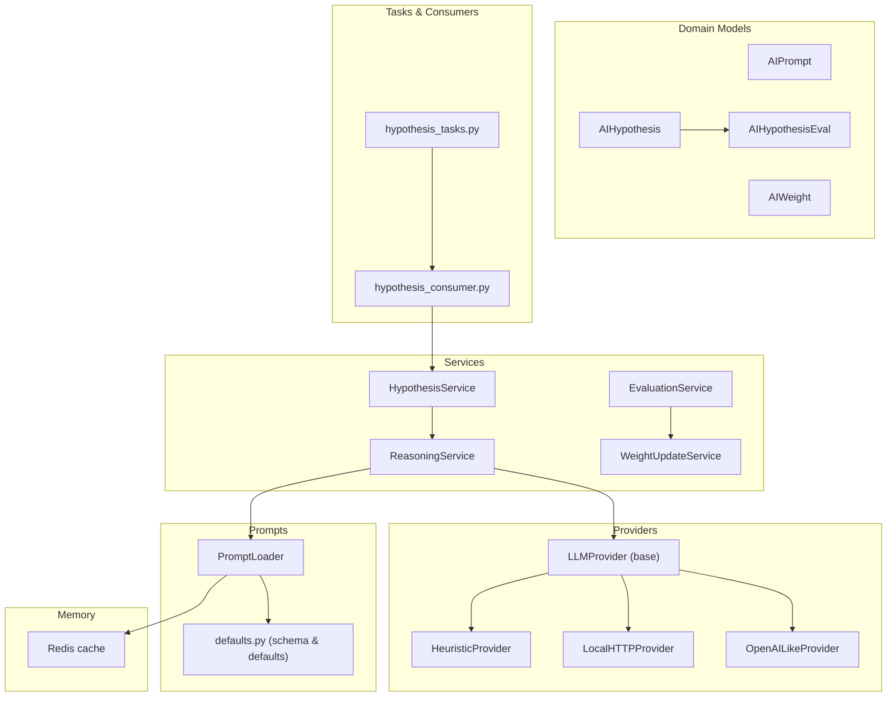

**Diagram sources**
- [models.py:15-114](file://src/apps/hypothesis_engine/models.py#L15-L114)
- [services/hypothesis_service.py:21-106](file://src/apps/hypothesis_engine/services/hypothesis_service.py#L21-L106)
- [agents/reasoning_service.py:18-60](file://src/apps/hypothesis_engine/agents/reasoning_service.py#L18-L60)
- [prompts/loader.py:38-70](file://src/apps/hypothesis_engine/prompts/loader.py#L38-L70)
- [prompts/defaults.py:15-68](file://src/apps/hypothesis_engine/prompts/defaults.py#L15-L68)
- [memory/cache.py:12-59](file://src/apps/hypothesis_engine/memory/cache.py#L12-L59)
- [providers/base.py:7-16](file://src/apps/hypothesis_engine/providers/base.py#L7-L16)
- [providers/heuristic.py:27-66](file://src/apps/hypothesis_engine/providers/heuristic.py#L27-L66)
- [providers/local_http.py](file://src/apps/hypothesis_engine/providers/local_http.py)
- [providers/openai_like.py](file://src/apps/hypothesis_engine/providers/openai_like.py)
- [services/evaluation_service.py:39-140](file://src/apps/hypothesis_engine/services/evaluation_service.py#L39-L140)
- [services/weight_update_service.py:21-67](file://src/apps/hypothesis_engine/services/weight_update_service.py#L21-L67)
- [tasks/hypothesis_tasks.py](file://src/apps/hypothesis_engine/tasks/hypothesis_tasks.py)
- [consumers/hypothesis_consumer.py](file://src/apps/hypothesis_engine/consumers/hypothesis_consumer.py)

**Section sources**
- [models.py:15-114](file://src/apps/hypothesis_engine/models.py#L15-L114)
- [constants.py:1-50](file://src/apps/hypothesis_engine/constants.py#L1-L50)

## Core Components
- Domain models define persistent entities for prompts, hypotheses, evaluations, and weights with appropriate indices and relationships.
- Services encapsulate business logic: generating hypotheses from events, evaluating outcomes, and updating weights.
- Providers implement the LLMProvider interface to support multiple reasoning backends.
- Prompt system loads active templates with caching and falls back to defaults.
- Memory layer caches active prompts in Redis for low-latency access.
- Tasks and consumers orchestrate asynchronous processing of events and hypothesis lifecycle.

**Section sources**
- [models.py:15-114](file://src/apps/hypothesis_engine/models.py#L15-L114)
- [services/hypothesis_service.py:21-106](file://src/apps/hypothesis_engine/services/hypothesis_service.py#L21-L106)
- [services/evaluation_service.py:39-140](file://src/apps/hypothesis_engine/services/evaluation_service.py#L39-L140)
- [services/weight_update_service.py:21-67](file://src/apps/hypothesis_engine/services/weight_update_service.py#L21-L67)
- [prompts/loader.py:38-70](file://src/apps/hypothesis_engine/prompts/loader.py#L38-L70)
- [memory/cache.py:12-59](file://src/apps/hypothesis_engine/memory/cache.py#L12-L59)
- [providers/base.py:7-16](file://src/apps/hypothesis_engine/providers/base.py#L7-L16)

## Architecture Overview
The engine orchestrates event-driven hypothesis generation, provider-based reasoning, prompt templating, evaluation against realized returns, and Bayesian weight updates. It publishes structured AI events for downstream consumers.

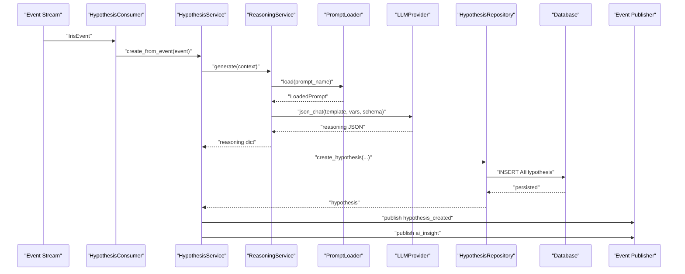

**Diagram sources**
- [consumers/hypothesis_consumer.py](file://src/apps/hypothesis_engine/consumers/hypothesis_consumer.py)
- [services/hypothesis_service.py:28-106](file://src/apps/hypothesis_engine/services/hypothesis_service.py#L28-L106)
- [agents/reasoning_service.py:23-60](file://src/apps/hypothesis_engine/agents/reasoning_service.py#L23-L60)
- [prompts/loader.py:46-66](file://src/apps/hypothesis_engine/prompts/loader.py#L46-L66)
- [repositories.py:46-57](file://src/apps/hypothesis_engine/repositories.py#L46-L57)

## Detailed Component Analysis

### Hypothesis Generation Pipeline
- Event ingestion validates supported event types and builds a context including symbol, sector, timeframe, and payload.
- ReasoningService selects a prompt by event type, merges context with prompt variables, and invokes a provider.
- On provider failure, a heuristic fallback ensures resilience.
- HypothesisService persists the hypothesis and emits creation and insight events.

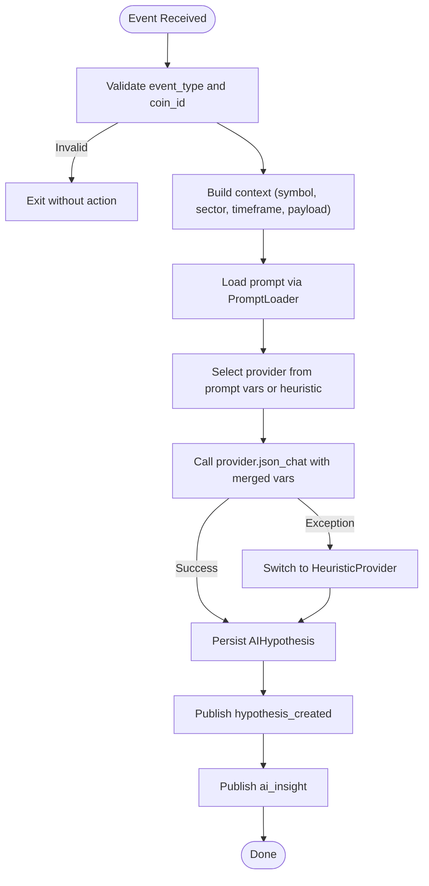

**Diagram sources**
- [services/hypothesis_service.py:28-106](file://src/apps/hypothesis_engine/services/hypothesis_service.py#L28-L106)
- [agents/reasoning_service.py:23-60](file://src/apps/hypothesis_engine/agents/reasoning_service.py#L23-L60)
- [prompts/loader.py:46-66](file://src/apps/hypothesis_engine/prompts/loader.py#L46-L66)
- [providers/heuristic.py:27-66](file://src/apps/hypothesis_engine/providers/heuristic.py#L27-L66)

**Section sources**
- [services/hypothesis_service.py:21-106](file://src/apps/hypothesis_engine/services/hypothesis_service.py#L21-L106)
- [agents/reasoning_service.py:18-60](file://src/apps/hypothesis_engine/agents/reasoning_service.py#L18-L60)
- [prompts/loader.py:38-70](file://src/apps/hypothesis_engine/prompts/loader.py#L38-L70)
- [prompts/defaults.py:15-68](file://src/apps/hypothesis_engine/prompts/defaults.py#L15-L68)
- [providers/heuristic.py:27-66](file://src/apps/hypothesis_engine/providers/heuristic.py#L27-L66)

### Prompt Engineering System
- Output schema enforces required fields for hypothesis JSON.
- Defaults provide a baseline template and variables; event-specific prompts are derived from event-to-prompt mappings.
- PromptLoader fetches active prompts from Redis cache, then DB, and falls back to defaults while caching the fallback.

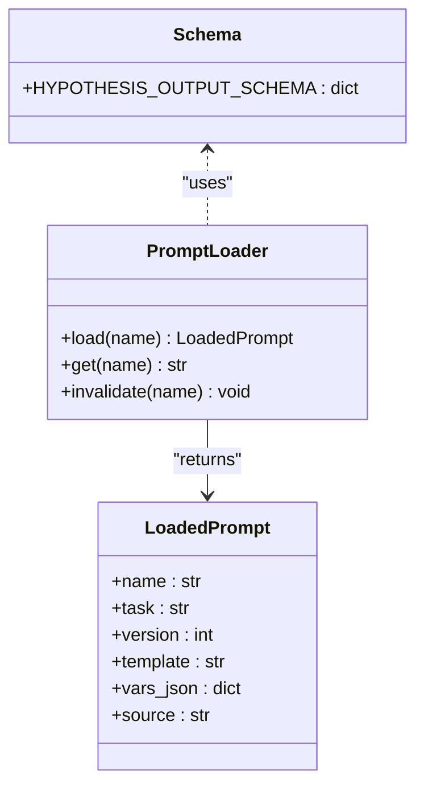

**Diagram sources**
- [prompts/loader.py:38-70](file://src/apps/hypothesis_engine/prompts/loader.py#L38-L70)
- [prompts/defaults.py:15-68](file://src/apps/hypothesis_engine/prompts/defaults.py#L15-L68)

**Section sources**
- [prompts/defaults.py:15-68](file://src/apps/hypothesis_engine/prompts/defaults.py#L15-L68)
- [prompts/loader.py:38-70](file://src/apps/hypothesis_engine/prompts/loader.py#L38-L70)
- [memory/cache.py:25-59](file://src/apps/hypothesis_engine/memory/cache.py#L25-L59)

### Provider Integration
- LLMProvider defines the contract for JSON chat with schema enforcement.
- HeuristicProvider implements deterministic rules based on event types and payload hints.
- Local HTTP and OpenAI-like providers are available for external model backends.

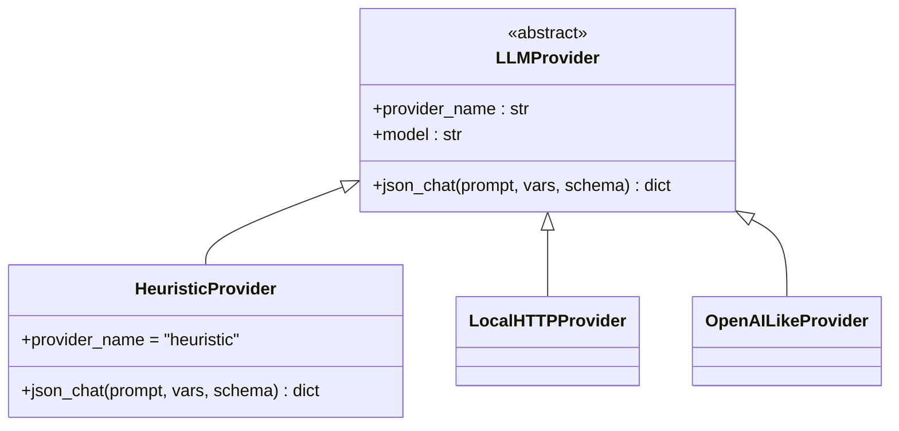

**Diagram sources**
- [providers/base.py:7-16](file://src/apps/hypothesis_engine/providers/base.py#L7-L16)
- [providers/heuristic.py:27-66](file://src/apps/hypothesis_engine/providers/heuristic.py#L27-L66)
- [providers/local_http.py](file://src/apps/hypothesis_engine/providers/local_http.py)
- [providers/openai_like.py](file://src/apps/hypothesis_engine/providers/openai_like.py)

**Section sources**
- [providers/base.py:7-16](file://src/apps/hypothesis_engine/providers/base.py#L7-L16)
- [providers/heuristic.py:27-66](file://src/apps/hypothesis_engine/providers/heuristic.py#L27-L66)

### Evaluation Service Architecture
- Lists hypotheses due for evaluation, computes outcome from realized returns versus target move and direction, persists evaluation, updates status, and emits evaluation and insight events.
- WeightUpdateService applies Bayesian updates to weights scoped by hypothesis type.

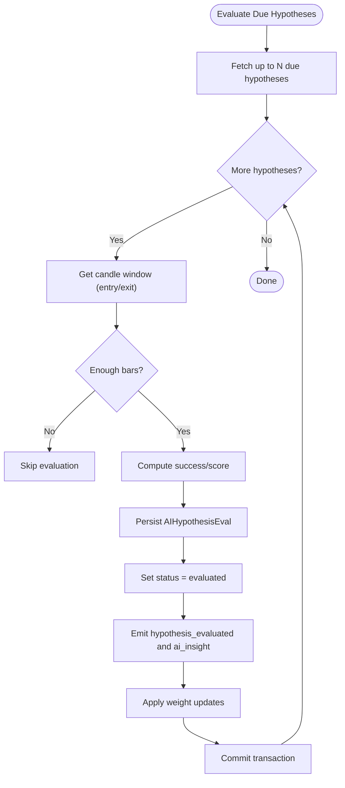

**Diagram sources**
- [services/evaluation_service.py:46-140](file://src/apps/hypothesis_engine/services/evaluation_service.py#L46-L140)
- [services/weight_update_service.py:35-67](file://src/apps/hypothesis_engine/services/weight_update_service.py#L35-L67)
- [repositories.py:59-77](file://src/apps/hypothesis_engine/repositories.py#L59-L77)

**Section sources**
- [services/evaluation_service.py:39-140](file://src/apps/hypothesis_engine/services/evaluation_service.py#L39-L140)
- [services/weight_update_service.py:21-67](file://src/apps/hypothesis_engine/services/weight_update_service.py#L21-L67)
- [repositories.py:59-117](file://src/apps/hypothesis_engine/repositories.py#L59-L117)

### Memory System for Hypotheses, Evaluations, and Weights
- Redis cache stores active prompts with TTL and versioning to avoid stale reads.
- Database models include indices optimized for frequent queries (status, eval due date, type, coin/timeframe).
- Repositories encapsulate CRUD and query patterns with explicit locking for weights.

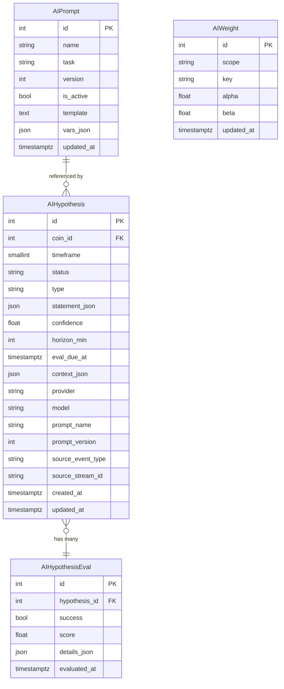

**Diagram sources**
- [models.py:15-114](file://src/apps/hypothesis_engine/models.py#L15-L114)

**Section sources**
- [memory/cache.py:12-59](file://src/apps/hypothesis_engine/memory/cache.py#L12-L59)
- [models.py:15-114](file://src/apps/hypothesis_engine/models.py#L15-L114)
- [repositories.py:15-124](file://src/apps/hypothesis_engine/repositories.py#L15-L124)

### Reasoning Service Capabilities
- Loads prompt by event type or default, merges context, selects provider, and returns normalized hypothesis fields with confidence clamping and asset normalization.
- Falls back to heuristic provider on errors to maintain availability.

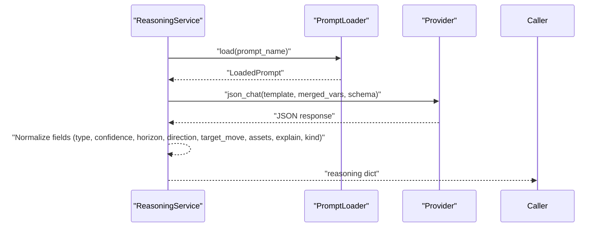

**Diagram sources**
- [agents/reasoning_service.py:23-60](file://src/apps/hypothesis_engine/agents/reasoning_service.py#L23-L60)
- [prompts/loader.py:46-66](file://src/apps/hypothesis_engine/prompts/loader.py#L46-L66)
- [providers/base.py:13-15](file://src/apps/hypothesis_engine/providers/base.py#L13-L15)

**Section sources**
- [agents/reasoning_service.py:18-60](file://src/apps/hypothesis_engine/agents/reasoning_service.py#L18-L60)
- [prompts/loader.py:38-70](file://src/apps/hypothesis_engine/prompts/loader.py#L38-L70)

### Weight Update Mechanism
- Applies Bayesian posterior updates per hypothesis type with decay factor and baseline prior.
- Emits weight update events for downstream consumption.

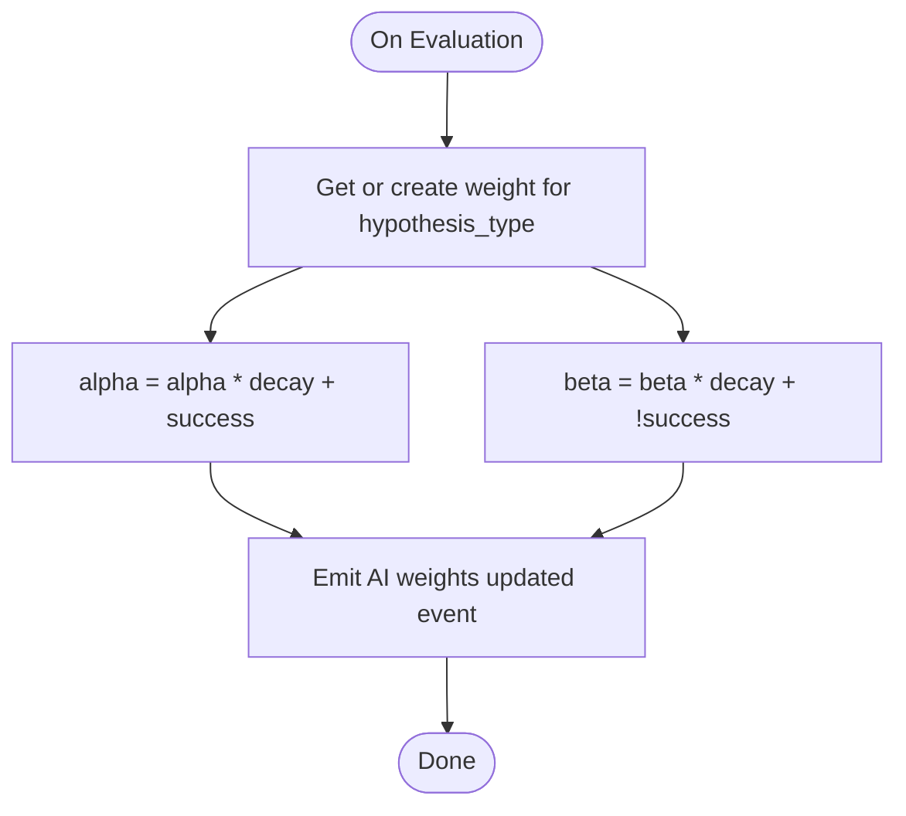

**Diagram sources**
- [services/weight_update_service.py:35-67](file://src/apps/hypothesis_engine/services/weight_update_service.py#L35-L67)
- [constants.py:24-26](file://src/apps/hypothesis_engine/constants.py#L24-L26)

**Section sources**
- [services/weight_update_service.py:21-67](file://src/apps/hypothesis_engine/services/weight_update_service.py#L21-L67)
- [constants.py:24-26](file://src/apps/hypothesis_engine/constants.py#L24-L26)

### Hypothesis Lifecycle Management
- Creation: event ingestion → reasoning → persistence → publish.
- Evaluation: due-date scanning → candle window retrieval → outcome computation → persist evaluation → update status → publish.
- Weighting: Bayesian update per hypothesis type with decay.

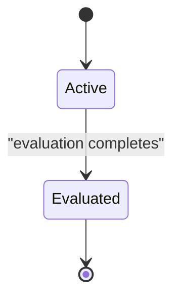

**Diagram sources**
- [constants.py:8-9](file://src/apps/hypothesis_engine/constants.py#L8-L9)
- [services/evaluation_service.py:63-63](file://src/apps/hypothesis_engine/services/evaluation_service.py#L63-L63)

**Section sources**
- [services/hypothesis_service.py:28-106](file://src/apps/hypothesis_engine/services/hypothesis_service.py#L28-L106)
- [services/evaluation_service.py:46-104](file://src/apps/hypothesis_engine/services/evaluation_service.py#L46-L104)

### Confidence Scoring and Validation
- Confidence is clamped to [0, 1]; horizon is clamped to a minimum; target_move is bounded; assets are normalized and defaulted to symbol if empty.
- Output schema enforces required fields for JSON validity.

**Section sources**
- [agents/reasoning_service.py:47-58](file://src/apps/hypothesis_engine/agents/reasoning_service.py#L47-L58)
- [prompts/defaults.py:15-29](file://src/apps/hypothesis_engine/prompts/defaults.py#L15-L29)

### Integration with Analytical Systems
- Publishes structured AI events for downstream systems (e.g., insights, weights).
- Uses market data queries for candle windows during evaluation.
- Supports SSE/stream prefixes for frontend delivery.

**Section sources**
- [constants.py:3-6](file://src/apps/hypothesis_engine/constants.py#L3-L6)
- [constants.py:21-22](file://src/apps/hypothesis_engine/constants.py#L21-L22)
- [services/evaluation_service.py:106-139](file://src/apps/hypothesis_engine/services/evaluation_service.py#L106-L139)

## Dependency Analysis
- Cohesion: Services encapsulate cohesive workflows; repositories and query services separate persistence concerns.
- Coupling: ReasoningService depends on PromptLoader and provider factory; EvaluationService depends on WeightUpdateService and repositories.
- External dependencies: Redis for prompt caching, database for persistence, event stream for ingestion.

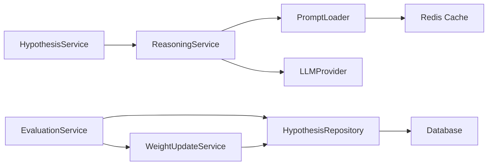

**Diagram sources**
- [services/hypothesis_service.py:22-26](file://src/apps/hypothesis_engine/services/hypothesis_service.py#L22-L26)
- [agents/reasoning_service.py:21-33](file://src/apps/hypothesis_engine/agents/reasoning_service.py#L21-L33)
- [prompts/loader.py:46-66](file://src/apps/hypothesis_engine/prompts/loader.py#L46-L66)
- [memory/cache.py:12-14](file://src/apps/hypothesis_engine/memory/cache.py#L12-L14)
- [services/evaluation_service.py:40-44](file://src/apps/hypothesis_engine/services/evaluation_service.py#L40-L44)
- [services/weight_update_service.py:22-24](file://src/apps/hypothesis_engine/services/weight_update_service.py#L22-L24)
- [repositories.py:15-17](file://src/apps/hypothesis_engine/repositories.py#L15-L17)

**Section sources**
- [repositories.py:15-124](file://src/apps/hypothesis_engine/repositories.py#L15-L124)
- [query_services.py:24-147](file://src/apps/hypothesis_engine/query_services.py#L24-L147)

## Performance Considerations
- Prompt caching: Redis cache with TTL minimizes DB and network latency for active prompts.
- Batch evaluation: Limit number of hypotheses processed per run to control resource usage.
- Indexing: Strategic indices on status, eval_due_at, and type improve query performance.
- Asynchronous operations: Use async sessions and Redis clients to avoid blocking.
- Event-driven processing: Consumers and tasks decouple generation and evaluation.

[No sources needed since this section provides general guidance]

## Troubleshooting Guide
- No hypothesis created: Verify event type is supported and coin context exists; check provider availability and fallback logic.
- Evaluation skipped: Ensure sufficient candle data and correct timestamps; confirm eval_due_at alignment.
- Weight not updating: Confirm evaluation persisted and hypothesis type present; check decay and baseline constants.
- Prompt not loading: Invalidate cache if stale; verify active prompt existence; inspect Redis connectivity.

**Section sources**
- [constants.py:31-50](file://src/apps/hypothesis_engine/constants.py#L31-L50)
- [services/evaluation_service.py:106-119](file://src/apps/hypothesis_engine/services/evaluation_service.py#L106-L119)
- [memory/cache.py:52-59](file://src/apps/hypothesis_engine/memory/cache.py#L52-L59)

## Conclusion
The Hypothesis Engine provides a robust, extensible framework for AI-driven market hypothesis generation, evaluation, and weighting. Its modular design supports multiple providers, dynamic prompts, and resilient fallbacks, while maintaining efficient data access and clear event-driven workflows.

[No sources needed since this section summarizes without analyzing specific files]

## Appendices

### Provider Configuration and Prompt Templates
- Provider selection is driven by prompt variables; defaults include provider, model, horizon, and target move.
- Event-to-prompt mappings enable specialized templates per event type.

**Section sources**
- [prompts/defaults.py:37-68](file://src/apps/hypothesis_engine/prompts/defaults.py#L37-L68)
- [constants.py:42-49](file://src/apps/hypothesis_engine/constants.py#L42-L49)

### Hypothesis Validation Processes
- Output schema validation ensures required fields; normalization enforces bounds and defaults.
- Evaluation outcome computation compares realized return to target move with direction-aware thresholds.

**Section sources**
- [prompts/defaults.py:15-29](file://src/apps/hypothesis_engine/prompts/defaults.py#L15-L29)
- [services/evaluation_service.py:27-36](file://src/apps/hypothesis_engine/services/evaluation_service.py#L27-L36)

### AI/ML Model Integration Notes
- The heuristic provider offers deterministic behavior without external model calls.
- Local HTTP and OpenAI-like providers enable integration with external LLM backends; ensure proper configuration and error handling.

**Section sources**
- [providers/heuristic.py:27-66](file://src/apps/hypothesis_engine/providers/heuristic.py#L27-L66)
- [providers/local_http.py](file://src/apps/hypothesis_engine/providers/local_http.py)
- [providers/openai_like.py](file://src/apps/hypothesis_engine/providers/openai_like.py)