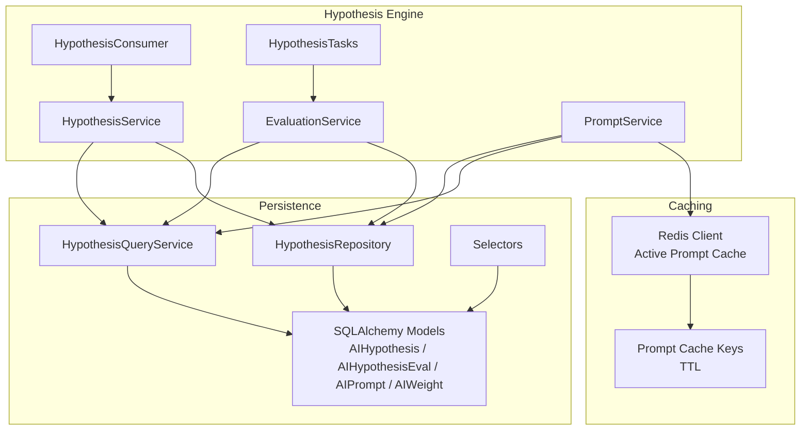
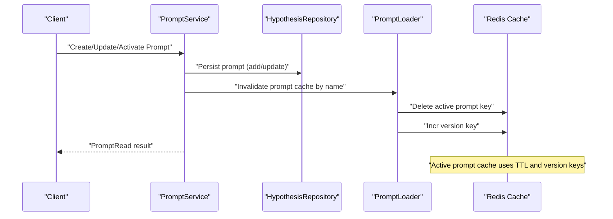
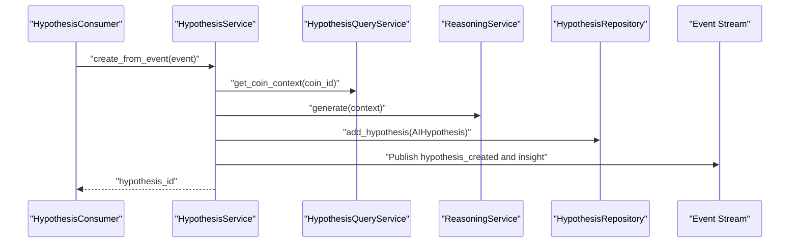
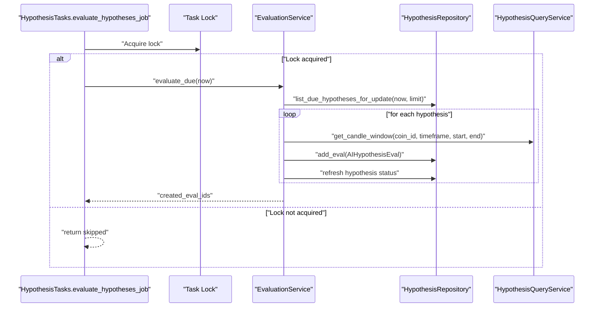
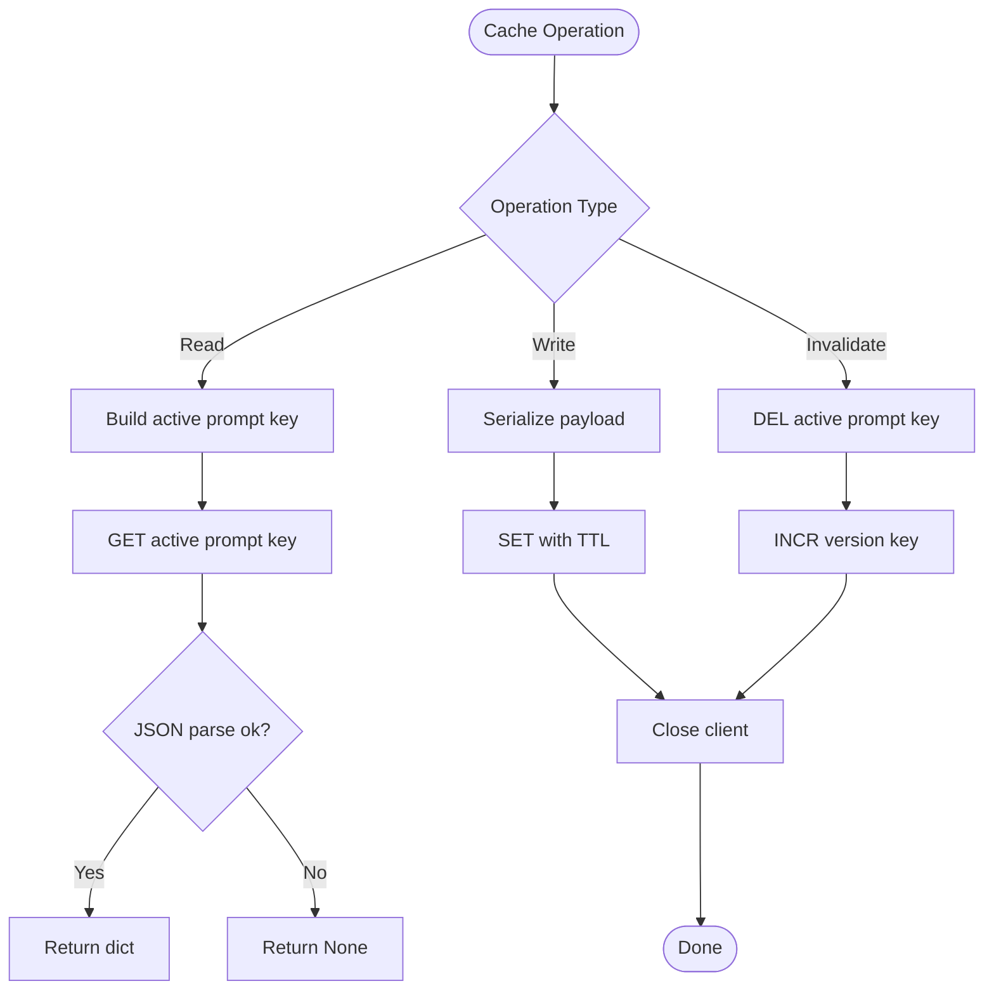
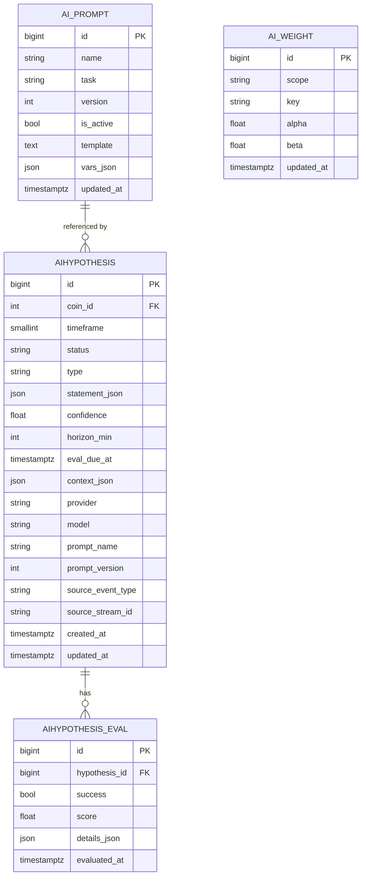
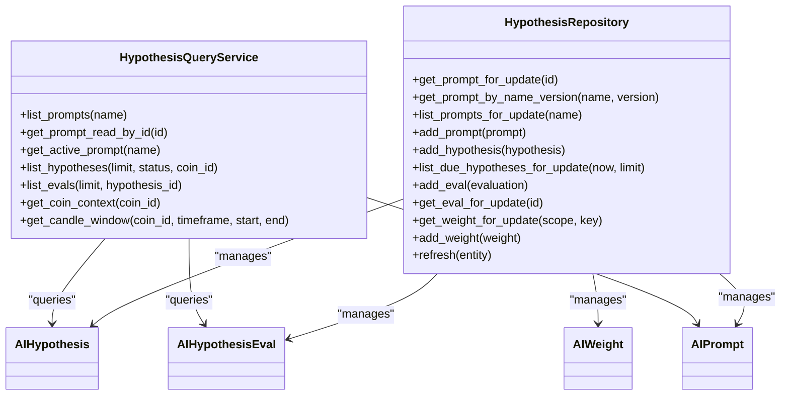
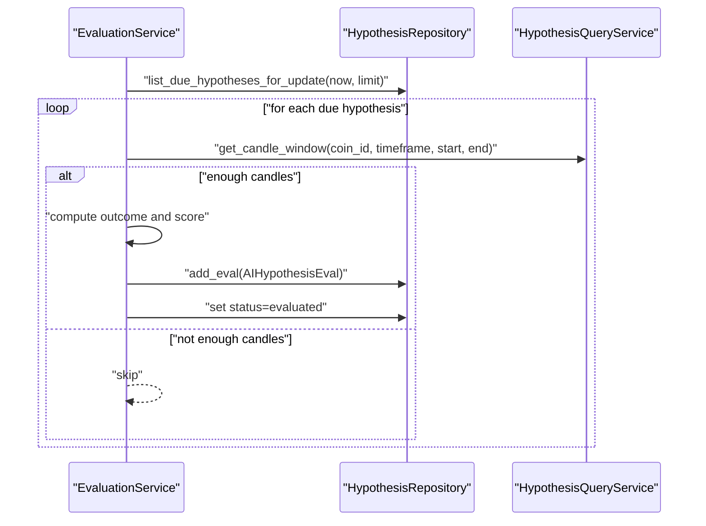
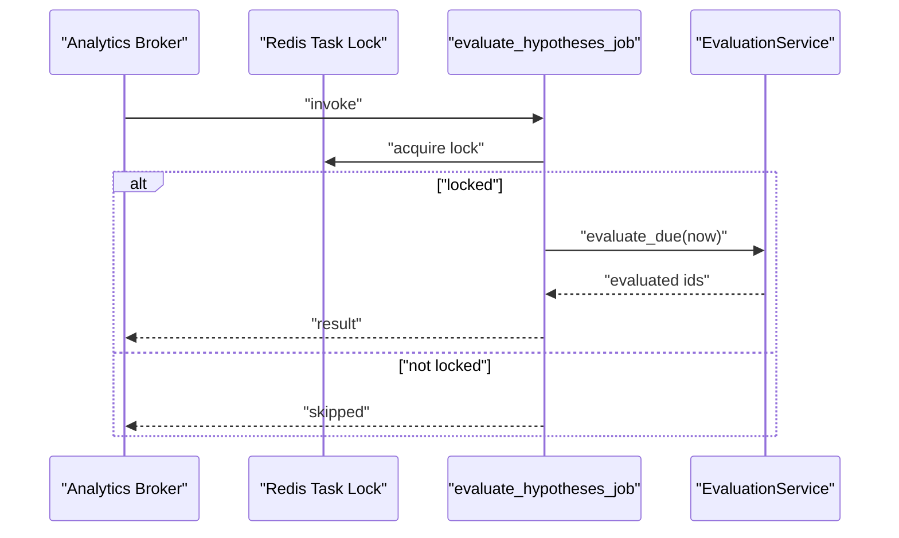
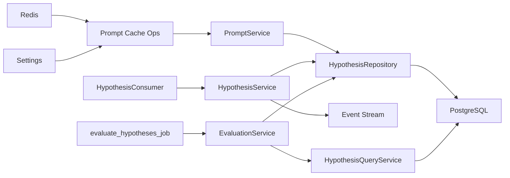

# Memory and Cache

<cite>
**Referenced Files in This Document**
- [cache.py](file://src/apps/hypothesis_engine/memory/cache.py)
- [constants.py](file://src/apps/hypothesis_engine/constants.py)
- [models.py](file://src/apps/hypothesis_engine/models.py)
- [schemas.py](file://src/apps/hypothesis_engine/schemas.py)
- [repositories.py](file://src/apps/hypothesis_engine/repositories.py)
- [query_services.py](file://src/apps/hypothesis_engine/query_services.py)
- [selectors.py](file://src/apps/hypothesis_engine/selectors/hypothesis_selectors.py)
- [hypothesis_service.py](file://src/apps/hypothesis_engine/services/hypothesis_service.py)
- [evaluation_service.py](file://src/apps/hypothesis_engine/services/evaluation_service.py)
- [prompt_service.py](file://src/apps/hypothesis_engine/services/prompt_service.py)
- [hypothesis_consumer.py](file://src/apps/hypothesis_engine/consumers/hypothesis_consumer.py)
- [hypothesis_tasks.py](file://src/apps/hypothesis_engine/tasks/hypothesis_tasks.py)
</cite>

## Table of Contents
1. [Introduction](#introduction)
2. [Project Structure](#project-structure)
3. [Core Components](#core-components)
4. [Architecture Overview](#architecture-overview)
5. [Detailed Component Analysis](#detailed-component-analysis)
6. [Dependency Analysis](#dependency-analysis)
7. [Performance Considerations](#performance-considerations)
8. [Troubleshooting Guide](#troubleshooting-guide)
9. [Conclusion](#conclusion)
10. [Appendices](#appendices)

## Introduction
This document describes the memory and caching system for the hypothesis engine, focusing on how generated hypotheses, evaluation results, and confidence scores are stored, retrieved, and managed. It documents cache strategies, invalidation, and performance optimizations, along with repository patterns, persistence, and retrieval mechanisms. It also covers integration with Redis for prompt caching, consistency guarantees, concurrency controls, and practical guidance for memory profiling, capacity planning, and troubleshooting.

## Project Structure
The hypothesis engine organizes memory and caching concerns across several modules:
- In-memory and transient caches: Redis-backed prompt cache for active prompts
- Persistent storage: SQLAlchemy ORM models for hypotheses, evaluations, weights, and prompts
- Query and repository layers: typed queries, repository operations, and selectors
- Services: hypothesis creation, evaluation, and prompt lifecycle management
- Consumers and tasks: event-driven ingestion and scheduled evaluation jobs

**Diagram sources**
- [hypothesis_service.py:21-106](file://src/apps/hypothesis_engine/services/hypothesis_service.py#L21-L106)
- [evaluation_service.py:39-140](file://src/apps/hypothesis_engine/services/evaluation_service.py#L39-L140)
- [prompt_service.py:12-78](file://src/apps/hypothesis_engine/services/prompt_service.py#L12-L78)
- [hypothesis_consumer.py:10-19](file://src/apps/hypothesis_engine/consumers/hypothesis_consumer.py#L10-L19)
- [hypothesis_tasks.py:12-23](file://src/apps/hypothesis_engine/tasks/hypothesis_tasks.py#L12-L23)
- [cache.py:12-59](file://src/apps/hypothesis_engine/memory/cache.py#L12-L59)
- [models.py:15-112](file://src/apps/hypothesis_engine/models.py#L15-L112)
- [repositories.py:15-124](file://src/apps/hypothesis_engine/repositories.py#L15-L124)
- [query_services.py:24-147](file://src/apps/hypothesis_engine/query_services.py#L24-L147)
- [selectors.py:12-57](file://src/apps/hypothesis_engine/selectors/hypothesis_selectors.py#L12-L57)

**Section sources**
- [hypothesis_service.py:21-106](file://src/apps/hypothesis_engine/services/hypothesis_service.py#L21-L106)
- [evaluation_service.py:39-140](file://src/apps/hypothesis_engine/services/evaluation_service.py#L39-L140)
- [prompt_service.py:12-78](file://src/apps/hypothesis_engine/services/prompt_service.py#L12-L78)
- [hypothesis_consumer.py:10-19](file://src/apps/hypothesis_engine/consumers/hypothesis_consumer.py#L10-L19)
- [hypothesis_tasks.py:12-23](file://src/apps/hypothesis_engine/tasks/hypothesis_tasks.py#L12-L23)
- [cache.py:12-59](file://src/apps/hypothesis_engine/memory/cache.py#L12-L59)
- [models.py:15-112](file://src/apps/hypothesis_engine/models.py#L15-L112)
- [repositories.py:15-124](file://src/apps/hypothesis_engine/repositories.py#L15-L124)
- [query_services.py:24-147](file://src/apps/hypothesis_engine/query_services.py#L24-L147)
- [selectors.py:12-57](file://src/apps/hypothesis_engine/selectors/hypothesis_selectors.py#L12-L57)

## Core Components
- Active prompt cache: Redis-backed cache for active prompt templates and variables, keyed by prompt name with a TTL and a monotonically increasing version key for invalidation.
- Hypotheses and evaluations: ORM models for hypotheses, evaluations, prompts, and weights, with indices optimized for frequent queries.
- Repository and query services: Typed repositories and query services encapsulate persistence and read-side projections.
- Services: Hypothesis creation from events, scheduled evaluation, and prompt lifecycle management with cache invalidation.
- Consumers and tasks: Event-driven ingestion and periodic evaluation job with distributed task locking.

Key capabilities:
- Store generated hypotheses with confidence, horizon, and evaluation due date
- Persist evaluation outcomes with success, score, and details
- Cache active prompts with TTL and versioning for fast retrieval
- Invalidate cached prompts on activation or updates
- Retrieve candle windows for evaluation scoring
- Apply weight updates after evaluation outcomes

**Section sources**
- [cache.py:12-59](file://src/apps/hypothesis_engine/memory/cache.py#L12-L59)
- [models.py:15-112](file://src/apps/hypothesis_engine/models.py#L15-L112)
- [repositories.py:15-124](file://src/apps/hypothesis_engine/repositories.py#L15-L124)
- [query_services.py:24-147](file://src/apps/hypothesis_engine/query_services.py#L24-L147)
- [hypothesis_service.py:21-106](file://src/apps/hypothesis_engine/services/hypothesis_service.py#L21-L106)
- [evaluation_service.py:39-140](file://src/apps/hypothesis_engine/services/evaluation_service.py#L39-L140)
- [prompt_service.py:12-78](file://src/apps/hypothesis_engine/services/prompt_service.py#L12-L78)
- [hypothesis_consumer.py:10-19](file://src/apps/hypothesis_engine/consumers/hypothesis_consumer.py#L10-L19)
- [hypothesis_tasks.py:12-23](file://src/apps/hypothesis_engine/tasks/hypothesis_tasks.py#L12-L23)

## Architecture Overview
The system integrates Redis for prompt caching and PostgreSQL via SQLAlchemy for persistent storage. The flow below shows how prompts are cached and invalidated, and how hypotheses are evaluated against candle windows.

**Diagram sources**
- [prompt_service.py:22-78](file://src/apps/hypothesis_engine/services/prompt_service.py#L22-L78)
- [repositories.py:39-44](file://src/apps/hypothesis_engine/repositories.py#L39-L44)
- [cache.py:40-59](file://src/apps/hypothesis_engine/memory/cache.py#L40-L59)

**Diagram sources**
- [hypothesis_consumer.py:14-19](file://src/apps/hypothesis_engine/consumers/hypothesis_consumer.py#L14-L19)
- [hypothesis_service.py:28-106](file://src/apps/hypothesis_engine/services/hypothesis_service.py#L28-L106)
- [query_services.py:96-111](file://src/apps/hypothesis_engine/query_services.py#L96-L111)
- [repositories.py:46-57](file://src/apps/hypothesis_engine/repositories.py#L46-L57)

**Diagram sources**
- [hypothesis_tasks.py:12-23](file://src/apps/hypothesis_engine/tasks/hypothesis_tasks.py#L12-L23)
- [evaluation_service.py:46-104](file://src/apps/hypothesis_engine/services/evaluation_service.py#L46-L104)
- [repositories.py:59-77](file://src/apps/hypothesis_engine/repositories.py#L59-L77)
- [query_services.py:113-143](file://src/apps/hypothesis_engine/query_services.py#L113-L143)

## Detailed Component Analysis

### Prompt Cache (Redis)
- Purpose: Cache active prompt templates and variables for fast retrieval during reasoning and generation.
- Keys and TTL: Active prompt key with a namespace prefix and TTL; a separate version key tracks invalidations.
- Operations:
  - Read active prompt by name
  - Write active prompt with TTL
  - Invalidate by deleting active key and incrementing version key

**Diagram sources**
- [cache.py:25-59](file://src/apps/hypothesis_engine/memory/cache.py#L25-L59)
- [constants.py:12-13](file://src/apps/hypothesis_engine/constants.py#L12-L13)

**Section sources**
- [cache.py:12-59](file://src/apps/hypothesis_engine/memory/cache.py#L12-L59)
- [constants.py:12-13](file://src/apps/hypothesis_engine/constants.py#L12-L13)

### Hypotheses and Evaluations (ORM)
- Models:
  - AIHypothesis: stores hypothesis metadata, confidence, horizon, evaluation due date, provider/model, prompt association, and timestamps
  - AIHypothesisEval: stores evaluation outcomes (success, score, details) and evaluated_at
  - AIPrompt: stores prompt templates and variables, versioning, and activity flag
  - AIWeight: stores per-scope weights used for updating confidence or other factors
- Indices: optimized composite indexes for frequent queries (status/due-at, coin/timeframe, type/confidence, etc.)

**Diagram sources**
- [models.py:15-112](file://src/apps/hypothesis_engine/models.py#L15-L112)

**Section sources**
- [models.py:15-112](file://src/apps/hypothesis_engine/models.py#L15-L112)

### Repository and Query Services
- HypothesisRepository: CRUD and query helpers for prompts, hypotheses, evaluations, and weights; includes select-in-load for related evaluations and row-level locking for weights.
- HypothesisQueryService: read-side projections for prompts, hypotheses, evaluations, candle windows, and coin context; uses typed read models and selector statements.
- Selectors: reusable SQL statements for prompt versions, active prompt lookup, hypotheses lists, due hypotheses, and evaluations.

**Diagram sources**
- [repositories.py:15-124](file://src/apps/hypothesis_engine/repositories.py#L15-L124)
- [query_services.py:24-147](file://src/apps/hypothesis_engine/query_services.py#L24-L147)

**Section sources**
- [repositories.py:15-124](file://src/apps/hypothesis_engine/repositories.py#L15-L124)
- [query_services.py:24-147](file://src/apps/hypothesis_engine/query_services.py#L24-L147)
- [selectors.py:12-57](file://src/apps/hypothesis_engine/selectors/hypothesis_selectors.py#L12-L57)

### Services: Hypothesis Creation and Evaluation
- HypothesisService: creates hypotheses from supported events, builds reasoning context, persists the hypothesis, and publishes events for insights and notifications.
- EvaluationService: evaluates due hypotheses by fetching candle windows, computing outcomes and scores, persisting evaluations, updating statuses, and publishing evaluation events; applies weight updates afterward.
- PromptService: manages prompt lifecycle (create, update, activate), ensuring only one active version per name and invalidating cache on changes.

**Diagram sources**
- [evaluation_service.py:46-140](file://src/apps/hypothesis_engine/services/evaluation_service.py#L46-L140)
- [repositories.py:59-77](file://src/apps/hypothesis_engine/repositories.py#L59-L77)
- [query_services.py:113-143](file://src/apps/hypothesis_engine/query_services.py#L113-L143)

**Section sources**
- [hypothesis_service.py:21-106](file://src/apps/hypothesis_engine/services/hypothesis_service.py#L21-L106)
- [evaluation_service.py:39-140](file://src/apps/hypothesis_engine/services/evaluation_service.py#L39-L140)
- [prompt_service.py:12-78](file://src/apps/hypothesis_engine/services/prompt_service.py#L12-L78)

### Consumers and Tasks
- HypothesisConsumer: validates incoming events and delegates hypothesis creation to HypothesisService within a unit of work.
- evaluate_hypotheses_job: scheduled task guarded by a Redis-based distributed lock to prevent overlapping runs; invokes EvaluationService to process due hypotheses.

**Diagram sources**
- [hypothesis_tasks.py:12-23](file://src/apps/hypothesis_engine/tasks/hypothesis_tasks.py#L12-L23)

**Section sources**
- [hypothesis_consumer.py:10-19](file://src/apps/hypothesis_engine/consumers/hypothesis_consumer.py#L10-L19)
- [hypothesis_tasks.py:12-23](file://src/apps/hypothesis_engine/tasks/hypothesis_tasks.py#L12-L23)

## Dependency Analysis
- In-memory cache dependency: Prompt cache depends on Redis client initialization and settings; cache keys depend on constants for prefix and TTL.
- Persistence dependency: All write operations go through HypothesisRepository; read operations use HypothesisQueryService and selector statements.
- Event-driven flow: HypothesisConsumer triggers HypothesisService; scheduled task triggers EvaluationService.
- Concurrency control: Distributed task lock prevents concurrent evaluation runs.

**Diagram sources**
- [cache.py:12-14](file://src/apps/hypothesis_engine/memory/cache.py#L12-L14)
- [constants.py:12-13](file://src/apps/hypothesis_engine/constants.py#L12-L13)
- [prompt_service.py:22-78](file://src/apps/hypothesis_engine/services/prompt_service.py#L22-L78)
- [hypothesis_consumer.py:14-19](file://src/apps/hypothesis_engine/consumers/hypothesis_consumer.py#L14-L19)
- [hypothesis_tasks.py:14-22](file://src/apps/hypothesis_engine/tasks/hypothesis_tasks.py#L14-L22)
- [evaluation_service.py:46-104](file://src/apps/hypothesis_engine/services/evaluation_service.py#L46-L104)
- [repositories.py:15-124](file://src/apps/hypothesis_engine/repositories.py#L15-L124)
- [query_services.py:24-147](file://src/apps/hypothesis_engine/query_services.py#L24-L147)

**Section sources**
- [cache.py:12-59](file://src/apps/hypothesis_engine/memory/cache.py#L12-L59)
- [constants.py:12-13](file://src/apps/hypothesis_engine/constants.py#L12-L13)
- [repositories.py:15-124](file://src/apps/hypothesis_engine/repositories.py#L15-L124)
- [query_services.py:24-147](file://src/apps/hypothesis_engine/query_services.py#L24-L147)
- [hypothesis_consumer.py:10-19](file://src/apps/hypothesis_engine/consumers/hypothesis_consumer.py#L10-L19)
- [hypothesis_tasks.py:12-23](file://src/apps/hypothesis_engine/tasks/hypothesis_tasks.py#L12-L23)

## Performance Considerations
- Cache TTL and invalidation:
  - Active prompt cache uses a fixed TTL to bound memory residency.
  - Version key increments on invalidation to support cache coherency checks if needed by loaders.
- Query optimization:
  - Composite indexes on hypotheses and evaluations enable efficient due-date scans and ranking by confidence/type.
  - select-in-load for evaluations reduces N+1 queries.
- Batch processing:
  - EvaluationService processes up to a bounded number of due hypotheses per run.
- Network and serialization:
  - Prompt cache serializes payloads compactly; deserialization errors are handled gracefully by returning None.
- Concurrency:
  - Redis-based task lock prevents overlapping evaluation runs, reducing contention and redundant work.

[No sources needed since this section provides general guidance]

## Troubleshooting Guide
Common issues and remedies:
- Prompt cache returns None:
  - Verify active prompt exists and is marked active.
  - Confirm cache key construction and TTL; check for JSON parse errors.
  - Ensure Redis connectivity and that the client is closed after use.
- Evaluation skips hypotheses:
  - Insufficient candle data in the window leads to skipping; confirm market data availability and timeframes.
- Concurrent evaluation runs:
  - If evaluation appears stuck, check Redis lock acquisition; ensure the lock key is cleared if a previous run crashed.
- Cache invalidation not taking effect:
  - Confirm that invalidate operation deletes the active key and increments the version key.
  - Ensure the loader uses the same cache key naming convention.

**Section sources**
- [cache.py:25-59](file://src/apps/hypothesis_engine/memory/cache.py#L25-L59)
- [evaluation_service.py:106-140](file://src/apps/hypothesis_engine/services/evaluation_service.py#L106-L140)
- [hypothesis_tasks.py:14-22](file://src/apps/hypothesis_engine/tasks/hypothesis_tasks.py#L14-L22)
- [prompt_service.py:39-41](file://src/apps/hypothesis_engine/services/prompt_service.py#L39-L41)

## Conclusion
The hypothesis engine employs a clear separation between persistent storage and transient caching. Redis caches active prompts with TTL and versioning, while SQLAlchemy models and repositories manage hypotheses, evaluations, prompts, and weights. Services orchestrate event-driven creation and scheduled evaluation, with robust query paths and concurrency controls. This design balances performance, consistency, and maintainability.

[No sources needed since this section summarizes without analyzing specific files]

## Appendices

### Data Model Definitions
- AIHypothesis: stores hypothesis metadata, confidence, horizon, evaluation due date, provider/model, prompt association, and timestamps
- AIHypothesisEval: stores evaluation outcomes (success, score, details) and evaluated_at
- AIPrompt: stores prompt templates and variables, versioning, and activity flag
- AIWeight: stores per-scope weights used for updating confidence or other factors

**Section sources**
- [models.py:15-112](file://src/apps/hypothesis_engine/models.py#L15-L112)

### Cache Constants
- Prompt cache prefix and TTL are defined centrally for consistent key naming and expiration.

**Section sources**
- [constants.py:12-13](file://src/apps/hypothesis_engine/constants.py#L12-L13)