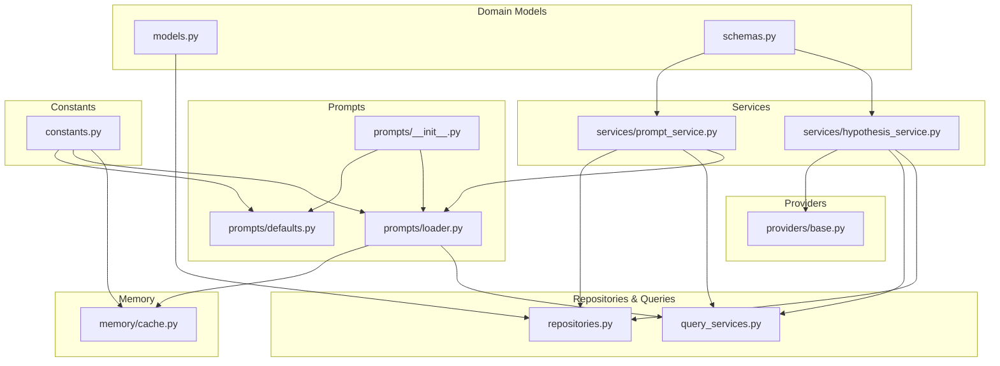
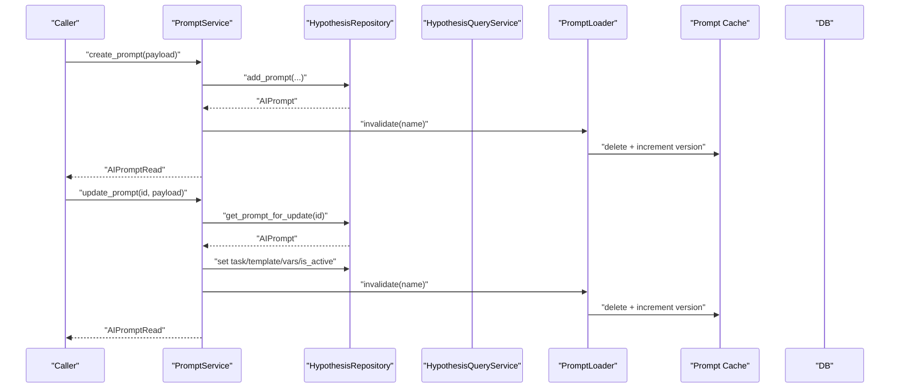
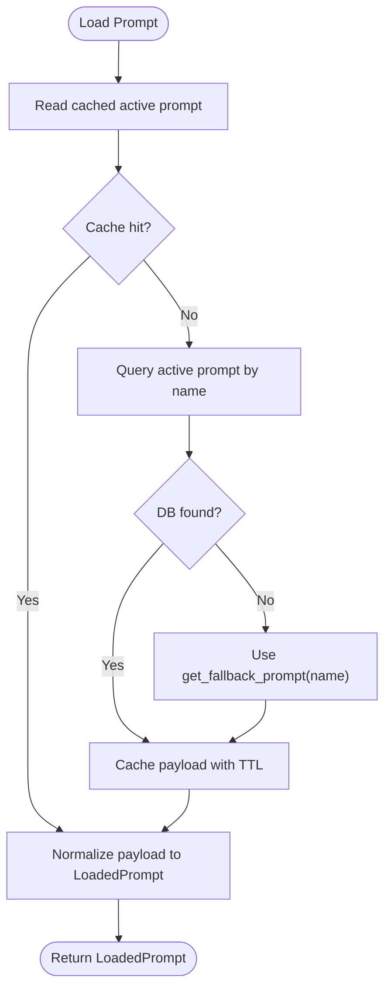
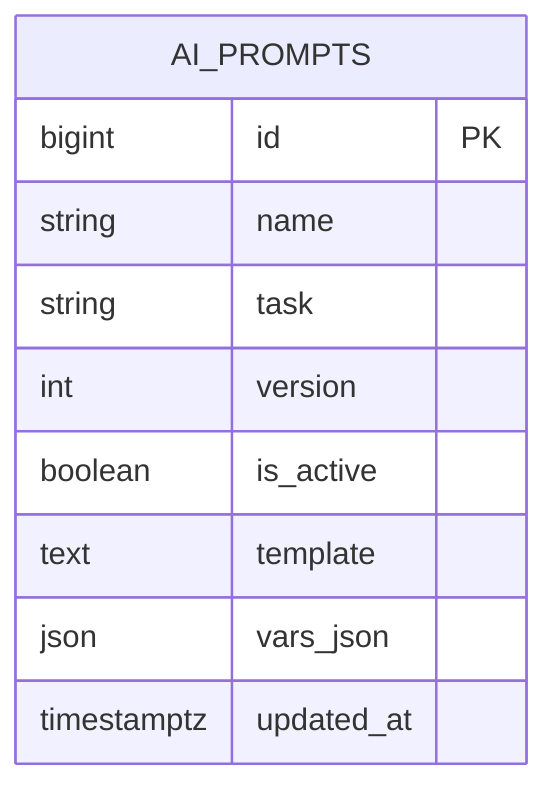
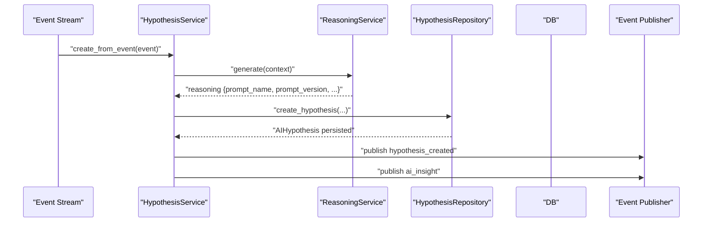
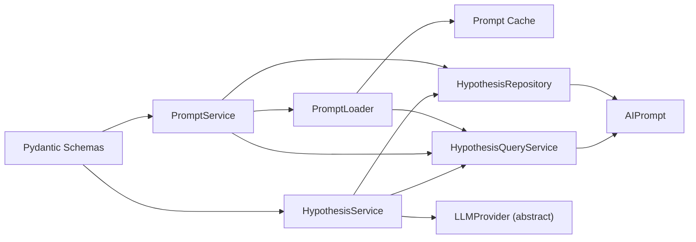

# Prompt Engineering

<cite>
**Referenced Files in This Document**
- [prompts/__init__.py](file://src/apps/hypothesis_engine/prompts/__init__.py)
- [prompts/defaults.py](file://src/apps/hypothesis_engine/prompts/defaults.py)
- [prompts/loader.py](file://src/apps/hypothesis_engine/prompts/loader.py)
- [memory/cache.py](file://src/apps/hypothesis_engine/memory/cache.py)
- [constants.py](file://src/apps/hypothesis_engine/constants.py)
- [schemas.py](file://src/apps/hypothesis_engine/schemas.py)
- [models.py](file://src/apps/hypothesis_engine/models.py)
- [repositories.py](file://src/apps/hypothesis_engine/repositories.py)
- [query_services.py](file://src/apps/hypothesis_engine/query_services.py)
- [services/prompt_service.py](file://src/apps/hypothesis_engine/services/prompt_service.py)
- [services/hypothesis_service.py](file://src/apps/hypothesis_engine/services/hypothesis_service.py)
- [providers/base.py](file://src/apps/hypothesis_engine/providers/base.py)
</cite>

## Table of Contents
1. [Introduction](#introduction)
2. [Project Structure](#project-structure)
3. [Core Components](#core-components)
4. [Architecture Overview](#architecture-overview)
5. [Detailed Component Analysis](#detailed-component-analysis)
6. [Dependency Analysis](#dependency-analysis)
7. [Performance Considerations](#performance-considerations)
8. [Troubleshooting Guide](#troubleshooting-guide)
9. [Conclusion](#conclusion)
10. [Appendices](#appendices)

## Introduction
This document describes the prompt engineering system powering hypothesis generation. It explains the prompt template architecture, default prompt configurations, dynamic prompt loading, composition patterns, parameter substitution, and context injection. It also covers prompt versioning, activation/deactivation, caching, and integration with the hypothesis generation workflow. Guidance on validation, error handling, debugging, and performance optimization is included, along with practical examples of prompt templates for different market conditions and analytical contexts.

## Project Structure
The prompt engineering subsystem resides under the hypothesis engine package and integrates with the broader system via repositories, queries, services, and memory caching.

**Diagram sources**
- [prompts/__init__.py](file://src/apps/hypothesis_engine/prompts/__init__.py)
- [prompts/defaults.py](file://src/apps/hypothesis_engine/prompts/defaults.py)
- [prompts/loader.py](file://src/apps/hypothesis_engine/prompts/loader.py)
- [memory/cache.py](file://src/apps/hypothesis_engine/memory/cache.py)
- [constants.py](file://src/apps/hypothesis_engine/constants.py)
- [schemas.py](file://src/apps/hypothesis_engine/schemas.py)
- [models.py](file://src/apps/hypothesis_engine/models.py)
- [repositories.py](file://src/apps/hypothesis_engine/repositories.py)
- [query_services.py](file://src/apps/hypothesis_engine/query_services.py)
- [services/prompt_service.py](file://src/apps/hypothesis_engine/services/prompt_service.py)
- [services/hypothesis_service.py](file://src/apps/hypothesis_engine/services/hypothesis_service.py)
- [providers/base.py](file://src/apps/hypothesis_engine/providers/base.py)

**Section sources**
- [prompts/__init__.py](file://src/apps/hypothesis_engine/prompts/__init__.py)
- [prompts/defaults.py](file://src/apps/hypothesis_engine/prompts/defaults.py)
- [prompts/loader.py](file://src/apps/hypothesis_engine/prompts/loader.py)
- [memory/cache.py](file://src/apps/hypothesis_engine/memory/cache.py)
- [constants.py](file://src/apps/hypothesis_engine/constants.py)
- [schemas.py](file://src/apps/hypothesis_engine/schemas.py)
- [models.py](file://src/apps/hypothesis_engine/models.py)
- [repositories.py](file://src/apps/hypothesis_engine/repositories.py)
- [query_services.py](file://src/apps/hypothesis_engine/query_services.py)
- [services/prompt_service.py](file://src/apps/hypothesis_engine/services/prompt_service.py)
- [services/hypothesis_service.py](file://src/apps/hypothesis_engine/services/hypothesis_service.py)
- [providers/base.py](file://src/apps/hypothesis_engine/providers/base.py)

## Core Components
- Prompt metadata and defaults: Defines the default prompt name, task, version, template, and default variable set used when no active prompt is available.
- Prompt loader: Loads active prompts from cache, database, or falls back to defaults, normalizes payloads, and caches results.
- Memory cache: Provides Redis-backed caching for active prompts with TTL and versioning.
- Domain models and schemas: Persist prompt definitions and expose typed read models for API consumption.
- Prompt service: Manages CRUD operations, activation, deactivation, and cache invalidation.
- Hypothesis service: Integrates prompt selection into hypothesis generation, emitting events and persisting structured hypotheses.
- Provider interface: Abstracts LLM provider interactions for JSON-mode prompting with schema enforcement.

**Section sources**
- [prompts/defaults.py](file://src/apps/hypothesis_engine/prompts/defaults.py)
- [prompts/loader.py](file://src/apps/hypothesis_engine/prompts/loader.py)
- [memory/cache.py](file://src/apps/hypothesis_engine/memory/cache.py)
- [models.py](file://src/apps/hypothesis_engine/models.py)
- [schemas.py](file://src/apps/hypothesis_engine/schemas.py)
- [services/prompt_service.py](file://src/apps/hypothesis_engine/services/prompt_service.py)
- [services/hypothesis_service.py](file://src/apps/hypothesis_engine/services/hypothesis_service.py)
- [providers/base.py](file://src/apps/hypothesis_engine/providers/base.py)

## Architecture Overview
The prompt system follows a layered design:
- Constants define default names, versions, and cache keys.
- Defaults provide baseline prompt metadata and fallback variables.
- Loader resolves the active prompt via cache, DB, or fallback, returning a normalized LoadedPrompt.
- Repositories and queries manage persistence and retrieval of prompt versions.
- Services coordinate creation, updates, activation, and cache invalidation.
- Hypothesis service composes context, selects a prompt, and persists structured hypotheses.

**Diagram sources**
- [services/prompt_service.py](file://src/apps/hypothesis_engine/services/prompt_service.py)
- [repositories.py](file://src/apps/hypothesis_engine/repositories.py)
- [prompts/loader.py](file://src/apps/hypothesis_engine/prompts/loader.py)
- [memory/cache.py](file://src/apps/hypothesis_engine/memory/cache.py)

## Detailed Component Analysis

### Prompt Template Architecture and Defaults
- Default prompt identity: Includes name, task, version, template text, and default variables.
- Event-specific prompts: A set of event-triggered prompt names are generated from a mapping, inheriting the same task and version while appending contextual triggers to the template.
- Fallback mechanism: Ensures a usable prompt is always returned when cache and DB queries fail.

Key responsibilities:
- Define the canonical output schema for hypothesis JSON.
- Provide a baseline template and default variable set.
- Generate event-specific variants for richer context.

**Section sources**
- [prompts/defaults.py](file://src/apps/hypothesis_engine/prompts/defaults.py)
- [constants.py](file://src/apps/hypothesis_engine/constants.py)

### Dynamic Prompt Loading Mechanism
- LoadedPrompt: Normalized representation of a prompt with name, task, version, template, vars, and source provenance.
- Resolution order:
  1) Read active prompt from cache.
  2) If missing, fetch from DB via query service.
  3) If still missing, fall back to defaults.
- Cache normalization: Payloads are normalized and stored with TTL; cache invalidation increments a version key.

**Diagram sources**
- [prompts/loader.py](file://src/apps/hypothesis_engine/prompts/loader.py)
- [memory/cache.py](file://src/apps/hypothesis_engine/memory/cache.py)
- [prompts/defaults.py](file://src/apps/hypothesis_engine/prompts/defaults.py)

**Section sources**
- [prompts/loader.py](file://src/apps/hypothesis_engine/prompts/loader.py)
- [memory/cache.py](file://src/apps/hypothesis_engine/memory/cache.py)
- [prompts/defaults.py](file://src/apps/hypothesis_engine/prompts/defaults.py)

### Prompt Composition Patterns, Parameter Substitution, and Context Injection
- Composition patterns:
  - Base template defines the role and JSON-only output requirement.
  - Event-specific templates append trigger context to the base.
- Parameter substitution:
  - vars_json carries substitution variables (e.g., provider, model, horizon, target_move).
  - These are passed to the provider’s JSON-mode chat method for rendering.
- Context injection:
  - Hypothesis service composes context from incoming events (symbol, sector, timeframe, payload).
  - The selected prompt’s template and vars are combined with context to produce a final prompt string.

Note: The provider interface abstracts JSON schema enforcement and structured output.

**Section sources**
- [prompts/defaults.py](file://src/apps/hypothesis_engine/prompts/defaults.py)
- [services/hypothesis_service.py](file://src/apps/hypothesis_engine/services/hypothesis_service.py)
- [providers/base.py](file://src/apps/hypothesis_engine/providers/base.py)

### Prompt Versioning and Activation
- Versioning: Prompts are identified by name and integer version; uniqueness enforced per name/version.
- Activation: Only one active version per prompt name; activating a version deactivates others.
- Persistence: AIPrompt stores name, task, version, is_active flag, template, and vars_json.
- Read models: Typed read models expose prompt metadata for API responses.

**Diagram sources**
- [models.py](file://src/apps/hypothesis_engine/models.py)

**Section sources**
- [models.py](file://src/apps/hypothesis_engine/models.py)
- [schemas.py](file://src/apps/hypothesis_engine/schemas.py)
- [repositories.py](file://src/apps/hypothesis_engine/repositories.py)
- [query_services.py](file://src/apps/hypothesis_engine/query_services.py)

### A/B Testing Capabilities
- Multi-version support: Multiple versions of the same prompt name can co-exist; only one is active.
- Activation control: The prompt service toggles is_active to switch between versions.
- Cache invalidation: After activation changes, cache is invalidated to propagate new active version immediately.

Practical guidance:
- Create a new version with a distinct template or vars for variant testing.
- Activate the preferred version; monitor hypothesis generation outcomes and evaluations.

**Section sources**
- [services/prompt_service.py](file://src/apps/hypothesis_engine/services/prompt_service.py)
- [prompts/loader.py](file://src/apps/hypothesis_engine/prompts/loader.py)
- [memory/cache.py](file://src/apps/hypothesis_engine/memory/cache.py)

### Prompt Validation and Error Handling
- Validation:
  - Creation prevents duplicate name+version combinations.
  - Updates accept partial fields; task/template/vars are optional.
  - Output schema ensures required fields for hypothesis JSON.
- Errors:
  - Prompt not found during update/activation raises a dedicated error.
  - Invalid payload errors are raised for duplicates or malformed inputs.
- Debugging:
  - Query and repository methods log debug traces with operation modes and counts.
  - Cache reads handle JSON decoding errors gracefully and return None.

**Section sources**
- [services/prompt_service.py](file://src/apps/hypothesis_engine/services/prompt_service.py)
- [query_services.py](file://src/apps/hypothesis_engine/query_services.py)
- [repositories.py](file://src/apps/hypothesis_engine/repositories.py)
- [prompts/defaults.py](file://src/apps/hypothesis_engine/prompts/defaults.py)

### Prompt Service APIs and Integration Patterns
- PromptService API surface:
  - List prompts (optionally by name).
  - Create prompt (auto-deactivates duplicates of same name+version).
  - Update prompt (optional fields).
  - Activate prompt (deactivates other versions).
  - Internal helpers: normalize payload, invalidate cache.
- Integration with hypothesis generation:
  - HypothesisService composes context from events and delegates reasoning to a provider.
  - The resulting reasoning supplies prompt_name and prompt_version used to persist the hypothesis.
  - Events are published upon hypothesis creation and insights.

**Diagram sources**
- [services/hypothesis_service.py](file://src/apps/hypothesis_engine/services/hypothesis_service.py)
- [repositories.py](file://src/apps/hypothesis_engine/repositories.py)
- [models.py](file://src/apps/hypothesis_engine/models.py)

**Section sources**
- [services/prompt_service.py](file://src/apps/hypothesis_engine/services/prompt_service.py)
- [services/hypothesis_service.py](file://src/apps/hypothesis_engine/services/hypothesis_service.py)
- [repositories.py](file://src/apps/hypothesis_engine/repositories.py)
- [models.py](file://src/apps/hypothesis_engine/models.py)

### Examples of Prompt Templates by Context
Below are representative examples of prompt templates organized by context. These illustrate composition patterns and substitutions without reproducing exact code.

- Base hypothesis generation:
  - Role and output directive embedded in the template.
  - Default variables include provider, model, horizon, and target_move.
- Event-triggered variants:
  - Append the triggering event type to the base template to guide reasoning.
  - Keep shared defaults for provider/model/horizon/target_move.

These examples demonstrate:
- How to tailor templates to specific market conditions.
- How to incorporate event context into the prompt.
- How to maintain consistent variable substitution across variants.

**Section sources**
- [prompts/defaults.py](file://src/apps/hypothesis_engine/prompts/defaults.py)
- [constants.py](file://src/apps/hypothesis_engine/constants.py)

## Dependency Analysis
The prompt system exhibits clear separation of concerns:
- Loader depends on cache and query service.
- PromptService depends on repository, query service, and loader.
- HypothesisService depends on provider abstraction, query service, and repository.
- Models and schemas define the contract for persistence and API exposure.

**Diagram sources**
- [prompts/loader.py](file://src/apps/hypothesis_engine/prompts/loader.py)
- [memory/cache.py](file://src/apps/hypothesis_engine/memory/cache.py)
- [query_services.py](file://src/apps/hypothesis_engine/query_services.py)
- [services/prompt_service.py](file://src/apps/hypothesis_engine/services/prompt_service.py)
- [services/hypothesis_service.py](file://src/apps/hypothesis_engine/services/hypothesis_service.py)
- [providers/base.py](file://src/apps/hypothesis_engine/providers/base.py)
- [models.py](file://src/apps/hypothesis_engine/models.py)
- [schemas.py](file://src/apps/hypothesis_engine/schemas.py)

**Section sources**
- [prompts/loader.py](file://src/apps/hypothesis_engine/prompts/loader.py)
- [memory/cache.py](file://src/apps/hypothesis_engine/memory/cache.py)
- [query_services.py](file://src/apps/hypothesis_engine/query_services.py)
- [services/prompt_service.py](file://src/apps/hypothesis_engine/services/prompt_service.py)
- [services/hypothesis_service.py](file://src/apps/hypothesis_engine/services/hypothesis_service.py)
- [providers/base.py](file://src/apps/hypothesis_engine/providers/base.py)
- [models.py](file://src/apps/hypothesis_engine/models.py)
- [schemas.py](file://src/apps/hypothesis_engine/schemas.py)

## Performance Considerations
- Caching:
  - Active prompts are cached with a fixed TTL to reduce DB and provider overhead.
  - Cache invalidation increments a version key to force refresh on change.
- Query efficiency:
  - Active prompt lookup orders by version descending and limits to one record.
  - Listing prompt versions uses optimized statements.
- Serialization:
  - JSON payloads are compactly serialized and decoded with error handling.
- Concurrency:
  - Async sessions and Redis client usage ensure non-blocking operations.

Recommendations:
- Monitor cache hit rates and adjust TTL based on change frequency.
- Batch prompt updates and invalidate cache once per rollout.
- Use event-driven activation to minimize contention.

**Section sources**
- [memory/cache.py](file://src/apps/hypothesis_engine/memory/cache.py)
- [prompts/loader.py](file://src/apps/hypothesis_engine/prompts/loader.py)
- [query_services.py](file://src/apps/hypothesis_engine/query_services.py)
- [constants.py](file://src/apps/hypothesis_engine/constants.py)

## Troubleshooting Guide
Common issues and resolutions:
- Prompt not found:
  - Verify prompt ID exists and belongs to the correct name.
  - Confirm activation status; only active versions are loaded.
- Duplicate version error:
  - Ensure unique name+version combination before creation.
- Schema mismatch:
  - Align provider output with the hypothesis JSON schema.
  - Validate required fields: type, confidence, horizon_min, direction, target_move, summary, assets.
- Cache anomalies:
  - Invalidate cache for the prompt name after updates.
  - Check Redis connectivity and JSON decode logs.
- Debugging:
  - Enable debug logging on query and repository methods to inspect operations and counts.

**Section sources**
- [services/prompt_service.py](file://src/apps/hypothesis_engine/services/prompt_service.py)
- [prompts/defaults.py](file://src/apps/hypothesis_engine/prompts/defaults.py)
- [memory/cache.py](file://src/apps/hypothesis_engine/memory/cache.py)
- [query_services.py](file://src/apps/hypothesis_engine/query_services.py)
- [repositories.py](file://src/apps/hypothesis_engine/repositories.py)

## Conclusion
The prompt engineering system provides a robust, versioned, and cache-backed mechanism for hypothesis generation. It supports compositional templates, event-aware variants, structured parameter substitution, and seamless integration with the broader hypothesis workflow. With explicit validation, error handling, and performance-conscious caching, it enables controlled experimentation and reliable production behavior.

## Appendices

### Prompt Output Schema Reference
- Required fields: type, confidence, horizon_min, direction, target_move, summary, assets.
- Optional fields: explain, kind.
- Direction enum: up, down, neutral.

**Section sources**
- [prompts/defaults.py](file://src/apps/hypothesis_engine/prompts/defaults.py)