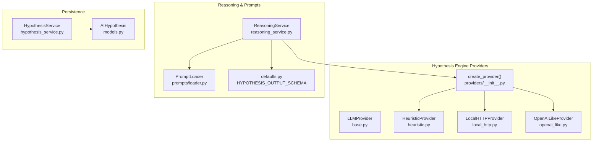
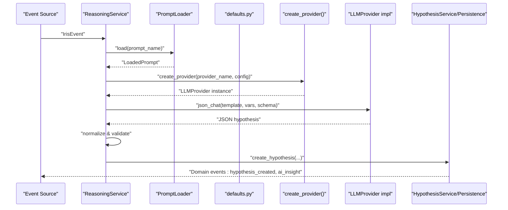
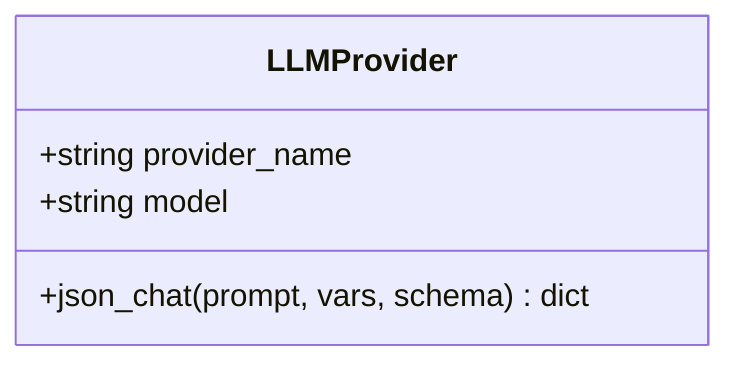
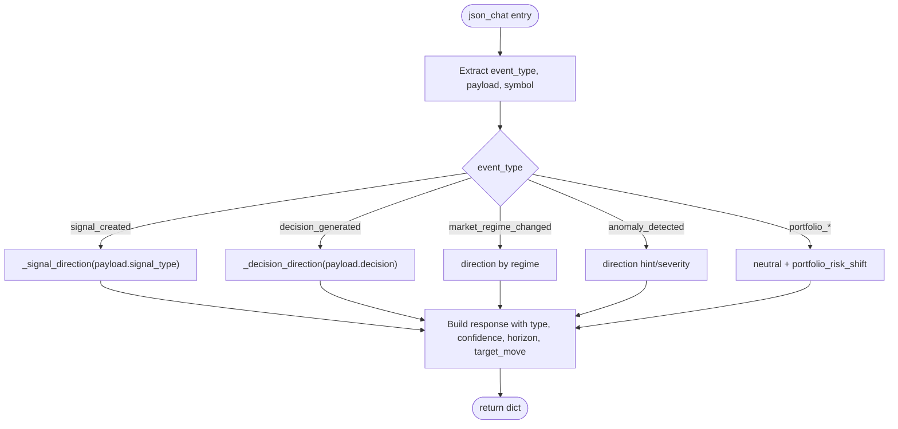
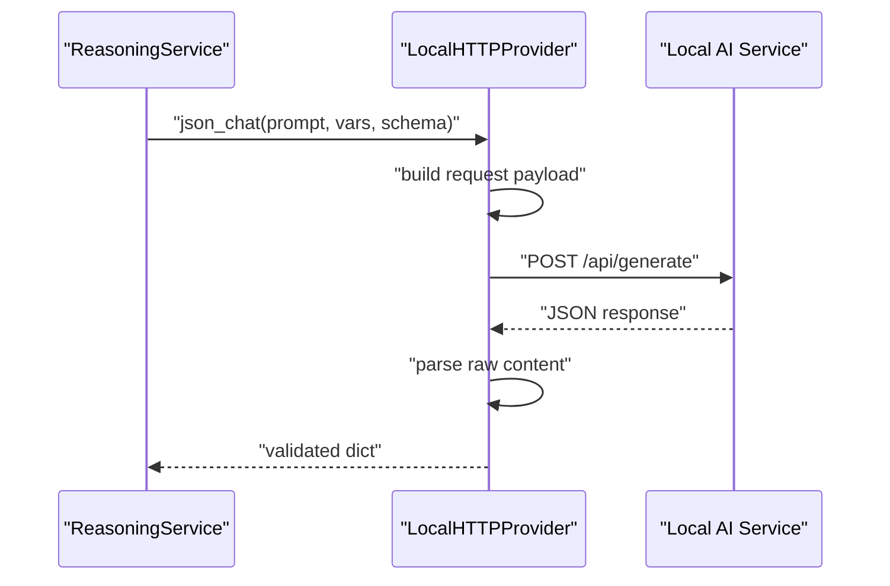
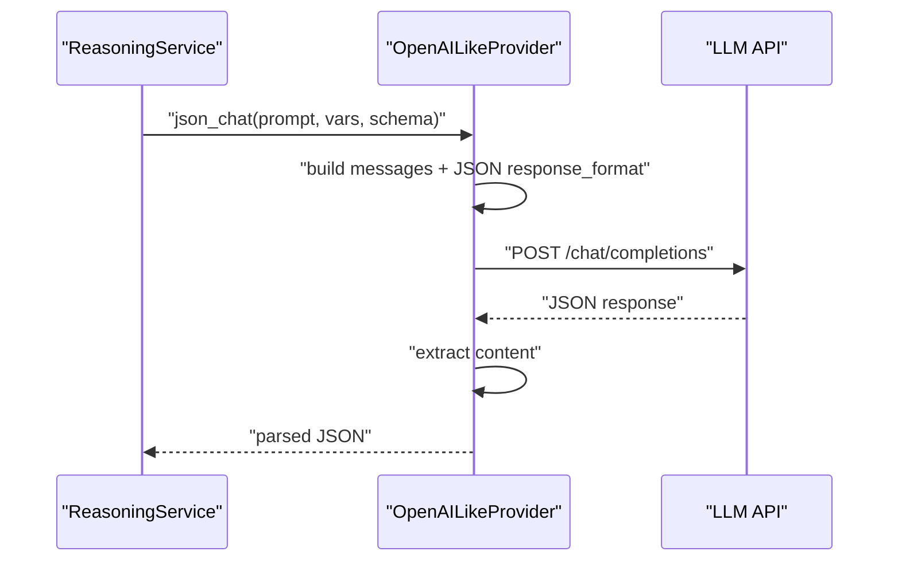
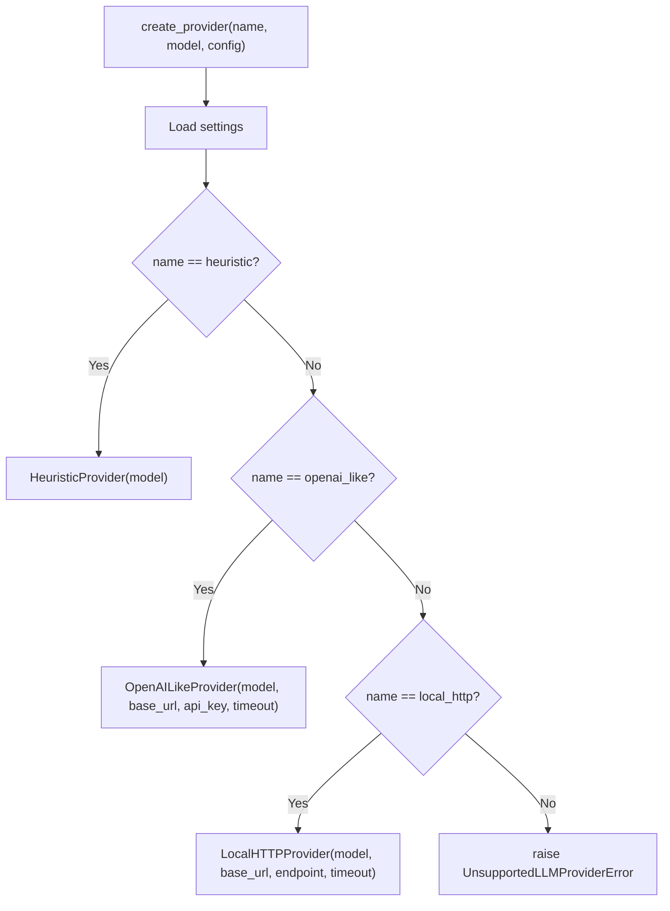
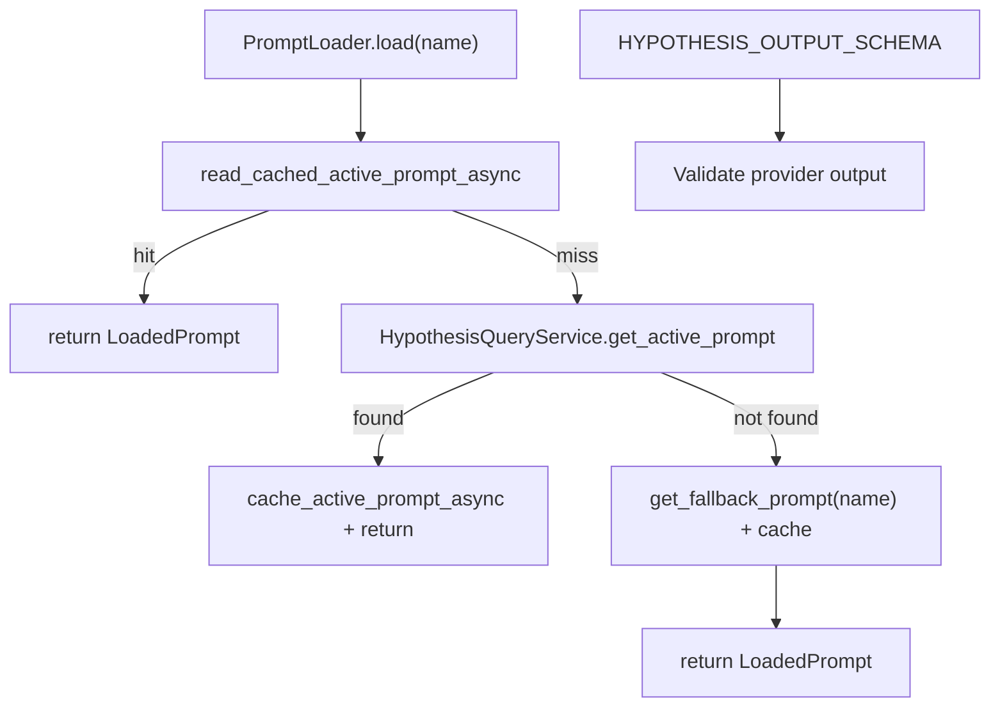
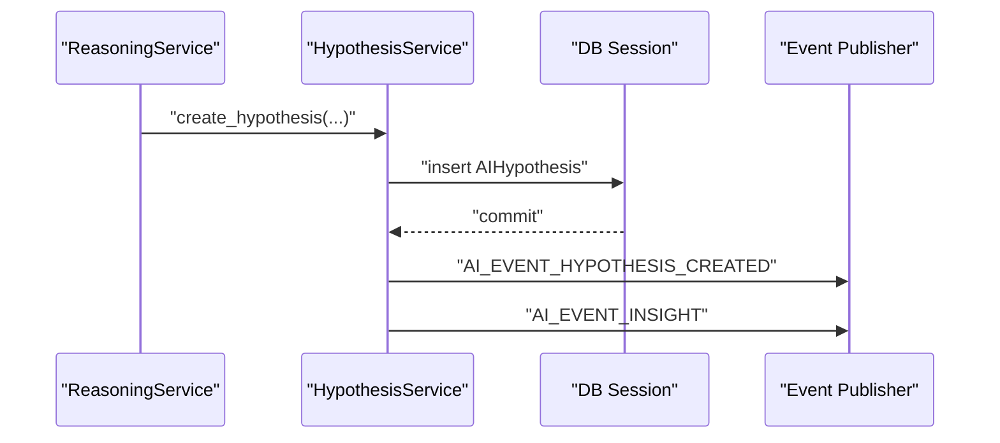
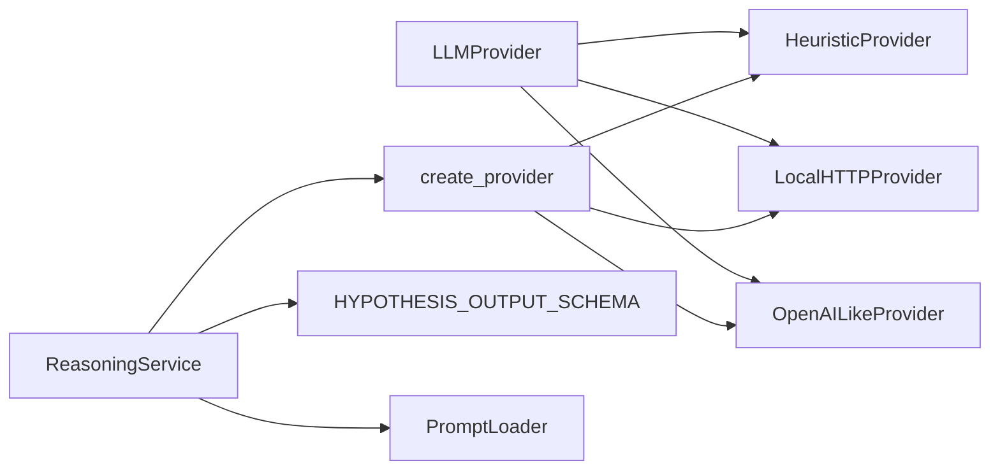

# Provider Integration

<cite>
**Referenced Files in This Document**
- [base.py](file://src/apps/hypothesis_engine/providers/base.py)
- [heuristic.py](file://src/apps/hypothesis_engine/providers/heuristic.py)
- [local_http.py](file://src/apps/hypothesis_engine/providers/local_http.py)
- [openai_like.py](file://src/apps/hypothesis_engine/providers/openai_like.py)
- [__init__.py](file://src/apps/hypothesis_engine/providers/__init__.py)
- [constants.py](file://src/apps/hypothesis_engine/constants.py)
- [models.py](file://src/apps/hypothesis_engine/models.py)
- [reasoning_service.py](file://src/apps/hypothesis_engine/agents/reasoning_service.py)
- [loader.py](file://src/apps/hypothesis_engine/prompts/loader.py)
- [defaults.py](file://src/apps/hypothesis_engine/prompts/defaults.py)
- [hypothesis_service.py](file://src/apps/hypothesis_engine/services/hypothesis_service.py)
</cite>

## Table of Contents
1. [Introduction](#introduction)
2. [Project Structure](#project-structure)
3. [Core Components](#core-components)
4. [Architecture Overview](#architecture-overview)
5. [Detailed Component Analysis](#detailed-component-analysis)
6. [Dependency Analysis](#dependency-analysis)
7. [Performance Considerations](#performance-considerations)
8. [Troubleshooting Guide](#troubleshooting-guide)
9. [Conclusion](#conclusion)
10. [Appendices](#appendices)

## Introduction
This document explains the hypothesis provider integration system used to generate market hypotheses from triggering events. It covers the provider interface architecture, the base provider class, and concrete implementations for:
- Heuristic provider: rule-based generation
- Local HTTP provider: custom AI services via HTTP
- OpenAI-like provider: cloud-based LLMs

It also documents configuration, authentication, rate limiting, error handling, fallback mechanisms, provider selection criteria, performance characteristics, cost considerations, and how to implement custom providers and integrate new AI backends.

## Project Structure
The provider integration lives under the hypothesis engine subsystem and interacts with prompts, reasoning, and persistence layers.

**Diagram sources**
- [base.py:7-16](file://src/apps/hypothesis_engine/providers/base.py#L7-L16)
- [heuristic.py:27-66](file://src/apps/hypothesis_engine/providers/heuristic.py#L27-L66)
- [local_http.py:11-50](file://src/apps/hypothesis_engine/providers/local_http.py#L11-L50)
- [openai_like.py:25-65](file://src/apps/hypothesis_engine/providers/openai_like.py#L25-L65)
- [__init__.py:14-34](file://src/apps/hypothesis_engine/providers/__init__.py#L14-L34)
- [reasoning_service.py:18-60](file://src/apps/hypothesis_engine/agents/reasoning_service.py#L18-L60)
- [loader.py:38-70](file://src/apps/hypothesis_engine/prompts/loader.py#L38-L70)
- [defaults.py:15-68](file://src/apps/hypothesis_engine/prompts/defaults.py#L15-L68)
- [models.py:37-115](file://src/apps/hypothesis_engine/models.py#L37-L115)
- [hypothesis_service.py:21-106](file://src/apps/hypothesis_engine/services/hypothesis_service.py#L21-L106)

**Section sources**
- [base.py:7-16](file://src/apps/hypothesis_engine/providers/base.py#L7-L16)
- [constants.py:17-20](file://src/apps/hypothesis_engine/constants.py#L17-L20)
- [models.py:37-115](file://src/apps/hypothesis_engine/models.py#L37-L115)

## Core Components
- LLMProvider: Abstract base interface defining the provider contract for asynchronous JSON chat generation.
- HeuristicProvider: Rule-based generator that derives hypothesis attributes from event metadata.
- LocalHTTPProvider: Calls a local HTTP endpoint to produce JSON hypotheses.
- OpenAILikeProvider: Sends structured prompts to an OpenAI-compatible API and parses JSON responses.
- create_provider: Factory that instantiates providers based on configuration and settings.
- ReasoningService: Orchestrates prompt loading, provider selection, execution, and fallback behavior.
- PromptLoader and defaults: Manage prompt templates, caching, and output schema enforcement.
- HypothesisService: Persists generated hypotheses and emits domain events.

**Section sources**
- [base.py:7-16](file://src/apps/hypothesis_engine/providers/base.py#L7-L16)
- [heuristic.py:27-66](file://src/apps/hypothesis_engine/providers/heuristic.py#L27-L66)
- [local_http.py:11-50](file://src/apps/hypothesis_engine/providers/local_http.py#L11-L50)
- [openai_like.py:25-65](file://src/apps/hypothesis_engine/providers/openai_like.py#L25-L65)
- [__init__.py:14-34](file://src/apps/hypothesis_engine/providers/__init__.py#L14-L34)
- [reasoning_service.py:18-60](file://src/apps/hypothesis_engine/agents/reasoning_service.py#L18-L60)
- [loader.py:38-70](file://src/apps/hypothesis_engine/prompts/loader.py#L38-L70)
- [defaults.py:15-68](file://src/apps/hypothesis_engine/prompts/defaults.py#L15-L68)
- [hypothesis_service.py:21-106](file://src/apps/hypothesis_engine/services/hypothesis_service.py#L21-L106)

## Architecture Overview
The system integrates event-driven triggers with a reasoning pipeline that selects a provider, executes it against a prompt, validates the output, and persists the hypothesis.

**Diagram sources**
- [reasoning_service.py:23-59](file://src/apps/hypothesis_engine/agents/reasoning_service.py#L23-L59)
- [loader.py:46-66](file://src/apps/hypothesis_engine/prompts/loader.py#L46-L66)
- [defaults.py:15-29](file://src/apps/hypothesis_engine/prompts/defaults.py#L15-L29)
- [__init__.py:14-34](file://src/apps/hypothesis_engine/providers/__init__.py#L14-L34)
- [hypothesis_service.py:28-105](file://src/apps/hypothesis_engine/services/hypothesis_service.py#L28-L105)

## Detailed Component Analysis

### Base Provider Interface
The base interface defines a single asynchronous method to produce structured JSON from a prompt and context variables, constrained by a JSON schema.

**Diagram sources**
- [base.py:7-16](file://src/apps/hypothesis_engine/providers/base.py#L7-L16)

**Section sources**
- [base.py:7-16](file://src/apps/hypothesis_engine/providers/base.py#L7-L16)

### Heuristic Provider
Generates hypotheses deterministically from event metadata without external calls. It infers direction, type, confidence, horizon, and target move based on event type and payload.

**Diagram sources**
- [heuristic.py:30-66](file://src/apps/hypothesis_engine/providers/heuristic.py#L30-L66)
- [heuristic.py:9-25](file://src/apps/hypothesis_engine/providers/heuristic.py#L9-L25)

**Section sources**
- [heuristic.py:27-66](file://src/apps/hypothesis_engine/providers/heuristic.py#L27-L66)
- [constants.py:28-29](file://src/apps/hypothesis_engine/constants.py#L28-L29)

### Local HTTP Provider
Calls a local HTTP endpoint with a standardized request body containing model, prompt, context, and schema. It supports flexible endpoints and timeouts.

**Diagram sources**
- [local_http.py:27-50](file://src/apps/hypothesis_engine/providers/local_http.py#L27-L50)

**Section sources**
- [local_http.py:11-50](file://src/apps/hypothesis_engine/providers/local_http.py#L11-L50)

### OpenAI-like Provider
Sends a structured chat completion request to an OpenAI-compatible API with Authorization header support and robust content extraction.

**Diagram sources**
- [openai_like.py:41-65](file://src/apps/hypothesis_engine/providers/openai_like.py#L41-L65)

**Section sources**
- [openai_like.py:25-65](file://src/apps/hypothesis_engine/providers/openai_like.py#L25-L65)

### Provider Factory and Selection
The factory chooses a provider implementation based on configuration and settings, with sensible defaults and validation.

**Diagram sources**
- [__init__.py:14-34](file://src/apps/hypothesis_engine/providers/__init__.py#L14-L34)

**Section sources**
- [__init__.py:14-34](file://src/apps/hypothesis_engine/providers/__init__.py#L14-L34)
- [constants.py:17-19](file://src/apps/hypothesis_engine/constants.py#L17-L19)

### Prompt Loading and Schema Enforcement
Prompts are loaded from cache or database with a fallback to defaults. The output schema ensures consistent JSON structure.

**Diagram sources**
- [loader.py:46-66](file://src/apps/hypothesis_engine/prompts/loader.py#L46-L66)
- [defaults.py:15-29](file://src/apps/hypothesis_engine/prompts/defaults.py#L15-L29)

**Section sources**
- [loader.py:38-70](file://src/apps/hypothesis_engine/prompts/loader.py#L38-L70)
- [defaults.py:15-68](file://src/apps/hypothesis_engine/prompts/defaults.py#L15-L68)

### Hypothesis Persistence and Events
Generated hypotheses are persisted with normalized fields and emitted as domain events for downstream consumption.

**Diagram sources**
- [hypothesis_service.py:28-105](file://src/apps/hypothesis_engine/services/hypothesis_service.py#L28-L105)
- [models.py:37-67](file://src/apps/hypothesis_engine/models.py#L37-L67)

**Section sources**
- [hypothesis_service.py:21-106](file://src/apps/hypothesis_engine/services/hypothesis_service.py#L21-L106)
- [models.py:37-115](file://src/apps/hypothesis_engine/models.py#L37-L115)

## Dependency Analysis
Provider implementations depend on the base interface and share common concerns: prompt composition, JSON schema validation, and normalization. The factory centralizes instantiation and configuration resolution.

**Diagram sources**
- [base.py:7-16](file://src/apps/hypothesis_engine/providers/base.py#L7-L16)
- [heuristic.py:27-66](file://src/apps/hypothesis_engine/providers/heuristic.py#L27-L66)
- [local_http.py:11-50](file://src/apps/hypothesis_engine/providers/local_http.py#L11-L50)
- [openai_like.py:25-65](file://src/apps/hypothesis_engine/providers/openai_like.py#L25-L65)
- [__init__.py:14-34](file://src/apps/hypothesis_engine/providers/__init__.py#L14-L34)
- [reasoning_service.py:18-60](file://src/apps/hypothesis_engine/agents/reasoning_service.py#L18-L60)
- [defaults.py:15-29](file://src/apps/hypothesis_engine/prompts/defaults.py#L15-L29)
- [loader.py:38-70](file://src/apps/hypothesis_engine/prompts/loader.py#L38-L70)

**Section sources**
- [__init__.py:14-34](file://src/apps/hypothesis_engine/providers/__init__.py#L14-L34)
- [reasoning_service.py:18-60](file://src/apps/hypothesis_engine/agents/reasoning_service.py#L18-L60)

## Performance Considerations
- Latency
  - HeuristicProvider: near-zero latency; deterministic computation.
  - LocalHTTPProvider: depends on network and service throughput; configurable timeout.
  - OpenAILikeProvider: depends on API latency and rate limits.
- Throughput
  - HeuristicProvider scales linearly with CPU cores.
  - LocalHTTPProvider throughput bounded by service capacity and concurrency.
  - OpenAILikeProvider throughput governed by provider rate limits and retries.
- Caching
  - Prompt caching reduces repeated DB loads and improves cold-start performance.
- Concurrency
  - Async I/O in providers enables concurrent requests; tune timeouts and connection pools accordingly.

[No sources needed since this section provides general guidance]

## Troubleshooting Guide
- Unsupported provider
  - Symptom: Instantiation error for unknown provider name.
  - Action: Verify provider name constants and registration in the factory.
  - Section sources
    - [constants.py:17-19](file://src/apps/hypothesis_engine/constants.py#L17-L19)
    - [__init__.py:34](file://src/apps/hypothesis_engine/providers/__init__.py#L34)
- Provider failures
  - Symptom: Exceptions during provider execution.
  - Behavior: Automatic fallback to HeuristicProvider with rule-based output.
  - Section sources
    - [reasoning_service.py:34-41](file://src/apps/hypothesis_engine/agents/reasoning_service.py#L34-L41)
- Malformed JSON responses
  - Symptom: Non-dict or invalid JSON returned by provider.
  - Behavior: Normalization clamps values and falls back to defaults; ensure schema compliance.
  - Section sources
    - [reasoning_service.py:42-59](file://src/apps/hypothesis_engine/agents/reasoning_service.py#L42-L59)
    - [defaults.py:15-29](file://src/apps/hypothesis_engine/prompts/defaults.py#L15-L29)
- Authentication errors
  - Symptom: 401/403 from OpenAI-like API.
  - Action: Validate API key and base URL; check Authorization header propagation.
  - Section sources
    - [openai_like.py:56-58](file://src/apps/hypothesis_engine/providers/openai_like.py#L56-L58)
- Network timeouts
  - Symptom: HTTP client timeouts for local or remote providers.
  - Action: Increase timeout values and monitor upstream availability.
  - Section sources
    - [local_http.py:20](file://src/apps/hypothesis_engine/providers/local_http.py#L20)
    - [openai_like.py:34](file://src/apps/hypothesis_engine/providers/openai_like.py#L34)

## Conclusion
The provider integration system offers a flexible, extensible framework for generating market hypotheses. It balances deterministic rule-based generation with configurable cloud and local HTTP integrations, ensuring resilience via fallbacks and schema enforcement. By leveraging prompt caching, structured schemas, and a centralized factory, the system supports rapid iteration and safe deployment of new AI backends.

[No sources needed since this section summarizes without analyzing specific files]

## Appendices

### Provider Configuration and Authentication
- HeuristicProvider
  - No external configuration required.
  - Section sources
    - [heuristic.py:27](file://src/apps/hypothesis_engine/providers/heuristic.py#L27)
- LocalHTTPProvider
  - Config keys: model, base_url, endpoint, timeout.
  - Section sources
    - [local_http.py:14-26](file://src/apps/hypothesis_engine/providers/local_http.py#L14-L26)
    - [__init__.py:27-33](file://src/apps/hypothesis_engine/providers/__init__.py#L27-L33)
- OpenAILikeProvider
  - Config keys: model, base_url, api_key, timeout.
  - Authentication: Bearer token via Authorization header.
  - Section sources
    - [openai_like.py:28-39](file://src/apps/hypothesis_engine/providers/openai_like.py#L28-L39)
    - [openai_like.py:56-58](file://src/apps/hypothesis_engine/providers/openai_like.py#L56-L58)
    - [__init__.py:20-26](file://src/apps/hypothesis_engine/providers/__init__.py#L20-L26)

### Rate Limiting and Backoff
- Built-in controls
  - Per-request timeouts in providers.
  - Prompt caching reduces repeated loads.
- Recommendations
  - Apply upstream rate limits and exponential backoff for cloud APIs.
  - Use circuit breakers for transient failures.
- Section sources
  - [local_http.py:38](file://src/apps/hypothesis_engine/providers/local_http.py#L38)
  - [openai_like.py:59](file://src/apps/hypothesis_engine/providers/openai_like.py#L59)
  - [loader.py:47-49](file://src/apps/hypothesis_engine/prompts/loader.py#L47-L49)

### Cost Considerations
- HeuristicProvider: negligible operational cost.
- LocalHTTPProvider: depends on local infrastructure utilization.
- OpenAILikeProvider: proportional to token usage and request frequency; enable caching and schema-constrained prompts to reduce overhead.
- Section sources
  - [openai_like.py:41-55](file://src/apps/hypothesis_engine/providers/openai_like.py#L41-L55)

### Provider Selection Criteria
- Determinism and speed: choose HeuristicProvider for predictable, low-latency outputs.
- Flexibility and quality: choose OpenAI-like provider for advanced reasoning.
- Self-hosted control: choose LocalHTTPProvider for internal services.
- Section sources
  - [constants.py:17-19](file://src/apps/hypothesis_engine/constants.py#L17-L19)
  - [reasoning_service.py:27-28](file://src/apps/hypothesis_engine/agents/reasoning_service.py#L27-L28)

### Implementing a Custom Provider
Steps:
1. Subclass the base provider and implement the asynchronous JSON chat method.
2. Add a constant for the provider name and register it in the factory.
3. Ensure the response conforms to the output schema.
4. Integrate with prompt loading and reasoning service.
5. Add tests covering success, failure, and fallback paths.

Example references:
- Base interface and method signature
  - [base.py:13-15](file://src/apps/hypothesis_engine/providers/base.py#L13-L15)
- Factory registration and instantiation
  - [__init__.py:18-34](file://src/apps/hypothesis_engine/providers/__init__.py#L18-L34)
- Output schema enforcement
  - [defaults.py:15-29](file://src/apps/hypothesis_engine/prompts/defaults.py#L15-L29)
- Fallback behavior
  - [reasoning_service.py:34-41](file://src/apps/hypothesis_engine/agents/reasoning_service.py#L34-L41)

**Section sources**
- [base.py:7-16](file://src/apps/hypothesis_engine/providers/base.py#L7-L16)
- [__init__.py:14-34](file://src/apps/hypothesis_engine/providers/__init__.py#L14-L34)
- [defaults.py:15-29](file://src/apps/hypothesis_engine/prompts/defaults.py#L15-L29)
- [reasoning_service.py:34-41](file://src/apps/hypothesis_engine/agents/reasoning_service.py#L34-L41)