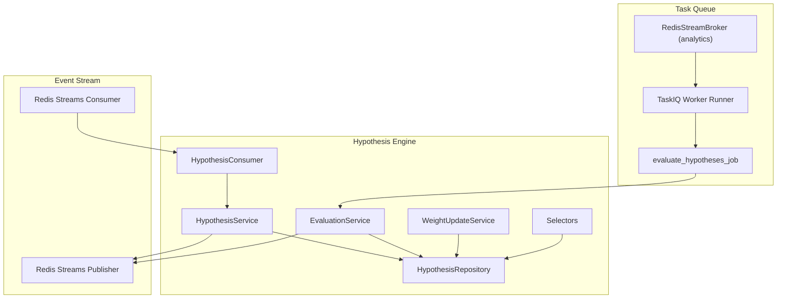
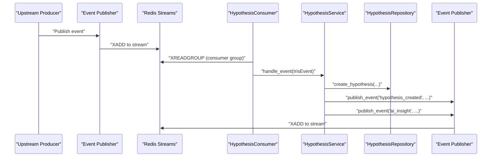
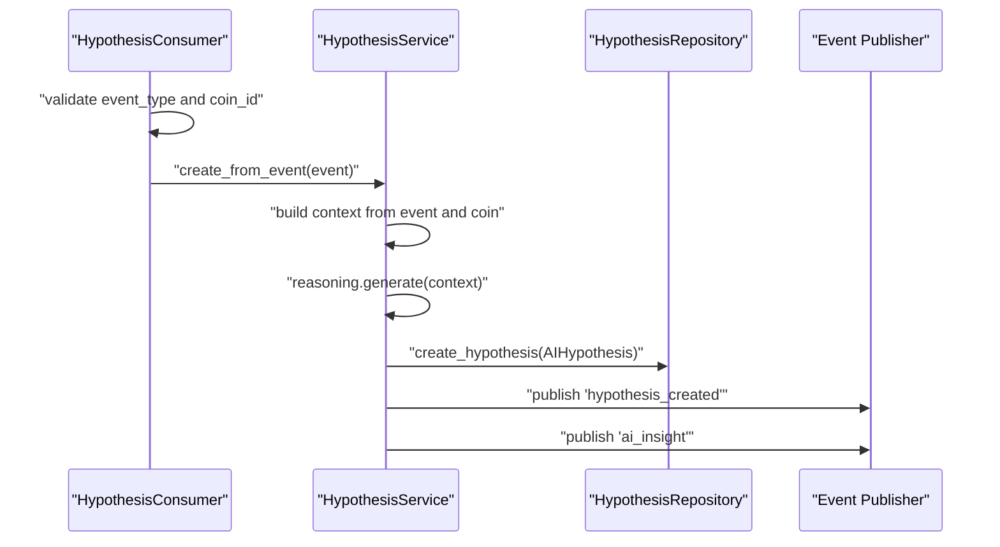
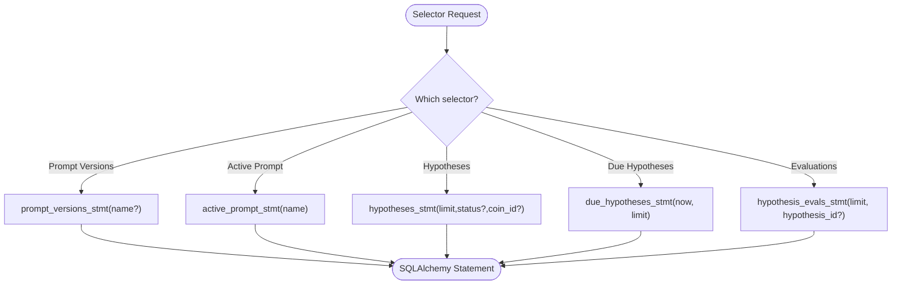
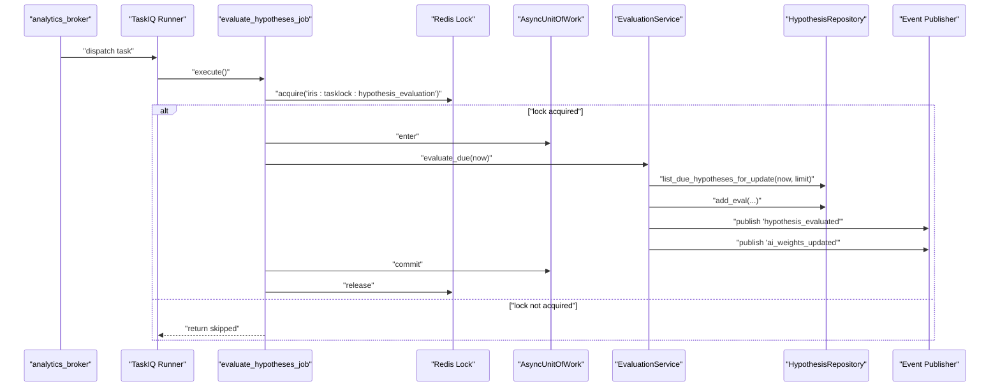
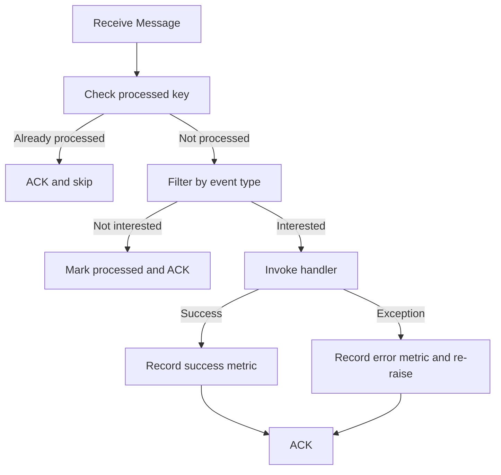
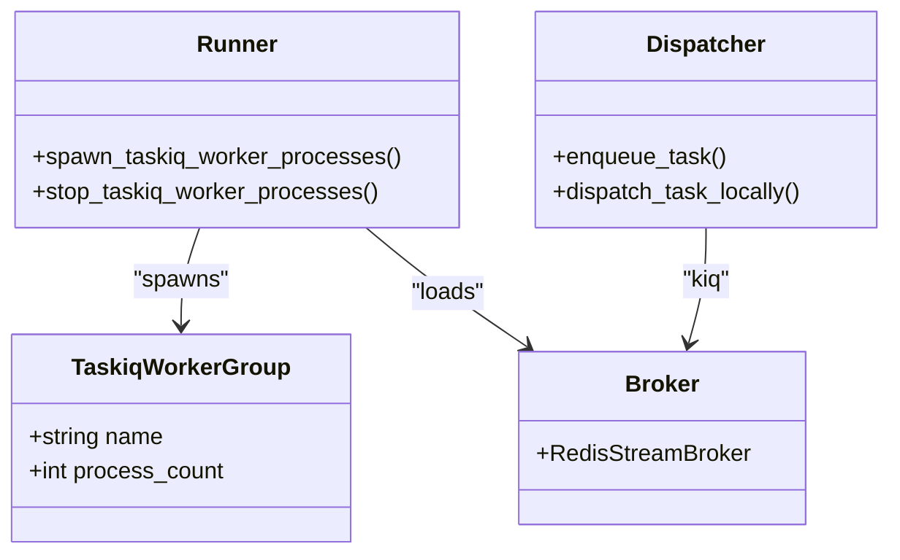
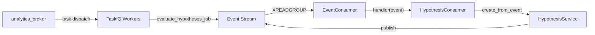
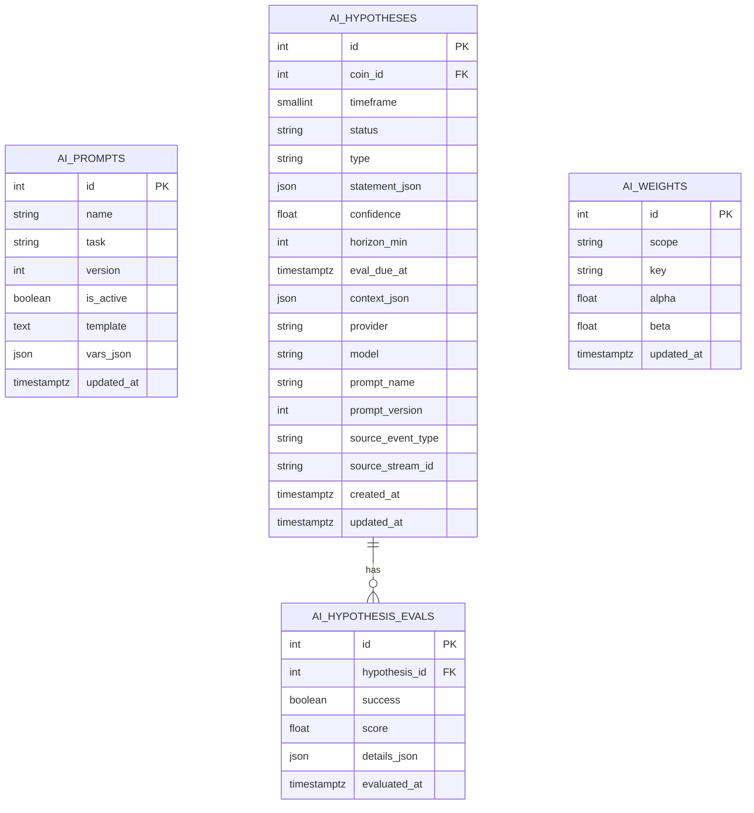
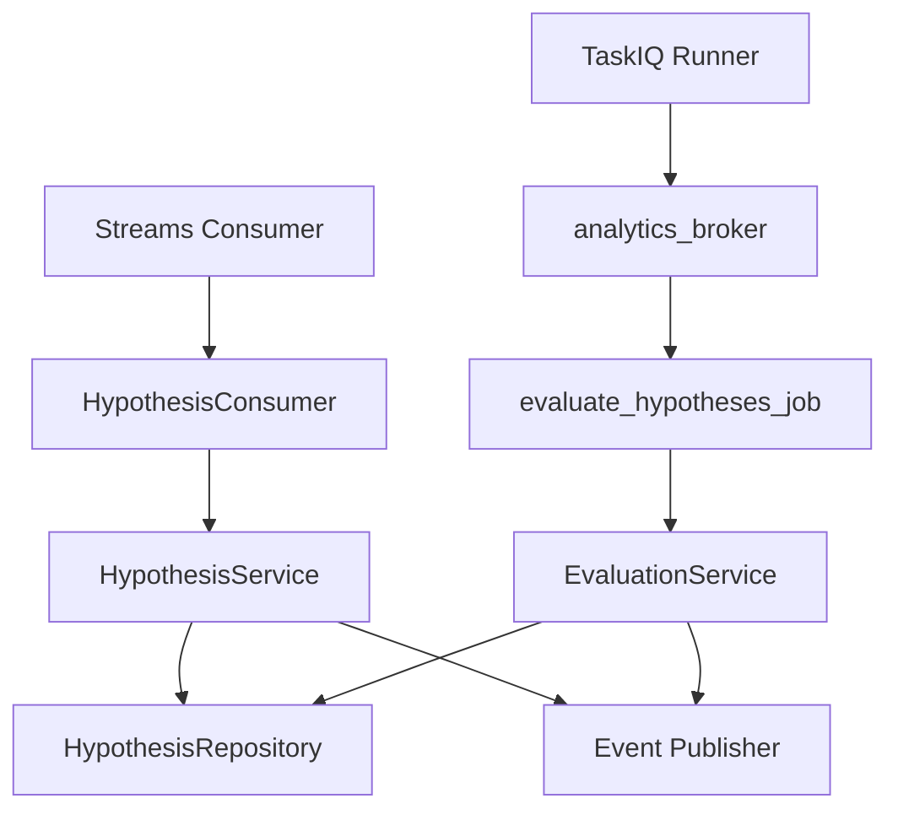

# Workflow and Tasks

<cite>
**Referenced Files in This Document**
- [models.py](file://src/apps/hypothesis_engine/models.py)
- [schemas.py](file://src/apps/hypothesis_engine/schemas.py)
- [constants.py](file://src/apps/hypothesis_engine/constants.py)
- [repositories.py](file://src/apps/hypothesis_engine/repositories.py)
- [selectors.py](file://src/apps/hypothesis_engine/selectors/hypothesis_selectors.py)
- [hypothesis_service.py](file://src/apps/hypothesis_engine/services/hypothesis_service.py)
- [evaluation_service.py](file://src/apps/hypothesis_engine/services/evaluation_service.py)
- [weight_update_service.py](file://src/apps/hypothesis_engine/services/weight_update_service.py)
- [hypothesis_tasks.py](file://src/apps/hypothesis_engine/tasks/hypothesis_tasks.py)
- [hypothesis_consumer.py](file://src/apps/hypothesis_engine/consumers/hypothesis_consumer.py)
- [broker.py](file://src/runtime/orchestration/broker.py)
- [dispatcher.py](file://src/runtime/orchestration/dispatcher.py)
- [runner.py](file://src/runtime/orchestration/runner.py)
- [consumer.py](file://src/runtime/streams/consumer.py)
- [publisher.py](file://src/runtime/streams/publisher.py)
- [router.py](file://src/runtime/streams/router.py)
</cite>

## Table of Contents
1. [Introduction](#introduction)
2. [Project Structure](#project-structure)
3. [Core Components](#core-components)
4. [Architecture Overview](#architecture-overview)
5. [Detailed Component Analysis](#detailed-component-analysis)
6. [Dependency Analysis](#dependency-analysis)
7. [Performance Considerations](#performance-considerations)
8. [Troubleshooting Guide](#troubleshooting-guide)
9. [Conclusion](#conclusion)
10. [Appendices](#appendices)

## Introduction
This document explains the hypothesis workflow orchestration and task management system. It covers how hypotheses are generated from upstream events, how evaluation tasks are scheduled and executed asynchronously, and how event-driven consumers route and process work. It also documents selector patterns for filtering and routing, task coordination via distributed locks, workflow states, error handling, retry and recovery strategies, prioritization, resource management, scaling, integration with the task queue and event streaming systems, and monitoring and performance optimization techniques.

## Project Structure
The hypothesis engine spans several layers:
- Domain models and schemas define the persistent state and event payloads.
- Services encapsulate business logic for generating, evaluating, and updating weights.
- Consumers subscribe to the event stream and trigger hypothesis creation.
- Tasks schedule periodic evaluation jobs via a task queue with distributed locking.
- The orchestration layer wires brokers, dispatchers, and workers.
- The streams layer provides Redis-backed event ingestion, routing, and publishing.

**Diagram sources**
- [consumer.py:190-226](file://src/runtime/streams/consumer.py#L190-L226)
- [publisher.py:87-101](file://src/runtime/streams/publisher.py#L87-L101)
- [hypothesis_consumer.py:14-19](file://src/apps/hypothesis_engine/consumers/hypothesis_consumer.py#L14-L19)
- [hypothesis_service.py:28-105](file://src/apps/hypothesis_engine/services/hypothesis_service.py#L28-L105)
- [repositories.py:15-124](file://src/apps/hypothesis_engine/repositories.py#L15-L124)
- [selectors.py:12-57](file://src/apps/hypothesis_engine/selectors/hypothesis_selectors.py#L12-L57)
- [broker.py:12-22](file://src/runtime/orchestration/broker.py#L12-L22)
- [runner.py:57-78](file://src/runtime/orchestration/runner.py#L57-L78)
- [hypothesis_tasks.py:12-23](file://src/apps/hypothesis_engine/tasks/hypothesis_tasks.py#L12-L23)

**Section sources**
- [models.py:15-115](file://src/apps/hypothesis_engine/models.py#L15-L115)
- [schemas.py:9-84](file://src/apps/hypothesis_engine/schemas.py#L9-L84)
- [constants.py:1-50](file://src/apps/hypothesis_engine/constants.py#L1-L50)
- [repositories.py:15-124](file://src/apps/hypothesis_engine/repositories.py#L15-L124)
- [selectors.py:12-57](file://src/apps/hypothesis_engine/selectors/hypothesis_selectors.py#L12-L57)
- [hypothesis_service.py:21-106](file://src/apps/hypothesis_engine/services/hypothesis_service.py#L21-L106)
- [hypothesis_tasks.py:1-23](file://src/apps/hypothesis_engine/tasks/hypothesis_tasks.py#L1-L23)
- [hypothesis_consumer.py:10-19](file://src/apps/hypothesis_engine/consumers/hypothesis_consumer.py#L10-L19)
- [broker.py:1-23](file://src/runtime/orchestration/broker.py#L1-L23)
- [runner.py:15-118](file://src/runtime/orchestration/runner.py#L15-L118)
- [consumer.py:49-226](file://src/runtime/streams/consumer.py#L49-L226)
- [publisher.py:22-101](file://src/runtime/streams/publisher.py#L22-L101)
- [router.py:17-63](file://src/runtime/streams/router.py#L17-L63)

## Core Components
- Models and Schemas: Define persistent entities (prompts, hypotheses, evaluations, weights) and Pydantic DTOs for transport.
- Services:
  - HypothesisService: Creates hypotheses from supported upstream events, publishes downstream events.
  - EvaluationService: Selects due hypotheses, evaluates them, persists outcomes, and publishes evaluation events.
  - WeightUpdateService: Updates weights for hypothesis types using Bayesian updates.
- Repositories: CRUD and query helpers for the hypothesis domain.
- Selectors: SQL builders for prompt/version selection, listing hypotheses, due hypotheses, and evaluations.
- Consumers: Event-driven consumer that triggers hypothesis creation.
- Tasks: Periodic job that evaluates due hypotheses under a distributed lock.
- Orchestration: TaskIQ broker wiring and worker runner for analytics tasks.
- Streams: Redis-backed event publisher/consumer with idempotence, grouping, and metrics recording.

**Section sources**
- [models.py:15-115](file://src/apps/hypothesis_engine/models.py#L15-L115)
- [schemas.py:9-84](file://src/apps/hypothesis_engine/schemas.py#L9-L84)
- [constants.py:1-50](file://src/apps/hypothesis_engine/constants.py#L1-L50)
- [hypothesis_service.py:21-106](file://src/apps/hypothesis_engine/services/hypothesis_service.py#L21-L106)
- [evaluation_service.py](file://src/apps/hypothesis_engine/services/evaluation_service.py)
- [weight_update_service.py](file://src/apps/hypothesis_engine/services/weight_update_service.py)
- [repositories.py:15-124](file://src/apps/hypothesis_engine/repositories.py#L15-L124)
- [selectors.py:12-57](file://src/apps/hypothesis_engine/selectors/hypothesis_selectors.py#L12-L57)
- [hypothesis_consumer.py:10-19](file://src/apps/hypothesis_engine/consumers/hypothesis_consumer.py#L10-L19)
- [hypothesis_tasks.py:1-23](file://src/apps/hypothesis_engine/tasks/hypothesis_tasks.py#L1-L23)
- [broker.py:1-23](file://src/runtime/orchestration/broker.py#L1-L23)
- [runner.py:15-118](file://src/runtime/orchestration/runner.py#L15-L118)
- [consumer.py:49-226](file://src/runtime/streams/consumer.py#L49-L226)
- [publisher.py:22-101](file://src/runtime/streams/publisher.py#L22-L101)

## Architecture Overview
The system integrates event streaming and task queues:
- Upstream events (signals, anomalies, decisions, regime changes, portfolio updates) are routed to the hypothesis worker group.
- HypothesisConsumer validates and forwards events to HypothesisService, which persists a new hypothesis and emits “hypothesis_created” and “ai_insight” events.
- A periodic task (evaluate_hypotheses_job) runs under a distributed lock to select due hypotheses and evaluate them, publishing “hypothesis_evaluated” and “ai_weights_updated” events.
- Streams and TaskIQ workers coordinate processing, with idempotent consumption and grouped delivery.

**Diagram sources**
- [publisher.py:87-101](file://src/runtime/streams/publisher.py#L87-L101)
- [consumer.py:190-226](file://src/runtime/streams/consumer.py#L190-L226)
- [hypothesis_consumer.py:14-19](file://src/apps/hypothesis_engine/consumers/hypothesis_consumer.py#L14-L19)
- [hypothesis_service.py:28-105](file://src/apps/hypothesis_engine/services/hypothesis_service.py#L28-L105)
- [repositories.py:46-57](file://src/apps/hypothesis_engine/repositories.py#L46-L57)

## Detailed Component Analysis

### Hypothesis Generation Workflow
- Supported source events are defined centrally and routed to the hypothesis worker group.
- HypothesisConsumer validates event type and coin_id, then delegates to HypothesisService within a unit of work.
- HypothesisService builds context from the event and coin metadata, calls the reasoning agent to generate a structured statement, creates the hypothesis record, and publishes two downstream events: “hypothesis_created” and “ai_insight”.

**Diagram sources**
- [hypothesis_consumer.py:14-19](file://src/apps/hypothesis_engine/consumers/hypothesis_consumer.py#L14-L19)
- [hypothesis_service.py:28-105](file://src/apps/hypothesis_engine/services/hypothesis_service.py#L28-L105)
- [repositories.py:46-57](file://src/apps/hypothesis_engine/repositories.py#L46-L57)
- [publisher.py:87-101](file://src/runtime/streams/publisher.py#L87-L101)

**Section sources**
- [constants.py:31-50](file://src/apps/hypothesis_engine/constants.py#L31-L50)
- [router.py:47-54](file://src/runtime/streams/router.py#L47-L54)
- [hypothesis_consumer.py:14-19](file://src/apps/hypothesis_engine/consumers/hypothesis_consumer.py#L14-L19)
- [hypothesis_service.py:28-105](file://src/apps/hypothesis_engine/services/hypothesis_service.py#L28-L105)

### Selector Patterns for Filtering and Routing
- Prompt selection: Query latest active prompt by name or list versions ordered by name/version/id.
- Hypotheses listing: Filter by status and coin_id, order by creation time; due hypotheses filtered by eval_due_at and preloaded with evaluations.
- Evaluations listing: Order by evaluated_at descending, optionally filter by hypothesis_id and preload hypothesis.

**Diagram sources**
- [selectors.py:12-57](file://src/apps/hypothesis_engine/selectors/hypothesis_selectors.py#L12-L57)

**Section sources**
- [selectors.py:12-57](file://src/apps/hypothesis_engine/selectors/hypothesis_selectors.py#L12-L57)

### Task Scheduling and Asynchronous Processing
- Task definition: evaluate_hypotheses_job is registered as a task on the analytics broker.
- Distributed lock: The job attempts to acquire a Redis-based lock keyed by a fixed namespace; if already acquired, it skips execution and returns a skip reason.
- Execution scope: Within a Unit of Work, the job queries due hypotheses, invokes EvaluationService to compute outcomes, persists evaluations, and publishes evaluation events.
- Worker processes: TaskIQ workers are spawned per configured worker group; each worker listens on its broker and executes matching tasks.

**Diagram sources**
- [hypothesis_tasks.py:12-23](file://src/apps/hypothesis_engine/tasks/hypothesis_tasks.py#L12-L23)
- [runner.py:57-78](file://src/runtime/orchestration/runner.py#L57-L78)
- [broker.py:18-22](file://src/runtime/orchestration/broker.py#L18-L22)
- [evaluation_service.py](file://src/apps/hypothesis_engine/services/evaluation_service.py)
- [repositories.py:59-77](file://src/apps/hypothesis_engine/repositories.py#L59-L77)
- [publisher.py:87-101](file://src/runtime/streams/publisher.py#L87-L101)

**Section sources**
- [hypothesis_tasks.py:1-23](file://src/apps/hypothesis_engine/tasks/hypothesis_tasks.py#L1-L23)
- [broker.py:1-23](file://src/runtime/orchestration/broker.py#L1-L23)
- [runner.py:21-48](file://src/runtime/orchestration/runner.py#L21-L48)

### Workflow States, Error Handling, Retry, and Recovery
- Workflow states:
  - Hypothesis status transitions from “active” to “evaluated” after evaluation completes.
  - Evaluation records capture success, score, and details.
- Idempotent consumption:
  - Consumers track processed event ids in Redis and ACK processed messages; stale pending messages are reclaimed via autoclaim.
- Error handling:
  - Consumer handler exceptions are recorded via metrics and re-raised; Redis errors are logged and retried.
  - Task lock acquisition failures prevent overlapping executions; the job returns a skip status.
- Retry and recovery:
  - Stale idle messages are automatically claimed and reprocessed.
  - Task failures are isolated within the job; subsequent runs can retry due hypotheses.

**Diagram sources**
- [consumer.py:144-171](file://src/runtime/streams/consumer.py#L144-L171)

**Section sources**
- [constants.py:8-10](file://src/apps/hypothesis_engine/constants.py#L8-L10)
- [consumer.py:69-171](file://src/runtime/streams/consumer.py#L69-L171)
- [hypothesis_tasks.py:14-19](file://src/apps/hypothesis_engine/tasks/hypothesis_tasks.py#L14-L19)

### Task Coordination Mechanisms
- Distributed lock: The evaluation job uses a named Redis lock to ensure single execution across worker instances.
- Worker groups: Separate TaskIQ worker groups for general and analytics tasks; analytics group includes hypothesis tasks.
- Dispatcher: Enqueue tasks via broker.kiq; local dispatch mirrors remote enqueue.

**Diagram sources**
- [runner.py:15-118](file://src/runtime/orchestration/runner.py#L15-L118)
- [broker.py:1-23](file://src/runtime/orchestration/broker.py#L1-L23)
- [dispatcher.py:5-11](file://src/runtime/orchestration/dispatcher.py#L5-L11)

**Section sources**
- [runner.py:21-48](file://src/runtime/orchestration/runner.py#L21-L48)
- [dispatcher.py:5-11](file://src/runtime/orchestration/dispatcher.py#L5-L11)

### Integration with Task Queue and Event Streaming
- Task queue: Redis Streams-backed TaskIQ brokers; analytics broker is used for hypothesis evaluation.
- Event streaming: Redis Streams for upstream and downstream events; consumers use XREADGROUP with consumer groups; publishers use XADD on a background thread.
- Routing: Worker groups map to sets of event types; hypothesis worker group subscribes to multiple upstream event types.

**Diagram sources**
- [consumer.py:190-226](file://src/runtime/streams/consumer.py#L190-L226)
- [hypothesis_consumer.py:14-19](file://src/apps/hypothesis_engine/consumers/hypothesis_consumer.py#L14-L19)
- [hypothesis_service.py:28-105](file://src/apps/hypothesis_engine/services/hypothesis_service.py#L28-L105)
- [broker.py:18-22](file://src/runtime/orchestration/broker.py#L18-L22)
- [router.py:47-54](file://src/runtime/streams/router.py#L47-L54)

**Section sources**
- [router.py:17-63](file://src/runtime/streams/router.py#L17-L63)
- [consumer.py:49-226](file://src/runtime/streams/consumer.py#L49-L226)
- [publisher.py:22-101](file://src/runtime/streams/publisher.py#L22-L101)
- [broker.py:1-23](file://src/runtime/orchestration/broker.py#L1-L23)

### Data Model Overview

**Diagram sources**
- [models.py:15-115](file://src/apps/hypothesis_engine/models.py#L15-L115)

**Section sources**
- [models.py:15-115](file://src/apps/hypothesis_engine/models.py#L15-L115)
- [schemas.py:9-84](file://src/apps/hypothesis_engine/schemas.py#L9-L84)

## Dependency Analysis
- Consumers depend on services and repositories; services depend on repositories and the event publisher.
- Tasks depend on the analytics broker and evaluation services.
- Worker runners load appropriate task modules per group and listen on the correct broker.
- Streams consumers depend on Redis and metrics recorder protocol.

**Diagram sources**
- [hypothesis_consumer.py:14-19](file://src/apps/hypothesis_engine/consumers/hypothesis_consumer.py#L14-L19)
- [hypothesis_service.py:21-27](file://src/apps/hypothesis_engine/services/hypothesis_service.py#L21-L27)
- [repositories.py:15-124](file://src/apps/hypothesis_engine/repositories.py#L15-L124)
- [hypothesis_tasks.py:12-23](file://src/apps/hypothesis_engine/tasks/hypothesis_tasks.py#L12-L23)
- [evaluation_service.py](file://src/apps/hypothesis_engine/services/evaluation_service.py)
- [runner.py:38-46](file://src/runtime/orchestration/runner.py#L38-L46)
- [broker.py:18-22](file://src/runtime/orchestration/broker.py#L18-L22)
- [consumer.py:49-226](file://src/runtime/streams/consumer.py#L49-L226)

**Section sources**
- [hypothesis_consumer.py:10-19](file://src/apps/hypothesis_engine/consumers/hypothesis_consumer.py#L10-L19)
- [hypothesis_service.py:21-27](file://src/apps/hypothesis_engine/services/hypothesis_service.py#L21-L27)
- [hypothesis_tasks.py:12-23](file://src/apps/hypothesis_engine/tasks/hypothesis_tasks.py#L12-L23)
- [runner.py:27-48](file://src/runtime/orchestration/runner.py#L27-L48)
- [broker.py:1-23](file://src/runtime/orchestration/broker.py#L1-L23)
- [consumer.py:49-226](file://src/runtime/streams/consumer.py#L49-L226)

## Performance Considerations
- Throughput and batching:
  - Streams consumer reads in batches and supports blocking reads; tune batch_size and block_milliseconds for latency vs throughput.
  - Publisher drains writes on a background thread to avoid blocking the main loop.
- Idempotence and retries:
  - Processed keys TTL prevents duplicate processing; autoclaim reclaims stale messages for retry.
- Locking and contention:
  - Distributed lock prevents overlapping evaluation runs; tune lock timeout to match longest expected evaluation duration.
- Query efficiency:
  - Selectors pre-load related evaluations and order by time-sensitive fields to minimize round trips.
- Scaling:
  - Separate worker groups enable scaling analytics tasks independently.
  - Multiprocessing spawns multiple workers per group; configure worker counts per workload.

[No sources needed since this section provides general guidance]

## Troubleshooting Guide
- No hypotheses created:
  - Verify event type is in the supported set and coin_id is valid.
  - Confirm consumer group exists and messages are being read; check autoclaim for stale messages.
- Evaluation job not running:
  - Ensure analytics broker is configured and workers are started; confirm lock acquisition succeeds.
  - Check logs for Redis errors during task dispatch or execution.
- Duplicate processing:
  - Inspect processed keys TTL and ACK behavior; ensure handler exceptions are surfaced.
- Backpressure:
  - Increase batch_size or worker processes; monitor Redis stream backlog.

**Section sources**
- [constants.py:31-50](file://src/apps/hypothesis_engine/constants.py#L31-L50)
- [consumer.py:72-115](file://src/runtime/streams/consumer.py#L72-L115)
- [consumer.py:190-226](file://src/runtime/streams/consumer.py#L190-L226)
- [hypothesis_tasks.py:14-19](file://src/apps/hypothesis_engine/tasks/hypothesis_tasks.py#L14-L19)
- [runner.py:57-78](file://src/runtime/orchestration/runner.py#L57-L78)

## Conclusion
The hypothesis engine combines event-driven ingestion with asynchronous task processing. Upstream events trigger hypothesis creation, downstream insights are emitted, and periodic evaluation tasks assess validity under distributed coordination. The design emphasizes idempotent processing, explicit state transitions, and scalable worker groups, enabling robust operation across varying loads.

[No sources needed since this section summarizes without analyzing specific files]

## Appendices
- Monitoring hooks:
  - Consumer metrics recorder interface allows capturing success/error outcomes per route and occurrence time.
- Configuration touchpoints:
  - Redis URLs, stream names, and worker counts are sourced from settings and applied in runtime components.

**Section sources**
- [consumer.py:37-47](file://src/runtime/streams/consumer.py#L37-L47)
- [runner.py:21-24](file://src/runtime/orchestration/runner.py#L21-L24)
- [broker.py:1-23](file://src/runtime/orchestration/broker.py#L1-L23)
- [publisher.py:79-84](file://src/runtime/streams/publisher.py#L79-L84)