# Analytics Layer

<cite>
**Referenced Files in This Document**
- [analytics.py](file://src/apps/indicators/analytics.py)
- [domain.py](file://src/apps/indicators/domain.py)
- [services.py](file://src/apps/indicators/services.py)
- [models.py](file://src/apps/indicators/models.py)
- [repositories.py](file://src/apps/indicators/repositories.py)
- [query_services.py](file://src/apps/indicators/query_services.py)
- [read_models.py](file://src/apps/indicators/read_models.py)
- [schemas.py](file://src/apps/indicators/schemas.py)
- [market_radar.py](file://src/apps/indicators/market_radar.py)
- [market_flow.py](file://src/apps/indicators/market_flow.py)
- [snapshots.py](file://src/apps/indicators/snapshots.py)
- [scheduler.py](file://src/apps/patterns/domain/scheduler.py)
- [context.py](file://src/apps/patterns/domain/context.py)
- [cycle.py](file://src/apps/patterns/domain/cycle.py)
- [fusion_support.py](file://src/apps/signals/fusion_support.py)
- [broker.py](file://src/runtime/orchestration/broker.py)
</cite>

## Table of Contents
1. [Introduction](#introduction)
2. [Project Structure](#project-structure)
3. [Core Components](#core-components)
4. [Architecture Overview](#architecture-overview)
5. [Detailed Component Analysis](#detailed-component-analysis)
6. [Dependency Analysis](#dependency-analysis)
7. [Performance Considerations](#performance-considerations)
8. [Troubleshooting Guide](#troubleshooting-guide)
9. [Conclusion](#conclusion)
10. [Appendices](#appendices)

## Introduction
This document describes the analytics layer responsible for computing market indicators, deriving trend and activity signals, detecting market regimes, and orchestrating real-time analytics updates. It covers the analytics computation engine, statistical analysis algorithms, market condition assessment tools, and the services that aggregate data, schedule updates, and persist results. It also documents caching strategies, batch processing via task queues, and integration points with other analytical systems.

## Project Structure
The analytics layer is centered around the indicators application, which encapsulates:
- Statistical indicator computations (moving averages, RSI, MACD, ATR, Bollinger Bands, ADX)
- Trend and activity scoring
- Market regime detection
- Real-time analytics orchestration and scheduling
- Persistence and read-models for dashboards and queries
- Integration with cross-market and pattern intelligence systems

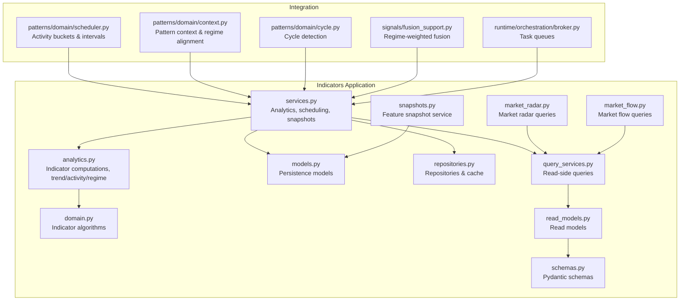

**Diagram sources**
- [analytics.py:1-463](file://src/apps/indicators/analytics.py#L1-L463)
- [domain.py:1-205](file://src/apps/indicators/domain.py#L1-L205)
- [services.py:1-586](file://src/apps/indicators/services.py#L1-L586)
- [models.py:1-121](file://src/apps/indicators/models.py#L1-L121)
- [repositories.py:1-601](file://src/apps/indicators/repositories.py#L1-L601)
- [query_services.py:1-450](file://src/apps/indicators/query_services.py#L1-L450)
- [read_models.py:1-280](file://src/apps/indicators/read_models.py#L1-L280)
- [schemas.py:1-157](file://src/apps/indicators/schemas.py#L1-L157)
- [market_radar.py:1-32](file://src/apps/indicators/market_radar.py#L1-L32)
- [market_flow.py:1-24](file://src/apps/indicators/market_flow.py#L1-L24)
- [snapshots.py:1-9](file://src/apps/indicators/snapshots.py#L1-L9)
- [scheduler.py:54-97](file://src/apps/patterns/domain/scheduler.py#L54-L97)
- [context.py:147-168](file://src/apps/patterns/domain/context.py#L147-L168)
- [cycle.py:65-101](file://src/apps/patterns/domain/cycle.py#L65-L101)
- [fusion_support.py:114-143](file://src/apps/signals/fusion_support.py#L114-L143)
- [broker.py:1-22](file://src/runtime/orchestration/broker.py#L1-L22)

**Section sources**
- [analytics.py:1-463](file://src/apps/indicators/analytics.py#L1-L463)
- [domain.py:1-205](file://src/apps/indicators/domain.py#L1-L205)
- [services.py:1-586](file://src/apps/indicators/services.py#L1-L586)
- [models.py:1-121](file://src/apps/indicators/models.py#L1-L121)
- [repositories.py:1-601](file://src/apps/indicators/repositories.py#L1-L601)
- [query_services.py:1-450](file://src/apps/indicators/query_services.py#L1-L450)
- [read_models.py:1-280](file://src/apps/indicators/read_models.py#L1-L280)
- [schemas.py:1-157](file://src/apps/indicators/schemas.py#L1-L157)
- [market_radar.py:1-32](file://src/apps/indicators/market_radar.py#L1-L32)
- [market_flow.py:1-24](file://src/apps/indicators/market_flow.py#L1-L24)
- [snapshots.py:1-9](file://src/apps/indicators/snapshots.py#L1-L9)
- [scheduler.py:54-97](file://src/apps/patterns/domain/scheduler.py#L54-L97)
- [context.py:147-168](file://src/apps/patterns/domain/context.py#L147-L168)
- [cycle.py:65-101](file://src/apps/patterns/domain/cycle.py#L65-L101)
- [fusion_support.py:114-143](file://src/apps/signals/fusion_support.py#L114-L143)
- [broker.py:1-22](file://src/runtime/orchestration/broker.py#L1-L22)

## Core Components
- Indicator computation engine: SMA, EMA, RSI, MACD, ATR, Bollinger Bands, ADX
- Trend and activity scoring: trend score calculation, activity score and bucket assignment, analysis priority
- Market regime detection: regime classification across timeframes and serialization
- Analytics service: event processing, snapshot generation, cache updates, signal detection
- Read services: market radar, market flow, recent leaders, sector rotations
- Persistence: coin metrics, feature snapshots, indicator cache
- Scheduling: activity-based analysis intervals and update gating
- Integration: pattern intelligence, sector metrics, and cross-market signals

**Section sources**
- [analytics.py:135-355](file://src/apps/indicators/analytics.py#L135-L355)
- [services.py:178-431](file://src/apps/indicators/services.py#L178-L431)
- [models.py:15-117](file://src/apps/indicators/models.py#L15-L117)
- [query_services.py:59-446](file://src/apps/indicators/query_services.py#L59-L446)
- [repositories.py:310-552](file://src/apps/indicators/repositories.py#L310-L552)
- [scheduler.py:54-97](file://src/apps/patterns/domain/scheduler.py#L54-L97)

## Architecture Overview
The analytics layer follows a clean architecture with separate concerns:
- Domain computes indicators from OHLCV sequences
- Services orchestrate analytics, schedule updates, and manage persistence
- Repositories abstract storage and caching
- Query services expose read models for dashboards
- Runtime brokers enqueue analytics tasks for batch processing

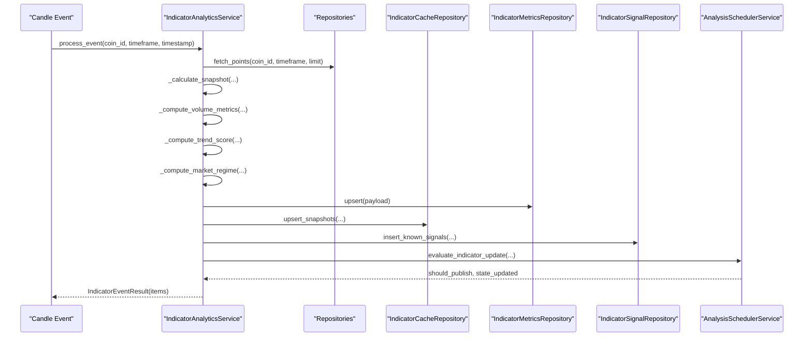

**Diagram sources**
- [services.py:189-339](file://src/apps/indicators/services.py#L189-L339)
- [repositories.py:352-417](file://src/apps/indicators/repositories.py#L352-L417)
- [repositories.py:310-350](file://src/apps/indicators/repositories.py#L310-L350)
- [analytics.py:135-355](file://src/apps/indicators/analytics.py#L135-L355)
- [services.py:529-571](file://src/apps/indicators/services.py#L529-L571)

## Detailed Component Analysis

### Indicator Computation Engine
- Moving averages: simple (SMA) and exponential (EMA)
- Momentum: RSI, MACD with histogram
- Volatility: ATR
- Bands: Bollinger Bands (upper/middle/lower, width)
- Trend strength: ADX
- All algorithms operate on rolling windows and return aligned series

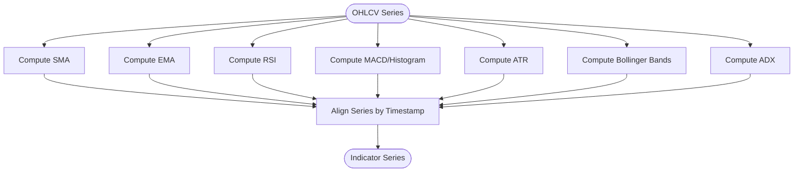

**Diagram sources**
- [domain.py:12-205](file://src/apps/indicators/domain.py#L12-L205)
- [analytics.py:149-158](file://src/apps/indicators/analytics.py#L149-L158)

**Section sources**
- [domain.py:12-205](file://src/apps/indicators/domain.py#L12-L205)
- [analytics.py:135-220](file://src/apps/indicators/analytics.py#L135-L220)

### Trend Score Calculation
- Base score starts at a neutral value and increments/decrements based on:
  - EMA 20 vs EMA 50
  - Price vs SMA 200
  - MACD histogram sign
  - RSI thresholds
  - ADX thresholds
  - Volume change over 24h
- Clamped to 0–100

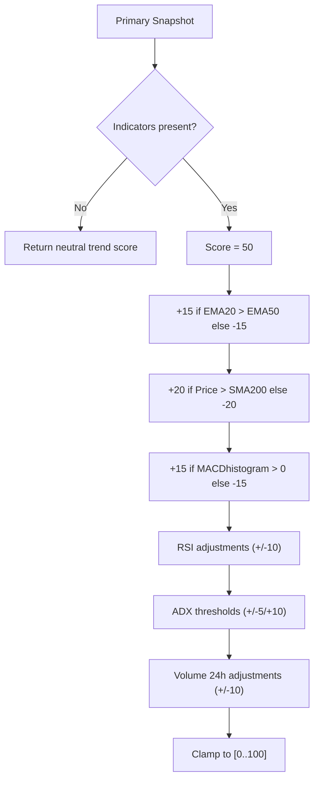

**Diagram sources**
- [analytics.py:300-324](file://src/apps/indicators/analytics.py#L300-L324)

**Section sources**
- [analytics.py:290-324](file://src/apps/indicators/analytics.py#L290-L324)

### Activity Scores and Analysis Priority
- Computes activity score from 24h price change, volatility, 24h volume change, and current price
- Assigns activity bucket and analysis priority based on bucket
- Scheduler enforces minimum intervals per bucket and timeframe

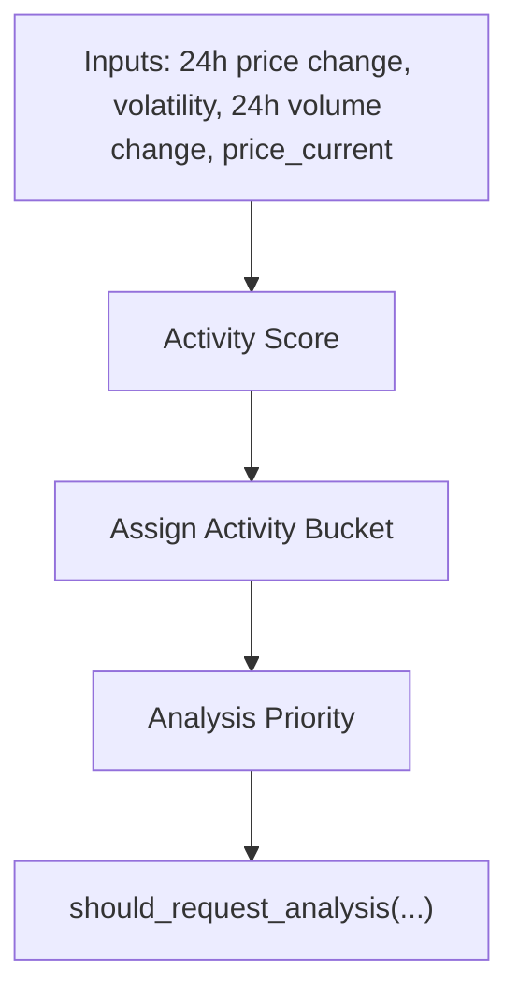

**Diagram sources**
- [analytics.py:326-341](file://src/apps/indicators/analytics.py#L326-L341)
- [scheduler.py:54-97](file://src/apps/patterns/domain/scheduler.py#L54-L97)

**Section sources**
- [analytics.py:326-341](file://src/apps/indicators/analytics.py#L326-L341)
- [scheduler.py:54-97](file://src/apps/patterns/domain/scheduler.py#L54-L97)

### Market Regime Detection
- Primary regime logic considers price relative to SMA 200, MACD sign, trend classification, Bollinger Band width, and 24h volume change
- Optional advanced regime engine can compute per-timeframe regime maps and serialize details

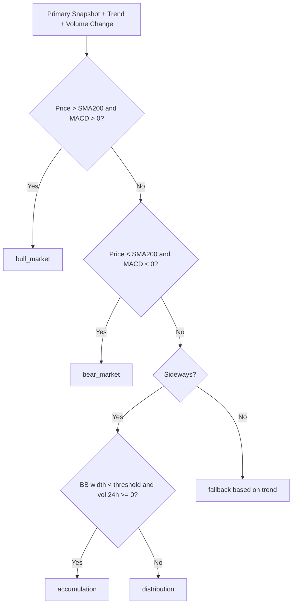

**Diagram sources**
- [analytics.py:344-355](file://src/apps/indicators/analytics.py#L344-L355)

**Section sources**
- [analytics.py:344-355](file://src/apps/indicators/analytics.py#L344-L355)

### Analytics Service Implementations
- IndicatorAnalyticsService
  - Processes candle events, determines affected timeframes, computes snapshots, updates metrics, caches snapshots, detects signals, and emits results
  - Integrates with continuous aggregates and refreshes materialized views as needed
- FeatureSnapshotService
  - Captures feature snapshots enriched with sector strength, market regime, cycle phase, pattern density, and cluster score
- AnalysisSchedulerService
  - Evaluates whether analysis should be requested based on activity bucket and last analysis timestamp

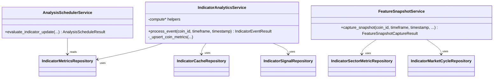

**Diagram sources**
- [services.py:178-571](file://src/apps/indicators/services.py#L178-L571)

**Section sources**
- [services.py:178-571](file://src/apps/indicators/services.py#L178-L571)

### Data Aggregation Patterns and Continuous Aggregates
- Candle repositories support direct candles, aggregate views, and resampling
- On-demand refresh of continuous aggregates for affected timeframes
- Base bounds determine window for refreshing aggregates

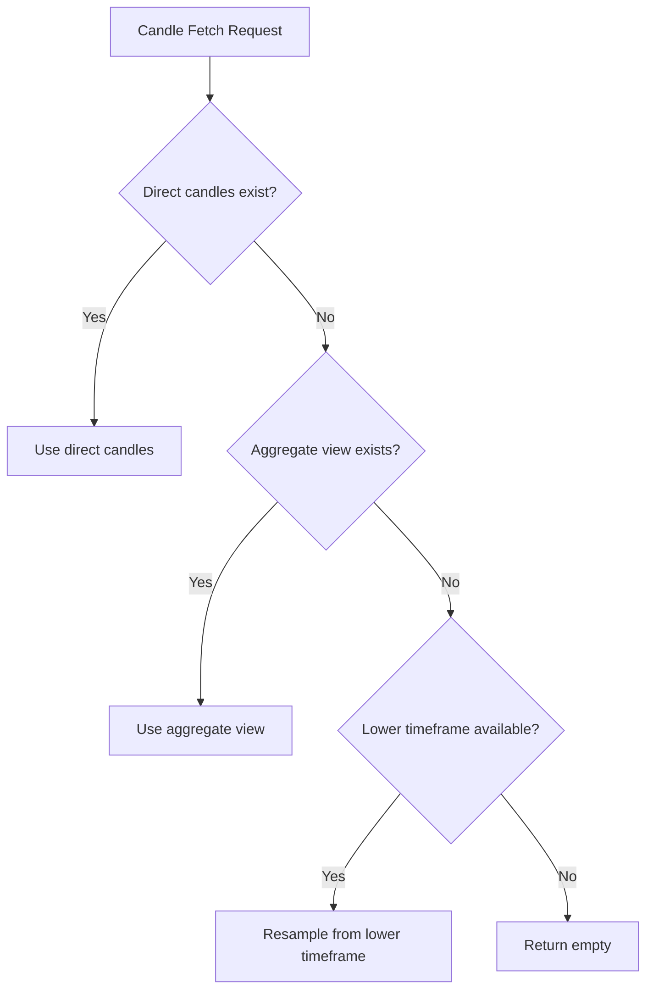

**Diagram sources**
- [repositories.py:93-308](file://src/apps/indicators/repositories.py#L93-L308)

**Section sources**
- [repositories.py:93-308](file://src/apps/indicators/repositories.py#L93-L308)

### Performance Metrics and Read Models
- CoinMetrics stores computed indicators, trend score, activity metrics, volatility, and regime details
- Read models normalize database rows for APIs and dashboards
- Schemas define Pydantic models for serialization

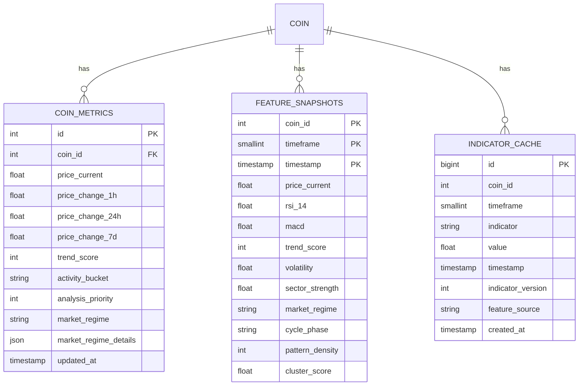

**Diagram sources**
- [models.py:15-117](file://src/apps/indicators/models.py#L15-L117)

**Section sources**
- [models.py:15-117](file://src/apps/indicators/models.py#L15-L117)
- [read_models.py:24-202](file://src/apps/indicators/read_models.py#L24-L202)
- [schemas.py:8-143](file://src/apps/indicators/schemas.py#L8-L143)

### Analytics Caching Strategies
- IndicatorCacheRepository persists per-indicator values per timeframe and timestamp with conflict resolution
- FeatureSnapshotRepository persists consolidated feature snapshots with conflict resolution
- Market radar and flow queries leverage Redis streams for recent events and cacheable results

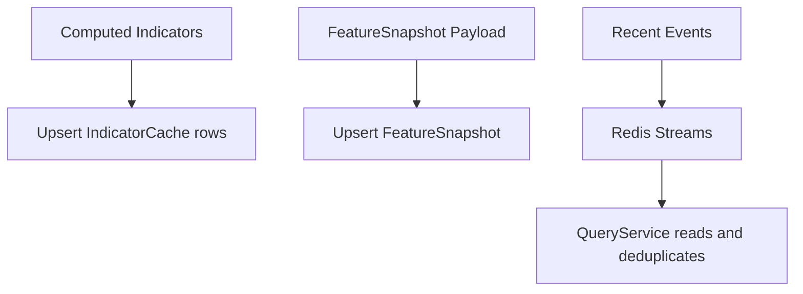

**Diagram sources**
- [repositories.py:352-417](file://src/apps/indicators/repositories.py#L352-L417)
- [repositories.py:508-552](file://src/apps/indicators/repositories.py#L508-L552)
- [query_services.py:153-206](file://src/apps/indicators/query_services.py#L153-L206)

**Section sources**
- [repositories.py:352-417](file://src/apps/indicators/repositories.py#L352-L417)
- [repositories.py:508-552](file://src/apps/indicators/repositories.py#L508-L552)
- [query_services.py:153-206](file://src/apps/indicators/query_services.py#L153-L206)

### Batch Processing and Real-Time Updates
- Task queues: general and analytics-specific Redis stream brokers
- Analytics tasks are enqueued and processed asynchronously
- Scheduling ensures periodic recomputation based on activity buckets

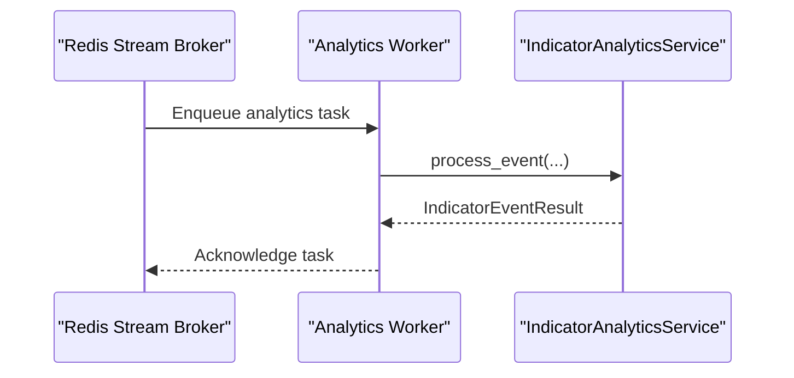

**Diagram sources**
- [broker.py:12-22](file://src/runtime/orchestration/broker.py#L12-L22)
- [services.py:189-339](file://src/apps/indicators/services.py#L189-L339)

**Section sources**
- [broker.py:12-22](file://src/runtime/orchestration/broker.py#L12-L22)
- [services.py:189-339](file://src/apps/indicators/services.py#L189-L339)

### Market Condition Assessment Tools
- MarketRadarQueryService: hot emerging coins, volatility spikes, recent regime changes
- MarketFlowQueryService: leaders, sector rotations, sector momentum
- Integration with pattern intelligence: regime weights, cycle phases, and sector alignment

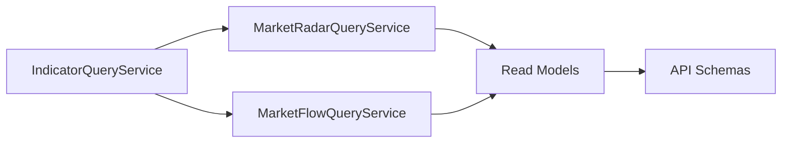

**Diagram sources**
- [query_services.py:20-446](file://src/apps/indicators/query_services.py#L20-L446)
- [market_radar.py:16-28](file://src/apps/indicators/market_radar.py#L16-L28)
- [market_flow.py:9-20](file://src/apps/indicators/market_flow.py#L9-L20)
- [read_models.py:102-161](file://src/apps/indicators/read_models.py#L102-L161)
- [schemas.py:137-143](file://src/apps/indicators/schemas.py#L137-L143)

**Section sources**
- [query_services.py:20-446](file://src/apps/indicators/query_services.py#L20-L446)
- [market_radar.py:16-28](file://src/apps/indicators/market_radar.py#L16-L28)
- [market_flow.py:9-20](file://src/apps/indicators/market_flow.py#L9-L20)
- [read_models.py:102-161](file://src/apps/indicators/read_models.py#L102-L161)
- [schemas.py:137-143](file://src/apps/indicators/schemas.py#L137-L143)

### Examples of Analytics Workflows
- Trend score calculation workflow
  - Compute indicator series
  - Select primary snapshot
  - Apply trend score formula
  - Persist trend score in metrics
- Activity-driven analytics update
  - Compute activity score and bucket
  - Evaluate should_request_analysis
  - Update last_analysis_at if published
- Feature snapshot capture
  - Gather metrics, sector, cycle, signals
  - Compute pattern density and cluster score
  - Upsert feature snapshot

**Section sources**
- [analytics.py:300-324](file://src/apps/indicators/analytics.py#L300-L324)
- [services.py:529-571](file://src/apps/indicators/services.py#L529-L571)
- [services.py:433-526](file://src/apps/indicators/services.py#L433-L526)

### Custom Metric Calculations and Integration
- Custom metrics can be added to the indicator computation pipeline by extending indicator series and updating persistence models
- Integration with pattern intelligence applies regime weights and cycle alignment to refine decision quality
- Cross-market signals and sector metrics enrich feature snapshots

**Section sources**
- [domain.py:12-205](file://src/apps/indicators/domain.py#L12-L205)
- [models.py:15-117](file://src/apps/indicators/models.py#L15-L117)
- [context.py:147-168](file://src/apps/patterns/domain/context.py#L147-L168)
- [cycle.py:65-101](file://src/apps/patterns/domain/cycle.py#L65-L101)
- [fusion_support.py:114-143](file://src/apps/signals/fusion_support.py#L114-L143)

## Dependency Analysis
- Analytics depends on domain indicator algorithms
- Services depend on repositories for persistence and on scheduler for gating
- Query services depend on repositories and Redis for recent events
- Read models and schemas decouple persistence from API surface
- Runtime brokers integrate analytics tasks into the orchestration layer

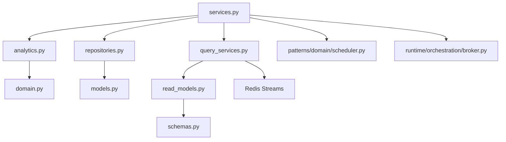

**Diagram sources**
- [analytics.py:1-463](file://src/apps/indicators/analytics.py#L1-L463)
- [domain.py:1-205](file://src/apps/indicators/domain.py#L1-L205)
- [services.py:1-586](file://src/apps/indicators/services.py#L1-L586)
- [repositories.py:1-601](file://src/apps/indicators/repositories.py#L1-L601)
- [query_services.py:1-450](file://src/apps/indicators/query_services.py#L1-L450)
- [read_models.py:1-280](file://src/apps/indicators/read_models.py#L1-L280)
- [schemas.py:1-157](file://src/apps/indicators/schemas.py#L1-L157)
- [models.py:1-121](file://src/apps/indicators/models.py#L1-L121)
- [scheduler.py:54-97](file://src/apps/patterns/domain/scheduler.py#L54-L97)
- [broker.py:1-22](file://src/runtime/orchestration/broker.py#L1-L22)

**Section sources**
- [analytics.py:1-463](file://src/apps/indicators/analytics.py#L1-L463)
- [domain.py:1-205](file://src/apps/indicators/domain.py#L1-L205)
- [services.py:1-586](file://src/apps/indicators/services.py#L1-L586)
- [repositories.py:1-601](file://src/apps/indicators/repositories.py#L1-L601)
- [query_services.py:1-450](file://src/apps/indicators/query_services.py#L1-L450)
- [read_models.py:1-280](file://src/apps/indicators/read_models.py#L1-L280)
- [schemas.py:1-157](file://src/apps/indicators/schemas.py#L1-L157)
- [models.py:1-121](file://src/apps/indicators/models.py#L1-L121)
- [scheduler.py:54-97](file://src/apps/patterns/domain/scheduler.py#L54-L97)
- [broker.py:1-22](file://src/runtime/orchestration/broker.py#L1-L22)

## Performance Considerations
- Prefer aggregate views and resampling to reduce raw candle scans
- Use continuous aggregates and targeted refresh for affected timeframes
- Clamp indicator series to avoid excessive memory growth
- Batch writes for cache and metrics upserts
- Leverage Redis streams for near-real-time event consumption
- Indexes on metrics and snapshots optimize read-heavy dashboards

[No sources needed since this section provides general guidance]

## Troubleshooting Guide
- Missing or partial snapshots: verify candle availability, aggregate presence, and resampling logic
- Outdated aggregates: ensure base bounds and refresh_range calls for affected timeframes
- Activity scheduling issues: confirm activity bucket and last_analysis_at updates
- Market regime inconsistencies: check feature flag enabling advanced regime engine and serialized regime details
- Redis connectivity: validate stream names and connection settings for event queries

**Section sources**
- [repositories.py:93-308](file://src/apps/indicators/repositories.py#L93-L308)
- [services.py:208-223](file://src/apps/indicators/services.py#L208-L223)
- [services.py:529-571](file://src/apps/indicators/services.py#L529-L571)
- [query_services.py:153-206](file://src/apps/indicators/query_services.py#L153-L206)

## Conclusion
The analytics layer provides a robust, extensible framework for computing market indicators, scoring activity and trends, detecting regimes, and orchestrating real-time updates. Its modular design enables efficient caching, batch processing, and integration with broader analytical systems, while maintaining clear separation between computation, persistence, and presentation.

[No sources needed since this section summarizes without analyzing specific files]

## Appendices
- Example: Computing trend score for a given timeframe snapshot
  - Path: [analytics.py:300-324](file://src/apps/indicators/analytics.py#L300-L324)
- Example: Determining affected timeframes for a candle close
  - Path: [analytics.py:117-126](file://src/apps/indicators/analytics.py#L117-L126)
- Example: Detecting classic signals from a snapshot
  - Path: [analytics.py:394-429](file://src/apps/indicators/analytics.py#L394-L429)
- Example: Upserting indicator cache entries
  - Path: [repositories.py:356-417](file://src/apps/indicators/repositories.py#L356-L417)
- Example: Evaluating analysis scheduling
  - Path: [services.py:533-571](file://src/apps/indicators/services.py#L533-L571)