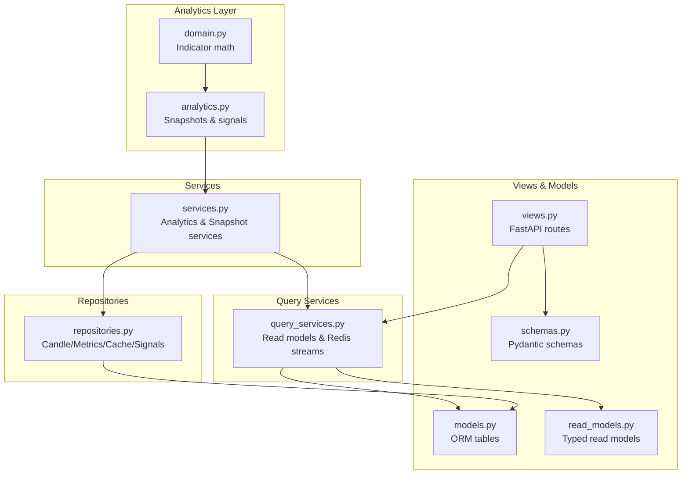
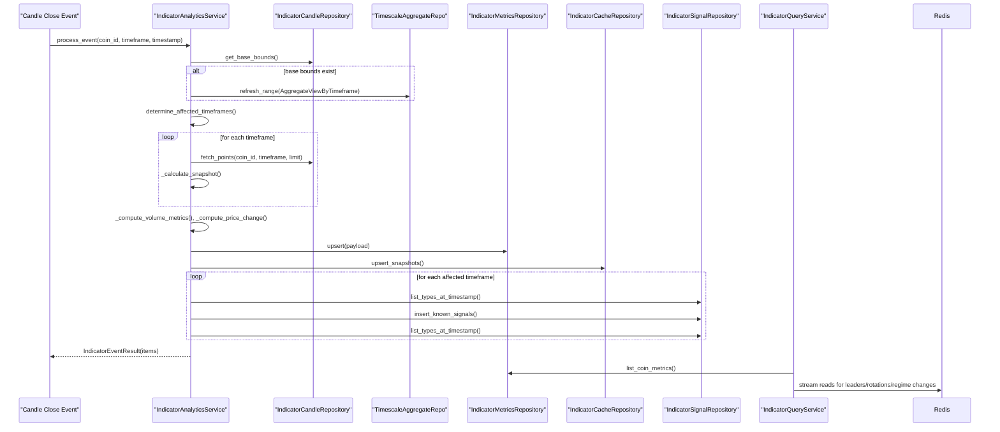
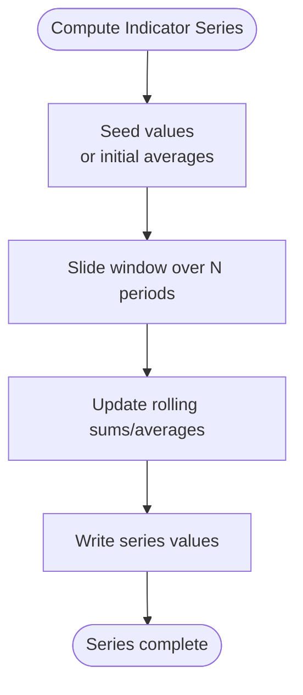
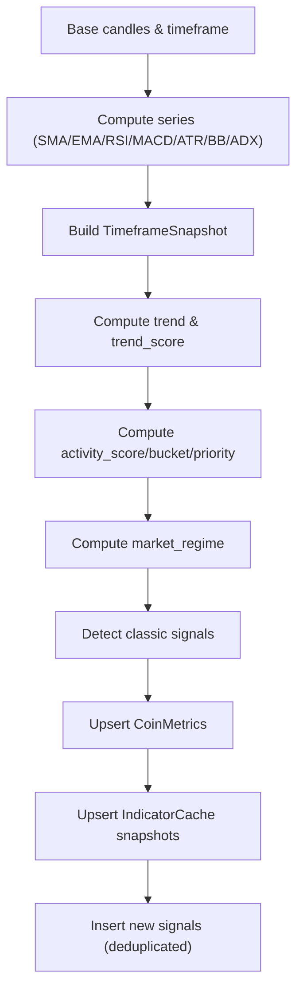
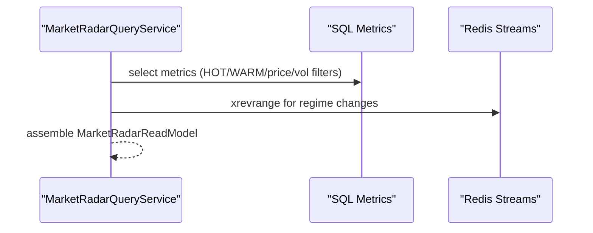
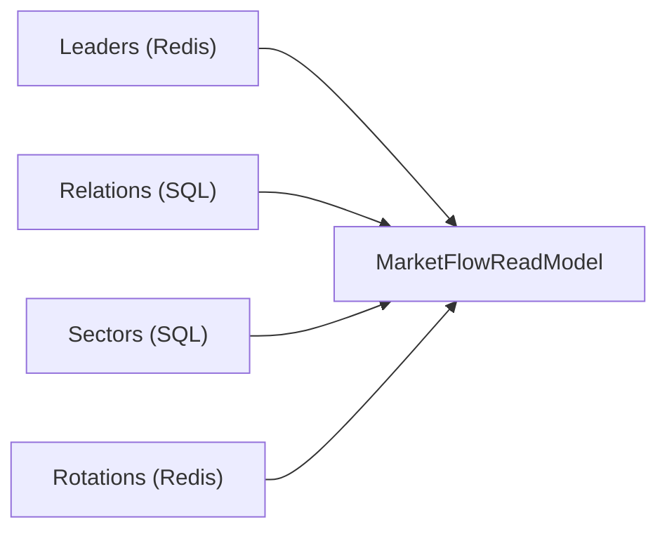
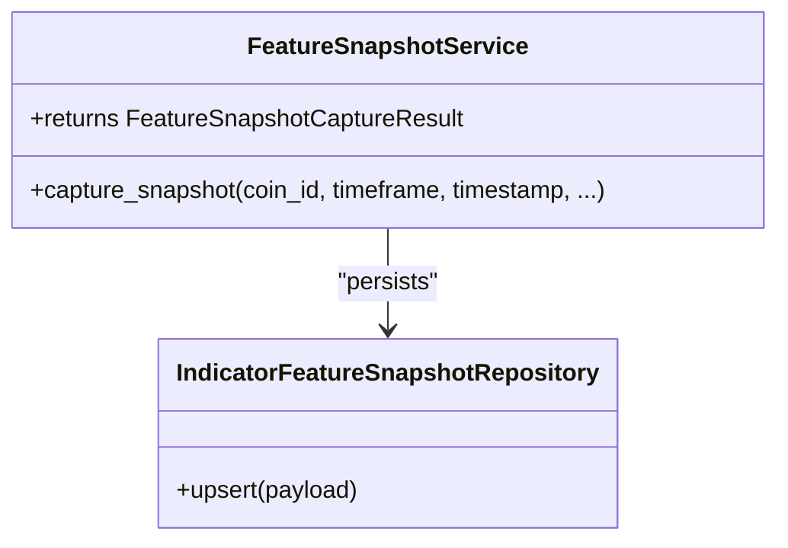
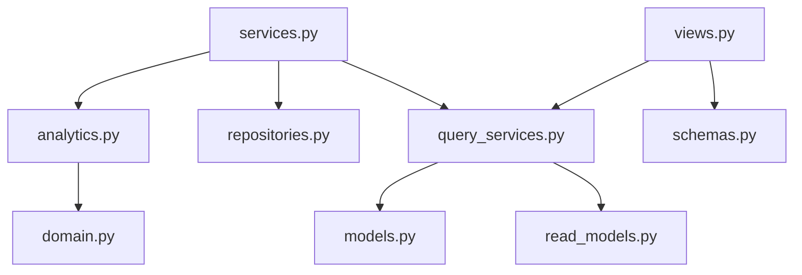

# Indicators Engine

<cite>
**Referenced Files in This Document**
- [analytics.py](file://src/apps/indicators/analytics.py)
- [domain.py](file://src/apps/indicators/domain.py)
- [market_flow.py](file://src/apps/indicators/market_flow.py)
- [market_radar.py](file://src/apps/indicators/market_radar.py)
- [models.py](file://src/apps/indicators/models.py)
- [repositories.py](file://src/apps/indicators/repositories.py)
- [services.py](file://src/apps/indicators/services.py)
- [snapshots.py](file://src/apps/indicators/snapshots.py)
- [query_services.py](file://src/apps/indicators/query_services.py)
- [read_models.py](file://src/apps/indicators/read_models.py)
- [schemas.py](file://src/apps/indicators/schemas.py)
- [views.py](file://src/apps/indicators/views.py)
- [test_analytics_helpers.py](file://tests/apps/indicators/test_analytics_helpers.py)
- [test_domain.py](file://tests/apps/indicators/test_domain.py)
- [test_flow_radar_snapshots_services.py](file://tests/apps/indicators/test_flow_radar_snapshots_services.py)
</cite>

## Table of Contents
1. [Introduction](#introduction)
2. [Project Structure](#project-structure)
3. [Core Components](#core-components)
4. [Architecture Overview](#architecture-overview)
5. [Detailed Component Analysis](#detailed-component-analysis)
6. [Dependency Analysis](#dependency-analysis)
7. [Performance Considerations](#performance-considerations)
8. [Troubleshooting Guide](#troubleshooting-guide)
9. [Conclusion](#conclusion)
10. [Appendices](#appendices)

## Introduction
This document describes the indicators engine that computes technical indicators, performs analytics, and powers market radar and flow analysis. It explains indicator computation algorithms, real-time updates, historical analysis, visualization surfaces, and integration points with other systems. It also covers customization hooks, performance characteristics, and operational workflows for market condition assessment.

## Project Structure
The indicators engine is organized around a layered architecture:
- Analytics layer: computes indicator series and derived metrics
- Domain math: pure indicator implementations
- Services: orchestrates analytics, writes to storage, and emits signals
- Repositories: database access for candles, metrics, caches, and signals
- Query services: read-side projections and Redis-backed event streams
- Views/Schemas: API exposure and typed read models

**Diagram sources**
- [domain.py:1-205](file://src/apps/indicators/domain.py#L1-L205)
- [analytics.py:1-463](file://src/apps/indicators/analytics.py#L1-L463)
- [services.py:1-531](file://src/apps/indicators/services.py#L1-L531)
- [repositories.py:1-601](file://src/apps/indicators/repositories.py#L1-L601)
- [query_services.py:1-450](file://src/apps/indicators/query_services.py#L1-L450)
- [models.py:1-121](file://src/apps/indicators/models.py#L1-L121)
- [read_models.py:1-280](file://src/apps/indicators/read_models.py#L1-L280)
- [schemas.py:1-157](file://src/apps/indicators/schemas.py#L1-L157)
- [views.py:1-46](file://src/apps/indicators/views.py#L1-L46)

**Section sources**
- [analytics.py:1-463](file://src/apps/indicators/analytics.py#L1-L463)
- [domain.py:1-205](file://src/apps/indicators/domain.py#L1-L205)
- [services.py:1-531](file://src/apps/indicators/services.py#L1-L531)
- [repositories.py:1-601](file://src/apps/indicators/repositories.py#L1-L601)
- [query_services.py:1-450](file://src/apps/indicators/query_services.py#L1-L450)
- [models.py:1-121](file://src/apps/indicators/models.py#L1-L121)
- [read_models.py:1-280](file://src/apps/indicators/read_models.py#L1-L280)
- [schemas.py:1-157](file://src/apps/indicators/schemas.py#L1-L157)
- [views.py:1-46](file://src/apps/indicators/views.py#L1-L46)

## Core Components
- Indicator math library: SMA, EMA, RSI, MACD, ATR, Bollinger Bands, ADX
- Analytics helpers: snapshot construction, trend/regime scoring, activity scoring, signal detection
- Analytics service: orchestrates candle fetching, analytics, metrics upsert, cache updates, and signal emission
- Snapshot service: captures feature snapshots enriched by regime, cycle, sector strength, pattern density, and cluster scores
- Query services: market radar, market flow, recent leaders/rotations/regime changes via SQL and Redis streams
- Read models and schemas: typed projections for API responses
- Persistence: CoinMetrics, FeatureSnapshot, IndicatorCache tables

**Section sources**
- [domain.py:12-205](file://src/apps/indicators/domain.py#L12-L205)
- [analytics.py:135-462](file://src/apps/indicators/analytics.py#L135-L462)
- [services.py:170-531](file://src/apps/indicators/services.py#L170-L531)
- [repositories.py:44-601](file://src/apps/indicators/repositories.py#L44-L601)
- [query_services.py:59-450](file://src/apps/indicators/query_services.py#L59-L450)
- [models.py:15-121](file://src/apps/indicators/models.py#L15-L121)
- [read_models.py:23-280](file://src/apps/indicators/read_models.py#L23-L280)
- [schemas.py:8-157](file://src/apps/indicators/schemas.py#L8-L157)

## Architecture Overview
The engine runs on a real-time event loop:
- On a candle close event, the analytics service determines affected timeframes, fetches candles across intervals, computes snapshots, derives metrics, and persists results.
- Signals are detected per timeframe and stored to avoid duplicates.
- Market radar and flow views aggregate data from SQL and Redis streams.

**Diagram sources**
- [services.py:181-331](file://src/apps/indicators/services.py#L181-L331)
- [repositories.py:93-308](file://src/apps/indicators/repositories.py#L93-L308)
- [query_services.py:153-206](file://src/apps/indicators/query_services.py#L153-L206)

**Section sources**
- [services.py:170-331](file://src/apps/indicators/services.py#L170-L331)
- [repositories.py:93-308](file://src/apps/indicators/repositories.py#L93-L308)
- [query_services.py:153-206](file://src/apps/indicators/query_services.py#L153-L206)

## Detailed Component Analysis

### Indicator Computation Algorithms
- Moving averages: SMA and EMA implemented with rolling windows and exponential smoothing
- Momentum: RSI computed from average gains/losses over a period
- MACD: difference of EMAs with a signal line and histogram
- Volatility: ATR based on true range over N periods
- Bands: Bollinger Bands from SMA and standard deviation
- Trend strength: ADX derived from +DM, -DM, and TR smoothed over N periods

**Diagram sources**
- [domain.py:12-205](file://src/apps/indicators/domain.py#L12-L205)

**Section sources**
- [domain.py:12-205](file://src/apps/indicators/domain.py#L12-L205)

### Analytics Helpers and Signal Detection
- Snapshot construction aggregates multiple indicator series into a single timeframe snapshot
- Trend classification and trend score combine moving averages, MACD histogram, RSI, ADX, and volume filters
- Activity scoring and buckets drive analysis priority
- Market regime inference considers price vs. SMA/EMA, MACD sign, BB width, and volume changes
- Classic signals include golden/death crosses, breakouts/breakdowns, trend reversals, volume spikes, and RSI extremes

**Diagram sources**
- [analytics.py:135-462](file://src/apps/indicators/analytics.py#L135-L462)
- [services.py:339-422](file://src/apps/indicators/services.py#L339-L422)

**Section sources**
- [analytics.py:135-462](file://src/apps/indicators/analytics.py#L135-L462)
- [services.py:339-422](file://src/apps/indicators/services.py#L339-L422)

### Real-Time Updates and Historical Analysis
- Real-time: process_event triggered on candle close; affected timeframes refreshed; snapshots cached; signals emitted
- Historical: repositories support direct candles, continuous aggregates, and resampling; analytics re-runs against historical windows
- Volume and volatility windows: 24-hour rolling windows computed from base timeframe candles
- Price changes: computed across 1h, 24h, and 7d windows

**Section sources**
- [services.py:181-331](file://src/apps/indicators/services.py#L181-L331)
- [repositories.py:93-308](file://src/apps/indicators/repositories.py#L93-L308)
- [analytics.py:222-259](file://src/apps/indicators/analytics.py#L222-L259)

### Market Radar Functionality
- Hot/emerging/volatile coins selected via activity_score, price/volume changes, and regime filters
- Recent regime changes sourced from Redis stream events
- Market radar view aggregates SQL metrics with stream-driven events

**Diagram sources**
- [market_radar.py:16-31](file://src/apps/indicators/market_radar.py#L16-L31)
- [query_services.py:321-381](file://src/apps/indicators/query_services.py#L321-L381)

**Section sources**
- [market_radar.py:16-31](file://src/apps/indicators/market_radar.py#L16-L31)
- [query_services.py:321-381](file://src/apps/indicators/query_services.py#L321-L381)

### Market Flow Analysis
- Leaders: recent market leader detections from Redis
- Relations: coin-to-coin relations with correlation and lag
- Sectors: sector metrics by timeframe
- Rotations: sector rotation detections from Redis

**Diagram sources**
- [market_flow.py:9-23](file://src/apps/indicators/market_flow.py#L9-L23)
- [query_services.py:383-446](file://src/apps/indicators/query_services.py#L383-L446)

**Section sources**
- [market_flow.py:9-23](file://src/apps/indicators/market_flow.py#L9-L23)
- [query_services.py:383-446](file://src/apps/indicators/query_services.py#L383-L446)

### Snapshot Generation for Market Conditions
- FeatureSnapshotService captures enriched snapshots including trend_score, volatility, sector_strength, market_regime, cycle_phase, pattern_density, and cluster_score
- Reads from CoinMetrics, SectorMetric, MarketCycle, and Signal tables to enrich the snapshot

**Diagram sources**
- [services.py:425-518](file://src/apps/indicators/services.py#L425-L518)
- [repositories.py:508-552](file://src/apps/indicators/repositories.py#L508-L552)

**Section sources**
- [services.py:425-518](file://src/apps/indicators/services.py#L425-L518)
- [repositories.py:508-552](file://src/apps/indicators/repositories.py#L508-L552)

### API Exposure and Read Models
- FastAPI routes expose metrics, market radar, market flow, and market cycles
- Pydantic schemas validate and serialize responses
- Read models normalize database rows into typed structures

**Section sources**
- [views.py:13-45](file://src/apps/indicators/views.py#L13-L45)
- [schemas.py:8-157](file://src/apps/indicators/schemas.py#L8-L157)
- [read_models.py:164-279](file://src/apps/indicators/read_models.py#L164-L279)

## Dependency Analysis
Key dependencies and coupling:
- Analytics depends on domain math and market data utilities
- Services depend on repositories for persistence and query services for read-side projections
- Query services depend on SQL ORM and Redis for event streams
- Views depend on query services and schemas

**Diagram sources**
- [analytics.py:10-29](file://src/apps/indicators/analytics.py#L10-L29)
- [domain.py:1-205](file://src/apps/indicators/domain.py#L1-L205)
- [services.py:9-58](file://src/apps/indicators/services.py#L9-L58)
- [repositories.py:1-27](file://src/apps/indicators/repositories.py#L1-L27)
- [query_services.py:1-34](file://src/apps/indicators/query_services.py#L1-L34)
- [models.py:1-121](file://src/apps/indicators/models.py#L1-L121)
- [views.py:1-10](file://src/apps/indicators/views.py#L1-L10)
- [schemas.py:1-157](file://src/apps/indicators/schemas.py#L1-L157)
- [read_models.py:1-280](file://src/apps/indicators/read_models.py#L1-L280)

**Section sources**
- [analytics.py:10-29](file://src/apps/indicators/analytics.py#L10-L29)
- [domain.py:1-205](file://src/apps/indicators/domain.py#L1-L205)
- [services.py:9-58](file://src/apps/indicators/services.py#L9-L58)
- [repositories.py:1-27](file://src/apps/indicators/repositories.py#L1-L27)
- [query_services.py:1-34](file://src/apps/indicators/query_services.py#L1-L34)
- [models.py:1-121](file://src/apps/indicators/models.py#L1-L121)
- [views.py:1-10](file://src/apps/indicators/views.py#L1-L10)
- [schemas.py:1-157](file://src/apps/indicators/schemas.py#L1-L157)
- [read_models.py:1-280](file://src/apps/indicators/read_models.py#L1-L280)

## Performance Considerations
- Rolling computations: SMA/EMA/RSI/MACD/ATR/Bollinger Bands/ADX operate in linear time relative to input length; tune lookback windows and batch processing
- Database IO: use continuous aggregates and resampling to reduce scan costs; refresh aggregates for affected timeframes on demand
- Deduplication: signals are inserted with conflict resolution; minimize redundant writes
- Caching: IndicatorCache stores per-indicator per-timestamp values with upsert-on-conflict to avoid churn
- Network: market cap fetches are rate-limited and resilient; consider caching results by symbol and refresh on schedule
- Read projections: leverage indexes on metrics and snapshots; paginate and filter aggressively in queries

[No sources needed since this section provides general guidance]

## Troubleshooting Guide
Common issues and resolutions:
- Missing coin: process_event skips when coin is not found; verify coin existence and deletion flags
- No candles available: repositories fall back from direct candles to aggregate views and resampled data; ensure aggregates exist or refresh ranges
- Insufficient data: indicator series return None for insufficient samples; increase lookback or wait for more bars
- Duplicate signals: signal insertion is idempotent; verify detection thresholds and candle timestamps
- Regime engine disabled: feature flag gating controls regime map computation; enable feature to compute regime maps

**Section sources**
- [services.py:194-196](file://src/apps/indicators/services.py#L194-L196)
- [repositories.py:119-170](file://src/apps/indicators/repositories.py#L119-L170)
- [repositories.py:424-455](file://src/apps/indicators/repositories.py#L424-L455)
- [test_analytics_helpers.py:480-501](file://tests/apps/indicators/test_analytics_helpers.py#L480-L501)

## Conclusion
The indicators engine provides a robust, modular framework for computing technical indicators, deriving analytics, emitting signals, and powering market radar and flow views. Its design balances real-time responsiveness with historical analysis, integrates cleanly with SQL and Redis, and exposes typed APIs for downstream systems.

## Appendices

### Technical Analysis Workflows
- Real-time update: process_event → compute snapshots → upsert metrics/cache → detect signals → persist signals
- Historical backtest: fetch historical candles → compute series → derive metrics → write snapshots
- Market condition assessment: combine trend_score, activity_score, market_regime, and signals to classify assets

**Section sources**
- [services.py:181-331](file://src/apps/indicators/services.py#L181-L331)
- [analytics.py:135-462](file://src/apps/indicators/analytics.py#L135-L462)

### Market Condition Assessment Tools
- Trend classification and trend_score: moving average alignment, MACD histogram, RSI, ADX, and volume filters
- Activity scoring and buckets: price change, volatility, volume change, and current price
- Market regime inference: price vs. SMA/EMA, MACD sign, Bollinger Band width, and volume trends

**Section sources**
- [analytics.py:290-356](file://src/apps/indicators/analytics.py#L290-L356)

### Integration Notes
- API endpoints: coins/metrics, market/radar, market/flow, market/cycle
- Typed responses: Pydantic schemas for safe serialization
- Read models: normalized structures for views and dashboards

**Section sources**
- [views.py:13-45](file://src/apps/indicators/views.py#L13-L45)
- [schemas.py:8-157](file://src/apps/indicators/schemas.py#L8-L157)
- [read_models.py:164-279](file://src/apps/indicators/read_models.py#L164-L279)