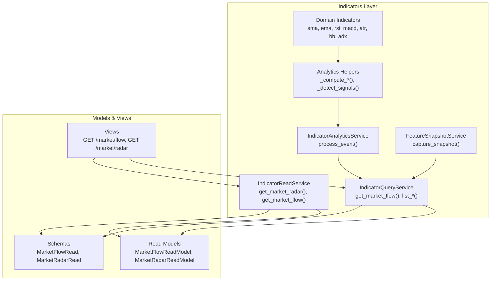
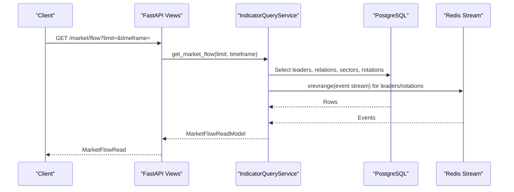
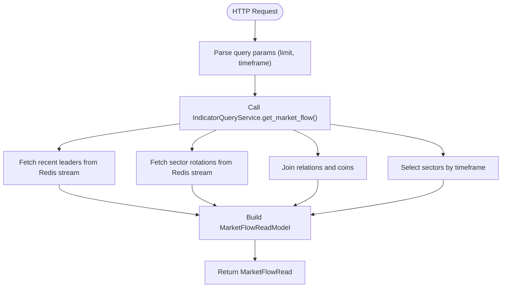
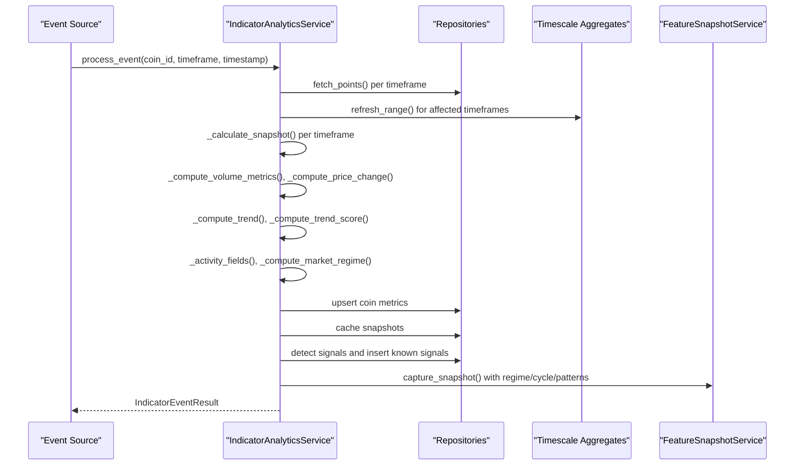
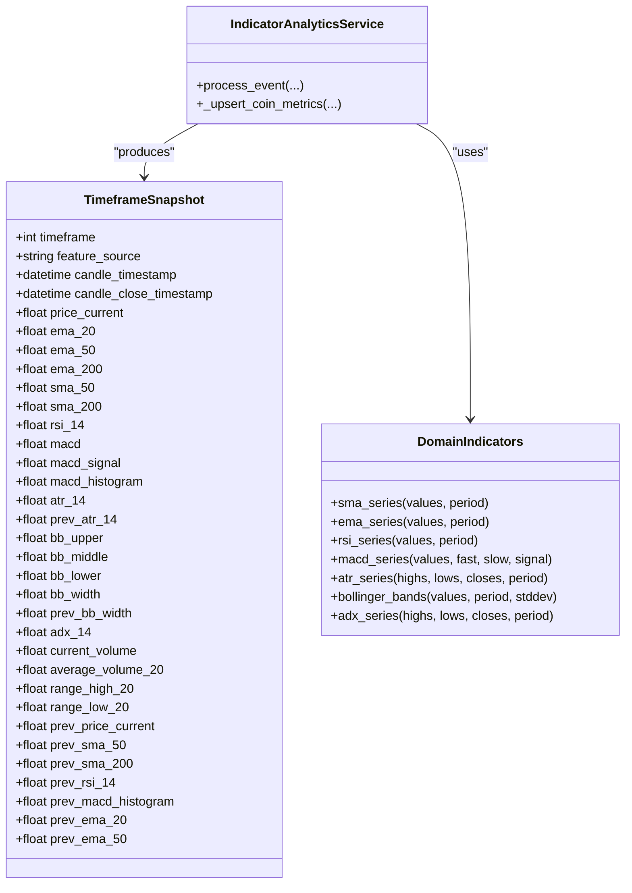
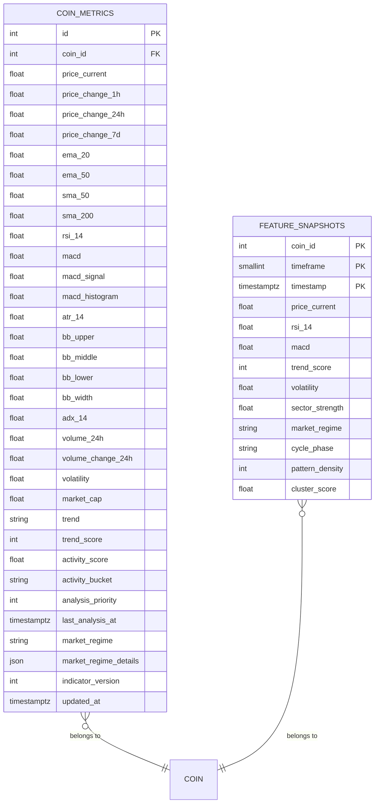
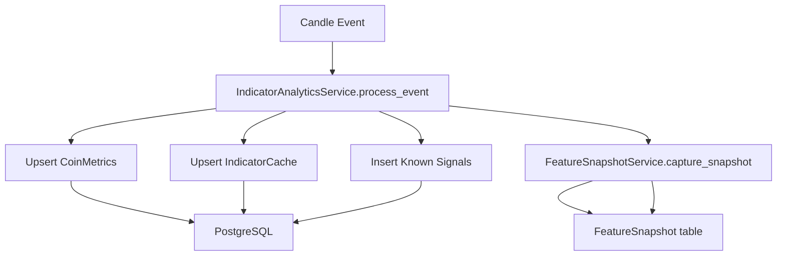
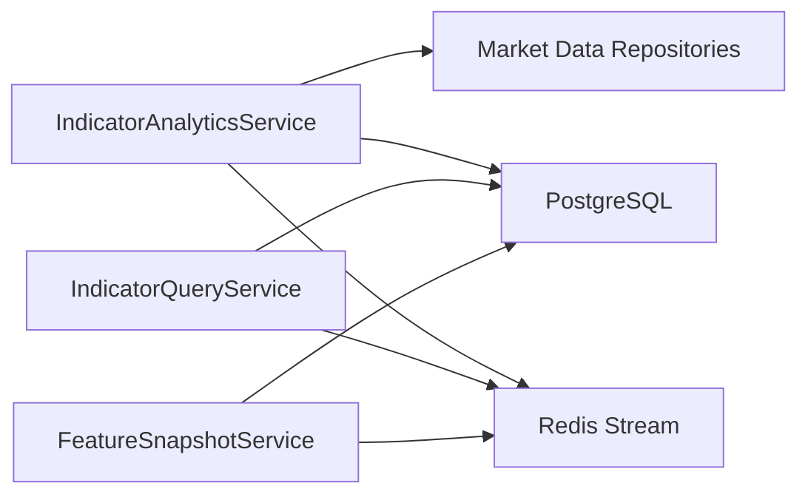

# Market Flow Analysis

<cite>
**Referenced Files in This Document**
- [market_flow.py](file://src/apps/indicators/market_flow.py)
- [services.py](file://src/apps/indicators/services.py)
- [analytics.py](file://src/apps/indicators/analytics.py)
- [domain.py](file://src/apps/indicators/domain.py)
- [models.py](file://src/apps/indicators/models.py)
- [read_models.py](file://src/apps/indicators/read_models.py)
- [query_services.py](file://src/apps/indicators/query_services.py)
- [schemas.py](file://src/apps/indicators/schemas.py)
- [views.py](file://src/apps/indicators/views.py)
- [snapshots.py](file://src/apps/indicators/snapshots.py)
- [clients.py](file://src/apps/market_data/clients.py)
</cite>

## Table of Contents
1. [Introduction](#introduction)
2. [Project Structure](#project-structure)
3. [Core Components](#core-components)
4. [Architecture Overview](#architecture-overview)
5. [Detailed Component Analysis](#detailed-component-analysis)
6. [Dependency Analysis](#dependency-analysis)
7. [Performance Considerations](#performance-considerations)
8. [Troubleshooting Guide](#troubleshooting-guide)
9. [Conclusion](#conclusion)
10. [Appendices](#appendices)

## Introduction
This document explains the market flow analysis capabilities implemented in the indicators subsystem. It covers the algorithms for computing liquidity and price-volume dynamics, the market regime detection logic, and the services that power real-time and historical flow insights. It also documents the APIs for market flow and radar, the data models and read models, and how flow signals integrate with broader analytical tools such as anomaly detection and pattern intelligence.

## Project Structure
The market flow analysis is centered around the indicators application, which exposes:
- Analytics and indicator computation logic
- Services for analytics, scheduling, and feature snapshots
- Query services for market flow and radar
- FastAPI views for REST endpoints
- SQLAlchemy models and read models for data representation
- Domain functions for technical indicators

**Diagram sources**
- [query_services.py:383-446](file://src/apps/indicators/query_services.py#L383-L446)
- [services.py:174-175](file://src/apps/indicators/services.py#L174-L175)
- [services.py:189-339](file://src/apps/indicators/services.py#L189-L339)
- [services.py:433-526](file://src/apps/indicators/services.py#L433-L526)
- [domain.py:12-205](file://src/apps/indicators/domain.py#L12-L205)
- [analytics.py:135-220](file://src/apps/indicators/analytics.py#L135-L220)
- [read_models.py:157-162](file://src/apps/indicators/read_models.py#L157-L162)
- [schemas.py:99-106](file://src/apps/indicators/schemas.py#L99-L106)
- [views.py:37-45](file://src/apps/indicators/views.py#L37-L45)

**Section sources**
- [market_flow.py:9-21](file://src/apps/indicators/market_flow.py#L9-L21)
- [query_services.py:383-446](file://src/apps/indicators/query_services.py#L383-L446)
- [services.py:174-175](file://src/apps/indicators/services.py#L174-L175)
- [views.py:37-45](file://src/apps/indicators/views.py#L37-L45)

## Core Components
- MarketFlowQueryService: Thin facade delegating to IndicatorQueryService for market flow and related lists.
- IndicatorReadService: Provides market radar and market flow retrieval.
- IndicatorAnalyticsService: Orchestrates candle ingestion, computes snapshots, detects signals, updates metrics, and manages caches.
- FeatureSnapshotService: Captures feature snapshots enriched with regime, cycle phase, pattern density, and cluster scores.
- Analytics helpers: Compute time-series indicators, trend, trend score, activity fields, regime, and signals.
- Domain indicator functions: SMA, EMA, RSI, MACD, ATR, Bollinger Bands, ADX.
- Data models and read models: Persist and expose coin metrics, feature snapshots, and market flow/radar read models.
- Query services: Build market flow and radar datasets from database and Redis event streams.
- Schemas and views: Expose REST endpoints for market flow and radar.

Key responsibilities:
- Flow algorithms: Volume 24h, volume change 24h, volatility estimation, trend score, and regime classification.
- Liquidity measurement: Average volume over 20 bars, range high/low over 20 bars, BB width, ADX.
- Market movement tracking: Price change over 1h/24h/7d windows, trend classification, MACD histogram.
- Pattern recognition: Golden cross, death cross, breakout/breakdown, trend reversal, RSI extremes, volume spikes.
- Real-time monitoring: Event-driven processing, Redis-backed recent leaders/rotations, scheduled analysis.

**Section sources**
- [market_flow.py:9-21](file://src/apps/indicators/market_flow.py#L9-L21)
- [services.py:174-175](file://src/apps/indicators/services.py#L174-L175)
- [services.py:189-339](file://src/apps/indicators/services.py#L189-L339)
- [services.py:433-526](file://src/apps/indicators/services.py#L433-L526)
- [analytics.py:237-259](file://src/apps/indicators/analytics.py#L237-L259)
- [analytics.py:290-324](file://src/apps/indicators/analytics.py#L290-L324)
- [analytics.py:344-355](file://src/apps/indicators/analytics.py#L344-L355)
- [analytics.py:394-429](file://src/apps/indicators/analytics.py#L394-L429)
- [domain.py:12-205](file://src/apps/indicators/domain.py#L12-L205)
- [models.py:15-62](file://src/apps/indicators/models.py#L15-L62)
- [models.py:65-85](file://src/apps/indicators/models.py#L65-L85)
- [read_models.py:157-162](file://src/apps/indicators/read_models.py#L157-L162)
- [query_services.py:383-446](file://src/apps/indicators/query_services.py#L383-L446)
- [schemas.py:99-106](file://src/apps/indicators/schemas.py#L99-L106)
- [views.py:37-45](file://src/apps/indicators/views.py#L37-L45)

## Architecture Overview
The market flow pipeline integrates real-time candle events with analytics and persistence, exposing summarized datasets via REST endpoints.

**Diagram sources**
- [views.py:37-45](file://src/apps/indicators/views.py#L37-L45)
- [query_services.py:383-446](file://src/apps/indicators/query_services.py#L383-L446)
- [query_services.py:208-283](file://src/apps/indicators/query_services.py#L208-L283)
- [query_services.py:285-319](file://src/apps/indicators/query_services.py#L285-L319)

## Detailed Component Analysis

### Market Flow Retrieval and APIs
- Endpoint: GET /market/flow returns MarketFlowRead with leaders, relations, sectors, rotations.
- Endpoint: GET /market/radar returns MarketRadarRead with hot/emerging coins, recent regime changes, and volatility spikes.
- MarketFlowQueryService delegates to IndicatorQueryService for list_recent_* and get_market_flow.

**Diagram sources**
- [views.py:37-45](file://src/apps/indicators/views.py#L37-L45)
- [query_services.py:383-446](file://src/apps/indicators/query_services.py#L383-L446)
- [query_services.py:208-283](file://src/apps/indicators/query_services.py#L208-L283)
- [query_services.py:285-319](file://src/apps/indicators/query_services.py#L285-L319)

**Section sources**
- [views.py:29-45](file://src/apps/indicators/views.py#L29-L45)
- [query_services.py:383-446](file://src/apps/indicators/query_services.py#L383-L446)
- [market_flow.py:9-21](file://src/apps/indicators/market_flow.py#L9-L21)

### Analytics Pipeline and Signal Detection
IndicatorAnalyticsService orchestrates:
- Determine affected timeframes around the incoming candle
- Refresh continuous aggregates for affected timeframes
- Build TimeframeSnapshots per timeframe
- Compute volume 24h, volume change 24h, volatility
- Compute trend, trend score, activity fields, and market regime
- Upsert coin metrics and cache snapshots
- Detect classic signals and persist new signals
- Emit IndicatorEventResult with per-timeframe items

**Diagram sources**
- [services.py:189-339](file://src/apps/indicators/services.py#L189-L339)
- [services.py:433-526](file://src/apps/indicators/services.py#L433-L526)
- [analytics.py:135-220](file://src/apps/indicators/analytics.py#L135-L220)
- [analytics.py:237-259](file://src/apps/indicators/analytics.py#L237-L259)
- [analytics.py:290-324](file://src/apps/indicators/analytics.py#L290-L324)
- [analytics.py:344-355](file://src/apps/indicators/analytics.py#L344-L355)
- [analytics.py:394-429](file://src/apps/indicators/analytics.py#L394-L429)

**Section sources**
- [services.py:189-339](file://src/apps/indicators/services.py#L189-L339)
- [analytics.py:135-220](file://src/apps/indicators/analytics.py#L135-L220)
- [analytics.py:237-259](file://src/apps/indicators/analytics.py#L237-L259)
- [analytics.py:290-324](file://src/apps/indicators/analytics.py#L290-L324)
- [analytics.py:344-355](file://src/apps/indicators/analytics.py#L344-L355)
- [analytics.py:394-429](file://src/apps/indicators/analytics.py#L394-L429)

### Technical Indicators and Metrics
Domain functions implement standard TA indicators:
- Moving averages: SMA and EMA
- Momentum: RSI, MACD/Histogram
- Volatility: ATR
- Bands: Bollinger Bands (upper, middle, lower, width)
- Trend strength: ADX

Analytics helpers compute derived metrics:
- Timeframe snapshots with feature source
- Price change over 1h/24h/7d windows
- Volume 24h and percent change vs previous window
- Volatility from close prices
- Trend classification and trend score
- Activity score, bucket, and analysis priority
- Market regime classification

**Diagram sources**
- [analytics.py:69-104](file://src/apps/indicators/analytics.py#L69-L104)
- [analytics.py:135-220](file://src/apps/indicators/analytics.py#L135-L220)
- [domain.py:12-205](file://src/apps/indicators/domain.py#L12-L205)

**Section sources**
- [domain.py:12-205](file://src/apps/indicators/domain.py#L12-L205)
- [analytics.py:69-104](file://src/apps/indicators/analytics.py#L69-L104)
- [analytics.py:135-220](file://src/apps/indicators/analytics.py#L135-L220)

### Data Models and Read Models
- CoinMetrics: Stores price, moving averages, RSI, MACD, ATR, Bollinger Bands, ADX, volume stats, volatility, trend, trend score, activity fields, market regime, and timestamps.
- FeatureSnapshot: Stores feature snapshots keyed by coin, timeframe, and timestamp, including trend score, volatility, sector strength, market regime, cycle phase, pattern density, and cluster score.
- Read models: MarketFlowReadModel, MarketRadarReadModel, MarketLeaderReadModel, SectorMomentumReadModel, SectorRotationReadModel, and others for API exposure.

**Diagram sources**
- [models.py:15-62](file://src/apps/indicators/models.py#L15-L62)
- [models.py:65-85](file://src/apps/indicators/models.py#L65-L85)

**Section sources**
- [models.py:15-62](file://src/apps/indicators/models.py#L15-L62)
- [models.py:65-85](file://src/apps/indicators/models.py#L65-L85)
- [read_models.py:23-60](file://src/apps/indicators/read_models.py#L23-L60)
- [read_models.py:157-162](file://src/apps/indicators/read_models.py#L157-L162)

### Real-Time Flow Monitoring and Historical Analysis
- Real-time: IndicatorAnalyticsService processes candle events, detects signals, and updates metrics and caches.
- Historical: Continuous aggregates refreshed for affected timeframes; query services assemble leaders/rotations from Redis streams and sector metrics from DB.
- FeatureSnapshotService captures enriched snapshots with regime, cycle phase, pattern density, and cluster scores.

**Diagram sources**
- [services.py:189-339](file://src/apps/indicators/services.py#L189-L339)
- [services.py:433-526](file://src/apps/indicators/services.py#L433-L526)
- [models.py:88-117](file://src/apps/indicators/models.py#L88-L117)

**Section sources**
- [services.py:189-339](file://src/apps/indicators/services.py#L189-L339)
- [services.py:433-526](file://src/apps/indicators/services.py#L433-L526)
- [query_services.py:383-446](file://src/apps/indicators/query_services.py#L383-L446)

### Integration with Other Analytical Tools
- Anomaly detection: Uses price-volume divergence and other detectors to flag divergences between price and volume behavior.
- Pattern intelligence: Volume-related detectors (e.g., volume spike, climax) complement flow signals.
- Market structure and cycles: Feature snapshots incorporate cycle phase and pattern density to contextualize flow signals.

Examples of integrations:
- Price-volume divergence detector flags potential accumulation/distribution phases.
- Volume spike and climax detectors align with flow spikes.
- FeatureSnapshotService augments snapshots with pattern density and cluster scores for richer context.

**Section sources**
- [analytics.py:394-429](file://src/apps/indicators/analytics.py#L394-L429)
- [services.py:433-526](file://src/apps/indicators/services.py#L433-L526)
- [clients.py:1-13](file://src/apps/market_data/clients.py#L1-L13)

## Dependency Analysis
The indicators subsystem depends on:
- Market data repositories for candles and continuous aggregates
- PostgreSQL for persistent metrics and snapshots
- Redis for streaming recent leaders and sector rotations
- External market cap provider for selected symbols

**Diagram sources**
- [services.py:178-187](file://src/apps/indicators/services.py#L178-L187)
- [query_services.py:37-39](file://src/apps/indicators/query_services.py#L37-L39)
- [analytics.py:358-391](file://src/apps/indicators/analytics.py#L358-L391)

**Section sources**
- [services.py:178-187](file://src/apps/indicators/services.py#L178-L187)
- [query_services.py:37-39](file://src/apps/indicators/query_services.py#L37-L39)
- [analytics.py:358-391](file://src/apps/indicators/analytics.py#L358-L391)

## Performance Considerations
- Continuous aggregates: Refreshed only for affected timeframes to minimize overhead.
- Batched queries: Market flow leverages joins and limits to keep responses fast.
- Redis caching: Recent leaders and rotations are streamed via Redis to avoid heavy DB scans.
- Timeframe selection: Primary snapshot selection prioritizes completeness and higher timeframe preference.
- Volume and volatility computations: Use bounded windows to cap computational cost.

[No sources needed since this section provides general guidance]

## Troubleshooting Guide
Common issues and checks:
- Missing candles or aggregates: Ensure continuous aggregates are refreshed for the affected timeframes.
- Empty results: Verify Redis stream contains recent events and query limits are sufficient.
- Missing market cap: External provider may rate-limit; check logs for rate-limited errors.
- Incomplete snapshots: Some indicators require minimum lookback; confirm candle availability.

**Section sources**
- [services.py:208-223](file://src/apps/indicators/services.py#L208-L223)
- [analytics.py:358-391](file://src/apps/indicators/analytics.py#L358-L391)

## Conclusion
The indicators subsystem provides a robust foundation for market flow analysis, combining technical indicator computation, regime detection, and real-time event processing. Market flow and radar endpoints expose actionable insights, while feature snapshots and integration points enable advanced analytics and anomaly detection.

[No sources needed since this section summarizes without analyzing specific files]

## Appendices

### API Definitions
- GET /market/flow
  - Query: limit (default 8, 1–24), timeframe (default 60, 15–1440)
  - Response: MarketFlowRead
- GET /market/radar
  - Query: limit (default 8, 1–24)
  - Response: MarketRadarRead

**Section sources**
- [views.py:37-45](file://src/apps/indicators/views.py#L37-L45)
- [schemas.py:99-106](file://src/apps/indicators/schemas.py#L99-L106)
- [schemas.py:137-143](file://src/apps/indicators/schemas.py#L137-L143)

### Example Applications
- Identifying market regimes: Use computed trend, trend score, and market regime to classify bull/bear/accumulation/distribution.
- Detecting accumulation/distribution: Combine BB width, volume change 24h, and trend to infer accumulation/distribution phases.
- Validating trading signals: Compare detected signals (golden cross, breakout, RSI extremes, volume spikes) with recent leaders and sector rotations.

**Section sources**
- [analytics.py:290-324](file://src/apps/indicators/analytics.py#L290-L324)
- [analytics.py:344-355](file://src/apps/indicators/analytics.py#L344-L355)
- [analytics.py:394-429](file://src/apps/indicators/analytics.py#L394-L429)
- [query_services.py:383-446](file://src/apps/indicators/query_services.py#L383-L446)